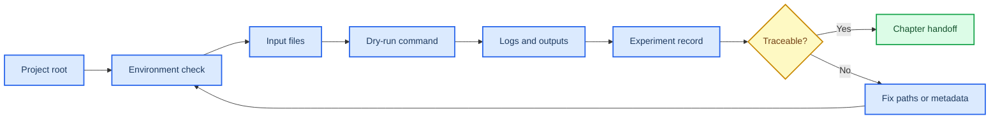

# 第 1 章 Linux 与生化计算基础

## 本章导读

后续对接、MD、Boltz2、蛋白设计和 AI Agent 操作都依赖同一套路径、环境、输入输出和日志规范；这些底层信息不清楚时，结果很难被复查。 Linux 与生化计算基础中的关键问题不是单个命令或界面能够解决的，而是贯穿输入选择、参数设置、结果解释和后续写作的判断问题。读者进入Linux 与生化计算基础时，应先把自己放在真实研究任务中：如果明天需要把这一步交给同组同学复核，哪些信息必须留下，哪些说法必须谨慎。

本章把 Linux 基础转化为计算实验台规范，重点训练工作目录、文件格式、软件环境、日志保存和实验记录。 Linux 与生化计算基础采用教材讲解写法，不把内容压缩成术语表，而是把概念放回它服务的任务场景中解释。读者在Linux 与生化计算基础中需要关注的不是“记住一个名词”，而是理解它如何限制输入、影响输出、进入质量控制，并支持相应层级的写作判断。

学习Linux 与生化计算基础时，建议先通读核心概念，再回到方法流程表逐步核对。表格用于快速定位输入、动作、输出和 QC，正文段落则解释为什么这些字段不能省略；在Linux 与生化计算基础中，这一点应具体落到任务目录、环境记录和输入 QC 表。Linux 与生化计算基础采用这样的顺序，能避免只会照着流程执行却不知道哪一步决定结果可信度。

第 2-8 章会直接复用本章的目录、manifest、日志和记录习惯。 因此，Linux 与生化计算基础不是孤立的工具说明，而是后续章节继续工作的接口层。读者完成Linux 与生化计算基础后，应能把本章记录方式转移到下一章，而不是重新发明日志、参数和边界说明。

## 学习目标

围绕Linux 与生化计算基础，学习目标应落实为可复述、可记录、可复核的判断能力。完成本章后，读者应能够：

- 能说明工作目录、相对路径、绝对路径和环境变量在计算实验中的作用。
- 能为一个最小任务建立 `inputs/`、`outputs/`、`logs/`、`scripts/` 和 `notes/`。
- 能区分原始资料、wiki 笔记、方法卡、实验记录、运行输出和临时缓存。
- 能把失败运行记录成可诊断问题，而不是只写“软件报错”。

在Linux 与生化计算基础中，这些目标既服务课堂复习，也决定后续记录能否被他人复核；若不能用记录说明输入、动作和边界，本章内容仍应停留在练习层级。

## 知识图谱入口

本章在知识图谱中承担运行底座角色：它连接运行环境、数据接口和项目治理三类节点。读者应先理解这些节点的职责，再进入后续具体软件。

在线书籍页面只引用整理后的 wiki、方法卡、文献笔记和资源页，不直接嵌入原始 PDF 或课件图表；在Linux 与生化计算基础中，这一点应具体落到任务目录、环境记录和输入 QC 表。需要追溯来源时，应回到 `book/book_map.toml`、章节精读笔记和相关 Zotero/BibTeX 记录；在Linux 与生化计算基础中，这一点应具体落到任务目录、环境记录和输入 QC 表。

| 来源类型 | 路径 |
|:---|:---|
| 章节来源 | `01_课程章节索引/章节精读/第01章_Linux与生化基础精读.md` |
| 方法来源 | `02_方法笔记/Linux与生化基础.md` |

### Imagegen 知识图谱

{ loading=lazy }

**图1.1 Linux 与生化计算项目结构知识图谱。** 本图为 Imagegen 生成的教学示意图，用中心概念和编号节点概括Linux 与生化计算基础的对象、方法入口、记录字段和证据边界；编号用于正文定位，不承载精确参数或运行结果，术语解释和判断口径以正文表格为准。

| 编号 | 正文权威标签 |
|:---:|:---|
| 1 | 项目根目录 |
| 2 | 命令行环境 |
| 3 | 独立软件环境 |
| 4 | 生化输入文件 |
| 5 | 校验与日志 |
| 6 | 实验记录 |


### Mermaid 结构图



**图1.2 Linux 环境检查记录闭环结构图。** 本图为 Mermaid 教学示意图，展示项目根目录、环境检查、输入文件、dry-run、日志和实验记录之间的闭环关系；箭头表示阅读和记录依赖，不替代真实软件运行或实验验证，具体输入、输出和 QC 标准以正文为准。

Linux 与生化计算基础的 Mermaid 源图和后续 scientific-schematics prompt 见 [Mermaid 图示与示意图设计](../resources/mermaid-schematics.md)。

## 核心概念

Linux 与生化计算基础的核心概念应围绕工作目录、文件格式、环境变量和日志来读，而不是孤立背诵术语。本章最重要的训练，是把每个名词都对应到一个可检查的输入、一个会改变结果的动作，以及一个必须写入记录的 QC 或边界条件；在Linux 与生化计算基础中，这一点应具体落到任务目录、环境记录和输入 QC 表。

阅读下表时，可以把工作目录、文件格式、环境变量和日志拆成几类检查问题：它约束什么来源，改变什么输出，失败时留下什么证据。这样处理后，概念表就成为任务目录、环境记录和输入 QC 表的索引，而不是定义的堆叠。

| 概念 | 教材化定义 |
|:---|:---|
| 工作目录 | 工作目录是命令解析相对路径的坐标原点，决定软件能否找到输入和写出结果。 |
| 文件格式 | FASTA、PDB/mmCIF、SDF、SMILES、YAML、CSV/TSV 等格式是不同工具之间的数据契约，不能只凭扩展名判断可用性。 |
| 软件环境 | conda、Python、CUDA、模型权重和系统变量共同定义一次运行的可复现条件。 |
| 日志与 manifest | 日志记录单次运行，manifest 管理批量任务；二者共同支撑失败诊断和结果追溯。 |
| 实验记录 | 实验记录把输入、命令、参数、输出、QC 和人工判断固定下来，是后续写作和复盘的最低证据单元。 |

使用这张表时，不需要一次记住所有术语。更实用的做法是，在准备任务时先圈出与本次输入直接相关的 2-3 个概念，再检查记录中是否已经有对应字段；在Linux 与生化计算基础中，这一点应具体落到任务目录、环境记录和输入 QC 表。对于不直接参与Linux 与生化计算基础当前任务的概念，可以作为边界提示保留，避免在写作时把背景信息误写成当前结果。

这些概念之间也不是平级堆叠关系。通常先由任务对象确定输入，再由流程参数约束输出，最后由 QC 和证据边界决定能否进入下一步；在Linux 与生化计算基础中，这一点应具体落到任务目录、环境记录和输入 QC 表。读者如果能沿着Linux 与生化计算基础的顺序复述本节内容，就已经掌握了把教材知识转化为研究记录的基本方法。

## 方法流程

Linux 与生化计算基础的方法流程要把从项目根目录到最小 dry-run 的记录闭环讲清楚。读者不应只关心是否跑完命令，而要能说明每一步接收什么输入、执行什么动作、写出什么对象，以及哪一个 QC 决定它能否进入下一步；在Linux 与生化计算基础中，这一点应具体落到任务目录、环境记录和输入 QC 表。

下表按 `输入 | 动作 | 输出 | QC/边界` 组织，适合在执行前当作检查单使用；在Linux 与生化计算基础中，这一点应具体落到任务目录、环境记录和输入 QC 表。对于Linux 与生化计算基础，最后一列尤其重要，因为它把普通操作和可写入研究工作台的证据区分开来。

| 步骤 | 输入 | 动作 | 输出 | QC/边界 |
|:---:|:---|:---|:---|:---|
| 1 | 项目根目录 | 确认当前目录和任务命名。 | 标准任务文件夹。 | `pwd`/`Get-Location` 与预期项目根一致。 |
| 2 | 输入文件 | 检查 FASTA、结构、配体或表格格式。 | 输入 QC 表。 | 链 ID、配体、电荷、列名和空值已记录。 |
| 3 | 软件环境 | 建立或激活独立环境并导出版本。 | 环境记录。 | 关键包、Python、CUDA 或网页版本可追溯。 |
| 4 | 小样例 | 先运行 dry-run 或最小输入。 | 最小输出和日志。 | 能区分路径错误、格式错误和模型错误。 |
| 5 | 正式运行 | 保存标准输出、错误输出和退出状态。 | 日志与 manifest。 | 每个样本都有状态和失败原因。 |
| 6 | 归档 | 把结果写入实验记录或方法卡。 | 可复查记录。 | 文献案例、课程范文和本项目结果分层。 |

执行Linux 与生化计算基础流程表时，应先完成最小样例，再扩大到批量任务。最小样例的价值不是产生有意义的研究结果，而是验证路径、格式、参数和日志是否能闭合；在Linux 与生化计算基础中，这一点应具体落到任务目录、环境记录和输入 QC 表。只有当Linux 与生化计算基础的最小样例能够被完整复核时，后续批量表格、结构、轨迹或候选列表才有进入研究工作台的基础。

流程表也提供了写作时的段落顺序。介绍方法时，先交代输入来源和动作，再说明输出形式，最后说明 QC 含义和不能推出的结论；在Linux 与生化计算基础中，这一点应具体落到任务目录、环境记录和输入 QC 表。Linux 与生化计算基础采用这个顺序比先展示结果更稳健，因为它让读者看到判断链，而不是只看到筛选后的结论。

## 代码案例与软件操作

{ loading=lazy }

**图1.3 环境检查到实验记录流程图。** 本图为 Imagegen 生成的流程图，说明环境检查如何转化为可复核实验记录；它用于说明操作顺序、关键节点和记录交接位置，不代表实验结果，具体命令、参数和边界判断以正文代码块与步骤表为准。

图中编号节点与下表对应：

| 编号 | 流程节点 |
|:---:|:---|
| 1 | 确认 cwd |
| 2 | 检查 Python/conda |
| 3 | 检查输入文件 |
| 4 | 运行 dry-run |
| 5 | 保存日志 |
| 6 | 写入记录 |

本节用于训练 **1 章 Linux 与生化计算基础** 的最小复现意识。该示例用于演示如何把一次环境检查转成最小可复现任务目录；代码可以复制，但输入路径和日期应按实际项目修改。

=== "可复制代码"

    ```powershell
    $ErrorActionPreference = 'Stop'
    $run = '2026-05-31_dry-run'
    New-Item -ItemType Directory -Force -Path $run, "$run/inputs", "$run/outputs", "$run/logs", "$run/notes" | Out-Null
    python --version | Tee-Object -FilePath "$run/logs/python-version.log"
    Get-ChildItem "$run/inputs" -Force | Out-File "$run/logs/input-list.txt"
    "status	path	note" | Set-Content "$run/notes/qc.tsv"
    "dry-run	$run	created minimal reproducible task folder" | Add-Content "$run/notes/qc.tsv"
    ```

=== "配套文件"

    完整示例文件：[`chapter-01-env-check.ps1`](../assets/code/chapter-01-env-check.ps1)

{ loading=lazy }

**图1.4 环境检查 dry-run 软件操作截图。** 本图为本地 dry-run 截图，展示终端输出、目录结构和最小记录字段；截图用于说明界面、文件或表格位置，不代表实验结果，读者应按本机路径替换参数并以正文操作表为准。

| 步骤 | 操作 |
|:---:|:---|
| 1 | 进入项目根目录并确认 `pwd`/`Get-Location`。 |
| 2 | 检查 `python`、`conda`、输入目录和日志目录。 |
| 3 | 把命令、版本、输入路径和退出状态写入记录。 |

### 教材化阅读提示

本节代码应作为环境检查与任务目录初始化的可复查样例来读。它展示的是如何把Linux 与生化计算基础中的一次小任务写成可复制、可失败、可追溯的记录，而不是声明已经完成真实研究运行。

替换参数时，应先替换与Linux 与生化计算基础直接相关的输入路径，再调整会影响解释的阈值、空间范围或模型参数。如果Linux 与生化计算基础的最小样例尚不能解释输出来源，就不应扩大到批量任务。

解读输出时，只记录代码确实生成的对象，例如 manifest、配置、dry-run 表格、截图或日志；在Linux 与生化计算基础中，这一点应具体落到任务目录、环境记录和输入 QC 表。这些对象可以支持任务目录、环境记录和输入 QC 表的整理，但不能自动升级为实验结论；需要形成研究判断时，仍要回到实验记录模板补齐输入、QC、人工复核和待验证项。
## 关键文献

<!-- refs:start -->

本章暂无正式关键文献列表。它承担运行规范、项目目录和可复现记录的基础训练；正式 SCI 文献锚点在后续章节中展开。

<!-- refs:end -->
## 实验/练习入口

本章练习的重点是把Linux 与生化计算基础转化成可交接记录。练习完成后，读者应能让另一个人根据记录复现从项目根目录到最小 dry-run 的记录闭环，并判断是否具备进入第 2 章结构可视化的条件。

建议按以下顺序完成：

1. 建立一个空白计算任务目录，并在 `notes/README.md` 中记录输入来源和公开边界。
2. 为 FASTA、PDB/mmCIF、SDF/SMILES 和 CSV/TSV 各写一行输入 QC 规则。
3. 模拟一次 dry-run 记录，列出命令、参数、预期输出、日志路径和下一步判断。

完成练习后，应检查记录中是否包含任务目录、环境记录和输入 QC 表、失败原因和人工判断。缺少任务目录、环境记录和输入 QC 表时，相关内容仍适合作为课堂尝试，不适合写入正式研究结论。

如果练习借用了文献案例或课程范文，应在Linux 与生化计算基础记录中明确它只是方法参照或边界样例。在Linux 与生化计算基础中，文献案例可以启发流程设计，但不能替代本项目的本地运行结果。

## 使用边界与常见误读

Linux 与生化计算基础最容易被误写的对象是命令成功、路径记录和环境可用性。在Linux 与生化计算基础中，这些对象看起来像结果，但在当前教材层级通常只是模型输出、流程观察、可视化线索或文献案例。

下表用于训练写作降级。在Linux 与生化计算基础中，读者应先判断当前证据最多能支持什么说法，再决定是否写成“提示”“支持”“流程参考”或“仍需验证”。

| 易误读对象 | 稳健表述 | 写作处理 |
|:---|:---|:---|
| 命令成功 | 只能说明程序完成运行。 | 仍需检查输入质量、参数、模型边界和输出 QC。 |
| 路径记录 | 不能单独构成 provenance。 | 必须补充来源、日期、版本、处理步骤和是否人工修改。 |
| 环境可用 | 不等于跨机器可复现。 | 需要导出环境、记录模型权重/API 版本和随机种子。 |
| 正文写作 | 不应承载所有运行细节。 | 具体结果先进入 `04_实验记录/`，长期流程再沉淀到方法卡。 |

边界判断并不是削弱Linux 与生化计算基础的价值，而是说明证据在哪里停止。如果删除某个软件名、截图、分数或文献案例后，结论就无法成立，通常应把该结论降级为候选线索或下一步验证任务；在Linux 与生化计算基础中，这一点应具体落到任务目录、环境记录和输入 QC 表。

只有当Linux 与生化计算基础对应的真实运行记录、复核结果和严格计算或实验支持已经进入项目记录，相关判断才适合升级为更强表述。

本章的边界判断通常发生在命令能够执行之后：路径存在、环境可用、文件格式正确，只能说明流程入口被打开，不能说明后续计算结果已经可信。读者应把每一次成功或失败都写成可追溯的环境证据，尤其要保留工作目录、软件版本、输入文件和日志位置。

## 延伸阅读与下一步

Linux 与生化计算基础的延伸阅读应服务下一次可执行任务，而不是停留在资料补充。读者完成本章后，应能判断哪些内容进入任务目录、环境记录和输入 QC 表，哪些内容进入阅读队列，哪些内容只能作为背景案例。

建议按以下路径进入下一轮学习或研究任务：

1. 先完成一个最小任务目录，再进入第 2 章做结构可视化。
2. 后续章节使用同一套记录语言描述 docking、MD、Boltz2、RFdiffusion/RFD3 和 Chai-1。
3. 需要真实运行时，优先从附录 B 选择实验记录模板。

选择下一步时，应优先检查Linux 与生化计算基础的证据链是否足以支撑转入第 2 章结构可视化。若输入来源、参数、QC 或边界尚未记录清楚，应先补齐本章记录，而不是继续叠加更复杂的工具；在Linux 与生化计算基础中，这一点应具体落到任务目录、环境记录和输入 QC 表。

完成这种转换后，Linux 与生化计算基础就不只是读过的教材内容，而是可以被检索、复核和继续执行的研究资产。

进入下一章之前，最有价值的准备不是安装更多软件，而是把结构文件、配体文件和记录目录放到同一套命名规则下。这样在 PyMOL 或 ChimeraX 中检查结构时，读者可以直接追溯每个截图来自哪个输入，而不是事后猜测文件来源。
