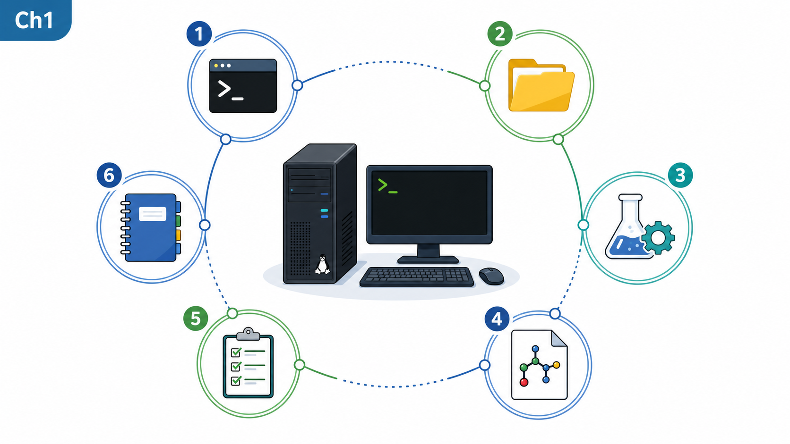
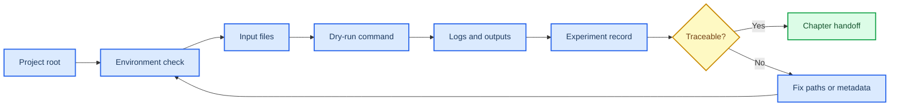
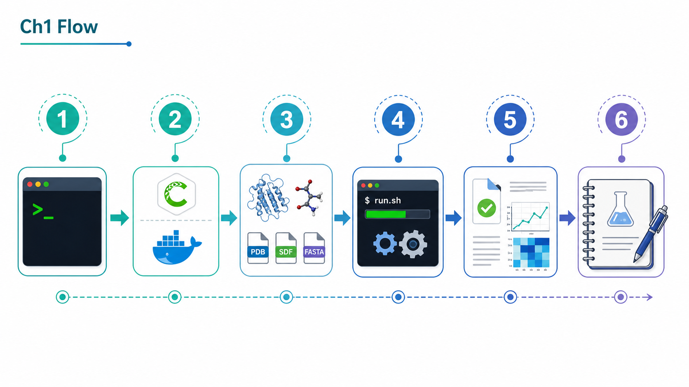
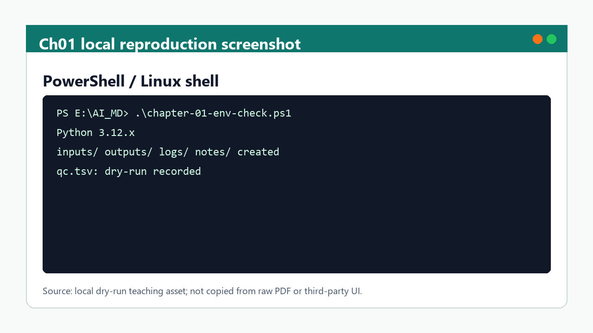

# 第 1 章 Linux 与生化计算基础

## 本章导读

后续对接、MD、Boltz2、蛋白设计和 AI Agent 操作都依赖同一套路径、环境、输入输出和日志规范；这些底层信息不清楚时，结果很难被复查。因此，本章首先界定这一问题场景，再说明需要记录哪些输入、动作、输出和质量控制信息。

本章把 Linux 基础转化为计算实验台规范，重点训练工作目录、文件格式、软件环境、日志保存和实验记录。这里的重点不是追求单个软件操作的完整覆盖，而是让读者形成可复查的判断链：对象是什么、依据来自哪里、结果能支持什么、仍然不能说明什么。

第 2-8 章会直接复用本章的目录、manifest、日志和记录习惯。因此，本章的正文采用“概念定义 -> 流程执行 -> 边界判断 -> 下一步交接”的组织方式。

## 学习目标

完成本章后，读者应能够：

- 能说明工作目录、相对路径、绝对路径和环境变量在计算实验中的作用。
- 能为一个最小任务建立 `inputs/`、`outputs/`、`logs/`、`scripts/` 和 `notes/`。
- 能区分原始资料、wiki 笔记、方法卡、实验记录、运行输出和临时缓存。
- 能把失败运行记录成可诊断问题，而不是只写“软件报错”。

这些目标既面向课堂学习，也面向后续研究记录；如果不能在记录中复述这些要点，相关结果不宜进入项目结论。

## 知识图谱入口

本章在知识图谱中承担运行底座角色：它连接运行环境、数据接口和项目治理三类节点。读者应先理解这些节点的职责，再进入后续具体软件。

在线书籍页面只引用整理后的 wiki、方法卡、文献笔记和资源页，不直接嵌入原始 PDF 或课件图表。需要追溯来源时，应回到 `book/book_map.toml`、章节精读笔记和相关 Zotero/BibTeX 记录。

| 来源类型 | 路径 |
|:---|:---|
| 章节来源 | `01_课程章节索引/章节精读/第01章_Linux与生化基础精读.md` |
| 方法来源 | `02_方法笔记/Linux与生化基础.md` |

### Imagegen 知识图谱

{ loading=lazy }

| 编号 | 正文权威标签 |
|:---:|:---|
| 1 | 项目根目录 |
| 2 | 命令行环境 |
| 3 | 独立软件环境 |
| 4 | 生化输入文件 |
| 5 | 校验与日志 |
| 6 | 实验记录 |

这张图由 Imagegen 生成，用于帮助读者把本章对象、方法和证据关系先组织成可记忆结构。图中只保留短标题和编号，精确术语、参数和边界以上表及正文为准。

### Mermaid 结构图



完整图示设计和后续科学示意图 prompt 见 [Mermaid 图示与示意图设计](../resources/mermaid-schematics.md)。

## 核心概念

本节只保留支撑后续判断的核心概念。每个概念都应能回答一个具体问题：它约束什么输入、影响什么输出、需要怎样记录。

| 概念 | 教材化定义 |
|:---|:---|
| 工作目录 | 工作目录是命令解析相对路径的坐标原点，决定软件能否找到输入和写出结果。 |
| 文件格式 | FASTA、PDB/mmCIF、SDF、SMILES、YAML、CSV/TSV 等格式是不同工具之间的数据契约，不能只凭扩展名判断可用性。 |
| 软件环境 | conda、Python、CUDA、模型权重和系统变量共同定义一次运行的可复现条件。 |
| 日志与 manifest | 日志记录单次运行，manifest 管理批量任务；二者共同支撑失败诊断和结果追溯。 |
| 实验记录 | 实验记录把输入、命令、参数、输出、QC 和人工判断固定下来，是后续写作和复盘的最低证据单元。 |

阅读本节时，应优先检查这些概念能否落到文件、参数、图像、表格或记录字段上。不能落地的说法，在后续研究写作中应作为背景描述，而不是证据。

## 方法流程

本章流程按“输入 -> 动作 -> 输出 -> QC”的顺序组织。这样做的目的，是让每一步都能被复查，而不是只留下一个最终截图或分数。

| 步骤 | 输入 | 动作 | 输出 | QC/边界 |
|:---:|:---|:---|:---|:---|
| 1 | 项目根目录 | 确认当前目录和任务命名。 | 标准任务文件夹。 | `pwd`/`Get-Location` 与预期项目根一致。 |
| 2 | 输入文件 | 检查 FASTA、结构、配体或表格格式。 | 输入 QC 表。 | 链 ID、配体、电荷、列名和空值已记录。 |
| 3 | 软件环境 | 建立或激活独立环境并导出版本。 | 环境记录。 | 关键包、Python、CUDA 或网页版本可追溯。 |
| 4 | 小样例 | 先运行 dry-run 或最小输入。 | 最小输出和日志。 | 能区分路径错误、格式错误和模型错误。 |
| 5 | 正式运行 | 保存标准输出、错误输出和退出状态。 | 日志与 manifest。 | 每个样本都有状态和失败原因。 |
| 6 | 归档 | 把结果写入实验记录或方法卡。 | 可复查记录。 | 文献案例、课程范文和本项目结果分层。 |

执行时应先完成小样例或 dry-run，再扩大到批量任务。任何失败样本、低置信度结果或人工排除理由，都应保留在 manifest 或实验记录中。

从教学角度看，本章的流程还承担一个基准作用：后续任何复杂模型输出，都必须能被还原到“输入文件、运行环境、命令参数、输出目录、人工判断”这五类信息。如果其中任一类信息缺失，读者可以先把该结果标为“记录不完整”，而不是急于讨论科学意义。这种处理方式看似保守，但能有效避免把路径错误、环境差异或临时文件覆盖误读为模型性能问题。

在个人研究工作台中，本章对应的是“先建容器再运行”的习惯。每个任务都应有独立目录、输入清单、日志和简短说明；只有这样，后续章节中的结构图、score、轨迹、亲和力或设计候选才有明确上下文。如果一个结果不能回答“从哪里来、怎么跑、输出在哪里、谁判断过”四个问题，它就只能作为临时探索材料，不宜进入课件、综述或课题申请。这一规则也方便后续 AI Agent 接手，因为 Agent 可以先读取目录和日志，而不必从散乱文件中猜测任务状态。因此，本章的练习应被视为全书的通用检查表。后续每章只是在这一检查表上增加领域特定字段。读者完成本章后，应能独立判断一个计算任务是否具备继续分析的最低记录条件。这也是后续质量控制的起点。

课堂练习中，建议把本章检查表反复用于不同软件场景，直到路径、环境和日志记录成为默认动作。

这一习惯会降低后续章节的排错成本，也能让同一实验被他人复核。

## 代码案例与软件操作

{ loading=lazy }

**环境检查到实验记录流程图** 的编号含义如下：

| 编号 | 流程节点 |
|:---:|:---|
| 1 | 确认 cwd |
| 2 | 检查 Python/conda |
| 3 | 检查输入文件 |
| 4 | 运行 dry-run |
| 5 | 保存日志 |
| 6 | 写入记录 |

本节用于训练 **1 章 Linux 与生化计算基础** 的最小复现意识。该示例用于演示如何把一次环境检查转成最小可复现任务目录；代码可以复制，但输入路径和日期应按实际项目修改。

=== "可复制代码"

    ```powershell
    $ErrorActionPreference = 'Stop'
    $run = '2026-05-31_dry-run'
    New-Item -ItemType Directory -Force -Path $run, "$run/inputs", "$run/outputs", "$run/logs", "$run/notes" | Out-Null
    python --version | Tee-Object -FilePath "$run/logs/python-version.log"
    Get-ChildItem "$run/inputs" -Force | Out-File "$run/logs/input-list.txt"
    "status	path	note" | Set-Content "$run/notes/qc.tsv"
    "dry-run	$run	created minimal reproducible task folder" | Add-Content "$run/notes/qc.tsv"
    ```

=== "配套文件"

    完整示例文件：[`chapter-01-env-check.ps1`](../assets/code/chapter-01-env-check.ps1)

{ loading=lazy }

| 步骤 | 操作 |
|:---:|:---|
| 1 | 进入项目根目录并确认 `pwd`/`Get-Location`。 |
| 2 | 检查 `python`、`conda`、输入目录和日志目录。 |
| 3 | 把命令、版本、输入路径和退出状态写入记录。 |

!!! warning "常见错误"
    不要只截取终端成功画面；必须保留命令文本、环境版本、输入路径和日志路径。

## 关键文献

<!-- refs:start -->

本章暂无正式关键文献列表。它承担运行规范、项目目录和可复现记录的基础训练；正式 SCI 文献锚点在后续章节中展开。

<!-- refs:end -->
## 实验/练习入口

本章练习强调可复查记录，而不是追求一次性完成复杂工具链。建议按以下顺序完成：

1. 建立一个空白计算任务目录，并在 `notes/README.md` 中记录输入来源和公开边界。
2. 为 FASTA、PDB/mmCIF、SDF/SMILES 和 CSV/TSV 各写一行输入 QC 规则。
3. 模拟一次 dry-run 记录，列出命令、参数、预期输出、日志路径和下一步判断。

完成练习后，应能把结果写入 `04_实验记录/` 或 `07_研究工作台/` 的对应页面。不能写入记录的练习，只能算操作尝试。

## 使用边界与常见误读

本节采用保守表述阶梯：预测、评分、可视化和文献案例通常只能写成“提示”“支持”或“可能一致”，除非有直接实验或严格验证，否则不写成“证明”。

| 易误读对象 | 稳健表述 | 写作处理 |
|:---|:---|:---|
| 命令成功 | 只能说明程序完成运行。 | 仍需检查输入质量、参数、模型边界和输出 QC。 |
| 路径记录 | 不能单独构成 provenance。 | 必须补充来源、日期、版本、处理步骤和是否人工修改。 |
| 环境可用 | 不等于跨机器可复现。 | 需要导出环境、记录模型权重/API 版本和随机种子。 |
| 正文写作 | 不应承载所有运行细节。 | 具体结果先进入 `04_实验记录/`，长期流程再沉淀到方法卡。 |

写作时，如果一个结论只能由模型分数、单次截图或文献案例间接支持，应主动补上“仍需验证”“适用于该模型/该输入”“不等同于本项目结果”等边界。

## 延伸阅读与下一步

完成本章后，建议按以下路径进入下一轮学习或研究任务：

1. 先完成一个最小任务目录，再进入第 2 章做结构可视化。
2. 后续章节使用同一套记录语言描述 docking、MD、Boltz2、RFdiffusion/RFD3 和 Chai-1。
3. 需要真实运行时，优先从附录 B 选择实验记录模板。

[返回首页](../index.md)。
