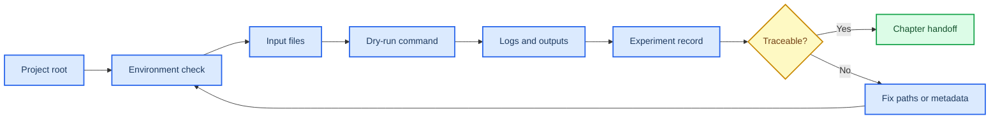

# 第 1 章 Linux 与生化计算基础

## 本章导读

计算药物设计的第一步通常不是打开某个模型，而是确认任务能否被稳定复现。一个项目根目录、一个可解释的软件环境、一组输入文件和一份运行日志，决定了后续结果能否从“我本机跑过”变成“别人可以检查”。本章把 Linux 与生化计算基础放在这个研究场景中讲解：读者需要学会留下足够的环境和路径证据，而不是只记住几个命令。

本章围绕项目根目录、命令行环境、输入文件、dry-run、日志和实验记录建立最小闭环。这个闭环会在后续章节反复出现：第 3 章需要它管理 receptor 和 ligand library，第 4 章需要它保存轨迹分析日志，第 5 章需要它记录模型输入，第 6 章需要它追踪 seed、checkpoint 和候选淘汰原因。

学习本章时，建议把每一个命令都看成记录系统的一部分。命令本身只回答“是否执行过”，而路径、版本、输入、输出和失败原因回答“是否可以复查”。当读者能够把一次最小 dry-run 写成可交接记录时，才具备进入结构准备和后续 AIDD 流程的基础。

如果读者只记住命令而不记录运行条件，后续错误往往会被误判为模型问题。本章要求把 cwd、环境、输入和日志同时保存，是为了让每一次失败都能被定位到文件、依赖或参数，而不是停留在“可能哪里没装好”的模糊状态。

## 学习目标

本章目标不是训练某一个 shell 命令，而是建立计算任务的可交接习惯。完成本章后，读者应能够：

- 能说明工作目录、相对路径、绝对路径和环境变量在计算实验中的作用。
- 能为一个最小任务建立 `inputs/`、`outputs/`、`logs/`、`scripts/` 和 `notes/`。
- 能区分原始资料、wiki 笔记、方法卡、实验记录、运行输出和临时缓存。
- 能把失败运行记录成可诊断问题，而不是只写“软件报错”。

这些目标服务后续所有章节。环境、路径、日志和实验记录如果没有形成闭环，后面的 docking、MD、亲和力预测或蛋白设计即使能够运行，也很难被他人复查。

## 知识图谱入口

本章在知识图谱中承担运行底座角色：它连接运行环境、数据接口和项目治理三类节点。读者应先理解这些节点的职责，再进入后续具体软件。

在线书籍页面只引用整理后的 wiki、方法卡、文献笔记和资源页，不直接嵌入原始 PDF 或课件图表；在Linux 与生化计算基础中，这一点应具体落到任务目录、环境记录和输入 QC 表。需要追溯来源时，应回到 `book/book_map.toml`、章节精读笔记和相关 Zotero/BibTeX 记录；在Linux 与生化计算基础中，这一点应具体落到任务目录、环境记录和输入 QC 表。

| 来源类型 | 路径 |
|:---|:---|
| 章节来源 | `01_课程章节索引/章节精读/第01章_Linux与生化基础精读.md` |
| 方法来源 | `02_方法笔记/Linux与生化基础.md` |

### Imagegen 知识图谱

{ loading=lazy }

**图1.1 Linux 与生化计算项目结构知识图谱。** 本图为 Imagegen 生成的教学示意图，用中心概念和编号节点概括Linux 与生化计算基础的对象、方法入口、记录字段和证据边界；编号用于正文定位，不承载精确参数或运行结果，术语解释和判断口径以正文表格为准。 节点编号：1=项目根目录；2=命令行环境；3=独立软件环境；4=生化输入文件；5=校验与日志；6=实验记录。

### Mermaid 结构图



**图1.2 Linux 环境检查记录闭环结构图。** 本图为 Mermaid 教学示意图，展示项目根目录、环境检查、输入文件、dry-run、日志和实验记录之间的闭环关系；箭头表示阅读和记录依赖，不替代真实软件运行或实验验证，具体输入、输出和 QC 标准以正文为准。

Linux 与生化计算基础的 Mermaid 源图和后续 scientific-schematics prompt 见 [Mermaid 图示与示意图设计](../resources/mermaid-schematics.md)。

## 核心概念

Linux 与生化计算基础的核心概念可以按“任务在哪里、用什么环境、读什么输入、写什么证据”来理解。它们不直接产生药物设计结论，但决定所有后续结论是否可追溯。

| 概念 | 教材化定义 |
|:---|:---|
| 工作目录 | 工作目录是命令解析相对路径的坐标原点，决定软件能否找到输入和写出结果。 |
| 文件格式 | FASTA、PDB/mmCIF、SDF、SMILES、YAML、CSV/TSV 等格式是不同工具之间的数据契约，不能只凭扩展名判断可用性。 |
| 软件环境 | conda、Python、CUDA、模型权重和系统变量共同定义一次运行的可复现条件。 |
| 日志与 manifest | 日志记录单次运行，manifest 管理批量任务；二者共同支撑失败诊断和结果追溯。 |
| 实验记录 | 实验记录把输入、命令、参数、输出、QC 和人工判断固定下来，是后续写作和复盘的最低证据单元。 |

使用概念表时，先定位当前任务的最小运行单位：是一次环境检查、一次格式转换，还是一次脚本 dry-run。随后检查记录中是否已有 cwd、软件环境、输入文件、输出目录和日志路径。

这些概念之间有明确顺序。项目根目录限定文件位置，软件环境限定可执行条件，输入文件限定任务对象，日志和实验记录则保存复核证据。只要其中一环缺失，后续章节即使得到输出，也只能作为课堂练习，而不能作为研究记录。

例如，同一个脚本在不同 conda 环境下可能调用不同版本的 Python 包；同一个输入文件如果没有记录来源和处理步骤，也无法判断后续错误来自格式、路径还是软件参数。概念表应被当作记录字段清单使用，而不是课后术语表。

## 方法流程

本章方法流程从“确认位置”开始，到“写入记录”结束。执行顺序看似基础，但它能把错误尽早限制在路径、环境或输入阶段，避免在后续模型结果中才发现来源不清。

| 步骤 | 输入 | 动作 | 输出 | QC/边界 |
|:---:|:---|:---|:---|:---|
| 1 | 项目根目录 | 确认当前目录和任务命名。 | 标准任务文件夹。 | `pwd`/`Get-Location` 与预期项目根一致。 |
| 2 | 输入文件 | 检查 FASTA、结构、配体或表格格式。 | 输入 QC 表。 | 链 ID、配体、电荷、列名和空值已记录。 |
| 3 | 软件环境 | 建立或激活独立环境并导出版本。 | 环境记录。 | 关键包、Python、CUDA 或网页版本可追溯。 |
| 4 | 小样例 | 先运行 dry-run 或最小输入。 | 最小输出和日志。 | 能区分路径错误、格式错误和模型错误。 |
| 5 | 正式运行 | 保存标准输出、错误输出和退出状态。 | 日志与 manifest。 | 每个样本都有状态和失败原因。 |
| 6 | 归档 | 把结果写入实验记录或方法卡。 | 可复查记录。 | 文献案例、课程范文和本项目结果分层。 |

执行时先做最小 dry-run，而不是直接运行完整任务。最小样例的价值在于暴露路径、权限、依赖和输入格式问题；它不需要产生科学结论，只需要确认记录链条能够闭合。

写作或汇报时，可以按这张流程表组织方法段：先说明任务目录和环境，再说明输入文件与检查方式，最后说明日志、输出和记录位置。这样形成的文本能直接服务后续实验记录，而不是停留在命令清单。

在课堂练习中，读者可以故意制造一个路径错误或缺失文件错误，再观察日志如何暴露问题。这样的反向练习能帮助理解为什么项目根目录和输入清单必须先于模型运行完成。

实际执行时，还应把“预期输出”和“实际输出”分开记录。预期输出帮助读者判断任务是否设计正确，实际输出帮助读者定位差异；两者同时存在，后续软件运行失败时才不会把路径问题误判为科学问题。

## 代码案例与软件操作

{ loading=lazy }

**图1.3 环境检查到实验记录流程图。** 本图为 Imagegen 生成的流程图，说明环境检查如何转化为可复核实验记录；它用于说明操作顺序、关键节点和记录交接位置，不代表实验结果，具体命令、参数和边界判断以正文代码块与步骤表为准。 流程编号：1=确认 cwd；2=检查 Python/conda；3=检查输入文件；4=运行 dry-run；5=保存日志；6=写入记录。

本节用于训练 **1 章 Linux 与生化计算基础** 的最小复现意识。该示例用于演示如何把一次环境检查转成最小可复现任务目录；代码可以复制，但输入路径和日期应按实际项目修改。

=== "可复制代码"

    ```powershell
    $ErrorActionPreference = 'Stop'
    $run = '2026-05-31_dry-run'
    New-Item -ItemType Directory -Force -Path $run, "$run/inputs", "$run/outputs", "$run/logs", "$run/notes" | Out-Null
    python --version | Tee-Object -FilePath "$run/logs/python-version.log"
    Get-ChildItem "$run/inputs" -Force | Out-File "$run/logs/input-list.txt"
    "status	path	note" | Set-Content "$run/notes/qc.tsv"
    "dry-run	$run	created minimal reproducible task folder" | Add-Content "$run/notes/qc.tsv"
    ```

=== "配套文件"

    完整示例文件：[`chapter-01-env-check.ps1`](../assets/code/chapter-01-env-check.ps1)

{ loading=lazy }

**图1.4 环境检查 dry-run 软件操作截图。** 本图为本地 dry-run 截图，展示终端输出、目录结构和最小记录字段；截图用于说明界面、文件或表格位置，不代表实验结果，读者应按本机路径替换参数并以正文操作表为准。

| 步骤 | 操作 |
|:---:|:---|
| 1 | 进入项目根目录并确认 `pwd`/`Get-Location`。 |
| 2 | 检查 `python`、`conda`、输入目录和日志目录。 |
| 3 | 把命令、版本、输入路径和退出状态写入记录。 |

### 教材化阅读提示

本节代码应作为环境检查与任务目录初始化的可复查样例来读。它展示的是如何把Linux 与生化计算基础中的一次小任务写成可复制、可失败、可追溯的记录，而不是声明已经完成真实研究运行。

替换参数时，应先替换与Linux 与生化计算基础直接相关的输入路径，再调整会影响解释的阈值、空间范围或模型参数。如果Linux 与生化计算基础的最小样例尚不能解释输出来源，就不应扩大到批量任务。

解读输出时，只记录代码确实生成的对象，例如 manifest、配置、dry-run 表格、截图或日志；在Linux 与生化计算基础中，这一点应具体落到任务目录、环境记录和输入 QC 表。这些对象可以支持任务目录、环境记录和输入 QC 表的整理，但不能自动升级为实验结论；需要形成研究判断时，仍要回到实验记录模板补齐输入、QC、人工复核和待验证项。
## 关键文献

文献使用说明：本章主要依赖项目方法卡和运行规范组织教学内容，当前不设置正式关键文献。后续若加入 Linux、conda、容器或 HPC 规范类参考，应先写入 references/ 元数据，再由引用生成脚本更新本区。

<!-- refs:start -->

本章暂无正式关键文献列表。它承担运行规范、项目目录和可复现记录的基础训练；正式 SCI 文献锚点在后续章节中展开。

<!-- refs:end -->

## 实验/练习入口

本章练习的重点是把Linux 与生化计算基础转化成可交接记录。练习完成后，读者应能让另一个人根据记录复现从项目根目录到最小 dry-run 的记录闭环，并判断是否具备进入第 2 章结构可视化的条件。

建议按以下顺序完成：

1. 建立一个空白计算任务目录，并在 `notes/README.md` 中记录输入来源和公开边界。
2. 为 FASTA、PDB/mmCIF、SDF/SMILES 和 CSV/TSV 各写一行输入 QC 规则。
3. 模拟一次 dry-run 记录，列出命令、参数、预期输出、日志路径和下一步判断。

完成练习后，应检查记录中是否包含任务目录、环境记录和输入 QC 表、失败原因和人工判断。缺少任务目录、环境记录和输入 QC 表时，相关内容仍适合作为课堂尝试，不适合写入正式研究结论。

如果练习借用了文献案例或课程范文，应在Linux 与生化计算基础记录中明确它只是方法参照或边界样例。在Linux 与生化计算基础中，文献案例可以启发流程设计，但不能替代本项目的本地运行结果。

## 使用边界与常见误读

本章最容易被误读的对象是“命令成功”和“环境可用”。它们只说明当前条件下完成了某次操作，不自动说明后续计算结果可靠。

本章使用边界表时，应把环境和记录类输出限定为运行条件证据，不能把它们提升为科学结论。

| 易误读对象 | 稳健表述 | 写作处理 |
|:---|:---|:---|
| 命令成功 | 只能说明程序完成运行。 | 仍需检查输入质量、参数、模型边界和输出 QC。 |
| 路径记录 | 不能单独构成 provenance。 | 必须补充来源、日期、版本、处理步骤和是否人工修改。 |
| 环境可用 | 不等于跨机器可复现。 | 需要导出环境、记录模型权重/API 版本和随机种子。 |
| 正文写作 | 不应承载所有运行细节。 | 具体结果先进入 `04_实验记录/`，长期流程再沉淀到方法卡。 |

环境记录的证据边界应停在“可复查的运行条件”。如果缺少输入文件哈希、软件版本或日志路径，就不能把一次成功执行写成稳定流程。

稳健写法是把命令输出、目录结构和日志作为运行证据，再把科学判断留给后续章节的结构复核、模型输出和实验验证。

因此，本章的稳健结论通常是“环境与输入记录已具备复查条件”，而不是“后续计算一定可靠”。后续可靠性仍要由结构复核、模型 QC 和实验验证逐层建立。

如果需要在组会或报告中展示本章结果，建议展示记录表和日志位置，而不是展示“运行成功”四个字。记录表能让听众知道任务可如何复查，也能让后续章节复用同一套证据语言。

## 延伸阅读与下一步

完成本章后，下一步不是继续堆命令，而是把环境记录转交给第 2 章结构可视化任务。读者应优先完成三件事：

1. 固定项目根目录、输入目录和输出目录命名。
2. 为每一次 dry-run 留下日志、参数和失败原因。
3. 在需要真实运行时，先从附录 B 选择实验记录模板，再进入具体软件流程。

如果这些记录已经齐全，后续章节可以直接复用同一套语言描述 receptor、trajectory、YAML、seed 和候选队列。

进入第 2 章前，建议读者把本章输出整理成一个固定模板：任务名、运行目录、环境名、输入文件、预期输出、实际日志和下一步判断。这个模板以后可以直接复制到对接、MD、Boltz2 或蛋白设计记录中。若某一步暂时无法复现，应先在日志中保留失败状态，而不是删除失败样本。失败记录本身也是后续排查和教学复盘的重要材料。

第 1 章的下一步标准很具体：读者应能把自己的任务目录交给另一个人，并让对方在不询问额外路径的情况下找到输入、日志和输出。若做不到这一点，说明后续章节还不适合进入真实运行。把这个标准固定下来，可以减少后面因路径和环境混乱造成的重复劳动。
