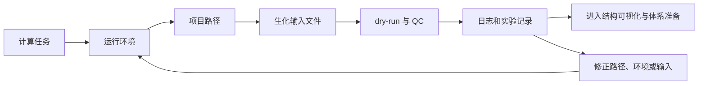

# 第 1 章 Linux、计算环境与生化文件基础

## 本章导读

AI 辅助药物设计的第一步不是运行模型，而是把计算任务放进一个可复查的环境。别人拿到你的记录后，应能看清输入从哪里来、命令在哪里运行、输出写到哪里、失败信息保存在哪里。

本章面向几乎没有计算机和编程背景的读者。我们不把 Linux 写成命令大全，也不要求一次完成所有安装。本章要建立的是判断能力：知道自己正在用什么环境、处理什么文件、留下什么证据。

下图展示本章的学习闭环。它是教学示意图，不代表真实运行结果；真实结果仍要由命令、日志、输入文件和人工 QC 支撑。



读完本章后，读者不需要成为系统管理员。更现实的目标是：能创建稳定任务目录，能看懂最小命令，能区分输入文件类型，能把运行条件写成记录。

## 学习目标

本章目标围绕三类问题展开：任务在哪里运行，文件如何被找到，环境和结果怎样留下记录。

这些目标会在后续章节反复出现。第 2 章要复核结构文件，第 3 章要准备受体和配体，第 4 章以后要保存长任务日志和模型输出。

- 判断 Windows、WSL、虚拟机和 Linux 服务器适合什么任务。
- 解释终端、shell、命令、参数、路径和当前目录。
- 建立 `inputs/`、`outputs/`、`logs/`、`scripts/`、`notes/` 项目目录。
- 区分环境、依赖、包管理器、Conda、pip、CUDA 和 GPU。
- 用常用命令查看目录、文件、日志和运行状态。
- 识别 FASTA、PDB/mmCIF、SDF、MOL2、SMILES 和表格输入。
- 把一次 dry-run 写成包含输入、环境、日志和 QC 的记录。

学习时不要把目标理解成“记住所有命令”。更好的检查方式是：拿到一个任务目录后，你能否说明每个文件夹的用途，能否找到日志，能否判断下一步该补输入、修环境还是检查格式。

## 1.1 Linux 系统介绍与安装

操作系统负责管理电脑上的文件、程序、内存、网络和硬件。Windows 更常见于日常办公、文件整理和可视化软件；Linux 更常见于服务器、批处理脚本和科研计算工具。

Linux 不是单个软件，而是一类操作系统。Ubuntu 是常用 Linux 发行版。很多 AI 药物设计工具优先给 Linux 提供安装说明，是因为服务器部署、命令行批处理和 GPU 依赖在 Linux 上更常见。

选择环境时，不要先问“哪一个最好”，而要问“这个任务需要什么”。下表把常见环境放在一起比较。

| 环境 | 适合任务 | 检查重点 |
|:---|:---|:---|
| Windows PowerShell | 文件整理、记录模板、轻量 dry-run。 | 路径、脚本输出、截图和交接记录。 |
| WSL | 学习 Linux 命令、跑轻量脚本。 | Ubuntu 版本、文件位置、是否需要 GPU。 |
| 虚拟机 | 练习 Linux 桌面和基础操作。 | 磁盘、内存、网络和共享目录。 |
| Linux 服务器 | 长时间运行、批处理、GPU 任务。 | SSH、权限、显存、驱动、CUDA、日志路径。 |

WSL 是 Windows Subsystem for Linux。它让 Windows 用户在本机使用 Linux 命令环境。它适合学习命令和小脚本，但复杂 GPU 任务仍要单独检查驱动、CUDA 和框架支持。

虚拟机是在一个操作系统里运行另一个操作系统。它适合练习 Ubuntu 桌面和基础命令，但通常不是深度学习 GPU 主环境。

本节的边界是：多数结构预测、对接、分子模拟和深度学习工具优先支持 Linux 环境，但不能把 Linux 支持绝对化为全部模型的共同要求。

- 学习命令：优先 WSL 或虚拟机。
- 整理文件和截图：Windows PowerShell 足够。
- 长时间 GPU 任务：优先 Linux 服务器或独立 Ubuntu 主机。
- 不能确认 GPU 栈时：先做输入 QC 和 dry-run，不直接上大模型。

进入下一节前，读者应写下一句话：本次任务准备在哪个环境运行，为什么选这个环境，哪些条件还没有确认。

## 1.2 Linux 目录结构与路径管理

文件夹是存放文件的位置。路径是文件或文件夹的地址。计算工具找不到输入文件时，问题常常不是模型，而是当前目录、文件名、空格、大小写或权限不对。

当前目录是终端正在工作的文件夹。Linux 常用 `pwd` 查看当前目录，PowerShell 常用 `Get-Location`。相对路径都从当前目录开始计算。

绝对路径从系统根位置开始写完整地址。Linux 常从 `/` 开始，例如 `/home/user/project`；Windows 常带盘符，例如 `E:\Codex_Projects\AI_MD`。

> 表格用法：先确认路径对象的含义，再检查当前目录和输入文件路径。

| 路径对象 | 零基础解释 | 常见风险 |
|:---|:---|:---|
| `/home/用户名` | 普通用户工作区。 | 把它和管理员目录 `/root` 混淆。 |
| `/root` | 管理员用户目录。 | 普通任务不应随意放在这里。 |
| `.` 开头文件 | 隐藏配置文件，如 `.bashrc`。 | 修改后忘记记录，环境难以复查。 |
| `PATH` | 系统寻找命令的位置列表。 | 装了软件但命令找不到。 |
| cwd | current working directory，当前目录。 | 运行脚本时相对路径指向错误。 |

相对路径不从系统根位置开始，而是相对于当前目录。例如当前目录是 `task1/`，那么 `inputs/receptor.pdb` 指的是 `task1/inputs/receptor.pdb`。

本书统一使用一个最小项目目录。它不追求复杂，而是让输入、输出、日志、脚本和判断分开保存。

| 子目录 | 放什么 | 为什么要分开 |
|:---|:---|:---|
| `inputs/` | FASTA、PDB、SDF、MOL2、CSV 等输入。 | 保留输入来源和处理状态。 |
| `outputs/` | 软件生成的结果。 | 避免结果散落在脚本目录。 |
| `logs/` | 命令输出、错误信息和环境记录。 | 失败时能回看原因。 |
| `scripts/` | 本次运行使用的脚本。 | 记录实际执行的代码。 |
| `notes/` | QC 表、说明和下一步判断。 | 保存人工判断和交接信息。 |

路径记录不是完整 provenance。provenance 指数据和结果的来源、处理历史和责任链。除了路径，还要记录来源、日期、版本、处理步骤和人工判断。

本节结束时，读者应能创建一个空任务目录，并解释为什么 `inputs/` 和 `outputs/` 不能混在一起。

## 1.3 常用命令与文本查看

终端里输入的命令通常由三部分组成：程序名、选项或参数、输入对象。比如 `ls -lh inputs` 中，`ls` 是程序名，`-lh` 是选项，`inputs` 是要查看的文件夹。

参数会改变命令行为。不同 shell 对引号、路径和通配符的处理可能不同，所以 Linux Bash 和 Windows PowerShell 命令不能总是直接互换。

命令运行后会产生输出。标准输出是正常信息，错误输出是报错信息。正式任务要把两类信息保存到 `logs/`，否则失败后很难追查。

> 表格用法：按任务查命令，不按字母顺序背命令。

| 任务 | Linux Bash | PowerShell | 判断方法 |
|:---|:---|:---|:---|
| 查看当前位置 | `pwd` | `Get-Location` | 输出应是任务根目录或预期子目录。 |
| 进入目录 | `cd inputs` | `Set-Location inputs` | 再次查看当前位置。 |
| 列出文件 | `ls -lh` | `Get-ChildItem` | 看文件名、大小和修改时间。 |
| 新建目录 | `mkdir logs` | `New-Item -ItemType Directory logs` | 查看目录是否出现。 |
| 复制文件 | `cp a b` | `Copy-Item a b` | 原文件仍应保留。 |
| 移动/改名 | `mv a b` | `Move-Item a b` | 原位置不再有旧文件。 |
| 查看文件开头 | `head file` | `Get-Content file -TotalCount 10` | 适合快速看表头或序列 ID。 |
| 查看文件末尾 | `tail file` | `Get-Content file -Tail 20` | 适合检查日志最后的错误。 |

`sudo` 表示用管理员权限执行。它可以安装系统软件，也可能改坏系统配置。本书只在必要安装场景提到它，不把 `sudo` 当成修复所有错误的方法。

`chmod` 用于修改文件权限。脚本不能执行时，常见处理是 `chmod +x script.sh`。这只改变执行权限，不会检查脚本内容是否正确。

`vim` 是终端文本编辑器。初学者先记住四个动作。

- 按 `i` 进入编辑。
- 按 `Esc` 回到命令模式。
- 输入 `:wq` 保存退出。
- 输入 `:q!` 放弃退出。

命令成功只说明程序执行完成。它不能证明输入文件正确、参数合理或科学结论可靠。下一步要检查输出文件、日志和 QC 表。

## 1.4 Conda、pip、CUDA 与基础环境搭建

环境是软件运行所需条件的组合。它包括操作系统、Python 版本、安装包、环境变量、GPU 驱动和 CUDA 等内容。

依赖是某个软件运行时需要的其他软件或库。两个工具可能需要不同版本的依赖，所以把所有工具装进一个全局 Python，常会造成冲突。

包管理器是安装和管理软件包的工具。APT、Conda 和 pip 都是包管理器，但它们负责的层级不同。

> 表格用法：先判断问题属于哪一层，再找对应检查命令。

| 层级 | 工具或术语 | 负责什么 | 常见检查 |
|:---|:---|:---|:---|
| 系统包 | APT | 安装 Ubuntu 系统层软件。 | `apt --version` |
| Python 环境 | Conda | 创建隔离环境，管理部分依赖。 | `conda env list` |
| Python 包 | pip | 安装 Python 库。 | `pip list` |
| GPU 驱动 | NVIDIA driver | 让系统识别 NVIDIA 显卡。 | `nvidia-smi` |
| CUDA | CUDA toolkit/runtime | 让深度学习框架调用 GPU。 | `nvcc --version` 或框架自检 |

Conda 的价值不是“比 pip 高级”，而是能为不同任务创建独立环境。例如 docking、MD 和 AI 结构预测最好使用不同环境，避免依赖互相覆盖。

pip 常用于安装 Python 包。它可以在 Conda 环境里使用，但安装前应确认当前环境名，避免把包装到错误位置。

CUDA 连接 NVIDIA GPU 和计算框架。`nvidia-smi` 能看到 GPU，说明驱动可见；这不等于 PyTorch、TensorFlow 或某个模型一定能使用 GPU。

> 表格用法：区分检查项能说明什么，避免把“看见版本号”误读成“模型一定能跑”。

| 检查项 | 能说明什么 | 不能说明什么 |
|:---|:---|:---|
| `python --version` | 当前 Python 可运行。 | 不能说明包版本正确。 |
| `conda env list` | Conda 环境存在。 | 不能说明当前任务正在用它。 |
| `pip list` | 当前环境安装了哪些包。 | 不能说明包之间兼容。 |
| `nvidia-smi` | NVIDIA 驱动可见 GPU。 | 不能说明 CUDA 依赖匹配。 |
| `nvcc --version` | CUDA 编译工具可见。 | 不能说明深度学习框架可用。 |

没有本地 GPU，不代表不能学习本章。读者可以先完成目录、输入 QC、环境记录和 dry-run。真实 GPU 任务再交给远程服务器或云服务器。

本节输出应是一份环境记录，而不是一套固定安装命令。CUDA、驱动和模型依赖会变化，教材只给检查方法，不写唯一推荐版本。

## 1.5 Jupyter、VS Code 与 SSH 远程工作

很多科研计算不在本地电脑运行，而是在远程服务器运行。本地电脑负责连接、编辑脚本、查看日志和整理结果。

SSH 是安全登录远程服务器的协议。登录时通常需要用户名、主机地址和端口。端口是服务器开放服务的编号，SSH 常见端口是 22，但服务器可以自定义。

VS Code 是代码编辑器。VS Code Remote 可以打开远程服务器上的文件，让读者像编辑本地文件一样编辑远程脚本。

> 表格用法：先确认每个远程工具负责什么，再检查它们是否指向同一项目目录。

| 工具 | 解决什么问题 | 必须记录什么 |
|:---|:---|:---|
| SSH | 从本地登录服务器。 | 用户名、主机、端口、项目目录。 |
| VS Code Remote | 编辑远程脚本和文件。 | 打开的远程路径和环境。 |
| Jupyter | 交互式运行 Python。 | notebook 路径、kernel、环境名。 |
| `tmux` 或后台任务 | 长任务断线后继续运行。 | 会话名、启动命令、日志位置。 |

Jupyter notebook 是交互式文档，可以在网页里运行代码、记录图表和说明。Jupyter kernel 是实际执行代码的环境。kernel 选错，代码就可能跑在错误环境里。

稳妥做法是先用 SSH 登录服务器，进入项目根目录，再从同一目录启动 Jupyter 或编辑脚本。所有输出都写回 `outputs/` 和 `logs/`。

读者可以用下面的检查清单判断远程工作是否已经进入可复查状态。

- SSH 能连接到正确主机。
- 终端、VS Code 和 Jupyter 指向同一项目目录。
- Jupyter kernel 对应本次任务环境。
- 长任务有会话名、启动命令和日志位置。
- 输出文件不会写到临时目录或个人下载目录。

远程连接成功不是计算证据。能支持复查的证据仍然是环境、命令、输入、输出、日志和 QC 记录。

## 1.6 氨基酸、蛋白质与分子间相互作用

生化结构文件不是普通三维模型。它们记录的是分子对象，包括蛋白质、核酸、小分子配体、水分子、金属离子和实验或预测信息。

氨基酸是构成蛋白质的基本单元。残基是蛋白质链中的一个氨基酸单位。结构文件常用残基名和残基编号定位蛋白上的位置。

链是结构中的一条连续大分子或一个分子组分。链 ID 用字母或数字标记。一个 PDB 文件可能包含 A 链、B 链、配体、水和金属离子。

> 表格用法：先把结构文件里的对象分清楚，再讨论相互作用。

| 概念 | 零基础解释 | 后续用途 |
|:---|:---|:---|
| 氨基酸 | 蛋白质的基本组成单元。 | 解释序列和残基性质。 |
| 残基 | 蛋白链中的一个氨基酸位置。 | 定位突变、口袋和相互作用。 |
| 链 | 结构中的一条大分子或组分。 | 区分 receptor、partner 和复合物。 |
| 配体 | 与蛋白结合的小分子、离子或辅因子等。 | 进入 docking、MD 或可视化检查。 |
| 结合位点 | 可能发生识别和结合的区域。 | 决定对接盒、截图和分析范围。 |

配体通常指与蛋白结合的小分子、离子、辅因子或其他分子。结合位点是分子接触和识别发生的区域，但它需要结构、距离和化学信息共同判断。

非共价相互作用是不形成共价键的分子间作用。它们常用于解释结合界面，但单独观察到接触，不能证明功能机制。

| 相互作用 | 简明解释 | 写作边界 |
|:---|:---|:---|
| 氢键 | 由供体、受体、距离和角度共同约束的相互作用。 | 距离合适只是线索，仍需结构和环境判断。 |
| 静电作用 | 电荷或局部电荷分布导致的吸引或排斥。 | 需要考虑质子化状态和溶剂环境。 |
| 疏水作用 | 非极性表面在水环境中形成接触的倾向。 | 不能只凭颜色图判断结合强弱。 |
| 色散/范德华作用 | 瞬时电子分布产生的弱相互作用。 | 常作为接触解释的一部分。 |
| 极化作用 | 电子分布受邻近分子影响发生变化。 | 通常需要更高层级计算支持。 |

本章只要求读者能识别这些对象会影响后续分析。真正的结合机制需要结构复核、对接、模拟、能量分析或实验验证共同支持。

## 1.7 PDB、SDF、MOL2 等文件格式

文件格式是工具之间的数据约定。扩展名能提示类型，但不能保证文件内容完整，也不能保证工具一定能读。

FASTA 保存序列。PDB 和 mmCIF 保存大分子结构。SDF、MOL2 和 SMILES 常用于小分子。不同格式保存的信息不同，转换后可能丢失关键字段。

QC 是 quality control，意思是质量检查。本章的 QC 只判断输入是否具备进入下一步的最低条件，不代表结果已经可靠。

> 表格用法：先确认文件保存的对象，再检查对应字段。

| 格式 | 主要对象 | 需要检查什么 |
|:---|:---|:---|
| FASTA | 蛋白或核酸序列。 | 序列 ID、字符是否合法、是否有多条序列。 |
| PDB | 蛋白、核酸、复合物结构。 | `ATOM`、`HETATM`、链 ID、残基号、坐标、配体、水。 |
| mmCIF | 大分子结构官方现代格式。 | 链、组装体、实验信息、缺失区域。 |
| SDF | 小分子库和属性表。 | 分子分隔符、3D 坐标、属性字段。 |
| MOL2 | 小分子、原子类型、电荷。 | 原子类型、键、电荷、子结构。 |
| SMILES | 小分子线性表示。 | 手性、盐型、质子化状态。 |
| XYZ | 简单坐标。 | 通常只有元素和坐标，缺少键信息。 |

PDB 文件中，`ATOM` 多用于标准大分子原子，`HETATM` 常用于配体、离子、水和非标准残基。删除 `HETATM` 前，应先判断它是否参与活性位点或金属配位。

SDF 适合保存批量小分子和属性字段。MOL2 常带有原子类型和电荷。SMILES 适合轻量记录和数据库检索，但很多三维信息不在 SMILES 中。

格式转换不是普通“另存为”。转换可能改变氢原子、电荷、键级、手性或分子数量。转换后要重新检查结构和字段。

| 操作 | 可能丢失或改变什么 | 复查动作 |
|:---|:---|:---|
| PDB 转其他格式 | 链 ID、水、配体或非标准残基。 | 重新检查分子对象和残基编号。 |
| SMILES 转 3D 结构 | 构象、质子化、手性。 | 检查 3D 坐标和化学状态。 |
| SDF 转 MOL2 | 原子类型、电荷、属性字段。 | 检查电荷和字段是否保留。 |
| 批量合并文件 | 分子数量和 ID 对应关系。 | 保留 manifest 和输入清单。 |

扩展名不能保证文件可用。稳妥写法是：该文件“经字段、坐标和化学信息检查后可进入下一步”，而不是只写“已有 PDB/SDF 文件”。

## 1.8 生化计算数据库与硬件要求

数据库是存放可检索数据的系统。生化计算常用数据库提供序列、结构、小分子、注释或预测结构，但数据库条目本身不是本项目实验结论。

硬件决定任务能否运行和运行多久。硬件选择要按任务倒推，不应把某个显卡型号写成所有项目的固定门槛。

CPU 是中央处理器，负责通用计算。内存影响程序同时处理数据的能力。磁盘保存输入、输出和中间文件。GPU 和显存影响深度学习模型和部分批量任务。

> 表格用法：区分数据库提供什么材料，以及它不能替代哪些验证。

| 数据库 | 主要内容 | 使用边界 |
|:---|:---|:---|
| PDB | 实验解析的生物大分子结构。 | 分辨率、实验方法、缺失区域和配体要单独检查。 |
| UniProt | 蛋白序列、功能和注释。 | 注释质量不同，结构不一定存在。 |
| AlphaFold DB | 大规模预测蛋白结构。 | 预测结构需读取置信度，不能等同实验结构。 |
| PubChem | 小分子结构、属性和活性信息。 | 活性字段需追溯实验来源。 |

显存是 GPU 上的专用内存。模型越大、输入越多、批量越大，越容易受显存限制。显存不足时，程序可能直接报错，也可能需要降低批量或换服务器。

云服务器是租用的远程计算资源。它适合短期 GPU 任务或本地硬件不足的情况，但要额外记录机器类型、镜像、启动时间、费用和数据下载路径。

硬件判断也要写成记录。下面的表把任务类型和优先关注点对应起来。

| 任务类型 | 优先关注 | 记录建议 |
|:---|:---|:---|
| 文件整理和 QC | CPU、磁盘、路径。 | 记录项目目录和输入清单。 |
| 小规模脚本 dry-run | Python 环境、包版本。 | 记录 Conda 环境和日志。 |
| GPU AI 模型 | 显卡、显存、驱动、CUDA。 | 保存 `nvidia-smi` 和模型版本。 |
| 批量或长任务 | 磁盘、后台运行、失败恢复。 | 使用 manifest 和状态表。 |

数据库和硬件都只提供运行条件。它们不能替代输入 QC、模型验证和实验验证。硬件推荐应写成选择原则，而不是采购结论。

## 最小练习：建立一次可复查 dry-run

本练习只做环境检查和任务目录初始化。它不会运行 docking、MD、Boltz2 或蛋白设计模型，也不会产生科学结论。

代码生成的是最小记录包：环境文件、输入清单和 QC 表。读者应先检查这些输出，再决定是否进入真实计算。

=== "PowerShell"

    ```powershell
    $ErrorActionPreference = 'Stop'
    $run = '2026-06-08_dry-run'
    New-Item -ItemType Directory -Force -Path $run, "$run/inputs", "$run/outputs", "$run/logs", "$run/scripts", "$run/notes" | Out-Null
    "cwd=$(Get-Location)" | Set-Content "$run/logs/environment.txt"
    "python=$(python --version 2>&1)" | Add-Content "$run/logs/environment.txt"
    Get-ChildItem "$run/inputs" -Force | Out-File "$run/logs/input-list.txt"
    "status`tpath`tnote" | Set-Content "$run/notes/qc.tsv"
    "dry-run`t$run`tcreated minimal reproducible task folder" | Add-Content "$run/notes/qc.tsv"
    ```

=== "Bash"

    ```bash
    set -euo pipefail
    run="2026-06-08_dry-run"
    mkdir -p "$run"/{inputs,outputs,logs,scripts,notes}
    {
      echo "cwd=$(pwd)"
      python --version 2>&1 || echo "python=not_found"
      conda --version 2>&1 || echo "conda=not_found"
      nvidia-smi 2>/dev/null || echo "nvidia_smi=not_found"
    } > "$run/logs/environment.txt"
    find "$run/inputs" -maxdepth 1 -type f > "$run/logs/input-list.txt"
    printf "status\tpath\tnote\n" > "$run/notes/qc.tsv"
    printf "dry-run\t%s\tcreated minimal reproducible task folder\n" "$run" >> "$run/notes/qc.tsv"
    ```

脚本运行后，重点不是看“成功”两个字，而是打开输出文件检查记录是否完整。

| 输出文件 | 用途 | 不能说明 |
|:---|:---|:---|
| `logs/environment.txt` | 记录当前目录、Python、Conda 和 GPU 可见性。 | 不能证明模型可成功运行。 |
| `logs/input-list.txt` | 记录输入目录当前文件。 | 不能证明输入格式正确。 |
| `notes/qc.tsv` | 记录 dry-run 状态和下一步。 | 不能替代完整实验记录。 |

若 `inputs/` 为空，这不是脚本错误，而是提醒：真实运行前还没有放入 FASTA、PDB、SDF、MOL2 或表格输入。

## 使用边界与常见误读

第一章最容易被误读的是“能运行”。能运行只说明某个命令在当前条件下执行过，不代表输入正确、模型可靠或结果有科学意义。

生物医学和 AI 药物设计写作要把“结果显示什么”和“允许解释什么”分开。一个 docking pose 不是结合亲和力，一个模型高分不是实验活性，一个路径记录也不是完整 provenance。

下面的表集中列出本章常见误读。写实验记录或教材正文时，应优先使用右侧的稳健处理。

| 易误读对象 | 稳健表述 | 写作处理 |
|:---|:---|:---|
| 命令成功 | 程序完成了一次运行。 | 继续检查输入、参数、日志和输出。 |
| 环境可见 | Python、Conda 或 GPU 能被系统识别。 | 不能直接推断具体模型可用。 |
| 数据库条目 | 提供序列、结构、注释或化学信息。 | 需要追溯来源和质量字段。 |
| AlphaFold DB 结构 | 提供预测结构线索。 | 不能等同实验解析结构。 |
| 弱相互作用观察 | 提示可能存在接触或相互作用。 | 不能单独证明结合机制。 |
| 硬件配置 | 提供运行可能性。 | 不代表所有任务都适合。 |

因此，本章最稳健的结论是：环境与输入记录已具备复查条件。后续可靠性仍要由结构复核、模型 QC、重复运行和实验验证逐层建立。

## 下一步任务

完成本章后，下一步是进入第 2 章结构可视化。读者应把本章输出整理成一个固定交接包：任务名、运行目录、环境名、输入文件、预期输出、实际日志和下一步判断。

如果交接包缺少输入来源、环境记录或日志路径，应先补齐本章内容。否则，第 2 章看到的结构图、第 3 章得到的 docking score、第 4 章产生的轨迹和第 5-6 章输出的模型分数都缺少上下文。

最后用下表做进入第 2 章前的检查。只要有一项答不上来，就先回到本章补记录。

| 检查项 | 达标状态 |
|:---|:---|
| 任务目录 | 能找到 `inputs/`、`outputs/`、`logs/`、`scripts/`、`notes/`。 |
| 环境记录 | 能说明操作系统、shell、Python/Conda 和 GPU 可见性。 |
| 输入文件 | 能说明 FASTA、PDB/mmCIF、SDF/MOL2 或表格来源。 |
| 日志文件 | 能找到环境检查、输入清单和 dry-run 状态。 |
| 下一步判断 | 能写清进入第 2 章前要检查哪一个结构对象。 |

第 1 章的验收标准很具体：把任务目录交给另一个人，对方能在不额外询问路径的情况下找到输入、日志和输出。达到这个标准后，再进入结构可视化和体系准备会更稳。
