# 第 2 章 结构来源、PyMOL 与 Chimera 可视化

## 本章导读

结构图容易给读者强烈直观印象，但图像质量并不等于结构证据质量。 结构来源与可视化复核中的关键问题不是单个命令或界面能够解决的，而是贯穿输入选择、参数设置、结果解释和后续写作的判断问题。读者进入结构来源与可视化复核时，应先把自己放在真实研究任务中：如果明天需要把这一步交给同组同学复核，哪些信息必须留下，哪些说法必须谨慎。

本章训练读者区分实验结构、预测结构和可视化结果，并把链、配体、口袋、缺失区域和置信度写清楚。 结构来源与可视化复核采用教材讲解写法，不把内容压缩成术语表，而是把概念放回它服务的任务场景中解释。读者在结构来源与可视化复核中需要关注的不是“记住一个名词”，而是理解它如何限制输入、影响输出、进入质量控制，并支持相应层级的写作判断。

学习结构来源与可视化复核时，建议先通读核心概念，再回到方法流程表逐步核对。表格用于快速定位输入、动作、输出和 QC，正文段落则解释为什么这些字段不能省略；在结构来源与可视化复核中，这一点应具体落到结构来源表、口袋截图和人工备注。结构来源与可视化复核采用这样的顺序，能避免只会照着流程执行却不知道哪一步决定结果可信度。

第 3 章的 docking box、第 4 章的 MD 初始结构、第 5 章的多组分预测和第 6 章的设计约束都依赖本章的结构复核。 因此，结构来源与可视化复核不是孤立的工具说明，而是后续章节继续工作的接口层。读者完成结构来源与可视化复核后，应能把本章记录方式转移到下一章，而不是重新发明日志、参数和边界说明。

## 学习目标

围绕结构来源与可视化复核，学习目标应落实为可复述、可记录、可复核的判断能力。完成本章后，读者应能够：

- 能区分 PDB/mmCIF 实验结构、AlphaFold 预测结构和经人工处理的工作结构。
- 能在 PyMOL/ChimeraX 中检查链 ID、配体、活性位点、缺失残基和水/金属离子。
- 能说明结构叠合、局部口袋视图和截图在证据链中的边界。
- 能把一张结构图写成可追溯的图注和实验记录字段。

在结构来源与可视化复核中，这些目标既服务课堂复习，也决定后续记录能否被他人复核；若不能用记录说明输入、动作和边界，本章内容仍应停留在练习层级。

## 知识图谱入口

本章的图谱入口连接结构来源、可视化工具和证据审查。图像展示的是分析对象，正文表格才是结构来源和判断标准。

在线书籍页面只引用整理后的 wiki、方法卡、文献笔记和资源页，不直接嵌入原始 PDF 或课件图表；在结构来源与可视化复核中，这一点应具体落到结构来源表、口袋截图和人工备注。需要追溯来源时，应回到 `book/book_map.toml`、章节精读笔记和相关 Zotero/BibTeX 记录；在结构来源与可视化复核中，这一点应具体落到结构来源表、口袋截图和人工备注。

| 来源类型 | 路径 |
|:---|:---|
| 章节来源 | `01_课程章节索引/章节精读/第02章_PyMOL与Chimera可视化精读.md` |
| 方法来源 | `02_方法笔记/PyMOL与Chimera可视化.md` |
| 文献来源 | `03_文献笔记/AlphaFold结构预测.md` |

### Imagegen 知识图谱

{ loading=lazy }

**图2.1 结构来源与可视化证据知识图谱。** 本图为 Imagegen 生成的教学示意图，用中心概念和编号节点概括结构来源与可视化复核的对象、方法入口、记录字段和证据边界；编号用于正文定位，不承载精确参数或运行结果，术语解释和判断口径以正文表格为准。 节点编号：1=PDB/mmCIF 来源；2=AlphaFold 预测结构；3=链与配体；4=活性位点；5=结构叠合；6=证据边界。

### Mermaid 结构图

```mermaid
flowchart LR
    accTitle: Structure evidence review
    accDescr: This diagram links structure source, visual inspection, comparison, and record keeping before downstream modeling.

    source["PDB or prediction"] --> chain_check["Chain and ligand check"]
    chain_check --> site_review["Pocket or motif review"]
    site_review --> align["Structure alignment"]
    align --> screenshot["Teaching screenshot"]
    screenshot --> boundary["Evidence boundary"]
    boundary --> downstream["Docking or design"]

    classDef source_style fill:#ede9fe,stroke:#7c3aed,stroke-width:2px,color:#3b0764
    classDef process fill:#dbeafe,stroke:#2563eb,stroke-width:2px,color:#1e3a5f
    classDef boundary_style fill:#fef9c3,stroke:#ca8a04,stroke-width:2px,color:#713f12
    classDef output fill:#dcfce7,stroke:#16a34a,stroke-width:2px,color:#14532d
    class source source_style
    class chain_check,site_review,align,screenshot process
    class boundary boundary_style
    class downstream output
```



**图2.2 结构复核证据链结构图。** 本图为 Mermaid 教学示意图，展示结构来源、链选择、配体定位、坐标检查和复核记录之间的证据链；箭头表示阅读和记录依赖，不替代真实软件运行或实验验证，具体输入、输出和 QC 标准以正文为准。

结构来源与可视化复核的 Mermaid 源图和后续 scientific-schematics prompt 见 [Mermaid 图示与示意图设计](../resources/mermaid-schematics.md)。

## 核心概念

结构来源与可视化复核的核心概念应围绕结构来源、链/配体、活性位点和叠合观察来读，而不是孤立背诵术语。本章最重要的训练，是把每个名词都对应到一个可检查的输入、一个会改变结果的动作，以及一个必须写入记录的 QC 或边界条件；在结构来源与可视化复核中，这一点应具体落到结构来源表、口袋截图和人工备注。

阅读下表时，可以把结构来源、链/配体、活性位点和叠合观察拆成几类检查问题：它约束什么来源，改变什么输出，失败时留下什么证据。这样处理后，概念表就成为结构来源表、口袋截图和人工备注的索引，而不是定义的堆叠。

| 概念 | 教材化定义 |
|:---|:---|
| 结构来源 | 结构来源决定证据等级；实验结构、预测结构和处理后结构必须分开记录。 |
| 链与配体 | 链 ID、配体名、辅因子和金属离子是后续口袋定义和对接准备的关键字段。 |
| 活性位点 | 活性位点应由共晶配体、功能残基、文献或预测口袋共同约束，而不是只凭视觉中心选择。 |
| 结构叠合 | 结构叠合用于比较构象和模型差异，不能自动证明功能等价。 |
| 截图记录 | 截图应记录视角、对象、颜色、选择命令和来源，避免成为不可复现的装饰图。 |

使用这张表时，不需要一次记住所有术语。更实用的做法是，在准备任务时先圈出与本次输入直接相关的 2-3 个概念，再检查记录中是否已经有对应字段；在结构来源与可视化复核中，这一点应具体落到结构来源表、口袋截图和人工备注。对于不直接参与结构来源与可视化复核当前任务的概念，可以作为边界提示保留，避免在写作时把背景信息误写成当前结果。

这些概念之间也不是平级堆叠关系。通常先由任务对象确定输入，再由流程参数约束输出，最后由 QC 和证据边界决定能否进入下一步；在结构来源与可视化复核中，这一点应具体落到结构来源表、口袋截图和人工备注。读者如果能沿着结构来源与可视化复核的顺序复述本节内容，就已经掌握了把教材知识转化为研究记录的基本方法。

## 方法流程

结构来源与可视化复核的方法流程要把从结构选择到口袋截图的人工复核链讲清楚。读者不应只关心是否跑完命令，而要能说明每一步接收什么输入、执行什么动作、写出什么对象，以及哪一个 QC 决定它能否进入下一步；在结构来源与可视化复核中，这一点应具体落到结构来源表、口袋截图和人工备注。

下表按 `输入 | 动作 | 输出 | QC/边界` 组织，适合在执行前当作检查单使用；在结构来源与可视化复核中，这一点应具体落到结构来源表、口袋截图和人工备注。对于结构来源与可视化复核，最后一列尤其重要，因为它把普通操作和可写入研究工作台的证据区分开来。

| 步骤 | 输入 | 动作 | 输出 | QC/边界 |
|:---:|:---|:---|:---|:---|
| 1 | 结构文件 | 确认来源、分辨率/置信度和下载日期。 | 结构来源记录。 | PDB ID 或模型来源可追溯。 |
| 2 | 链和配体 | 检查链 ID、配体、缺失区域和非标准残基。 | 结构 QC 表。 | 关键对象已命名。 |
| 3 | 局部口袋 | 围绕配体或功能残基建立局部视图。 | 口袋截图。 | 选择半径和残基列表明确。 |
| 4 | 叠合比较 | 比较实验结构、预测结构或同源结构。 | 叠合视图。 | RMSD/局部差异不被过度解释。 |
| 5 | 输出记录 | 保存会话、命令、图片和人工判断。 | 可复现结构记录。 | 图注说明来源和边界。 |

执行结构来源与可视化复核流程表时，应先完成最小样例，再扩大到批量任务。最小样例的价值不是产生有意义的研究结果，而是验证路径、格式、参数和日志是否能闭合；在结构来源与可视化复核中，这一点应具体落到结构来源表、口袋截图和人工备注。只有当结构来源与可视化复核的最小样例能够被完整复核时，后续批量表格、结构、轨迹或候选列表才有进入研究工作台的基础。

流程表也提供了写作时的段落顺序。介绍方法时，先交代输入来源和动作，再说明输出形式，最后说明 QC 含义和不能推出的结论；在结构来源与可视化复核中，这一点应具体落到结构来源表、口袋截图和人工备注。结构来源与可视化复核采用这个顺序比先展示结果更稳健，因为它让读者看到判断链，而不是只看到筛选后的结论。

## 代码案例与软件操作

{ loading=lazy }

**图2.3 PyMOL/ChimeraX 结构复核流程图。** 本图为 Imagegen 生成的流程图，说明 PyMOL 或 ChimeraX 中从结构载入到复核记录的检查顺序；它用于说明操作顺序、关键节点和记录交接位置，不代表实验结果，具体命令、参数和边界判断以正文代码块与步骤表为准。 流程编号：1=导入结构；2=检查链 ID；3=定位配体/残基；4=叠合模型；5=导出视图；6=记录判断。

本节用于训练 **2 章 结构来源、PyMOL 与 Chimera 可视化** 的最小复现意识。该示例演示 PyMOL 中最小活性位点复核流程；真实任务应补充结构来源、选择半径和人工判断。

=== "可复制代码"

    ```pymol
    load inputs/receptor.pdb, receptor
    hide everything
    show cartoon, receptor
    color slate, receptor
    select active_site, byres receptor within 5 of resn LIG
    show sticks, active_site
    png outputs/receptor_active_site.png, dpi=220
    ```

=== "配套文件"

    完整示例文件：[`chapter-02-structure-review.pml`](../assets/code/chapter-02-structure-review.pml)

{ loading=lazy }

**图2.4 结构可视化 dry-run 软件操作截图。** 本图为本地 dry-run 截图，展示结构可视化 dry-run 中的界面布局、对象选择和记录位置；截图用于说明界面、文件或表格位置，不代表实验结果，读者应按本机路径替换参数并以正文操作表为准。

| 步骤 | 操作 |
|:---:|:---|
| 1 | 加载 PDB/mmCIF 或 AlphaFold 结构。 |
| 2 | 检查链、配体、缺失残基、金属离子和水分子。 |
| 3 | 保存会话、截图和人工判断。 |

### 教材化阅读提示

本节代码应作为PyMOL/ChimeraX 口袋复核的可复查样例来读。它展示的是如何把结构来源与可视化复核中的一次小任务写成可复制、可失败、可追溯的记录，而不是声明已经完成真实研究运行。

替换参数时，应先替换与结构来源与可视化复核直接相关的输入路径，再调整会影响解释的阈值、空间范围或模型参数。如果结构来源与可视化复核的最小样例尚不能解释输出来源，就不应扩大到批量任务。

解读输出时，只记录代码确实生成的对象，例如 manifest、配置、dry-run 表格、截图或日志；在结构来源与可视化复核中，这一点应具体落到结构来源表、口袋截图和人工备注。这些对象可以支持结构来源表、口袋截图和人工备注的整理，但不能自动升级为实验结论；需要形成研究判断时，仍要回到实验记录模板补齐输入、QC、人工复核和待验证项。
## 关键文献

<!-- refs:start -->

- Jumper, J., Evans, R., Pritzel, A., Green, T., Figurnov, M., Ronneberger, O. et al. Highly accurate protein structure prediction with AlphaFold. Nature (2021). https://doi.org/10.1038/s41586-021-03819-2

  **本文内容简介：** 本文介绍 AlphaFold 在蛋白结构预测中的模型设计、CASP14 验证和结构生物学应用。

- Abramson, J., Adler, J., Dunger, J., Evans, R., Green, T., Pritzel, A. et al. Accurate structure prediction of biomolecular interactions with AlphaFold 3. Nature (2024). https://doi.org/10.1038/s41586-024-07487-w

  **本文内容简介：** 本文介绍 AlphaFold 3 对蛋白、核酸、小分子和修饰残基复合物结构的统一预测框架。

- Akdel, M., Pires, D. E. V., Porta Pardo, E., Jänes, J., Zalevsky, A. O., Mészáros, B. et al. A structural biology community assessment of AlphaFold2 applications. Nature Structural \& Molecular Biology 29, 1056-1067 (2022). https://doi.org/10.1038/s41594-022-00849-w

  **本文内容简介：** 本文评估 AlphaFold2 在结构生物学中的应用范围、可靠性边界和社区使用经验。

<!-- refs:end -->
## 实验/练习入口

本章练习的重点是把结构来源与可视化复核转化成可交接记录。练习完成后，读者应能让另一个人根据记录复现从结构选择到口袋截图的人工复核链，并判断是否具备进入第 3 章受体准备与对接的条件。

建议按以下顺序完成：

1. 选择一个 PDB 或 AlphaFold 结构，写出结构来源、链 ID、配体和置信度/分辨率。
2. 用 PyMOL 或 ChimeraX 导出一张口袋图，并记录选择命令。
3. 比较一个实验结构和一个预测结构，只描述观察到的差异，不直接推断活性变化。

完成练习后，应检查记录中是否包含结构来源表、口袋截图和人工备注、失败原因和人工判断。缺少结构来源表、口袋截图和人工备注时，相关内容仍适合作为课堂尝试，不适合写入正式研究结论。

如果练习借用了文献案例或课程范文，应在结构来源与可视化复核记录中明确它只是方法参照或边界样例。在结构来源与可视化复核中，文献案例可以启发流程设计，但不能替代本项目的本地运行结果。

## 使用边界与常见误读

结构来源与可视化复核最容易被误写的对象是漂亮结构图、预测结构和局部叠合。在结构来源与可视化复核中，这些对象看起来像结果，但在当前教材层级通常只是模型输出、流程观察、可视化线索或文献案例。

下表用于训练写作降级。在结构来源与可视化复核中，读者应先判断当前证据最多能支持什么说法，再决定是否写成“提示”“支持”“流程参考”或“仍需验证”。

| 易误读对象 | 稳健表述 | 写作处理 |
|:---|:---|:---|
| 漂亮结构图 | 不能替代结构证据。 | 图注必须写清来源、处理步骤和置信度边界。 |
| 预测结构 | 适合提出结构假设。 | 不能默认等同于实验结构或共晶复合物。 |
| 局部叠合 | 提示局部构象差异。 | 功能解释仍需文献、实验或后续计算支持。 |
| 截图 | 是教学和记录材料。 | 不能作为唯一 provenance。 |

边界判断并不是削弱结构来源与可视化复核的价值，而是说明证据在哪里停止。如果删除某个软件名、截图、分数或文献案例后，结论就无法成立，通常应把该结论降级为候选线索或下一步验证任务；在结构来源与可视化复核中，这一点应具体落到结构来源表、口袋截图和人工备注。

只有当结构来源与可视化复核对应的真实运行记录、复核结果和严格计算或实验支持已经进入项目记录，相关判断才适合升级为更强表述。

本章的边界判断集中在可视化解释上：截图可以帮助描述口袋、链和配体关系，但截图本身不是功能证据。读者应把结构来源、分辨率或置信度、选择命令和人工观察分开记录，避免把一张清晰图片写成活性或机制已经成立。

## 延伸阅读与下一步

结构来源与可视化复核的延伸阅读应服务下一次可执行任务，而不是停留在资料补充。读者完成本章后，应能判断哪些内容进入结构来源表、口袋截图和人工备注，哪些内容进入阅读队列，哪些内容只能作为背景案例。

建议按以下路径进入下一轮学习或研究任务：

1. 把结构复核结果转入第 3 章 docking 的 receptor/box 记录。
2. 对需要动态解释的结构进入第 4 章 MD 或 AI 采样。
3. 对多组分结构假设进入第 5 章 Boltz2 或第 6 章蛋白设计流程。

选择下一步时，应优先检查结构来源与可视化复核的证据链是否足以支撑转入第 3 章受体准备与对接。若输入来源、参数、QC 或边界尚未记录清楚，应先补齐本章记录，而不是继续叠加更复杂的工具；在结构来源与可视化复核中，这一点应具体落到结构来源表、口袋截图和人工备注。

完成这种转换后，结构来源与可视化复核就不只是读过的教材内容，而是可以被检索、复核和继续执行的研究资产。

进入对接任务前，读者应先确认结构中哪些部分会被保留、删除或修补。这个准备决定后续 box、受体质子化和配体位置是否有依据，也能减少对接结果出现后才回头质疑结构来源的返工。
