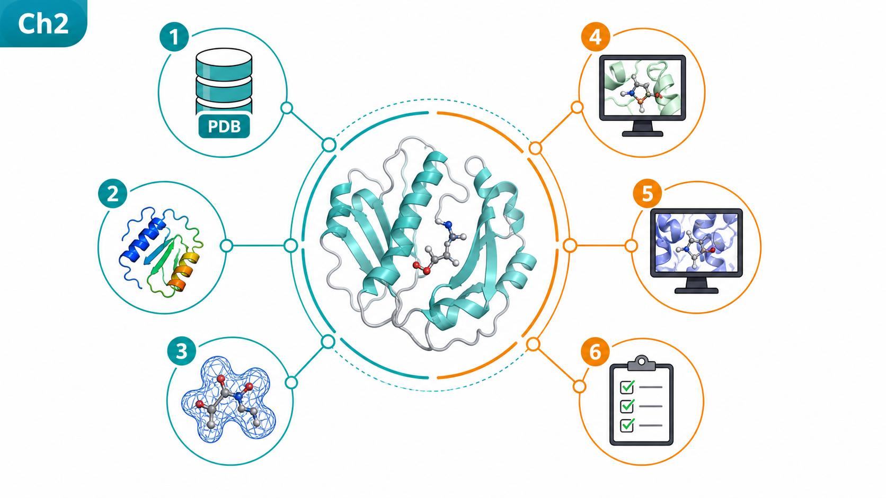
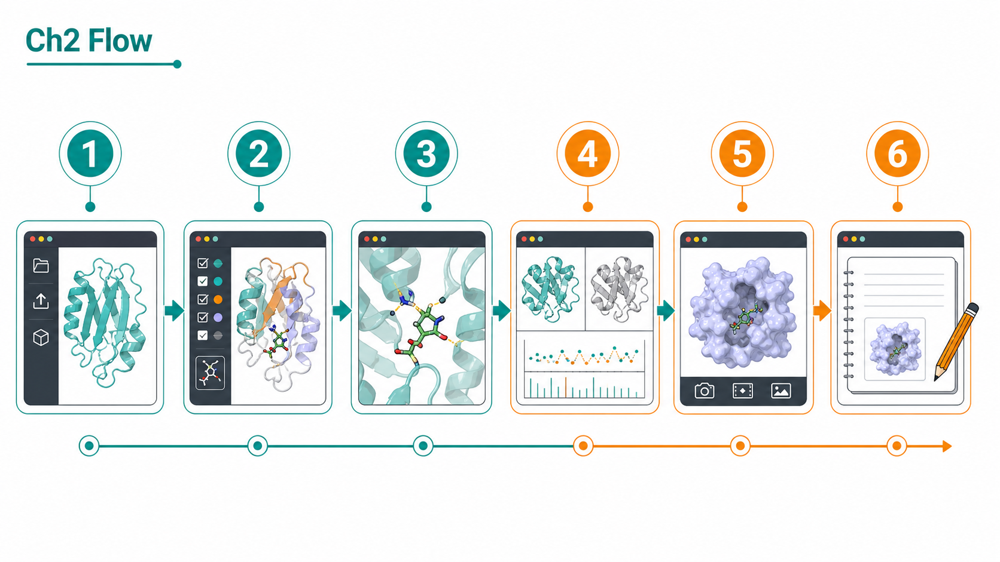
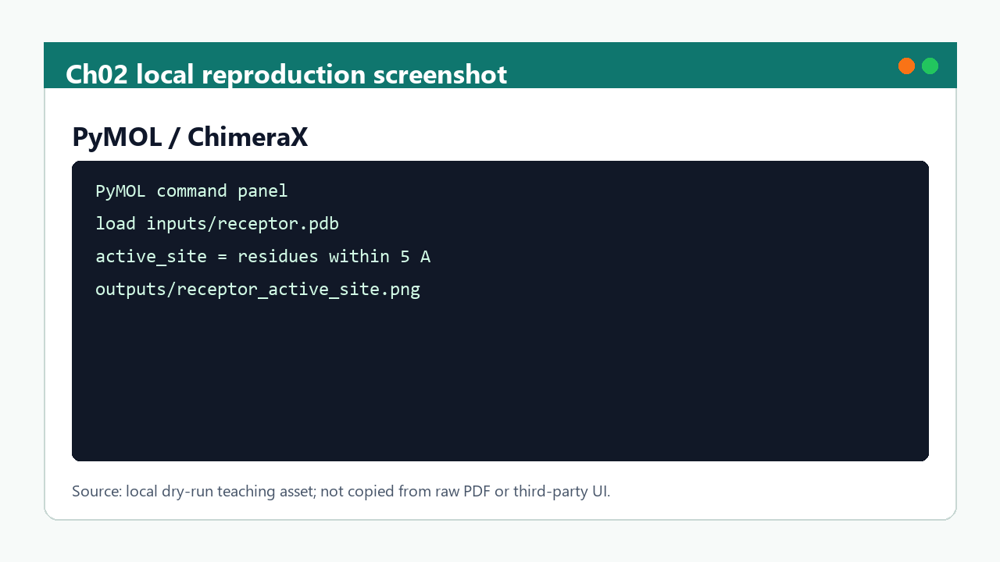

# 第 2 章 结构来源、PyMOL 与 Chimera 可视化

## 本章导读

本章把第 1 章的文件和路径意识推进到三维结构解释。药物设计中的“结构”不是一张漂亮图片，而是一组带有来源、分辨率、链、残基、配体、金属离子、缺失区域、修饰状态和置信度的对象。PyMOL 与 Chimera/ChimeraX 的作用，是把这些对象变成可检查、可比较、可复现的结构证据。

在 AI 辅助药物设计中，结构来源已经从传统实验结构扩展到 AlphaFold2、AlphaFold3、Boltz、Chai-1、RFdiffusion/RFD3 等预测或生成模型。结构数量变多之后，判断难度也变大：预测结构可以提供候选构象和复合物假设，但不能自动证明真实结合、功能状态或动态稳定性。结构可视化的价值正在从“出图”转向“质控”：检查链是否正确、配体是否在合理口袋、界面是否有冲突、口袋是否被水或辅因子影响、预测置信度是否覆盖关键区域。

本章的课程定位是建立结构读图能力。读者需要学会用 cartoon、sticks、surface、spheres、mesh、label、distance、alignment 和 coloring 等表达方式回答科学问题，而不是仅仅学习菜单按钮。对接、MD、亲和力预测和蛋白设计的结果都必须回到结构层复核。一个 docking score 很高的 pose，如果配体穿过蛋白骨架或关键相互作用不存在，就不能进入下一轮解释；一个 AlphaFold3 或 Chai-1 预测的复合物，如果界面 PAE/置信度很差，也不能直接当作真实互作。

## 学习目标

完成本章后，读者应能区分实验结构、同源建模结构、AlphaFold2 单体结构、AlphaFold3/Boltz/Chai-1 复合物预测和生成式设计结构的证据层级；能在 PyMOL 或 Chimera/ChimeraX 中检查链、配体、水、金属、缺失残基、突变、修饰和活性位点；能根据研究问题选择合适的表示方式，例如整体 fold 用 cartoon，配体和关键残基用 sticks，口袋形状用 surface，距离与氢键用 measurement；能保存可复现的视角、颜色和命令，而不是只留一张不可重建的截图。

读者还应能把结构图写成研究判断：这张图展示了什么对象，来自哪个结构来源，哪些部分可信，哪些部分只是模型假设，哪些区域需要后续 docking、MD、亲和力或实验验证。本章不要求每个人成为结构生物学专家，但要求在后续章节使用结构时不犯低级错误：混淆链 ID、忽略配体和辅因子、误读低置信度 loop、用全局 RMSD 解释局部口袋、把预测复合物当作实验事实。

## 知识图谱入口

本章来源于 `01_课程章节索引/章节精读/第02章_PyMOL与Chimera可视化精读.md`，方法来源是 `02_方法笔记/PyMOL与Chimera可视化.md`，文献入口是 `03_文献笔记/AlphaFold结构预测.md`。在线书籍映射由 `book/book_map.toml` 的 `chapter-02` 维护。正式 BibTeX key 包括 `jumper_highly_2021`、`abramson_accurate_2024` 和 `akdel_structural_2022`。

知识图谱中，本章连接“结构对象”和“方法对象”。结构对象包括 PDB/mmCIF、AlphaFold 预测结构、复合物模型、对接 pose、MD 代表构象和蛋白设计候选；方法对象包括 PyMOL 出图、Chimera/ChimeraX 结构处理、结构叠合、口袋检查、界面分析和图像导出。第 3 章的 docking、第 4 章的 MD、第 5 章的 Boltz2、第 6 章的 RFdiffusion/RFD3 和第 8 章的研究路线，都需要回到本章的结构质控规则。

本章建议读者把结构可视化视为“可追踪证据层”。当你在图中标出一个氢键、一个疏水口袋或一个界面残基时，应能说明它来自哪个结构文件、用什么命令选择、是否依赖某个预测模型、是否在低置信度区域、是否在不同构象中稳定存在。这样生成的结构图才适合进入课件、报告、论文草图或实验讨论。

### Imagegen 知识图谱

{ loading=lazy }

| 编号 | 正文权威标签 |
|:---:|:---|
| 1 | PDB/mmCIF 来源 |
| 2 | AlphaFold 预测结构 |
| 3 | 链与配体 |
| 4 | 活性位点 |
| 5 | 结构叠合 |
| 6 | 证据边界 |

这张图由 Imagegen 生成，用于帮助读者把本章对象、方法和证据关系先组织成可记忆结构。图中只保留短标题和编号，精确术语、参数和边界以上表及正文为准。

## 核心概念

结构来源是第一层判断。实验结构通常来自 X-ray、cryo-EM、NMR 或其他结构生物学方法，附带分辨率、R-factor、局部分辨率、模型质量和实验条件；预测结构来自 AlphaFold2、AlphaFold3、Boltz、Chai-1 等模型，附带 pLDDT、PAE、pTM/ipTM 或类似置信度；生成结构来自 RFdiffusion/RFD3、ProteinMPNN、BindCraft 或 LigandMPNN 这类设计流程，还需要回折叠、界面复核和实验验证。不同来源不能放在同一证据强度下讨论。

PyMOL 和 Chimera/ChimeraX 各有侧重。PyMOL 适合脚本化出图、出版级渲染、选择集和残基标注；Chimera/ChimeraX 更适合交互式结构处理、密度图、表面、叠合、多模型管理和复杂分析。课程中不应把工具差异简化为“哪个好用”，而要根据任务选择：如果目标是生成统一风格的课件图，PyMOL 脚本很合适；如果目标是检查结构、叠合多模型、处理密度或快速探索界面，Chimera/ChimeraX 往往更顺手。

表示方式决定你看到什么。Cartoon 适合展示蛋白二级结构和整体折叠；sticks 适合展示配体、关键残基、氢键网络和活性位点；surface 适合展示口袋形状、电荷分布和界面互补；spheres 适合突出离子、原子半径或空间占据；mesh/volume 适合密度、口袋或体积对象；label 适合教学标注，但过多标签会破坏图面。任何表示方式都是取舍，必须服务具体问题。

结构叠合需要定义比较层级。全局 RMSD 可以说明整体 fold 是否相似，但不能直接说明口袋几何或配体相互作用是否一致。局部口袋叠合适合比较活性位点，但不能代表整个蛋白构象。界面叠合适合比较复合物相互作用，但需要同时看链相对方向、界面残基和置信度。MD 代表构象之间的比较还要考虑时间和构象群，而不是只选一帧“好看的结构”。

置信度和缺失信息是结构解读的边界。AlphaFold2 的高 pLDDT 通常说明局部几何较可信，但 PAE 高的结构域相对取向仍可能不可靠；AlphaFold3/Boltz/Chai-1 复合物预测可以给出相互作用假设，但界面区域的置信度、PAE、输入模板和训练分布都影响解释；实验结构中的缺失 loop、低占有率配体、晶体接触或密度不足也不能被忽略。结构图应该把这些不确定性带入说明，而不是通过美化渲染掩盖。

## 方法流程

第一步是确认结构来源和文件状态。打开结构前先记录来源：PDB ID、AlphaFold DB、UniProt、用户上传模型、Boltz2 输出、Chai-1 输出、docking pose、MD 聚类中心或 protein design 候选。确认文件格式是 PDB 还是 mmCIF，是否包含多个模型，链 ID 是否与后续任务一致，配体名称是否保留，水和离子是否需要保留。对于预测结构，还要保存置信度文件或模型输出摘要。

第二步是做基础清理和对象命名。加载结构后不要马上截图，先隐藏无关对象，按链、配体、关键残基、口袋和界面建立选择集。为对象命名时使用清晰标签，例如 `receptor_chain_A`、`ligand_ATP`、`site_residues`、`docking_pose_01`。如果有多个模型，先统一命名和颜色，否则后续图像很难复盘。

第三步是选择表达层级。整体结构图可以使用 cartoon 加半透明 surface；口袋图可以只显示配体附近 4-6 Å 残基；界面图可以分别显示两条链的 surface、sticks 和接触残基；对接结果图应同时显示配体 pose、关键相互作用、口袋边界和可能冲突；MD 代表构象图可以叠合不同聚类中心，突出构象变化区域。每张图只回答一个核心问题，避免把所有信息堆在一张图里。

第四步是做定量辅助。距离、氢键、盐桥、π-π stacking、阳离子-π、金属配位、疏水接触和界面面积，都可以作为结构解释的辅助证据。但这些度量不是自动结论。不同软件对氢键和接触定义不同，静态结构中的距离也不等于动态稳定性。建议在图注或记录中写清阈值和计算工具，必要时与 MD 或统计分析结合。

第五步是保存可复现出图过程。PyMOL 可保存 `.pse` 会话和 `.pml` 脚本，Chimera/ChimeraX 可保存 session 和命令。导出图片前应记录视角、分辨率、背景、颜色、选择集和渲染参数。如果图片用于课件或论文草图，建议同时保留脚本和原始结构路径。这样后续替换模型、修改颜色或补标注时，不需要从零手动重做。

第六步是把结构判断回流到项目。结构图本身不应孤立存在。若它用于 docking 复核，应写入对接实验记录；若它用于 MD 解释，应写入轨迹分析摘要；若它用于 Boltz2 或 Chai-1 结果，应记录预测置信度和界面判断；若它用于 protein design，应记录 motif RMSD、界面接触和失败原因。在线书籍只保留教学逻辑，具体运行图和参数回到 `04_实验记录/`。

## 代码案例与软件操作

{ loading=lazy }

**PyMOL/ChimeraX 结构复核流程图** 的编号含义如下：

| 编号 | 流程节点 |
|:---:|:---|
| 1 | 导入结构 |
| 2 | 检查链 ID |
| 3 | 定位配体/残基 |
| 4 | 叠合模型 |
| 5 | 导出视图 |
| 6 | 记录判断 |

本节对应软件/界面：**PyMOL / ChimeraX**。场景是：用同一套视图命令复核实验结构和预测结构，避免只凭漂亮渲染判断结构可信度。

=== "可复制代码"

    ```pymol
    load inputs/receptor.pdb, receptor
    hide everything
    show cartoon, receptor
    color slate, receptor
    select active_site, byres receptor within 5 of resn LIG
    show sticks, active_site
    png outputs/receptor_active_site.png, dpi=220
    ```

=== "配套文件"

    完整示例文件：[`chapter-02-structure-review.pml`](../assets/code/chapter-02-structure-review.pml)

{ loading=lazy }

| 步骤 | 操作 |
|:---:|:---|
| 1 | 加载 PDB/mmCIF 或 AlphaFold 结构。 |
| 2 | 检查链、配体、缺失残基、金属离子和水分子。 |
| 3 | 保存会话、截图和人工判断。 |

!!! warning "常见错误"
    不要把 AlphaFold 预测结构当作实验结构；图注必须写清结构来源和置信度边界。

## 关键文献与 BibTeX key

<!-- refs:start -->

!!! quote "`jumper_highly_2021`"
    **Nature 风格引用：** Jumper, J., Evans, R., Pritzel, A., Green, T., Figurnov, M., Ronneberger, O. et al. Highly accurate protein structure prediction with AlphaFold. Nature (2021). https://doi.org/10.1038/s41586-021-03819-2

    **DOI/URL：** `10.1038/s41586-021-03819-2`

    **BibTeX key：** `jumper_highly_2021`

    **Zotero item key：** `UYRXX2U2`

    **本章用途：** 结构来源、预测模型边界与可视化复核的文献锚点。

!!! quote "`abramson_accurate_2024`"
    **Nature 风格引用：** Abramson, J., Adler, J., Dunger, J., Evans, R., Green, T., Pritzel, A. et al. Accurate structure prediction of biomolecular interactions with AlphaFold 3. Nature (2024). https://doi.org/10.1038/s41586-024-07487-w

    **DOI/URL：** `10.1038/s41586-024-07487-w`

    **BibTeX key：** `abramson_accurate_2024`

    **Zotero item key：** `PE42AXJX`

    **本章用途：** 结构来源、预测模型边界与可视化复核的文献锚点。

!!! quote "`akdel_structural_2022`"
    **Nature 风格引用：** Akdel, M., Pires, D. E. V., Porta Pardo, E., Jänes, J., Zalevsky, A. O., Mészáros, B. et al. A structural biology community assessment of AlphaFold2 applications. Nature Structural \& Molecular Biology 29, 1056-1067 (2022). https://doi.org/10.1038/s41594-022-00849-w

    **DOI/URL：** `10.1038/s41594-022-00849-w`

    **BibTeX key：** `akdel_structural_2022`

    **Zotero item key：** `5GOGPC63`

    **本章用途：** 结构来源、预测模型边界与可视化复核的文献锚点。

<!-- refs:end -->
## 实验/练习入口

练习一：加载一个蛋白结构并建立选择集。选择一个 PDB/mmCIF 或 AlphaFold 结构，分别创建全蛋白、链 A、配体、口袋残基和水/离子对象。输出一张整体图和一张口袋图，并在记录中写清每个对象的选择语句。重点不是图片美观，而是让图像对象可复现。

练习二：比较实验结构和预测结构。选择一个有实验结构和 AlphaFold 预测结构的蛋白，做全局叠合和局部口袋叠合，分别记录 RMSD、主要差异区域、低置信度区域和对药物设计的影响。注意不要用全局 RMSD 直接替代口袋判断。

练习三：复核一个 docking 或复合物预测结果。载入受体、配体或复合物模型，检查配体是否落在合理口袋、是否有明显空间冲突、关键残基是否形成合理相互作用、界面是否位于低置信度区域。把判断写成“可进入下一轮”“需要重新准备输入”“仅作为假设保留”三类之一。

练习四：生成一张可复现课件图。用 PyMOL 或 Chimera/ChimeraX 导出一张结构图，并同时保存会话文件和命令脚本。图像应包含清晰配色、少量必要标签、比例合适的视角和简短图注。图注需说明结构来源、展示对象和证据边界。

## 使用边界与常见误读

第一，结构图不是实验事实本身。实验结构、预测结构和生成结构的证据强度不同；同一张图如果不说明来源，很容易误导读者。在线书籍中必须把预测结构称为“模型”或“假设”，不能写成已验证的结合模式或功能机制。

第二，美观渲染不能掩盖质量问题。低分辨率、缺失残基、低 pLDDT、高 PAE、配体参数错误、链 ID 混乱、口袋残基缺失和错误质子化，都可能被漂亮图片遮住。课程图和研究图应优先表达判断，而不是追求装饰。

第三，距离和氢键不是结论。静态结构中的 2.8 Å 距离可以提示潜在相互作用，但是否稳定、是否贡献亲和力、是否影响功能，需要结合 MD、自由能、突变、实验或多结构统计。后续第 4 章和第 5 章会继续处理这些问题。

第四，预测复合物不能直接替代 docking 或实验。AlphaFold3、Boltz、Chai-1 等模型能生成复杂互作假设，但药物设计仍要检查配体化学合理性、口袋诱导适配、训练集相似性、界面置信度和后续验证路径。特别是 Chai-1 aggregate score 一类指标，只能作为候选排序信号，不能当作真实 Kd 或活性。

## 延伸阅读与下一步

完成本章后，读者应能把结构文件转化为可审查的结构判断。下一章进入 AI 多组分对接与虚拟筛选，核心问题会从“这个结构怎么看”变为“候选分子或互作对象如何放进结构环境中排序”。建议在进入 [第 3 章](chapter-03.md) 前，至少完成一次结构来源记录、一次口袋图生成和一次结构边界说明。

本章也会反复回流到后续章节。第 4 章需要用结构可视化解释 MD 代表构象；第 5 章需要用结构图判断 Boltz2 亲和力是否建立在合理复合物上；第 6 章需要检查 RFdiffusion/RFD3 生成骨架、ProteinMPNN 序列和回折叠模型；第 8 章需要把文献案例中的结构图与本项目实际结果分开。结构可视化不是独立技能，而是所有 AIDD 结论的质控入口。[返回首页](../index.md)。
