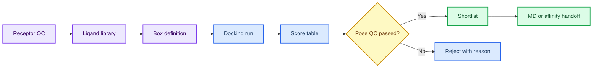

# 第 3 章 AI 多组分对接与虚拟筛选

## 本章导读

虚拟筛选容易把大量候选和分数包装成“结果”，但 docking score 首先是排序线索。 对接与虚拟筛选证据链中的关键问题不是单个命令或界面能够解决的，而是贯穿输入选择、参数设置、结果解释和后续写作的判断问题。读者进入对接与虚拟筛选证据链时，应先把自己放在真实研究任务中：如果明天需要把这一步交给同组同学复核，哪些信息必须留下，哪些说法必须谨慎。

本章建立从受体准备、配体库、box、打分、重评分到候选短名单的证据链。 对接与虚拟筛选证据链采用教材讲解写法，不把内容压缩成术语表，而是把概念放回它服务的任务场景中解释。读者在对接与虚拟筛选证据链中需要关注的不是“记住一个名词”，而是理解它如何限制输入、影响输出、进入质量控制，并支持相应层级的写作判断。

学习对接与虚拟筛选证据链时，建议先通读核心概念，再回到方法流程表逐步核对。表格用于快速定位输入、动作、输出和 QC，正文段落则解释为什么这些字段不能省略；在对接与虚拟筛选证据链中，这一点应具体落到候选清单、box 参数和 pose 复核记录。对接与虚拟筛选证据链采用这样的顺序，能避免只会照着流程执行却不知道哪一步决定结果可信度。

第 4 章用 MD 复核候选构象，第 5 章用亲和力模型进一步排序，第 8 章把筛选放入研究项目池。 因此，对接与虚拟筛选证据链不是孤立的工具说明，而是后续章节继续工作的接口层。读者完成对接与虚拟筛选证据链后，应能把本章记录方式转移到下一章，而不是重新发明日志、参数和边界说明。

## 学习目标

围绕对接与虚拟筛选证据链，学习目标应落实为可复述、可记录、可复核的判断能力。完成本章后，读者应能够：

- 能记录 receptor、ligand library、box、score、pose 和筛选阈值。
- 能区分 docking score、pose 合理性、重评分结果和实验候选。
- 能把文献案例作为流程参考，而不是写成本项目筛选结果。
- 能用 manifest 管理批量筛选状态和失败原因。

在对接与虚拟筛选证据链中，这些目标既服务课堂复习，也决定后续记录能否被他人复核；若不能用记录说明输入、动作和边界，本章内容仍应停留在练习层级。

## 知识图谱入口

本章图谱以受体-配体-box-score-filter 为主线。读者应把每个节点理解为证据门槛，而不是单纯的软件步骤。

在线书籍页面只引用整理后的 wiki、方法卡、文献笔记和资源页，不直接嵌入原始 PDF 或课件图表；在对接与虚拟筛选证据链中，这一点应具体落到候选清单、box 参数和 pose 复核记录。需要追溯来源时，应回到 `book/book_map.toml`、章节精读笔记和相关 Zotero/BibTeX 记录；在对接与虚拟筛选证据链中，这一点应具体落到候选清单、box 参数和 pose 复核记录。

| 来源类型 | 路径 |
|:---|:---|
| 章节来源 | `01_课程章节索引/章节精读/第03章_AI多组分对接与虚拟筛选精读.md` |
| 方法来源 | `02_方法笔记/AI多组分对接与虚拟筛选.md`<br>`02_方法笔记/MSA与Uni-Dock补充.md` |
| 文献来源 | `03_文献笔记/分子对接与虚拟筛选.md` |
| 实验来源 | `04_实验记录/模板_对接虚拟筛选记录.md` |
| 工作台来源 | `07_研究工作台/证据与claims矩阵.md` |

### Imagegen 知识图谱

{ loading=lazy }

**图3.1 对接与虚拟筛选证据链知识图谱。** 本图为 Imagegen 生成的教学示意图，用中心概念和编号节点概括对接与虚拟筛选证据链的对象、方法入口、记录字段和证据边界；编号用于正文定位，不承载精确参数或运行结果，术语解释和判断口径以正文表格为准。 节点编号：1=受体准备；2=配体库；3=box 定义；4=打分；5=重评分；6=筛选规则；7=实验候选。

### Mermaid 结构图



**图3.2 对接筛选证据漏斗结构图。** 本图为 Mermaid 教学示意图，展示受体准备、配体库、box 定义、对接运行、pose 复核和候选交接之间的漏斗关系；箭头表示阅读和记录依赖，不替代真实软件运行或实验验证，具体输入、输出和 QC 标准以正文为准。

对接与虚拟筛选证据链的 Mermaid 源图和后续 scientific-schematics prompt 见 [Mermaid 图示与示意图设计](../resources/mermaid-schematics.md)。

## 核心概念

对接与虚拟筛选证据链的核心概念应围绕受体、配体库、box、score 和 pose QC来读，而不是孤立背诵术语。本章最重要的训练，是把每个名词都对应到一个可检查的输入、一个会改变结果的动作，以及一个必须写入记录的 QC 或边界条件；在对接与虚拟筛选证据链中，这一点应具体落到候选清单、box 参数和 pose 复核记录。

阅读下表时，可以把受体、配体库、box、score 和 pose QC拆成几类检查问题：它约束什么来源，改变什么输出，失败时留下什么证据。这样处理后，概念表就成为候选清单、box 参数和 pose 复核记录的索引，而不是定义的堆叠。

| 概念 | 教材化定义 |
|:---|:---|
| 受体准备 | 受体准备定义计算对象，包括链选择、质子化、配体/水/金属处理和口袋来源。 |
| 配体库 | 配体库的来源、去重、质子化、手性和 3D 构象决定筛选结果的可解释性。 |
| box | box 是搜索空间假设，来源应来自共晶配体、功能位点、预测口袋或文献证据。 |
| score | score 是模型给出的排序信号，通常不能跨工具、跨靶点或跨化学系列直接比较。 |
| 过滤规则 | 过滤应同时考虑分数、pose、化学合理性、可合成性和后续验证成本。 |

使用这张表时，不需要一次记住所有术语。更实用的做法是，在准备任务时先圈出与本次输入直接相关的 2-3 个概念，再检查记录中是否已经有对应字段；在对接与虚拟筛选证据链中，这一点应具体落到候选清单、box 参数和 pose 复核记录。对于不直接参与对接与虚拟筛选证据链当前任务的概念，可以作为边界提示保留，避免在写作时把背景信息误写成当前结果。

这些概念之间也不是平级堆叠关系。通常先由任务对象确定输入，再由流程参数约束输出，最后由 QC 和证据边界决定能否进入下一步；在对接与虚拟筛选证据链中，这一点应具体落到候选清单、box 参数和 pose 复核记录。读者如果能沿着对接与虚拟筛选证据链的顺序复述本节内容，就已经掌握了把教材知识转化为研究记录的基本方法。

## 方法流程

对接与虚拟筛选证据链的方法流程要把从受体准备到候选排序的筛选漏斗讲清楚。读者不应只关心是否跑完命令，而要能说明每一步接收什么输入、执行什么动作、写出什么对象，以及哪一个 QC 决定它能否进入下一步；在对接与虚拟筛选证据链中，这一点应具体落到候选清单、box 参数和 pose 复核记录。

下表按 `输入 | 动作 | 输出 | QC/边界` 组织，适合在执行前当作检查单使用；在对接与虚拟筛选证据链中，这一点应具体落到候选清单、box 参数和 pose 复核记录。对于对接与虚拟筛选证据链，最后一列尤其重要，因为它把普通操作和可写入研究工作台的证据区分开来。

| 步骤 | 输入 | 动作 | 输出 | QC/边界 |
|:---:|:---|:---|:---|:---|
| 1 | 受体结构 | 完成结构 QC、处理氢和口袋来源。 | receptor 文件和 QC 记录。 | 链、配体、box 来源清楚。 |
| 2 | 配体库 | 统一 ID、格式、质子化、去重和失败状态。 | ligand manifest。 | 每个分子来源可追溯。 |
| 3 | 搜索空间 | 定义 box 中心、大小和依据。 | box 参数表。 | box 不超出合理口袋范围。 |
| 4 | 初筛 | 运行 docking 并保存 pose、score 和日志。 | score 表和 pose 文件。 | 失败样本不被静默丢弃。 |
| 5 | 复核 | 按 pose、相互作用、化学规则和重评分过滤。 | shortlist。 | 候选保留理由明确。 |
| 6 | 交接 | 把候选转入 MD、亲和力或实验计划。 | 下一步队列。 | 不把 score 写成活性。 |

执行对接与虚拟筛选证据链流程表时，应先完成最小样例，再扩大到批量任务。最小样例的价值不是产生有意义的研究结果，而是验证路径、格式、参数和日志是否能闭合；在对接与虚拟筛选证据链中，这一点应具体落到候选清单、box 参数和 pose 复核记录。只有当对接与虚拟筛选证据链的最小样例能够被完整复核时，后续批量表格、结构、轨迹或候选列表才有进入研究工作台的基础。

流程表也提供了写作时的段落顺序。介绍方法时，先交代输入来源和动作，再说明输出形式，最后说明 QC 含义和不能推出的结论；在对接与虚拟筛选证据链中，这一点应具体落到候选清单、box 参数和 pose 复核记录。对接与虚拟筛选证据链采用这个顺序比先展示结果更稳健，因为它让读者看到判断链，而不是只看到筛选后的结论。

## 代码案例与软件操作

{ loading=lazy }

**图3.3 受体-配体-box-score-filter 漏斗流程图。** 本图为 Imagegen 生成的流程图，说明受体、配体、box、score 和 filter 如何组成虚拟筛选记录；它用于说明操作顺序、关键节点和记录交接位置，不代表实验结果，具体命令、参数和边界判断以正文代码块与步骤表为准。 流程编号：1=receptor；2=ligands；3=box；4=score；5=rescore；6=filter；7=shortlist。

本节用于训练 **3 章 AI 多组分对接与虚拟筛选** 的最小复现意识。该示例是 docking dry-run 的输入组织方式，适合检查 box、日志和输出表；真实筛选需要完整 receptor/ligand provenance。

=== "可复制代码"

    ```bash
    set -euo pipefail
    mkdir -p outputs logs
    cat > inputs/box.tsv <<'BOX'
    cx	cy	cz	sx	sy	sz
    12.4	-3.2	8.6	22	22	22
    BOX
    unidock --receptor inputs/receptor.pdbqt --ligand_index inputs/ligands.txt \
      --center_x 12.4 --center_y -3.2 --center_z 8.6 \
      --size_x 22 --size_y 22 --size_z 22 \
      --dir outputs > logs/unidock-dry-run.log 2>&1
    ```

=== "配套文件"

    完整示例文件：[`chapter-03-docking-dry-run.sh`](../assets/code/chapter-03-docking-dry-run.sh)

    P31 候选 triage 脚本：[`chapter-03-aidd-triage-dry-run.py`](../assets/code/chapter-03-aidd-triage-dry-run.py)。该脚本输出 `parse_status`、`rule_of_five_pass`、`pose_qc_passed` 和 `filter_reason`，用于回写对接记录模板，不产生 docking score。

{ loading=lazy }

**图3.4 对接 dry-run 软件操作截图。** 本图为本地 dry-run 截图，展示对接 dry-run 中的参数表、候选 triage 和 manifest 记录字段；截图用于说明界面、文件或表格位置，不代表实验结果，读者应按本机路径替换参数并以正文操作表为准。

| 步骤 | 操作 |
|:---:|:---|
| 1 | 准备受体、配体和 box 参数表。 |
| 2 | 先跑 1 receptor x 3 ligands 的 dry-run。 |
| 3 | 用 AIDD triage 表记录 SMILES 解析、描述符复核、pose QC 状态和过滤理由。 |
| 4 | 把 score、pose 文件和过滤理由写入 manifest；没有 pose 复核时不得推进为命中结果。 |

### 教材化阅读提示

本节代码应作为配体 triage 与 docking dry-run的可复查样例来读。它展示的是如何把对接与虚拟筛选证据链中的一次小任务写成可复制、可失败、可追溯的记录，而不是声明已经完成真实研究运行。

替换参数时，应先替换与对接与虚拟筛选证据链直接相关的输入路径，再调整会影响解释的阈值、空间范围或模型参数。如果对接与虚拟筛选证据链的最小样例尚不能解释输出来源，就不应扩大到批量任务。

解读输出时，只记录代码确实生成的对象，例如 manifest、配置、dry-run 表格、截图或日志；在对接与虚拟筛选证据链中，这一点应具体落到候选清单、box 参数和 pose 复核记录。这些对象可以支持候选清单、box 参数和 pose 复核记录的整理，但不能自动升级为实验结论；需要形成研究判断时，仍要回到实验记录模板补齐输入、QC、人工复核和待验证项。
## 关键文献

<!-- refs:start -->

- Du, L., Geng, C., Zeng, Q., Huang, T., Tang, J., Chu, Y. et al. Dockey: a modern integrated tool for large-scale molecular docking and virtual screening. Briefings in Bioinformatics 24, bbad047 (2023). https://doi.org/10.1093/bib/bbad047

  **本文内容简介：** 本文介绍 Dockey 平台在大规模分子对接、虚拟筛选和结果管理中的集成流程。

- Agrawal, P., Singh, H., Srivastava, H. K., Singh, S., Kishore, G. & Raghava, G. P. S. Benchmarking of different molecular docking methods for protein-peptide docking. BMC Bioinformatics 19, 426 (2019). https://doi.org/10.1186/s12859-018-2449-y

  **本文内容简介：** 本文比较多种蛋白-多肽对接方法的性能，为肽结合体系的模型选择提供基准。

- Crampon, K., Giorkallos, A., Deldossi, M., Baud, S. & Steffenel, L. A. Machine-learning methods for ligand–protein molecular docking. Drug Discovery Today 27, 151–164 (2022). https://doi.org/10.1016/j.drudis.2021.09.007

  **本文内容简介：** 本文综述机器学习方法在配体-蛋白分子对接中的建模策略、特征和应用限制。

- Gu, S., Shen, C., Zhang, X., Sun, H., Cai, H., Luo, H. et al. Benchmarking AI-powered docking methods from the perspective of virtual screening. Nature Machine Intelligence 7, 509–520 (2025). https://doi.org/10.1038/s42256-025-00993-0

  **本文内容简介：** 本文从虚拟筛选角度评测 AI 驱动对接方法，比较排序能力、适用场景和局限。

<!-- refs:end -->
## 实验/练习入口

本章练习的重点是把对接与虚拟筛选证据链转化成可交接记录。练习完成后，读者应能让另一个人根据记录复现从受体准备到候选排序的筛选漏斗，并判断是否具备进入第 4 章构象采样与第 5 章亲和力解释的条件。

建议按以下顺序完成：

1. 完成 1 个 receptor x 3 ligands 的 dry-run，并记录 box 来源。
2. 建立 10-20 个候选分子的 manifest，保留失败原因和人工复核状态。
3. 把一个 top pose 转写成保守 claim，列出支持证据和需要补充的验证。

完成练习后，应检查记录中是否包含候选清单、box 参数和 pose 复核记录、失败原因和人工判断。缺少候选清单、box 参数和 pose 复核记录时，相关内容仍适合作为课堂尝试，不适合写入正式研究结论。

如果练习借用了文献案例或课程范文，应在对接与虚拟筛选证据链记录中明确它只是方法参照或边界样例。在对接与虚拟筛选证据链中，文献案例可以启发流程设计，但不能替代本项目的本地运行结果。

## 使用边界与常见误读

对接与虚拟筛选证据链最容易被误写的对象是docking score、top pose 和筛选命中。在对接与虚拟筛选证据链中，这些对象看起来像结果，但在当前教材层级通常只是模型输出、流程观察、可视化线索或文献案例。

下表用于训练写作降级。在对接与虚拟筛选证据链中，读者应先判断当前证据最多能支持什么说法，再决定是否写成“提示”“支持”“流程参考”或“仍需验证”。

| 易误读对象 | 稳健表述 | 写作处理 |
|:---|:---|:---|
| docking score | 提示排序线索。 | 不能写成 Kd、IC50、结合自由能或实验活性。 |
| top pose | 提示可能构象。 | 仍需结构复核、MD、自由能或实验验证。 |
| AI docking | 可能改善特定 benchmark 表现。 | 新靶点和新化学空间仍需适用域评估。 |
| 文献案例 | 可借鉴流程和参数记录。 | 不能直接迁移为本项目结果。 |

边界判断并不是削弱对接与虚拟筛选证据链的价值，而是说明证据在哪里停止。如果删除某个软件名、截图、分数或文献案例后，结论就无法成立，通常应把该结论降级为候选线索或下一步验证任务；在对接与虚拟筛选证据链中，这一点应具体落到候选清单、box 参数和 pose 复核记录。

只有当对接与虚拟筛选证据链对应的真实运行记录、复核结果和严格计算或实验支持已经进入项目记录，相关判断才适合升级为更强表述。

本章的边界判断首先针对 docking score。分数可以帮助排序候选，但它不能直接证明结合、活性或药效；pose 也必须经过口袋、相互作用和构象合理性复核。读者在写作时应把 score 写成筛选线索，把 top pose 写成需要复核的候选构象。

## 延伸阅读与下一步

对接与虚拟筛选证据链的延伸阅读应服务下一次可执行任务，而不是停留在资料补充。读者完成本章后，应能判断哪些内容进入候选清单、box 参数和 pose 复核记录，哪些内容进入阅读队列，哪些内容只能作为背景案例。

建议按以下路径进入下一轮学习或研究任务：

1. 将 top pose 交给第 4 章做轨迹或构象稳定性复核。
2. 将候选表交给第 5 章做亲和力预测和模型边界判断。
3. 在第 8 章把候选写入项目池，明确文献案例、方法假设和本项目结果的分层。

选择下一步时，应优先检查对接与虚拟筛选证据链的证据链是否足以支撑转入第 4 章构象采样与第 5 章亲和力解释。若输入来源、参数、QC 或边界尚未记录清楚，应先补齐本章记录，而不是继续叠加更复杂的工具；在对接与虚拟筛选证据链中，这一点应具体落到候选清单、box 参数和 pose 复核记录。

完成这种转换后，对接与虚拟筛选证据链就不只是读过的教材内容，而是可以被检索、复核和继续执行的研究资产。

完成筛选练习后，下一步不一定是扩大库规模。更稳妥的做法是挑选少量候选进入 MD 或亲和力预测章节，检查它们在不同证据层中是否仍然保持一致，而不是把单次排序直接写入项目结论。
