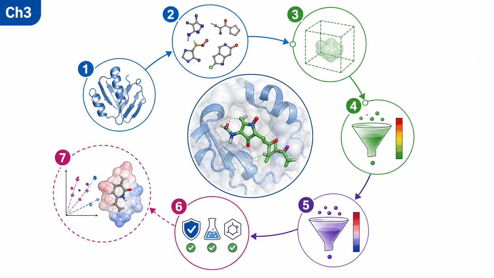
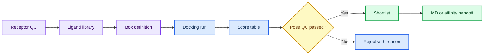
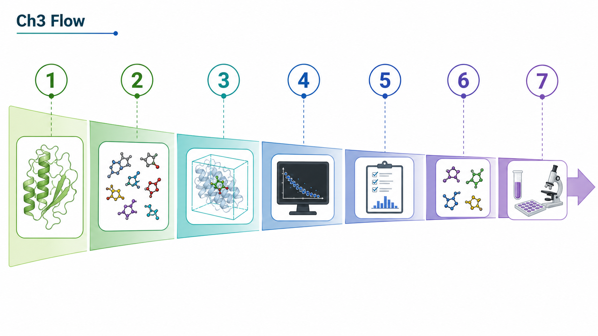
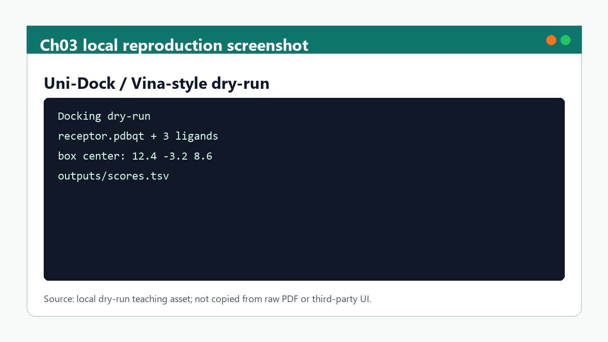

# 第 3 章 AI 多组分对接与虚拟筛选

## 本章导读

虚拟筛选容易把大量候选和分数包装成“结果”，但 docking score 首先是排序线索。因此，本章首先界定这一问题场景，再说明需要记录哪些输入、动作、输出和质量控制信息。

本章建立从受体准备、配体库、box、打分、重评分到候选短名单的证据链。这里的重点不是追求单个软件操作的完整覆盖，而是让读者形成可复查的判断链：对象是什么、依据来自哪里、结果能支持什么、仍然不能说明什么。

第 4 章用 MD 复核候选构象，第 5 章用亲和力模型进一步排序，第 8 章把筛选放入研究项目池。因此，本章的正文采用“概念定义 -> 流程执行 -> 边界判断 -> 下一步交接”的组织方式。

## 学习目标

完成本章后，读者应能够：

- 能记录 receptor、ligand library、box、score、pose 和筛选阈值。
- 能区分 docking score、pose 合理性、重评分结果和实验候选。
- 能把文献案例作为流程参考，而不是写成本项目筛选结果。
- 能用 manifest 管理批量筛选状态和失败原因。

这些目标既面向课堂学习，也面向后续研究记录；如果不能在记录中复述这些要点，相关结果不宜进入项目结论。

## 知识图谱入口

本章图谱以受体-配体-box-score-filter 为主线。读者应把每个节点理解为证据门槛，而不是单纯的软件步骤。

在线书籍页面只引用整理后的 wiki、方法卡、文献笔记和资源页，不直接嵌入原始 PDF 或课件图表。需要追溯来源时，应回到 `book/book_map.toml`、章节精读笔记和相关 Zotero/BibTeX 记录。

| 来源类型 | 路径 |
|:---|:---|
| 章节来源 | `01_课程章节索引/章节精读/第03章_AI多组分对接与虚拟筛选精读.md` |
| 方法来源 | `02_方法笔记/AI多组分对接与虚拟筛选.md`<br>`02_方法笔记/MSA与Uni-Dock补充.md` |
| 文献来源 | `03_文献笔记/分子对接与虚拟筛选.md` |
| 实验来源 | `04_实验记录/模板_对接虚拟筛选记录.md` |
| 工作台来源 | `07_研究工作台/证据与claims矩阵.md` |

### Imagegen 知识图谱

{ loading=lazy }

| 编号 | 正文权威标签 |
|:---:|:---|
| 1 | 受体准备 |
| 2 | 配体库 |
| 3 | box 定义 |
| 4 | 打分 |
| 5 | 重评分 |
| 6 | 筛选规则 |
| 7 | 实验候选 |

这张图由 Imagegen 生成，用于帮助读者把本章对象、方法和证据关系先组织成可记忆结构。图中只保留短标题和编号，精确术语、参数和边界以上表及正文为准。

### Mermaid 结构图



完整图示设计和后续科学示意图 prompt 见 [Mermaid 图示与示意图设计](../resources/mermaid-schematics.md)。

## 核心概念

本节只保留支撑后续判断的核心概念。每个概念都应能回答一个具体问题：它约束什么输入、影响什么输出、需要怎样记录。

| 概念 | 教材化定义 |
|:---|:---|
| 受体准备 | 受体准备定义计算对象，包括链选择、质子化、配体/水/金属处理和口袋来源。 |
| 配体库 | 配体库的来源、去重、质子化、手性和 3D 构象决定筛选结果的可解释性。 |
| box | box 是搜索空间假设，来源应来自共晶配体、功能位点、预测口袋或文献证据。 |
| score | score 是模型给出的排序信号，通常不能跨工具、跨靶点或跨化学系列直接比较。 |
| 过滤规则 | 过滤应同时考虑分数、pose、化学合理性、可合成性和后续验证成本。 |

阅读本节时，应优先检查这些概念能否落到文件、参数、图像、表格或记录字段上。不能落地的说法，在后续研究写作中应作为背景描述，而不是证据。

## 方法流程

本章流程按“输入 -> 动作 -> 输出 -> QC”的顺序组织。这样做的目的，是让每一步都能被复查，而不是只留下一个最终截图或分数。

| 步骤 | 输入 | 动作 | 输出 | QC/边界 |
|:---:|:---|:---|:---|:---|
| 1 | 受体结构 | 完成结构 QC、处理氢和口袋来源。 | receptor 文件和 QC 记录。 | 链、配体、box 来源清楚。 |
| 2 | 配体库 | 统一 ID、格式、质子化、去重和失败状态。 | ligand manifest。 | 每个分子来源可追溯。 |
| 3 | 搜索空间 | 定义 box 中心、大小和依据。 | box 参数表。 | box 不超出合理口袋范围。 |
| 4 | 初筛 | 运行 docking 并保存 pose、score 和日志。 | score 表和 pose 文件。 | 失败样本不被静默丢弃。 |
| 5 | 复核 | 按 pose、相互作用、化学规则和重评分过滤。 | shortlist。 | 候选保留理由明确。 |
| 6 | 交接 | 把候选转入 MD、亲和力或实验计划。 | 下一步队列。 | 不把 score 写成活性。 |

执行时应先完成小样例或 dry-run，再扩大到批量任务。任何失败样本、低置信度结果或人工排除理由，都应保留在 manifest 或实验记录中。

## 代码案例与软件操作

{ loading=lazy }

**受体-配体-box-score-filter 漏斗图** 的编号含义如下：

| 编号 | 流程节点 |
|:---:|:---|
| 1 | receptor |
| 2 | ligands |
| 3 | box |
| 4 | score |
| 5 | rescore |
| 6 | filter |
| 7 | shortlist |

本节用于训练 **3 章 AI 多组分对接与虚拟筛选** 的最小复现意识。该示例是 docking dry-run 的输入组织方式，适合检查 box、日志和输出表；真实筛选需要完整 receptor/ligand provenance。

=== "可复制代码"

    ```bash
    set -euo pipefail
    mkdir -p outputs logs
    cat > inputs/box.tsv <<'BOX'
    cx	cy	cz	sx	sy	sz
    12.4	-3.2	8.6	22	22	22
    BOX
    unidock --receptor inputs/receptor.pdbqt --ligand_index inputs/ligands.txt \
      --center_x 12.4 --center_y -3.2 --center_z 8.6 \
      --size_x 22 --size_y 22 --size_z 22 \
      --dir outputs > logs/unidock-dry-run.log 2>&1
    ```

=== "配套文件"

    完整示例文件：[`chapter-03-docking-dry-run.sh`](../assets/code/chapter-03-docking-dry-run.sh)

    P31 候选 triage 脚本：[`chapter-03-aidd-triage-dry-run.py`](../assets/code/chapter-03-aidd-triage-dry-run.py)。该脚本输出 `parse_status`、`rule_of_five_pass`、`pose_qc_passed` 和 `filter_reason`，用于回写对接记录模板，不产生 docking score。

{ loading=lazy }

| 步骤 | 操作 |
|:---:|:---|
| 1 | 准备受体、配体和 box 参数表。 |
| 2 | 先跑 1 receptor x 3 ligands 的 dry-run。 |
| 3 | 用 AIDD triage 表记录 SMILES 解析、描述符复核、pose QC 状态和过滤理由。 |
| 4 | 把 score、pose 文件和过滤理由写入 manifest；没有 pose 复核时不得推进为命中结果。 |

!!! warning "常见错误"
    docking score 只能做排序线索，不能写成结合自由能或实验 IC50。

## 关键文献

<!-- refs:start -->

- Du, L., Geng, C., Zeng, Q., Huang, T., Tang, J., Chu, Y. et al. Dockey: a modern integrated tool for large-scale molecular docking and virtual screening. Briefings in Bioinformatics 24, bbad047 (2023). https://doi.org/10.1093/bib/bbad047

  **本文内容简介：** 本文介绍 Dockey 平台在大规模分子对接、虚拟筛选和结果管理中的集成流程。

- Agrawal, P., Singh, H., Srivastava, H. K., Singh, S., Kishore, G. & Raghava, G. P. S. Benchmarking of different molecular docking methods for protein-peptide docking. BMC Bioinformatics 19, 426 (2019). https://doi.org/10.1186/s12859-018-2449-y

  **本文内容简介：** 本文比较多种蛋白-多肽对接方法的性能，为肽结合体系的模型选择提供基准。

- Crampon, K., Giorkallos, A., Deldossi, M., Baud, S. & Steffenel, L. A. Machine-learning methods for ligand–protein molecular docking. Drug Discovery Today 27, 151–164 (2022). https://doi.org/10.1016/j.drudis.2021.09.007

  **本文内容简介：** 本文综述机器学习方法在配体-蛋白分子对接中的建模策略、特征和应用限制。

- Gu, S., Shen, C., Zhang, X., Sun, H., Cai, H., Luo, H. et al. Benchmarking AI-powered docking methods from the perspective of virtual screening. Nature Machine Intelligence 7, 509–520 (2025). https://doi.org/10.1038/s42256-025-00993-0

  **本文内容简介：** 本文从虚拟筛选角度评测 AI 驱动对接方法，比较排序能力、适用场景和局限。

<!-- refs:end -->
## 实验/练习入口

本章练习强调可复查记录，而不是追求一次性完成复杂工具链。建议按以下顺序完成：

1. 完成 1 个 receptor x 3 ligands 的 dry-run，并记录 box 来源。
2. 建立 10-20 个候选分子的 manifest，保留失败原因和人工复核状态。
3. 把一个 top pose 转写成保守 claim，列出支持证据和需要补充的验证。

完成练习后，应能把结果写入 `04_实验记录/` 或 `07_研究工作台/` 的对应页面。不能写入记录的练习，只能算操作尝试。

## 使用边界与常见误读

本节采用保守表述阶梯：预测、评分、可视化和文献案例通常只能写成“提示”“支持”或“可能一致”，除非有直接实验或严格验证，否则不写成“证明”。

| 易误读对象 | 稳健表述 | 写作处理 |
|:---|:---|:---|
| docking score | 提示排序线索。 | 不能写成 Kd、IC50、结合自由能或实验活性。 |
| top pose | 提示可能构象。 | 仍需结构复核、MD、自由能或实验验证。 |
| AI docking | 可能改善特定 benchmark 表现。 | 新靶点和新化学空间仍需适用域评估。 |
| 文献案例 | 可借鉴流程和参数记录。 | 不能直接迁移为本项目结果。 |

写作时，如果一个结论只能由模型分数、单次截图或文献案例间接支持，应主动补上“仍需验证”“适用于该模型/该输入”“不等同于本项目结果”等边界。

## 延伸阅读与下一步

完成本章后，建议按以下路径进入下一轮学习或研究任务：

1. 将 top pose 交给第 4 章做轨迹或构象稳定性复核。
2. 将候选表交给第 5 章做亲和力预测和模型边界判断。
3. 在第 8 章把候选写入项目池，明确文献案例、方法假设和本项目结果的分层。

[返回首页](../index.md)。
