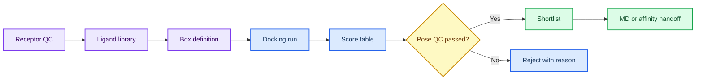

# 第 3 章 AI 多组分对接与虚拟筛选

## 本章导读

虚拟筛选的风险在于输出数量很大，读者容易把 score 表误读为研究结果。本章从 receptor、ligand library、box、score、rescore 和 shortlist 六个节点拆解筛选证据链，强调 docking score 首先是排序线索，而不是 Kd、IC50 或实验活性。

本章的教学重点是让读者知道每个候选为什么进入下一步。一个候选被保留，至少要能说明受体来源、配体来源、搜索空间依据、pose 合理性、过滤规则和失败样本处理方式。缺少这些信息时，候选表只能作为练习输出，不能写成本项目筛选发现。

第 4 章会继续复核构象稳定性，第 5 章会解释亲和力模型输出，第 8 章会把候选放入项目池。第 3 章因此承担“候选入口”的角色：它不负责确认活性，而负责把可检查候选交给下一层证据。

对接流程的教学价值在于训练候选进入下一步的理由。一个 shortlist 如果只包含分数，就无法解释失败分子、过滤规则和人工复核；一个带有 receptor、ligand、box、pose 和 filter_reason 的 shortlist，才有机会成为研究工作台中的候选证据。

## 学习目标

本章目标是把虚拟筛选从“分数排序”转化为可复核的候选生成流程。完成本章后，读者应能够：

- 能记录 receptor、ligand library、box、score、pose 和筛选阈值。
- 能区分 docking score、pose 合理性、重评分结果和实验候选。
- 能把文献案例作为流程参考，而不是写成本项目筛选结果。
- 能用 manifest 管理批量筛选状态和失败原因。

这些目标直接服务候选短名单的可信度。若 receptor、ligand library、box 或 pose 记录不完整，docking score 再好也只能作为未复核线索。

## 知识图谱入口

本章图谱以受体-配体-box-score-filter 为主线。读者应把每个节点理解为证据门槛，而不是单纯的软件步骤。

在线书籍页面只引用整理后的 wiki、方法卡、文献笔记和资源页，不直接嵌入原始 PDF 或课件图表；在对接与虚拟筛选证据链中，这一点应具体落到候选清单、box 参数和 pose 复核记录。需要追溯来源时，应回到 `book/book_map.toml`、章节精读笔记和相关 Zotero/BibTeX 记录；在对接与虚拟筛选证据链中，这一点应具体落到候选清单、box 参数和 pose 复核记录。

| 来源类型 | 路径 |
|:---|:---|
| 章节来源 | `01_课程章节索引/章节精读/第03章_AI多组分对接与虚拟筛选精读.md` |
| 方法来源 | `02_方法笔记/AI多组分对接与虚拟筛选.md`<br>`02_方法笔记/MSA与Uni-Dock补充.md` |
| 文献来源 | `03_文献笔记/分子对接与虚拟筛选.md` |
| 实验来源 | `04_实验记录/模板_对接虚拟筛选记录.md` |
| 工作台来源 | `07_研究工作台/证据与claims矩阵.md` |

### Imagegen 知识图谱

{ loading=lazy }

**图3.1 对接与虚拟筛选证据链知识图谱。** 本图为 Imagegen 生成的教学示意图，用中心概念和编号节点概括对接与虚拟筛选证据链的对象、方法入口、记录字段和证据边界；编号用于正文定位，不承载精确参数或运行结果，术语解释和判断口径以正文表格为准。 节点编号：1=受体准备；2=配体库；3=box 定义；4=打分；5=重评分；6=筛选规则；7=实验候选。

### Mermaid 结构图



**图3.2 对接筛选证据漏斗结构图。** 本图为 Mermaid 教学示意图，展示受体准备、配体库、box 定义、对接运行、pose 复核和候选交接之间的漏斗关系；箭头表示阅读和记录依赖，不替代真实软件运行或实验验证，具体输入、输出和 QC 标准以正文为准。

对接与虚拟筛选证据链的 Mermaid 源图和后续 scientific-schematics prompt 见 [Mermaid 图示与示意图设计](../resources/mermaid-schematics.md)。

## 核心概念

对接与虚拟筛选的核心概念围绕“输入是否可追溯、搜索空间是否有依据、分数能否被正确降级”展开。每个概念都会改变候选短名单的可信度。

| 概念 | 教材化定义 |
|:---|:---|
| 受体准备 | 受体准备定义计算对象，包括链选择、质子化、配体/水/金属处理和口袋来源。 |
| 配体库 | 配体库的来源、去重、质子化、手性和 3D 构象决定筛选结果的可解释性。 |
| box | box 是搜索空间假设，来源应来自共晶配体、功能位点、预测口袋或文献证据。 |
| score | score 是模型给出的排序信号，通常不能跨工具、跨靶点或跨化学系列直接比较。 |
| 过滤规则 | 过滤应同时考虑分数、pose、化学合理性、可合成性和后续验证成本。 |

使用概念表时，应先检查本次任务的 receptor 与 ligand library 是否有来源，再检查 box 是否来自共晶配体、功能位点、预测口袋或文献证据。只有这些前提清楚，score 和 pose 才有解释空间。

概念之间的先后关系很重要。受体和配体库定义任务对象，box 定义可搜索区域，score 产生排序，过滤规则决定候选能否交接。任何一个环节记录不清，shortlist 都应降级为待复核候选。

例如，box 来源不同会直接改变可搜索空间；配体库处理不同会改变分子状态；pose QC 不充分会让 score 排序失去意义。概念表中的每一项都应能在实验记录中找到对应字段。

读者还应注意，score 和 filter 不是同义词。score 来自模型输出，filter 来自研究者定义的综合规则；二者都要记录，但不能互相替代。一个分数靠前的候选，如果化学可行性或 pose 复核失败，仍然不应进入优先列表。

## 方法流程

本章流程是一条筛选漏斗。它从结构和配体来源开始，以候选交接结束，中间每一步都要保留失败样本和过滤理由。

| 步骤 | 输入 | 动作 | 输出 | QC/边界 |
|:---:|:---|:---|:---|:---|
| 1 | 受体结构 | 完成结构 QC、处理氢和口袋来源。 | receptor 文件和 QC 记录。 | 链、配体、box 来源清楚。 |
| 2 | 配体库 | 统一 ID、格式、质子化、去重和失败状态。 | ligand manifest。 | 每个分子来源可追溯。 |
| 3 | 搜索空间 | 定义 box 中心、大小和依据。 | box 参数表。 | box 不超出合理口袋范围。 |
| 4 | 初筛 | 运行 docking 并保存 pose、score 和日志。 | score 表和 pose 文件。 | 失败样本不被静默丢弃。 |
| 5 | 复核 | 按 pose、相互作用、化学规则和重评分过滤。 | shortlist。 | 候选保留理由明确。 |
| 6 | 交接 | 把候选转入 MD、亲和力或实验计划。 | 下一步队列。 | 不把 score 写成活性。 |

执行时先跑 1 receptor x 3 ligands 的最小样例，确认格式、box、日志和输出表能闭合，再扩展到批量筛选。最小样例不是为了得到命中物，而是为了验证记录字段足以解释后续筛选。

写作时应按漏斗顺序呈现：先交代 receptor 和 ligand library，再说明 box 与运行方式，随后解释 score、pose QC 和 filter，最后只把候选写成 shortlist 或下一步实验候选。

### 案例走读

一次最小虚拟筛选可以从一个 receptor、三个 ligands 和一个明确来源的 box 开始。读者先检查 receptor 是否来自已复核结构，再检查 ligand library 是否保留 ID、质子化和失败状态；随后运行 docking dry-run，确认日志、score 表和 pose 文件都能回到 manifest。

形成 shortlist 时，不应只按 docking score 排序。更稳健的做法是把 score、pose 合理性、化学规则和 filter_reason 放在同一张表中：score 较好但 pose 进入错误口袋的分子应被标记为待剔除；pose 合理但化学警报明显的分子应进入人工复核。这个案例最多支持“候选筛选线索”，不能支持活性或结合强度结论。

如果 dry-run 输出了 3 个 ligands 的 score 表，读者应继续追问三件事：失败样本是否保留，pose 是否进入合理口袋，过滤理由是否能被另一个人复核。只有这些问题有答案，shortlist 才能进入下一章。

## 代码案例与软件操作

{ loading=lazy }

**图3.3 受体-配体-box-score-filter 漏斗流程图。** 本图为 Imagegen 生成的流程图，说明受体、配体、box、score 和 filter 如何组成虚拟筛选记录；它用于说明操作顺序、关键节点和记录交接位置，不代表实验结果，具体命令、参数和边界判断以正文代码块与步骤表为准。 流程编号：1=receptor；2=ligands；3=box；4=score；5=rescore；6=filter；7=shortlist。

本节用于训练 **3 章 AI 多组分对接与虚拟筛选** 的最小复现意识。该示例是 docking dry-run 的输入组织方式，适合检查 box、日志和输出表；真实筛选需要完整 receptor/ligand provenance。

=== "可复制代码"

    ```bash
    set -euo pipefail
    mkdir -p outputs logs
    cat > inputs/box.tsv <<'BOX'
    cx	cy	cz	sx	sy	sz
    12.4	-3.2	8.6	22	22	22
    BOX
    unidock --receptor inputs/receptor.pdbqt --ligand_index inputs/ligands.txt \
      --center_x 12.4 --center_y -3.2 --center_z 8.6 \
      --size_x 22 --size_y 22 --size_z 22 \
      --dir outputs > logs/unidock-dry-run.log 2>&1
    ```

=== "配套文件"

    完整示例文件：[`chapter-03-docking-dry-run.sh`](../assets/code/chapter-03-docking-dry-run.sh)

    P31 候选 triage 脚本：[`chapter-03-aidd-triage-dry-run.py`](../assets/code/chapter-03-aidd-triage-dry-run.py)。该脚本输出 `parse_status`、`rule_of_five_pass`、`pose_qc_passed` 和 `filter_reason`，用于回写对接记录模板，不产生 docking score。

{ loading=lazy }

**图3.4 对接 dry-run 软件操作截图。** 本图为本地 dry-run 截图，展示对接 dry-run 中的参数表、候选 triage 和 manifest 记录字段；截图用于说明界面、文件或表格位置，不代表实验结果，读者应按本机路径替换参数并以正文操作表为准。

| 步骤 | 操作 |
|:---:|:---|
| 1 | 准备受体、配体和 box 参数表。 |
| 2 | 先跑 1 receptor x 3 ligands 的 dry-run。 |
| 3 | 用 AIDD triage 表记录 SMILES 解析、描述符复核、pose QC 状态和过滤理由。 |
| 4 | 把 score、pose 文件和过滤理由写入 manifest；没有 pose 复核时不得推进为命中结果。 |

### 教材化阅读提示

本节代码应作为配体 triage 与 docking dry-run的可复查样例来读。它展示的是如何把对接与虚拟筛选证据链中的一次小任务写成可复制、可失败、可追溯的记录，而不是声明已经完成真实研究运行。

替换参数时，应先替换与对接与虚拟筛选证据链直接相关的输入路径，再调整会影响解释的阈值、空间范围或模型参数。如果对接与虚拟筛选证据链的最小样例尚不能解释输出来源，就不应扩大到批量任务。

解读输出时，只记录代码确实生成的对象，例如 manifest、配置、dry-run 表格、截图或日志；在对接与虚拟筛选证据链中，这一点应具体落到候选清单、box 参数和 pose 复核记录。这些对象可以支持候选清单、box 参数和 pose 复核记录的整理，但不能自动升级为实验结论；需要形成研究判断时，仍要回到实验记录模板补齐输入、QC、人工复核和待验证项。
## 关键文献

文献使用说明：本章文献分四类使用。Dockey 文献用于说明大规模对接和结果管理流程；蛋白-多肽 docking benchmark 用于提示体系差异；machine-learning docking 综述用于定位方法谱系；AI-powered docking benchmark 用于讨论虚拟筛选场景下的排序能力和局限。

<!-- refs:start -->

- Du, L., Geng, C., Zeng, Q., Huang, T., Tang, J., Chu, Y. et al. Dockey: a modern integrated tool for large-scale molecular docking and virtual screening. Briefings in Bioinformatics 24, bbad047 (2023). https://doi.org/10.1093/bib/bbad047

  **本文内容简介：** 本文介绍 Dockey 平台在大规模分子对接、虚拟筛选和结果管理中的集成流程。

- Agrawal, P., Singh, H., Srivastava, H. K., Singh, S., Kishore, G. & Raghava, G. P. S. Benchmarking of different molecular docking methods for protein-peptide docking. BMC Bioinformatics 19, 426 (2019). https://doi.org/10.1186/s12859-018-2449-y

  **本文内容简介：** 本文比较多种蛋白-多肽对接方法的性能，为肽结合体系的模型选择提供基准。

- Crampon, K., Giorkallos, A., Deldossi, M., Baud, S. & Steffenel, L. A. Machine-learning methods for ligand–protein molecular docking. Drug Discovery Today 27, 151–164 (2022). https://doi.org/10.1016/j.drudis.2021.09.007

  **本文内容简介：** 本文综述机器学习方法在配体-蛋白分子对接中的建模策略、特征和应用限制。

- Gu, S., Shen, C., Zhang, X., Sun, H., Cai, H., Luo, H. et al. Benchmarking AI-powered docking methods from the perspective of virtual screening. Nature Machine Intelligence 7, 509–520 (2025). https://doi.org/10.1038/s42256-025-00993-0

  **本文内容简介：** 本文从虚拟筛选角度评测 AI 驱动对接方法，比较排序能力、适用场景和局限。

<!-- refs:end -->

## 实验/练习入口

本章练习的重点是把对接与虚拟筛选证据链转化成可交接记录。练习完成后，读者应能让另一个人根据记录复现从受体准备到候选排序的筛选漏斗，并判断是否具备进入第 4 章构象采样与第 5 章亲和力解释的条件。

建议按以下顺序完成：

1. 完成 1 个 receptor x 3 ligands 的 dry-run，并记录 box 来源。
2. 建立 10-20 个候选分子的 manifest，保留失败原因和人工复核状态。
3. 把一个 top pose 转写成保守 claim，列出支持证据和需要补充的验证。

完成练习后，应检查记录中是否包含候选清单、box 参数和 pose 复核记录、失败原因和人工判断。缺少候选清单、box 参数和 pose 复核记录时，相关内容仍适合作为课堂尝试，不适合写入正式研究结论。

如果练习借用了文献案例或课程范文，应在对接与虚拟筛选证据链记录中明确它只是方法参照或边界样例。在对接与虚拟筛选证据链中，文献案例可以启发流程设计，但不能替代本项目的本地运行结果。

## 使用边界与常见误读

本章的高风险对象是 docking score、top pose 和“命中”表述。它们都可能帮助排序，但证据强度远低于实验结合或功能验证。

本章使用边界表时，应把“命中”一词暂时替换为“候选”，再逐项检查 score、pose 和过滤理由。

| 易误读对象 | 稳健表述 | 写作处理 |
|:---|:---|:---|
| docking score | 提示排序线索。 | 不能写成 Kd、IC50、结合自由能或实验活性。 |
| top pose | 提示可能构象。 | 仍需结构复核、MD、自由能或实验验证。 |
| AI docking | 可能改善特定 benchmark 表现。 | 新靶点和新化学空间仍需适用域评估。 |
| 文献案例 | 可借鉴流程和参数记录。 | 不能直接迁移为本项目结果。 |

docking score 的证据边界应停在候选优先级。跨软件、跨受体准备流程或跨化学系列直接比较分数，通常不具备稳健解释基础。

稳健写法是“docking score 提示该候选值得进入 pose 复核或后续验证”，而不是“该候选具有更强结合能力”。当需要更强判断时，应进入 MD、自由能、亲和力预测或实验验证层。

本章使用边界表时，应把“命中”一词暂时替换为“候选”。候选可以进入复核或实验设计，但仍需要构象、亲和力、可合成性和实验条件支持，不能依靠单一 score 完成判断。

文献中的虚拟筛选案例可以帮助设计流程，却不能直接迁移候选结论。即使文献使用相似软件，也可能有不同受体处理、配体库、阈值和验证条件，因此只能作为流程和记录字段的参照。

## 延伸阅读与下一步

完成本章后，候选不应直接进入结论，而应进入下一层证据。推荐路径如下：

1. 将 top pose 与关键相互作用交给第 4 章做构象或轨迹复核。
2. 将候选表交给第 5 章做 predicted affinity、confidence 和校准边界解释。
3. 将 shortlist 写入第 8 章项目池，并标注文献案例、dry-run、本地计算或实验结果层级。

若 receptor、ligand library、box 或 filter_reason 任何一项缺失，应先补齐对接记录，再推进后续分析。

建议读者把本章产出的 shortlist 拆成两份材料：一份是机器可读的 manifest，保存 ID、score、pose_qc_passed 和 filter_reason；另一份是人工可读的候选说明，解释为什么保留或剔除。前者服务批量处理，后者服务组会讨论和项目池决策。若二者不一致，应先修正记录，而不是继续扩大筛选库。

在真正扩大筛选规模前，建议先做一次人工复核会：逐个查看 top pose、失败项和 filter_reason，确认 shortlist 的每一行都能被解释。这个步骤看似慢，但能在早期发现 box 偏移、配体状态错误和错误口袋等高成本问题。
