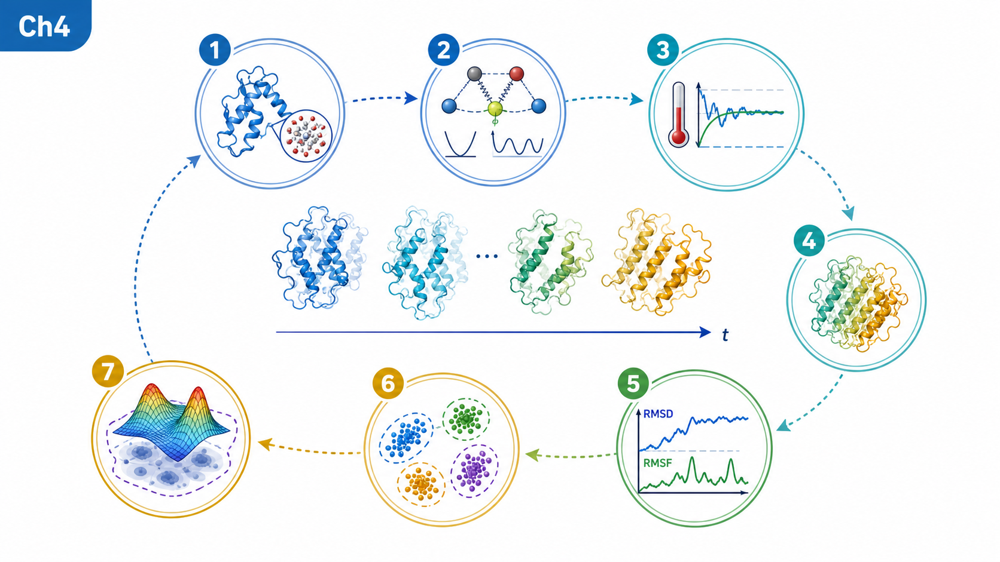
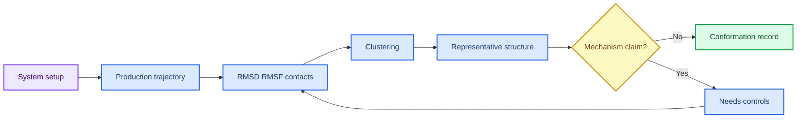
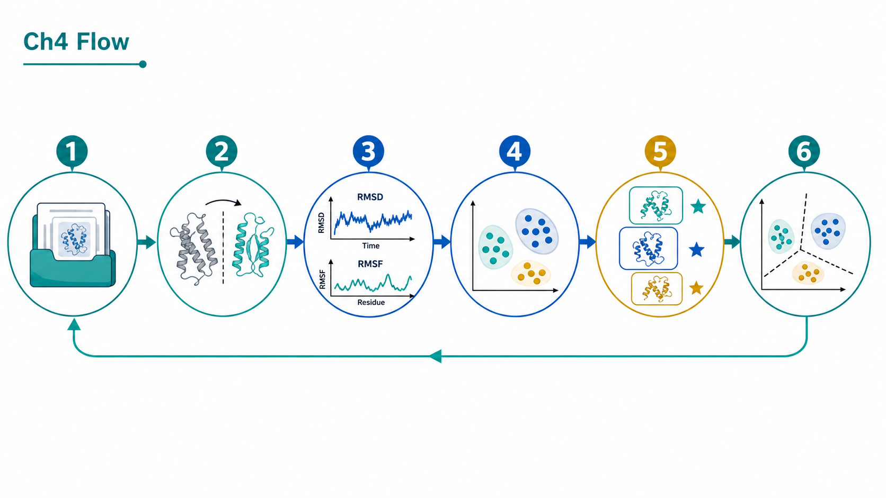
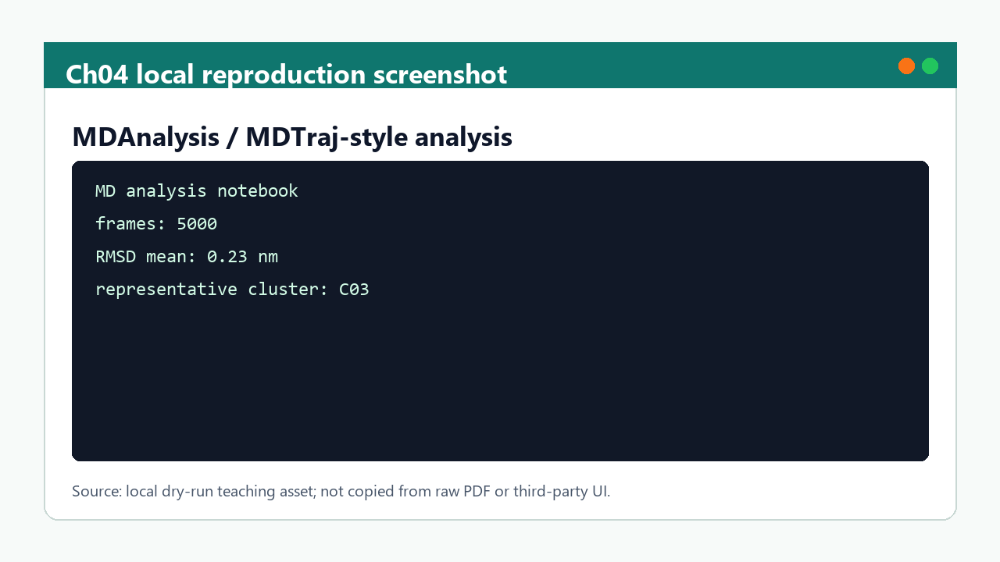

# 第 4 章 AI 采样、分子模拟与 MD 结果解释

## 本章导读

轨迹图和 RMSD 曲线常被直接解释为稳定性结论，但 MD 输出首先需要经过体系、参数和采样充分性检查。 MD 与 AI 采样构象解释中的关键问题不是单个命令或界面能够解决的，而是贯穿输入选择、参数设置、结果解释和后续写作的判断问题。读者进入MD 与 AI 采样构象解释时，应先把自己放在真实研究任务中：如果明天需要把这一步交给同组同学复核，哪些信息必须留下，哪些说法必须谨慎。

本章把 MD 和 AI 采样结果拆成体系准备、轨迹 QC、构象分析、代表结构和解释边界。 MD 与 AI 采样构象解释采用教材讲解写法，不把内容压缩成术语表，而是把概念放回它服务的任务场景中解释。读者在MD 与 AI 采样构象解释中需要关注的不是“记住一个名词”，而是理解它如何限制输入、影响输出、进入质量控制，并支持相应层级的写作判断。

学习MD 与 AI 采样构象解释时，建议先通读核心概念，再回到方法流程表逐步核对。表格用于快速定位输入、动作、输出和 QC，正文段落则解释为什么这些字段不能省略；在MD 与 AI 采样构象解释中，这一点应具体落到轨迹指标、代表帧和分析日志。MD 与 AI 采样构象解释采用这样的顺序，能避免只会照着流程执行却不知道哪一步决定结果可信度。

第 3 章的 docking pose、第 5 章的亲和力解释和第 8 章的项目假设都需要本章的动态证据语言。 因此，MD 与 AI 采样构象解释不是孤立的工具说明，而是后续章节继续工作的接口层。读者完成MD 与 AI 采样构象解释后，应能把本章记录方式转移到下一章，而不是重新发明日志、参数和边界说明。

## 学习目标

围绕MD 与 AI 采样构象解释，学习目标应落实为可复述、可记录、可复核的判断能力。完成本章后，读者应能够：

- 能记录拓扑、力场、溶剂、离子、平衡、生产时间和轨迹文件。
- 能解释 RMSD、RMSF、接触、聚类和代表构象的不同含义。
- 能区分轨迹 QC、结构观察和机制解释。
- 能把 AI 采样或 MD 输出写成有边界的构象证据。

在MD 与 AI 采样构象解释中，这些目标既服务课堂复习，也决定后续记录能否被他人复核；若不能用记录说明输入、动作和边界，本章内容仍应停留在练习层级。

## 知识图谱入口

本章知识图谱连接体系准备、生产轨迹和构象证据。读者应把轨迹指标看作证据片段，而不是单一结论。

在线书籍页面只引用整理后的 wiki、方法卡、文献笔记和资源页，不直接嵌入原始 PDF 或课件图表；在MD 与 AI 采样构象解释中，这一点应具体落到轨迹指标、代表帧和分析日志。需要追溯来源时，应回到 `book/book_map.toml`、章节精读笔记和相关 Zotero/BibTeX 记录；在MD 与 AI 采样构象解释中，这一点应具体落到轨迹指标、代表帧和分析日志。

| 来源类型 | 路径 |
|:---|:---|
| 章节来源 | `01_课程章节索引/章节精读/第04章_AI采样与分子模拟精读.md` |
| 方法来源 | `02_方法笔记/MD_BioEmu_AI采样.md` |
| 文献来源 | `03_文献笔记/分子模拟与生成式设计.md` |
| 实验来源 | `04_实验记录/模板_MD_BioEmu采样记录.md`<br>`04_实验记录/蒙特卡洛采样.md` |
| 工作台来源 | `07_研究工作台/证据与claims矩阵.md` |

### Imagegen 知识图谱

{ loading=lazy }

**图4.1 MD/AI 采样构象证据知识图谱。** 本图为 Imagegen 生成的教学示意图，用中心概念和编号节点概括MD 与 AI 采样构象解释的对象、方法入口、记录字段和证据边界；编号用于正文定位，不承载精确参数或运行结果，术语解释和判断口径以正文表格为准。

| 编号 | 正文权威标签 |
|:---:|:---|
| 1 | 系统准备 |
| 2 | 力场与参数 |
| 3 | 平衡 |
| 4 | 生产轨迹 |
| 5 | RMSD/RMSF |
| 6 | 聚类 |
| 7 | 代表构象 |


### Mermaid 结构图



**图4.2 轨迹分析证据链结构图。** 本图为 Mermaid 教学示意图，展示轨迹载入、RMSD/RMSF、聚类、代表构象和边界记录之间的分析链；箭头表示阅读和记录依赖，不替代真实软件运行或实验验证，具体输入、输出和 QC 标准以正文为准。

MD 与 AI 采样构象解释的 Mermaid 源图和后续 scientific-schematics prompt 见 [Mermaid 图示与示意图设计](../resources/mermaid-schematics.md)。

## 核心概念

MD 与 AI 采样构象解释的核心概念应围绕体系准备、轨迹、RMSD/RMSF 和代表构象来读，而不是孤立背诵术语。本章最重要的训练，是把每个名词都对应到一个可检查的输入、一个会改变结果的动作，以及一个必须写入记录的 QC 或边界条件；在MD 与 AI 采样构象解释中，这一点应具体落到轨迹指标、代表帧和分析日志。

阅读下表时，可以把体系准备、轨迹、RMSD/RMSF 和代表构象拆成几类检查问题：它约束什么来源，改变什么输出，失败时留下什么证据。这样处理后，概念表就成为轨迹指标、代表帧和分析日志的索引，而不是定义的堆叠。

| 概念 | 教材化定义 |
|:---|:---|
| 体系准备 | 体系准备决定模拟对象，包括力场、质子化、配体参数、水盒、离子和平衡过程。 |
| 轨迹 QC | RMSD、能量、温度和压力用于判断运行是否基本可用，但不直接回答机制问题。 |
| 局部柔性 | RMSF、接触频率和距离变化更适合描述局部构象和结合界面。 |
| 聚类 | 聚类用于选择代表构象，结果依赖对齐对象、特征选择和聚类参数。 |
| 解释边界 | MD 支持动态假设，但采样时间、力场和初始结构限制必须写清楚。 |

使用这张表时，不需要一次记住所有术语。更实用的做法是，在准备任务时先圈出与本次输入直接相关的 2-3 个概念，再检查记录中是否已经有对应字段；在MD 与 AI 采样构象解释中，这一点应具体落到轨迹指标、代表帧和分析日志。对于不直接参与MD 与 AI 采样构象解释当前任务的概念，可以作为边界提示保留，避免在写作时把背景信息误写成当前结果。

这些概念之间也不是平级堆叠关系。通常先由任务对象确定输入，再由流程参数约束输出，最后由 QC 和证据边界决定能否进入下一步；在MD 与 AI 采样构象解释中，这一点应具体落到轨迹指标、代表帧和分析日志。读者如果能沿着MD 与 AI 采样构象解释的顺序复述本节内容，就已经掌握了把教材知识转化为研究记录的基本方法。

## 方法流程

MD 与 AI 采样构象解释的方法流程要把从体系检查到代表构象选择的轨迹分析链讲清楚。读者不应只关心是否跑完命令，而要能说明每一步接收什么输入、执行什么动作、写出什么对象，以及哪一个 QC 决定它能否进入下一步；在MD 与 AI 采样构象解释中，这一点应具体落到轨迹指标、代表帧和分析日志。

下表按 `输入 | 动作 | 输出 | QC/边界` 组织，适合在执行前当作检查单使用；在MD 与 AI 采样构象解释中，这一点应具体落到轨迹指标、代表帧和分析日志。对于MD 与 AI 采样构象解释，最后一列尤其重要，因为它把普通操作和可写入研究工作台的证据区分开来。

| 步骤 | 输入 | 动作 | 输出 | QC/边界 |
|:---:|:---|:---|:---|:---|
| 1 | 初始结构 | 确认来源、配体参数和缺失区域。 | 体系准备记录。 | 输入结构与第 2/3 章一致。 |
| 2 | 参数化 | 选择力场、溶剂、离子和约束。 | 拓扑与参数文件。 | 配体和非标准残基参数可追溯。 |
| 3 | 平衡 | 完成能量最小化、NVT/NPT 或等效步骤。 | 平衡日志。 | 温度、压力和能量无明显异常。 |
| 4 | 生产轨迹 | 运行生产模拟或 AI 采样。 | 轨迹和日志。 | 运行长度、步长和保存频率明确。 |
| 5 | 分析 | 计算 RMSD/RMSF、接触、聚类和代表构象。 | 分析表和结构。 | 指标对应具体问题。 |
| 6 | 解释 | 把观察转写成 claim。 | 有边界的构象证据。 | 不把相关模式写成因果机制。 |

执行MD 与 AI 采样构象解释流程表时，应先完成最小样例，再扩大到批量任务。最小样例的价值不是产生有意义的研究结果，而是验证路径、格式、参数和日志是否能闭合；在MD 与 AI 采样构象解释中，这一点应具体落到轨迹指标、代表帧和分析日志。只有当MD 与 AI 采样构象解释的最小样例能够被完整复核时，后续批量表格、结构、轨迹或候选列表才有进入研究工作台的基础。

流程表也提供了写作时的段落顺序。介绍方法时，先交代输入来源和动作，再说明输出形式，最后说明 QC 含义和不能推出的结论；在MD 与 AI 采样构象解释中，这一点应具体落到轨迹指标、代表帧和分析日志。MD 与 AI 采样构象解释采用这个顺序比先展示结果更稳健，因为它让读者看到判断链，而不是只看到筛选后的结论。

## 代码案例与软件操作

{ loading=lazy }

**图4.3 轨迹分析到代表构象选择流程图。** 本图为 Imagegen 生成的流程图，说明从轨迹分析到代表构象选择的解释顺序和 QC 位置；它用于说明操作顺序、关键节点和记录交接位置，不代表实验结果，具体命令、参数和边界判断以正文代码块与步骤表为准。

图中编号节点与下表对应：

| 编号 | 流程节点 |
|:---:|:---|
| 1 | 读取轨迹 |
| 2 | 对齐 |
| 3 | 计算指标 |
| 4 | 聚类 |
| 5 | 复核结构 |
| 6 | 写入边界 |

本节用于训练 **4 章 AI 采样、分子模拟与 MD 结果解释** 的最小复现意识。该示例演示如何从 RMSD 表生成 QC 摘要；真实解释还需要结合接触、聚类和结构复核。

=== "可复制代码"

    ```python
    from pathlib import Path
    import pandas as pd

    rmsd = pd.read_csv('inputs/rmsd.tsv', sep='	')
    summary = {
        'frames': len(rmsd),
        'rmsd_mean_nm': round(rmsd['rmsd_nm'].mean(), 3),
        'rmsd_max_nm': round(rmsd['rmsd_nm'].max(), 3),
    }
    Path('outputs').mkdir(exist_ok=True)
    pd.Series(summary).to_csv('outputs/md_qc_summary.tsv', sep='	', header=False)
    ```

=== "配套文件"

    完整示例文件：[`chapter-04-md-summary.py`](../assets/code/chapter-04-md-summary.py)

{ loading=lazy }

**图4.4 MD 分析 dry-run 软件操作截图。** 本图为本地 dry-run 截图，展示 MD 分析 dry-run 中的指标表、代表帧选择和记录字段；截图用于说明界面、文件或表格位置，不代表实验结果，读者应按本机路径替换参数并以正文操作表为准。

| 步骤 | 操作 |
|:---:|:---|
| 1 | 读取 topology 和 trajectory，并记录单位。 |
| 2 | 计算 RMSD/RMSF、聚类和代表构象。 |
| 3 | 把指标和人工复核写入实验记录。 |

### 教材化阅读提示

本节代码应作为MD 指标表与代表帧 dry-run的可复查样例来读。它展示的是如何把MD 与 AI 采样构象解释中的一次小任务写成可复制、可失败、可追溯的记录，而不是声明已经完成真实研究运行。

替换参数时，应先替换与MD 与 AI 采样构象解释直接相关的输入路径，再调整会影响解释的阈值、空间范围或模型参数。如果MD 与 AI 采样构象解释的最小样例尚不能解释输出来源，就不应扩大到批量任务。

解读输出时，只记录代码确实生成的对象，例如 manifest、配置、dry-run 表格、截图或日志；在MD 与 AI 采样构象解释中，这一点应具体落到轨迹指标、代表帧和分析日志。这些对象可以支持轨迹指标、代表帧和分析日志的整理，但不能自动升级为实验结论；需要形成研究判断时，仍要回到实验记录模板补齐输入、QC、人工复核和待验证项。
## 关键文献

<!-- refs:start -->

- Chen, S., Lin, T., Basu, R., Ritchey, J., Wang, S., Luo, Y. et al. Design of target specific peptide inhibitors using generative deep learning and molecular dynamics simulations. Nature Communications (2024). https://doi.org/10.1038/s41467-024-45766-2

  **本文内容简介：** 本文结合生成式深度学习、柔性肽对接和分子动力学设计靶向肽抑制剂。

- Gu, S., Shen, C., Yu, J., Zhao, H., Liu, H., Liu, L. et al. Can molecular dynamics simulations improve predictions of protein-ligand binding affinity with machine learning?. Briefings in Bioinformatics 24, bbad008 (2023). https://doi.org/10.1093/bib/bbad008

  **本文内容简介：** 本文讨论分子动力学模拟能否提升机器学习预测蛋白-配体亲和力的效果。

<!-- refs:end -->
## 实验/练习入口

本章练习的重点是把MD 与 AI 采样构象解释转化成可交接记录。练习完成后，读者应能让另一个人根据记录复现从体系检查到代表构象选择的轨迹分析链，并判断是否具备进入第 5 章亲和力预测的条件。

建议按以下顺序完成：

1. 为一个短轨迹写出体系准备字段和轨迹文件清单。
2. 计算或模拟 RMSD/RMSF 摘要，并说明这些指标回答不了什么问题。
3. 选择一个代表构象，写出选择依据和不能据此声称的结论。

完成练习后，应检查记录中是否包含轨迹指标、代表帧和分析日志、失败原因和人工判断。缺少轨迹指标、代表帧和分析日志时，相关内容仍适合作为课堂尝试，不适合写入正式研究结论。

如果练习借用了文献案例或课程范文，应在MD 与 AI 采样构象解释记录中明确它只是方法参照或边界样例。在MD 与 AI 采样构象解释中，文献案例可以启发流程设计，但不能替代本项目的本地运行结果。

## 使用边界与常见误读

MD 与 AI 采样构象解释最容易被误写的对象是轨迹稳定、构象聚类和代表帧选择。在MD 与 AI 采样构象解释中，这些对象看起来像结果，但在当前教材层级通常只是模型输出、流程观察、可视化线索或文献案例。

下表用于训练写作降级。在MD 与 AI 采样构象解释中，读者应先判断当前证据最多能支持什么说法，再决定是否写成“提示”“支持”“流程参考”或“仍需验证”。

| 易误读对象 | 稳健表述 | 写作处理 |
|:---|:---|:---|
| RMSD 稳定 | 提示整体构象变化较小。 | 不能单独证明结合稳定或活性增强。 |
| 轨迹聚类 | 提供代表构象候选。 | 结果依赖特征、对齐和采样长度。 |
| AI 采样 | 可扩展构象搜索。 | 模型版本和采样策略需记录，不能替代实验。 |
| 机制解释 | 可提出可能解释。 | 仍需多来源证据或实验验证。 |

边界判断并不是削弱MD 与 AI 采样构象解释的价值，而是说明证据在哪里停止。如果删除某个软件名、截图、分数或文献案例后，结论就无法成立，通常应把该结论降级为候选线索或下一步验证任务；在MD 与 AI 采样构象解释中，这一点应具体落到轨迹指标、代表帧和分析日志。

只有当MD 与 AI 采样构象解释对应的真实运行记录、复核结果和严格计算或实验支持已经进入项目记录，相关判断才适合升级为更强表述。

本章的边界判断集中在轨迹指标的解释上。RMSD、RMSF、聚类和代表帧可以提示构象变化，但不能单独证明结合更稳定或活性更强。读者应把分析窗口、选择规则和异常帧写清楚，使后续亲和力预测知道使用的是哪一类构象证据。

## 延伸阅读与下一步

MD 与 AI 采样构象解释的延伸阅读应服务下一次可执行任务，而不是停留在资料补充。读者完成本章后，应能判断哪些内容进入轨迹指标、代表帧和分析日志，哪些内容进入阅读队列，哪些内容只能作为背景案例。

建议按以下路径进入下一轮学习或研究任务：

1. 把代表构象回送第 3 章复核 pose 或重新定义口袋。
2. 把构象和接触特征交给第 5 章亲和力模型解释。
3. 在第 8 章把动态证据写入 claims 矩阵并标注证据强度。

选择下一步时，应优先检查MD 与 AI 采样构象解释的证据链是否足以支撑转入第 5 章亲和力预测。若输入来源、参数、QC 或边界尚未记录清楚，应先补齐本章记录，而不是继续叠加更复杂的工具；在MD 与 AI 采样构象解释中，这一点应具体落到轨迹指标、代表帧和分析日志。

完成这种转换后，MD 与 AI 采样构象解释就不只是读过的教材内容，而是可以被检索、复核和继续执行的研究资产。

进入亲和力预测前，读者应先说明代表构象为什么被选中。若轨迹尚未达到可解释状态，下一步应回到体系准备或分析参数，而不是把未经解释的帧直接交给下游模型。
