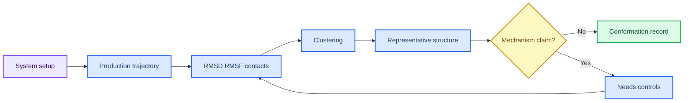

# 第 4 章 AI 采样、分子模拟与 MD 结果解释

## 本章导读

MD 和 AI 采样常被用来补充静态结构，但轨迹曲线本身并不等于机制说明。RMSD、RMSF、接触频率、聚类和代表构象都需要放回体系准备、时间尺度、分析窗口和选择规则中解释。

本章的任务是训练读者把轨迹输出写成构象证据。一个 RMSD 曲线可以提示整体构象变化是否较小，但不能单独支持配体结合稳定；一个代表帧可以用于后续模型输入，但不能代表全部构象空间。

第 5 章亲和力预测和第 8 章项目池都会复用本章构象证据。因此，本章完成后应留下轨迹指标、分析脚本、代表帧选择规则和异常帧说明，而不是只保留一张曲线图。

轨迹分析的难点不在于画出曲线，而在于说明曲线来自什么体系、覆盖什么时间窗口、采用什么对齐和选择规则。读者应把每一张 RMSD/RMSF 图都视为带条件的观察，而不是自动成立的稳定性判断。

因此，本章更像一个解释训练：同一条轨迹可以支持不同层级的说法，关键在于读者是否能说明参数和窗口。

## 学习目标

本章目标是把轨迹和采样结果读成构象证据，而不是把曲线形状直接写成机制结论。完成本章后，读者应能够：

- 能记录拓扑、力场、溶剂、离子、平衡、生产时间和轨迹文件。
- 能解释 RMSD、RMSF、接触、聚类和代表构象的不同含义。
- 能区分轨迹 QC、结构观察和机制解释。
- 能把 AI 采样或 MD 输出写成有边界的构象证据。

这些目标用于保护 MD 解释边界。轨迹指标可以提示构象变化，但只有在体系准备、分析窗口和代表帧选择都可复查时，才适合进入后续亲和力或机制讨论。

## 知识图谱入口

本章知识图谱连接体系准备、生产轨迹和构象证据。读者应把轨迹指标看作证据片段，而不是单一结论。

在线书籍页面只引用整理后的 wiki、方法卡、文献笔记和资源页，不直接嵌入原始 PDF 或课件图表；在MD 与 AI 采样构象解释中，这一点应具体落到轨迹指标、代表帧和分析日志。需要追溯来源时，应回到 `book/book_map.toml`、章节精读笔记和相关 Zotero/BibTeX 记录；在MD 与 AI 采样构象解释中，这一点应具体落到轨迹指标、代表帧和分析日志。

| 来源类型 | 路径 |
|:---|:---|
| 章节来源 | `01_课程章节索引/章节精读/第04章_AI采样与分子模拟精读.md` |
| 方法来源 | `02_方法笔记/MD_BioEmu_AI采样.md` |
| 文献来源 | `03_文献笔记/分子模拟与生成式设计.md` |
| 实验来源 | `04_实验记录/模板_MD_BioEmu采样记录.md`<br>`04_实验记录/蒙特卡洛采样.md` |
| 工作台来源 | `07_研究工作台/证据与claims矩阵.md` |

### Imagegen 知识图谱

{ loading=lazy }

**图4.1 MD/AI 采样构象证据知识图谱。** 本图为 Imagegen 生成的教学示意图，用中心概念和编号节点概括MD 与 AI 采样构象解释的对象、方法入口、记录字段和证据边界；编号用于正文定位，不承载精确参数或运行结果，术语解释和判断口径以正文表格为准。 节点编号：1=系统准备；2=力场与参数；3=平衡；4=生产轨迹；5=RMSD/RMSF；6=聚类；7=代表构象。

### Mermaid 结构图



**图4.2 轨迹分析证据链结构图。** 本图为 Mermaid 教学示意图，展示轨迹载入、RMSD/RMSF、聚类、代表构象和边界记录之间的分析链；箭头表示阅读和记录依赖，不替代真实软件运行或实验验证，具体输入、输出和 QC 标准以正文为准。

MD 与 AI 采样构象解释的 Mermaid 源图和后续 scientific-schematics prompt 见 [Mermaid 图示与示意图设计](../resources/mermaid-schematics.md)。

## 核心概念

MD 与 AI 采样的核心概念围绕“体系如何准备、轨迹如何分析、代表构象如何选择”展开。它们共同决定构象证据能否进入后续模型。

| 概念 | 教材化定义 |
|:---|:---|
| 体系准备 | 体系准备决定模拟对象，包括力场、质子化、配体参数、水盒、离子和平衡过程。 |
| 轨迹 QC | RMSD、能量、温度和压力用于判断运行是否基本可用，但不直接回答机制问题。 |
| 局部柔性 | RMSF、接触频率和距离变化更适合描述局部构象和结合界面。 |
| 聚类 | 聚类用于选择代表构象，结果依赖对齐对象、特征选择和聚类参数。 |
| 解释边界 | MD 支持动态假设，但采样时间、力场和初始结构限制必须写清楚。 |

阅读概念表时，应把每个指标对应到一个判断问题：RMSD 回答整体变化，RMSF 回答局部柔性，接触图回答相互作用保留情况，聚类回答构象代表性。

这些指标不能孤立使用。体系准备限定模拟对象，分析窗口限定可解释范围，聚类和代表帧则决定后续输入。记录中应同时保留参数、脚本、图表和选择理由。

例如，RMSD 受对齐方式影响，RMSF 受分析区域影响，接触频率受阈值影响，聚类结果受特征和聚类算法影响。概念表中的指标只有和参数一起记录，才适合被后续章节复用。

对于 AI 采样结果，同样需要记录采样条件和选择规则。模型生成的构象可以补充搜索空间，但不能代替真实 MD 的时间演化，也不能自动代表热力学稳定态。

这些指标还应与研究问题对应：若问题关注口袋稳定性，接触和局部柔性比整体 RMSD 更关键；若问题关注构象选择，聚类和代表帧规则更关键。

## 方法流程

本章流程从轨迹载入和对齐开始，以代表构象和边界说明结束。每一步都需要说明输入、指标和选择规则。

| 步骤 | 输入 | 动作 | 输出 | QC/边界 |
|:---:|:---|:---|:---|:---|
| 1 | 初始结构 | 确认来源、配体参数和缺失区域。 | 体系准备记录。 | 输入结构与第 2/3 章一致。 |
| 2 | 参数化 | 选择力场、溶剂、离子和约束。 | 拓扑与参数文件。 | 配体和非标准残基参数可追溯。 |
| 3 | 平衡 | 完成能量最小化、NVT/NPT 或等效步骤。 | 平衡日志。 | 温度、压力和能量无明显异常。 |
| 4 | 生产轨迹 | 运行生产模拟或 AI 采样。 | 轨迹和日志。 | 运行长度、步长和保存频率明确。 |
| 5 | 分析 | 计算 RMSD/RMSF、接触、聚类和代表构象。 | 分析表和结构。 | 指标对应具体问题。 |
| 6 | 解释 | 把观察转写成 claim。 | 有边界的构象证据。 | 不把相关模式写成因果机制。 |

执行时先用教学轨迹或小样例确认分析脚本能输出 RMSD、RMSF、聚类和代表帧表，再处理真实轨迹。dry-run 的目标是检查字段和流程，不是说明体系已经稳定。

写作时应先说明体系和轨迹来源，再报告分析窗口和指标，随后解释代表构象选择理由。若时间尺度、重复次数或体系参数不足，应在同一段中明确限制。

轨迹分析还应记录异常帧和排除规则。教学中可以先选择一个短轨迹样例，比较不同对齐对象或窗口设置对 RMSD 的影响，从而理解指标不是单独存在的数值，而是分析决策的结果。

如果准备把代表帧交给第 5 章，应在流程记录中说明为什么选择该帧。选择依据可以是聚类中心、关键接触保留或异常帧排除，但不能只是“看起来较好”。

记录分析窗口时，还应说明起止帧、采样间隔和是否排除平衡阶段。没有这些信息，后续读者无法判断曲线差异来自体系变化还是分析设置。

## 代码案例与软件操作

{ loading=lazy }

**图4.3 轨迹分析到代表构象选择流程图。** 本图为 Imagegen 生成的流程图，说明从轨迹分析到代表构象选择的解释顺序和 QC 位置；它用于说明操作顺序、关键节点和记录交接位置，不代表实验结果，具体命令、参数和边界判断以正文代码块与步骤表为准。 流程编号：1=读取轨迹；2=对齐；3=计算指标；4=聚类；5=复核结构；6=写入边界。

本节用于训练 **4 章 AI 采样、分子模拟与 MD 结果解释** 的最小复现意识。该示例演示如何从 RMSD 表生成 QC 摘要；真实解释还需要结合接触、聚类和结构复核。

=== "可复制代码"

    ```python
    from pathlib import Path
    import pandas as pd

    rmsd = pd.read_csv('inputs/rmsd.tsv', sep='	')
    summary = {
        'frames': len(rmsd),
        'rmsd_mean_nm': round(rmsd['rmsd_nm'].mean(), 3),
        'rmsd_max_nm': round(rmsd['rmsd_nm'].max(), 3),
    }
    Path('outputs').mkdir(exist_ok=True)
    pd.Series(summary).to_csv('outputs/md_qc_summary.tsv', sep='	', header=False)
    ```

=== "配套文件"

    完整示例文件：[`chapter-04-md-summary.py`](../assets/code/chapter-04-md-summary.py)

{ loading=lazy }

**图4.4 MD 分析 dry-run 软件操作截图。** 本图为本地 dry-run 截图，展示 MD 分析 dry-run 中的指标表、代表帧选择和记录字段；截图用于说明界面、文件或表格位置，不代表实验结果，读者应按本机路径替换参数并以正文操作表为准。

| 步骤 | 操作 |
|:---:|:---|
| 1 | 读取 topology 和 trajectory，并记录单位。 |
| 2 | 计算 RMSD/RMSF、聚类和代表构象。 |
| 3 | 把指标和人工复核写入实验记录。 |

### 教材化阅读提示

本节代码应作为MD 指标表与代表帧 dry-run的可复查样例来读。它展示的是如何把MD 与 AI 采样构象解释中的一次小任务写成可复制、可失败、可追溯的记录，而不是声明已经完成真实研究运行。

替换参数时，应先替换与MD 与 AI 采样构象解释直接相关的输入路径，再调整会影响解释的阈值、空间范围或模型参数。如果MD 与 AI 采样构象解释的最小样例尚不能解释输出来源，就不应扩大到批量任务。

解读输出时，只记录代码确实生成的对象，例如 manifest、配置、dry-run 表格、截图或日志；在MD 与 AI 采样构象解释中，这一点应具体落到轨迹指标、代表帧和分析日志。这些对象可以支持轨迹指标、代表帧和分析日志的整理，但不能自动升级为实验结论；需要形成研究判断时，仍要回到实验记录模板补齐输入、QC、人工复核和待验证项。
## 关键文献

文献使用说明：本章文献用于说明生成式设计与 MD 联用、以及 MD 是否能提升机器学习亲和力预测。相关文献支持方法组织和边界讨论，不代表 AI_MD 已完成同类真实模拟。

<!-- refs:start -->

- Chen, S., Lin, T., Basu, R., Ritchey, J., Wang, S., Luo, Y. et al. Design of target specific peptide inhibitors using generative deep learning and molecular dynamics simulations. Nature Communications (2024). https://doi.org/10.1038/s41467-024-45766-2

  **本文内容简介：** 本文结合生成式深度学习、柔性肽对接和分子动力学设计靶向肽抑制剂。

- Gu, S., Shen, C., Yu, J., Zhao, H., Liu, H., Liu, L. et al. Can molecular dynamics simulations improve predictions of protein-ligand binding affinity with machine learning?. Briefings in Bioinformatics 24, bbad008 (2023). https://doi.org/10.1093/bib/bbad008

  **本文内容简介：** 本文讨论分子动力学模拟能否提升机器学习预测蛋白-配体亲和力的效果。

<!-- refs:end -->

## 实验/练习入口

本章练习的重点是把MD 与 AI 采样构象解释转化成可交接记录。练习完成后，读者应能让另一个人根据记录复现从体系检查到代表构象选择的轨迹分析链，并判断是否具备进入第 5 章亲和力预测的条件。

建议按以下顺序完成：

1. 为一个短轨迹写出体系准备字段和轨迹文件清单。
2. 计算或模拟 RMSD/RMSF 摘要，并说明这些指标回答不了什么问题。
3. 选择一个代表构象，写出选择依据和不能据此声称的结论。

完成练习后，应检查记录中是否包含轨迹指标、代表帧和分析日志、失败原因和人工判断。缺少轨迹指标、代表帧和分析日志时，相关内容仍适合作为课堂尝试，不适合写入正式研究结论。

如果练习借用了文献案例或课程范文，应在MD 与 AI 采样构象解释记录中明确它只是方法参照或边界样例。在MD 与 AI 采样构象解释中，文献案例可以启发流程设计，但不能替代本项目的本地运行结果。

## 使用边界与常见误读

本章最容易被过度解释的是“稳定”“聚类清楚”和“代表帧合理”。这些说法都需要受时间尺度和体系设置限制。

本章使用边界表时，应把轨迹指标放回模拟窗口、对齐方式和代表帧选择规则中解释。

| 易误读对象 | 稳健表述 | 写作处理 |
|:---|:---|:---|
| RMSD 稳定 | 提示整体构象变化较小。 | 不能单独支持结合稳定或活性增强。 |
| 轨迹聚类 | 提供代表构象候选。 | 结果依赖特征、对齐和采样长度。 |
| AI 采样 | 可扩展构象搜索。 | 模型版本和采样策略需记录，不能替代实验。 |
| 机制解释 | 可提出可能解释。 | 仍需多来源证据或实验验证。 |

轨迹指标的边界应停在当前模拟条件下的构象观察。短时模拟、单重复或未充分平衡的体系不能支持强机制结论。

稳健写法是“RMSD/RMSF 提示该窗口内构象变化较小”或“该代表帧适合作为下一步模型输入”，而不是“确认结合稳定”或“说明药效增强”。

本章使用边界表时，应避免把“稳定”当作绝对状态。更合适的表达是“在当前窗口内变化较小”或“该代表帧适合进入下一步复核”。如果模拟时间、重复次数或力场参数不足，应在结论旁边直接说明。

文献案例中的 MD 结果也应作为方法参照，而不是本项目结果。读者可以借鉴其分析指标、图表组织和验证逻辑，但必须用本项目轨迹和记录支持本项目判断。

## 延伸阅读与下一步

完成本章后，应把构象证据交给亲和力或项目决策流程。推荐路径如下：

1. 将代表构象和选择规则交给第 5 章做亲和力预测输入说明。
2. 将异常帧、柔性区域和接触变化写入实验记录，作为后续复核对象。
3. 将仍缺重复、时间尺度或参数确认的任务放入第 8 章项目池，而不是直接写成机制结论。

进入第 5 章前，读者应把代表构象与选择规则一起交接，而不是只交接一个 PDB 文件。记录中应包含轨迹来源、对齐方式、聚类方法、代表帧编号和排除理由。这样亲和力预测才能知道输入结构代表什么构象状态。若轨迹证据仍不充分，应把任务放回实验队列，补充重复、延长模拟或调整体系准备。

若要进一步增强本章证据，可以优先补三个对象：体系准备记录、重复轨迹或对照体系、代表帧选择表。这些材料比单独增加图像更有价值，因为它们直接决定后续亲和力预测能否解释输入构象。若当前只有 dry-run 输出，应明确保留在教学层级。

若后续要写入综述或课题申请，本章材料应被表述为构象证据层，而不是功能验证层。把这一层级写清楚，可以让评审者看到后续仍需要亲和力、自由能或实验验证。
