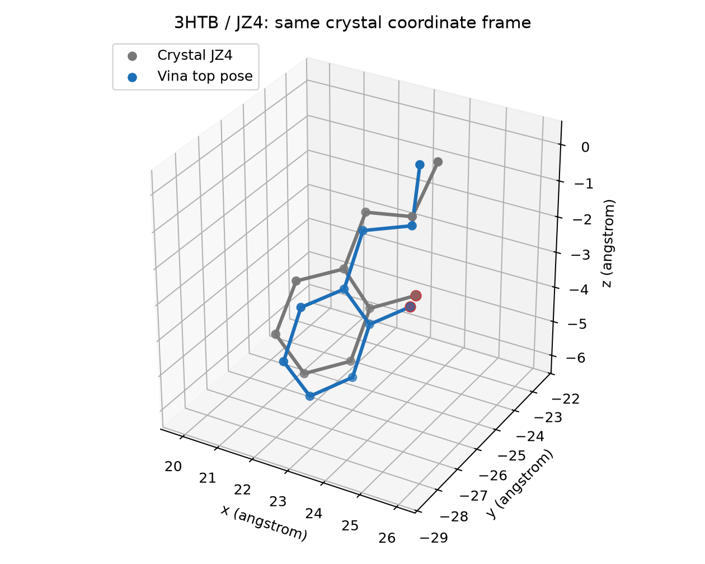
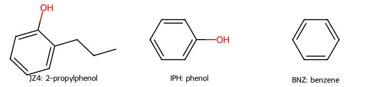

# 第 4 章 分子对接与虚拟筛选

本章把第 3 章的输入真正运行起来。先用 CPU Vina 对 JZ4 重对接，检查它能否回到晶体口袋；再运行 JZ4、IPH、BNZ 三个分子；最后故意偏移盒子，观察搜索区域怎样改变结果。

分子对接生成候选姿势并按软件评分排序。虚拟筛选把这一过程扩展到分子库或靶点集合。初学时先保留每个分子的输入、参数、日志和姿势，再谈扩大规模。

搜索空间由盒子和允许改变的自由度共同确定。Vina 尝试配体的平移、转动及可旋转键变化，产生不同 pose，再由评分函数比较；本章刚性受体的原子坐标在搜索时保持不变。相同协议下，Vina score 越低、越负，排序越靠前。下面通过晶体参考和偏移盒子，检查这种排序对应的实际姿势。

| 本章输出 | 核对方式 |
|---|---|
| 对接 PDBQT 和 JZ4 SDF | 打开姿势，确认在预定区域 |
| 日志和运行参数 | 查看版本、盒子、seed、CPU 与完成状态 |
| 三分子 TSV | 每个输入都有状态，失败不被遗漏 |
| 重对接 RMSD | 用晶体参考、同一坐标系和对应重原子计算 |

## 4.1 传统对接工具：Vina、HDOCK、HADDOCK、LightDock

Vina 常用于蛋白–小分子对接；HDOCK、HADDOCK 和 LightDock 常用于大分子对接任务，输入和约束方式各不相同。选择前先确认分子类型、搜索范围以及是否有实验约束。

本章基础实跑使用 [AutoDock Vina 1.2.7 官方发布版](https://github.com/ccsb-scripps/AutoDock-Vina/releases/tag/v1.2.7)，CPU、刚性受体与 Vina 默认评分。它与使用 AutoDock4 maps 的设置是不同协议。本书没有在这次运行中生成 AutoDock4 maps。

| 任务 | 本章主线或阅读入口 | 起步前的重点 |
|---|---|---|
| 蛋白–小分子 | CPU Vina | PDBQT、盒子、扭转与评分协议 |
| 蛋白–蛋白 | HDOCK / HADDOCK / LightDock | 两个分子、界面、约束、柔性 |
| 蛋白–核酸 | 有相应支持的方法 | 核酸类型、链、电荷和约束 |
| 金属相关位点 | 有相应参数和几何支持的方法 | 配位和评分模型，不能只看文件能否读入 |

软件安装成功后先运行小例子。官方示例和本书实跑记录提供不同用途：官方示例帮助核对工具，3HTB 帮助理解同一组输入的处理和比较。

## 4.2 AI 对接工具：DiffDock、SurfDock 与复合物结构预测

AI 方法可能生成姿势、为姿势排序，也可能直接预测多组分复合物。先分清任务，再比较结果。DiffDock 和 SurfDock 属于蛋白–小分子姿势预测方法；AlphaFold 3 等面向多类生物分子相互作用结构预测。

| 任务 | 输入和输出的重点 | 比较时保存什么 |
|---|---|---|
| 姿势生成 | 受体/配体输入到候选坐标 | 相同化学对象、结构与预测坐标 |
| 姿势排序 | 多个姿势到评分或置信字段 | 字段定义、方向、候选数量 |
| 多组分结构预测 | 序列/化学组分/约束到复合物 | 全部输入、版本、随机设置与模型指标 |
| 虚拟筛选评估 | 分子集合与标签到排序指标 | 测试集合、划分、已知活性、评价规则 |

姿势 RMSD 与筛选富集评价不同：前者比较坐标，后者检查真实标签在排序中的分布。Gu 等的 AI docking benchmark 用于学习这种评价区别，SurfDock 原始论文用于了解方法输入和表面信息的作用。阅读时记录测试对象与划分，不把一个总体指标直接填到自己的靶点上。

## 4.3 蛋白–小分子对接

### 第一步：准备程序与输入

确认第 3 章已生成 `inputs/3htb`。下载 [run_vina_case.py](../assets/chapter-04/code/run_vina_case.py) 到 `scripts`。从官方发布页下载 `vina_1.2.7_win.exe`，放到新建的 `tools` 目录，检查版本。Vina 程序直接运行，本练习不安装 CUDA。

全书下载器将本章脚本保留在 `downloads/chapter-04/assets/code`。先复制到工作区；`inputs/3htb` 应是第 3 章生成的准备目录。若直接使用已验证输入，将下载目录中的 `chapter-03/assets/data/3htb` 完整复制为 `inputs/3htb`，不要把 PDBQT 零散放到 `inputs` 顶层。

```powershell
Copy-Item downloads/chapter-04/assets/code/run_vina_case.py scripts/
Copy-Item downloads/chapter-04/assets/code/plot_redocking.py scripts/
```

```powershell
New-Item -ItemType Directory -Force tools
.\tools\vina_1.2.7_win.exe --version
Get-ChildItem inputs/3htb/*.pdbqt
```

你应看到一个 receptor 和三个 ligand PDBQT。网络或本机环境暂时不能运行时，可先下载本章真实输出阅读；完成基础实操仍需用相同输入运行一次。

### 第二步：先只运行 JZ4

下面命令使用两条 CPU 线程、固定 seed 与搜索强度。`--out` 必须指向新目录，脚本会拒绝覆盖已有运行。

```powershell
.\.venv-win\Scripts\python.exe scripts/run_vina_case.py --vina tools/vina_1.2.7_win.exe --inputs inputs/3htb --out outputs/vina-jz4 --ligands JZ4 --cpu 2 --seed 20261002 --exhaustiveness 16
```

脚本从 `box.json` 读取中心和 18 Å 边长，要求 Vina 最多输出 9 个姿势。`exhaustiveness` 控制搜索工作量；`seed` 控制随机初始化；二者不替代正确的受体、配体和盒子。

| 文件 | 意义与核对动作 |
|---|---|
| `JZ4.log` | 查看 Vina 版本、参数、评分表与错误 |
| `JZ4_out.pdbqt` | 查看生成的姿势 |
| `JZ4_poses.sdf` | 通过 Meeko 恢复化学连接，便于查看和计算 |
| `JZ4_redocking_rmsd.json` | 各姿势与晶体参考的重原子 RMSD |
| `run_parameters.json` | 保存实际命令、评分协议和盒子 |
| `docking_results.tsv` | 本次分子的状态与首位评分 |

查看输出。发生失败时，先打开相应日志，不把空姿势或缺失分数填成零。

```powershell
Get-Content outputs/vina-jz4/JZ4.log -Tail 20
Get-Content outputs/vina-jz4/JZ4_redocking_rmsd.json
Get-Content outputs/vina-jz4/docking_results.tsv
```

### 第三步：与晶体参考比较

本书记录中的 JZ4 首位 Vina score 为 −7.190 kcal/mol，晶体参考 RMSD 为 0.4946 Å。运行参数为 Vina 1.2.7、CPU 2、seed 20261002、exhaustiveness 16。完整记录见 [实际结果表](../assets/chapter-04/results/3htb-cpu-seed20261002/docking_results.tsv) 和 [RMSD 文件](../assets/chapter-04/results/3htb-cpu-seed20261002/JZ4_redocking_rmsd.json)。

这里的 RMSD 是对对应重原子计算平方距离平均后开方，处理分子对称对应关系，保持原晶体坐标，不对配体再次拟合。若把配体单独叠合后再计算，就会丢失位置偏移。Vina 日志中的 `rmsd l.b.`/`rmsd u.b.` 则比较各输出姿势与 Vina 的首位姿势，不能当作晶体参考 RMSD。



图由真实 SDF 坐标独立绘制，灰色为晶体参考，蓝色为 Vina 首位姿势，氧原子为红色；没有做配体拟合。将 [plot_redocking.py](../assets/chapter-04/code/plot_redocking.py) 放入 `scripts` 后，可用自己的 JZ4 输出生成同样的坐标图和三分子结构图。

```powershell
.\.venv-win\Scripts\python.exe scripts/plot_redocking.py --inputs inputs/3htb --results outputs/vina-jz4 --out outputs/vina-figures
```

在 PyMOL 中载入受体、晶体参考和 SDF，对照查看。不要执行配体 `align`。

```pymol
load inputs/3htb/3htb_receptor.pdb, receptor
load inputs/3htb/jz4_reference.sdf, crystal_jz4
load outputs/vina-jz4/JZ4_poses.sdf, docked_jz4
hide everything
show cartoon, receptor
show sticks, crystal_jz4 or docked_jz4
color gray60, crystal_jz4
color marine, docked_jz4
set all_states, off
frame 1
zoom crystal_jz4, 8
```

### 第四步：偏移盒子做对照

先预测盒子中心向 x 方向移动 20 Å 后，配体是否还能回到晶体口袋。保持其他设置不变，运行到新目录。

```powershell
.\.venv-win\Scripts\python.exe scripts/run_vina_case.py --vina tools/vina_1.2.7_win.exe --inputs inputs/3htb --out outputs/vina-jz4-shift --ligands JZ4 --cpu 2 --seed 20261002 --exhaustiveness 16 --center-shift 20 0 0
```

本书已实际运行这组对照。中心偏移后，晶体区域不在原先的搜索范围内，首位姿势和晶体参考明显分离。

| 协议 | 首位 score，kcal/mol | 晶体参考重原子 RMSD，Å |
|---|---:|---:|
| 原盒子 | −7.190 | 0.4946 |
| x 方向偏移 20 Å | −2.266 | 12.0510 |

[对照 RMSD](../assets/chapter-04/results/3htb-shift-x20-seed20261002/JZ4_redocking_rmsd.json) 保留相同的比较定义。打开偏移 pose，写出它到了蛋白什么位置，再解释为何延长搜索不能替代纠正盒子。不要通过移动输出坐标使其看起来回到原口袋。

## 4.4 蛋白–蛋白对接

蛋白–蛋白任务需要两条或多条分子链以及界面搜索设置。初学者先核对链、完整性、已知界面和柔性区域；不能把整个蛋白转换成小分子扭转树后套用本章 Vina 命令。

| 准备问题 | 学生应保存的内容 |
|---|---|
| 参与分子是什么 | 名称、序列、所选链、结构与构象状态 |
| 有无实验界面信息 | 残基编号、突变/交联等来源，约束写法 |
| 是否做全局搜索 | 搜索范围与对称性设置 |
| 如何复核界面 | 碰撞、埋藏区域、关键接触、聚类与模型评分 |

基础阅读任务选一项公开方法示例，标出两条分子链和界面约束；比较“有界面约束”与“无界面约束”各自搜索什么。运行大分子任务时从 HDOCK、HADDOCK 或 LightDock 官方示例开始。第 9–10 章将从设计方向继续处理骨架和界面。

## 4.5 蛋白–核酸对接

核酸有带电骨架、碱基配对和不同构象状态。先确认 DNA/RNA、单链/双链、序列、链 ID、完整性和实验条件，再选择支持该对象的方法。

用第 2 章的 1BNA 观察核酸链与碱基，填写“序列—链—残基范围”记录。若要建立蛋白–核酸体系，还需加入实际蛋白和位点来源。保持已知配对或结构约束，说明离子与水的处理；只有核酸文件无法完成蛋白–核酸对接。

| 输入项 | 常见错误 |
|---|---|
| 核酸链和残基编号 | 界面约束指向另一条链 |
| 序列与结构范围 | 缺失片段被当成完整结构 |
| 离子条件与参数 | 用小分子默认处理忽略骨架状态 |
| 结果检查 | 只看模型 score，不检查穿插和界面几何 |

## 4.6 蛋白–金属离子对接

金属可能维持位点，也可能直接参与配体配位。普通非键相互作用评分未必适合具体配位化学，必须检查软件支持、价态假设、配位数和几何要求。

本章 3HTB 基础体系不含必需位点金属，因此不演示“添加一个金属原子后直接 Vina”的操作。选学时先选择有实验结构的金属位点，标出金属和配位原子，将方法支持和参数来源写入第 3 章组分清单。

| 位点检查 | 记录内容 |
|---|---|
| 金属身份 | 元素、价态假设、结构来源 |
| 配位几何 | 配位残基/配体原子、距离和几何类型 |
| 方法支持 | 专用约束、参数或模型如何表示 |
| 结果复核 | 是否破坏原位点，是否出现异常穿插 |

无法说明方法如何处理配位时，先停在输入分析，不凭一个 score 评价配体。

## 4.7 小分子数据库建立

小分子库的每一行需要指向一个明确化学对象。本章使用三个官方 CCD 组分，减少检索与制备负担，同时保留分子身份。



结构图来自本书下载的 CCD SDF，经 RDKit 独立绘制。三分子只用于流程练习，IPH 和 BNZ 没有在本书中被定义为实验阴性对照。

| CCD ID | 化学名称 | 重原子数 | 本次形式电荷 |
|---|---|---:|---:|
| [JZ4](https://www.rcsb.org/ligand/JZ4) | 2-propylphenol | 10 | 0 |
| [IPH](https://www.rcsb.org/ligand/IPH) | phenol | 7 | 0 |
| [BNZ](https://www.rcsb.org/ligand/BNZ) | benzene | 6 | 0 |

同名化合物的盐形式、质子化、互变异构和立体异构可能不同。分子库扩大时，为这些状态分配明确 ID，记录原始 ID、转换规则和失败信息。去重依据化学结构与状态，不能只按文件名删除。

本案例的 [ligand_manifest.tsv](../assets/chapter-03/data/3htb/ligand_manifest.tsv) 将来源 SDF、PDBQT、原子数、形式电荷和准备状态对应起来。检查三行均有输出后再批量运行。

## 4.8 正向虚拟筛选

正向筛选固定一个受体，比较多个分子。本章批量入口与单分子相同，省略 `--ligands` 便运行三项。先预测哪项耗时可能更长，再执行。

```powershell
.\.venv-win\Scripts\python.exe scripts/run_vina_case.py --vina tools/vina_1.2.7_win.exe --inputs inputs/3htb --out outputs/vina-three --cpu 2 --seed 20261002 --exhaustiveness 16
Get-Content outputs/vina-three/docking_results.tsv
```

本书实际结果如下。时间来自同一台电脑的一次运行，仅用于认识小批次的记录方式。

| 分子 | 状态 | 首位 score，kcal/mol | 运行时间，s |
|---|---|---:|---:|
| JZ4 | completed | −7.190 | 9.941 |
| IPH | completed | −5.943 | 6.189 |
| BNZ | completed | −5.662 | 3.804 |

三个分子都生成了输出，程序记录中的 `pose_review` 仍等待人工查看。先检查各 pose 的位置、碰撞和化学合理性，再填写复核表。JZ4 有晶体参考，另外两项没有本书采用的对应参考位置。

| 分子 | 运行状态 | 姿势检查 | 后续动作 |
|---|---|---|---|
| JZ4 | 核对日志 | 与晶体参考和口袋对照 | 保留为重对接流程检查 |
| IPH | 核对日志 | 查看姿势、位置与接触 | 保存观察，不赋予实验标签 |
| BNZ | 核对日志 | 查看姿势、位置与接触 | 保存观察，不赋予实验标签 |

扩展到真实筛选库时，先补齐结构状态、分子可获得性和已知参考集合。分子大小不同会影响评分表现，这个三分子教学表不能单独建立构效关系。

## 4.9 反向虚拟筛选

反向筛选固定一个分子，比较多个靶点。每个受体需要独立结构来源、口袋、准备协议和验证条件。复制同一个盒子到不同蛋白，通常会搜索错误位置。

| 受体 | 独立建立什么 | 如何形成候选队列 |
|---|---|---|
| 靶点 A | 结构、组分、位点、盒子、参考 | 按该受体验证和复核 |
| 靶点 B | 同上，不能沿用 A 的坐标 | 按该受体验证和复核 |
| 靶点 C | 同上 | 与疾病和功能证据一起判断优先级 |

基础任务是为两个公开靶点填这张输入表，不要求立即批量运行。若已有活性与非活性参考，可分别评价每个受体的排序表现；跨靶点原始 score 受口袋和协议影响，不应直接解释成选择性。第 12 章继续把候选靶点接到研究路线。

## 4.10 UniDock 与大规模批量筛选

UniDock 面向 GPU 批量任务。由 CPU 小流程扩展时，先确认三件事：输入制备可以稳定完成，每个任务有状态和日志，失败条目能够单独恢复。工具入口和硬件要求以 [Uni-Dock 官方仓库](https://github.com/dptech-corp/Uni-Dock) 为准。

| 从小批次扩大前的检查 | 具体做法 |
|---|---|
| 库准备 | 固定 ID、状态和转换规则；保留失败清单 |
| 资源估计 | 用小批次测时间、内存、输出大小 |
| 批次组织 | 按批次分目录；不删除已有完整结果 |
| 恢复运行 | 检查输出完整性，重跑失败/漏项 |
| 结果管理 | pose、score、协议和筛除理由关联 |

本章没有运行 UniDock，也没有给出显卡吞吐量承诺。第 11 章将用已实跑的 CPU 入口练习批处理、漏输出检查与失败恢复，再考虑替换计算后端。

1IEP 是官方进阶练习。按 [Vina 基础教程](https://autodock-vina.readthedocs.io/en/latest/docking_basic.html) 下载 [basic_docking 官方示例](https://github.com/ccsb-scripps/AutoDock-Vina/tree/develop/example/basic_docking)，其中包含 c-Abl 受体与 imatinib 配体的准备输入。先核对 `1iep_receptorH.pdb` 和 `1iep_ligand.sdf` 的用途，再按文档准备和运行。

| 官方示例参数 | 数值 |
|---|---:|
| center_x / y / z | 15.190 / 53.903 / 16.917 Å |
| size_x / y / z | 20 / 20 / 20 Å |
| 基础任务 | 使用官方示例输入完成一次运行，保存版本与协议 |
| 对照任务 | 比较不同搜索强度；查看姿势，不只比较评分 |

本书未执行这一进阶案例。教程与当前 Meeko 版本的读取入口有差异时，先按第 3 章记录处理，避免混用不同版本命令和准备文件。

## 4.11 对接 score、pose 与 shortlist 边界

score 是指定函数产生的数值，pose 是对应坐标，shortlist 是经过检查后进入下一步的候选表。三者要关联保存。只剩 score 列时，无法检查位置、碰撞、化学状态和失败原因。

| 要检查的对象 | 本章记录位置 | 通过后做什么 |
|---|---|---|
| 输入与参数 | 第 3 章清单、run_parameters.json | 固定协议后才比较 |
| 运行是否完成 | 日志、状态、输出文件 | 失败条目修复后重跑 |
| 姿势 | PDBQT/SDF、坐标图和人工复核 | 保留可解释位置，说明筛除理由 |
| 参考比较 | JZ4_redocking_rmsd.json | 评估本协议对参考的恢复情况 |
| 候选队列 | 复核表、下一步任务 | 接到模拟、其他计算或实验设计 |

基础交付是一次 JZ4 重对接和一次三分子批次。对照交付是偏移盒子后的 pose、RMSD 和解释。保留原始输出，若结果不同，先比较版本、哈希、参数和处理步骤，再考虑随机性与平台差异。

## 本章方法适用范围与结果解释

本案例是干燥刚性受体、中性 CCD 配体、一个 seed 的 CPU Vina 计算。重对接检验该协议恢复已知参考姿势的表现，不能单独评价新分子筛选能力。Vina score 是模型评分，即使以 kcal/mol 标注，也不是实测 Kd、Ki 或 IC50；不同方法或靶点的分数不能直接互换。合理 pose 与 shortlist 提供待验证对象，结合、选择性、机制与药效仍需相应实验。第 5 章学习动力学流程，第 7 章学习自由能，第 8 章学习 AI 亲和力；它们各有输入和解释条件。

## 文献与方法来源

<!-- refs:start -->

- Du, L., Geng, C., Zeng, Q., Huang, T., Tang, J., Chu, Y. et al. Dockey: a modern integrated tool for large-scale molecular docking and virtual screening. Briefings in Bioinformatics 24, bbad047 (2023). https://doi.org/10.1093/bib/bbad047

- Agrawal, P., Singh, H., Srivastava, H. K., Singh, S., Kishore, G. & Raghava, G. P. S. Benchmarking of different molecular docking methods for protein-peptide docking. BMC Bioinformatics 19, 426 (2019). https://doi.org/10.1186/s12859-018-2449-y

- Crampon, K., Giorkallos, A., Deldossi, M., Baud, S. & Steffenel, L. A. Machine-learning methods for ligand-protein molecular docking. Drug Discovery Today 27, 151-164 (2022). https://doi.org/10.1016/j.drudis.2021.09.007

- Gu, S., Shen, C., Zhang, X., Sun, H., Cai, H., Luo, H. et al. Benchmarking AI-powered docking methods from the perspective of virtual screening. Nature Machine Intelligence 7, 509-520 (2025). https://doi.org/10.1038/s42256-025-00993-0

- Cao, D., Chen, M., Zhang, R. et al. SurfDock is a surface-informed diffusion generative model for reliable and accurate protein-ligand complex prediction. Nature Methods 22, 310-322 (2025). https://doi.org/10.1038/s41592-024-02516-y

- Abramson, J., Adler, J., Dunger, J. et al. Accurate structure prediction of biomolecular interactions with AlphaFold 3. Nature 630, 493-500 (2024). https://doi.org/10.1038/s41586-024-07487-w

<!-- refs:end -->
