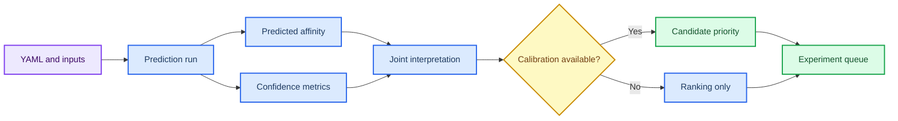

# 第 5 章 亲和力预测、Boltz2 与模型评估

## 本章导读

亲和力预测容易被读成实验亲和力，但模型输出的数值、置信度和适用域必须同时解释。因此，本章首先界定这一问题场景，再说明需要记录哪些输入、动作、输出和质量控制信息。

本章把亲和力预测拆成输入定义、模型输出、置信度、校准、排序和实验交接。这里的重点不是追求单个软件操作的完整覆盖，而是让读者形成可复查的判断链：对象是什么、依据来自哪里、结果能支持什么、仍然不能说明什么。

第 3 章筛选候选、第 4 章代表构象和第 8 章项目优先级都需要本章的预测边界。因此，本章的正文采用“概念定义 -> 流程执行 -> 边界判断 -> 下一步交接”的组织方式。

## 学习目标

完成本章后，读者应能够：

- 能说明 Boltz2、DeepDTAF、PPI-Affinity 等模型输出的适用场景。
- 能同时读取 predicted affinity、confidence、结构质量和输入来源。
- 能把模型排序写成候选优先级，而不是实验活性结论。
- 能设计需要补充的校准、复核或实验验证。

这些目标既面向课堂学习，也面向后续研究记录；如果不能在记录中复述这些要点，相关结果不宜进入项目结论。

## 知识图谱入口

本章图谱连接 docking score、结构预测、亲和力模型、置信度和排序。读者应把模型输出理解为决策证据的一层。

在线书籍页面只引用整理后的 wiki、方法卡、文献笔记和资源页，不直接嵌入原始 PDF 或课件图表。需要追溯来源时，应回到 `book/book_map.toml`、章节精读笔记和相关 Zotero/BibTeX 记录。

| 来源类型 | 路径 |
|:---|:---|
| 章节来源 | `01_课程章节索引/章节精读/第05章_AI多组分亲和力计算精读.md` |
| 方法来源 | `02_方法笔记/Boltz2亲和力预测.md`<br>`02_方法笔记/亲和力模型综述.md` |
| 文献来源 | `03_文献笔记/Boltz2亲和力预测.md`<br>`03_文献笔记/亲和力模型与肽结合排序.md`<br>`03_文献笔记/AlphaFold结构预测.md` |
| 实验来源 | `04_实验记录/模板_Boltz2亲和力记录.md`<br>`04_实验记录/Boltz2结果_l6D9Z7.md` |
| 工作台来源 | `07_研究工作台/证据与claims矩阵.md`<br>`07_研究工作台/实验队列.md` |

### Imagegen 知识图谱

{ loading=lazy }

| 编号 | 正文权威标签 |
|:---:|:---|
| 1 | 输入 YAML |
| 2 | 结构预测 |
| 3 | 亲和力输出 |
| 4 | 置信度 |
| 5 | 排序 |
| 6 | 校准 |
| 7 | 证据边界 |

这张图由 Imagegen 生成，用于帮助读者把本章对象、方法和证据关系先组织成可记忆结构。图中只保留短标题和编号，精确术语、参数和边界以上表及正文为准。

### Mermaid 结构图



完整图示设计和后续科学示意图 prompt 见 [Mermaid 图示与示意图设计](../resources/mermaid-schematics.md)。

## 核心概念

本节只保留支撑后续判断的核心概念。每个概念都应能回答一个具体问题：它约束什么输入、影响什么输出、需要怎样记录。

| 概念 | 教材化定义 |
|:---|:---|
| 输入定义 | 亲和力模型的输入包括序列、结构、配体和复合物假设，输入错误会直接影响输出解释。 |
| 预测值 | predicted affinity 是模型估计值，不能默认等同于 Kd、IC50 或实验自由能。 |
| 置信度 | 置信度用于判断模型对结构或复合物假设的自洽程度，应与亲和力数值联合读取。 |
| 校准 | 模型排序需要在相近化学系列、同一靶点或已有实验数据背景下校准。 |
| 候选优先级 | 预测结果适合辅助排序和实验设计，不应替代实验验证。 |

阅读本节时，应优先检查这些概念能否落到文件、参数、图像、表格或记录字段上。不能落地的说法，在后续研究写作中应作为背景描述，而不是证据。

## 方法流程

本章流程按“输入 -> 动作 -> 输出 -> QC”的顺序组织。这样做的目的，是让每一步都能被复查，而不是只留下一个最终截图或分数。

| 步骤 | 输入 | 动作 | 输出 | QC/边界 |
|:---:|:---|:---|:---|:---|
| 1 | FASTA/SMILES/结构 | 检查链、配体和输入来源。 | 输入 QC。 | ID、来源和处理步骤完整。 |
| 2 | 任务配置 | 编写 YAML 或模型输入表。 | 配置文件。 | 链、配体、模板/约束含义明确。 |
| 3 | 模型运行 | 保存预测输出、日志和版本。 | 结构、分数和置信度。 | 模型版本和运行方式可追溯。 |
| 4 | 结果解析 | 联合读取 affinity、confidence 和结构质量。 | 排序表。 | 低置信度结果不被强解释。 |
| 5 | 校准复核 | 与 docking、MD 或已知实验数据对照。 | 证据矩阵。 | 适用域和异常值明确。 |
| 6 | 交接 | 形成实验候选或下一轮计算。 | 项目队列。 | 预测与实验结论分层。 |

执行时应先完成小样例或 dry-run，再扩大到批量任务。任何失败样本、低置信度结果或人工排除理由，都应保留在 manifest 或实验记录中。

## 代码案例与软件操作

{ loading=lazy }

**Boltz2 输入-输出-解释流程图** 的编号含义如下：

| 编号 | 流程节点 |
|:---:|:---|
| 1 | FASTA/SMILES |
| 2 | YAML |
| 3 | prediction |
| 4 | confidence |
| 5 | rank |
| 6 | interpret |

本节用于训练 **5 章 亲和力预测、Boltz2 与模型评估** 的最小复现意识。该示例只演示结果表解析和排序；真实 Boltz2 运行需要记录 YAML、模型版本、输入来源和输出目录。

=== "可复制代码"

    ```python
    import pandas as pd

    results = pd.read_csv('inputs/boltz2_results.tsv', sep='	')
    ranked = results.sort_values(['pred_affinity', 'confidence'], ascending=[True, False])
    cols = ['candidate_id', 'pred_affinity', 'confidence', 'note']
    ranked[cols].to_csv('outputs/boltz2_ranked.tsv', sep='	', index=False)
    print(ranked[cols].head(5).to_string(index=False))
    ```

=== "配套文件"

    完整示例文件：[`chapter-05-boltz2-summary.py`](../assets/code/chapter-05-boltz2-summary.py)

{ loading=lazy }

| 步骤 | 操作 |
|:---:|:---|
| 1 | 检查 YAML 中链、配体和输入来源。 |
| 2 | 读取 prediction/affinity/confidence 输出。 |
| 3 | 按候选排序，并写清模型边界和待验证实验。 |

!!! warning "常见错误"
    不要只按单一 predicted affinity 下结论；必须同时看置信度、输入质量和适用域。

## 关键文献

<!-- refs:start -->

- Passaro, S., Corso, G., Wohlwend, J., Reveiz, M., Thaler, S., Somnath, V. R. et al. Boltz-2: Towards Accurate and Efficient Binding Affinity Prediction. bioRxiv (2025). https://doi.org/10.1101/2025.06.14.659707

  **本文内容简介：** 本文介绍 Boltz-2 在复合物结构和结合亲和力预测中的模型设计、性能与开放资源。

- Cho, Y., Pacesa, M., Zhang, Z., Correia, B. E. & Ovchinnikov, S. Boltzdesign1: Inverting All-Atom Structure Prediction Model for Generalized Biomolecular Binder Design. bioRxiv (2025). https://doi.org/10.1101/2025.04.06.647261

  **本文内容简介：** 本文提出反向使用全原子结构预测模型进行广义生物分子结合体设计的方法。

- Wang, K., Zhou, R., Li, Y. & Li, M. DeepDTAF: a deep learning method to predict protein–ligand binding affinity. Briefings in Bioinformatics 22 (2021). https://doi.org/10.1093/bib/bbab072

  **本文内容简介：** 本文提出 DeepDTAF 深度学习模型，用于预测蛋白-配体结合亲和力。

- Romero-Molina, S., Ruiz-Blanco, Y. B., Mieres-Perez, J., Harms, M., Münch, J., Ehrmann, M. et al. PPI-Affinity: A Web Tool for the Prediction and Optimization of Protein–Peptide and Protein–Protein Binding Affinity. Journal of Proteome Research 21, 1829–1841 (2022). https://doi.org/10.1021/acs.jproteome.2c00020

  **本文内容简介：** 本文介绍 PPI-Affinity 网络工具，用于预测并优化蛋白-肽和蛋白-蛋白结合亲和力。

- Chang, L. & Perez, A. Ranking Peptide Binders by Affinity with AlphaFold**. Angewandte Chemie International Edition 62 (2023). https://doi.org/10.1002/anie.202213362

  **本文内容简介：** 本文探讨利用 AlphaFold 相关结构信息按亲和力排序肽结合体的策略。

<!-- refs:end -->
## 实验/练习入口

本章练习强调可复查记录，而不是追求一次性完成复杂工具链。建议按以下顺序完成：

1. 读取一张 Boltz2 结果表，同时列出 predicted affinity 和 confidence。
2. 为 5 个候选写出排序理由，并标注低置信度或输入风险。
3. 把一个亲和力预测结果转写成保守 claim，说明需要哪些实验或计算补证。

完成练习后，应能把结果写入 `04_实验记录/` 或 `07_研究工作台/` 的对应页面。不能写入记录的练习，只能算操作尝试。

## 使用边界与常见误读

本节采用保守表述阶梯：预测、评分、可视化和文献案例通常只能写成“提示”“支持”或“可能一致”，除非有直接实验或严格验证，否则不写成“证明”。

| 易误读对象 | 稳健表述 | 写作处理 |
|:---|:---|:---|
| predicted affinity | 提示模型估计的相对优先级。 | 不能直接写成实验 Kd、IC50 或活性。 |
| confidence | 反映模型自洽程度。 | 高置信度不等于实验正确，低置信度需谨慎解释。 |
| 跨模型比较 | 可提供互补证据。 | 不同训练集、输出尺度和适用域不能简单相加。 |
| 候选排序 | 支持下一步实验设计。 | 仍需实验测定或独立计算验证。 |

写作时，如果一个结论只能由模型分数、单次截图或文献案例间接支持，应主动补上“仍需验证”“适用于该模型/该输入”“不等同于本项目结果”等边界。

## 延伸阅读与下一步

完成本章后，建议按以下路径进入下一轮学习或研究任务：

1. 把预测结果与第 3 章 docking pose 和第 4 章构象证据联合解释。
2. 对蛋白/多肽设计候选进入第 6 章回折叠和界面评估。
3. 在第 8 章把预测结果写入项目优先级，而不是写成最终结论。

[返回首页](../index.md)。
