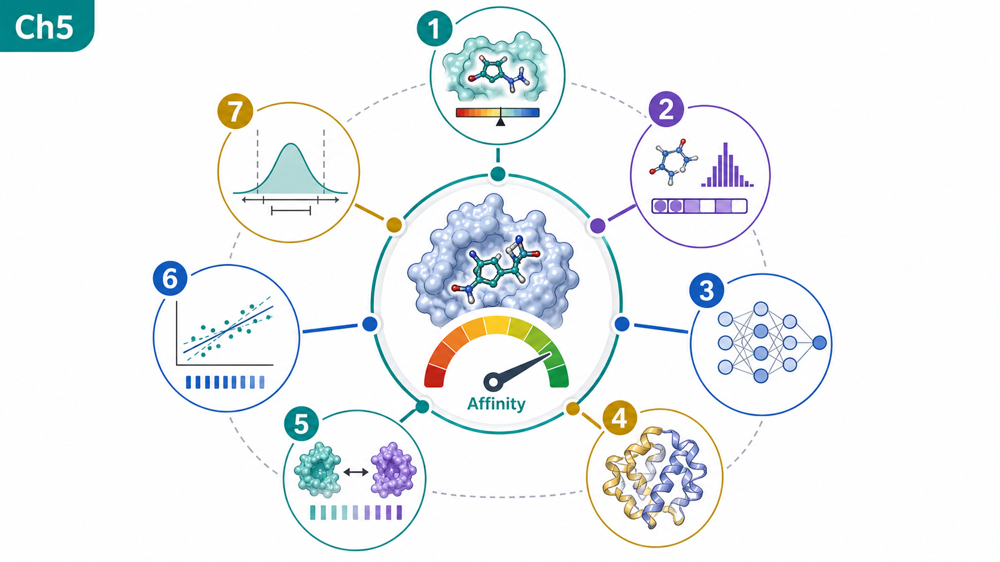
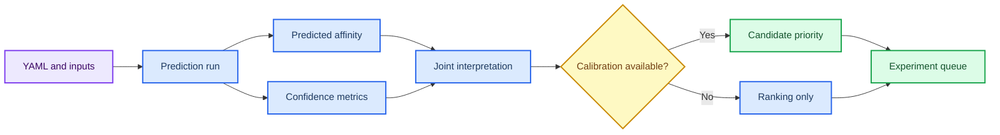
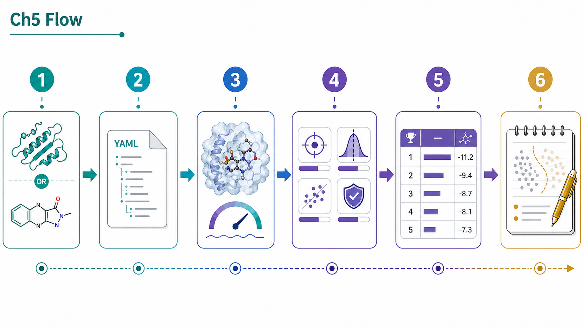
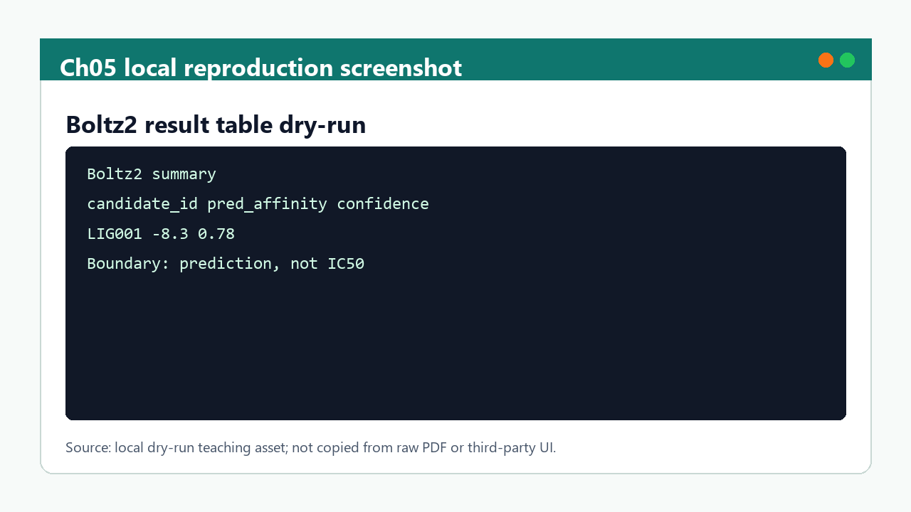

# 第 5 章 亲和力预测、Boltz2 与模型评估

## 本章导读

亲和力预测容易被读成实验亲和力，但模型输出的数值、置信度和适用域必须同时解释。 亲和力预测与模型评估中的关键问题不是单个命令或界面能够解决的，而是贯穿输入选择、参数设置、结果解释和后续写作的判断问题。读者进入亲和力预测与模型评估时，应先把自己放在真实研究任务中：如果明天需要把这一步交给同组同学复核，哪些信息必须留下，哪些说法必须谨慎。

本章把亲和力预测拆成输入定义、模型输出、置信度、校准、排序和实验交接。 亲和力预测与模型评估采用教材讲解写法，不把内容压缩成术语表，而是把概念放回它服务的任务场景中解释。读者在亲和力预测与模型评估中需要关注的不是“记住一个名词”，而是理解它如何限制输入、影响输出、进入质量控制，并支持相应层级的写作判断。

学习亲和力预测与模型评估时，建议先通读核心概念，再回到方法流程表逐步核对。表格用于快速定位输入、动作、输出和 QC，正文段落则解释为什么这些字段不能省略；在亲和力预测与模型评估中，这一点应具体落到预测表、校准状态和解释备注。亲和力预测与模型评估采用这样的顺序，能避免只会照着流程执行却不知道哪一步决定结果可信度。

第 3 章筛选候选、第 4 章代表构象和第 8 章项目优先级都需要本章的预测边界。 因此，亲和力预测与模型评估不是孤立的工具说明，而是后续章节继续工作的接口层。读者完成亲和力预测与模型评估后，应能把本章记录方式转移到下一章，而不是重新发明日志、参数和边界说明。

## 学习目标

围绕亲和力预测与模型评估，学习目标应落实为可复述、可记录、可复核的判断能力。完成本章后，读者应能够：

- 能说明 Boltz2、DeepDTAF、PPI-Affinity 等模型输出的适用场景。
- 能同时读取 predicted affinity、confidence、结构质量和输入来源。
- 能把模型排序写成候选优先级，而不是实验活性结论。
- 能设计需要补充的校准、复核或实验验证。

在亲和力预测与模型评估中，这些目标既服务课堂复习，也决定后续记录能否被他人复核；若不能用记录说明输入、动作和边界，本章内容仍应停留在练习层级。

## 知识图谱入口

本章图谱连接 docking score、结构预测、亲和力模型、置信度和排序。读者应把模型输出理解为决策证据的一层。

在线书籍页面只引用整理后的 wiki、方法卡、文献笔记和资源页，不直接嵌入原始 PDF 或课件图表；在亲和力预测与模型评估中，这一点应具体落到预测表、校准状态和解释备注。需要追溯来源时，应回到 `book/book_map.toml`、章节精读笔记和相关 Zotero/BibTeX 记录；在亲和力预测与模型评估中，这一点应具体落到预测表、校准状态和解释备注。

| 来源类型 | 路径 |
|:---|:---|
| 章节来源 | `01_课程章节索引/章节精读/第05章_AI多组分亲和力计算精读.md` |
| 方法来源 | `02_方法笔记/Boltz2亲和力预测.md`<br>`02_方法笔记/亲和力模型综述.md` |
| 文献来源 | `03_文献笔记/Boltz2亲和力预测.md`<br>`03_文献笔记/亲和力模型与肽结合排序.md`<br>`03_文献笔记/AlphaFold结构预测.md` |
| 实验来源 | `04_实验记录/模板_Boltz2亲和力记录.md`<br>`04_实验记录/Boltz2结果_l6D9Z7.md` |
| 工作台来源 | `07_研究工作台/证据与claims矩阵.md`<br>`07_研究工作台/实验队列.md` |

### Imagegen 知识图谱

{ loading=lazy }

**图5.1 亲和力预测方法谱系知识图谱。** 本图为 Imagegen 生成的教学示意图，用中心概念和编号节点概括亲和力预测与模型评估的对象、方法入口、记录字段和证据边界；编号用于正文定位，不承载精确参数或运行结果，术语解释和判断口径以正文表格为准。 节点编号：1=输入 YAML；2=结构预测；3=亲和力输出；4=置信度；5=排序；6=校准；7=证据边界。

### Mermaid 结构图



**图5.2 亲和力预测证据分层结构图。** 本图为 Mermaid 教学示意图，展示输入质量、预测输出、置信度、校准条件和候选排序之间的证据分层；箭头表示阅读和记录依赖，不替代真实软件运行或实验验证，具体输入、输出和 QC 标准以正文为准。

亲和力预测与模型评估的 Mermaid 源图和后续 scientific-schematics prompt 见 [Mermaid 图示与示意图设计](../resources/mermaid-schematics.md)。

## 核心概念

亲和力预测与模型评估的核心概念应围绕输入复合物、置信度、predicted affinity 和校准边界来读，而不是孤立背诵术语。本章最重要的训练，是把每个名词都对应到一个可检查的输入、一个会改变结果的动作，以及一个必须写入记录的 QC 或边界条件；在亲和力预测与模型评估中，这一点应具体落到预测表、校准状态和解释备注。

阅读下表时，可以把输入复合物、置信度、predicted affinity 和校准边界拆成几类检查问题：它约束什么来源，改变什么输出，失败时留下什么证据。这样处理后，概念表就成为预测表、校准状态和解释备注的索引，而不是定义的堆叠。

| 概念 | 教材化定义 |
|:---|:---|
| 输入定义 | 亲和力模型的输入包括序列、结构、配体和复合物假设，输入错误会直接影响输出解释。 |
| 预测值 | predicted affinity 是模型估计值，不能默认等同于 Kd、IC50 或实验自由能。 |
| 置信度 | 置信度用于判断模型对结构或复合物假设的自洽程度，应与亲和力数值联合读取。 |
| 校准 | 模型排序需要在相近化学系列、同一靶点或已有实验数据背景下校准。 |
| 候选优先级 | 预测结果适合辅助排序和实验设计，不应替代实验验证。 |

使用这张表时，不需要一次记住所有术语。更实用的做法是，在准备任务时先圈出与本次输入直接相关的 2-3 个概念，再检查记录中是否已经有对应字段；在亲和力预测与模型评估中，这一点应具体落到预测表、校准状态和解释备注。对于不直接参与亲和力预测与模型评估当前任务的概念，可以作为边界提示保留，避免在写作时把背景信息误写成当前结果。

这些概念之间也不是平级堆叠关系。通常先由任务对象确定输入，再由流程参数约束输出，最后由 QC 和证据边界决定能否进入下一步；在亲和力预测与模型评估中，这一点应具体落到预测表、校准状态和解释备注。读者如果能沿着亲和力预测与模型评估的顺序复述本节内容，就已经掌握了把教材知识转化为研究记录的基本方法。

## 方法流程

亲和力预测与模型评估的方法流程要把从模型输入到亲和力解释的证据分层讲清楚。读者不应只关心是否跑完命令，而要能说明每一步接收什么输入、执行什么动作、写出什么对象，以及哪一个 QC 决定它能否进入下一步；在亲和力预测与模型评估中，这一点应具体落到预测表、校准状态和解释备注。

下表按 `输入 | 动作 | 输出 | QC/边界` 组织，适合在执行前当作检查单使用；在亲和力预测与模型评估中，这一点应具体落到预测表、校准状态和解释备注。对于亲和力预测与模型评估，最后一列尤其重要，因为它把普通操作和可写入研究工作台的证据区分开来。

| 步骤 | 输入 | 动作 | 输出 | QC/边界 |
|:---:|:---|:---|:---|:---|
| 1 | FASTA/SMILES/结构 | 检查链、配体和输入来源。 | 输入 QC。 | ID、来源和处理步骤完整。 |
| 2 | 任务配置 | 编写 YAML 或模型输入表。 | 配置文件。 | 链、配体、模板/约束含义明确。 |
| 3 | 模型运行 | 保存预测输出、日志和版本。 | 结构、分数和置信度。 | 模型版本和运行方式可追溯。 |
| 4 | 结果解析 | 联合读取 affinity、confidence 和结构质量。 | 排序表。 | 低置信度结果不被强解释。 |
| 5 | 校准复核 | 与 docking、MD 或已知实验数据对照。 | 证据矩阵。 | 适用域和异常值明确。 |
| 6 | 交接 | 形成实验候选或下一轮计算。 | 项目队列。 | 预测与实验结论分层。 |

执行亲和力预测与模型评估流程表时，应先完成最小样例，再扩大到批量任务。最小样例的价值不是产生有意义的研究结果，而是验证路径、格式、参数和日志是否能闭合；在亲和力预测与模型评估中，这一点应具体落到预测表、校准状态和解释备注。只有当亲和力预测与模型评估的最小样例能够被完整复核时，后续批量表格、结构、轨迹或候选列表才有进入研究工作台的基础。

流程表也提供了写作时的段落顺序。介绍方法时，先交代输入来源和动作，再说明输出形式，最后说明 QC 含义和不能推出的结论；在亲和力预测与模型评估中，这一点应具体落到预测表、校准状态和解释备注。亲和力预测与模型评估采用这个顺序比先展示结果更稳健，因为它让读者看到判断链，而不是只看到筛选后的结论。

## 代码案例与软件操作

{ loading=lazy }

**图5.3 Boltz2 输入-输出-解释流程图。** 本图为 Imagegen 生成的流程图，说明 Boltz2 从输入 YAML 到预测亲和力解释的判断路径；它用于说明操作顺序、关键节点和记录交接位置，不代表实验结果，具体命令、参数和边界判断以正文代码块与步骤表为准。 流程编号：1=FASTA/SMILES；2=YAML；3=prediction；4=confidence；5=rank；6=interpret。

本节用于训练 **5 章 亲和力预测、Boltz2 与模型评估** 的最小复现意识。该示例只演示结果表解析和排序；真实 Boltz2 运行需要记录 YAML、模型版本、输入来源和输出目录。

=== "可复制代码"

    ```python
    import pandas as pd

    results = pd.read_csv('inputs/boltz2_results.tsv', sep='	')
    ranked = results.sort_values(['pred_affinity', 'confidence'], ascending=[True, False])
    cols = ['candidate_id', 'pred_affinity', 'confidence', 'note']
    ranked[cols].to_csv('outputs/boltz2_ranked.tsv', sep='	', index=False)
    print(ranked[cols].head(5).to_string(index=False))
    ```

=== "配套文件"

    完整示例文件：[`chapter-05-boltz2-summary.py`](../assets/code/chapter-05-boltz2-summary.py)

    P31 亲和力解释脚本：[`chapter-05-affinity-calibration-dry-run.py`](../assets/code/chapter-05-affinity-calibration-dry-run.py)。该脚本输出 `calibration_available`、`rank_bucket`、`interpretation` 和 `boundary_note`，用于把模型预测写成可审查的排序线索。

{ loading=lazy }

**图5.4 Boltz2 结果 dry-run 软件操作截图。** 本图为本地 dry-run 截图，展示 Boltz2 dry-run 结果表、校准状态和边界说明字段；截图用于说明界面、文件或表格位置，不代表实验结果，读者应按本机路径替换参数并以正文操作表为准。

| 步骤 | 操作 |
|:---:|:---|
| 1 | 检查 YAML 中链、配体和输入来源。 |
| 2 | 读取 prediction/affinity/confidence 输出。 |
| 3 | 对照已知阳性、阴性或同系列候选判断是否有校准条件。 |
| 4 | 按候选排序，并写清模型边界和待验证实验。 |

### 教材化阅读提示

本节代码应作为Boltz2 输出解释 dry-run的可复查样例来读。它展示的是如何把亲和力预测与模型评估中的一次小任务写成可复制、可失败、可追溯的记录，而不是声明已经完成真实研究运行。

替换参数时，应先替换与亲和力预测与模型评估直接相关的输入路径，再调整会影响解释的阈值、空间范围或模型参数。如果亲和力预测与模型评估的最小样例尚不能解释输出来源，就不应扩大到批量任务。

解读输出时，只记录代码确实生成的对象，例如 manifest、配置、dry-run 表格、截图或日志；在亲和力预测与模型评估中，这一点应具体落到预测表、校准状态和解释备注。这些对象可以支持预测表、校准状态和解释备注的整理，但不能自动升级为实验结论；需要形成研究判断时，仍要回到实验记录模板补齐输入、QC、人工复核和待验证项。
## 关键文献

<!-- refs:start -->

- Passaro, S., Corso, G., Wohlwend, J., Reveiz, M., Thaler, S., Somnath, V. R. et al. Boltz-2: Towards Accurate and Efficient Binding Affinity Prediction. bioRxiv (2025). https://doi.org/10.1101/2025.06.14.659707

  **本文内容简介：** 本文介绍 Boltz-2 在复合物结构和结合亲和力预测中的模型设计、性能与开放资源。

- Cho, Y., Pacesa, M., Zhang, Z., Correia, B. E. & Ovchinnikov, S. Boltzdesign1: Inverting All-Atom Structure Prediction Model for Generalized Biomolecular Binder Design. bioRxiv (2025). https://doi.org/10.1101/2025.04.06.647261

  **本文内容简介：** 本文提出反向使用全原子结构预测模型进行广义生物分子结合体设计的方法。

- Wang, K., Zhou, R., Li, Y. & Li, M. DeepDTAF: a deep learning method to predict protein–ligand binding affinity. Briefings in Bioinformatics 22 (2021). https://doi.org/10.1093/bib/bbab072

  **本文内容简介：** 本文提出 DeepDTAF 深度学习模型，用于预测蛋白-配体结合亲和力。

- Romero-Molina, S., Ruiz-Blanco, Y. B., Mieres-Perez, J., Harms, M., Münch, J., Ehrmann, M. et al. PPI-Affinity: A Web Tool for the Prediction and Optimization of Protein–Peptide and Protein–Protein Binding Affinity. Journal of Proteome Research 21, 1829–1841 (2022). https://doi.org/10.1021/acs.jproteome.2c00020

  **本文内容简介：** 本文介绍 PPI-Affinity 网络工具，用于预测并优化蛋白-肽和蛋白-蛋白结合亲和力。

- Chang, L. & Perez, A. Ranking Peptide Binders by Affinity with AlphaFold**. Angewandte Chemie International Edition 62 (2023). https://doi.org/10.1002/anie.202213362

  **本文内容简介：** 本文探讨利用 AlphaFold 相关结构信息按亲和力排序肽结合体的策略。

<!-- refs:end -->
## 实验/练习入口

本章练习的重点是把亲和力预测与模型评估转化成可交接记录。练习完成后，读者应能让另一个人根据记录复现从模型输入到亲和力解释的证据分层，并判断是否具备进入第 6 章设计候选复核的条件。

建议按以下顺序完成：

1. 读取一张 Boltz2 结果表，同时列出 predicted affinity 和 confidence。
2. 为 5 个候选写出排序理由，并标注低置信度或输入风险。
3. 把一个亲和力预测结果转写成保守 claim，说明需要哪些实验或计算补证。

完成练习后，应检查记录中是否包含预测表、校准状态和解释备注、失败原因和人工判断。缺少预测表、校准状态和解释备注时，相关内容仍适合作为课堂尝试，不适合写入正式研究结论。

如果练习借用了文献案例或课程范文，应在亲和力预测与模型评估记录中明确它只是方法参照或边界样例。在亲和力预测与模型评估中，文献案例可以启发流程设计，但不能替代本项目的本地运行结果。

## 使用边界与常见误读

亲和力预测与模型评估最容易被误写的对象是predicted affinity、置信度和模型排序。在亲和力预测与模型评估中，这些对象看起来像结果，但在当前教材层级通常只是模型输出、流程观察、可视化线索或文献案例。

下表用于训练写作降级。在亲和力预测与模型评估中，读者应先判断当前证据最多能支持什么说法，再决定是否写成“提示”“支持”“流程参考”或“仍需验证”。

| 易误读对象 | 稳健表述 | 写作处理 |
|:---|:---|:---|
| predicted affinity | 提示模型估计的相对优先级。 | 不能直接写成实验 Kd、IC50 或活性。 |
| confidence | 反映模型自洽程度。 | 高置信度不等于实验正确，低置信度需谨慎解释。 |
| 跨模型比较 | 可提供互补证据。 | 不同训练集、输出尺度和适用域不能简单相加。 |
| 候选排序 | 支持下一步实验设计。 | 仍需实验测定或独立计算验证。 |

边界判断并不是削弱亲和力预测与模型评估的价值，而是说明证据在哪里停止。如果删除某个软件名、截图、分数或文献案例后，结论就无法成立，通常应把该结论降级为候选线索或下一步验证任务；在亲和力预测与模型评估中，这一点应具体落到预测表、校准状态和解释备注。

只有当亲和力预测与模型评估对应的真实运行记录、复核结果和严格计算或实验支持已经进入项目记录，相关判断才适合升级为更强表述。

本章的边界判断围绕 predicted affinity 和置信度展开。预测数值可以作为候选排序的辅助证据，但如果缺少校准集、实验参照或模型适用域检查，就不能写成真实结合强度。读者应同时记录输入结构、模型输出、置信度和校准状态。

## 延伸阅读与下一步

亲和力预测与模型评估的延伸阅读应服务下一次可执行任务，而不是停留在资料补充。读者完成本章后，应能判断哪些内容进入预测表、校准状态和解释备注，哪些内容进入阅读队列，哪些内容只能作为背景案例。

建议按以下路径进入下一轮学习或研究任务：

1. 把预测结果与第 3 章 docking pose 和第 4 章构象证据联合解释。
2. 对蛋白/多肽设计候选进入第 6 章回折叠和界面评估。
3. 在第 8 章把预测结果写入项目优先级，而不是写成最终结论。

选择下一步时，应优先检查亲和力预测与模型评估的证据链是否足以支撑转入第 6 章设计候选复核。若输入来源、参数、QC 或边界尚未记录清楚，应先补齐本章记录，而不是继续叠加更复杂的工具；在亲和力预测与模型评估中，这一点应具体落到预测表、校准状态和解释备注。

完成这种转换后，亲和力预测与模型评估就不只是读过的教材内容，而是可以被检索、复核和继续执行的研究资产。

进入设计或实验规划前，读者应先判断亲和力预测是否只是排序线索。若模型输出与对接、MD 或文献证据不一致，应优先解释差异来源，而不是选择最有利的单个分数作为结论。
