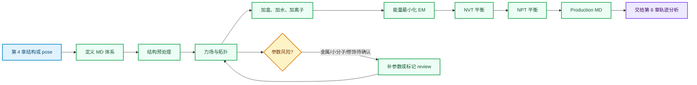

# 第 5 章 分子动力学模拟基础流程

## 本章导读

第 4 章结束时，读者手里可能有 docking pose、虚拟筛选 shortlist、蛋白复合物模型，或者一个需要继续复核的结构假设。分子动力学模拟不是把这些候选直接变成结论，而是把静态结构放进力场、溶剂、离子和温压条件中，观察它是否能形成一段可检查的构象轨迹。

本章关注 MD 的准备和运行主线。读者要学会回答五个问题：体系里有哪些分子，力场如何描述它们，GROMACS 需要哪些文件，EM/NVT/NPT/production 每一步生成什么，复杂体系在进入模拟前有什么风险。

轨迹分析不是本章重点。RMSD、RMSF、FEL、PCA、聚类、代表构象和 BioEmu/AI 采样会放到第 6 章；MM/PBSA、结合自由能和亲和力解释会放到第 7 章。因此，本章结束时的产物是一个可复核的 MD 输入包和运行记录，而不是功能机制或药效结论。

本章的核心判断可以压缩成下表。

| 读者拿到什么 | 本章要做什么 | 本章不能推出什么 |
|:---|:---|:---|
| docking pose 或结构模型 | 检查体系组成、拓扑、参数和运行阶段 | 不能证明真实结合模式 |
| GROMACS 文件夹 | 判断输入文件是否齐全、来源是否清楚 | 不能证明轨迹质量已经合格 |
| 短时 MD 或 dry-run | 训练流程记录和异常检查 | 不能证明药效、机制或亲和力 |

## 学习目标

完成本章后，读者应能够：

- 解释 MD、力场、拓扑、溶剂盒、离子、温控、压控和阶段化平衡之间的关系。
- 区分 `pdb`、`gro`、`xtc`、`mdp`、`top`、`itp`、`tpr`、`edr`、`log` 和 `ndx` 的用途。
- 说明 `topol.top` 和 `.itp` 文件如何共同描述分子、原子类型、键、角、二面角和分子数量。
- 描述 GROMACS 基础流程：`pdb2gmx`、`editconf`、`solvate`、`genion`、`grompp` 和 `mdrun`。
- 为蛋白、多肽、蛋白复合物、金属、小分子、核酸、多配体和修饰残基标注参数化风险。
- 把 MD 结果写成“可复核流程”和“稳定性线索”，而不是写成实验结论。

## 本章判断路径

下图把第 5 章流程拆成输入、准备、运行和交接四段。箭头表示记录依赖，不代表真实模拟已经完成。



**图 5.1 GROMACS 基础 MD 流程。** 本图把结构输入、拓扑准备、溶剂离子设置、EM/NVT/NPT/production 和轨迹分析交接分开。第 5 章只讲到 production 运行记录，第 6 章再解释轨迹。

## 5.1 分子模拟基本概念、软件和力场

分子动力学模拟用力场描述原子间相互作用，再用积分算法推进原子坐标随时间变化。它输出的是在特定初始结构、力场、溶剂、离子、温压控制和时间步长下生成的轨迹。

这个方法能帮助读者检查结构是否出现明显坏接触、配体是否立刻离开口袋、界面是否快速崩解，或者某些构象状态是否值得进入下一步分析。它不能单独证明药效、真实结合机制、临床意义或实验亲和力。

下面的表把核心对象拆开。读者先要知道每个对象负责什么，再判断当前记录是否足够。

| 概念 | 在 MD 中负责什么 | 本章写作边界 |
|:---|:---|:---|
| 初始结构 | 提供原子坐标和体系组成 | 来自实验、预测或 docking 都要记录来源 |
| 力场 | 给出键、角、二面角和非键相互作用参数 | 适用域不同，不能默认覆盖所有分子 |
| 水模型 | 描述溶剂环境 | 水模型要与力场兼容 |
| 离子 | 中和体系或模拟盐浓度 | 浓度和离子类型要记录假设 |
| 温控/压控 | 维持目标温度和压力 | NVT 和 NPT 阶段目的不同 |
| 轨迹 | 保存坐标随时间变化 | 解释放到第 6 章，不在本章过度推断 |

GROMACS 是本章主线，因为它能把结构、拓扑、参数和运行步骤组织成清楚的文件流。Sobtop、Multiwfn 和 ORCA 在本章只作为辅助工具出现，用于小分子、辅因子、金属或修饰残基的参数和电荷相关准备。

## 5.2 GROMACS 文件类型：gro、xtc、mdp、top、itp

GROMACS 任务不是一个文件就能运行。一个最小体系通常至少需要结构文件、拓扑文件和参数文件；运行后还会生成轨迹、能量、日志和索引等输出。

读文件时，应先问“它在流程中扮演什么角色”，不要只看扩展名。下面的表给出本章最常见的文件类型。

| 文件类型 | 常见文件 | 主要用途 | 复核重点 |
|:---|:---|:---|:---|
| 初始结构 | `protein.pdb` | 来自 PDB、预测结构或 docking pose 的输入坐标 | 链 ID、缺失区域、配体、金属、水和残基编号 |
| GROMACS 坐标 | `.gro` | 保存结构坐标和盒子信息 | 原子数、盒子大小、分子是否完整 |
| 轨迹 | `.xtc`、`.trr` | 保存模拟过程坐标 | 第 6 章再分析，不在本章解释指标 |
| 参数文件 | `.mdp` | 定义 EM、NVT、NPT 或 production 参数 | 时间步长、温度、压力、输出频率和约束 |
| 主拓扑 | `topol.top` | 汇总力场、分子类型和分子数量 | include 路径、分子数量和力场一致性 |
| 分子拓扑 | `.itp` | 描述蛋白、配体或其他分子参数 | 原子类型、电荷、键、角和二面角 |
| 运行输入 | `.tpr` | `grompp` 生成的二进制运行包 | 由结构、拓扑和 `.mdp` 一起生成 |
| 能量/日志 | `.edr`、`.log` | 保存能量、压力、温度和运行信息 | 是否收敛、是否有 warning 或 fatal error |
| 索引 | `.ndx` | 定义分析或约束组 | 分组是否对应研究问题 |

文件存在只能说明某一步产生过输出。若 `topol.top` include 了不存在的配体 `.itp`，或 `.mdp` 使用了不合适的温压设置，目录看起来完整也不能进入正式解释。

## 5.3 拓扑文件组成

拓扑文件是 MD 体系的化学说明。结构文件告诉软件原子在哪里，拓扑文件告诉软件这些原子是什么、怎样连接、带什么电荷，以及体系中每种分子有多少个。

GROMACS 常把主拓扑和分子拓扑分开。`topol.top` 负责总入口，`.itp` 负责单个分子或力场片段。复杂体系中，蛋白、小分子、金属、核酸和修饰残基可能来自不同参数来源，因此拓扑一致性比“能否生成文件”更重要。

下表列出常见拓扑块。读者不需要一开始背完整语法，但要能判断每一块缺失时会影响什么。

| 拓扑块 | 说明 | 风险 |
|:---|:---|:---|
| `[ defaults ]` | 定义非键相互作用组合规则 | 与力场不兼容会改变非键参数 |
| `[ atomtypes ]` | 定义原子类型、质量、电荷相关参数 | 配体或修饰残基最容易缺类型 |
| `[ moleculetype ]` | 定义一个分子类型 | 名称和分子数量要与 `[ molecules ]` 对应 |
| `[ atoms ]` | 列出原子编号、类型、电荷和质量 | 电荷错误会影响静电相互作用 |
| `[ bonds ]`、`[ angles ]`、`[ dihedrals ]` | 定义键、角和二面角 | 缺失会导致结构约束错误或运行失败 |
| `[ system ]` | 给体系命名 | 便于记录，不是科学结论 |
| `[ molecules ]` | 定义每类分子的数量 | 加水、加离子后必须同步更新 |

拓扑问题常发生在非标准对象上。例如小分子配体需要原子类型和电荷，金属体系需要考虑价态和配位几何，修饰残基需要专门参数。缺少可靠参数时，应把体系状态标为 `review`，不要为了继续运行而忽略 warning。

## 5.4 GROMACS、Sobtop、Multiwfn、ORCA 安装

本章不把安装写成固定命令，因为当前工作区没有原始安装包、课件截图或本地软件版本记录。教材正文只说明工具角色和检查逻辑；具体安装命令应以作者本地课件、官方文档或课程环境为准。

工具之间的关系如下。

| 工具 | 本章角色 | 何时使用 | 不能写成 |
|:---|:---|:---|:---|
| GROMACS | 主线 MD 软件 | 准备、平衡和运行 MD | 不能保证所有体系参数正确 |
| Sobtop | 小分子拓扑辅助 | 需要配体拓扑和力场参数时 | 不能替代人工化学检查 |
| Multiwfn | 电荷、波函数和性质分析辅助 | 小分子或辅因子电荷方案需要复核时 | 不能单独证明参数物理正确 |
| ORCA | 量子化学计算入口 | 需要量化计算支持电荷或金属/配位体系时 | 不能写成普通 MD 主线工具 |

读者安装软件后，至少应记录软件版本、运行平台、安装路径、环境名、测试命令和日志路径。版本号可见只说明命令能被调用，不说明当前体系能正确模拟。

安装记录建议使用下面的字段。

| 字段 | 示例内容 | 用途 |
|:---|:---|:---|
| `software` | `gromacs`、`sobtop`、`multiwfn`、`orca` | 区分主线与辅助工具 |
| `version` | 命令输出或安装包版本 | 便于复现和排错 |
| `environment` | Conda、module、系统路径 | 判断命令来自哪里 |
| `test_command` | 最小自检命令 | 检查可调用性 |
| `log_path` | 测试日志 | 失败时保留证据 |

## 5.5 分子模拟基本流程

GROMACS 基础流程可以理解为一串输入输出转换。每一步都应留下输入、参数、输出和 QC 记录；否则下一步出错时很难回溯。

| 阶段 | 常见命令 | 输入 | 输出 | 主要检查 |
|:---|:---|:---|:---|:---|
| 生成拓扑 | `pdb2gmx` | 蛋白结构、力场选择、水模型 | `processed.gro`、`topol.top` | 残基识别、链、质子化、力场 |
| 定义盒子 | `editconf` | 坐标文件 | 带盒子的 `.gro` | 盒子类型和边界距离 |
| 加水 | `solvate` | 盒子结构、拓扑 | solvated `.gro`、更新拓扑 | 水分子数量和拓扑同步 |
| 加离子 | `grompp` + `genion` | 离子参数、预处理输入 | neutralized `.gro`、更新拓扑 | 电中性、盐浓度和离子类型 |
| 能量最小化 | `grompp` + `mdrun` | `em.mdp`、结构、拓扑 | `em.gro`、`em.edr`、`em.log` | 最大力、坏接触、fatal error |
| NVT 平衡 | `grompp` + `mdrun` | `nvt.mdp`、`em.gro` | `nvt.gro`、日志和能量 | 温度稳定和约束 |
| NPT 平衡 | `grompp` + `mdrun` | `npt.mdp`、`nvt.gro` | `npt.gro`、日志和能量 | 压力、密度和盒子变化 |
| Production | `grompp` + `mdrun` | `md.mdp`、`npt.gro` | 轨迹、能量、日志 | 是否完成、是否有异常警告 |

这些步骤的价值在于逐层排除问题。EM 处理坏接触，NVT 让温度稳定，NPT 让压力和密度接近目标状态，production 才生成后续分析使用的轨迹。

### 最小 dry-run：检查 GROMACS 输入文件

本章配套脚本只检查文件是否齐全，不运行 GROMACS，也不生成真实轨迹。它用于训练读者的输入包意识。

```powershell
python ..\assets\chapter-05\code\chapter-05-gromacs-file-check.py `
  --demo `
  --out ..\assets\chapter-05\code\chapter-05-gromacs-file-check-demo.tsv
```

脚本检查的最小文件集如下。

| 文件 | 为什么需要 | 缺失时怎么处理 |
|:---|:---|:---|
| `protein.pdb` | 提供初始结构 | 回到第 3/4 章确认结构来源和 pose |
| `topol.top` | 提供主拓扑入口 | 重新生成或检查 include 路径 |
| `em.mdp` | 定义能量最小化参数 | 补齐 EM 参数后再 `grompp` |
| `nvt.mdp` | 定义 NVT 平衡参数 | 补齐温控和约束设置 |
| `npt.mdp` | 定义 NPT 平衡参数 | 补齐压控和密度平衡设置 |
| `md.mdp` | 定义生产模拟参数 | 明确模拟时长、步长和输出频率 |

若脚本输出 `pass=6 missing=0`，只能说明最小文件名齐全。它不能说明力场选择正确、拓扑参数可靠、体系能量合理或轨迹可信。

## 5.6 蛋白结构预处理

蛋白结构预处理的目标是让输入结构能被力场识别，并让研究假设在结构层面可追溯。它不是单纯“清理 PDB”，也不是把所有非蛋白对象删除。

下表把常见预处理对象和判断方式放在一起。

| 对象 | 应检查什么 | 稳健处理 |
|:---|:---|:---|
| 链和生物装配 | receptor、partner、重复链和实验装配 | 写清保留哪些链、删除哪些链 |
| 缺失残基/原子 | 是否位于口袋、界面或柔性区 | 关键区域缺失时标记 `review` |
| 质子化 | pH、His 状态、活性位点残基 | 不只写“自动加氢” |
| 水分子 | 是否桥联配体、金属或关键残基 | 删除前记录理由 |
| 辅因子/离子 | 是否参与结构稳定或催化 | 逐项记录 `keep`、`remove` 或 `review` |
| 低置信区域 | AI 结构中的 pLDDT/PAE 风险 | 靠近口袋或界面时暂缓强解释 |

预处理通过只表示输入具备进入模拟的最低条件。若后续轨迹出现配体飞出、金属配位异常或蛋白局部崩解，应先回看本节记录，而不是直接把异常解释成生物学现象。

## 5.7 蛋白、多肽和蛋白复合物模拟

蛋白、多肽和蛋白复合物体系的共同问题是柔性和界面。多肽通常构象变化大，蛋白复合物还涉及链定义、界面接触和约束释放策略。

Chen 2024 被本章用作文献案例：它提示生成式设计得到的候选肽需要结构建模和 MD 等后续复核。这个案例只能支撑“生成式候选需要动态稳定性检查”的教学判断，不能转写为 AI_MD 已经获得某个抑制剂或实验结果。

不同大分子体系的准备重点如下。

| 体系 | 关键记录 | 常见风险 |
|:---|:---|:---|
| 单蛋白 | 结构来源、缺失区、质子化、力场 | 低置信 loop 被误读为稳定结构 |
| 多肽 | 初始构象、末端状态、柔性和约束 | 短时稳定不能证明结合 |
| 蛋白-蛋白复合物 | 链 ID、界面残基、是否保留配体/水/离子 | 界面在平衡阶段快速分离 |
| 设计蛋白或预测复合物 | 模型来源、置信度、设计约束 | 把模型构象当成实验结构 |

这类体系进入第 6 章后，才会讨论界面 RMSD、接触持续性、聚类代表构象和关键距离。第 5 章只要求把链、参数、约束和运行阶段记录清楚。

## 5.8 蛋白-金属离子体系模拟

金属离子体系不能按普通小分子或普通盐离子处理。金属价态、配位残基、配位距离、配位几何和力场参数都会影响模拟含义。

如果材料不能说明金属参数来源，正文应写成“待确认”或 `review`。不要因为 GROMACS 能运行，就把金属配位写成已被正确描述。

| 检查项 | 应记录 | 解释边界 |
|:---|:---|:---|
| 金属身份 | 元素、价态、残基编号或配体 ID | 价态不明时不能强解释配位 |
| 配位环境 | 配位残基、距离、角度和水/配体 | 只看距离不足以证明配位化学 |
| 参数来源 | 力场、专门参数、约束或量化计算 | 未核实参数应标 `review` |
| 辅助工具 | Sobtop、Multiwfn、ORCA 的角色 | 只写工具角色，不写未核实命令 |
| 后续验证 | QM/MM、文献、实验或对照模拟 | 普通 MD 不能替代全部验证 |

金属酶、金属配位药物和金属桥联相互作用都可能需要更高层级计算或专门参数。本章只给入口和记录要求，不把普通 MD 写成配位化学的最终证据。

## 5.9 蛋白-小分子复合物模拟

蛋白-小分子 MD 常从 docking pose 开始。第 4 章的 pose 需要先通过基本复核，再进入第 5 章参数化和模拟准备。若 pose 已经穿模、配体状态错误或金属处理错误，MD 只会放大输入问题。

小分子准备的核心是让配体和蛋白力场兼容。

| 准备对象 | 必填记录 | 失败模式 |
|:---|:---|:---|
| docking pose | pose 来源、score、口袋、filter_reason | 只因 score 低就进入 MD |
| 配体化学状态 | 质子化、互变异构、手性、电荷 | 状态错误导致相互作用失真 |
| 配体拓扑 | `.itp`、原子类型、键、角、二面角 | 缺参数或 include 路径错误 |
| 电荷方案 | 工具、量化条件或经验方案 | 与力场不兼容 |
| 复合物结构 | 蛋白、配体、金属、水和盒子 | 关键组分被误删 |

Gu 2023 被本章用来支撑一个边界：MD refinement 不必然自动提高机器学习亲和力预测。若把 MD 构象交给第 7 章或第 8 章，应记录靶点、口袋柔性、初始 pose、模拟时长和模型输入特征。

## 5.10 蛋白-核酸、多配体和修饰残基体系模拟

复杂体系的难点不是文件数量多，而是参数边界多。蛋白-核酸、多配体、PTM、糖基化、非标准残基和辅因子都可能让普通流程失效。

本章建议先写复杂体系入口表，再决定是否进入正式模拟。

| 体系 | 需要额外记录 | 进入模拟前的判断 |
|:---|:---|:---|
| 蛋白-核酸 | DNA/RNA 链、序列、端基、离子环境 | 核酸力场和蛋白力场是否兼容 |
| 多配体 | 每个配体 ID、参数、来源和相对位置 | 是否存在参数冲突或重复命名 |
| 修饰残基 | PTM 类型、残基编号、参数来源 | 标准力场是否覆盖该修饰 |
| 糖基化 | 糖链组成、连接位点、构象 | 糖参数和连接拓扑是否完整 |
| 多辅因子 | 保留理由、删除理由、相互作用角色 | 删除辅因子是否改变研究问题 |

复杂体系最稳妥的写法是“当前输入可进入 review/小规模测试/正式模拟”三类分级，而不是直接写“模型可靠”。一旦参数来源不明，本章应让读者停下来补证。

## 关键文献与引用边界

本章文献用于支撑方法边界和案例背景，不用于声明 AI_MD 已完成真实 MD 项目。

| BibTeX key | 文献 | 本章使用方式 |
|:---|:---|:---|
| `chen_design_2024` | Chen et al. Design of target specific peptide inhibitors using generative deep learning and molecular dynamics simulations. Nature Communications, 2024. DOI: `10.1038/s41467-024-45766-2` | 用作生成式候选经 MD 复核的案例锚点 |
| `gu_molecular_2023` | Gu et al. Can molecular dynamics simulations improve predictions of protein-ligand binding affinity with machine learning? Briefings in Bioinformatics, 2023. DOI: `10.1093/bib/bbad008` | 用作 MD refinement 和亲和力预测边界锚点 |

若后续要写完整参考文献表，应从 `references/references.bib` 和 `references/zotero-map.tsv` 生成。正文不手写新的文献条目，也不把 Zotero item key 当作 BibTeX key。

## 实验/练习入口

本章练习不是跑一条真实生产轨迹，而是准备一个可复核的 MD 输入包。建议从一个蛋白或一个蛋白-小分子 pose 开始。

练习步骤如下。

1. 建立任务目录，包含 `inputs/`、`params/`、`topology/`、`outputs/`、`logs/` 和 `notes/`。
2. 放入 `protein.pdb` 或复合物结构，记录来源、链 ID、低置信区和组分。
3. 准备 `topol.top`、必要 `.itp` 和 `em.mdp`、`nvt.mdp`、`npt.mdp`、`md.mdp`。
4. 运行本章 dry-run 脚本，生成 `chapter-05-gromacs-file-check-demo.tsv` 或自己的检查表。
5. 按 `pass`、`review`、`fail` 给出本章结论，并说明是否进入第 6 章轨迹分析。

练习记录至少应包含下面字段。

| 字段 | 说明 |
|:---|:---|
| `system_name` | 体系名称和任务 ID |
| `initial_structure` | 初始结构路径和来源 |
| `components` | 蛋白、配体、核酸、金属、修饰和水 |
| `force_field` | 蛋白、核酸、配体和水模型版本 |
| `parameter_files` | `.mdp`、`.top`、`.itp` 路径 |
| `setup_status` | `pass`、`review` 或 `fail` |
| `next_step` | 进入第 6 章分析、补参数、重做结构准备或暂停 |

可复用记录模板见 `04_实验记录/模板_MD_BioEmu采样记录.md`。该模板也包含 BioEmu 和轨迹指标字段，但第 5 章练习只填写输入、体系组成和 MD 参数部分。

## 使用边界与常见误读

第 5 章最容易被过度解释的是“能跑”“轨迹没崩”和“配体没有立刻离开”。这些现象可以提示体系准备或稳定性线索，但不能单独证明真实结合、活性、机制或临床意义。

| 易误读对象 | 稳健表述 | 不应写成 |
|:---|:---|:---|
| GROMACS 运行完成 | 当前命令完成并生成日志 | 模拟体系科学可靠 |
| EM 收敛 | 坏接触得到初步处理 | 结构已经真实稳定 |
| NVT/NPT 完成 | 温度/压力阶段通过基础检查 | 生产轨迹一定可解释 |
| 短时 production | 产生有限时间轨迹 | 证明配体稳定结合 |
| 配体未离开口袋 | 在该短轨迹中未观察到明显解离 | 实验亲和力高 |
| 金属体系能运行 | 参数假设可被软件执行 | 配位化学描述正确 |
| 文献案例使用 MD | 文献中有方法组合案例 | 本项目已有同类结果 |

写作时，可以使用“提示”“支持流程复核”“可进入下一步分析”“仍需验证”这类表述。不要把短时 MD、单条轨迹、dry-run 或文献案例写成药效、机制或实验结论。

## 下一步任务

完成本章后，读者应把 MD 输入包交给第 6 章。交接内容包括初始结构、拓扑、`.mdp`、运行日志、基础 QC 结论和待复核问题。

若 production 轨迹已经生成，第 6 章会继续处理去水、PBC、RMSD、RMSF、Rg、SASA、氢键、FEL、PCA、聚类、DCCM、代表构象和 BioEmu/AI 采样边界。若本章仍有参数、金属、配体或修饰问题，应先停在 `review`，不要把有疑问的轨迹送入高级分析。

第 7 章会讨论结合自由能和 MM/PBSA。进入第 7 章前，至少要知道轨迹来自什么体系、哪些帧被保留、配体和金属参数是否可靠，以及第 6 章是否已经完成基本轨迹 QC。

第 5 章的验收标准很具体：把任务目录交给另一个人，对方能根据结构、拓扑、参数和日志复查这个 MD 体系为什么可以运行，哪些地方仍要补证。达到这个标准后，轨迹分析才有稳定起点。
