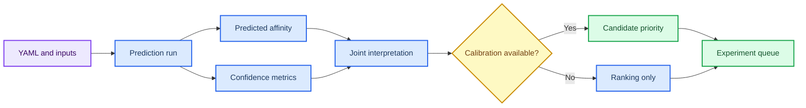

# 第 5 章 亲和力预测、Boltz2 与模型评估

## 本章导读

亲和力预测最容易产生“数值即真实”的错觉。Boltz2、DeepDTAF、PPI-Affinity 等模型可以提供 predicted affinity、confidence 或排序信号，但这些输出必须与输入结构、模型适用域、校准集和实验参照一起解释。

本章把亲和力预测拆成输入定义、模型运行、结果解析、校准复核和候选交接。读者需要学会同时读取 predicted affinity 与 confidence：一个数值看似更优，但如果结构质量低、输入状态不清或缺少校准，它不能被写成真实结合强度。

第 3 章提供候选和 pose，第 4 章提供构象证据，第 6 章可能提供设计候选，第 8 章需要综合优先级。本章在这些流程之间承担“模型读数解释层”的角色，只负责给出谨慎排序和验证建议。

本章要求读者把模型数值放回证据环境中阅读。predicted affinity 的大小只有在输入结构、配体状态、confidence 和校准条件清楚时才有排序意义；否则它只是一个需要复核的模型输出字段。

## 学习目标

本章目标是把模型输出读成候选排序证据，而不是把 predicted affinity 误写成实验亲和力。完成本章后，读者应能够：

- 能说明 Boltz2、DeepDTAF、PPI-Affinity 等模型输出的适用场景。
- 能同时读取 predicted affinity、confidence、结构质量和输入来源。
- 能把模型排序写成候选优先级，而不是实验活性结论。
- 能设计需要补充的校准、复核或实验验证。

这些目标决定模型预测能否被用于项目优先级。若输入结构、confidence、校准状态和适用域没有同时记录，predicted affinity 只能作为未校准读数。

## 知识图谱入口

本章图谱连接 docking score、结构预测、亲和力模型、置信度和排序。读者应把模型输出理解为决策证据的一层。

在线书籍页面只引用整理后的 wiki、方法卡、文献笔记和资源页，不直接嵌入原始 PDF 或课件图表；在亲和力预测与模型评估中，这一点应具体落到预测表、校准状态和解释备注。需要追溯来源时，应回到 `book/book_map.toml`、章节精读笔记和相关 Zotero/BibTeX 记录；在亲和力预测与模型评估中，这一点应具体落到预测表、校准状态和解释备注。

| 来源类型 | 路径 |
|:---|:---|
| 章节来源 | `01_课程章节索引/章节精读/第05章_AI多组分亲和力计算精读.md` |
| 方法来源 | `02_方法笔记/Boltz2亲和力预测.md`<br>`02_方法笔记/亲和力模型综述.md` |
| 文献来源 | `03_文献笔记/Boltz2亲和力预测.md`<br>`03_文献笔记/亲和力模型与肽结合排序.md`<br>`03_文献笔记/AlphaFold结构预测.md` |
| 实验来源 | `04_实验记录/模板_Boltz2亲和力记录.md`<br>`04_实验记录/Boltz2结果_l6D9Z7.md` |
| 工作台来源 | `07_研究工作台/证据与claims矩阵.md`<br>`07_研究工作台/实验队列.md` |

### Imagegen 知识图谱

{ loading=lazy }

**图5.1 亲和力预测方法谱系知识图谱。** 本图为 Imagegen 生成的教学示意图，用中心概念和编号节点概括亲和力预测与模型评估的对象、方法入口、记录字段和证据边界；编号用于正文定位，不承载精确参数或运行结果，术语解释和判断口径以正文表格为准。 节点编号：1=输入 YAML；2=结构预测；3=亲和力输出；4=置信度；5=排序；6=校准；7=证据边界。

### Mermaid 结构图



**图5.2 亲和力预测证据分层结构图。** 本图为 Mermaid 教学示意图，展示输入质量、预测输出、置信度、校准条件和候选排序之间的证据分层；箭头表示阅读和记录依赖，不替代真实软件运行或实验验证，具体输入、输出和 QC 标准以正文为准。

亲和力预测与模型评估的 Mermaid 源图和后续 scientific-schematics prompt 见 [Mermaid 图示与示意图设计](../resources/mermaid-schematics.md)。

## 核心概念

亲和力预测的核心概念围绕“输入是什么、模型输出什么、何时需要校准”展开。每个概念都会改变 predicted affinity 的可解释程度。

| 概念 | 教材化定义 |
|:---|:---|
| 输入定义 | 亲和力模型的输入包括序列、结构、配体和复合物假设，输入错误会直接影响输出解释。 |
| 预测值 | predicted affinity 是模型估计值，不能默认等同于 Kd、IC50 或实验自由能。 |
| 置信度 | 置信度用于判断模型对结构或复合物假设的自洽程度，应与亲和力数值联合读取。 |
| 校准 | 模型排序需要在相近化学系列、同一靶点或已有实验数据背景下校准。 |
| 候选优先级 | 预测结果适合辅助排序和实验设计，不应替代实验验证。 |

使用概念表时，应把 predicted affinity 与 confidence 放在同一行判断，而不是只看排序。输入复合物定义了预测对象，置信度提示模型自洽程度，校准决定数值能否被转换为相对优先级。

这些概念构成一条解释链：输入错误会污染所有输出，低 confidence 会削弱排序意义，缺少校准会限制数值解释。记录中应同时保存 YAML、模型版本、输出表、结构质量和边界备注。

例如，同一个候选在不同质子化状态或不同复合物构象下可能得到不同读数。confidence 较高也只说明模型在当前输入下较自洽，不说明实验亲和力一定更强。概念表应帮助读者同步检查数值和边界。

候选优先级还要考虑实验成本和后续验证路径。模型排序靠前但合成困难、结构不稳定或缺少对照的候选，可能不适合作为第一批实验对象。

## 方法流程

本章流程从输入表或 YAML 开始，到候选优先级和验证建议结束。流程的核心不是得到一个 affinity 数值，而是判断这个数值能支持什么层级的说法。

| 步骤 | 输入 | 动作 | 输出 | QC/边界 |
|:---:|:---|:---|:---|:---|
| 1 | FASTA/SMILES/结构 | 检查链、配体和输入来源。 | 输入 QC。 | ID、来源和处理步骤完整。 |
| 2 | 任务配置 | 编写 YAML 或模型输入表。 | 配置文件。 | 链、配体、模板/约束含义明确。 |
| 3 | 模型运行 | 保存预测输出、日志和版本。 | 结构、分数和置信度。 | 模型版本和运行方式可追溯。 |
| 4 | 结果解析 | 联合读取 affinity、confidence 和结构质量。 | 排序表。 | 低置信度结果不被强解释。 |
| 5 | 校准复核 | 与 docking、MD 或已知实验数据对照。 | 证据矩阵。 | 适用域和异常值明确。 |
| 6 | 交接 | 形成实验候选或下一轮计算。 | 项目队列。 | 预测与实验结论分层。 |

执行时先用小样例确认输入字段、模型输出和解析脚本能闭合，再处理真实候选。小样例应暴露链名、配体状态、模板约束、输出字段和异常值处理问题。

写作时应按“输入来源 -> 模型输出 -> confidence -> 校准状态 -> 候选交接”的顺序组织。只要缺少校准集或实验参照，就应把结果写成模型排序线索，而不是实验 Kd、IC50 或活性。

### 案例走读

一次亲和力解释 dry-run 可以从 3 个候选的结果表开始。读者先检查每个候选的输入 YAML 是否记录 FASTA、SMILES、链定义和配体状态，再同时读取 predicted affinity 与 confidence。若某个候选 predicted affinity 较优但 confidence 偏低，应在 interpretation 中标注“需要结构复核”，而不是直接排到实验首位。

校准状态决定输出能走多远。若 calibration_available 为 false，本案例只能支持 rank_bucket 或下一步复核建议；若有同靶点、同化学系列的实验参照，才可以更谨慎地讨论相对优先级。无论哪种情况，predicted affinity 都不能写成实验测得的 Kd 或 IC50。

解析结果时，建议把异常候选单独列出。若 predicted affinity 极端、confidence 很低或输入 YAML 缺字段，应优先标记为需要复核，而不是把它放入普通排序。异常值处理本身就是模型评估的一部分。

## 代码案例与软件操作

{ loading=lazy }

**图5.3 Boltz2 输入-输出-解释流程图。** 本图为 Imagegen 生成的流程图，说明 Boltz2 从输入 YAML 到预测亲和力解释的判断路径；它用于说明操作顺序、关键节点和记录交接位置，不代表实验结果，具体命令、参数和边界判断以正文代码块与步骤表为准。 流程编号：1=FASTA/SMILES；2=YAML；3=prediction；4=confidence；5=rank；6=interpret。

本节用于训练 **5 章 亲和力预测、Boltz2 与模型评估** 的最小复现意识。该示例只演示结果表解析和排序；真实 Boltz2 运行需要记录 YAML、模型版本、输入来源和输出目录。

=== "可复制代码"

    ```python
    import pandas as pd

    results = pd.read_csv('inputs/boltz2_results.tsv', sep='	')
    ranked = results.sort_values(['pred_affinity', 'confidence'], ascending=[True, False])
    cols = ['candidate_id', 'pred_affinity', 'confidence', 'note']
    ranked[cols].to_csv('outputs/boltz2_ranked.tsv', sep='	', index=False)
    print(ranked[cols].head(5).to_string(index=False))
    ```

=== "配套文件"

    完整示例文件：[`chapter-05-boltz2-summary.py`](../assets/code/chapter-05-boltz2-summary.py)

    P31 亲和力解释脚本：[`chapter-05-affinity-calibration-dry-run.py`](../assets/code/chapter-05-affinity-calibration-dry-run.py)。该脚本输出 `calibration_available`、`rank_bucket`、`interpretation` 和 `boundary_note`，用于把模型预测写成可审查的排序线索。

{ loading=lazy }

**图5.4 Boltz2 结果 dry-run 软件操作截图。** 本图为本地 dry-run 截图，展示 Boltz2 dry-run 结果表、校准状态和边界说明字段；截图用于说明界面、文件或表格位置，不代表实验结果，读者应按本机路径替换参数并以正文操作表为准。

| 步骤 | 操作 |
|:---:|:---|
| 1 | 检查 YAML 中链、配体和输入来源。 |
| 2 | 读取 prediction/affinity/confidence 输出。 |
| 3 | 对照已知阳性、阴性或同系列候选判断是否有校准条件。 |
| 4 | 按候选排序，并写清模型边界和待验证实验。 |

### 教材化阅读提示

本节代码应作为Boltz2 输出解释 dry-run的可复查样例来读。它展示的是如何把亲和力预测与模型评估中的一次小任务写成可复制、可失败、可追溯的记录，而不是声明已经完成真实研究运行。

替换参数时，应先替换与亲和力预测与模型评估直接相关的输入路径，再调整会影响解释的阈值、空间范围或模型参数。如果亲和力预测与模型评估的最小样例尚不能解释输出来源，就不应扩大到批量任务。

解读输出时，只记录代码确实生成的对象，例如 manifest、配置、dry-run 表格、截图或日志；在亲和力预测与模型评估中，这一点应具体落到预测表、校准状态和解释备注。这些对象可以支持预测表、校准状态和解释备注的整理，但不能自动升级为实验结论；需要形成研究判断时，仍要回到实验记录模板补齐输入、QC、人工复核和待验证项。
## 关键文献

文献使用说明：本章文献按模型类型和边界使用。Boltz-2 与 Boltzdesign1 用于说明结构/亲和力预测和反向设计趋势；DeepDTAF 与 PPI-Affinity 支撑亲和力模型谱系；AlphaFold peptide binder 排序文献用于提醒读者区分结构排序、模型读数和实验验证。

<!-- refs:start -->

- Passaro, S., Corso, G., Wohlwend, J., Reveiz, M., Thaler, S., Somnath, V. R. et al. Boltz-2: Towards Accurate and Efficient Binding Affinity Prediction. bioRxiv (2025). https://doi.org/10.1101/2025.06.14.659707

  **本文内容简介：** 本文介绍 Boltz-2 在复合物结构和结合亲和力预测中的模型设计、性能与开放资源。

- Cho, Y., Pacesa, M., Zhang, Z., Correia, B. E. & Ovchinnikov, S. Boltzdesign1: Inverting All-Atom Structure Prediction Model for Generalized Biomolecular Binder Design. bioRxiv (2025). https://doi.org/10.1101/2025.04.06.647261

  **本文内容简介：** 本文提出反向使用全原子结构预测模型进行广义生物分子结合体设计的方法。

- Wang, K., Zhou, R., Li, Y. & Li, M. DeepDTAF: a deep learning method to predict protein–ligand binding affinity. Briefings in Bioinformatics 22 (2021). https://doi.org/10.1093/bib/bbab072

  **本文内容简介：** 本文提出 DeepDTAF 深度学习模型，用于预测蛋白-配体结合亲和力。

- Romero-Molina, S., Ruiz-Blanco, Y. B., Mieres-Perez, J., Harms, M., Münch, J., Ehrmann, M. et al. PPI-Affinity: A Web Tool for the Prediction and Optimization of Protein–Peptide and Protein–Protein Binding Affinity. Journal of Proteome Research 21, 1829–1841 (2022). https://doi.org/10.1021/acs.jproteome.2c00020

  **本文内容简介：** 本文介绍 PPI-Affinity 网络工具，用于预测并优化蛋白-肽和蛋白-蛋白结合亲和力。

- Chang, L. & Perez, A. Ranking Peptide Binders by Affinity with AlphaFold**. Angewandte Chemie International Edition 62 (2023). https://doi.org/10.1002/anie.202213362

  **本文内容简介：** 本文探讨利用 AlphaFold 相关结构信息按亲和力排序肽结合体的策略。

<!-- refs:end -->

## 实验/练习入口

本章练习的重点是把亲和力预测与模型评估转化成可交接记录。练习完成后，读者应能让另一个人根据记录复现从模型输入到亲和力解释的证据分层，并判断是否具备进入第 6 章设计候选复核的条件。

建议按以下顺序完成：

1. 读取一张 Boltz2 结果表，同时列出 predicted affinity 和 confidence。
2. 为 5 个候选写出排序理由，并标注低置信度或输入风险。
3. 把一个亲和力预测结果转写成保守 claim，说明需要哪些实验或计算补证。

完成练习后，应检查记录中是否包含预测表、校准状态和解释备注、失败原因和人工判断。缺少预测表、校准状态和解释备注时，相关内容仍适合作为课堂尝试，不适合写入正式研究结论。

如果练习借用了文献案例或课程范文，应在亲和力预测与模型评估记录中明确它只是方法参照或边界样例。在亲和力预测与模型评估中，文献案例可以启发流程设计，但不能替代本项目的本地运行结果。

## 使用边界与常见误读

本章的高风险对象是 predicted affinity、confidence 和跨模型排序。它们可以辅助候选 triage，但不能替代实验测定。

本章使用边界表时，应把模型读数拆成 predicted affinity、confidence、校准状态和适用域四个部分。

| 易误读对象 | 稳健表述 | 写作处理 |
|:---|:---|:---|
| predicted affinity | 提示模型估计的相对优先级。 | 不能直接写成实验 Kd、IC50 或活性。 |
| confidence | 反映模型自洽程度。 | 高置信度不等于实验正确，低置信度需谨慎解释。 |
| 跨模型比较 | 可提供互补证据。 | 不同训练集、输出尺度和适用域不能简单相加。 |
| 候选排序 | 支持下一步实验设计。 | 仍需实验测定或独立计算验证。 |

predicted affinity 的证据边界应由输入质量、confidence、校准集和适用域共同决定。缺少其中任一项时，模型数值只能作为排序线索。

稳健写法是“模型输出提示该候选值得优先复核”，而不是“该候选具有更高亲和力”。当需要更强表述时，应补充实验 Kd/IC50、自由能计算或独立模型交叉验证。

本章使用边界表时，应把“亲和力更好”改写为“模型排序更靠前”或“值得进入复核”。只有当同体系校准、实验参照或独立验证存在时，才可以更谨慎地讨论相对优先级。

## 延伸阅读与下一步

完成本章后，应把模型读数交给候选复核或实验队列。推荐路径如下：

1. 将 predicted affinity、confidence 和校准状态与第 3 章 pose 复核、第 4 章构象证据联合解释。
2. 对蛋白或多肽设计候选，回到第 6 章检查回折叠和界面 QC。
3. 在第 8 章项目池中标注模型读数的证据成熟度和下一步验证需求。

如果输入结构或校准状态不清，应先补记录，不应把模型排序写成课题结论。

读者完成本章后，应把预测结果拆成模型读数表和解释备注表。读数表保存 predicted affinity、confidence、输入 ID 和模型版本；解释备注表说明校准状态、异常值和下一步验证。这样第 8 章项目池可以根据证据成熟度排序，而不是根据单个模型数值排序。若校准状态为空，应先设计对照或补实验参照。

如果要把本章升级为真实案例，建议先选择一个小型候选集，并准备至少一个正对照或已知弱结合对照。这样 predicted affinity 的解释可以有参照系，而不是只依赖模型内部排序。对照信息进入记录后，第 8 章才能更稳健地判断项目优先级。

如果候选来自第 6 章设计链，还应把回折叠和界面 QC 一并带入解释，否则亲和力模型会失去结构上下文。
