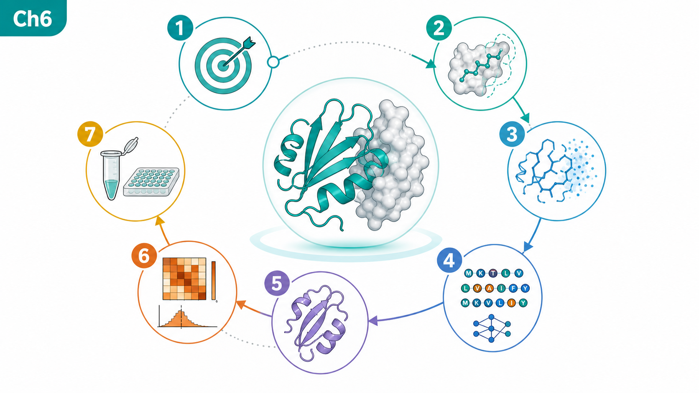
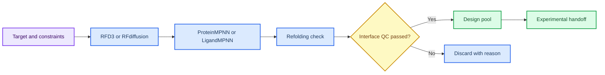
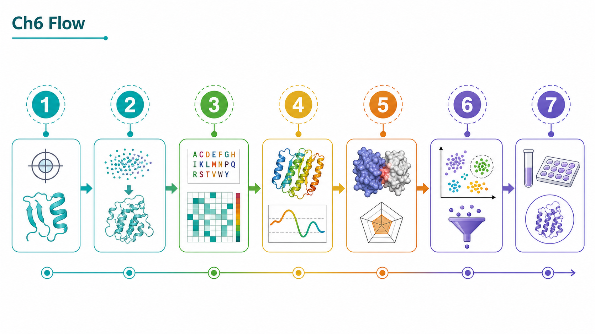
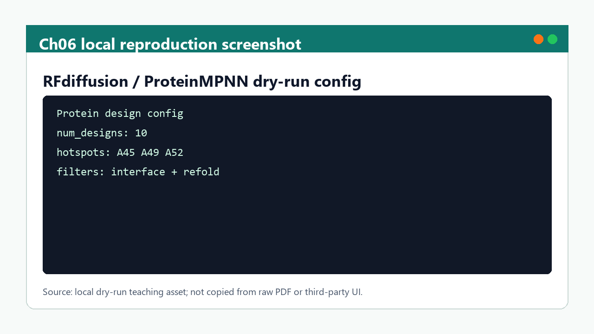

# 第 6 章 RFD3/RFdiffusion、ProteinMPNN 与蛋白设计

## 本章导读

生成式蛋白设计会产生大量结构候选，但生成结构不等于可折叠、可表达或可结合的蛋白。因此，本章首先界定这一问题场景，再说明需要记录哪些输入、动作、输出和质量控制信息。

本章建立从设计目标、约束、骨架生成、序列设计、回折叠、界面评分到实验交接的证据链。这里的重点不是追求单个软件操作的完整覆盖，而是让读者形成可复查的判断链：对象是什么、依据来自哪里、结果能支持什么、仍然不能说明什么。

第 8 章的 PPI 与蛋白设计项目池会复用本章的候选筛选标准和记录字段。因此，本章的正文采用“概念定义 -> 流程执行 -> 边界判断 -> 下一步交接”的组织方式。

## 学习目标

完成本章后，读者应能够：

- 能记录 target、motif、hotspot、contig、seed、checkpoint 和输出目录。
- 能区分骨架生成、序列设计、回折叠验证和界面评分的职责。
- 能说明 RFdiffusion/RFD3、ProteinMPNN、BindCraft、LigandMPNN 的证据边界。
- 能把生成候选转化为可审查的实验交接清单。

这些目标既面向课堂学习，也面向后续研究记录；如果不能在记录中复述这些要点，相关结果不宜进入项目结论。

## 知识图谱入口

本章图谱强调蛋白设计链条的分层：生成、设计、验证和交接必须分开记录。

在线书籍页面只引用整理后的 wiki、方法卡、文献笔记和资源页，不直接嵌入原始 PDF 或课件图表。需要追溯来源时，应回到 `book/book_map.toml`、章节精读笔记和相关 Zotero/BibTeX 记录。

| 来源类型 | 路径 |
|:---|:---|
| 章节来源 | `01_课程章节索引/章节精读/第06章_RFD3多组分设计精读.md` |
| 方法来源 | `02_方法笔记/RFdiffusion与蛋白设计.md` |
| 文献来源 | `03_文献笔记/RFdiffusion蛋白设计.md`<br>`03_文献笔记/ProteinMPNN序列设计.md`<br>`03_文献笔记/BindCraft与LigandMPNN.md` |
| 实验来源 | `04_实验记录/模板_RFdiffusion骨架生成记录.md`<br>`04_实验记录/模板_ProteinMPNN序列设计记录.md`<br>`04_实验记录/模板_BindCraft_LigandMPNN设计记录.md` |
| 工作台来源 | `07_研究工作台/证据与claims矩阵.md`<br>`07_研究工作台/实验队列.md` |

### Imagegen 知识图谱

{ loading=lazy }

| 编号 | 正文权威标签 |
|:---:|:---|
| 1 | 设计目标 |
| 2 | 约束/热点 |
| 3 | 骨架生成 |
| 4 | 序列设计 |
| 5 | 回折叠 |
| 6 | 界面评分 |
| 7 | 实验交接 |

这张图由 Imagegen 生成，用于帮助读者把本章对象、方法和证据关系先组织成可记忆结构。图中只保留短标题和编号，精确术语、参数和边界以上表及正文为准。

### Mermaid 结构图



完整图示设计和后续科学示意图 prompt 见 [Mermaid 图示与示意图设计](../resources/mermaid-schematics.md)。

## 核心概念

本节只保留支撑后续判断的核心概念。每个概念都应能回答一个具体问题：它约束什么输入、影响什么输出、需要怎样记录。

| 概念 | 教材化定义 |
|:---|:---|
| 设计目标 | 设计目标定义靶点、功能界面、约束和实验用途，是后续生成是否有意义的前提。 |
| 骨架生成 | RFdiffusion/RFD3 生成的是满足约束的结构候选，仍需序列和稳定性验证。 |
| 序列设计 | ProteinMPNN 等工具为骨架分配序列，输出质量依赖骨架合理性和约束设置。 |
| 回折叠验证 | 回折叠用于检查序列是否可能回到预期结构，但不能证明表达或结合。 |
| 界面评分 | 界面评分辅助筛选候选，必须与多样性、可制造性和实验成本一起判断。 |

阅读本节时，应优先检查这些概念能否落到文件、参数、图像、表格或记录字段上。不能落地的说法，在后续研究写作中应作为背景描述，而不是证据。

## 方法流程

本章流程按“输入 -> 动作 -> 输出 -> QC”的顺序组织。这样做的目的，是让每一步都能被复查，而不是只留下一个最终截图或分数。

| 步骤 | 输入 | 动作 | 输出 | QC/边界 |
|:---:|:---|:---|:---|:---|
| 1 | 靶点和约束 | 定义 target、motif、hotspot、contig 和排除条件。 | 设计配置。 | 约束来源明确。 |
| 2 | 骨架生成 | 小批量生成 backbone 候选。 | 候选结构。 | seed、checkpoint 和失败原因记录。 |
| 3 | 序列设计 | 为骨架设计多条序列。 | 序列候选。 | 序列多样性和重复候选已检查。 |
| 4 | 回折叠 | 预测设计序列结构并与目标骨架比较。 | 回折叠结果。 | RMSD/置信度低者不强解释。 |
| 5 | 界面评估 | 检查接触、埋藏面积、冲突和评分。 | 筛选表。 | 界面指标和人工复核一致。 |
| 6 | 实验交接 | 输出候选、边界和验证计划。 | 实验队列。 | 不把生成候选写成成功 binder。 |

执行时应先完成小样例或 dry-run，再扩大到批量任务。任何失败样本、低置信度结果或人工排除理由，都应保留在 manifest 或实验记录中。

## 代码案例与软件操作

{ loading=lazy }

**骨架生成到回折叠验证流程图** 的编号含义如下：

| 编号 | 流程节点 |
|:---:|:---|
| 1 | target |
| 2 | constraints |
| 3 | backbone |
| 4 | sequence |
| 5 | fold |
| 6 | score |
| 7 | handoff |

本节用于训练 **6 章 RFD3/RFdiffusion、ProteinMPNN 与蛋白设计** 的最小复现意识。该配置模板用于记录设计目标和筛选阈值；真实运行需要补充模型来源、checkpoint、seed 和完整输出目录。

=== "可复制代码"

    ```yaml
    target_pdb: inputs/target.pdb
    contig: A1-120/0 B20-35
    hotspot_residues: [A45, A49, A52]
    num_designs: 10
    random_seed: 20260531
    filters:
      min_interface_confidence: 0.70
      max_backbone_rmsd_a: 2.0
      require_manual_interface_review: true
    ```

=== "配套文件"

    完整示例文件：[`chapter-06-design-config.yaml`](../assets/code/chapter-06-design-config.yaml)

    P31 设计 QC 脚本：[`chapter-06-design-qc-dry-run.py`](../assets/code/chapter-06-design-qc-dry-run.py)。该脚本输出 `motif_rmsd`、`refold_rmsd`、`pae_interface`、`interface_qc_passed` 和 `discard_reason`，用于决定是否进入 ProteinMPNN、回折叠或实验队列。

{ loading=lazy }

| 步骤 | 操作 |
|:---:|:---|
| 1 | 定义靶点、motif、hotspot 和 contig。 |
| 2 | 生成少量 backbone，再用 ProteinMPNN 设计序列。 |
| 3 | 回折叠验证并筛掉低置信度、低多样性或界面 QC 失败候选。 |
| 4 | 将保留设计写入实验记录，保留 seed、checkpoint 和淘汰理由。 |

!!! warning "常见错误"
    生成结构不是可表达蛋白；必须经过回折叠、界面复核、多样性和实验可行性过滤。

## 关键文献

<!-- refs:start -->

- Watson, J. L., Juergens, D., Bennett, N. R., Trippe, B. L., Yim, J., Eisenach, H. E. et al. De novo design of protein structure and function with RFdiffusion. Nature (2023). https://doi.org/10.1038/s41586-023-06415-8

  **本文内容简介：** 本文介绍 RFdiffusion 通过扩散模型从分子约束生成蛋白结构和功能设计方案。

- Ahern, W., Yim, J., Tischer, D., Salike, S., Woodbury, S. M., Kim, D. et al. Atom level enzyme active site scaffolding using RFdiffusion2. bioRxiv (2025). https://doi.org/10.1101/2025.04.09.648075

  **本文内容简介：** 本文介绍 RFdiffusion2 在原子级酶活性位点支架设计中的建模和实验验证。

- Bennett, N. R., Watson, J. L., Ragotte, R. J., Borst, A. J., See, D. L., Weidle, C. et al. Atomically accurate de novo design of antibodies with RFdiffusion. Nature (2025). https://doi.org/10.1038/s41586-025-09721-5

  **本文内容简介：** 本文展示结合 RFdiffusion2 和筛选实验从头设计表位特异性抗体的流程。

- Dauparas, J., Anishchenko, I., Bennett, N., Bai, H., Ragotte, R. J., Milles, L. F. et al. Robust deep learning–based protein sequence design using ProteinMPNN. Science (2022). https://doi.org/10.1126/science.add2187

  **本文内容简介：** 本文提出 ProteinMPNN 深度学习序列设计方法，并用结构和功能实验验证其性能。

- Pacesa, M., Nickel, L., Schmidt, J., Pyatova, E., Schellhaas, C., Kissling, L. et al. BindCraft: one-shot design of functional protein binders. bioRxiv (2024). https://doi.org/10.1101/2024.09.30.615802

  **本文内容简介：** 本文介绍 BindCraft 一步式蛋白结合体设计管线及其多靶点实验成功率。

- Dauparas, J., Lee, G. R., Pecoraro, R., An, L., Anishchenko, I., Glasscock, C. et al. Atomic context-conditioned protein sequence design using LigandMPNN. Nature Methods (2025). https://doi.org/10.1038/s41592-025-02626-1

  **本文内容简介：** 本文介绍 LigandMPNN 在小分子、核苷酸和金属环境下进行蛋白序列设计的方法。

- Yang, W., Wang, S., Lee, G. R., Zhang, J. Z., Courbet, A., Juergens, D. et al. The past, present and future of de novo protein design. Nature 652, 1139-1152 (2026). https://doi.org/10.1038/s41586-026-10328-7

  **本文内容简介：** 本文综述从头蛋白设计的发展脉络、当前能力和未来研究方向。

<!-- refs:end -->
## 实验/练习入口

本章练习强调可复查记录，而不是追求一次性完成复杂工具链。建议按以下顺序完成：

1. 为一个设计任务写出 target、hotspot、contig 和排除条件。
2. 设计一个 10 个候选的小批量 dry-run manifest，记录 seed 和失败原因。
3. 把一个候选写成保守 claim，区分生成、回折叠和实验验证状态。

完成练习后，应能把结果写入 `04_实验记录/` 或 `07_研究工作台/` 的对应页面。不能写入记录的练习，只能算操作尝试。

## 使用边界与常见误读

本节采用保守表述阶梯：预测、评分、可视化和文献案例通常只能写成“提示”“支持”或“可能一致”，除非有直接实验或严格验证，否则不写成“证明”。

| 易误读对象 | 稳健表述 | 写作处理 |
|:---|:---|:---|
| 生成 backbone | 提示存在满足约束的结构候选。 | 不能说明序列可折叠、可表达或可结合。 |
| ProteinMPNN 序列 | 支持序列候选生成。 | 仍需回折叠、界面和实验可行性过滤。 |
| 界面评分 | 辅助候选排序。 | 不能替代生化结合实验。 |
| 设计成功 | 只有多层验证后才能谨慎表述。 | 未验证时写作“候选”“假设”或“待验证设计”。 |

写作时，如果一个结论只能由模型分数、单次截图或文献案例间接支持，应主动补上“仍需验证”“适用于该模型/该输入”“不等同于本项目结果”等边界。

## 延伸阅读与下一步

完成本章后，建议按以下路径进入下一轮学习或研究任务：

1. 将候选写入第 8 章项目池，标注设计阶段和验证缺口。
2. 把需要亲和力解释的候选回到第 5 章做模型评估。
3. 真实运行后先更新 `04_实验记录/`，再考虑写入在线书籍案例。

[返回首页](../index.md)。
