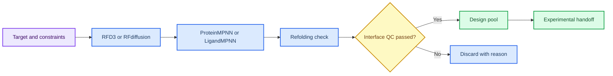

# 第 6 章 RFD3/RFdiffusion、ProteinMPNN 与蛋白设计

## 本章导读

生成式蛋白设计会产生大量结构候选，但生成结构不等于可折叠、可表达或可结合的蛋白。 RFdiffusion/RFD3 与蛋白设计链中的关键问题不是单个命令或界面能够解决的，而是贯穿输入选择、参数设置、结果解释和后续写作的判断问题。读者进入RFdiffusion/RFD3 与蛋白设计链时，应先把自己放在真实研究任务中：如果明天需要把这一步交给同组同学复核，哪些信息必须留下，哪些说法必须谨慎。

本章建立从设计目标、约束、骨架生成、序列设计、回折叠、界面评分到实验交接的证据链。 RFdiffusion/RFD3 与蛋白设计链采用教材讲解写法，不把内容压缩成术语表，而是把概念放回它服务的任务场景中解释。读者在RFdiffusion/RFD3 与蛋白设计链中需要关注的不是“记住一个名词”，而是理解它如何限制输入、影响输出、进入质量控制，并支持相应层级的写作判断。

学习RFdiffusion/RFD3 与蛋白设计链时，建议先通读核心概念，再回到方法流程表逐步核对。表格用于快速定位输入、动作、输出和 QC，正文段落则解释为什么这些字段不能省略；在RFdiffusion/RFD3 与蛋白设计链中，这一点应具体落到设计约束、候选结构和回折叠记录。RFdiffusion/RFD3 与蛋白设计链采用这样的顺序，能避免只会照着流程执行却不知道哪一步决定结果可信度。

第 8 章的 PPI 与蛋白设计项目池会复用本章的候选筛选标准和记录字段。 因此，RFdiffusion/RFD3 与蛋白设计链不是孤立的工具说明，而是后续章节继续工作的接口层。读者完成RFdiffusion/RFD3 与蛋白设计链后，应能把本章记录方式转移到下一章，而不是重新发明日志、参数和边界说明。

## 学习目标

围绕RFdiffusion/RFD3 与蛋白设计链，学习目标应落实为可复述、可记录、可复核的判断能力。完成本章后，读者应能够：

- 能记录 target、motif、hotspot、contig、seed、checkpoint 和输出目录。
- 能区分骨架生成、序列设计、回折叠验证和界面评分的职责。
- 能说明 RFdiffusion/RFD3、ProteinMPNN、BindCraft、LigandMPNN 的证据边界。
- 能把生成候选转化为可审查的实验交接清单。

在RFdiffusion/RFD3 与蛋白设计链中，这些目标既服务课堂复习，也决定后续记录能否被他人复核；若不能用记录说明输入、动作和边界，本章内容仍应停留在练习层级。

## 知识图谱入口

本章图谱强调蛋白设计链条的分层：生成、设计、验证和交接必须分开记录。

在线书籍页面只引用整理后的 wiki、方法卡、文献笔记和资源页，不直接嵌入原始 PDF 或课件图表；在RFdiffusion/RFD3 与蛋白设计链中，这一点应具体落到设计约束、候选结构和回折叠记录。需要追溯来源时，应回到 `book/book_map.toml`、章节精读笔记和相关 Zotero/BibTeX 记录；在RFdiffusion/RFD3 与蛋白设计链中，这一点应具体落到设计约束、候选结构和回折叠记录。

| 来源类型 | 路径 |
|:---|:---|
| 章节来源 | `01_课程章节索引/章节精读/第06章_RFD3多组分设计精读.md` |
| 方法来源 | `02_方法笔记/RFdiffusion与蛋白设计.md` |
| 文献来源 | `03_文献笔记/RFdiffusion蛋白设计.md`<br>`03_文献笔记/ProteinMPNN序列设计.md`<br>`03_文献笔记/BindCraft与LigandMPNN.md` |
| 实验来源 | `04_实验记录/模板_RFdiffusion骨架生成记录.md`<br>`04_实验记录/模板_ProteinMPNN序列设计记录.md`<br>`04_实验记录/模板_BindCraft_LigandMPNN设计记录.md` |
| 工作台来源 | `07_研究工作台/证据与claims矩阵.md`<br>`07_研究工作台/实验队列.md` |

### Imagegen 知识图谱

{ loading=lazy }

**图6.1 RFdiffusion/RFD3-ProteinMPNN 设计链知识图谱。** 本图为 Imagegen 生成的教学示意图，用中心概念和编号节点概括RFdiffusion/RFD3 与蛋白设计链的对象、方法入口、记录字段和证据边界；编号用于正文定位，不承载精确参数或运行结果，术语解释和判断口径以正文表格为准。

| 编号 | 正文权威标签 |
|:---:|:---|
| 1 | 设计目标 |
| 2 | 约束/热点 |
| 3 | 骨架生成 |
| 4 | 序列设计 |
| 5 | 回折叠 |
| 6 | 界面评分 |
| 7 | 实验交接 |


### Mermaid 结构图



**图6.2 蛋白设计多阶段 QC 结构图。** 本图为 Mermaid 教学示意图，展示设计目标、骨架生成、序列设计、回折叠验证和人工复核之间的多阶段 QC；箭头表示阅读和记录依赖，不替代真实软件运行或实验验证，具体输入、输出和 QC 标准以正文为准。

RFdiffusion/RFD3 与蛋白设计链的 Mermaid 源图和后续 scientific-schematics prompt 见 [Mermaid 图示与示意图设计](../resources/mermaid-schematics.md)。

## 核心概念

RFdiffusion/RFD3 与蛋白设计链的核心概念应围绕骨架生成、序列设计、回折叠和界面 QC来读，而不是孤立背诵术语。本章最重要的训练，是把每个名词都对应到一个可检查的输入、一个会改变结果的动作，以及一个必须写入记录的 QC 或边界条件；在RFdiffusion/RFD3 与蛋白设计链中，这一点应具体落到设计约束、候选结构和回折叠记录。

阅读下表时，可以把骨架生成、序列设计、回折叠和界面 QC拆成几类检查问题：它约束什么来源，改变什么输出，失败时留下什么证据。这样处理后，概念表就成为设计约束、候选结构和回折叠记录的索引，而不是定义的堆叠。

| 概念 | 教材化定义 |
|:---|:---|
| 设计目标 | 设计目标定义靶点、功能界面、约束和实验用途，是后续生成是否有意义的前提。 |
| 骨架生成 | RFdiffusion/RFD3 生成的是满足约束的结构候选，仍需序列和稳定性验证。 |
| 序列设计 | ProteinMPNN 等工具为骨架分配序列，输出质量依赖骨架合理性和约束设置。 |
| 回折叠验证 | 回折叠用于检查序列是否可能回到预期结构，但不能证明表达或结合。 |
| 界面评分 | 界面评分辅助筛选候选，必须与多样性、可制造性和实验成本一起判断。 |

使用这张表时，不需要一次记住所有术语。更实用的做法是，在准备任务时先圈出与本次输入直接相关的 2-3 个概念，再检查记录中是否已经有对应字段；在RFdiffusion/RFD3 与蛋白设计链中，这一点应具体落到设计约束、候选结构和回折叠记录。对于不直接参与RFdiffusion/RFD3 与蛋白设计链当前任务的概念，可以作为边界提示保留，避免在写作时把背景信息误写成当前结果。

这些概念之间也不是平级堆叠关系。通常先由任务对象确定输入，再由流程参数约束输出，最后由 QC 和证据边界决定能否进入下一步；在RFdiffusion/RFD3 与蛋白设计链中，这一点应具体落到设计约束、候选结构和回折叠记录。读者如果能沿着RFdiffusion/RFD3 与蛋白设计链的顺序复述本节内容，就已经掌握了把教材知识转化为研究记录的基本方法。

## 方法流程

RFdiffusion/RFD3 与蛋白设计链的方法流程要把从设计约束到候选淘汰的多阶段 QC讲清楚。读者不应只关心是否跑完命令，而要能说明每一步接收什么输入、执行什么动作、写出什么对象，以及哪一个 QC 决定它能否进入下一步；在RFdiffusion/RFD3 与蛋白设计链中，这一点应具体落到设计约束、候选结构和回折叠记录。

下表按 `输入 | 动作 | 输出 | QC/边界` 组织，适合在执行前当作检查单使用；在RFdiffusion/RFD3 与蛋白设计链中，这一点应具体落到设计约束、候选结构和回折叠记录。对于RFdiffusion/RFD3 与蛋白设计链，最后一列尤其重要，因为它把普通操作和可写入研究工作台的证据区分开来。

| 步骤 | 输入 | 动作 | 输出 | QC/边界 |
|:---:|:---|:---|:---|:---|
| 1 | 靶点和约束 | 定义 target、motif、hotspot、contig 和排除条件。 | 设计配置。 | 约束来源明确。 |
| 2 | 骨架生成 | 小批量生成 backbone 候选。 | 候选结构。 | seed、checkpoint 和失败原因记录。 |
| 3 | 序列设计 | 为骨架设计多条序列。 | 序列候选。 | 序列多样性和重复候选已检查。 |
| 4 | 回折叠 | 预测设计序列结构并与目标骨架比较。 | 回折叠结果。 | RMSD/置信度低者不强解释。 |
| 5 | 界面评估 | 检查接触、埋藏面积、冲突和评分。 | 筛选表。 | 界面指标和人工复核一致。 |
| 6 | 实验交接 | 输出候选、边界和验证计划。 | 实验队列。 | 不把生成候选写成成功 binder。 |

执行RFdiffusion/RFD3 与蛋白设计链流程表时，应先完成最小样例，再扩大到批量任务。最小样例的价值不是产生有意义的研究结果，而是验证路径、格式、参数和日志是否能闭合；在RFdiffusion/RFD3 与蛋白设计链中，这一点应具体落到设计约束、候选结构和回折叠记录。只有当RFdiffusion/RFD3 与蛋白设计链的最小样例能够被完整复核时，后续批量表格、结构、轨迹或候选列表才有进入研究工作台的基础。

流程表也提供了写作时的段落顺序。介绍方法时，先交代输入来源和动作，再说明输出形式，最后说明 QC 含义和不能推出的结论；在RFdiffusion/RFD3 与蛋白设计链中，这一点应具体落到设计约束、候选结构和回折叠记录。RFdiffusion/RFD3 与蛋白设计链采用这个顺序比先展示结果更稳健，因为它让读者看到判断链，而不是只看到筛选后的结论。

## 代码案例与软件操作

{ loading=lazy }

**图6.3 骨架生成到回折叠验证流程图。** 本图为 Imagegen 生成的流程图，说明从骨架生成到回折叠验证的蛋白设计记录顺序；它用于说明操作顺序、关键节点和记录交接位置，不代表实验结果，具体命令、参数和边界判断以正文代码块与步骤表为准。

图中编号节点与下表对应：

| 编号 | 流程节点 |
|:---:|:---|
| 1 | target |
| 2 | constraints |
| 3 | backbone |
| 4 | sequence |
| 5 | fold |
| 6 | score |
| 7 | handoff |

本节用于训练 **6 章 RFD3/RFdiffusion、ProteinMPNN 与蛋白设计** 的最小复现意识。该配置模板用于记录设计目标和筛选阈值；真实运行需要补充模型来源、checkpoint、seed 和完整输出目录。

=== "可复制代码"

    ```yaml
    target_pdb: inputs/target.pdb
    contig: A1-120/0 B20-35
    hotspot_residues: [A45, A49, A52]
    num_designs: 10
    random_seed: 20260531
    filters:
      min_interface_confidence: 0.70
      max_backbone_rmsd_a: 2.0
      require_manual_interface_review: true
    ```

=== "配套文件"

    完整示例文件：[`chapter-06-design-config.yaml`](../assets/code/chapter-06-design-config.yaml)

    P31 设计 QC 脚本：[`chapter-06-design-qc-dry-run.py`](../assets/code/chapter-06-design-qc-dry-run.py)。该脚本输出 `motif_rmsd`、`refold_rmsd`、`pae_interface`、`interface_qc_passed` 和 `discard_reason`，用于决定是否进入 ProteinMPNN、回折叠或实验队列。

{ loading=lazy }

**图6.4 蛋白设计 dry-run 软件操作截图。** 本图为本地 dry-run 截图，展示蛋白设计 dry-run 配置、QC 字段和候选状态记录；截图用于说明界面、文件或表格位置，不代表实验结果，读者应按本机路径替换参数并以正文操作表为准。

| 步骤 | 操作 |
|:---:|:---|
| 1 | 定义靶点、motif、hotspot 和 contig。 |
| 2 | 生成少量 backbone，再用 ProteinMPNN 设计序列。 |
| 3 | 回折叠验证并筛掉低置信度、低多样性或界面 QC 失败候选。 |
| 4 | 将保留设计写入实验记录，保留 seed、checkpoint 和淘汰理由。 |

### 教材化阅读提示

本节代码应作为设计候选 QC 表 dry-run的可复查样例来读。它展示的是如何把RFdiffusion/RFD3 与蛋白设计链中的一次小任务写成可复制、可失败、可追溯的记录，而不是声明已经完成真实研究运行。

替换参数时，应先替换与RFdiffusion/RFD3 与蛋白设计链直接相关的输入路径，再调整会影响解释的阈值、空间范围或模型参数。如果RFdiffusion/RFD3 与蛋白设计链的最小样例尚不能解释输出来源，就不应扩大到批量任务。

解读输出时，只记录代码确实生成的对象，例如 manifest、配置、dry-run 表格、截图或日志；在RFdiffusion/RFD3 与蛋白设计链中，这一点应具体落到设计约束、候选结构和回折叠记录。这些对象可以支持设计约束、候选结构和回折叠记录的整理，但不能自动升级为实验结论；需要形成研究判断时，仍要回到实验记录模板补齐输入、QC、人工复核和待验证项。
## 关键文献

<!-- refs:start -->

- Watson, J. L., Juergens, D., Bennett, N. R., Trippe, B. L., Yim, J., Eisenach, H. E. et al. De novo design of protein structure and function with RFdiffusion. Nature (2023). https://doi.org/10.1038/s41586-023-06415-8

  **本文内容简介：** 本文介绍 RFdiffusion 通过扩散模型从分子约束生成蛋白结构和功能设计方案。

- Ahern, W., Yim, J., Tischer, D., Salike, S., Woodbury, S. M., Kim, D. et al. Atom level enzyme active site scaffolding using RFdiffusion2. bioRxiv (2025). https://doi.org/10.1101/2025.04.09.648075

  **本文内容简介：** 本文介绍 RFdiffusion2 在原子级酶活性位点支架设计中的建模和实验验证。

- Butcher, J., Krishna, R., Mitra, R., Brent, R. I., Li, Y., Corley, N. et al. De novo design of all-atom biomolecular interactions with RFdiffusion3. bioRxiv (2025). https://doi.org/10.1101/2025.09.18.676967

  **本文内容简介：** 本文介绍 RFdiffusion3 用于全原子生物分子相互作用设计的预印本方法。

- Bennett, N. R., Watson, J. L., Ragotte, R. J., Borst, A. J., See, D. L., Weidle, C. et al. Atomically accurate de novo design of antibodies with RFdiffusion. Nature (2025). https://doi.org/10.1038/s41586-025-09721-5

  **本文内容简介：** 本文展示结合 RFdiffusion2 和筛选实验从头设计表位特异性抗体的流程。

- Dauparas, J., Anishchenko, I., Bennett, N., Bai, H., Ragotte, R. J., Milles, L. F. et al. Robust deep learning–based protein sequence design using ProteinMPNN. Science (2022). https://doi.org/10.1126/science.add2187

  **本文内容简介：** 本文提出 ProteinMPNN 深度学习序列设计方法，并用结构和功能实验验证其性能。

- Pacesa, M., Nickel, L., Schellhaas, C., Schmidt, J., Pyatova, E., Kissling, L. et al. One-shot design of functional protein binders with BindCraft. Nature 646, 483-492 (2025). https://doi.org/10.1038/s41586-025-09429-6

  **本文内容简介：** 本文介绍 BindCraft 一步式蛋白结合体设计管线及其多靶点实验成功率。

- Dauparas, J., Lee, G. R., Pecoraro, R., An, L., Anishchenko, I., Glasscock, C. et al. Atomic context-conditioned protein sequence design using LigandMPNN. Nature Methods (2025). https://doi.org/10.1038/s41592-025-02626-1

  **本文内容简介：** 本文介绍 LigandMPNN 在小分子、核苷酸和金属环境下进行蛋白序列设计的方法。

- Yang, W., Wang, S., Lee, G. R., Zhang, J. Z., Courbet, A., Juergens, D. et al. The past, present and future of de novo protein design. Nature 652, 1139-1152 (2026). https://doi.org/10.1038/s41586-026-10328-7

  **本文内容简介：** 本文综述从头蛋白设计的发展脉络、当前能力和未来研究方向。

<!-- refs:end -->
## 实验/练习入口

本章练习的重点是把RFdiffusion/RFD3 与蛋白设计链转化成可交接记录。练习完成后，读者应能让另一个人根据记录复现从设计约束到候选淘汰的多阶段 QC，并判断是否具备进入第 8 章项目路线整合的条件。

建议按以下顺序完成：

1. 为一个设计任务写出 target、hotspot、contig 和排除条件。
2. 设计一个 10 个候选的小批量 dry-run manifest，记录 seed 和失败原因。
3. 把一个候选写成保守 claim，区分生成、回折叠和实验验证状态。

完成练习后，应检查记录中是否包含设计约束、候选结构和回折叠记录、失败原因和人工判断。缺少设计约束、候选结构和回折叠记录时，相关内容仍适合作为课堂尝试，不适合写入正式研究结论。

如果练习借用了文献案例或课程范文，应在RFdiffusion/RFD3 与蛋白设计链记录中明确它只是方法参照或边界样例。在RFdiffusion/RFD3 与蛋白设计链中，文献案例可以启发流程设计，但不能替代本项目的本地运行结果。

## 使用边界与常见误读

RFdiffusion/RFD3 与蛋白设计链最容易被误写的对象是生成骨架、ProteinMPNN 序列和回折叠结果。在RFdiffusion/RFD3 与蛋白设计链中，这些对象看起来像结果，但在当前教材层级通常只是模型输出、流程观察、可视化线索或文献案例。

下表用于训练写作降级。在RFdiffusion/RFD3 与蛋白设计链中，读者应先判断当前证据最多能支持什么说法，再决定是否写成“提示”“支持”“流程参考”或“仍需验证”。

| 易误读对象 | 稳健表述 | 写作处理 |
|:---|:---|:---|
| 生成 backbone | 提示存在满足约束的结构候选。 | 不能说明序列可折叠、可表达或可结合。 |
| ProteinMPNN 序列 | 支持序列候选生成。 | 仍需回折叠、界面和实验可行性过滤。 |
| 界面评分 | 辅助候选排序。 | 不能替代生化结合实验。 |
| 设计成功 | 只有多层验证后才能谨慎表述。 | 未验证时写作“候选”“假设”或“待验证设计”。 |

边界判断并不是削弱RFdiffusion/RFD3 与蛋白设计链的价值，而是说明证据在哪里停止。如果删除某个软件名、截图、分数或文献案例后，结论就无法成立，通常应把该结论降级为候选线索或下一步验证任务；在RFdiffusion/RFD3 与蛋白设计链中，这一点应具体落到设计约束、候选结构和回折叠记录。

只有当RFdiffusion/RFD3 与蛋白设计链对应的真实运行记录、复核结果和严格计算或实验支持已经进入项目记录，相关判断才适合升级为更强表述。

本章的边界判断涉及生成式设计最容易被高估的部分。骨架生成、ProteinMPNN 序列和回折叠结果只能说明设计链产生了可检查候选，不能直接说明蛋白可表达、可折叠或可结合。读者应把设计约束、失败淘汰和界面 QC 写成连续记录。

## 延伸阅读与下一步

RFdiffusion/RFD3 与蛋白设计链的延伸阅读应服务下一次可执行任务，而不是停留在资料补充。读者完成本章后，应能判断哪些内容进入设计约束、候选结构和回折叠记录，哪些内容进入阅读队列，哪些内容只能作为背景案例。

建议按以下路径进入下一轮学习或研究任务：

1. 将候选写入第 8 章项目池，标注设计阶段和验证缺口。
2. 把需要亲和力解释的候选回到第 5 章做模型评估。
3. 真实运行后先更新 `04_实验记录/`，再考虑写入在线书籍案例。

选择下一步时，应优先检查RFdiffusion/RFD3 与蛋白设计链的证据链是否足以支撑转入第 8 章项目路线整合。若输入来源、参数、QC 或边界尚未记录清楚，应先补齐本章记录，而不是继续叠加更复杂的工具；在RFdiffusion/RFD3 与蛋白设计链中，这一点应具体落到设计约束、候选结构和回折叠记录。

完成这种转换后，RFdiffusion/RFD3 与蛋白设计链就不只是读过的教材内容，而是可以被检索、复核和继续执行的研究资产。

进入综合项目路线时，设计候选应先经过多层过滤。只有当约束来源、回折叠一致性、界面合理性和后续实验可行性都被记录，设计结果才适合进入项目池，而不是停留在漂亮结构图。
