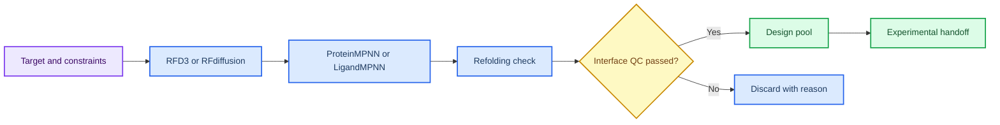

# 第 6 章 RFD3/RFdiffusion、ProteinMPNN 与蛋白设计

## 本章导读

生成式蛋白设计的输出通常很丰富，但候选数量不等于设计成功。本章围绕 target、motif、hotspot、contig、seed、backbone、sequence、refolding 和 interface QC 建立设计链，强调每个候选都需要经过多阶段淘汰。

RFdiffusion/RFD3 可以生成满足约束的结构候选，ProteinMPNN 或 LigandMPNN 可以为骨架分配序列，回折叠和界面评估可以检查候选是否仍接近设计目标。但这些步骤都属于计算筛选，不能直接支持表达、折叠、结合或功能。

第 8 章的 PPI 与蛋白设计项目池会复用本章的候选状态和失败原因。因此，本章的重点不是展示一个“成功设计”，而是建立一套能解释候选为何保留或淘汰的记录方式。

生成式设计的阅读难点在于候选会快速增多，读者容易只关注最漂亮的结构。本章要求把每个候选放回约束、seed、序列、回折叠和界面 QC 中判断，让候选淘汰过程和保留理由同样可见。

## 学习目标

本章目标是把生成式蛋白设计读成多阶段候选筛选流程，而不是把生成结构直接写成成功 binder。完成本章后，读者应能够：

- 能记录 target、motif、hotspot、contig、seed、checkpoint 和输出目录。
- 能区分骨架生成、序列设计、回折叠验证和界面评分的职责。
- 能说明 RFdiffusion/RFD3、ProteinMPNN、BindCraft、LigandMPNN 的证据边界。
- 能把生成候选转化为可审查的实验交接清单。

这些目标用于保护设计结论边界。生成 backbone、ProteinMPNN 序列、回折叠结果和界面评分必须连续记录，任何单一环节都不能单独说明蛋白可表达、可折叠或可结合。

## 知识图谱入口

本章图谱强调蛋白设计链条的分层：生成、设计、验证和交接必须分开记录。

在线书籍页面只引用整理后的 wiki、方法卡、文献笔记和资源页，不直接嵌入原始 PDF 或课件图表；在RFdiffusion/RFD3 与蛋白设计链中，这一点应具体落到设计约束、候选结构和回折叠记录。需要追溯来源时，应回到 `book/book_map.toml`、章节精读笔记和相关 Zotero/BibTeX 记录；在RFdiffusion/RFD3 与蛋白设计链中，这一点应具体落到设计约束、候选结构和回折叠记录。

| 来源类型 | 路径 |
|:---|:---|
| 章节来源 | `01_课程章节索引/章节精读/第06章_RFD3多组分设计精读.md` |
| 方法来源 | `02_方法笔记/RFdiffusion与蛋白设计.md` |
| 文献来源 | `03_文献笔记/RFdiffusion蛋白设计.md`<br>`03_文献笔记/ProteinMPNN序列设计.md`<br>`03_文献笔记/BindCraft与LigandMPNN.md` |
| 实验来源 | `04_实验记录/模板_RFdiffusion骨架生成记录.md`<br>`04_实验记录/模板_ProteinMPNN序列设计记录.md`<br>`04_实验记录/模板_BindCraft_LigandMPNN设计记录.md` |
| 工作台来源 | `07_研究工作台/证据与claims矩阵.md`<br>`07_研究工作台/实验队列.md` |

### Imagegen 知识图谱

{ loading=lazy }

**图6.1 RFdiffusion/RFD3-ProteinMPNN 设计链知识图谱。** 本图为 Imagegen 生成的教学示意图，用中心概念和编号节点概括RFdiffusion/RFD3 与蛋白设计链的对象、方法入口、记录字段和证据边界；编号用于正文定位，不承载精确参数或运行结果，术语解释和判断口径以正文表格为准。 节点编号：1=设计目标；2=约束/热点；3=骨架生成；4=序列设计；5=回折叠；6=界面评分；7=实验交接。

### Mermaid 结构图



**图6.2 蛋白设计多阶段 QC 结构图。** 本图为 Mermaid 教学示意图，展示设计目标、骨架生成、序列设计、回折叠验证和人工复核之间的多阶段 QC；箭头表示阅读和记录依赖，不替代真实软件运行或实验验证，具体输入、输出和 QC 标准以正文为准。

RFdiffusion/RFD3 与蛋白设计链的 Mermaid 源图和后续 scientific-schematics prompt 见 [Mermaid 图示与示意图设计](../resources/mermaid-schematics.md)。

## 核心概念

RFdiffusion/RFD3 与蛋白设计链的核心概念围绕“约束如何定义、候选如何生成、淘汰如何记录”展开。它们共同决定设计候选能否进入实验交接。

| 概念 | 教材化定义 |
|:---|:---|
| 设计目标 | 设计目标定义靶点、功能界面、约束和实验用途，是后续生成是否有意义的前提。 |
| 骨架生成 | RFdiffusion/RFD3 生成的是满足约束的结构候选，仍需序列和稳定性验证。 |
| 序列设计 | ProteinMPNN 等工具为骨架分配序列，输出质量依赖骨架合理性和约束设置。 |
| 回折叠验证 | 回折叠用于检查序列是否可能回到预期结构，但不能支持表达或结合。 |
| 界面评分 | 界面评分辅助筛选候选，必须与多样性、可制造性和实验成本一起判断。 |

使用概念表时，应把设计目标、骨架生成、序列设计、回折叠和界面评分看成连续闸门。每一关都需要记录输入、参数、失败原因和保留理由。

这些概念不是并列术语。设计目标限定 motif 和 contig，骨架生成产生结构候选，序列设计增加可实现性假设，回折叠和界面 QC 决定候选是否值得进入实验队列。

例如，motif 来源不清会削弱设计目标，contig 设置不当会改变生成空间，seed 缺失会影响复现，回折叠偏离会提示候选可能不稳定。概念表应帮助读者把这些风险写入记录，而不是只保存最终模型。

界面评分也需要和多样性、可制造性一起解释。若所有候选都来自相近 backbone 或相似序列，即使评分较好，也可能缺少探索价值；若候选难以表达或含有明显问题残基，也不适合直接进入实验。

## 方法流程

本章流程是一条多阶段 QC 链。它从 target 与约束定义开始，到实验交接清单结束，中间每一步都需要保留 seed、checkpoint 和淘汰原因。

| 步骤 | 输入 | 动作 | 输出 | QC/边界 |
|:---:|:---|:---|:---|:---|
| 1 | 靶点和约束 | 定义 target、motif、hotspot、contig 和排除条件。 | 设计配置。 | 约束来源明确。 |
| 2 | 骨架生成 | 小批量生成 backbone 候选。 | 候选结构。 | seed、checkpoint 和失败原因记录。 |
| 3 | 序列设计 | 为骨架设计多条序列。 | 序列候选。 | 序列多样性和重复候选已检查。 |
| 4 | 回折叠 | 预测设计序列结构并与目标骨架比较。 | 回折叠结果。 | RMSD/置信度低者不强解释。 |
| 5 | 界面评估 | 检查接触、埋藏面积、冲突和评分。 | 筛选表。 | 界面指标和人工复核一致。 |
| 6 | 实验交接 | 输出候选、边界和验证计划。 | 实验队列。 | 不把生成候选写成成功 binder。 |

执行时先做小批量设计 manifest，例如 10 个 backbone 候选，而不是直接追求大规模生成。小批量任务能够暴露 contig 设定、motif 保留、seed 可重复性、回折叠失败和界面冲突等问题。

写作时应按“约束 -> 生成 -> 序列 -> 回折叠 -> 界面 -> 交接”的顺序描述。只有经过多层 QC 的候选才适合写入实验队列；未验证候选应写成 candidate 或 pending design。

### 案例走读

一次设计 dry-run 可以先定义 target、motif、hotspot 与 contig，并固定 seed 和 checkpoint。读者应检查 motif 是否有来源，contig 是否反映真实结构约束，seed 是否写入 manifest。随后生成少量 backbone，记录每个候选的生成状态和失败原因。

进入 ProteinMPNN 或序列设计后，不应只保留最高分序列。更稳健的表格应同时包含 motif_rmsd、refold_rmsd、pae_interface、interface_qc_passed 和 discard_reason。若候选回折叠偏离 motif 或界面 PAE 较差，应标注为淘汰或待复核；即使通过 dry-run，也只能写成“候选设计进入下一步验证”，不能写成成功 binder。

小批量设计的价值在于暴露失败模式。读者应主动记录哪些候选因 motif 偏离、界面冲突、PAE 较差或序列重复被淘汰；这些失败项能反向校准下一轮约束，而不是无意义的噪声。

## 代码案例与软件操作

{ loading=lazy }

**图6.3 骨架生成到回折叠验证流程图。** 本图为 Imagegen 生成的流程图，说明从骨架生成到回折叠验证的蛋白设计记录顺序；它用于说明操作顺序、关键节点和记录交接位置，不代表实验结果，具体命令、参数和边界判断以正文代码块与步骤表为准。 流程编号：1=target；2=constraints；3=backbone；4=sequence；5=fold；6=score；7=handoff。

本节用于训练 **6 章 RFD3/RFdiffusion、ProteinMPNN 与蛋白设计** 的最小复现意识。该配置模板用于记录设计目标和筛选阈值；真实运行需要补充模型来源、checkpoint、seed 和完整输出目录。

=== "可复制代码"

    ```yaml
    target_pdb: inputs/target.pdb
    contig: A1-120/0 B20-35
    hotspot_residues: [A45, A49, A52]
    num_designs: 10
    random_seed: 20260531
    filters:
      min_interface_confidence: 0.70
      max_backbone_rmsd_a: 2.0
      require_manual_interface_review: true
    ```

=== "配套文件"

    完整示例文件：[`chapter-06-design-config.yaml`](../assets/code/chapter-06-design-config.yaml)

    P31 设计 QC 脚本：[`chapter-06-design-qc-dry-run.py`](../assets/code/chapter-06-design-qc-dry-run.py)。该脚本输出 `motif_rmsd`、`refold_rmsd`、`pae_interface`、`interface_qc_passed` 和 `discard_reason`，用于决定是否进入 ProteinMPNN、回折叠或实验队列。

{ loading=lazy }

**图6.4 蛋白设计 dry-run 软件操作截图。** 本图为本地 dry-run 截图，展示蛋白设计 dry-run 配置、QC 字段和候选状态记录；截图用于说明界面、文件或表格位置，不代表实验结果，读者应按本机路径替换参数并以正文操作表为准。

| 步骤 | 操作 |
|:---:|:---|
| 1 | 定义靶点、motif、hotspot 和 contig。 |
| 2 | 生成少量 backbone，再用 ProteinMPNN 设计序列。 |
| 3 | 回折叠验证并筛掉低置信度、低多样性或界面 QC 失败候选。 |
| 4 | 将保留设计写入实验记录，保留 seed、checkpoint 和淘汰理由。 |

### 教材化阅读提示

本节代码应作为设计候选 QC 表 dry-run的可复查样例来读。它展示的是如何把RFdiffusion/RFD3 与蛋白设计链中的一次小任务写成可复制、可失败、可追溯的记录，而不是声明已经完成真实研究运行。

替换参数时，应先替换与RFdiffusion/RFD3 与蛋白设计链直接相关的输入路径，再调整会影响解释的阈值、空间范围或模型参数。如果RFdiffusion/RFD3 与蛋白设计链的最小样例尚不能解释输出来源，就不应扩大到批量任务。

解读输出时，只记录代码确实生成的对象，例如 manifest、配置、dry-run 表格、截图或日志；在RFdiffusion/RFD3 与蛋白设计链中，这一点应具体落到设计约束、候选结构和回折叠记录。这些对象可以支持设计约束、候选结构和回折叠记录的整理，但不能自动升级为实验结论；需要形成研究判断时，仍要回到实验记录模板补齐输入、QC、人工复核和待验证项。
## 关键文献

文献使用说明：本章文献按设计链位置使用。RFdiffusion、RFdiffusion2/3 和抗体设计文献支撑骨架生成与实验验证案例；ProteinMPNN 与 LigandMPNN 支撑序列设计；BindCraft 和蛋白设计综述用于说明设计管线、成功率边界和领域趋势。

<!-- refs:start -->

- Watson, J. L., Juergens, D., Bennett, N. R., Trippe, B. L., Yim, J., Eisenach, H. E. et al. De novo design of protein structure and function with RFdiffusion. Nature (2023). https://doi.org/10.1038/s41586-023-06415-8

  **本文内容简介：** 本文介绍 RFdiffusion 通过扩散模型从分子约束生成蛋白结构和功能设计方案。

- Ahern, W., Yim, J., Tischer, D., Salike, S., Woodbury, S. M., Kim, D. et al. Atom level enzyme active site scaffolding using RFdiffusion2. bioRxiv (2025). https://doi.org/10.1101/2025.04.09.648075

  **本文内容简介：** 本文介绍 RFdiffusion2 在原子级酶活性位点支架设计中的建模和实验验证。

- Butcher, J., Krishna, R., Mitra, R., Brent, R. I., Li, Y., Corley, N. et al. De novo design of all-atom biomolecular interactions with RFdiffusion3. bioRxiv (2025). https://doi.org/10.1101/2025.09.18.676967

  **本文内容简介：** 本文介绍 RFdiffusion3 用于全原子生物分子相互作用设计的预印本方法。

- Bennett, N. R., Watson, J. L., Ragotte, R. J., Borst, A. J., See, D. L., Weidle, C. et al. Atomically accurate de novo design of antibodies with RFdiffusion. Nature (2025). https://doi.org/10.1038/s41586-025-09721-5

  **本文内容简介：** 本文展示结合 RFdiffusion2 和筛选实验从头设计表位特异性抗体的流程。

- Dauparas, J., Anishchenko, I., Bennett, N., Bai, H., Ragotte, R. J., Milles, L. F. et al. Robust deep learning–based protein sequence design using ProteinMPNN. Science (2022). https://doi.org/10.1126/science.add2187

  **本文内容简介：** 本文提出 ProteinMPNN 深度学习序列设计方法，并用结构和功能实验验证其性能。

- Pacesa, M., Nickel, L., Schellhaas, C., Schmidt, J., Pyatova, E., Kissling, L. et al. One-shot design of functional protein binders with BindCraft. Nature 646, 483-492 (2025). https://doi.org/10.1038/s41586-025-09429-6

  **本文内容简介：** 本文介绍 BindCraft 一步式蛋白结合体设计管线及其多靶点实验成功率。

- Dauparas, J., Lee, G. R., Pecoraro, R., An, L., Anishchenko, I., Glasscock, C. et al. Atomic context-conditioned protein sequence design using LigandMPNN. Nature Methods (2025). https://doi.org/10.1038/s41592-025-02626-1

  **本文内容简介：** 本文介绍 LigandMPNN 在小分子、核苷酸和金属环境下进行蛋白序列设计的方法。

- Yang, W., Wang, S., Lee, G. R., Zhang, J. Z., Courbet, A., Juergens, D. et al. The past, present and future of de novo protein design. Nature 652, 1139-1152 (2026). https://doi.org/10.1038/s41586-026-10328-7

  **本文内容简介：** 本文综述从头蛋白设计的发展脉络、当前能力和未来研究方向。

<!-- refs:end -->

## 实验/练习入口

本章练习的重点是把RFdiffusion/RFD3 与蛋白设计链转化成可交接记录。练习完成后，读者应能让另一个人根据记录复现从设计约束到候选淘汰的多阶段 QC，并判断是否具备进入第 8 章项目路线整合的条件。

建议按以下顺序完成：

1. 为一个设计任务写出 target、hotspot、contig 和排除条件。
2. 设计一个 10 个候选的小批量 dry-run manifest，记录 seed 和失败原因。
3. 把一个候选写成保守 claim，区分生成、回折叠和实验验证状态。

完成练习后，应检查记录中是否包含设计约束、候选结构和回折叠记录、失败原因和人工判断。缺少设计约束、候选结构和回折叠记录时，相关内容仍适合作为课堂尝试，不适合写入正式研究结论。

如果练习借用了文献案例或课程范文，应在RFdiffusion/RFD3 与蛋白设计链记录中明确它只是方法参照或边界样例。在RFdiffusion/RFD3 与蛋白设计链中，文献案例可以启发流程设计，但不能替代本项目的本地运行结果。

## 使用边界与常见误读

本章的高风险对象是生成 backbone、ProteinMPNN 序列、回折叠结果和“设计成功”。这些对象都需要多层验证后才能升级表述。

本章使用边界表时，应把“设计成功”拆成生成、序列、回折叠、界面、表达和结合多个检查点。

| 易误读对象 | 稳健表述 | 写作处理 |
|:---|:---|:---|
| 生成 backbone | 提示存在满足约束的结构候选。 | 不能说明序列可折叠、可表达或可结合。 |
| ProteinMPNN 序列 | 支持序列候选生成。 | 仍需回折叠、界面和实验可行性过滤。 |
| 界面评分 | 辅助候选排序。 | 不能替代生化结合实验。 |
| 设计成功 | 只有多层验证后才能谨慎表述。 | 未验证时写作“候选”“假设”或“待验证设计”。 |

RFdiffusion/RFD3 输出的边界应停在计算候选。ProteinMPNN 序列提示某个骨架可被赋予序列，回折叠提示结构假设可能保持，但都不能直接说明表达、结合或功能。

稳健写法是“该候选通过当前计算 QC，进入后续验证队列”，而不是“获得成功 binder”。真正的成功表述需要表达、纯化、结合或功能实验，以及与设计目标一致的复核证据。

本章使用边界表时，应把“设计成功”拆成多个检查点：生成、序列、回折叠、界面、表达和结合。当前在线教材只覆盖计算候选层，因此默认使用候选、待验证设计和实验交接清单等表述。

## 延伸阅读与下一步

完成本章后，应把设计候选交给项目池或实验队列，而不是直接写入结论。推荐路径如下：

1. 将候选写入第 8 章项目池，标注设计阶段、通过的 QC 和剩余缺口。
2. 对需要结合排序的候选，回到第 5 章进行模型评估并注明校准边界。
3. 对准备真实运行或实验验证的候选，先更新 `04_实验记录/`，再考虑写入在线教材案例。

若 motif、contig、seed 或回折叠记录不完整，应先补齐本章设计链，而不是继续叠加新的生成工具。

完成本章后，读者应为每个保留候选准备一行交接记录：target、motif、contig、seed、backbone ID、sequence ID、refold RMSD、interface QC 和 discard_reason。该记录可以进入第 8 章项目池，也可以作为真实实验前的候选清单。若某个字段为空，应优先补齐本章 QC，而不是扩大生成规模。

若要推进真实设计任务，建议先固定一个非常小的设计目标，并明确什么情况算淘汰。淘汰标准可以包括 motif 偏离、回折叠失败、界面冲突、序列重复或实验不可行。标准越早写清楚，后续生成候选越不容易被“看起来合理”的结构误导。
