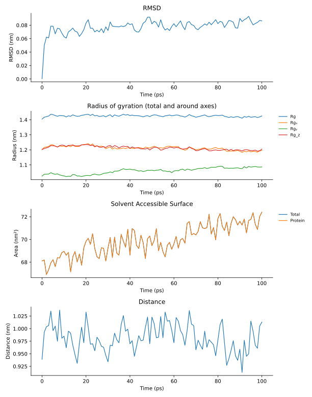
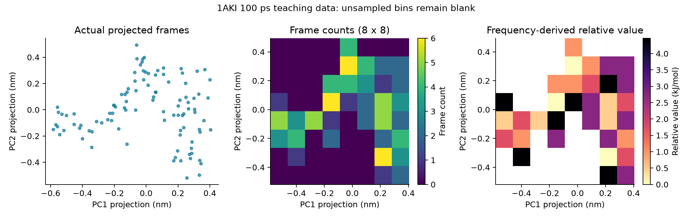

# 第 6 章 轨迹分析、构象解释与 AI 采样

## 本章导读

第 5 章生成了 1AKI 的坐标轨迹。现在先回答一个容易忽略的问题。画出的曲线究竟用了哪些原子、哪份参考结构、哪个时间区间？同一条轨迹改变原子组或参考结构，会得到不同的 RMSD。先把这些选择写清，再解释图形。

本章使用独立 1AKI 运行的真实轨迹与 XVG，共 101 帧、0–100 ps。先整理周期性边界，再分析数值，最后比较原子组与参考选择。PCA、聚类、频数图和 DCCM 也提供真实计算结果，BioEmu 留作选学输入准备。

| 必修操作 | 对照操作 | 保存内容 |
|---|---|---|
| 整理匹配的 tpr 与 xtc | 用错误体系的参考文件检查报错 | 命令与错误日志 |
| C-alpha RMSD、RMSF、Rg、SASA | 改成 Backbone 或改参考结构 | 原子组与参考记录 |
| 从 XVG 重画原始曲线 | 改变绘图区间 | SVG、统计、输入校验值 |
| 打开轨迹检查帧 | 比较整理前后的跨盒跳跃 | 关键帧编号与观察记录 |

## 练习目录

以下命令从练习下载目录（例如 `C:/coursework/ai-md/downloads`）开始。先进入本章目录，后续 Python 命令都从这里运行，结果写入 `outputs`。

```bash
cd chapter-06/assets
```

Ubuntu/WSL 沿用第 5.4 节建立的 Linux venv。新开终端先执行 `source ~/.venvs/ai-md/bin/activate`，然后进入本章目录。Windows 原生分析使用第 1 章配置的 Windows Python 环境；两套环境分别安装依赖，不复制虚拟环境目录。

软件源中的 GROMACS 可能比生成数据的版本旧，不能直接读取包内 2025.5 的 `md.tpr`。先查看版本；若出现 TPR version 报错，不改文件后缀。可以用自己的第 5 章运行结果，也可以按下列 Ubuntu 命令从公开配套输入重建本机分析 TPR。

```bash
mkdir -p outputs/local-tpr
cd practice/1aki/run-inputs
gmx grompp -f md.mdp -c npt.gro -p topol.top -o ../../../outputs/local-tpr/analysis-local.tpr -po ../../../outputs/local-tpr/processed.mdp
cd ../../..
python code/analyze-md.py --gmx gmx --run practice/1aki --tpr outputs/local-tpr/analysis-local.tpr --out outputs/analysis-local
```

此处不读取新版 checkpoint，也不重跑轨迹。`run-inputs` 已含所需 MDP、NPT 坐标、topol.top 与 posre.itp，力场文件来自本机 GROMACS。新文件只用于分析，原 `md.tpr` 保留；手动命令的 `-s` 同样换成本机分析 TPR。出现警告或原子数/顺序不符时先停止，不加 `-maxwarn`。

当前 2025.5-dev 已验证无警告重建，23873 个原子的残基与原子标识、顺序完全相同，使用 `--tpr` 的完整重分析也已成功，见[重建核验记录](../assets/chapter-06/practice/1aki/analysis-local-rebuild-record.json)。本机没有运行 Ubuntu 旧版二进制，因此旧版安装后的退出码和选择日志仍由学生记录；不运行 GROMACS 也能先完成下载 XVG 的绘图练习。

## 6.1 周期性边界条件与轨迹整理

先在可视化工具中看原始轨迹。如果蛋白跨过盒边界，画面可能显示它分成几块。周期性边界下，坐标存放方式与分子实际是否断裂是两个问题；先使分子完整，再居中和拟合。

下列命令展示整理顺序，手动执行时工作目录是第 5 章的运行目录。

```bash
gmx check -f md.xtc
gmx trjconv -s md.tpr -f md.xtc -o md-whole.xtc -pbc mol
gmx trjconv -s md.tpr -f md-whole.xtc -o md-center.xtc -center -pbc mol
gmx trjconv -s md.tpr -f md-center.xtc -o md-fit.xtc -fit rot+trans
```

初次操作优先使用本章脚本。下载包已经包含匹配的 `practice/1aki/md.tpr`、完整 `md.xtc` 与 EDR，可以先重提取这些数据。脚本会逐项保存选择和日志，输出目录须为空或尚不存在。

```bash
python code/analyze-md.py --gmx gmx --run practice/1aki --out outputs/analysis
```

自己完成第 5 章运行后，把 `--run practice/1aki` 改成 `--run ../../chapter-05/assets/outputs/run-1aki`。实际版本支持当前原生氢键与 DSSP 接口时再加 `--native-secondary`。下载数据的[分析记录](../assets/chapter-06/practice/1aki/analysis-record.json)保存了本次选择与输入校验值。

第一次输出选 `System`；居中时先选 `Protein`，再选 `System` 输出；拟合时先选 `Backbone`，再选 `System` 输出。每次都看终端打印的组名。不同体系或索引文件会改变编号，不能照抄别人的数字。

| 选择 | 你改变了什么 | 后续文件怎样配对 |
|---|---|---|
| 输出 System | 保留蛋白、水与离子全部坐标 | 继续使用原 md.tpr |
| 输出 Protein | 只保留蛋白原子 | 另生成相同原子顺序的参考，不能直接套原全体系 |
| center Protein | 用蛋白确定居中位置 | 输出仍可保留 System |
| fit Backbone | 去除整体平移与转动 | 保存拟合组及参考来源 |

必修流程一直输出 `System`，因此与 `md.tpr` 保持对应。对照练习另输出一份 Protein-only 轨迹，并记录其原子数；尝试与全体系 tpr 配对，说明错误来自文件对应关系还是模拟本身。

## 6.2 RMSD、RMSF、Rg、SASA、氢键和 DSSP

先预测四条曲线的横轴。RMSD、Rg、SASA 通常按时间记录，RMSF 通常按原子或残基记录。RMSF 不能沿用“时间 / ps”的横轴标签。

在整理后的全体系轨迹上执行。

```bash
gmx rms -s md.tpr -f md-center.xtc -o rmsd-ca.xvg -tu ps
gmx rms -s md.tpr -f md-center.xtc -o rmsd-backbone.xvg -tu ps
gmx rmsf -s md.tpr -f md-center.xtc -o rmsf-ca.xvg -res
gmx gyrate -s md.tpr -f md-center.xtc -o gyrate.xvg
gmx sasa -s md.tpr -f md-center.xtc -o sasa.xvg
```

第一条 RMSD 的拟合组与计算组都选 `C-alpha`；第二条都选 `Backbone`；RMSF 选 `C-alpha`；Rg 选 `Protein`；SASA 的表面与输出选择都选 `Protein`。若软件版本采用选择表达式而非数字菜单，按提示输入同名组，保留实际命令与选择日志。

| 指标 | 本练习怎么读 | 必须记录的选择 |
|---|---|---|
| RMSD | 相对参考、拟合后的坐标偏差，常用 nm | 参考、拟合组、计算组 |
| RMSF | 每个残基 C-alpha 的波动，常用 nm | 原子组、拟合方式、残基编号 |
| Rg | 蛋白原子相对质心的尺度，常用 nm | 原子组、质量加权设置 |
| SASA | 给定原子半径和探针的可及面积，常用 nm² | 表面组、输出组、探针设置 |
| 氢键 | 满足指定几何规则的计数或持续情况 | donor/acceptor、距离角度与版本 |
| DSSP | 各帧二级结构标签 | 软件接口、氢原子、帧范围 |

先把 `rmsd-ca.xvg` 与 `rmsd-backbone.xvg` 放在一起，定位差异最大的时间点，再回到那一帧查看结构。只凭两条曲线高度不同，不能判断是哪一次模拟出了错。

温度、压力和密度来自 EDR，不在 XTC 里。执行下列命令后，按终端列出的名称选能量项，最后用 `0` 结束选择。

```bash
gmx energy -f nvt.edr -o nvt-temperature.xvg
gmx energy -f npt.edr -o npt-pressure-density.xvg
```

NVT 选 `Temperature`；NPT 选 `Pressure` 与 `Density`。压力瞬时波动可以很大，20 ps 区间也很短；先判断输出项、单位和步数是否对应，再讨论是否需要延长平衡。

本次使用报告版本为 2025.5-dev 的原生 hbond 与 dssp 接口，受体与目标均选 Protein，分析蛋白内部氢键。手动命令在对应轨迹目录执行。

```bash
gmx hbond -s md.tpr -f md-center.xtc -r 'group "Protein"' -t 'group "Protein"' -num hbond-protein.xvg
gmx dssp -s md.tpr -f md-center.xtc -sel 'group "Protein"' -o dssp.dat -num dssp-count.xvg
```

完整脚本加 `--native-secondary` 会生成这些结果及氢键距离、角度分布。旧版本先用 `gmx hbond -h`、`gmx dssp -h` 查看支持情况；没有当前原生接口时，先完成基础脚本，不加这个选项。作业保留实际版本、组定义与输出，不把旧版参数直接套入新版命令。

下面图形由下载包的实际 XVG 重画。C-alpha RMSD 均值为 0.07754 nm，Protein Rg 均值为 1.42521 nm，SASA 均值为 69.90236 nm²；统计区间均为 0–100 ps。SASA 的 Total 与 Protein 两列在此选择下重合，不能把它们当成两个独立测量。



逐项核对 [基础统计](../assets/chapter-06/practice/1aki/figures/basic/summary.tsv)，再查看[RMSF 图](../assets/chapter-06/practice/1aki/figures/rmsf/xvg-panels.svg)与[氢键/DSSP 图](../assets/chapter-06/practice/1aki/figures/secondary-structure/xvg-panels.svg)。氢键图计数 92–115，DSSP 每帧各标签计数之和应为 129 个残基。这里要求你核对定义与数值，不先给曲线套上“稳定”标签。

平衡阶段另看[温度、密度和压力图](../assets/chapter-06/practice/1aki/figures/equilibration/xvg-panels.svg)。NVT 初段温度较低，完整 20 ps 的均值为 288.69 K；NPT 瞬时压力范围为 -534.39–457.62 bar。请先定位时间段，再说明为何完整区间均值与末段均值可以不同。

## 6.3 FEL、PCA、聚类与代表构象

先学习选择变量。PCA 在选定原子的坐标波动中求主要变化方向；FEL 的图像来自选定变量的频数与温度换算；聚类则由距离定义和阈值把帧分组。三个操作不能共用一个没有说明的“默认结构变化”标签。

| 方法 | 必须先定的输入 | 最小操作任务 |
|---|---|---|
| PCA | 拟合组、分析组、时间段、协方差矩阵 | 说明选择 C-alpha 还是 Backbone |
| FEL | 两个反应坐标、网格、温度、取样区间 | 检查低频网格怎样处理 |
| 聚类 | 距离定义、原子组、算法、阈值 | 比较两个阈值下的簇数 |
| 代表构象 | 簇成员与代表选择规则 | 导出该帧，并记录时间和簇号 |

本次脚本用拟合后的轨迹和 C-alpha 计算协方差，导出 PC1/PC2 投影。`pca-2d.xvg` 每行只有两个投影数值，共 101 行，没有时间列。手动核对时进入对应分析目录，前两条命令的拟合与分析组均选 `C-alpha`。

```bash
gmx covar -s md.tpr -f md-fit.xtc -o eigenvalues.xvg -v eigenvectors.trr -av pca-average.pdb
gmx anaeig -s md.tpr -f md-fit.xtc -v eigenvectors.trr -first 1 -last 2 -proj pca-projection.xvg -2d pca-2d.xvg
gmx sham -f pca-2d.xvg -notime -ngrid 8 8 8 -tsham 300 -ls fel.xpm -g sham.log
```

`sham` 的 `-notime` 保证第一列仍作为 PC1；漏掉它会把投影列误当时间。下载包保存真实 `fel.xpm` 与 `sham.log`。为了看清换算过程，再从两列投影独立统计 8×8 网格频数。以下命令从本章 assets 目录执行。

```bash
python code/plot-pca-frequency.py --input practice/1aki/pca-2d.xvg --outdir outputs/pca-frequency --bins 8 --temperature 300
```

101 帧占据 33 个网格。脚本按 ΔGᵢ = −RT ln(nᵢ/nₘₐₓ) 换算相对值，R 使用 kJ·mol⁻¹·K⁻¹ 单位；空网格保持未采样，不补伪计数。下图是这份脚本的频数重算图，未照抄 XPM 颜色。



聚类使用 C-alpha RMSD、gromos 算法与 0.10 nm 阈值；所有 101 帧归为 1 簇，代表为 11 ps。[代表 PDB](../assets/chapter-06/practice/1aki/representative-first-cluster.pdb)输出 Protein，共 1960 个原子。簇内平均 RMSD 为 0.075 nm。先对照[聚类日志](../assets/chapter-06/practice/1aki/cluster.log)，不要把代表帧误写成能量最低帧。

手动命令在匹配文件目录执行，距离组先选 `C-alpha`，输出组再选 `Protein`。对照练习在新输出目录把阈值改为 0.05 nm，记录簇数、成员和代表怎样改变；不能保留旧日志却更新图题。

```bash
gmx cluster -s md.tpr -f md-fit.xtc -method gromos -cutoff 0.10 -g cluster.log -sz cluster-sizes.xvg -cl cluster-representatives.pdb
```

## 6.4 DCCM、距离和角度分析

公开 1AKI 中 A35 为 GLU，A52 为 ASP。先在结构中选出这两个残基的 C-alpha，测量初始距离，再对轨迹计算。脚本会核对 protein.gro 中的残基身份，避免把其他体系的编号直接代入。

```bash
gmx distance -s md.tpr -f md-center.xtc -select '(group "Protein" and resnr 35 and name CA) plus (group "Protein" and resnr 52 and name CA)' -oall distance-glu35-asp52.xvg
```

这个命令在对应轨迹目录执行；`analyze-md.py` 已包含同一选择与日志。距离是两个 C-alpha 原子之间的距离，单位 nm。把 `name CA` 改成所有残基原子以后，所选对象发生改变，不能仍沿用原图标题。

| 操作 | 正确记录 | 用来对照的错误 |
|---|---|---|
| 原子对距离 | chain/residue/atom 与单位 | 把残基编号当原子编号 |
| 角度 | 三个点的顺序及定义 | 把顺序改动后仍称同一个角 |
| DCCM | 同一拟合、原子组和时间段 | 把未拟合的整体转动混入内部相关 |

DCCM 选学用真实轨迹的 C-alpha 位移计算。先按首帧 C-alpha 叠合，再减去各原子的平均位置，以位移点积除以各自波动尺度，得到归一化矩阵。从本章 assets 目录执行。

```bash
python -m pip install mdtraj matplotlib
python code/calculate-dccm.py --trajectory practice/1aki/md-fit.xtc --topology practice/1aki/md-reference0.pdb --outdir outputs/dccm
```

脚本保存矩阵、SVG 与输入校验值，并检查对称性和非零方差原子的对角线。矩阵行列数应等于 C-alpha 数量，标签用于回到结构定位。作业找一个相关位置，记录对应残基，再解释自己使用的拟合与取样区间。

本次实际矩阵为 129×129，使用全部 101 帧。[矩阵数据](../assets/chapter-06/practice/1aki/dccm/dccm-ca.tsv)与[图形](../assets/chapter-06/practice/1aki/dccm/dccm-ca.svg)对应同一输入，先检查对角线与矩阵对称，再回到结构查看选定残基。

## 6.5 XVG 文件整理与作图

用文本编辑器打开 `rmsd-ca.xvg`。`#` 行通常是注释，`@` 行包含标题、坐标轴和图例，数值行才是要绘制的数据。先抄下横轴、纵轴及单位，再数数每行有几列。

进入下载包的本章目录后，安装绘图依赖并运行。

```bash
python -m pip install matplotlib
python code/plot-xvg.py practice/1aki/rmsd-ca.xvg practice/1aki/gyrate.xvg --outdir outputs/full
```

脚本内置基础样式，按原始数值画图，不平滑、不自动删掉前段。输出 `xvg-panels.svg`、PNG、`summary.tsv` 和 `plot-record.json`；记录表包括输入 SHA256、原始行数、绘图行数和裁剪区间。

| 输出 | 打开后核对什么 |
|---|---|
| SVG/PNG | 轴标签、单位和曲线是否对应 XVG |
| summary.tsv | n、最小值、最大值、均值是否用了正确列 |
| plot-record.json | 输入哈希与行数、裁剪设置、smoothing=none |

然后把横轴限制到 50–100 ps，先预测点数怎样变化，再运行。

```bash
python code/plot-xvg.py practice/1aki/rmsd-ca.xvg --xmin 50 --xmax 100 --outdir outputs/last-half
```

比较两份记录。裁剪图形改变了统计区间，应在图注写出区间；不能把只画后半段的均值仍称为完整轨迹均值。RMSF 的横轴是残基，不要把这个时间裁剪命令直接用于 RMSF。

## 6.6 Python 与 R 可重复绘图

图像要能从数据重新生成。先使用提供的 Python 脚本，再亲手修改一种颜色或线宽，运行后检查数值汇总是否保持不变。这能区分显示设置与数据处理。

| 修改 | 应该改变什么 | 不应无记录地改变什么 |
|---|---|---|
| 颜色与线宽 | 图的显示 | 输入数据与均值 |
| 时间区间 | 点数、图范围及该区间统计 | 完整区间记录 |
| 单位换算 | 数值与轴标签同时改变 | 只改标签 |
| 平滑 | 另存展示曲线及窗口参数 | 覆盖原始 XVG |

选择 R 的学生可以读取同一数值表重复绘制。提交代码、原数据和图形，至少核对行数、首末时间与均值；不要求为同一作业同时安装两套绘图库。

## 6.7 VMD、PyMOL、ChimeraX 轨迹可视化

可视化先检查原子对应关系。打开参考结构，再加载匹配轨迹，选起始、中间、最后三帧。蛋白先用 cartoon，遇到局部问题再显示相应原子与键。

| 查看位置 | 观察任务 | 记录方式 |
|---|---|---|
| 原始跨盒帧 | 是否只是坐标跳跃 | 帧号与是否经过 PBC 整理 |
| RMSD 差异较大处 | C-alpha 与 Backbone 的局部差异 | 参考、拟合组、残基 |
| 末帧 | 水盒和蛋白是否显示完整 | 帧号、显示选择与坐标文件 |

在 PyMOL 等工具中，先确认所用 XTC 插件或接口能够读取本机版本。不能加载时，先用 GROMACS 导出一帧 PDB 再看结构，不要为绕过错误手动改动轨迹原子顺序。

## 6.8 BioEmu 与 AI 构象采样

BioEmu 从蛋白序列生成结构集合，与常规 MD 的逐步积分轨迹具有不同生成过程。先阅读 [官方仓库](https://github.com/microsoft/bioemu) 的输入与模型说明，再决定是否把它作为选学运行。[原始论文](https://doi.org/10.1126/science.adv9817)可用于了解其构象分布评估任务。

| 输入或产物 | 分析前先检查 | 可完成的操作 |
|---|---|---|
| 序列 | 是否与结构和编号相符 | 与 1AKI 序列逐段比对 |
| 结构集合 | 样本数、原子集合、权重说明 | 叠合、聚类与结构比较 |
| MD 轨迹 | 时间顺序、步长与力场 | 按时间分析距离、RMSD 等 |

选学交付输入、版本、命令、结构样本与聚类记录。没有实际运行时，只交付配置与分析计划。不要给 AI 结构集合添加不存在的 MD 时间轴。

## 6.9 轨迹分析的证据边界

交付一张 RMSD 原子组对照图、一张裁剪区间对照图，以及它们的原始 XVG、绘图记录和结构观察表。图注写清体系、参考、原子组、区间与单位。第 7 章将进一步阅读逐帧能量，继续核对区间与统计口径。

本章方法范围集中如下。曲线、矩阵和构象图描述的是指定输入与选择下的计算结果。RMSD 平台、短时波动或单个低能网格不能证明充分收敛、真实动力学、结合亲和力或功能机制；AI 结构样本也不能自动按 MD 时间解释。研究使用需另检查采样、重复、参数与外部证据。
