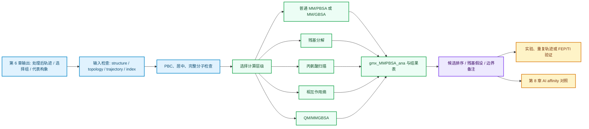

# 第 7 章 结合自由能与 MM/PBSA 计算

## 本章导读

第 6 章结束后，读者通常已经有处理过的 MD 轨迹、选择组、代表构象和若干结构分析结果。这些材料可以说明体系在某个时间窗口内怎样运动，却不能直接给出配体、蛋白界面或蛋白-核酸复合物的结合自由能。本章接着回答一个更靠近药物化学判断的问题：已有结构假设和轨迹后，怎样估算结合能趋势，怎样定位可能重要的残基，又怎样避免把近似计算写成实验亲和力。

本章主线工具是 `gmx_MMPBSA`。它把 GROMACS 轨迹、拓扑和 index 与 MMPBSA.py/AmberTools 连接起来，用 MM/PBSA 或 MM/GBSA 估算 complex、receptor 和 ligand 的能量差异。读者需要把结果当成同一流程下的相对比较和机制线索，而不是把 `FINAL_RESULTS_MMPBSA.dat` 里的数字直接写成真实 `Kd`、`IC50` 或体内活性。

本章的核心边界如下。

| 读者拿到什么 | 本章要做什么 | 本章不能推出什么 |
|:---|:---|:---|
| 处理后的 `md.xtc`、`md.tpr`、`topol.top` 和 `index.ndx` | 检查结构、拓扑、轨迹和选择组能否进入 MM/PBSA 或 MM/GBSA | 不能因为文件齐全就说明结果可靠 |
| `FINAL_RESULTS_MMPBSA.dat` 与 CSV | 读取总能量、分项能量、逐帧波动和平均值 | 不能跨靶点、跨力场或跨准备流程直接比较数值 |
| 残基分解与丙氨酸扫描结果 | 形成界面残基、口袋残基或突变实验的候选假设 | 不能单独证明残基功能或机制因果 |
| 相互作用熵与 QM/MMGBSA 设置 | 改善熵项或局部电子效应的近似处理 | 不能替代 FEP/TI、严格 QM/MM 或实验测定 |

## 学习目标

完成本章后，读者应能够：

- 解释 `ΔG_bind = ΔH - TΔS`、`ΔG_bind = RT ln(Kd)`、docking score、MM/PBSA、MM/GBSA、FEP 和 AI affinity score 各自回答的问题。
- 判断一个体系能否进入 `gmx_MMPBSA`：结构、拓扑、轨迹、index、配体参数、PBC 处理和力场信息是否齐全。
- 写出普通 MM/GBSA、残基分解、相互作用熵和 QM/MMGBSA 的基础 `mmpbsa.in` 结构。
- 对蛋白-小分子、蛋白-蛋白和蛋白-核酸复合物选择合理的分组和运行命令。
- 读取 `GGAS`、`GSOLV`、`TOTAL`、`VDWAALS`、`EEL`、`EGB`、`ESURF`、`Entropy` 和 `Binding` 等结果项。
- 用丙氨酸扫描和残基分解生成可验证的残基假设。
- 把 MM/PBSA 结果写成候选排序、相互作用线索或后续验证依据，不写成实验结论。

## 本章判断路径

下图把第 6 章轨迹输出接到本章自由能估算，再交给第 8 章 AI 亲和力预测对照。箭头表示工作依赖，不表示计算结果已经经过实验验证。



**图 7.1 从轨迹到结合能解释的判断路径。** 本章先检查输入，再选择计算层级，最后把结果写成可验证的排序或假设。任何一步出现结构不一致、分组错误、轨迹异常或参数缺失，都应回到第 6 章或体系准备阶段处理。

## 7.1 结合自由能概念与方法谱系

药物化学读者常把“打分更低”“亲和力更高”和“结合更稳定”混在一起使用。自由能计算需要先分清对象：docking score 是对接程序内部的排序量，MM/PBSA 和 MM/GBSA 是基于力场和连续溶剂模型的近似自由能估计，FEP/TI 是更严格但更昂贵的自由能路径方法，AI affinity score 则来自模型训练和输入表示。它们都可能参与候选筛选，但不能互相替代。

结合自由能常写成：

```text
ΔG_bind = ΔH - TΔS
ΔG_bind = RT ln(Kd)
```

素材中用这两个公式说明能量项和实验亲和常数之间的关系。`ΔH` 通常概括相互作用和溶剂化相关的焓项，`-TΔS` 表示熵贡献。`ΔG_bind` 越负通常对应越强结合，但这个关系只有在定义、单位、标准态和实验条件清楚时才有解释意义。

| 符号或输出 | 回答的问题 | 本章写作边界 |
|:---|:---|:---|
| `ΔG_bind` | 结合过程的自由能变化 | 只有在同一协议下才适合比较趋势 |
| `ΔH` | 相互作用和溶剂化等焓相关贡献 | 不等于单一氢键或单一残基贡献 |
| `TΔS` | 构象、平动、转动和溶剂等熵相关贡献 | 普通 MM/GBSA 输出若未计算熵项，不应写成完整自由能 |
| `Kd` | 实验平衡解离常数 | 不能由 docking score 或单次 MM/PBSA 直接得到 |

不同方法适合不同阶段。早期大规模筛选更看重速度和粗排序，先导优化更需要同系列候选的相对比较，机制解释则需要残基、构象和实验验证一起支撑。

| 方法 | 典型输入 | 主要用途 | 代价 | 不能直接说明什么 |
|:---|:---|:---|:---|:---|
| 分子对接 | 蛋白结构、配体构象、口袋定义 | 快速生成 pose 和粗排序 | 低 | 真实结合自由能、动力学稳定性 |
| QSAR/机器学习 | 分子描述符、已知活性数据 | 数据充足时预测同类化合物活性趋势 | 低到中 | 新骨架或新靶点外推可靠性 |
| MM/PBSA、MM/GBSA | MD 轨迹、拓扑、选择组 | 同一流程下候选重排序、能量项和残基线索 | 中 | 实验 `Kd`、机制因果、跨体系绝对比较 |
| FEP/RFEP/AFEP | 清晰热力学循环、严格采样和参数 | 相似配体相对自由能或单化合物绝对自由能 | 高 | 自动适用于所有体系 |
| AI affinity 模型 | 结构、序列、配体或复合物表示 | 快速预测或与物理方法对照 | 低到中 | 训练域外真实亲和力和实验机制 |

本章后续采用一个保守规则：MM/PBSA 和 MM/GBSA 结果主要用于同一靶点、同一准备流程、同一力场、同一时间窗口和同一参数文件下的相对比较。若这些条件不满足，结果应写成探索性线索，不能写成候选优劣的最终证据。

## 7.2 `gmx_MMPBSA` 简介与安装

GROMACS 轨迹本身记录的是原子坐标随时间变化。要把轨迹转成 MM/PBSA 或 MM/GBSA 估计，需要同时处理复合物、受体和配体的拓扑、坐标、选择组和帧集合。`gmx_MMPBSA` 的作用，是把 GROMACS 体系转换到 MMPBSA.py/AmberTools 可用的计算流程，并输出总能量、分项能量、残基分解、丙氨酸扫描和相互作用熵等结果。

素材把 `gmx_MMPBSA` 定位为一个面向 GROMACS 用户的桥接工具。它适合处理蛋白-小分子、蛋白-蛋白、蛋白-核酸等复合物，也能结合 `gmx_MMPBSA_ana` 重新打开已有结果进行图形化分析。它的优点是上手快、速度适中、结果可解释；边界是模型近似明显，不能替代 FEP/TI 或实验亲和力测定。

| 输入类型 | 常见文件 | 检查重点 |
|:---|:---|:---|
| 复合物结构 | `.tpr`、`.pdb` 或参考结构 | 受体和配体残基编号、链信息、坐标一致 |
| 轨迹 | `.xtc`、`.trr` 或多帧 `.pdb` | 已处理 PBC，分子完整，时间窗口合理 |
| 拓扑 | `topol.top` 及 include 文件 | 力场、配体参数、离子和水模型来源清楚 |
| 选择组 | `index.ndx` | `-cg` 两个组分别对应受体和配体或两条界面组分 |
| 参数文件 | `mmpbsa.in` | 方法、帧范围、溶剂模型、熵项和输出选项可复查 |

安装前先确认 Python、Conda、GROMACS、AmberTools、OpenMPI 和图形界面依赖。素材给出的安装路径可作为教学起点，但实际项目应把软件版本、命令来源和环境名称写进记录文件。

```bash
conda env create --file env.yml
conda activate gmxMMPBSA

gmx --version
python -m pip install gmx_MMPBSA

gmx_MMPBSA --help
gmx_MMPBSA_ana --help
gmx_MMPBSA_test
```

最低验证不要求先跑完整研究体系。更稳妥的做法，是先用 `gmx_MMPBSA_test` 或教学小体系确认命令、AmberTools 调用、MPI 和 GUI 能正常工作，再把真实项目轨迹接入。若测试失败，优先记录报错、环境、GROMACS 版本和 AmberTools 路径，而不是修改正文中的科学解释。

## 7.3 `gmx_MMPBSA` 参数文件

`mmpbsa.in` 是本章最重要的可复核对象。命令行说明输入来自哪里，参数文件说明怎样计算。读者在写结果时，不应只给出一个 `TOTAL` 数字，还要交代帧范围、间隔、溶剂模型、盐浓度、力场和是否计算熵项。

一个最小 MM/GBSA 参数文件可以分成 `&general` 和 `&gb` 两段。下面示例来自素材中的教学结构，具体帧范围和力场要按项目体系修改。

```text
&general
sys_name="Prot-Lig",
startframe=1,
endframe=100,
interval=1,
forcefields="leaprc.protein.ff14SB",
/

&gb
igb=5,
saltcon=0.150,
/
```

参数文件的第一层检查，是确认“算什么”和“用哪些帧”。第二层检查，是确认“这些设置能否和体系准备一致”。例如，含小分子体系需要配体拓扑和参数闭合；含核酸体系要确认核酸力场和离子处理；含金属或明显极化作用的体系不能简单依赖普通 MM/GBSA 给出强结论。

| 参数或段落 | 作用 | 写作时应交代 |
|:---|:---|:---|
| `sys_name` | 给结果标记体系名称 | 名称要能对应候选、靶点或复合物 |
| `startframe`、`endframe`、`interval` | 选择参与计算的帧 | 说明时间窗口来自第 6 章哪类分析 |
| `forcefields` | 指定 Amber 侧力场 | 不同力场结果不直接横向比较 |
| `igb` 或 PB 设置 | 选择隐式溶剂模型 | MM/PBSA 与 MM/GBSA 结果应分开报告 |
| `saltcon` | 设置盐浓度近似 | 不能把盐浓度参数写成真实缓冲液完全复现 |
| `&decomp` | 开启残基分解 | 结果支持残基线索，不证明机制 |
| `interaction_entropy` | 开启相互作用熵近似 | 需要说明温度、帧段和波动情况 |
| `ifqnt`、`qm_theory`、`qm_residues` | 开启 QM/MMGBSA | 需要说明 QM 区域和半经验方法边界 |

参数文件不宜反复手工改名后散落在目录中。教学项目可以把普通 MM/GBSA、残基分解、相互作用熵和 QM/MMGBSA 分成四个示例目录，每个目录保留 `mmpbsa.in`、命令、日志、输出表和简短说明。这样读者才能复查一个结论来自哪套设置。

## 7.4 蛋白-小分子计算

蛋白-小分子是本章最适合作为主案例的体系。第 4 章可以给出 docking pose，第 5 章可以生成 MD 轨迹，第 6 章可以选择稳定时间窗口或代表构象。本节的任务，是在这些输入基础上估算同一靶点下候选配体的结合能趋势，并查看能量项是否支持已有相互作用假设。

运行前先做三件事：处理 PBC，确认配体没有飞出或断裂，建立受体和配体选择组。素材给出的 `-cg 1 13` 是示例组号，不是通用写法。实际项目必须打开 `index.ndx` 或 `make_ndx` 输出，确认两个数字对应正确组。

| 步骤 | 示例命令或文件 | 检查点 |
|:---|:---|:---|
| 处理 PBC | `gmx trjconv -pbc mol -center` | 复合物居中，配体连续，分子未被盒子切开 |
| 建立 index | `gmx make_ndx -f md.tpr -o index.ndx` | 受体组和配体组名称清楚 |
| 检查拓扑 | `topol.top`、配体 include 文件 | 配体参数完整，电荷和原子类型可追踪 |
| 选择帧 | `startframe`、`endframe`、`interval` | 帧窗口来自 RMSD、距离或聚类判断 |
| 运行计算 | `gmx_MMPBSA` | 输出 `.dat`、`.csv`、日志和参数文件一并保存 |

一个蛋白-小分子教学命令可以写成下面形式。换行只是为了阅读方便，实际运行时可按本机 shell 习惯调整。

```bash
gmx trjconv \
  -s md.tpr \
  -f md.xtc \
  -o md_noPBC.xtc \
  -pbc mol \
  -center

gmx make_ndx \
  -f md.tpr \
  -o index.ndx

gmx_MMPBSA \
  -O \
  -i mmpbsa.in \
  -cs md.tpr \
  -ct md_noPBC.xtc \
  -ci index.ndx \
  -cg 1 13 \
  -cp topol.top \
  -o FINAL_RESULTS_MMPBSA.dat \
  -eo FINAL_RESULTS_MMPBSA.csv
```

解释结果时，先确认运行是否完成，再看 `DELTA TOTAL` 或 `Binding` 的平均值和波动范围。若某个候选的均值更负，但逐帧波动很大、配体在轨迹后段离开口袋，或 PBC 处理存在问题，这个候选不能简单排在前面。

| 观察到的情况 | 允许的解释 | 下一步 |
|:---|:---|:---|
| 同一流程下候选 A 的平均值更负 | A 在该近似模型下可能更有利 | 查看误差、逐帧曲线和 pose 稳定性 |
| `VDWAALS` 占主要有利项 | 疏水或形状互补可能贡献较大 | 回看口袋接触、SASA 和残基分解 |
| `EEL` 有利但 `EGB` 或 `GSOLV` 抵消明显 | 静电相互作用可能伴随去溶剂化代价 | 查看盐桥、氢键和溶剂暴露 |
| 逐帧能量突变 | 可能存在异常帧、构象跳变或处理问题 | 回到轨迹检查和可视化 |

蛋白-小分子 MM/PBSA 结果最适合写成“同一计算流程下的候选重排序线索”。它不能单独证明真实亲和力，也不能把某个 docking pose 变成实验构象。若要支持先导优化决策，至少还需要重复轨迹、结构复查、合成可行性、ADMET 风险和实验测定配合。

## 7.5 蛋白-蛋白相互作用计算

蛋白-蛋白体系比蛋白-小分子更依赖界面定义。一个 PPI 复合物可能有多个接触面、柔性环区和水介导相互作用。MM/PBSA 可以提供界面稳定性和热点残基线索，但不能单独证明细胞内相互作用、调控机制或功能后果。

素材中的蛋白-蛋白示例先处理 PBC，再用 residue 范围创建两个蛋白组。下面命令只展示思路，残基编号必须按具体结构修改。

```bash
gmx trjconv \
  -s md.tpr \
  -f md.xtc \
  -o md_noPBC.xtc \
  -pbc mol \
  -center

gmx make_ndx \
  -f md.tpr \
  -o index.ndx
```

在 `make_ndx` 交互中，可以用 residue 范围生成两个界面组。素材示例把 `r 1-103` 和 `r 104-217` 分成 `Protein_A` 与 `Protein_B`，实际体系要按链、残基编号和结构文件检查。

| index 任务 | 示例操作 | 检查点 |
|:---|:---|:---|
| 定义第一条蛋白或结构域 | `r 1-103` 后与 protein 组取交集 | 组内不应包含水、离子或另一条链 |
| 定义第二条蛋白或结构域 | `r 104-217` 后与 protein 组取交集 | 残基范围和链信息一致 |
| 命名分组 | `name 18 Protein_A`、`name 20 Protein_B` | 名称能回到结构图和结果表 |
| 传入 `-cg` | `-cg 18 20` | 两个数字顺序与 receptor/ligand 解释一致 |

蛋白-蛋白普通 MM/GBSA 参数文件可从素材示例开始：

```text
&general
sys_name="Prot-Prot",
startframe=1,
endframe=100,
interval=1,
forcefields="leaprc.protein.ff14SB",
/

&gb
igb=2,
saltcon=0.150,
/
```

运行命令可写成：

```bash
gmx_MMPBSA \
  -O \
  -i mmpbsa.in \
  -cs md.tpr \
  -ct md_noPBC.xtc \
  -ci index.ndx \
  -cg 18 20 \
  -cp topol.top \
  -o FINAL_RESULTS_MMPBSA.dat \
  -eo FINAL_RESULTS_MMPBSA.csv
```

PPI 结果解释时，不能只看总能量。界面面积、接触残基、盐桥、氢键、构象漂移和残基分解都要一起看。若界面在轨迹中明显松散，MM/PBSA 给出的平均值更像是该时间窗口的诊断信号，而不是稳态复合物的结合自由能。

## 7.6 蛋白-核酸计算

蛋白-核酸复合物常见于转录因子、核酸酶、RNA 结合蛋白和基因调控相关靶点。与小分子相比，核酸体系更容易受链编号、离子、磷酸骨架电荷和构象变化影响。进入 MM/PBSA 前，需要先确认核酸链没有断裂，离子处理与力场设置清楚，protein 和 nucleic acid 分组不混杂。

素材给出的蛋白-核酸示例与 PPI 类似，也需要先处理 PBC、创建 index，再把两个分组传给 `-cg`。示例组号 `1 3` 只说明命令结构，不代表具体项目分组。

```bash
gmx_MMPBSA \
  -O \
  -i mmpbsa.in \
  -cs md.tpr \
  -ct md_noPBC.xtc \
  -ci index.ndx \
  -cg 1 3 \
  -cp topol.top \
  -o FINAL_RESULTS_MMPBSA.dat \
  -eo FINAL_RESULTS_MMPBSA.csv
```

较大的体系可以使用 MPI 并行，但进程数要根据帧数、内存和 AmberTools 调用成本选择。素材中出现高并行示例，教材正文只保留“可并行、需记录资源”的原则，避免把某个进程数写成通用推荐。

| 检查项 | 为什么重要 | 不通过时怎么办 |
|:---|:---|:---|
| 核酸链和残基编号 | 结果需要回到具体碱基或骨架位置 | 回到结构准备或 index 创建 |
| 离子和盐浓度 | 蛋白-核酸静电项对环境敏感 | 记录参数，避免强比较 |
| PBC 和分子完整性 | 分子被切开会污染能量估计 | 重新处理轨迹并可视化检查 |
| 力场和拓扑 | 核酸参数错误会影响所有能量项 | 回到体系构建阶段 |
| 逐帧波动 | 构象漂移会改变界面解释 | 缩小时间窗口或分状态分析 |

蛋白-核酸 MM/PBSA 适合回答“这个时间窗口内界面相互作用是否稳定、哪些碱基或残基可能参与贡献”。它不能单独证明序列特异性、转录调控效应或细胞表型。

## 7.7 结果分析与 `gmx_MMPBSA_ana`

`gmx_MMPBSA` 运行结束后，正文不应只摘录一行总能量。结果解释至少包含三层：总结合能是否合理，分项能量是否指向可解释相互作用，逐帧曲线是否暴露异常。`gmx_MMPBSA_ana` 可以重新打开已有结果进行图形化分析，不需要重新计算。

结果文件和常见用途如下。

| 文件或工具 | 主要内容 | 用途 |
|:---|:---|:---|
| `FINAL_RESULTS_MMPBSA.dat` | 文本格式总能量和分项能量 | 适合人工阅读和报告摘录 |
| `FINAL_RESULTS_MMPBSA.csv` | 表格格式逐项结果 | 适合排序、作图和统计 |
| `FINAL_DECOMP_MMPBSA.dat` | 文本格式残基分解 | 适合检查重点残基 |
| `FINAL_DECOMP_MMPBSA.csv` | 表格格式残基分解 | 适合批量筛选和作图 |
| `gmx_MMPBSA_ana` | 图形化打开已有结果 | 适合查看曲线、分项和残基贡献 |

能量项要按层级阅读。先看 complex、receptor、ligand 和 delta 的关系，再看气相项、溶剂化项和总项。若某个分项贡献很大，应该回到结构图和轨迹检查，而不是直接给出机制结论。

| 结果项 | 含义 | 解释边界 |
|:---|:---|:---|
| `GGAS` | 气相相关能量总项 | 通常包含范德华和静电等项 |
| `GSOLV` | 溶剂化相关能量总项 | 隐式溶剂近似，不等于显式水全部效应 |
| `VDWAALS` | 范德华相互作用 | 可提示疏水接触或形状互补 |
| `EEL` | 静电相互作用 | 需和去溶剂化代价一起看 |
| `EGB` 或 PB 相关项 | 极性溶剂化贡献 | 不同模型不可直接混作一组 |
| `ESURF` | 非极性溶剂化相关项 | 反映近似表面积贡献 |
| `TOTAL` 或 `Binding` | 多项合并后的结合能估计 | 只适合在同一协议下比较趋势 |
| `Entropy` 或 `-TAS` | 熵近似贡献 | 未计算时不能假装完整 |

一个可靠的结果段落可以按下面顺序写：先说明输入帧范围和参数文件；再报告同一流程下候选之间的相对趋势；接着解释主要能量项和逐帧波动；最后写明这些结果只能支持候选排序或相互作用线索，需要实验、重复轨迹或更严格自由能方法验证。

## 7.8 丙氨酸扫描

丙氨酸扫描把界面或口袋残基虚拟突变为 alanine，再比较突变前后的结合自由能估计。它的核心问题不是“真实突变实验已经发生”，而是“如果去掉某个侧链的大部分特征，这个模型下的结合能会怎样变化”。这适合生成热点残基候选。

素材给出的常用定义是：

```text
ΔΔG = ΔG_mutant - ΔG_wildtype
```

若 `ΔΔG > 0`，说明突变后结合变差，野生型残基在该模型下对结合有利；若 `ΔΔG < 0`，说明突变后结合反而更有利，原残基可能带来不利贡献或当前构象不适合该相互作用解释。阈值只能作为经验筛选，不应写成实验判定标准。

| `ΔΔG` 范围 | 素材中的解释方式 | 教材中的写法 |
|:---|:---|:---|
| `> 4 kcal/mol` | 强热点 | 可列为优先验证热点 |
| `2-4 kcal/mol` | 热点 | 可列为候选关键残基 |
| `< 2 kcal/mol` | 非热点或弱贡献 | 不宜单独强调 |
| `< 0 kcal/mol` | 突变可能改善结合 | 检查构象、分组和相互作用解释 |

丙氨酸扫描适合和残基分解一起使用。若某个残基在分解中贡献明显，丙氨酸扫描也显示较高 `ΔΔG`，它可以成为突变实验、结构复查或分子设计的候选点。若两者不一致，应优先回看轨迹稳定性、侧链构象和采样窗口。

| 结果组合 | 可能含义 | 下一步 |
|:---|:---|:---|
| 分解贡献高，`ΔΔG` 高 | 残基可能是界面热点 | 设计突变或重复轨迹验证 |
| 分解贡献高，`ΔΔG` 低 | 主链或环境项可能影响解释 | 查看 BDC/SDC 和结构图 |
| 分解贡献低，`ΔΔG` 高 | 突变可能引起局部重排 | 检查突变模型和采样 |
| 两者都弱 | 暂不作为重点残基 | 保留为低优先级 |

正文中应使用“虚拟丙氨酸扫描提示”“模型下可能贡献较大”等表述。不能写成“该残基已经得到真实突变结果支持”，除非另有真实突变、结合实验或结构证据。

## 7.9 残基能量分解

残基分解回答的问题更细：总结合能来自哪些残基或哪些主链、侧链贡献。它适合把一个能量排序结果转成可检查的结构假设，例如某个口袋残基是否主要通过侧链疏水接触贡献，某个界面位置是否主要来自主链氢键。

素材给出的残基分解参数包含 `idecomp=2`、`dec_verbose=3` 和 `print_res="within 4"`。这表示按残基输出更详细结果，并限制在界面附近的残基范围。距离阈值要按体系和教学目标确认。

```text
&decomp
idecomp=2,
dec_verbose=3,
print_res="within 4",
/
```

运行时需要额外输出分解结果文件：

```bash
gmx_MMPBSA \
  -O \
  -i mmpbsa.in \
  -cs md.tpr \
  -ct md_noPBC.xtc \
  -ci index.ndx \
  -cg 1 13 \
  -cp topol.top \
  -o FINAL_RESULTS_MMPBSA.dat \
  -eo FINAL_RESULTS_MMPBSA.csv \
  -do FINAL_DECOMP_MMPBSA.dat \
  -deo FINAL_DECOMP_MMPBSA.csv
```

素材中强调 `TDC = BDC + SDC`。读者应先看 `TDC`，判断某个残基总体贡献；再看 `BDC` 和 `SDC`，区分贡献主要来自主链还是侧链。

| 项目 | 含义 | 判断方式 |
|:---|:---|:---|
| `TDC` | Total decomposition contribution | 残基总体贡献，先看这一列 |
| `BDC` | Backbone decomposition contribution | 主链贡献，可能对应主链氢键或骨架接触 |
| `SDC` | Sidechain decomposition contribution | 侧链贡献，可能对应疏水、盐桥或侧链氢键 |
| `TDC` 高、`SDC` 高 | 侧链可能是主要贡献来源 | 回看侧链相互作用 |
| `TDC` 高、`SDC` 低 | 主链或环境项可能更重要 | 回看主链接触和构象稳定性 |

残基分解结果最好和结构图放在一起读。表格能提示“看哪里”，结构图回答“这个贡献是否有合理接触”。若残基贡献很高但结构上没有稳定接触，优先检查 index、分组、轨迹帧、PBC 和参数文件。

下面是正文中适合使用的结果表结构。没有真实教学数据包前，表格只作为模板，不填入虚构数值。

| 残基 | `TDC` | `BDC` | `SDC` | 结构观察 | 解释边界 |
|:---|---:|---:|---:|:---|:---|
| 待填 | 待填 | 待填 | 待填 | 是否靠近配体或界面 | 候选残基，需验证 |

## 7.10 相互作用熵与 QM/MMGBSA

普通 MM/GBSA 输出常以焓相关项为主。若正文写成完整 `ΔG_bind = ΔH - TΔS`，就必须说明熵项怎样处理。素材比较了 interaction entropy、normal mode 和 quasi-harmonic 三类思路：interaction entropy 较快，normal mode 代价高，quasi-harmonic 介于两者之间。教学中应先说明近似层级，再报告结果。

| 熵处理方式 | 素材中的定位 | 使用边界 |
|:---|:---|:---|
| Interaction entropy | 快速、相对易用 | 对能量波动敏感，需要检查帧段 |
| Normal mode | 较慢，计算成本高 | 小体系或少量帧更现实 |
| Quasi-harmonic | 中等成本，依赖轨迹采样 | 对轨迹长度和构象覆盖敏感 |

开启 interaction entropy 时，参数文件可加入：

```text
&general
interaction_entropy=1,
ie_segment=50,
temperature=298.15,
/
```

`ie_segment` 和 `temperature` 不能随意省略。前者决定用于熵估计的片段，后者影响 `TΔS` 相关项。若体系逐帧能量波动很大，interaction entropy 结果应写成“该时间窗口下的近似修正”，不能写成可靠的绝对熵贡献。

QM/MMGBSA 处理的是另一个问题：普通 MM 力场没有显式电子，难以描述成键、断键、强极化、电荷转移或复杂金属配位。素材把 QM/MMGBSA 作为在局部区域引入 QM 描述的扩展方法，常见半经验方法包括 PM3、AM1 和 DFTB。

| 何时考虑 QM/MMGBSA | 为什么普通 MM/GBSA 可能不够 | 仍需注意什么 |
|:---|:---|:---|
| 活性位点有金属配位 | 固定电荷和经典参数可能不足 | 金属参数、QM 区域和验证证据 |
| 配体或残基强极化 | MM 力场不显式处理电子响应 | QM 方法级别和计算成本 |
| 普通 MM/GBSA 排序与实验冲突 | 能量项近似可能错过局部电子效应 | 先排除采样和参数问题 |
| 涉及反应或成键变化 | MM/GBSA 不描述化学反应路径 | 可能需要直接 QM/MM 或 QM cluster |

素材给出的 QM/MMGBSA 示例在 `&gb` 中加入 `ifqnt=1`、`qm_theory=PM3` 和 `qm_residues="within 4"`。这类设置必须说明 QM 区域如何定义，不能只报告最终能量。

```text
&gb
igb=1,
saltcon=0.150,
ifqnt=1,
qm_theory=PM3,
qm_residues="within 4",
/
```

QM/MMGBSA 不等于“结果一定更真实”。它提高了局部电子描述的复杂度，也带来 QM 区域选择、半经验方法适用性和计算成本问题。正文可以写“用于检查普通 MM/GBSA 难以处理的局部相互作用”，不能写成对实验亲和力的替代。

## 7.11 Uni-GBSA 与高通量扩展

当候选规模扩大到成百上千，逐个手工运行 `gmx_MMPBSA` 不再适合教学或项目管理。这时需要批处理、manifest、统一参数和自动汇总表。第 7 章大纲保留 Uni-GBSA 作为高通量扩展入口，但当前已读取素材未提供足够的 Uni-GBSA 安装、命令、参数和输出示例。因此，本节只写可确认的工作台原则，不写软件性能或具体用法结论。

高通量亲和力估算最容易出错的地方不是“命令不够自动”，而是不同候选的输入不一致。只要 pose 来源、配体参数、时间窗口、力场或溶剂模型不同，排序表就可能混入准备流程差异。

| 高通量字段 | 为什么要记录 | 不记录的风险 |
|:---|:---|:---|
| `candidate_id` | 连接分子、结构、轨迹和结果 | 无法追踪某个数值来自哪个候选 |
| `pose_source` | 区分 docking、MD 代表帧或实验结构 | pose 差异被误写成能量差异 |
| `topology_source` | 记录配体参数和力场 | 参数错误会污染排序 |
| `frame_window` | 说明参与计算的轨迹区间 | 不同采样窗口直接混比 |
| `mmpbsa_in` | 锁定计算参数 | 批次之间不可复现 |
| `result_file` | 连接原始输出和汇总表 | 无法复查异常值 |
| `claim_level` | 限定结果用途 | 探索性线索被写成结论 |

一个适合课程工作台的流程，是先建立候选 manifest，再批量检查输入文件是否齐全，随后运行计算，最后生成 summary TSV。排序表中应至少包含候选编号、平均 `TOTAL`、误差或标准差、主要能量项、异常标记、输入路径和参数文件路径。


**图 7.2 高通量扩展的最低记录链。** 这个流程图强调可追踪性。自动化脚本可以提高速度，但不能降低输入一致性、参数记录和结果边界要求。

Uni-GBSA 需要作者后续补充软件来源、正式文档、引用信息、最小命令、输入格式、输出字段和一个可公开的教学示例。补齐前，正文只能把它作为“与 `gmx_MMPBSA` 相邻的高通量 GBSA 扩展方向”，不能写成已验证的课程主流程。

## 本章交接清单

第 7 章的最终交付不是一个自由能数字，而是一组可复查材料：输入文件、参数文件、命令、日志、结果表、残基解释和 claim 边界。只有这些材料齐全，后续第 8 章才能把物理近似结果与 AI affinity 模型输出进行公平对照。

| 交付物 | 交给谁使用 | 必须附带的边界 |
|:---|:---|:---|
| 普通 MM/PBSA 或 MM/GBSA 结果 | 候选排序与第 8 章对照 | 同一流程下的相对趋势 |
| 逐帧曲线与误差 | 轨迹质量复查 | 波动大时不做强排序 |
| 残基分解表 | 结构解释和突变设计 | 候选残基，不是机制证明 |
| 丙氨酸扫描表 | 热点假设和实验设计 | 虚拟突变，不是实验突变 |
| Interaction entropy 或 QM/MMGBSA 输出 | 近似修正和局部效应检查 | 需说明参数、区域和方法级别 |
| 高通量 summary TSV | 工作台筛选和批量复查 | 输入一致性优先于排序美观 |
