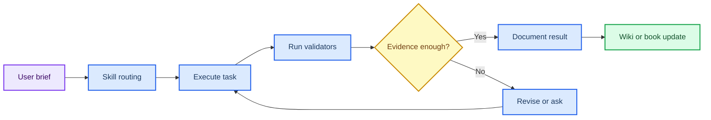

# 第 7 章 VibeCoding、Claude Code 与 AI Agent 工作流

## 本章导读

AI Agent 工作流的关键不在于让模型多做事，而在于把任务说明、上下文读取、工具执行、验证和知识沉淀连接成可审计闭环。没有这个闭环，Agent 的回答很难区分为事实、推断、计划还是未验证输出。

本章围绕 brief、source loading、plan、execute、validate 和 write-back 组织操作流程。读者需要学会把每次 Agent 工作写成任务卡：它读了什么、改了什么、如何验证、哪些输出进入知识库、哪些仍需人工确认。

前 6 章提供药物设计任务对象，第 7 章提供把这些任务交给 Codex 或其他 Agent 的操作规范。它不替代专业判断，而是帮助读者把资料整理、代码 dry-run、引用复核和章节更新做成可追踪流程。

Agent 工作流尤其需要区分“生成了答案”和“完成了可验证任务”。读者应把模型输出看作一个需要验收的中间对象，只有当来源、diff、命令和未确认项都清楚时，输出才适合进入项目文件。

## 学习目标

本章目标是把 AI Agent 用作可控研究助手，而不是把模型回答当作事实来源。完成本章后，读者应能够：

- 能写出包含目标、范围、禁止事项和验收标准的 Agent 任务说明。
- 能要求 Agent 先读索引、映射、来源和 schema，再执行修改。
- 能区分聊天回答、文件变更、测试输出和维护报告的证据等级。
- 能把可复用流程沉淀为 skill、脚本或资源页。

这些目标决定 Agent 输出能否进入知识库。只有 brief、读取范围、执行日志、验证命令和写回位置清楚时，Agent 才能服务研究记录。

## 知识图谱入口

本章图谱连接项目协议、技能、工具调用、验证脚本和维护记录。它定义的是 Agent 如何可靠地参与知识库工作。

在线书籍页面只引用整理后的 wiki、方法卡、文献笔记和资源页，不直接嵌入原始 PDF 或课件图表；在AI Agent 工作流中，这一点应具体落到brief、执行日志和验收命令。需要追溯来源时，应回到 `book/book_map.toml`、章节精读笔记和相关 Zotero/BibTeX 记录；在AI Agent 工作流中，这一点应具体落到brief、执行日志和验收命令。

| 来源类型 | 路径 |
|:---|:---|
| 章节来源 | `01_课程章节索引/章节精读/第07章_VibeCoding与ClaudeCode精读.md` |
| 方法来源 | `00_项目说明/LLM Wiki运行手册.md`<br>`00_项目说明/插件与Skills调用说明.md` |
| 工作台来源 | `07_研究工作台/AI回归评测集.md` |

### Imagegen 知识图谱

{ loading=lazy }

**图7.1 AI Agent 工作流知识图谱。** 本图为 Imagegen 生成的教学示意图，用中心概念和编号节点概括AI Agent 工作流的对象、方法入口、记录字段和证据边界；编号用于正文定位，不承载精确参数或运行结果，术语解释和判断口径以正文表格为准。 节点编号：1=任务说明；2=读取来源；3=制定计划；4=工具执行；5=验证；6=评审；7=沉淀知识。

### Mermaid 结构图



**图7.2 Agent 说明-执行-验证闭环结构图。** 本图为 Mermaid 教学示意图，展示任务说明、执行、控制、验证、沉淀和回滚判断之间的闭环关系；箭头表示阅读和记录依赖，不替代真实软件运行或实验验证，具体输入、输出和 QC 标准以正文为准。

AI Agent 工作流的 Mermaid 源图和后续 scientific-schematics prompt 见 [Mermaid 图示与示意图设计](../resources/mermaid-schematics.md)。

## 核心概念

AI Agent 工作流的核心概念围绕“说明是否明确、执行是否可审计、验证是否独立”展开。它们决定模型输出能否写回项目。

| 概念 | 教材化定义 |
|:---|:---|
| 任务说明 | 任务说明必须包含目标、范围、输入、禁止事项和验收标准。 |
| 来源读取 | Agent 在写入前应读取 `index.md`、目录 `_index.md`、`book_map.toml` 和相关章节。 |
| 执行控制 | 修改应限定在任务相关文件内，避免无关重构和原始资料移动。 |
| 验证闭环 | 测试、构建、wiki 校验和图谱体检共同构成验收证据。 |
| 知识沉淀 | 长期可复用的流程应写入脚本、skill、资源页或维护报告。 |

使用概念表时，应先检查 brief 是否给出目标、范围和禁止事项，再检查 Agent 是否读取了正确来源。没有来源读取和验证命令的回答，应保留为草稿或建议。

这些概念形成控制链：任务说明限定范围，执行日志记录动作，验证命令判断结果，写回规则决定哪些内容进入 wiki 或在线教材。任何一步缺失，都应阻止输出直接升级为项目结论。

例如，brief 不清会导致 Agent 修改范围漂移；读取来源不足会导致回答凭空补全；没有验证命令会让成功状态只依赖模型自述。概念表中的每一项都对应一个控制点。

对于教材项目，Agent 的价值还体现在保持规则一致。比如报告不进入在线教材、原始素材不上传、引用区不显示内部 key，这些都应写入 brief 或项目规则，而不是依赖模型临场记忆。

## 方法流程

本章流程从任务说明开始，到验证和沉淀结束。它强调每次 Agent 操作都要留下可复查路径，而不是只保留最终回答。

| 步骤 | 输入 | 动作 | 输出 | QC/边界 |
|:---:|:---|:---|:---|:---|
| 1 | 任务说明 | 明确目标、范围、禁止事项和验收标准。 | 可执行 brief。 | 不会误改 raw sources。 |
| 2 | 来源读取 | 读取索引、映射、schema 和相关正文。 | 上下文清单。 | 不凭记忆猜结构。 |
| 3 | 计划 | 列出文件范围、保护对象和验证命令。 | 实施计划。 | 关键风险已识别。 |
| 4 | 执行 | 按最小必要范围写入。 | 文件变更。 | 引用、路径和 token 保留。 |
| 5 | 验证 | 运行测试、构建和 wiki 体检。 | 验证输出。 | 失败项有定位。 |
| 6 | 沉淀 | 更新日志、报告和复用入口。 | 维护记录。 | 后续 Agent 可接续。 |

执行时先让 Agent 完成小范围任务，例如检查一章链接或生成一个 dry-run 表，再扩大到批量重写。小任务可以暴露上下文遗漏、工具失败、路径错误和过度修改。

写作时应记录 brief、读取来源、变更范围、验证命令和未确认项。这样形成的 Agent 记录可以被后续维护者复查，也能避免把模型推断误写成项目事实。

执行 Agent 任务时，应优先选择可被命令验证的小任务。比如检查断链、更新引用区或审计章节重复句，都比“全面优化教材”更容易确认成败。小任务通过后，再把规则沉淀为下一轮可复用流程。

如果任务涉及写文件，读者还应先定义“不改什么”。例如不改原始素材、不重命名图片、不重写引用块、不移动报告目录。负面边界越清楚，Agent 越容易做出可审查的窄范围修改。

## 代码案例与软件操作

{ loading=lazy }

**图7.3 Agent 说明-执行-控制-验证-沉淀闭环图。** 本图为 Imagegen 生成的流程图，说明 Agent 工作流从指令到验证沉淀的操作顺序；它用于说明操作顺序、关键节点和记录交接位置，不代表实验结果，具体命令、参数和边界判断以正文代码块与步骤表为准。 流程编号：1=brief；2=read；3=plan；4=execute；5=validate；6=write-back。

本节用于训练 **7 章 VibeCoding、Claude Code 与 AI Agent 工作流** 的最小复现意识。该示例是在线书籍更新后的最小验证闭环；真实任务应根据影响面增加专门测试。

=== "可复制代码"

    ```powershell
    $ErrorActionPreference = 'Stop'
    python tools/validate_online_book.py --map book/book_map.toml --book-root book/docs --require-nature-refs --require-imagegen
    python tools/graph_health.py . --json --stale-days 180 | Out-File book/docs/resources/latest-graph-health.json
    python -m unittest discover -s tests
    ```

=== "配套文件"

    完整示例文件：[`chapter-07-agent-validation.ps1`](../assets/code/chapter-07-agent-validation.ps1)

{ loading=lazy }

**图7.4 Agent 验证 dry-run 软件操作截图。** 本图为本地 dry-run 截图，展示 Agent dry-run 中的命令输出、验证结果和记录入口；截图用于说明界面、文件或表格位置，不代表实验结果，读者应按本机路径替换参数并以正文操作表为准。

| 步骤 | 操作 |
|:---:|:---|
| 1 | 给出明确目标、边界和禁止事项。 |
| 2 | 让 Agent 先读索引、映射和相关章节。 |
| 3 | 要求输出验证命令、失败项和后续沉淀位置。 |

### 教材化阅读提示

本节代码应作为在线书籍更新后的最小验证闭环的可复查样例来读。它展示的是如何把AI Agent 工作流中的一次小任务写成可复制、可失败、可追溯的记录，而不是声明已经完成真实研究运行。

替换参数时，应先替换与AI Agent 工作流直接相关的输入路径，再调整会影响解释的阈值、空间范围或模型参数。如果AI Agent 工作流的最小样例尚不能解释输出来源，就不应扩大到批量任务。

解读输出时，只记录代码确实生成的对象，例如 manifest、配置、dry-run 表格、截图或日志；在AI Agent 工作流中，这一点应具体落到brief、执行日志和验收命令。这些对象可以支持brief、执行日志和验收命令的整理，但不能自动升级为实验结论；需要形成研究判断时，仍要回到实验记录模板补齐输入、QC、人工复核和待验证项。
## 关键文献

文献使用说明：本章当前以项目运行规范、Codex skills 调用矩阵和 AI 回归评测集为主要来源，暂不设置正式关键文献。后续若加入 Agent 工程、RAG 评测或软件工程文献，应先进入 references/ 并明确其支撑的是工作流设计还是验证方法。

<!-- refs:start -->

本章暂无正式关键文献列表。它承担运行规范、项目目录和可复现记录的基础训练；正式 SCI 文献锚点在后续章节中展开。

<!-- refs:end -->

## 实验/练习入口

本章练习的重点是把AI Agent 工作流转化成可交接记录。练习完成后，读者应能让另一个人根据记录复现从 brief 到验收报告的 Agent 协作流程，并判断是否具备进入第 8 章研究工作台的条件。

建议按以下顺序完成：

1. 把一个宽泛需求改写成包含范围、禁止事项和验收标准的 Agent brief。
2. 为一次章节更新列出必须读取的 5 个来源文件。
3. 设计一个 AI 回归评测问题，要求答案包含路径、关键文献条目、边界和待确认项。

完成练习后，应检查记录中是否包含brief、执行日志和验收命令、失败原因和人工判断。缺少brief、执行日志和验收命令时，相关内容仍适合作为课堂尝试，不适合写入正式研究结论。

如果练习借用了文献案例或课程范文，应在AI Agent 工作流记录中明确它只是方法参照或边界样例。在AI Agent 工作流中，文献案例可以启发流程设计，但不能替代本项目的本地运行结果。

## 使用边界与常见误读

本章最容易被误读的是 Agent 回答、自动修改和“验证通过”。它们都需要对应到来源、diff 和独立检查。

本章使用边界表时，应把 Agent 输出默认放在草稿层，再根据来源、diff 和验证结果决定是否写回。

| 易误读对象 | 稳健表述 | 写作处理 |
|:---|:---|:---|
| Agent 回答 | 是工作产物线索。 | 不能替代文件、引用、测试和维护记录。 |
| 自动修改 | 适合结构化和可验证任务。 | 原始资料移动、文献结论新增和实验解释需人工确认。 |
| 验证通过 | 说明机械一致性达标。 | 不自动保证科学判断完整。 |
| skill | 封装稳定流程。 | 不应把项目特有事实写成通用规则。 |

Agent 输出的证据边界应停在它实际读取和验证过的材料。模型没有读取的文件、没有运行的命令、没有访问的文献，都不能被写成已确认事实。

稳健写法是“本次 Agent 根据指定来源生成了草稿，并通过某项校验”，而不是“AI 已确认该内容正确”。高风险科学判断仍需文献、实验或人工专业复核。

本章使用边界表时，应把 Agent 输出默认放在草稿层。只有经过源码 diff、测试、构建或人工审阅后，输出才可以升级为项目记录。涉及科学结论时，还需要文献或实验层面的独立依据。

验证通过也要说明验证范围。单元测试通过不等于内容正确，MkDocs 构建成功不等于科学边界无误，链接可解析不等于引用已人工读过。不同验证只能支持不同层级的判断。

## 延伸阅读与下一步

完成本章后，应把 Agent 工作流用于前后章节的维护，而不是把它当作独立技巧。推荐路径如下：

1. 为第 3/5/6/8 章高风险任务编写 brief，明确 score、affinity、design 和文献案例边界。
2. 每次修改后保存执行日志、验证命令和未确认项。
3. 将稳定规则沉淀到项目说明或 Codex skill 调用矩阵，避免下一轮重新约定。

读者完成本章后，应能为下一次教材更新写出可执行 brief：修改目标、允许范围、禁止事项、验证命令和报告位置。这样的 brief 可以直接服务后续文献复核、真实小样本运行或图示更新。若任务没有明确验收标准，应先拆分，而不是让 Agent 一次性处理全部项目。

下一轮使用 Agent 时，建议把任务拆成“审稿、改写、验证、记录”四个阶段。审稿阶段只产生问题和优先级，改写阶段才修改文件，验证阶段运行命令，记录阶段更新日志和报告。这样的顺序能减少半成品直接进入仓库的风险，也便于多人协作。

对于当前在线教材，Agent 最适合承担机械一致性和初稿重排；涉及文献结论、实验解释和公开发布判断时，仍需要研究者完成最终审阅。

这一步也能帮助读者区分自动化效率和学术责任：前者可以由 Agent 加速，后者必须由研究者确认。
