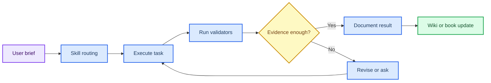

# 第 7 章 VibeCoding、Claude Code 与 AI Agent 工作流

## 本章导读

AI Agent 可以加速整理、编码和验证，但如果没有任务边界、来源路径和验收命令，输出很难被审查。 AI Agent 工作流中的关键问题不是单个命令或界面能够解决的，而是贯穿输入选择、参数设置、结果解释和后续写作的判断问题。读者进入AI Agent 工作流时，应先把自己放在真实研究任务中：如果明天需要把这一步交给同组同学复核，哪些信息必须留下，哪些说法必须谨慎。

本章把 Agent 工作流拆成说明、读取、计划、执行、验证和知识沉淀六个环节。 AI Agent 工作流采用教材讲解写法，不把内容压缩成术语表，而是把概念放回它服务的任务场景中解释。读者在AI Agent 工作流中需要关注的不是“记住一个名词”，而是理解它如何限制输入、影响输出、进入质量控制，并支持相应层级的写作判断。

学习AI Agent 工作流时，建议先通读核心概念，再回到方法流程表逐步核对。表格用于快速定位输入、动作、输出和 QC，正文段落则解释为什么这些字段不能省略；在AI Agent 工作流中，这一点应具体落到brief、执行日志和验收命令。AI Agent 工作流采用这样的顺序，能避免只会照着流程执行却不知道哪一步决定结果可信度。

所有后续章节更新、研究工作台维护和在线书籍发布都应复用本章的验证闭环。 因此，AI Agent 工作流不是孤立的工具说明，而是后续章节继续工作的接口层。读者完成AI Agent 工作流后，应能把本章记录方式转移到下一章，而不是重新发明日志、参数和边界说明。

## 学习目标

围绕AI Agent 工作流，学习目标应落实为可复述、可记录、可复核的判断能力。完成本章后，读者应能够：

- 能写出包含目标、范围、禁止事项和验收标准的 Agent 任务说明。
- 能要求 Agent 先读索引、映射、来源和 schema，再执行修改。
- 能区分聊天回答、文件变更、测试输出和维护报告的证据等级。
- 能把可复用流程沉淀为 skill、脚本或资源页。

在AI Agent 工作流中，这些目标既服务课堂复习，也决定后续记录能否被他人复核；若不能用记录说明输入、动作和边界，本章内容仍应停留在练习层级。

## 知识图谱入口

本章图谱连接项目协议、技能、工具调用、验证脚本和维护记录。它定义的是 Agent 如何可靠地参与知识库工作。

在线书籍页面只引用整理后的 wiki、方法卡、文献笔记和资源页，不直接嵌入原始 PDF 或课件图表；在AI Agent 工作流中，这一点应具体落到brief、执行日志和验收命令。需要追溯来源时，应回到 `book/book_map.toml`、章节精读笔记和相关 Zotero/BibTeX 记录；在AI Agent 工作流中，这一点应具体落到brief、执行日志和验收命令。

| 来源类型 | 路径 |
|:---|:---|
| 章节来源 | `01_课程章节索引/章节精读/第07章_VibeCoding与ClaudeCode精读.md` |
| 方法来源 | `00_项目说明/LLM Wiki运行手册.md`<br>`00_项目说明/插件与Skills调用说明.md` |
| 工作台来源 | `07_研究工作台/AI回归评测集.md` |

### Imagegen 知识图谱

{ loading=lazy }

**图7.1 AI Agent 工作流知识图谱。** 本图为 Imagegen 生成的教学示意图，用中心概念和编号节点概括AI Agent 工作流的对象、方法入口、记录字段和证据边界；编号用于正文定位，不承载精确参数或运行结果，术语解释和判断口径以正文表格为准。

| 编号 | 正文权威标签 |
|:---:|:---|
| 1 | 任务说明 |
| 2 | 读取来源 |
| 3 | 制定计划 |
| 4 | 工具执行 |
| 5 | 验证 |
| 6 | 评审 |
| 7 | 沉淀知识 |


### Mermaid 结构图



**图7.2 Agent 说明-执行-验证闭环结构图。** 本图为 Mermaid 教学示意图，展示任务说明、执行、控制、验证、沉淀和回滚判断之间的闭环关系；箭头表示阅读和记录依赖，不替代真实软件运行或实验验证，具体输入、输出和 QC 标准以正文为准。

AI Agent 工作流的 Mermaid 源图和后续 scientific-schematics prompt 见 [Mermaid 图示与示意图设计](../resources/mermaid-schematics.md)。

## 核心概念

AI Agent 工作流的核心概念应围绕任务说明、上下文读取、执行边界和验证闭环来读，而不是孤立背诵术语。本章最重要的训练，是把每个名词都对应到一个可检查的输入、一个会改变结果的动作，以及一个必须写入记录的 QC 或边界条件；在AI Agent 工作流中，这一点应具体落到brief、执行日志和验收命令。

阅读下表时，可以把任务说明、上下文读取、执行边界和验证闭环拆成几类检查问题：它约束什么来源，改变什么输出，失败时留下什么证据。这样处理后，概念表就成为brief、执行日志和验收命令的索引，而不是定义的堆叠。

| 概念 | 教材化定义 |
|:---|:---|
| 任务说明 | 任务说明必须包含目标、范围、输入、禁止事项和验收标准。 |
| 来源读取 | Agent 在写入前应读取 `index.md`、目录 `_index.md`、`book_map.toml` 和相关章节。 |
| 执行控制 | 修改应限定在任务相关文件内，避免无关重构和原始资料移动。 |
| 验证闭环 | 测试、构建、wiki 校验和图谱体检共同构成验收证据。 |
| 知识沉淀 | 长期可复用的流程应写入脚本、skill、资源页或维护报告。 |

使用这张表时，不需要一次记住所有术语。更实用的做法是，在准备任务时先圈出与本次输入直接相关的 2-3 个概念，再检查记录中是否已经有对应字段；在AI Agent 工作流中，这一点应具体落到brief、执行日志和验收命令。对于不直接参与AI Agent 工作流当前任务的概念，可以作为边界提示保留，避免在写作时把背景信息误写成当前结果。

这些概念之间也不是平级堆叠关系。通常先由任务对象确定输入，再由流程参数约束输出，最后由 QC 和证据边界决定能否进入下一步；在AI Agent 工作流中，这一点应具体落到brief、执行日志和验收命令。读者如果能沿着AI Agent 工作流的顺序复述本节内容，就已经掌握了把教材知识转化为研究记录的基本方法。

## 方法流程

AI Agent 工作流的方法流程要把从 brief 到验收报告的 Agent 协作流程讲清楚。读者不应只关心是否跑完命令，而要能说明每一步接收什么输入、执行什么动作、写出什么对象，以及哪一个 QC 决定它能否进入下一步；在AI Agent 工作流中，这一点应具体落到brief、执行日志和验收命令。

下表按 `输入 | 动作 | 输出 | QC/边界` 组织，适合在执行前当作检查单使用；在AI Agent 工作流中，这一点应具体落到brief、执行日志和验收命令。对于AI Agent 工作流，最后一列尤其重要，因为它把普通操作和可写入研究工作台的证据区分开来。

| 步骤 | 输入 | 动作 | 输出 | QC/边界 |
|:---:|:---|:---|:---|:---|
| 1 | 任务说明 | 明确目标、范围、禁止事项和验收标准。 | 可执行 brief。 | 不会误改 raw sources。 |
| 2 | 来源读取 | 读取索引、映射、schema 和相关正文。 | 上下文清单。 | 不凭记忆猜结构。 |
| 3 | 计划 | 列出文件范围、保护对象和验证命令。 | 实施计划。 | 关键风险已识别。 |
| 4 | 执行 | 按最小必要范围写入。 | 文件变更。 | 引用、路径和 token 保留。 |
| 5 | 验证 | 运行测试、构建和 wiki 体检。 | 验证输出。 | 失败项有定位。 |
| 6 | 沉淀 | 更新日志、报告和复用入口。 | 维护记录。 | 后续 Agent 可接续。 |

执行AI Agent 工作流流程表时，应先完成最小样例，再扩大到批量任务。最小样例的价值不是产生有意义的研究结果，而是验证路径、格式、参数和日志是否能闭合；在AI Agent 工作流中，这一点应具体落到brief、执行日志和验收命令。只有当AI Agent 工作流的最小样例能够被完整复核时，后续批量表格、结构、轨迹或候选列表才有进入研究工作台的基础。

流程表也提供了写作时的段落顺序。介绍方法时，先交代输入来源和动作，再说明输出形式，最后说明 QC 含义和不能推出的结论；在AI Agent 工作流中，这一点应具体落到brief、执行日志和验收命令。AI Agent 工作流采用这个顺序比先展示结果更稳健，因为它让读者看到判断链，而不是只看到筛选后的结论。

## 代码案例与软件操作

{ loading=lazy }

**图7.3 Agent 说明-执行-控制-验证-沉淀闭环图。** 本图为 Imagegen 生成的流程图，说明 Agent 工作流从指令到验证沉淀的操作顺序；它用于说明操作顺序、关键节点和记录交接位置，不代表实验结果，具体命令、参数和边界判断以正文代码块与步骤表为准。

图中编号节点与下表对应：

| 编号 | 流程节点 |
|:---:|:---|
| 1 | brief |
| 2 | read |
| 3 | plan |
| 4 | execute |
| 5 | validate |
| 6 | write-back |

本节用于训练 **7 章 VibeCoding、Claude Code 与 AI Agent 工作流** 的最小复现意识。该示例是在线书籍更新后的最小验证闭环；真实任务应根据影响面增加专门测试。

=== "可复制代码"

    ```powershell
    $ErrorActionPreference = 'Stop'
    python tools/validate_online_book.py --map book/book_map.toml --book-root book/docs --require-nature-refs --require-imagegen
    python tools/graph_health.py . --json --stale-days 180 | Out-File book/docs/resources/latest-graph-health.json
    python -m unittest discover -s tests
    ```

=== "配套文件"

    完整示例文件：[`chapter-07-agent-validation.ps1`](../assets/code/chapter-07-agent-validation.ps1)

{ loading=lazy }

**图7.4 Agent 验证 dry-run 软件操作截图。** 本图为本地 dry-run 截图，展示 Agent dry-run 中的命令输出、验证结果和记录入口；截图用于说明界面、文件或表格位置，不代表实验结果，读者应按本机路径替换参数并以正文操作表为准。

| 步骤 | 操作 |
|:---:|:---|
| 1 | 给出明确目标、边界和禁止事项。 |
| 2 | 让 Agent 先读索引、映射和相关章节。 |
| 3 | 要求输出验证命令、失败项和后续沉淀位置。 |

### 教材化阅读提示

本节代码应作为在线书籍更新后的最小验证闭环的可复查样例来读。它展示的是如何把AI Agent 工作流中的一次小任务写成可复制、可失败、可追溯的记录，而不是声明已经完成真实研究运行。

替换参数时，应先替换与AI Agent 工作流直接相关的输入路径，再调整会影响解释的阈值、空间范围或模型参数。如果AI Agent 工作流的最小样例尚不能解释输出来源，就不应扩大到批量任务。

解读输出时，只记录代码确实生成的对象，例如 manifest、配置、dry-run 表格、截图或日志；在AI Agent 工作流中，这一点应具体落到brief、执行日志和验收命令。这些对象可以支持brief、执行日志和验收命令的整理，但不能自动升级为实验结论；需要形成研究判断时，仍要回到实验记录模板补齐输入、QC、人工复核和待验证项。
## 关键文献

<!-- refs:start -->

本章暂无正式关键文献列表。它承担运行规范、项目目录和可复现记录的基础训练；正式 SCI 文献锚点在后续章节中展开。

<!-- refs:end -->
## 实验/练习入口

本章练习的重点是把AI Agent 工作流转化成可交接记录。练习完成后，读者应能让另一个人根据记录复现从 brief 到验收报告的 Agent 协作流程，并判断是否具备进入第 8 章研究工作台的条件。

建议按以下顺序完成：

1. 把一个宽泛需求改写成包含范围、禁止事项和验收标准的 Agent brief。
2. 为一次章节更新列出必须读取的 5 个来源文件。
3. 设计一个 AI 回归评测问题，要求答案包含路径、关键文献条目、边界和待确认项。

完成练习后，应检查记录中是否包含brief、执行日志和验收命令、失败原因和人工判断。缺少brief、执行日志和验收命令时，相关内容仍适合作为课堂尝试，不适合写入正式研究结论。

如果练习借用了文献案例或课程范文，应在AI Agent 工作流记录中明确它只是方法参照或边界样例。在AI Agent 工作流中，文献案例可以启发流程设计，但不能替代本项目的本地运行结果。

## 使用边界与常见误读

AI Agent 工作流最容易被误写的对象是Agent 回答、自动修改和验证通过。在AI Agent 工作流中，这些对象看起来像结果，但在当前教材层级通常只是模型输出、流程观察、可视化线索或文献案例。

下表用于训练写作降级。在AI Agent 工作流中，读者应先判断当前证据最多能支持什么说法，再决定是否写成“提示”“支持”“流程参考”或“仍需验证”。

| 易误读对象 | 稳健表述 | 写作处理 |
|:---|:---|:---|
| Agent 回答 | 是工作产物线索。 | 不能替代文件、引用、测试和维护记录。 |
| 自动修改 | 适合结构化和可验证任务。 | 原始资料移动、文献结论新增和实验解释需人工确认。 |
| 验证通过 | 说明机械一致性达标。 | 不自动保证科学判断完整。 |
| skill | 封装稳定流程。 | 不应把项目特有事实写成通用规则。 |

边界判断并不是削弱AI Agent 工作流的价值，而是说明证据在哪里停止。如果删除某个软件名、截图、分数或文献案例后，结论就无法成立，通常应把该结论降级为候选线索或下一步验证任务；在AI Agent 工作流中，这一点应具体落到brief、执行日志和验收命令。

只有当AI Agent 工作流对应的真实运行记录、复核结果和严格计算或实验支持已经进入项目记录，相关判断才适合升级为更强表述。

本章的边界判断不在工具是否自动化，而在任务是否可验收。Agent 生成的回答、修改和测试记录都只是工作产物，不能替代人对来源、引用、代码和科学边界的确认。读者应把 brief、执行范围、变更文件和验收命令放在同一条记录链中。

## 延伸阅读与下一步

AI Agent 工作流的延伸阅读应服务下一次可执行任务，而不是停留在资料补充。读者完成本章后，应能判断哪些内容进入brief、执行日志和验收命令，哪些内容进入阅读队列，哪些内容只能作为背景案例。

建议按以下路径进入下一轮学习或研究任务：

1. 用本章流程维护在线书籍、研究工作台和文献映射。
2. 把高频任务抽成脚本或本地 skill，并保持项目内 provenance。
3. 进入第 8 章时，用 Agent 辅助项目池排序，但最终研究判断仍由研究者确认。

选择下一步时，应优先检查AI Agent 工作流的证据链是否足以支撑转入第 8 章研究工作台。若输入来源、参数、QC 或边界尚未记录清楚，应先补齐本章记录，而不是继续叠加更复杂的工具；在AI Agent 工作流中，这一点应具体落到brief、执行日志和验收命令。

完成这种转换后，AI Agent 工作流就不只是读过的教材内容，而是可以被检索、复核和继续执行的研究资产。

进入研究工作台前，读者应让 Agent 输出可以被另一个人复查。若任务说明含混、验收命令缺失或变更范围不可追踪，就应先补齐协作记录，再让 Agent 扩展到更复杂的研究问题。
