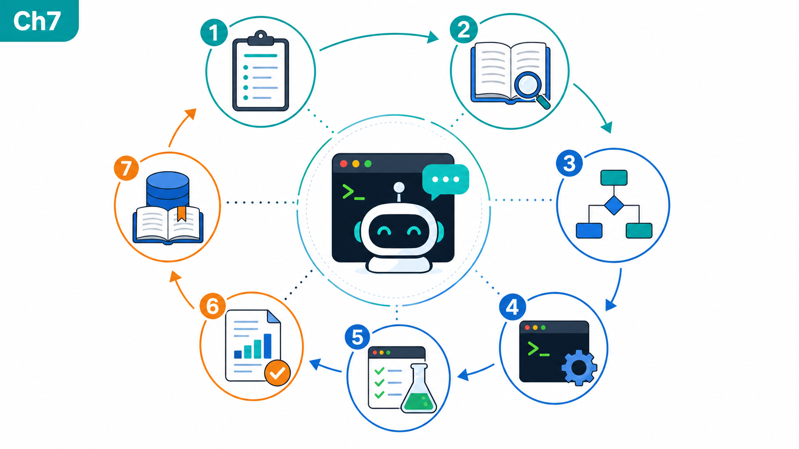
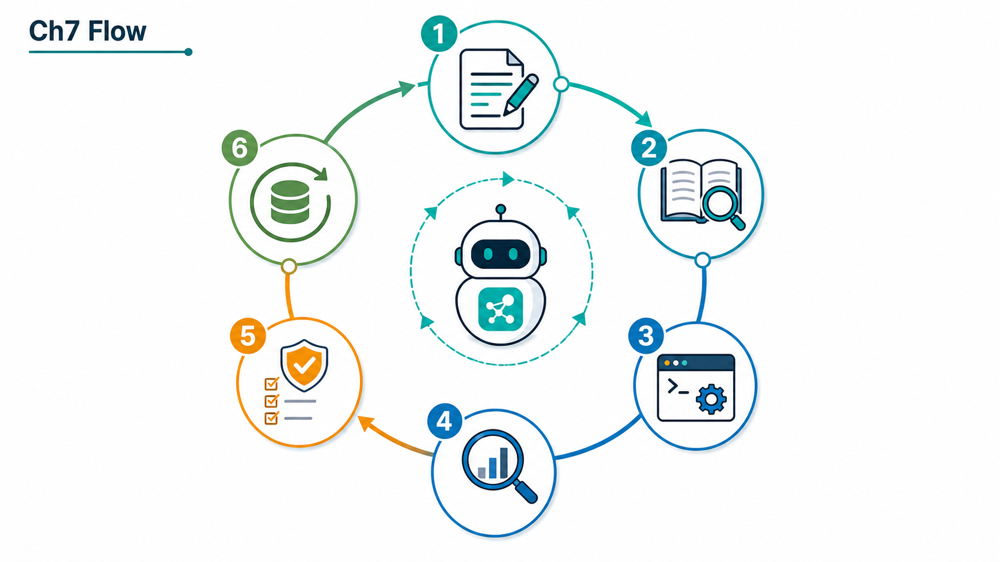
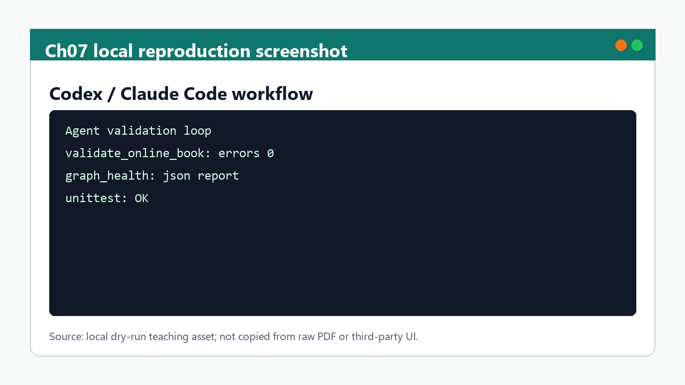

# 第 7 章 VibeCoding、Claude Code 与 AI Agent 工作流

## 本章导读

第七章看似从药物设计工具转向软件与 AI Agent，但它实际上决定了前六章能否持续变成可维护的研究系统。一个现代 AIDD 项目不再只是“研究者手动整理资料、运行软件、写报告”的线性流程；它更像一个由原始素材、知识库、文献库、实验记录、自动校验、在线书籍和 Agent 协议组成的工作台。VibeCoding、Claude Code、Codex、plugins 和 skills 的价值，是把这些流程变成可审查、可复用、可验证的协作机制。

本章的重点不是鼓励读者把所有判断交给 AI，而是建立“AI 可以操作知识库，但必须受规则约束”的工程意识。AI Agent 很适合做资料摄入、文件索引、方法卡整理、引用核对、模板生成、校验脚本、书籍构建和重复性检查；但它不应该在没有来源的情况下编造文献，不应该把课程范文写成本项目结果，不应该把原始 PDF 大段复制进公开书籍，也不应该把 SSH、token、账号信息写入 Markdown。

AI_MD 项目的第一版已经有 `CLAUDE.md`、本地 skills、validator、graph health、Zotero/BibTeX 映射和 GitHub Pages 部署。第二版课程文本要把这些工具链解释给读者：一个面向 AI Agent 的知识库如何被组织，一个研究者如何让 AI 帮助自己而不丢失 provenance，一个在线书籍如何从 wiki 中生成但不替代 wiki。

## 学习目标

完成本章后，读者应能解释 VibeCoding 与传统“写脚本”之间的差异：前者强调需求、上下文、计划、实现、验证和复盘的连续协作，而不是只让模型输出代码片段；能说明 Claude Code/Codex 这类 Agent 在项目中的安全操作边界；能阅读 `CLAUDE.md`、`index.md`、`log.md`、本地 skills 和 `book/book_map.toml`，理解它们如何共同约束知识库更新；能设计一个适合 AI Agent 执行的任务，例如“补一篇文献锚点”“更新章节引用”“生成实验记录模板”“运行在线书籍校验”。

读者还应能识别 Agent 工作流中的风险。AI 可能读错路径、混淆文献、过度总结、忽略文件编码、误删用户修改、把网络资料当本地事实、把模型输出当实验结果。减少这些风险的方法不是禁止 AI，而是建立明确的输入、输出、验证和日志机制。一个好的 Agent 任务应该有来源路径、目标文件、允许/禁止操作、验收命令和回滚边界。

## 知识图谱入口

本章来源于 `01_课程章节索引/章节精读/第07章_VibeCoding与ClaudeCode精读.md`，方法来源包括 `00_项目说明/LLM Wiki运行手册.md`、`00_项目说明/插件与Skills调用说明.md` 和 `00_项目说明/LLM Wiki Agent说明.md`。工作台入口是 `07_研究工作台/AI回归评测集.md`。在线书籍映射由 `book/book_map.toml` 的 `chapter-07` 维护。

在知识图谱中，本章连接四类实体。第一类是项目协议，包括 `CLAUDE.md`、`index.md`、`log.md`、`book_map.toml` 和维护报告。第二类是 Agent 能力，包括 skills、plugins、Zotero、GitHub、validator、MkDocs build 和 graph health。第三类是可执行任务，包括 ingest、takenote、update-vault、wiki-lint、reference check、book validation 和 deployment。第四类是风险边界，包括原始素材只读、私密信息不入库、文献案例与项目结果分层、BibTeX key 优先于 Zotero item key。

本章没有正式 BibTeX key，因为其主要依据是本项目的工程协议和本地资料，而不是单篇药物设计论文。若后续要扩展，可补充 AI-assisted programming、research software engineering、reproducible computational notebooks 和 knowledge management 相关文献；但首版课程中，项目本身的可执行协议更重要。

### Imagegen 知识图谱

{ loading=lazy }

| 编号 | 正文权威标签 |
|:---:|:---|
| 1 | 任务说明 |
| 2 | 读取来源 |
| 3 | 制定计划 |
| 4 | 工具执行 |
| 5 | 验证 |
| 6 | 评审 |
| 7 | 沉淀知识 |

这张图由 Imagegen 生成，用于帮助读者把本章对象、方法和证据关系先组织成可记忆结构。图中只保留短标题和编号，精确术语、参数和边界以上表及正文为准。

## 核心概念

VibeCoding 不是“凭感觉让 AI 写代码”。在课程语境中，它指一种高上下文、强反馈、持续验证的协作方式。研究者给出目标、素材、约束和验收标准，Agent 读取项目结构、制定计划、修改文件、运行测试、报告结果。有效的 VibeCoding 依赖上下文质量：如果项目没有索引、没有规则、没有测试、没有引用映射，AI 只能靠猜；如果项目结构清晰，AI 就能成为稳定助手。

LLM Wiki 是给 AI 和人共同使用的知识库。AI_MD 的结构遵循 raw sources -> wiki -> schema/book 的分层：`06_原始学习素材/` 保存原始材料，`01_课程章节索引/`、`02_方法笔记/`、`03_文献笔记/`、`04_实验记录/` 和 `07_研究工作台/` 负责整理，`book/` 负责在线书籍输出。这样的分层避免了原始资料、解释性笔记和发布内容互相污染。

Skills 是稳定操作流程的封装。一个好的 skill 不应该只是提示词，而应说明触发条件、输入、输出、步骤、边界和验收。例如资料摄入 skill 应知道原始素材只读、需要生成章节精读和附件索引、需要更新 log、需要运行 validator；Zotero skill 应知道如何搜索本地库、导出 BibTeX、维护 item key 与 BibTeX key 的映射。

验证脚本是 Agent 工作流的安全网。`tools/validate_online_book.py` 检查在线书籍的章节结构、来源路径、BibTeX key、内部链接和禁止链接；`validate_llm_wiki.py` 检查 wiki 链接、frontmatter 和 typed relations；`tools/graph_health.py` 检查实体、关系、claims 和引用健康。没有这些脚本，Agent 修改后的项目很难快速判断是否破坏了结构。

GitHub 与在线部署是发布出口，不是唯一来源。GitHub Pages 可以把 `book/` 发布成在线书籍，但 source of truth 仍在仓库中。上线部署需要区分本地开发、GitHub Actions、Pages 分支或 artifact、`mkdocs build --strict` 和最终 URL。部署成功只说明页面可访问，不说明内容质量已经通过学术审查。

## 方法流程

第一步是定义 Agent 任务。一个清晰任务应包含目标、输入范围、允许修改文件、禁止操作、引用要求和验收命令。例如“把第八章补充 PDF 纳入 Zotero/BibTeX”应说明要搜索 Zotero、更新 `references/zotero-map.tsv`、补 `references/references.bib`、更新文献笔记和章节精读，并运行 validator。

第二步是读取项目入口。Agent 不应直接打开随机文件开始改，而应先读 `index.md`、`CLAUDE.md`、相关 `_index.md`、`book/book_map.toml` 和目标章节来源。对在线书籍任务，还应检查 `book/mkdocs.yml`、章节 Markdown、appendices 和 validator。读取顺序能显著降低路径和边界错误。

第三步是制定最小可执行计划。计划不应过度庞大，而应拆成可验证步骤：盘点、修改、补引用、运行测试、构建、记录维护报告、提交或部署。每一步应有产物或命令。比如第二版在线书籍扩写任务，应先确认章节长度和引用，再增强校验器，随后生成长文，最后运行 `python tools/validate_online_book.py --min-chapter-chars 5000` 和 `mkdocs build --strict`。

第四步是实施修改。人工或 Agent 写入文件时要遵守项目风格：中文面向读者，BibTeX key 保留英文，原始 PDF 不复制，文献案例和本项目结果分层，实验结果进入 `04_实验记录/`，研究问题进入 `07_研究工作台/`，在线书籍只写课程讲义。涉及用户未确认的真实实验或私密信息，不应自动写入公开页面。

第五步是验证。验证应包括单元测试、在线书籍校验、MkDocs strict build、wiki validator、graph health 和人工抽查。对于文献任务，还要检查 `references/zotero-map.tsv` 与 `references/references.bib` 是否一致。对于 AI 生成正文，还要检查章节固定区块、引用 key、链接、长度和边界表述。

第六步是记录和发布。每轮重要更新应写入 `log.md` 或维护报告，说明做了什么、来源是什么、测试结果如何、仍有哪些待确认项。GitHub 提交信息应聚焦真实变化。若部署到 Pages，应确认构建成功、URL 可访问、导航正常、搜索正常、没有破损链接。

## 代码案例与软件操作

{ loading=lazy }

**说明-执行-控制-验证-沉淀闭环图** 的编号含义如下：

| 编号 | 流程节点 |
|:---:|:---|
| 1 | brief |
| 2 | read |
| 3 | plan |
| 4 | execute |
| 5 | validate |
| 6 | write-back |

本节对应软件/界面：**Codex / Claude Code workflow**。场景是：把 Agent 任务拆成可审查闭环：先读来源，再改文件，最后运行验证并写回维护记录。

=== "可复制代码"

    ```powershell
    $ErrorActionPreference = 'Stop'
    python tools/validate_online_book.py --map book/book_map.toml --book-root book/docs --require-nature-refs --require-imagegen
    python tools/graph_health.py . --json --stale-days 180 | Out-File book/docs/resources/latest-graph-health.json
    python -m unittest discover -s tests
    ```

=== "配套文件"

    完整示例文件：[`chapter-07-agent-validation.ps1`](../assets/code/chapter-07-agent-validation.ps1)

{ loading=lazy }

| 步骤 | 操作 |
|:---:|:---|
| 1 | 给出明确目标、边界和禁止事项。 |
| 2 | 让 Agent 先读索引、映射和相关章节。 |
| 3 | 要求输出验证命令、失败项和后续沉淀位置。 |

!!! warning "常见错误"
    不要把 Agent 回答当作 provenance；真实依据必须回到文件路径、文献 key、测试输出和维护报告。

## 关键文献与 BibTeX key

<!-- refs:start -->

本章暂无正式 required BibTeX key。它承担运行规范、项目目录和可复现记录的基础训练；正式 SCI 文献锚点在后续结构预测、对接、MD、亲和力预测和蛋白设计章节中展开。

<!-- refs:end -->
## 实验/练习入口

练习一：写一个 Agent 任务单。选择一个小任务，例如“为第 3 章新增一条文献锚点”或“为 Boltz2 样例补实验记录字段”。任务单必须包含目标、输入路径、允许修改文件、禁止事项、验收命令和输出格式。让另一个人或 AI 仅凭任务单执行，检查是否足够清楚。

练习二：运行在线书籍校验。使用 `python tools/validate_online_book.py --map book/book_map.toml --book-root book/docs` 检查当前书籍；第二版正文完成后再加 `--min-chapter-chars 5000`。记录错误类型和修复方式。这个练习帮助读者理解“内容生成”和“结构验收”的区别。

练习三：设计一个 AI 回归评测问题。问题必须要求 AI 返回路径、BibTeX key、使用边界和下一步建议。例如：“第八章正向虚拟筛选有哪些文献案例可以借鉴，但不能当作本项目结果？”把答案标准写入 `07_研究工作台/AI回归评测集.md` 的风格。

练习四：检查一次私密信息边界。阅读本章相关原始附件清单，列出哪些资料可以进入公开书籍，哪些只能保留为本地索引，哪些需要脱敏。特别注意 SSH、账号、token、服务器地址和个人路径。Agent 工作流必须把私密信息检查作为默认步骤。

## 使用边界与常见误读

第一，AI Agent 不是事实来源。它可以帮助整理、检索、生成和验证，但事实仍来自原始资料、文献、实验记录和用户确认。任何没有来源的内容都应标记为待确认，而不是写入正式结论。

第二，自动化不是免审查。validator 能检查链接和结构，不能判断所有科学表述是否正确。长文生成后仍需要人工抽查关键结论、引用和边界，尤其是涉及真实药物发现、蛋白设计和实验建议的部分。

第三，GitHub Pages 上线不等于公开教材完成。部署只是让页面可访问；课程质量还取决于章节内容、引用完整性、版权边界、图片合规、案例分层和读者反馈。AI_MD 当前定位仍是内部教学/组内培训优先。

第四，私密资料不得进入公开页面。SSH 配置、token、账号信息、本机路径和未授权原始 PDF 内容都不能被复制到在线书籍。在线书籍可以引用本地知识库路径作为来源说明，但不直接嵌入原始素材。

第五，不要把 Agent 过程写成科学结果。Agent 运行 validator、生成目录或整理文献，是项目维护结果；只有实际计算和实验记录才能成为研究结果。第 8 章会继续强调这一点。

## 延伸阅读与下一步

完成本章后，读者应能理解 AI_MD 为什么既是课程资料库，也是 AI Agent 可操作的研究工作台。下一章进入研究思路整合：如何从靶点、文献、结构、对接、MD、亲和力、蛋白设计和 Agent 工作流中组织一个真正可执行的研究项目。建议在进入 [第 8 章](chapter-08.md) 前，先用本章练习写一个 Agent 任务单，并运行一次在线书籍校验。

第七章是全书的方法治理层。没有它，前六章很容易停留在工具教程；有了它，课程资料可以持续转化为章节讲义、文献索引、实验模板、AI 回归评测和 GitHub Pages 在线书籍。对个人专业研究者来说，这一章的价值不是学习某个按钮，而是学会让 AI 帮自己维护一个不会迅速失控的研究系统。[返回首页](../index.md)。
