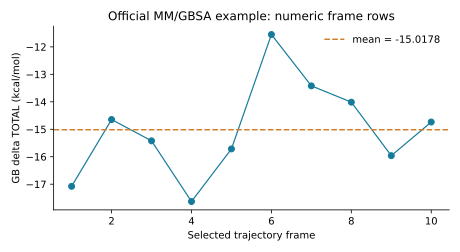
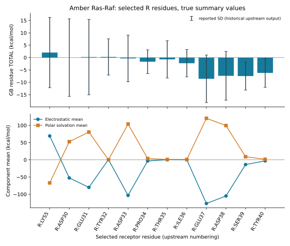

# 第 7 章 结合自由能与 MM/PBSA 计算

## 本章导读

一份能量结果表中，逐帧数值、平均值和误差项可能排列在同一列。把整列直接求平均，会把汇总行也当成观测。本章先从这个具体问题开始。读取真实 MM/GBSA 输出，重算统计，再改变帧窗口核对结论。

必修练习使用 gmx_MMPBSA 官方蛋白–配体单轨迹示例的公开真实导出。它来自另一体系，不是第 4 章 3HTB/JZ4 的重算。普通 Windows Python 环境即可完成；完整 MM/PBSA 重算列为选学，需要额外的 AmberTools 环境和匹配的体系文件。

| 本章练习 | 输入 | 产物 |
|---|---|---|
| 读取真实输出 | 官方 gb_delta_total.csv | 帧行与汇总行分类 |
| 重算统计 | 10 个帧值 | 均值、离散程度、原始曲线 |
| 改帧窗口 | 第 6–10 帧 | 与全区间比较 |
| 准备完整重算 | 复合物拓扑、轨迹、原子组和参数 | 缺失输入与运行计划 |

## 练习目录

从[练习资源页](https://luvega.github.io/AI_MD/resources/)下载本章压缩包，解压到 `C:/coursework`。以下命令从 `C:/coursework/AI_MD_practice` 开始。先进入本章目录，后续 Python 命令都从这里运行，结果写入 `outputs`。

```bash
cd chapter-07/assets
```

## 7.1 结合自由能计算方法分类

先确认要比较什么。实验结合常数、MM/GBSA 的近似能量、FEP 的相对自由能和 docking score 不是同一输出。先给每个表头写方法和单位，再做数值比较。

| 方法 | 主要输入 | 常见产物 | 实际准备任务 |
|---|---|---|---|
| MM/PBSA、MM/GBSA | 轨迹、拓扑与受体/配体定义 | 近似端点能量及分项 | 核对匹配的帧与参数 |
| FEP/TI | 相互转换的状态、映射与多窗口采样 | 自由能差 | 设计转换与检查窗口取样 |
| PMF/umbrella sampling | 反应坐标及偏置窗口 | 沿坐标的自由能剖面 | 确认坐标与窗口重叠 |
| Docking | 受体、配体与搜索盒 | pose 与打分 | 先做重对接等检查 |

端点法对复合物、受体和配体分别计算，再按“复合物 − 受体 − 配体”得到差值。热力学关系是 ΔG = ΔH − TΔS；常见端点近似把 MM 能量与隐式溶剂贡献相加，再另行考虑溶质熵项。省略熵、单轨迹提取与不同轨迹采样会改变结果口径，先把这些设置写入运行记录。

标准态平衡关系写作 ΔG° = RT ln(Kd/C°)，其中 C° 为所用浓度标准态，常取 1 mol/L。只有对应的标准结合自由能与平衡 Kd 才满足这项关系；本练习不把一个省略项的端点数值直接代入换算 Kd。

本章的 CSV 标题是 `GB delta TOTAL`，所以统计时必须记为 MM/GBSA。文件名或章节名称中含 MMPBSA，不会把 GB 计算自动变成 PB 计算。

## 7.2 gmx_MMPBSA 安装与环境检查

必修输出读取只需要 Python 与 matplotlib。

```bash
python -m pip install matplotlib
python code/read-official-gb.py --help
```

完整重算优先使用独立的 Linux/WSL 教学环境，按 [官方安装说明](https://valdes-tresanco-ms.github.io/gmx_MMPBSA/installation/) 配置 gmx_MMPBSA、AmberTools 和 GROMACS。不要把已有的 GROMACS、普通 Python 环境或结果读取脚本视为 AmberTools 已安装。

| 检查 | 正常时应记录什么 | 失败时先处理什么 |
|---|---|---|
| `gmx --version` | GROMACS 版本与可执行文件 | 安装与 PATH |
| `gmx_MMPBSA -h` | 程序帮助输出和版本信息 | 环境是否激活 |
| AmberTools 工具 | 所需 sander、tleap 等路径 | 对应环境依赖 |
| 官方示例 | 完整计算命令、日志与结果 | 先按示例输入排查环境 |

当前必修材料不声称在本机运行过 gmx_MMPBSA。3HTB/JZ4 独立 MM/PBSA 复算还需要 AmberTools 以及完整配体参数和轨迹；先完成下节输入核对，再决定是否具备重新计算条件。

## 7.3 gmx_MMPBSA 参数与输入

不要从一张能量图反推完整运行设置。完整计算首先需要明确受体、配体和复合物分别包括哪些原子，以及三者如何来自同一条轨迹或不同轨迹。

| 文件或设置 | 核对内容 | 常见遗漏 |
|---|---|---|
| tpr / top / itp | 原子顺序、参数与 include 完整 | 只有 tpr，没有配体参数来源 |
| xtc | PBC 处理、帧数、时间范围 | 轨迹与拓扑不是同一体系 |
| ndx | 受体、配体、复合物组 | 把另一体系的组号照抄 |
| general | startframe、endframe、interval、temperature | 把帧编号当 ps |
| gb / pb | 模型、介电、电解质与半径等 | 比较结果时设置不一致 |
| 熵处理 | 是否计算、用什么方法 | 把省略熵的端点能量写成完整 ΔG |

在第 6 章轨迹目录，用 `gmx check -f` 核对帧间隔，再写帧编号与时间的对应表。`startframe = 6` 表示被读取的第 6 帧；是否对应 5 ps、50 ps 或其他时间，由实际轨迹决定。

## 7.4 蛋白-小分子结合自由能计算

下载 [原始 CSV](../assets/chapter-07/practice/official-gb/gb_delta_total.csv)，先用文本编辑器打开。不要用电子表格自动排序后覆盖原件。把 `Frames` 中的数字行与 `Average`、`SD`、`SEM` 行分成两类。

| 行类型 | 是否作为逐帧观测 | 为什么 |
|---|---|---|
| 1–10 | 是 | 对应上游导出的帧值 |
| Average | 否 | 已经是帧值的汇总 |
| SD | 否 | 描述帧值离散程度 |
| SEM | 否 | 根据统计规则得到的误差项 |

先预测完整区间均值的大致范围，再从本章 assets 目录运行。

```bash
python code/read-official-gb.py --input practice/official-gb/gb_delta_total.csv --outdir outputs/full
```

脚本只读取数值帧行，输出 `summary.json`、`gb-frames.svg` 和 PNG；JSON 保留原始文件哈希、源版本、帧区间、单位与上游汇总。完整 10 帧均值必须与上游 `Average` 一致，否则脚本报错。

| 核对项 | 本例真实值 |
|---|---|
| 逐帧数值数量 | 10 |
| MM/GBSA 均值 | -15.017773104 kcal/mol |
| population SD | 1.686022904 kcal/mol |
| 按 N 计算的 naive SEM | 0.533167256 kcal/mol |
| 上游温度记录 | 298.15 K |



图中每个点是一个导出帧值，虚线为本章独立重算均值。此图与 3HTB/JZ4 的重对接曲线没有数据继承关系。

## 7.5 蛋白-蛋白结合自由能计算

受体与配体不一定是“小分子”。蛋白复合物中可以把一条或多条链定义为一个分析组，但链组成必须固定。先做组定义练习，再考虑计算。

| 准备任务 | 应保存什么 | 对照错误 |
|---|---|---|
| 给两侧链命名 | 每侧 chain、残基范围与原子数 | 两组重复包含同一链 |
| 核对复合物 | 复合物等于两组之和 | 遗漏界面辅因子但仍沿用旧命名 |
| 说明单轨迹设置 | 三套能量从哪些帧取坐标 | 混入不同平衡状态的轨迹 |

作业给第 10 章公开的 [PDL1 A/B 模型](../assets/chapter-10/data/pdl1_test_0_model_0.pdb)制作受体/配体组表，将 A、B 链分别列清。这个文件只用于选学结构阅读；没有匹配的真实轨迹与完整参数时，只交准备表。第 4 章 3HTB/JZ4 的配体是小分子 JZ4，不属于本节蛋白–蛋白体系。

## 7.6 蛋白-核酸结合自由能计算

核酸体系先核对链、序列、端基、离子和参数支持。不能因为程序接受 PDB 就默认能量模型适用于当前体系。

| 输入 | 操作问题 | 核对记录 |
|---|---|---|
| 蛋白–DNA/RNA | 哪些链属于核酸分析组 | chain 与序列 |
| 核酸参数 | 与当前端基、糖和修饰是否相符 | 参数来源和版本 |
| 盐与金属 | 是否保留、如何纳入组定义 | 组分与分析假设 |

从公开结构练习分组，比较“只取核酸链”与“核酸加结构金属”两种定义。写出体系怎样变化，先不把两种结果设想为可直接比较的亲和力。

## 7.7 结果分析与汇总

先认清常见 GB 结果中的项名。下面是读取规则，不给本章缺失的分项补数。

| 项名 | 常见 GB 输出中的含义 | 怎么核对 |
|---|---|---|
| VDWAALS | van der Waals 能量 | 力场与差值体系 |
| EEL | 静电能量 | 电荷及是否含相关 1–4 项 |
| EGB | GB 极性溶剂化贡献 | GB 模型、介电与半径方案 |
| ESURF | 常用表面积近似的非极性贡献 | 表面模型与参数 |
| GGAS | 气相 MM 项的合计 | 结合实际输出的键合与非键项 |
| GSOLV | 本方案的溶剂项合计 | 简单 GB 方案常为 EGB + ESURF |
| TOTAL | 本方案总项 | 通常由 GGAS + GSOLV 得到；熵另看设置 |

能量相消要在同一差值体系里核对。本章的逐帧 CSV只有 GB delta TOTAL；残基分项在 7.9 用第二套真实材料读取，不能从这里反推出各项。

现在改变帧窗口，只取第 6–10 帧。先查看 CSV 最后五个数，预测均值会比全区间更负还是更接近零，再运行。

```bash
python code/read-official-gb.py --input practice/official-gb/gb_delta_total.csv --startframe 6 --endframe 10 --outdir outputs/last-five
```

| 对照 | 全 10 帧 | 后 5 帧 |
|---|---|---|
| 数量 | 10 | 5 |
| 均值 / kcal/mol | -15.017773104 | -13.936489328 |
| 文件记录 | selected_frames 为 1–10 | selected_frames 为 6–10 |

再做一个故意的错误。用电子表格对所有 13 行直接求平均。把它与脚本输出比较，定位差异来自哪些行。恢复原始 CSV后核对哈希；不要把改错副本当正式输入。

`population_sd` 按全部选中帧作为当前集合计算；`sample_sd` 使用 N−1；`naive_sem` 按 population SD/√N 计算。后者没有校正帧间相关性，也不能称为独立重复模拟的误差。作业用自己的话说明这三个字段为什么不同。

## 7.8 丙氨酸扫描

丙氨酸扫描提出的是“改变这个残基后，所定义的能量或结合过程怎样变化”。先核对原残基、突变位点和结构编号，再区分计算突变与实验突变。

| 准备步骤 | 要填写的字段 | 容易发现的错误 |
|---|---|---|
| 定位残基 | chain、residue、原氨基酸 | PDB 编号与序列编号错位 |
| 选择突变方案 | Ala 或其他改变、侧链处理 | 把原本 Ala 当作同一种有效扫描 |
| 选择计算路线 | 原轨迹近似或重新采样 | 未说明是否重新平衡 |
| 做外部比较 | 已知突变或实验条件 | 实验 readout 与计算量不相同 |

必修作业只完成位点和输入核对。未执行突变计算时，结果列保持空白。

## 7.9 残基能量分解

前面的官方 CSV 只有总能量。这里换用第二套真实来源。[Amber 官方 Ras–Raf 教程](https://ambermd.org/tutorials/advanced/tutorial3/py_script/section6.htm)公开了 2010 年 50 帧的 GB 残基分解结果；本章独立抽取 R 侧 LYS5 与 30–40 位点的数值，共 12 个残基。它不是 gmx_MMPBSA 总能量例子的同一体系，也不是 3HTB/JZ4。

下载 [残基 TSV](../assets/chapter-07/practice/amber-residue/ras-selected-residue.tsv) 与 [来源说明](../assets/chapter-07/practice/amber-residue/README.md)，核对 component、编号、分项与 total。先预测只按静电项排序会得到怎样的结果，再同时看极性溶剂化项。

| R 侧残基 | 静电均值 | 极性溶剂化均值 | TOTAL 均值 |
|---|---:|---:|---:|
| LYS5 | 69.267 | -67.061 | 2.040 |
| GLU37 | -126.728 | 120.528 | -8.573 |
| TYR40 | -3.076 | 1.652 | -6.193 |

单位均为 kcal/mol。GLU37 的两项数值都很大，方向相反；TOTAL 还包括内能、vdW 和非极性溶剂化。脚本核对五个分项之和，允许源文件保留三位小数带来的舍入差。

```bash
python code/read-residue.py --input practice/amber-residue/ras-selected-residue.tsv --outdir outputs/residue
```



上图只包含所选 12 个残基，误差线是原文件所报 SD；下图并列静电与极性溶剂化均值。本章没有逐帧分解数据，不从 SD 倒推逐帧值，也不把它改称 SEM。历史输出还提示半径方案需要复核，因此用于读取练习，不照搬为当前推荐配置。

对照作业。分别按静电项和 TOTAL 排序，指出顺序变化；再把源文件的 R 侧编号与复合物编号核对。取得自己的真实分解输出后，保留 chain/组分、编号、方法、区间与分项，回到结构定位，再提出突变复核任务。

## 7.10 IE 与 QM/MMGBSA

Interaction Entropy 与 QM/MM 处理改变的是不同部分。IE 用能量波动估算熵项；QM/MM 将选定区域用量子化学方法处理。先说明改变了哪个计算环节，再比较结果。

| 方法 | 需要另行核对 | 实操作业 |
|---|---|---|
| IE | 能量时间序列、采样、截取规则与参数 | 检查是否有实际需要的逐帧分项 |
| QM/MMGBSA | QM 区域、方法、基组、电荷、自旋与边界 | 为一个金属位点列准备字段 |

只有本章 `GB delta TOTAL` 一列时，不能重新拼出 IE 所需的全部能量项，也不能把它标成 QM/MM 结果。选学先交完整输入方案，实际执行后再补结果。

## 7.11 Uni-GBSA 批量分析

批处理之前先让一个体系跑通。为每个候选建独立目录，保留结构、参数来源、轨迹、命令和状态；失败条目要有原因，不能用零能量占位后继续排序。

| 候选状态 | 汇总怎么写 | 下一步 |
|---|---|---|
| 已算且输入对应 | 保留方法、单位、窗口与结果 | 检查重复与结构 |
| 缺参数 | 能量留空，写缺失文件 | 先参数化 |
| 程序失败 | 能量留空，链接日志 | 修复后重跑 |
| 方法设置不同 | 单独标明方案 | 统一方案后比较 |

按照 [Uni-GBSA 官方仓库](https://github.com/dptech-corp/Uni-GBSA) 核对本机环境与输入要求。必修练习先将真实官方 CSV、帧窗口比较和缺失输入表整理成一个结果包，第 11 章再把成功流程接入批处理。

## 本章方法范围

MM/GBSA 与 MM/PBSA 的结果受轨迹、受体/配体定义、参数、溶剂模型及熵处理影响。单个负能量或分解项不等于实验亲和力、功能机制或可成药性；帧间波动也不等于独立重复的误差。只有输入与设置一致并完成相应验证，才能讨论候选间比较。这里公开的真实官方 MM/GBSA 示例用于练习结果读取；3HTB/JZ4 的独立 MM/PBSA 复算仍待完整环境与输入支持。
