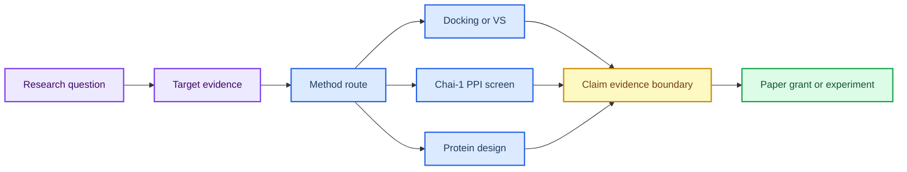

# 第 8 章 研究思路解析：寻靶、虚拟筛选、PPI 与蛋白设计整合

## 本章导读

第 8 章处理的不是单一软件，而是研究问题如何从资料、文献案例和方法卡中长出来。综合章节最容易出现来源混淆：课程范文像结果，文献案例像项目进展，模型分数像实验证据。

本章把寻靶、结构复核、虚拟筛选、PPI 筛选、蛋白设计、claim-evidence-boundary 和输出任务组织成研究工作台。读者需要把每个方向拆成问题、证据、缺口、方法、下一步实验和可产出物，而不是直接从案例跳到课题结论。

前面章节提供具体工具，本章负责选择路线和控制证据边界。它要求读者同时管理文献案例、dry-run、本地计算和真实实验结果，使项目池能够服务综述、课题申请、实验记录和后续在线教材更新。

本章的阅读对象是项目决策，而不是单个工具输出。一个方向能否进入真实课题，不取决于它是否出现在文献中，也不取决于模型是否给出较高分数，而取决于证据、方法、资源和下一步实验是否形成闭环。

## 学习目标

本章目标是把课程材料转化为个人研究工作台，而不是把文献案例、方法假设和本项目结果混在一起。完成本章后，读者应能够：

- 能把研究问题拆成靶点证据、结构来源、可用方法、证据缺口和下一步实验。
- 能区分第八章补充 PDF 中的文献案例、课程范文和本项目结果。
- 能在项目池中同时管理虚拟筛选、PPI 和蛋白设计路线。
- 能把关键判断写成 claim-evidence-boundary 形式。

这些目标决定课程材料能否进入真实课题。只有研究问题、证据来源、方法路线、claim 边界和下一步实验都清楚时，项目池才有决策价值。

## 知识图谱入口

本章图谱是全书的研究工作台入口。它不新增单一工具，而是把前七章的证据和方法组合成项目路线。

在线书籍页面只引用整理后的 wiki、方法卡、文献笔记和资源页，不直接嵌入原始 PDF 或课件图表；在研究工作台综合路线中，这一点应具体落到claim-evidence-boundary 表和项目队列。需要追溯来源时，应回到 `book/book_map.toml`、章节精读笔记和相关 Zotero/BibTeX 记录；在研究工作台综合路线中，这一点应具体落到claim-evidence-boundary 表和项目队列。

| 来源类型 | 路径 |
|:---|:---|
| 章节来源 | `01_课程章节索引/章节精读/第08章_计算思路解析精读.md` |
| 方法来源 | `02_方法笔记/Chai1互作蛋白虚拟筛选.md`<br>`02_方法笔记/AI多组分对接与虚拟筛选.md`<br>`02_方法笔记/RFdiffusion与蛋白设计.md` |
| 文献来源 | `03_文献笔记/分子对接与虚拟筛选.md`<br>`03_文献笔记/RFdiffusion蛋白设计.md` |
| 实验来源 | `04_实验记录/模板_Chai1互作蛋白虚拟筛选记录.md` |
| 工作台来源 | `07_研究工作台/实体索引.md`<br>`07_研究工作台/证据与claims矩阵.md`<br>`07_研究工作台/研究问题与项目池.md` |

### Imagegen 知识图谱

{ loading=lazy }

**图8.1 研究工作台综合知识图谱。** 本图为 Imagegen 生成的教学示意图，用中心概念和编号节点概括研究工作台综合路线的对象、方法入口、记录字段和证据边界；编号用于正文定位，不承载精确参数或运行结果，术语解释和判断口径以正文表格为准。 节点编号：1=研究问题；2=靶点证据；3=结构来源；4=虚拟筛选；5=PPI 路线；6=蛋白设计；7=证据 claim；8=输出任务。

### Mermaid 结构图



**图8.2 寻靶-解码-造器证据路线结构图。** 本图为 Mermaid 教学示意图，展示研究问题、靶点证据、方法路由、候选生成和输出计划之间的工作台路线；箭头表示阅读和记录依赖，不替代真实软件运行或实验验证，具体输入、输出和 QC 标准以正文为准。

研究工作台综合路线的 Mermaid 源图和后续 scientific-schematics prompt 见 [Mermaid 图示与示意图设计](../resources/mermaid-schematics.md)。

## 核心概念

研究工作台的核心概念围绕“问题如何定义、证据如何分层、输出如何选择”展开。它们决定一个方向是阅读任务、计算任务、实验任务还是写作任务。

| 概念 | 教材化定义 |
|:---|:---|
| 研究问题 | 研究问题应明确对象、疾病/功能场景、候选方法和可验证输出。 |
| 靶点证据 | 靶点证据需要区分数据库线索、文献案例、结构可用性和实验可行性。 |
| 方法路线 | 虚拟筛选、PPI 筛选和蛋白设计是不同路线，输入、输出和验证成本不同。 |
| claim 层 | claim 应同时记录支持证据、证据强度、适用边界和下一步验证。 |
| 输出任务 | 课件、综述、课题申请和实验记录可以共享材料，但写作口径不同。 |

使用概念表时，应先确认研究问题是否具体，再检查靶点证据、结构来源和方法路线是否匹配。若只有文献案例而没有本项目输入，应把方向留在项目池或阅读队列。

这些概念构成决策链：研究问题定义目标，证据矩阵判断成熟度，方法路线决定成本，claim 层控制写作边界，输出任务决定进入课件、综述、申请书还是实验记录。

例如，UXS1、APE1、IDO1 或 BabA 等案例可以提供路线启发，但本项目是否可执行还要看靶点可用性、结构来源、候选库、实验条件和输出目标。概念表应帮助读者把“案例启发”转化为“本项目缺什么证据”。

输出任务也会反过来影响证据要求。课堂讲义可以展示方法路线，综述需要完整文献脉络，课题申请需要可执行计划，实验记录则必须有真实输入和参数。不能用同一套措辞服务所有出口。

## 方法流程

本章流程从研究问题卡开始，以项目池和输出视图结束。它的核心是把“想法”拆成可复核证据和下一步动作。

| 步骤 | 输入 | 动作 | 输出 | QC/边界 |
|:---:|:---|:---|:---|:---|
| 1 | 研究问题 | 定义目标、对象和可产出物。 | 项目问题卡。 | 问题不只是工具练习。 |
| 2 | 证据矩阵 | 收集靶点、结构、文献和方法证据。 | evidence matrix。 | 文献案例与项目结果分层。 |
| 3 | 路线选择 | 选择虚拟筛选、PPI 或蛋白设计路线。 | 方法路径。 | 输入和验证成本明确。 |
| 4 | 候选生成 | 执行或规划 docking、Chai-1、RFD3/RFdiffusion 等步骤。 | 候选表。 | dry-run 与真实运行分开。 |
| 5 | claim 写作 | 把关键判断写成 claim-evidence-boundary。 | claims 矩阵。 | score/affinity/design 不被过度解释。 |
| 6 | 输出交接 | 进入阅读、实验或写作队列。 | 项目池和输出视图。 | provenance 可追溯。 |

执行时先选择一个小问题，不要同时启动多个路线。对每个方向，先写清目标对象和可产出物，再收集靶点、结构、文献和方法证据，最后决定进入 docking、Chai-1、RFD3/RFdiffusion、阅读队列或实验队列。

写作时应把关键判断写成 claim-evidence-boundary。这样做能防止把 Chai-1 aggregate score、文献案例或项目路线误写成本项目发现，也能让读者看到下一步实验为什么必要。

### 案例走读

一个项目池方向可以从“某文献案例是否能迁移到本项目靶点”开始。读者先把文献案例标记为 source evidence，而不是本项目结果；随后检查本项目是否有靶点证据、结构来源、候选库或实验条件。若缺少本地输入，该方向应停留在阅读队列或方法设计阶段。

进入 claim-evidence-boundary 表时，可以把判断写成三列：claim 说明当前最多能说什么，evidence 记录文献、dry-run 或本地计算来源，boundary 说明不能推出什么。若 Chai-1 aggregate score 只来自 dry-run 或文献案例，项目池中的 next action 应是补输入、做界面 QC 或建立正式实验记录，而不是进入论文结论。

项目拆解时，应先选择一种主路线，再记录为什么暂不选择其他路线。比如同一个靶点可以进入虚拟筛选、PPI 面板或蛋白设计，但每条路线的输入、成本和验证方式不同；路线选择本身需要留下判断依据。

## 代码案例与软件操作

{ loading=lazy }

**图8.3 寻靶-解码-造器项目路线图。** 本图为 Imagegen 生成的流程图，说明寻靶、解码和造器三类任务如何进入项目池和下一步实验队列；它用于说明操作顺序、关键节点和记录交接位置，不代表实验结果，具体命令、参数和边界判断以正文代码块与步骤表为准。 流程编号：1=question；2=evidence；3=target；4=structure；5=screen/design；6=validate；7=queue；8=output。

本节用于训练 **8 章 研究思路解析：寻靶、虚拟筛选、PPI 与蛋白设计整合** 的最小复现意识。该示例演示项目优先级排序表的计算方式；真实项目排序需要人工确认证据权重和实验条件。

=== "可复制代码"

    ```python
    import pandas as pd

    projects = pd.read_csv('inputs/project_pool.tsv', sep='	')
    projects['priority_score'] = (
        projects['evidence_strength'] * 0.45 +
        projects['method_readiness'] * 0.35 +
        projects['experiment_feasibility'] * 0.20
    )
    projects.sort_values('priority_score', ascending=False).to_csv('outputs/project_priority.tsv', sep='	', index=False)
    ```

=== "配套文件"

    完整示例文件：[`chapter-08-project-priority.py`](../assets/code/chapter-08-project-priority.py)

    P31 工作台优先级脚本：[`chapter-08-workbench-priority-dry-run.py`](../assets/code/chapter-08-workbench-priority-dry-run.py)。该脚本输出 `evidence_maturity`、`priority_score`、`decision` 和 `boundary_note`，强制区分文献案例、dry-run、本地计算和实验结果。

{ loading=lazy }

**图8.4 项目池与 Chai-1 边界 dry-run 截图。** 本图为本地 dry-run 截图，展示项目池 dry-run 中的证据成熟度、优先级和 Chai-1 边界字段；截图用于说明界面、文件或表格位置，不代表实验结果，读者应按本机路径替换参数并以正文操作表为准。

| 步骤 | 操作 |
|:---:|:---|
| 1 | 为每个研究问题建立证据矩阵。 |
| 2 | 选择虚拟筛选、PPI 或蛋白设计路线。 |
| 3 | 标注证据成熟度：文献案例、dry-run、本地计算或实验结果。 |
| 4 | 按证据强度和实验可行性给下一步排序。 |

### 教材化阅读提示

本节代码应作为项目优先级排序 dry-run的可复查样例来读。它展示的是如何把研究工作台综合路线中的一次小任务写成可复制、可失败、可追溯的记录，而不是声明已经完成真实研究运行。

替换参数时，应先替换与研究工作台综合路线直接相关的输入路径，再调整会影响解释的阈值、空间范围或模型参数。如果研究工作台综合路线的最小样例尚不能解释输出来源，就不应扩大到批量任务。

解读输出时，只记录代码确实生成的对象，例如 manifest、配置、dry-run 表格、截图或日志；在研究工作台综合路线中，这一点应具体落到claim-evidence-boundary 表和项目队列。这些对象可以支持claim-evidence-boundary 表和项目队列的整理，但不能自动升级为实验结论；需要形成研究判断时，仍要回到实验记录模板补齐输入、QC、人工复核和待验证项。
## 关键文献

文献使用说明：本章文献分为方法与案例两层。Chai-1 支撑 PPI 建模方法边界；UXS1、APE1、IDO1 和 BabA 相关文献作为研究路线、虚拟筛选或蛋白设计案例；de novo protein design 综述用于提供领域背景。所有案例均不得写成本项目结果。

<!-- refs:start -->

- Chai Discovery, Boitreaud, J., Dent, J., McPartlon, M., Meier, J., Reis, V. et al. Chai-1: Decoding the molecular interactions of life. bioRxiv (2024). https://doi.org/10.1101/2024.10.10.615955

  **本文内容简介：** 本文介绍 Chai-1 对生物分子相互作用进行统一结构预测和约束建模的方法。

- Sui, Q., Chen, Z., Shan, G., Hu, Z., Jin, X., Liang, J. et al. Targeting UXS1-Dependent Glucuronate Detoxification Potentiates Metformin's Anti-Tumor Efficacy in Lung Adenocarcinoma. Advanced Science, e10542 (2026). https://doi.org/10.1002/advs.202510542

  **本文内容简介：** 本文研究 UXS1 依赖的葡萄糖醛酸解毒通路与二甲双胍抗肿瘤效应的关系。

- Shen, T., Shen, H., Kong, Y., Qiang, W., Yu, X. & Wang, J. Structure-based virtual screening identifies novel small-molecule inhibitors targeting the endonuclease active site of APE1. Scientific Reports (2026). https://doi.org/10.1038/s41598-026-51975-0

  **本文内容简介：** 本文通过结构基础虚拟筛选发现靶向 APE1 内切酶活性位点的小分子抑制剂。

- Tomarchio, E. G., Buccheri, R. & Rescifina, A. A Reproducible Hierarchical Virtual Screening Framework Integrating Scaffold-Aware Machine Learning, Ensemble Docking, and Molecular Dynamics: Application to IDO1. Journal of Chemical Information and Modeling (2026). https://doi.org/10.1021/acs.jcim.6c00967

  **本文内容简介：** 本文提出整合骨架感知机器学习、集合对接和分子动力学的可复现虚拟筛选框架。

- Zhu, Y., Isaha, M. B. & Zhang, X. De novo design of binder proteins targeting Helicobacter pylori adhesin BabA. bioRxiv (2026). https://doi.org/10.64898/2026.05.24.727452

  **本文内容简介：** 本文报道靶向幽门螺杆菌黏附素 BabA 的从头蛋白结合体设计。

- Yang, W., Wang, S., Lee, G. R., Zhang, J. Z., Courbet, A., Juergens, D. et al. The past, present and future of de novo protein design. Nature 652, 1139-1152 (2026). https://doi.org/10.1038/s41586-026-10328-7

  **本文内容简介：** 本文综述从头蛋白设计的发展脉络、当前能力和未来研究方向。

<!-- refs:end -->

## 实验/练习入口

本章练习的重点是把研究工作台综合路线转化成可交接记录。练习完成后，读者应能让另一个人根据记录复现从文献案例到下一步实验的项目拆解链，并判断是否具备进入研究问题与项目池的条件。

建议按以下顺序完成：

1. 从一个补充 PDF 案例中提取研究问题、方法路线和不能迁移的结论。
2. 为一个候选靶点建立 claim-evidence-boundary 表。
3. 把一个项目写入项目池，给出下一步实验、阅读队列和可产出物。

完成练习后，应检查记录中是否包含claim-evidence-boundary 表和项目队列、失败原因和人工判断。缺少claim-evidence-boundary 表和项目队列时，相关内容仍适合作为课堂尝试，不适合写入正式研究结论。

如果练习借用了文献案例或课程范文，应在研究工作台综合路线记录中明确它只是方法参照或边界样例。在研究工作台综合路线中，文献案例可以启发流程设计，但不能替代本项目的本地运行结果。

## 使用边界与常见误读

本章的高风险对象是文献案例、Chai-1 aggregate score、研究路线和候选靶点。它们可以组织项目，但不能自动变成本项目结果。

本章使用边界表时，应先标注 evidence_maturity，避免把文献案例、dry-run、本地计算和实验结果合并。

| 易误读对象 | 稳健表述 | 写作处理 |
|:---|:---|:---|
| 文献案例 | 可作为流程和证据组织参考。 | 不能写成本项目已经得到的结果。 |
| Chai-1 aggregate score | 提示多模型或多界面排序线索。 | 不能直接写成 PPI 实验结合强度。 |
| 研究路线 | 支持项目优先级判断。 | 不替代真实实验、伦理和资源条件评估。 |
| 输出整理 | 可服务课件、综述和申请书。 | 不得牺牲 provenance 或混淆来源层级。 |

研究工作台的证据边界应由 evidence_maturity 决定。文献案例支持流程借鉴，dry-run 支持字段和记录设计，本地计算支持候选线索，真实实验才可能支持更强结论。

稳健写法是“该文献案例为本项目路线设计提供参考”或“Chai-1 aggregate score 提示候选互作需要复核”，而不是“本项目发现互作伙伴”或“确认 PPI 结合”。

本章使用边界表时，应先标注 evidence_maturity。文献案例、dry-run、本地计算和实验结果应出现在不同层级；如果这些层级被合并，项目池就会把灵感误当成结果。

## 延伸阅读与下一步

完成本章后，应把课程材料转化为可执行队列。推荐路径如下：

1. 把最具体的研究问题写入 `07_研究工作台/研究问题与项目池.md`，并标注证据成熟度。
2. 把需要运行的任务写入 `07_研究工作台/实验队列.md`，再进入 `04_实验记录/`。
3. 将可写作内容拆成课件、综述、课题申请和实验记录四类出口。

如果某个方向仍只依赖文献案例或模型分数，应继续补证据，而不是进入课题申请或论文结论。

读者完成本章后，应把每个方向写成一张项目卡，而不是只保留标题。项目卡至少包含研究问题、候选靶点、可用方法、已有证据、缺口、下一步实验和可产出物。这样后续可以按证据成熟度安排阅读、计算或实验，而不是按兴趣临时推进。若某个方向只有文献案例，应优先进入阅读队列。

第 8 章之后的真正工作不是再增加更多案例，而是选择少数项目进入可执行队列。建议每次只推进一个方向，并明确本轮目标是补文献、补结构、跑 dry-run、做真实小样本，还是准备写作出口。这样项目池不会变成愿望清单，而会成为研究决策工具。

当某个项目完成真实小样本运行后，应先回写实验记录和 claims 矩阵，再决定是否进入在线教材正文，保持 raw、wiki、book 三层边界清楚。
