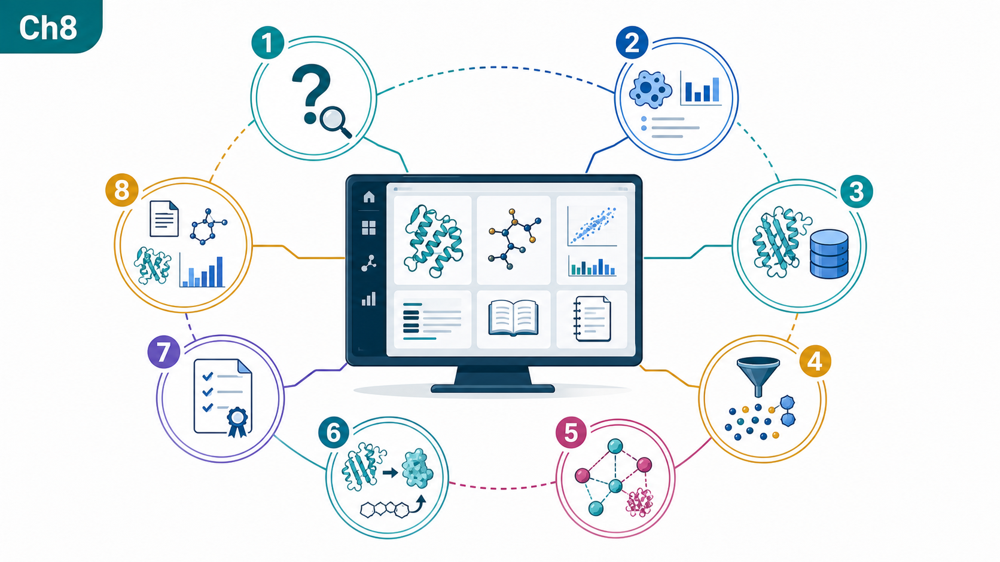
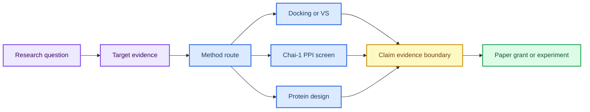
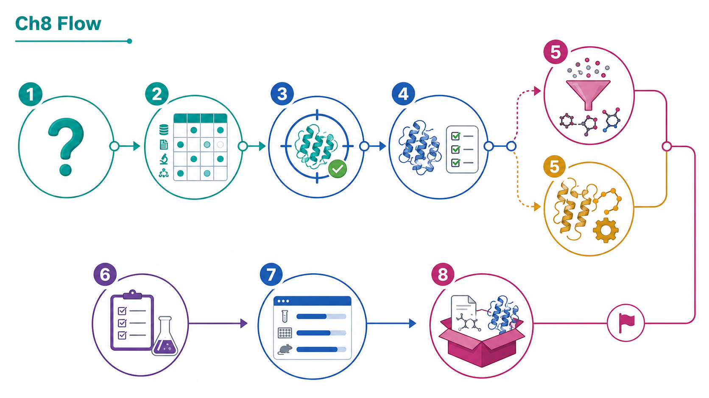
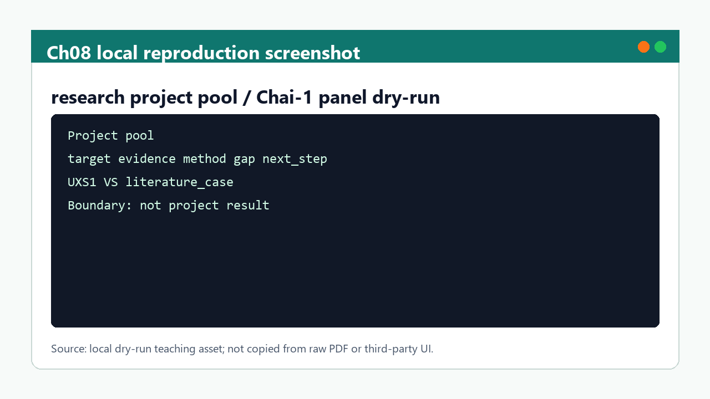

# 第 8 章 研究思路解析：寻靶、虚拟筛选、PPI 与蛋白设计整合

## 本章导读

综合章节最容易把课程范文、文献案例、方法假设和本项目结果混在一起。因此，本章首先界定这一问题场景，再说明需要记录哪些输入、动作、输出和质量控制信息。

本章把寻靶、结构复核、虚拟筛选、PPI 筛选、蛋白设计、证据 claim 和输出任务组织成研究工作台。这里的重点不是追求单个软件操作的完整覆盖，而是让读者形成可复查的判断链：对象是什么、依据来自哪里、结果能支持什么、仍然不能说明什么。

本章是从课程讲义走向个人课题设计、综述写作、课题申请和实验队列的入口。因此，本章的正文采用“概念定义 -> 流程执行 -> 边界判断 -> 下一步交接”的组织方式。

## 学习目标

完成本章后，读者应能够：

- 能把研究问题拆成靶点证据、结构来源、可用方法、证据缺口和下一步实验。
- 能区分第八章补充 PDF 中的文献案例、课程范文和本项目结果。
- 能在项目池中同时管理虚拟筛选、PPI 和蛋白设计路线。
- 能把关键判断写成 claim-evidence-boundary 形式。

这些目标既面向课堂学习，也面向后续研究记录；如果不能在记录中复述这些要点，相关结果不宜进入项目结论。

## 知识图谱入口

本章图谱是全书的研究工作台入口。它不新增单一工具，而是把前七章的证据和方法组合成项目路线。

在线书籍页面只引用整理后的 wiki、方法卡、文献笔记和资源页，不直接嵌入原始 PDF 或课件图表。需要追溯来源时，应回到 `book/book_map.toml`、章节精读笔记和相关 Zotero/BibTeX 记录。

| 来源类型 | 路径 |
|:---|:---|
| 章节来源 | `01_课程章节索引/章节精读/第08章_计算思路解析精读.md` |
| 方法来源 | `02_方法笔记/Chai1互作蛋白虚拟筛选.md`<br>`02_方法笔记/AI多组分对接与虚拟筛选.md`<br>`02_方法笔记/RFdiffusion与蛋白设计.md` |
| 文献来源 | `03_文献笔记/分子对接与虚拟筛选.md`<br>`03_文献笔记/RFdiffusion蛋白设计.md` |
| 实验来源 | `04_实验记录/模板_Chai1互作蛋白虚拟筛选记录.md` |
| 工作台来源 | `07_研究工作台/实体索引.md`<br>`07_研究工作台/证据与claims矩阵.md`<br>`07_研究工作台/研究问题与项目池.md` |

### Imagegen 知识图谱

{ loading=lazy }

| 编号 | 正文权威标签 |
|:---:|:---|
| 1 | 研究问题 |
| 2 | 靶点证据 |
| 3 | 结构来源 |
| 4 | 虚拟筛选 |
| 5 | PPI 路线 |
| 6 | 蛋白设计 |
| 7 | 证据 claim |
| 8 | 输出任务 |

这张图由 Imagegen 生成，用于帮助读者把本章对象、方法和证据关系先组织成可记忆结构。图中只保留短标题和编号，精确术语、参数和边界以上表及正文为准。

### Mermaid 结构图



完整图示设计和后续科学示意图 prompt 见 [Mermaid 图示与示意图设计](../resources/mermaid-schematics.md)。

## 核心概念

本节只保留支撑后续判断的核心概念。每个概念都应能回答一个具体问题：它约束什么输入、影响什么输出、需要怎样记录。

| 概念 | 教材化定义 |
|:---|:---|
| 研究问题 | 研究问题应明确对象、疾病/功能场景、候选方法和可验证输出。 |
| 靶点证据 | 靶点证据需要区分数据库线索、文献案例、结构可用性和实验可行性。 |
| 方法路线 | 虚拟筛选、PPI 筛选和蛋白设计是不同路线，输入、输出和验证成本不同。 |
| claim 层 | claim 应同时记录支持证据、证据强度、适用边界和下一步验证。 |
| 输出任务 | 课件、综述、课题申请和实验记录可以共享材料，但写作口径不同。 |

阅读本节时，应优先检查这些概念能否落到文件、参数、图像、表格或记录字段上。不能落地的说法，在后续研究写作中应作为背景描述，而不是证据。

## 方法流程

本章流程按“输入 -> 动作 -> 输出 -> QC”的顺序组织。这样做的目的，是让每一步都能被复查，而不是只留下一个最终截图或分数。

| 步骤 | 输入 | 动作 | 输出 | QC/边界 |
|:---:|:---|:---|:---|:---|
| 1 | 研究问题 | 定义目标、对象和可产出物。 | 项目问题卡。 | 问题不只是工具练习。 |
| 2 | 证据矩阵 | 收集靶点、结构、文献和方法证据。 | evidence matrix。 | 文献案例与项目结果分层。 |
| 3 | 路线选择 | 选择虚拟筛选、PPI 或蛋白设计路线。 | 方法路径。 | 输入和验证成本明确。 |
| 4 | 候选生成 | 执行或规划 docking、Chai-1、RFD3/RFdiffusion 等步骤。 | 候选表。 | dry-run 与真实运行分开。 |
| 5 | claim 写作 | 把关键判断写成 claim-evidence-boundary。 | claims 矩阵。 | score/affinity/design 不被过度解释。 |
| 6 | 输出交接 | 进入阅读、实验或写作队列。 | 项目池和输出视图。 | provenance 可追溯。 |

执行时应先完成小样例或 dry-run，再扩大到批量任务。任何失败样本、低置信度结果或人工排除理由，都应保留在 manifest 或实验记录中。

## 代码案例与软件操作

{ loading=lazy }

**寻靶-解码-造器项目路线图** 的编号含义如下：

| 编号 | 流程节点 |
|:---:|:---|
| 1 | question |
| 2 | evidence |
| 3 | target |
| 4 | structure |
| 5 | screen/design |
| 6 | validate |
| 7 | queue |
| 8 | output |

本节用于训练 **8 章 研究思路解析：寻靶、虚拟筛选、PPI 与蛋白设计整合** 的最小复现意识。该示例演示项目优先级排序表的计算方式；真实项目排序需要人工确认证据权重和实验条件。

=== "可复制代码"

    ```python
    import pandas as pd

    projects = pd.read_csv('inputs/project_pool.tsv', sep='	')
    projects['priority_score'] = (
        projects['evidence_strength'] * 0.45 +
        projects['method_readiness'] * 0.35 +
        projects['experiment_feasibility'] * 0.20
    )
    projects.sort_values('priority_score', ascending=False).to_csv('outputs/project_priority.tsv', sep='	', index=False)
    ```

=== "配套文件"

    完整示例文件：[`chapter-08-project-priority.py`](../assets/code/chapter-08-project-priority.py)

    P31 工作台优先级脚本：[`chapter-08-workbench-priority-dry-run.py`](../assets/code/chapter-08-workbench-priority-dry-run.py)。该脚本输出 `evidence_maturity`、`priority_score`、`decision` 和 `boundary_note`，强制区分文献案例、dry-run、本地计算和实验结果。

{ loading=lazy }

| 步骤 | 操作 |
|:---:|:---|
| 1 | 为每个研究问题建立证据矩阵。 |
| 2 | 选择虚拟筛选、PPI 或蛋白设计路线。 |
| 3 | 标注证据成熟度：文献案例、dry-run、本地计算或实验结果。 |
| 4 | 按证据强度和实验可行性给下一步排序。 |

!!! warning "常见错误"
    第八章补充 PDF 只能作为文献案例和方法借鉴；没有本地运行记录时不能写成本项目结果。

## 关键文献

<!-- refs:start -->

- Sui, Q., Chen, Z., Shan, G., Hu, Z., Jin, X., Liang, J. et al. Targeting UXS1-Dependent Glucuronate Detoxification Potentiates Metformin's Anti-Tumor Efficacy in Lung Adenocarcinoma. Advanced Science, e10542 (2026). https://doi.org/10.1002/advs.202510542

  **本文内容简介：** 本文研究 UXS1 依赖的葡萄糖醛酸解毒通路与二甲双胍抗肿瘤效应的关系。

- Shen, T., Shen, H., Kong, Y., Qiang, W., Yu, X. & Wang, J. Structure-based virtual screening identifies novel small-molecule inhibitors targeting the endonuclease active site of APE1. Scientific Reports (2026). https://doi.org/10.1038/s41598-026-51975-0

  **本文内容简介：** 本文通过结构基础虚拟筛选发现靶向 APE1 内切酶活性位点的小分子抑制剂。

- Tomarchio, E. G., Buccheri, R. & Rescifina, A. A Reproducible Hierarchical Virtual Screening Framework Integrating Scaffold-Aware Machine Learning, Ensemble Docking, and Molecular Dynamics: Application to IDO1. Journal of Chemical Information and Modeling (2026). https://doi.org/10.1021/acs.jcim.6c00967

  **本文内容简介：** 本文提出整合骨架感知机器学习、集合对接和分子动力学的可复现虚拟筛选框架。

- Zhu, Y., Isaha, M. B. & Zhang, X. De novo design of binder proteins targeting Helicobacter pylori adhesin BabA. bioRxiv (2026). https://doi.org/10.64898/2026.05.24.727452

  **本文内容简介：** 本文报道靶向幽门螺杆菌黏附素 BabA 的从头蛋白结合体设计。

- Yang, W., Wang, S., Lee, G. R., Zhang, J. Z., Courbet, A., Juergens, D. et al. The past, present and future of de novo protein design. Nature 652, 1139-1152 (2026). https://doi.org/10.1038/s41586-026-10328-7

  **本文内容简介：** 本文综述从头蛋白设计的发展脉络、当前能力和未来研究方向。

<!-- refs:end -->
## 实验/练习入口

本章练习强调可复查记录，而不是追求一次性完成复杂工具链。建议按以下顺序完成：

1. 从一个补充 PDF 案例中提取研究问题、方法路线和不能迁移的结论。
2. 为一个候选靶点建立 claim-evidence-boundary 表。
3. 把一个项目写入项目池，给出下一步实验、阅读队列和可产出物。

完成练习后，应能把结果写入 `04_实验记录/` 或 `07_研究工作台/` 的对应页面。不能写入记录的练习，只能算操作尝试。

## 使用边界与常见误读

本节采用保守表述阶梯：预测、评分、可视化和文献案例通常只能写成“提示”“支持”或“可能一致”，除非有直接实验或严格验证，否则不写成“证明”。

| 易误读对象 | 稳健表述 | 写作处理 |
|:---|:---|:---|
| 文献案例 | 可作为流程和证据组织参考。 | 不能写成本项目已经得到的结果。 |
| Chai-1 aggregate score | 提示多模型或多界面排序线索。 | 不能直接写成 PPI 实验结合强度。 |
| 研究路线 | 支持项目优先级判断。 | 不替代真实实验、伦理和资源条件评估。 |
| 输出整理 | 可服务课件、综述和申请书。 | 不得牺牲 provenance 或混淆来源层级。 |

写作时，如果一个结论只能由模型分数、单次截图或文献案例间接支持，应主动补上“仍需验证”“适用于该模型/该输入”“不等同于本项目结果”等边界。

## 延伸阅读与下一步

完成本章后，建议按以下路径进入下一轮学习或研究任务：

1. 把最有价值的研究问题写入 `07_研究工作台/研究问题与项目池.md`。
2. 把需要运行的任务写入 `07_研究工作台/实验队列.md`，再进入 `04_实验记录/`。
3. 将可写作内容拆成课件、综述、课题申请和实验记录四类出口。

[返回首页](../index.md)。
