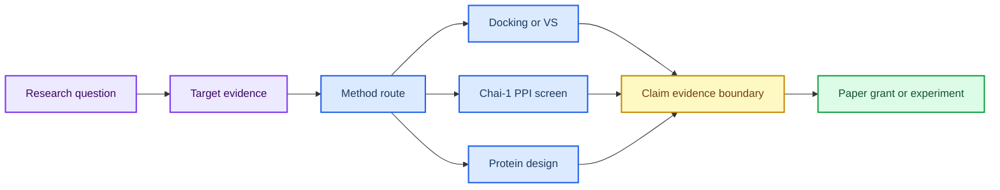

# 第 8 章 研究思路解析：寻靶、虚拟筛选、PPI 与蛋白设计整合

## 本章导读

综合章节最容易把课程范文、文献案例、方法假设和本项目结果混在一起。 研究工作台综合路线中的关键问题不是单个命令或界面能够解决的，而是贯穿输入选择、参数设置、结果解释和后续写作的判断问题。读者进入研究工作台综合路线时，应先把自己放在真实研究任务中：如果明天需要把这一步交给同组同学复核，哪些信息必须留下，哪些说法必须谨慎。

本章把寻靶、结构复核、虚拟筛选、PPI 筛选、蛋白设计、证据 claim 和输出任务组织成研究工作台。 研究工作台综合路线采用教材讲解写法，不把内容压缩成术语表，而是把概念放回它服务的任务场景中解释。读者在研究工作台综合路线中需要关注的不是“记住一个名词”，而是理解它如何限制输入、影响输出、进入质量控制，并支持相应层级的写作判断。

学习研究工作台综合路线时，建议先通读核心概念，再回到方法流程表逐步核对。表格用于快速定位输入、动作、输出和 QC，正文段落则解释为什么这些字段不能省略；在研究工作台综合路线中，这一点应具体落到claim-evidence-boundary 表和项目队列。研究工作台综合路线采用这样的顺序，能避免只会照着流程执行却不知道哪一步决定结果可信度。

本章是从课程讲义走向个人课题设计、综述写作、课题申请和实验队列的入口。 因此，研究工作台综合路线不是孤立的工具说明，而是后续章节继续工作的接口层。读者完成研究工作台综合路线后，应能把本章记录方式转移到下一章，而不是重新发明日志、参数和边界说明。

## 学习目标

围绕研究工作台综合路线，学习目标应落实为可复述、可记录、可复核的判断能力。完成本章后，读者应能够：

- 能把研究问题拆成靶点证据、结构来源、可用方法、证据缺口和下一步实验。
- 能区分第八章补充 PDF 中的文献案例、课程范文和本项目结果。
- 能在项目池中同时管理虚拟筛选、PPI 和蛋白设计路线。
- 能把关键判断写成 claim-evidence-boundary 形式。

在研究工作台综合路线中，这些目标既服务课堂复习，也决定后续记录能否被他人复核；若不能用记录说明输入、动作和边界，本章内容仍应停留在练习层级。

## 知识图谱入口

本章图谱是全书的研究工作台入口。它不新增单一工具，而是把前七章的证据和方法组合成项目路线。

在线书籍页面只引用整理后的 wiki、方法卡、文献笔记和资源页，不直接嵌入原始 PDF 或课件图表；在研究工作台综合路线中，这一点应具体落到claim-evidence-boundary 表和项目队列。需要追溯来源时，应回到 `book/book_map.toml`、章节精读笔记和相关 Zotero/BibTeX 记录；在研究工作台综合路线中，这一点应具体落到claim-evidence-boundary 表和项目队列。

| 来源类型 | 路径 |
|:---|:---|
| 章节来源 | `01_课程章节索引/章节精读/第08章_计算思路解析精读.md` |
| 方法来源 | `02_方法笔记/Chai1互作蛋白虚拟筛选.md`<br>`02_方法笔记/AI多组分对接与虚拟筛选.md`<br>`02_方法笔记/RFdiffusion与蛋白设计.md` |
| 文献来源 | `03_文献笔记/分子对接与虚拟筛选.md`<br>`03_文献笔记/RFdiffusion蛋白设计.md` |
| 实验来源 | `04_实验记录/模板_Chai1互作蛋白虚拟筛选记录.md` |
| 工作台来源 | `07_研究工作台/实体索引.md`<br>`07_研究工作台/证据与claims矩阵.md`<br>`07_研究工作台/研究问题与项目池.md` |

### Imagegen 知识图谱

{ loading=lazy }

| 编号 | 正文权威标签 |
|:---:|:---|
| 1 | 研究问题 |
| 2 | 靶点证据 |
| 3 | 结构来源 |
| 4 | 虚拟筛选 |
| 5 | PPI 路线 |
| 6 | 蛋白设计 |
| 7 | 证据 claim |
| 8 | 输出任务 |

这张图由 Imagegen 生成，用于把研究工作台综合路线中的对象、方法和证据边界先压缩成一张预览图。研究工作台综合路线的精确术语、参数和证据边界仍以表格和正文为准，图像只承担结构化预览作用。

### Mermaid 结构图



研究工作台综合路线的 Mermaid 源图和后续 scientific-schematics prompt 见 [Mermaid 图示与示意图设计](../resources/mermaid-schematics.md)。

## 核心概念

研究工作台综合路线的核心概念应围绕研究问题、靶点证据、方法路线和项目池来读，而不是孤立背诵术语。本章最重要的训练，是把每个名词都对应到一个可检查的输入、一个会改变结果的动作，以及一个必须写入记录的 QC 或边界条件；在研究工作台综合路线中，这一点应具体落到claim-evidence-boundary 表和项目队列。

阅读下表时，可以把研究问题、靶点证据、方法路线和项目池拆成几类检查问题：它约束什么来源，改变什么输出，失败时留下什么证据。这样处理后，概念表就成为claim-evidence-boundary 表和项目队列的索引，而不是定义的堆叠。

| 概念 | 教材化定义 |
|:---|:---|
| 研究问题 | 研究问题应明确对象、疾病/功能场景、候选方法和可验证输出。 |
| 靶点证据 | 靶点证据需要区分数据库线索、文献案例、结构可用性和实验可行性。 |
| 方法路线 | 虚拟筛选、PPI 筛选和蛋白设计是不同路线，输入、输出和验证成本不同。 |
| claim 层 | claim 应同时记录支持证据、证据强度、适用边界和下一步验证。 |
| 输出任务 | 课件、综述、课题申请和实验记录可以共享材料，但写作口径不同。 |

使用这张表时，不需要一次记住所有术语。更实用的做法是，在准备任务时先圈出与本次输入直接相关的 2-3 个概念，再检查记录中是否已经有对应字段；在研究工作台综合路线中，这一点应具体落到claim-evidence-boundary 表和项目队列。对于不直接参与研究工作台综合路线当前任务的概念，可以作为边界提示保留，避免在写作时把背景信息误写成当前结果。

这些概念之间也不是平级堆叠关系。通常先由任务对象确定输入，再由流程参数约束输出，最后由 QC 和证据边界决定能否进入下一步；在研究工作台综合路线中，这一点应具体落到claim-evidence-boundary 表和项目队列。读者如果能沿着研究工作台综合路线的顺序复述本节内容，就已经掌握了把教材知识转化为研究记录的基本方法。

## 方法流程

研究工作台综合路线的方法流程要把从文献案例到下一步实验的项目拆解链讲清楚。读者不应只关心是否跑完命令，而要能说明每一步接收什么输入、执行什么动作、写出什么对象，以及哪一个 QC 决定它能否进入下一步；在研究工作台综合路线中，这一点应具体落到claim-evidence-boundary 表和项目队列。

下表按 `输入 | 动作 | 输出 | QC/边界` 组织，适合在执行前当作检查单使用；在研究工作台综合路线中，这一点应具体落到claim-evidence-boundary 表和项目队列。对于研究工作台综合路线，最后一列尤其重要，因为它把普通操作和可写入研究工作台的证据区分开来。

| 步骤 | 输入 | 动作 | 输出 | QC/边界 |
|:---:|:---|:---|:---|:---|
| 1 | 研究问题 | 定义目标、对象和可产出物。 | 项目问题卡。 | 问题不只是工具练习。 |
| 2 | 证据矩阵 | 收集靶点、结构、文献和方法证据。 | evidence matrix。 | 文献案例与项目结果分层。 |
| 3 | 路线选择 | 选择虚拟筛选、PPI 或蛋白设计路线。 | 方法路径。 | 输入和验证成本明确。 |
| 4 | 候选生成 | 执行或规划 docking、Chai-1、RFD3/RFdiffusion 等步骤。 | 候选表。 | dry-run 与真实运行分开。 |
| 5 | claim 写作 | 把关键判断写成 claim-evidence-boundary。 | claims 矩阵。 | score/affinity/design 不被过度解释。 |
| 6 | 输出交接 | 进入阅读、实验或写作队列。 | 项目池和输出视图。 | provenance 可追溯。 |

执行研究工作台综合路线流程表时，应先完成最小样例，再扩大到批量任务。最小样例的价值不是产生有意义的研究结果，而是验证路径、格式、参数和日志是否能闭合；在研究工作台综合路线中，这一点应具体落到claim-evidence-boundary 表和项目队列。只有当研究工作台综合路线的最小样例能够被完整复核时，后续批量表格、结构、轨迹或候选列表才有进入研究工作台的基础。

流程表也提供了写作时的段落顺序。介绍方法时，先交代输入来源和动作，再说明输出形式，最后说明 QC 含义和不能推出的结论；在研究工作台综合路线中，这一点应具体落到claim-evidence-boundary 表和项目队列。研究工作台综合路线采用这个顺序比先展示结果更稳健，因为它让读者看到判断链，而不是只看到筛选后的结论。

## 代码案例与软件操作

{ loading=lazy }

**寻靶-解码-造器项目路线图** 的编号含义如下：

| 编号 | 流程节点 |
|:---:|:---|
| 1 | question |
| 2 | evidence |
| 3 | target |
| 4 | structure |
| 5 | screen/design |
| 6 | validate |
| 7 | queue |
| 8 | output |

本节用于训练 **8 章 研究思路解析：寻靶、虚拟筛选、PPI 与蛋白设计整合** 的最小复现意识。该示例演示项目优先级排序表的计算方式；真实项目排序需要人工确认证据权重和实验条件。

=== "可复制代码"

    ```python
    import pandas as pd

    projects = pd.read_csv('inputs/project_pool.tsv', sep='	')
    projects['priority_score'] = (
        projects['evidence_strength'] * 0.45 +
        projects['method_readiness'] * 0.35 +
        projects['experiment_feasibility'] * 0.20
    )
    projects.sort_values('priority_score', ascending=False).to_csv('outputs/project_priority.tsv', sep='	', index=False)
    ```

=== "配套文件"

    完整示例文件：[`chapter-08-project-priority.py`](../assets/code/chapter-08-project-priority.py)

    P31 工作台优先级脚本：[`chapter-08-workbench-priority-dry-run.py`](../assets/code/chapter-08-workbench-priority-dry-run.py)。该脚本输出 `evidence_maturity`、`priority_score`、`decision` 和 `boundary_note`，强制区分文献案例、dry-run、本地计算和实验结果。

{ loading=lazy }

| 步骤 | 操作 |
|:---:|:---|
| 1 | 为每个研究问题建立证据矩阵。 |
| 2 | 选择虚拟筛选、PPI 或蛋白设计路线。 |
| 3 | 标注证据成熟度：文献案例、dry-run、本地计算或实验结果。 |
| 4 | 按证据强度和实验可行性给下一步排序。 |

### 教材化阅读提示

本节代码应作为项目优先级排序 dry-run的可复查样例来读。它展示的是如何把研究工作台综合路线中的一次小任务写成可复制、可失败、可追溯的记录，而不是声明已经完成真实研究运行。

替换参数时，应先替换与研究工作台综合路线直接相关的输入路径，再调整会影响解释的阈值、空间范围或模型参数。如果研究工作台综合路线的最小样例尚不能解释输出来源，就不应扩大到批量任务。

解读输出时，只记录代码确实生成的对象，例如 manifest、配置、dry-run 表格、截图或日志；在研究工作台综合路线中，这一点应具体落到claim-evidence-boundary 表和项目队列。这些对象可以支持claim-evidence-boundary 表和项目队列的整理，但不能自动升级为实验结论；需要形成研究判断时，仍要回到实验记录模板补齐输入、QC、人工复核和待验证项。
## 关键文献

<!-- refs:start -->

- Chai Discovery, Boitreaud, J., Dent, J., McPartlon, M., Meier, J., Reis, V. et al. Chai-1: Decoding the molecular interactions of life. bioRxiv (2024). https://doi.org/10.1101/2024.10.10.615955

  **本文内容简介：** 本文介绍 Chai-1 对生物分子相互作用进行统一结构预测和约束建模的方法。

- Sui, Q., Chen, Z., Shan, G., Hu, Z., Jin, X., Liang, J. et al. Targeting UXS1-Dependent Glucuronate Detoxification Potentiates Metformin's Anti-Tumor Efficacy in Lung Adenocarcinoma. Advanced Science, e10542 (2026). https://doi.org/10.1002/advs.202510542

  **本文内容简介：** 本文研究 UXS1 依赖的葡萄糖醛酸解毒通路与二甲双胍抗肿瘤效应的关系。

- Shen, T., Shen, H., Kong, Y., Qiang, W., Yu, X. & Wang, J. Structure-based virtual screening identifies novel small-molecule inhibitors targeting the endonuclease active site of APE1. Scientific Reports (2026). https://doi.org/10.1038/s41598-026-51975-0

  **本文内容简介：** 本文通过结构基础虚拟筛选发现靶向 APE1 内切酶活性位点的小分子抑制剂。

- Tomarchio, E. G., Buccheri, R. & Rescifina, A. A Reproducible Hierarchical Virtual Screening Framework Integrating Scaffold-Aware Machine Learning, Ensemble Docking, and Molecular Dynamics: Application to IDO1. Journal of Chemical Information and Modeling (2026). https://doi.org/10.1021/acs.jcim.6c00967

  **本文内容简介：** 本文提出整合骨架感知机器学习、集合对接和分子动力学的可复现虚拟筛选框架。

- Zhu, Y., Isaha, M. B. & Zhang, X. De novo design of binder proteins targeting Helicobacter pylori adhesin BabA. bioRxiv (2026). https://doi.org/10.64898/2026.05.24.727452

  **本文内容简介：** 本文报道靶向幽门螺杆菌黏附素 BabA 的从头蛋白结合体设计。

- Yang, W., Wang, S., Lee, G. R., Zhang, J. Z., Courbet, A., Juergens, D. et al. The past, present and future of de novo protein design. Nature 652, 1139-1152 (2026). https://doi.org/10.1038/s41586-026-10328-7

  **本文内容简介：** 本文综述从头蛋白设计的发展脉络、当前能力和未来研究方向。

<!-- refs:end -->
## 实验/练习入口

本章练习的重点是把研究工作台综合路线转化成可交接记录。练习完成后，读者应能让另一个人根据记录复现从文献案例到下一步实验的项目拆解链，并判断是否具备进入研究问题与项目池的条件。

建议按以下顺序完成：

1. 从一个补充 PDF 案例中提取研究问题、方法路线和不能迁移的结论。
2. 为一个候选靶点建立 claim-evidence-boundary 表。
3. 把一个项目写入项目池，给出下一步实验、阅读队列和可产出物。

完成练习后，应检查记录中是否包含claim-evidence-boundary 表和项目队列、失败原因和人工判断。缺少claim-evidence-boundary 表和项目队列时，相关内容仍适合作为课堂尝试，不适合写入正式研究结论。

如果练习借用了文献案例或课程范文，应在研究工作台综合路线记录中明确它只是方法参照或边界样例。在研究工作台综合路线中，文献案例可以启发流程设计，但不能替代本项目的本地运行结果。

## 使用边界与常见误读

研究工作台综合路线最容易被误写的对象是文献案例、Chai-1 aggregate score 和研究路线。在研究工作台综合路线中，这些对象看起来像结果，但在当前教材层级通常只是模型输出、流程观察、可视化线索或文献案例。

下表用于训练写作降级。在研究工作台综合路线中，读者应先判断当前证据最多能支持什么说法，再决定是否写成“提示”“支持”“流程参考”或“仍需验证”。

| 易误读对象 | 稳健表述 | 写作处理 |
|:---|:---|:---|
| 文献案例 | 可作为流程和证据组织参考。 | 不能写成本项目已经得到的结果。 |
| Chai-1 aggregate score | 提示多模型或多界面排序线索。 | 不能直接写成 PPI 实验结合强度。 |
| 研究路线 | 支持项目优先级判断。 | 不替代真实实验、伦理和资源条件评估。 |
| 输出整理 | 可服务课件、综述和申请书。 | 不得牺牲 provenance 或混淆来源层级。 |

边界判断并不是削弱研究工作台综合路线的价值，而是说明证据在哪里停止。如果删除某个软件名、截图、分数或文献案例后，结论就无法成立，通常应把该结论降级为候选线索或下一步验证任务；在研究工作台综合路线中，这一点应具体落到claim-evidence-boundary 表和项目队列。

只有当研究工作台综合路线对应的真实运行记录、复核结果和严格计算或实验支持已经进入项目记录，相关判断才适合升级为更强表述。

本章的边界判断最接近真实研究决策。文献案例、Chai-1 aggregate score、项目路线和候选靶点都只能作为证据层的一部分；它们必须与本项目运行记录、可行实验和研究者判断并列，而不能被写成本项目已经完成的发现。

## 延伸阅读与下一步

研究工作台综合路线的延伸阅读应服务下一次可执行任务，而不是停留在资料补充。读者完成本章后，应能判断哪些内容进入claim-evidence-boundary 表和项目队列，哪些内容进入阅读队列，哪些内容只能作为背景案例。

建议按以下路径进入下一轮学习或研究任务：

1. 把最有价值的研究问题写入 `07_研究工作台/研究问题与项目池.md`。
2. 把需要运行的任务写入 `07_研究工作台/实验队列.md`，再进入 `04_实验记录/`。
3. 将可写作内容拆成课件、综述、课题申请和实验记录四类出口。

选择下一步时，应优先检查研究工作台综合路线的证据链是否足以支撑转入研究问题与项目池。若输入来源、参数、QC 或边界尚未记录清楚，应先补齐本章记录，而不是继续叠加更复杂的工具；在研究工作台综合路线中，这一点应具体落到claim-evidence-boundary 表和项目队列。

完成这种转换后，研究工作台综合路线就不只是读过的教材内容，而是可以被检索、复核和继续执行的研究资产。

进入后续课题设计时，读者应把每个问题拆成证据、缺口和下一步实验。若某个方向只能依赖文献案例或模型分数，就应留在项目池中继续补证据，而不是直接进入课题申请或论文结论。
