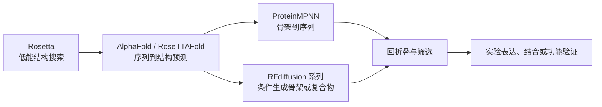
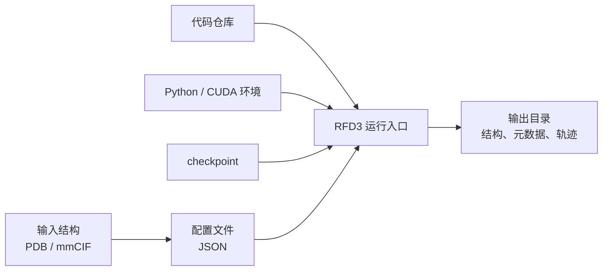

# 第 9 章 生成式蛋白设计基础

## 本章导读

前面几章主要围绕“已有结构和候选分子如何建模、对接、模拟和评价”展开。进入蛋白设计后，问题发生了变化：研究者不再只是评价一个已有复合物是否合理，而是尝试生成新的蛋白骨架、序列或界面，再判断这些设计能不能进入下一轮计算和实验验证。

本章讨论生成式蛋白设计的基础逻辑。读者需要先把四个问题分清：想设计什么，输入约束是什么，模型实际输出了什么，这些输出还需要怎样验证。RFD3 / RFdiffusion3 在本章作为运行和参数案例出现，后文简称 RFD3；更完整的 binder、多肽、迷你蛋白、核酸抑制剂、理论酶和 ProteinMPNN 闭环放在第 10 章。

本章不把 dry-run、预测结构、pLDDT、PAE、iPAE 或 RMSD 写成实验结论。它们可以帮助我们筛掉明显不合理的设计，也可以提示某个候选值得进一步检查，但不能单独证明结合、催化、细胞功能或药物开发价值。

| 本章问题 | 学习任务 | 判断边界 |
|:---|:---|:---|
| 为什么蛋白设计难 | 说清序列、结构、动力学和功能之间的关系 | 生成结构不等于获得功能蛋白 |
| RFdiffusion 系列解决什么问题 | 区分结构预测、inverse folding 和生成式设计 | 不把新方法写成取代旧方法 |
| RFD3 运行前要准备什么 | 识别环境、checkpoint、输入配置和输出目录 | 软件版本和命令需按当前说明复核 |
| 如何选择结合位点 | 从构象、功能、空间和可设计性判断 hotspot | hotspot 只是设计入口，不是功能证明 |
| 如何解释初筛指标 | 区分结构置信度、相对位置、界面和真实亲和力 | 阈值是经验参考，视任务而定 |

## 9.1 蛋白设计范式演进：从 Rosetta 到生成式 AI

蛋白质可以参与催化、分子识别、信号转导、结构支撑和纳米组装。药物化学研究关心蛋白设计，并不是因为“能生成一个三维结构”本身足够有用，而是因为新的折叠、结合界面、功能位点或调控元件可能成为后续实验和药物发现的起点。

蛋白设计的难点来自序列、结构、动力学和功能之间的多层关系。一个氨基酸序列要先能折叠成稳定结构，结构还要在合适构象状态下暴露功能区域，功能区域再与配体、蛋白、核酸或反应中间体形成可验证的相互作用。对酶设计而言，问题还会进一步涉及催化残基定位、过渡态稳定、电子环境和构象动态。

| 设计层级 | 需要回答的问题 | 常见验证方式 |
|:---|:---|:---|
| 序列 | 氨基酸排列是否可能编码目标结构 | inverse folding、回折叠、序列多样性检查 |
| 结构 | 骨架和局部构象是否稳定 | pLDDT、PAE、RMSD、结构可视化 |
| 界面 | 目标区域是否形成合理接触 | hotspot、接触数、氢键、clash、界面面积 |
| 功能 | 是否产生结合、催化或调控效果 | SPR、ITC、BLI、活性实验或细胞实验 |

早期 Rosetta 代表基于物理和统计能量函数的计算设计范式。它通常从目标骨架、局部约束或结构片段出发，通过能量函数和采样策略寻找低能构象或稳定序列。这个范式的优势是物理含义较清楚，适合处理稳定已有折叠、局部结构优化和一些受限设计任务；局限是搜索空间很大，计算成本高，对专家经验依赖强。

AlphaFold 和相关深度学习结构预测模型改变了“给定序列能否预测结构”的能力边界，但结构预测本身并不直接回答“为了某个功能应设计什么序列”。ProteinMPNN 代表另一类 inverse folding 思路：给定蛋白骨架，快速设计更可能稳定该骨架的氨基酸序列。它在现代蛋白设计流程中很关键，但它的任务仍然依赖一个已经定义好的骨架。

| 任务单位 | 输入 | 输出 | 典型误读 |
|:---|:---|:---|:---|
| 结构预测 | 序列或复合物输入 | 预测结构 | 把预测结构当成设计成功 |
| 逆向折叠 | 已有骨架 | 候选序列 | 把稳定骨架序列当成功能序列 |
| 生成式设计 | 条件约束 | 新骨架或复合物候选 | 把计算候选当实验候选 |

生成式 AI 把问题推进到“按条件生成新骨架或新复合物”。RFdiffusion 系列不是只预测自然界已有蛋白，而是学习蛋白结构分布和条件约束，在给定长度、motif、界面或其他约束时生成新的结构候选。这里的关键词是“候选”：模型生成的是计算结构，还需要经过序列设计、回折叠、界面评估和实验验证。

下图概括本章采用的方法谱系。它不是工具优劣排名，而是帮助读者判断一个方法在设计链条中承担哪一段任务。



| 方法阶段 | 主要输入 | 主要输出 | 适合回答的问题 | 不能直接回答的问题 |
|:---|:---|:---|:---|:---|
| Rosetta 时代 | 骨架、片段、能量约束 | 低能结构或优化序列 | 这个结构是否可能稳定 | 是否一定具备目标功能 |
| AlphaFold / ML 时代 | 序列、MSA 或复合物输入 | 预测结构和置信度 | 给定序列可能折叠成什么结构 | 应设计哪条序列 |
| ProteinMPNN | 已有骨架 | 候选序列 | 哪些序列可能稳定该骨架 | 该骨架是否功能有效 |
| RFdiffusion 系列 | 长度、motif、界面、功能约束 | 新骨架或复合物候选 | 如何生成满足条件的结构 | 候选是否真实结合或有活性 |

这一节的判断重点是：看见一个蛋白设计工具时，先问它的输入和输出是什么。输入是序列、骨架、motif、hotspot，还是完整复合物？输出是结构预测、候选骨架、候选序列，还是实验测得的结合结果？只有把任务单位分清，后面的参数和指标才不会被误读。

## 9.2 RFdiffusion 到 RFD3

RFdiffusion 系列的演进可以理解为从 backbone design 向 all-atom 和多分子约束设计扩展。原始 RFdiffusion 主要围绕蛋白骨架生成展开，常见输入包括蛋白长度、对称性、固定 motif 或目标界面。它生成的是 backbone 候选，通常还需要 ProteinMPNN 或类似工具填充序列。

All-atom RFdiffusion 方向进一步引入小分子、金属、核酸、功能 motif 和原子级几何约束。这一步的意义在于，设计目标不再只是生成具有蛋白折叠特征的结构，还开始包含配体周围几何关系、功能位点支架和局部化学环境。它同时带来更高的输入质量要求：约束如果选错，模型可能稳定地生成一个在生物学上没有意义的候选。

RFD3 / RFdiffusion3 在课程材料中被作为面向复杂生物分子体系的全原子扩散生成模型来介绍。本章采用这个表述，但保持边界：RFD3 可以生成结构候选，可以整合蛋白、核酸、小分子或界面约束；它不能单独证明真实亲和力、酶活、细胞内调控或临床价值。

| 阶段 | 核心能力 | 常见输入 | 输出 | 主要验证需求 |
|:---|:---|:---|:---|:---|
| RFdiffusion v1 | 生成蛋白 backbone | 长度、对称性、motif、界面 | 新骨架结构 | 序列设计、回折叠、稳定性检查 |
| RFdiffusionAA | 引入 all-atom 条件设计 | 配体、金属、核酸、功能 motif、几何约束 | 承载功能位点或相互作用位点的结构 | 局部几何、化学环境、界面合理性 |
| RFD3 / RFdiffusion3 | 面向复杂复合物的条件生成 | 功能目标、结合对象、hotspot、复合物约束 | 多链或多组分结构候选 | 结构置信度、界面 QC、实验结合或功能验证 |

从教学角度看，RFD3 的价值在于把“设计任务”显式写入输入文件。读者不仅要会运行命令，还要能检查输入约束是否合理。例如，目标结构是否清理干净，链 ID 和残基编号是否一致，hotspot 是否暴露在表面，设计片段是否与功能区域相容。这些问题比单次生成结果更重要。

后续章节会进入具体任务类型。本章只建立一条原则：RFD3 输出的是计算候选，候选是否进入下一步，取决于输入假设、结构质量、界面合理性和可验证性。

## 9.3 蛋白设计环境配置

生成式蛋白设计通常依赖 Linux 终端、Python 环境、深度学习框架、GPU、结构可视化软件和远程开发工具。环境配置的目的不是“装完所有软件”，而是让一个设计任务能够被记录、复现和排错。

对初学者来说，环境检查应从工作场景开始。是在本地工作站运行，还是通过 VS Code Remote SSH 连接服务器？是在 Jupyter Notebook 中调试配置，还是在终端批量提交任务？输出目录会写到哪里？checkpoint 放在项目目录、用户目录，还是共享服务器路径？这些问题如果没有记录清楚，后续排错会非常困难。

| 模块 | 常用工具 | 在蛋白设计任务中的作用 | 常见风险 |
|:---|:---|:---|:---|
| 操作系统和终端 | Ubuntu / Linux shell | 运行安装、推理和批处理脚本 | 路径、权限、环境变量混乱 |
| 环境管理 | Conda / Mamba | 隔离 Python 和依赖版本 | 多环境混用，解释器选错 |
| 深度学习框架 | PyTorch + CUDA | GPU 推理和模型运行 | CUDA、驱动和 PyTorch 版本不匹配 |
| 开发工具 | VS Code、Jupyter | 编辑参数、调试脚本、查看输出 | 本地路径和远程路径混淆 |
| 结构查看 | PyMOL / ChimeraX | 检查 PDB、界面、clash 和构象 | 只看图片，不检查编号和链信息 |
| 版本管理 | Git | 获取和追踪开源项目 | 代码版本与 checkpoint 不匹配 |

本章建议把环境检查写成一个小型记录表，而不是只保存命令截图。记录表至少包括操作系统、GPU 型号、CUDA 版本、Python 环境名、RFD3 代码来源、checkpoint 路径、输入配置路径和输出目录。这样即使 dry-run 没有生成有效候选，也能知道失败发生在哪一层。

| 检查项 | 记录内容 | 判断方式 |
|:---|:---|:---|
| 运行位置 | 本地、服务器、容器或 Jupyter | 确认路径和权限 |
| Python 环境 | 环境名、Python 版本、主要依赖 | 确认命令调用的是同一解释器 |
| GPU 环境 | 驱动、CUDA、PyTorch CUDA 可用性 | 确认能访问 GPU |
| 模型文件 | checkpoint 目录和文件名 | 确认路径存在且版本匹配 |
| 输入输出 | `config.json`、输入结构、输出目录 | 确认相对路径和绝对路径没有混用 |

软件安装方式随项目版本变化而变化。课程材料中出现的仓库地址、`rc-foundry[all]`、checkpoint 软链接和命令格式，可作为理解任务结构的材料；正式运行前应以对应项目的安装说明和实验室环境为准。本章正文不把这些命令写成已复核的当前版本规范。

## 9.4 RFdiffusion3 安装、调用和参数文件

RFD3 运行可以拆成六个对象：代码仓库、Python 环境、checkpoint、输入结构、参数文件和输出目录。读者先理解这些对象之间的关系，再谈具体命令，会比直接复制安装步骤更稳妥。



RFD3 的输入文件通常采用 JSON 组织任务信息。JSON 的作用不是“更高级”，而是方便把层级信息写清楚，例如输入结构、设计长度、固定区域、可变区域、hotspot、对称性和额外约束。读者检查 JSON 时，应先问“这个文件定义了什么任务”，再问“采样参数怎样影响输出”。

| 对象 | 主要作用 | 写作和运行时要检查什么 |
|:---|:---|:---|
| 输入结构 | 提供 target 或设计背景 | 链 ID、残基编号、缺失残基、保留配体或水分子的理由 |
| JSON 配置 | 定义设计任务 | 长度、contig、hotspot、固定原子、可变序列、对称性 |
| CLI 参数 | 控制采样过程 | `step_scale`、`gamma_0`、`num_timesteps`、`n_recycle` |
| checkpoint | 提供模型权重 | 路径、版本、是否与代码匹配 |
| 输出目录 | 保存结构和元数据 | 结构文件、日志、JSON metadata、是否覆盖旧结果 |

一个最小配置可以只描述设计对象和长度。下面的示例只用于说明 JSON 层级，不代表某个真实项目候选。

```json
{
  "random_design_100": {
    "length": 100,
    "is_non_loopy": true
  }
}
```

参数可以分为两类。第一类写在 JSON 中，回答“设计任务是什么”；第二类通过命令行传入，回答“模型怎样采样”。这一区分很实用，因为任务错误通常来自 JSON，例如 target、hotspot 或 length 设置不合理；采样结果不稳定则可能与 `step_scale`、`gamma_0`、扩散步数或循环精修次数有关。

| 参数类型 | 代表字段 | 主要含义 | 解释边界 |
|:---|:---|:---|:---|
| JSON 配置 | `length` | 生成蛋白残基数 | 控制规模，不保证可折叠 |
| JSON 配置 | `is_non_loopy` | 倾向减少无规卷曲区域 | 影响结构偏好，不等于稳定性证明 |
| JSON 配置 | `contig` | 定义设计片段、保留区域或长度关系 | 编号错误会导致任务含义改变 |
| JSON 配置 | `select_hotspots` | 指定结合热点残基 | hotspot 合理性需结构和功能证据支持 |
| CLI 参数 | `inference_sampler.step_scale` | 影响采样强度和收敛方式 | 值越大通常更保守，但不能代替筛选 |
| CLI 参数 | `inference_sampler.gamma_0` | 影响随机性和结构多样性 | 多样性增加也可能增加失败结构 |
| CLI 参数 | `inference_sampler.num_timesteps` | 控制去噪步数 | 更慢不必然更好 |
| CLI 参数 | `inference_sampler.n_recycle` | 控制循环精修次数 | 可能改善一致性，也增加计算开销 |

正式运行命令需要按当前软件版本复核。本章只保留命令形态，帮助读者理解参数怎样进入任务：

```bash
rfd3 design out_dir=<输出目录> inputs=<配置文件>
```

运行后不应只看输出结构在视觉上是否规整。至少要检查输出目录是否完整，结构文件和 metadata 是否一一对应，是否有报错日志，设计结构是否接近预期区域，是否出现严重 clash、链编号错乱或 target 与生成结构重叠。这些检查决定了结果是否值得进入下一步，而不是决定它已经成功。

## 9.5 蛋白结合位点选择

结合位点选择是设计任务的前置判断。模型可以围绕一个给定区域生成结构，但它不会替研究者证明这个区域一定与功能有关。对药物化学和蛋白工程任务来说，一个可用位点至少要同时满足三类条件：能被设计对象接近，具有可解释的相互作用环境，并且与研究问题存在可追踪的关系。

不同任务关注的位点不同。小分子结合蛋白需要考虑药物、代谢物或辅因子的口袋；蛋白-蛋白 binder 需要关注界面热点和接触面积；酶设计需要围绕催化残基、金属中心或反应几何；核酸结合蛋白需要考虑 DNA / RNA 的形状和电荷环境；变构调控还需要判断目标区域是否与构象变化相关。

| 位点类型 | 典型对象 | 设计目标 | 本章处理方式 |
|:---|:---|:---|:---|
| 小分子结合位点 | 药物、代谢物、辅因子 | ligand binder 或传感器 | 只讲识别原则 |
| 蛋白-蛋白界面 | 受体、抗原、配体蛋白 | binder 或 inhibitor | 只讲 hotspot 判断 |
| 酶活性位点 | 催化残基、金属中心 | 人工酶或活性位点支架 | 细节放第 10 章 |
| 核酸结合位点 | DNA / RNA | 调控蛋白或核酸 binder | 细节放第 10 章 |
| 变构位点 | 构象调控区域 | 调控功能状态 | 只讲证据边界 |

第一步是确认构象状态。同一个蛋白在 apo、holo、active、inactive、open 或 closed 状态下可能暴露不同口袋，界面几何也可能改变。用一个不相关构象选择 hotspot，会让后续设计看似合理，却偏离真正的功能状态。

第二步是确认功能相关区域。已知活性位点、蛋白-蛋白界面、保守残基、构象变化中心和变构调控区域都可以作为候选入口，但它们的证据强度不同。保守性通常提示功能约束，不能直接证明某个残基参与结合；表面疏水斑块可能成为界面热点，也可能只是结构背景。

第三步是判断可设计性。一个位点需要有空间可及性、合适的形状、合理的疏水和极性分布，并且不能明显破坏目标蛋白核心稳定性。对蛋白-蛋白设计而言，平坦表面并不一定不能设计，但通常比有明确热点、凹槽或带电分布的区域更难。

| 判断顺序 | 关键问题 | 不通过时的处理 |
|:---|:---|:---|
| 构象状态 | 这个结构是否对应目标功能状态 | 更换 apo、holo、active 或 inactive 结构 |
| 功能相关性 | 该区域是否有结构、文献或突变线索 | 标记待确认，补证后再设计 |
| 可设计性 | 设计对象是否能接近并形成合理接触 | 调整 hotspot 或改换设计区域 |

下面的选择卡可用于记录本章的通用 hotspot 判断。它不是评分公式，而是帮助读者把证据和假设分开。

| 字段 | 应记录的内容 | 判断边界 |
|:---|:---|:---|
| 目标结构 | PDB / mmCIF 来源、链 ID、构象状态 | 来源结构错误会传递到后续设计 |
| 候选区域 | 残基编号、二级结构、表面位置 | 编号需和输入结构一致 |
| 支持证据 | 文献、突变、已知配体、结构保守性、界面信息 | 证据不足时写“待确认” |
| 可及性 | 是否暴露，设计对象能否接近 | 埋藏残基通常不适合作为直接 hotspot |
| 化学环境 | 疏水、带电、氢键供受体、金属或辅因子 | 化学互补性仍需后续验证 |
| 设计风险 | clash、柔性、构象变化、功能破坏风险 | 风险高时应回到结构准备或换位点 |

本章的基本判断是：hotspot 是设计假设，不是实验结论。它可以来自结构、文献、保守性或功能线索；它是否真的驱动结合或功能，需要突变、结合实验、活性实验或更严格的结构验证。

## 9.6 pLDDT、PAE、iPAE、RMSD 等评价指标

生成式蛋白设计的初筛指标很多，但本章先抓住四个常用概念：pLDDT、PAE、iPAE 和 RMSD。它们分别回答不同问题，不能互相替代。

| 指标类型 | 代表指标 | 回答的问题 | 不能说明什么 |
|:---|:---|:---|:---|
| 结构置信度 | pLDDT | 局部结构预测是否可信 | 真实稳定性、表达量、结合能力 |
| 相对位置误差 | PAE | 结构域或残基组相对位置是否可信 | 界面是否一定有效 |
| 界面相对误差 | iPAE | binder-target 界面取向是否更可信 | 真实 Kd、Ki、IC50 或功能抑制 |
| 结构相似性 | RMSD、TM-score、lDDT | 是否接近设计骨架或参考结构 | 是否有活性、是否特异 |
| 界面质量 | 接触数、氢键、盐桥、clash、埋藏面积 | 界面几何是否合理 | 是否真实结合 |
| 实验亲和力 | SPR、ITC、BLI、Kd、Ki、kon、koff、Delta Gbind | 结合强度或动力学 | 计算指标不能替代这一层 |

pLDDT 主要反映预测模型对局部结构的置信度。对一个 de novo 设计蛋白来说，较高的 pLDDT 可以提示模型认为局部结构较可靠；低 pLDDT 区域则可能对应 flexible loop、N / C 端无序、linker 过长或设计不稳定区域。它不能单独证明蛋白可表达，也不能证明它会结合目标。

PAE 关注残基或结构域之间相对位置的不确定性。有时一个多结构域蛋白每个结构域的 pLDDT 都不错，但结构域之间 PAE 很高，这说明局部折叠可能可信，相对取向仍不稳定。对复合物任务而言，界面区域的 PAE 更需要单独查看。

iPAE 可以理解为界面区域的 PAE 统计，常用于观察 binder-target 界面相对位置是否可信。低 iPAE 提示界面相对取向更稳定，但它仍然是预测置信度，不是真实亲和力。RMSD 则用于比较预测结构和设计骨架、参考结构或目标构象之间的空间差异。低 RMSD 说明结构更接近比较对象，不说明功能已经实现。

| 使用顺序 | 先看什么 | 再判断什么 |
|:---|:---|:---|
| 1 | pLDDT | 设计结构是否存在明显低置信区域 |
| 2 | PAE / iPAE | 结构域或界面相对位置是否可信 |
| 3 | RMSD 和界面检查 | 是否接近设计目标，是否存在 clash 或接触不足 |

课程材料中给出的 pLDDT、iPAE 和 RMSD 阈值可以作为启发式经验。例如，pLDDT 高通常比低更值得继续检查，iPAE 较低通常提示界面相对位置更可信，RMSD 较低说明预测结构更接近设计骨架。但正式筛选时必须写明“视任务而定”。不同长度、柔性、界面类型和设计目标会改变阈值解释。

读者可以用一个三步顺序降低误判。第一步看整体和局部结构是否明显不可靠；第二步看设计对象和 target 的相对位置是否可信；第三步结合界面接触、clash、疏水和极性匹配进行人工检查。只有通过这些计算检查的候选，才值得进入第 10 章的序列设计、回折叠和候选淘汰流程。

## 9.7 随机骨架设计

随机骨架设计适合作为第一个练习，因为它把问题简化到“模型怎样从少量参数生成结构”。这里没有 target，没有真实 hotspot，也没有功能约束。它能帮助读者理解 length、`is_non_loopy`、`step_scale` 和 `gamma_0`，但不能产生可以直接申报为 binder 或功能蛋白的结果。

一个最小随机骨架任务通常先指定长度。加入 `is_non_loopy` 后，模型倾向减少无规卷曲区域，生成更规则的二级结构。`step_scale` 和 `gamma_0` 通过 CLI 采样参数影响结构保守程度和多样性。参数变化带来的输出差异，应通过结构查看和 metadata 记录来判断，而不是只看某一个排名分数。

| 参数 | 主要作用 | 常见解释 | 风险 |
|:---|:---|:---|:---|
| `length` | 控制残基数 | 决定整体规模 | 长度不合适会影响折叠和后续设计 |
| `is_non_loopy` | 减少 loop 倾向 | 更容易得到规则结构 | 过度限制可能降低结构多样性 |
| `step_scale` | 调节采样强度和保守性 | 值较大时通常更保守 | 不能代替结构筛选 |
| `gamma_0` | 调节随机性和多样性 | 值较低时通常更规整 | 多样性不足可能错过可用拓扑 |
| `num_timesteps` | 控制去噪步数 | 影响速度和生成过程 | 更慢不一定更可靠 |
| `n_recycle` | 控制循环精修 | 可能改善一致性 | 增加计算开销 |

下面的配置示例只用于说明随机骨架练习的输入形态。它不包含 target、hotspot 或功能约束。

```json
{
  "alpha_practice": {
    "length": 100,
    "is_non_loopy": true
  }
}
```

如果想观察结构偏好，可以设计三组教学练习：第一组只设定长度，观察模型默认输出；第二组设定 `is_non_loopy=true` 和较保守采样，观察 alpha helix 倾向；第三组放宽 loop 约束，提高多样性，观察 beta-rich 或混合结构的出现概率。每组都应记录配置、输出数量、失败比例、典型结构和人工检查意见。

| 练习目标 | 参数思路 | 主要观察点 | 不能写成什么 |
|:---|:---|:---|:---|
| length-only 随机设计 | 只指定长度 | 输出结构是否完整，是否有明显异常 | 功能候选 |
| 偏 alpha helix 设计 | `is_non_loopy=true`，较保守采样 | 螺旋比例、紧凑性、loop 是否过短 | 高稳定性证明 |
| 结构多样性探索 | 降低保守性，增加随机性 | 拓扑多样性、失败结构类型 | 可结合候选 |

随机骨架练习的输出检查应包括四项：是否生成完整结构，是否存在严重 clash 或断裂，二级结构是否符合预期，metadata 是否能对应到每个结构文件。如果这些基础检查都没有通过，后续序列设计和回折叠只会放大问题。

这一节的下一步不是挑一个视觉上最规整的结构，而是学会写设计记录。记录清楚输入、参数、输出和失败原因，后面进入 binder 或多肽任务时，才能判断问题来自 target、hotspot、参数、序列设计还是回折叠。

## 9.8 设计结果的验证需求

生成式蛋白设计不能停在“模型生成了结构”。一个候选要进入实验队列，至少需要经历目标结构准备、hotspot 选择、骨架生成、骨架初筛、序列设计、回折叠、结构对齐、界面质量评估、综合筛选和实验候选整理。本章只讲这条链条的入口，第 10 章会展开具体任务。

| 阶段 | 目的 | 主要输入 | 输出 | 常见失败 |
|:---|:---|:---|:---|:---|
| 目标结构准备 | 得到可用于设计的 target | PDB / mmCIF、配体、链信息 | 清理后的结构文件 | 链名错、残基编号错、缺失区域未处理 |
| Hotspot 选择 | 指定设计区域 | target、文献、结构分析 | hotspot 残基列表 | 选到埋藏残基或无关构象 |
| RFD3 骨架生成 | 生成结构候选 | target、contig、hotspot、参数 | 设计骨架 | 远离 target、clash、结构漂移 |
| 骨架初筛 | 删除明显失败结构 | RFD3 输出 | 初筛骨架集合 | 只看分数，不看结构 |
| 序列设计 | 给骨架填充序列 | backbone PDB | PDB / FASTA | 序列极端疏水、界面残基不合理 |
| 回折叠验证 | 检查序列是否回到设计结构 | target + 设计序列 | 预测复合物结构 | binder 不折叠或界面偏移 |
| 结构对齐 | 比较设计和预测是否一致 | 设计结构、预测结构 | RMSD / TM-score 等 | 整体接近但界面错位 |
| 界面评估 | 判断接触是否合理 | 预测复合物 | 接触、氢键、盐桥、clash 等 | 界面小、空洞多、极性不匹配 |
| 综合筛选 | 形成候选短名单 | 全部结构和打分表 | top candidates | 单一指标决定候选 |
| 实验整理 | 输出可交付材料 | top 设计 | FASTA、PDB、CSV | 序列格式、标签或编号错误 |

每一步都应能回答四个问题：材料显示什么，方法产生什么，允许怎样解释，还需要怎样验证。例如，RFD3 生成一个靠近 hotspot 的骨架，只能说明在给定输入和参数下生成了一个空间上接近目标区域的候选；它还不能说明这个候选会表达、会折叠、会结合或会产生功能效应。

对药物化学研究来说，候选进入实验前还要考虑可表达性、纯化、稳定性、聚集风险、特异性、免疫原性和 assay 可行性。本章不展开这些实验问题，但读者要知道计算筛选只是从大空间中缩小范围，不能替代实验判断。

第 10 章会从这张验证表继续，分别讨论 RFD3 binder、短肽和超短多肽、迷你蛋白、核酸抑制剂、理论酶，以及 ProteinMPNN / LigandMPNN 和回折叠 QC。学习这些任务前，读者需要先掌握本章的基础边界：生成式模型提供候选，设计记录保留假设，评价指标辅助筛选，最终解释必须回到验证证据。

## 本章小结

生成式蛋白设计把问题从“评价已有结构”推进到“提出新的结构候选”。这种能力很有价值，但也容易让初学者过度解释模型输出。本章的核心不是记住某个参数，而是建立一套判断顺序：先定义任务，再检查输入，再理解模型输出，最后决定还需要哪些计算和实验验证。

本章使用 RFdiffusion 系列建立方法谱系，用 RFD3 说明安装、输入配置和参数组织，用 hotspot 选择说明设计假设，用 pLDDT、PAE、iPAE 和 RMSD 说明计算初筛边界。进入下一章后，这些基础判断会被放入具体设计任务中，形成从骨架生成到序列设计、回折叠和候选淘汰的闭环。
