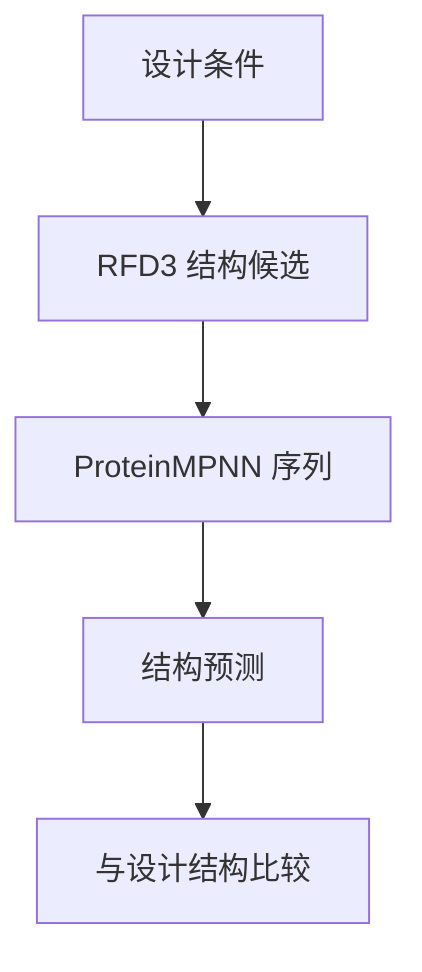

# 第 9 章 生成式蛋白设计基础

## 本章导读

前几章从已有分子或复合物出发，检查它们怎样结合、怎样运动。本章换一个起点：给定长度、目标表面或局部几何，怎样生成一个新的蛋白结构？先分清每个模型接受什么输入，再亲手读取配置和结构文件。第 10 章会在同一个公开骨架上运行 CPU 序列设计。

本章基础练习只需要 Windows 和 Python。下载 [读取脚本](../assets/chapter-09/code/inspect_rfd3.py)、[100 残基配置](../assets/chapter-09/data/random100.json) 和[核对表](../assets/chapter-09/data/inspection_expected.tsv)。结构阅读使用第 10 章提供的 [PDL1 设计结构](../assets/chapter-10/data/pdl1_test_0_model_0.pdb)及[指标文件](../assets/chapter-10/data/pdl1_test_0_model_0.json)。从[练习资源页](https://luvega.github.io/AI_MD/resources/)下载第 9 章压缩包，解压到 `C:/coursework`；包内已包含第 10 章配套结构。进入 `AI_MD_practice/chapter-09/assets` 执行，跨章数据继续放在第 10 章目录。

| 本章任务 | 完成标志 |
|---|---|
| 分清生成、序列设计和结构预测 | 能画出输入与输出的连接关系 |
| 修改一个长度参数 | 脚本读出的长度与自己修改一致 |
| 阅读公开 RFD3 输出 | 找到设计链、靶标链、残基数和断链记录 |
| 诊断一次文件错误 | 能从报错定位到文件名或当前目录 |

## 9.1 蛋白设计范式演进：从 Rosetta 到生成式 AI

一个蛋白设计问题可以拆成三个任务：选择结构形状，为结构选择序列，再预测这条序列形成的结构。Rosetta 的能量函数和采样方法可参与结构与序列优化；ProteinMPNN 从给定骨架设计序列；AlphaFold 等预测方法从序列计算结构；RFdiffusion 系列从条件约束生成结构。它们常在同一流程中协作。

| 方法任务 | 主要输入 | 主要输出 | 本章识别要点 |
|---|---|---|---|
| 物理能量与采样 | 结构、序列、能量函数、约束 | 优化后的结构或序列 | 记录搜索对象和能量项 |
| 结构预测 | 序列、MSA、可选模板 | 预测结构与置信度 | 确认序列身份和组分 |
| inverse folding | 给定蛋白骨架、固定位置 | 候选氨基酸序列 | 保留骨架与序列对应关系 |
| 生成式结构设计 | 长度、motif、靶标、热点等条件 | 新的结构候选 | 先核对条件是否进入输出 |

学习时先画箭头，再看软件名称。例如“新骨架 → 新序列 → 预测结构”包含三次计算。若只完成第一步，记录中就只出现骨架文件；后两步的字段先留空。

## 9.2 RFdiffusion 到 RFD3

RFdiffusion 的早期工作侧重蛋白骨架生成。后续全原子方法把侧链及配体、金属、核酸等环境纳入设计条件。RFD3 是 RFdiffusion3 的常用缩写，官方实现位于 RosettaCommons 的 Foundry 仓库。Foundry 同时组织 RFD3、ProteinMPNN/LigandMPNN 和 RF3 等模型的调用。[Foundry 官方仓库](https://github.com/RosettaCommons/foundry)

扩散模型在训练中学习从加入噪声的结构恢复几何信息。设计时从噪声出发，逐步去噪，由长度、靶标或 motif 等条件引导结构生成。随机种子影响起始噪声，多次采样可以得到不同候选。

RFD3 输出可包含全原子结构和初始残基身份，后续仍可用 MPNN 重新设计序列。理解这一点，再看输出中偏多的丙氨酸就有了具体检查对象：这些残基来自哪个步骤，下一步准备设计哪条链？


```mermaid
flowchart TD
  A[设计条件] --> B[RFD3 结构候选]
  B --> C[ProteinMPNN 序列]
  C --> D[结构预测]
  D --> E[与设计结构比较]
```

先把这个图抄进记录，再为每个箭头补上输入和输出文件名。第 10 章的 PDL1 练习会逐项填好这些位置。

## 9.3 蛋白设计环境配置

基础练习先用现有 Windows Python 环境。打开 PowerShell，输入下面的命令，确认当前目录与解释器。

```powershell
Get-Location
python --version
python -c "import sys; print(sys.executable)"
```

如果 `python` 打开了应用商店，回到第 1 章完成 Python 安装和解释器选择。脚本能运行后，解压本章资源包，核对下面的目录。路径中的文件名要与包内文件一致，不能多出 `.txt` 扩展名。

```text
C:\coursework\AI_MD_practice\
├── chapter-09\assets\code\inspect_rfd3.py
├── chapter-09\assets\data\random100.json
└── chapter-10\assets\data\
    ├── pdl1_test_0_model_0.pdb
    └── pdl1_test_0_model_0.json
```

RFD3 模型运行另用经确认的 Linux/WSL2 或远程 GPU 环境。选择环境时记录操作系统、Python、PyTorch、GPU、模型版本和权重位置。普通电脑先完成配置与输出阅读；3070 8GB 的机器也先从小规模输入检查开始，再根据实际显存记录决定是否运行模型。

| 本次操作 | 环境 | 需要安装什么 |
|---|---|---|
| 读取 JSON、统计 PDB 残基 | Windows Python | Python 标准库即可 |
| 第 10 章两条 CPU 序列设计 | 独立 Python 环境 | NumPy、CPU PyTorch |
| RFD3 或复合物回折叠 | 另行确认的 GPU 环境 | 对应模型、依赖和权重 |

## 9.4 RFdiffusion3 安装、调用和参数文件

先看一个最小配置。JSON 最外层的 `random100` 是任务名；`length` 是设计长度；`is_non_loopy` 控制输出中 loop 区段的偏好。按官方定义，`true` 倾向于产生较少 loop，`false` 倾向于产生较多 loop；不填写时默认是 `None`，不指定这一条件。它不直接指定某段序列必须形成 α 螺旋或 β 折叠。[RFD3 输入字段说明](https://github.com/RosettaCommons/foundry/blob/production/models/rfd3/docs/input.md)

loop 是二级结构分类中的区段名称，并非“残基缺失”的同义词。保存配置后，先预测脚本会读出什么，再运行。

```json
{
  "random100": {
    "length": 100,
    "is_non_loopy": true
  }
}
```

```powershell
Set-Location C:\coursework\AI_MD_practice\chapter-09\assets
python code/inspect_rfd3.py --config data/random100.json --out outputs/random100_check.tsv
```

输出中的 `random100 task 100 recorded` 说明脚本读到了任务和长度。现在把 `100` 改成 `80`，另存为 `random80.json`，再运行一次。核对终端和 TSV 是否都显示 `80`。这个动作完成后，你已能检查配置修改是否真正保存。

再做一次条件对照。保留长度 100，只删除 `is_non_loopy` 这一项，将下面内容另存为 `data/random100_no_condition.json`。注意删除项目前的逗号，否则 JSON 无法读取。

```json
{
  "random100": {
    "length": 100
  }
}
```

```powershell
python code/inspect_rfd3.py --config data/random100_no_condition.json --out outputs/random100_no_condition_check.tsv
```

两份检查结果都应读出长度 100。打开两个 JSON，核对差别只在是否填写该条件。配置读取后，结构结果仍要由模型生成；有 GPU 运行条件时，在相同版本、权重和采样设置下分别生成两组样本，比较实际 loop 比例及结构，而不根据单个样本宣布条件有效。

模型安装和权重获取属于进阶任务。在已经准备好的 GPU 环境中，官方入口为安装 Foundry、查看权重注册表，再下载所需模型。具体依赖要求以所用版本文档为准。[Foundry 安装与模型说明](https://github.com/RosettaCommons/foundry/blob/production/README.md)

```bash
python -m pip install "rc-foundry[rfd3]"
foundry list-available
foundry install rfd3
foundry list-installed
rfd3 design out_dir=outputs/random100 inputs=data/random100.json n_batches=1 diffusion_batch_size=1
```

这里使用默认权重目录 `~/.foundry/checkpoints`，`foundry list-installed` 和模型调用会在同一位置查找。checkpoint 是模型训练所得权重文件；输入 JSON 是本次设计条件，两者用途不同。

`inputs` 指向设计条件，`out_dir` 指向新输出目录。任务文件描述设计什么，命令参数描述采样多少。先使用一个批次、一个样本，保留命令和日志；确认输出结构可读后再扩大数量。教学读取脚本检查 JSON 和文件存在性，模型自身的输入检查还要在对应运行环境中执行。

## 9.5 蛋白结合位点选择

有靶标的任务增加两个问题：模型需要靠近哪个表面，这个表面为什么值得设计？hotspot 是希望候选接触的残基或原子。选位点时先看结构中的链和残基编号，再查局部可及性、已知复合物和功能信息。

第 10 章官方 PDL1 输入采用 `55-88,/0,B1-114`。其中 `55-88` 是新链长度范围，`/0` 表示链分隔，`B1-114` 是保留的靶标片段。配置还列出 B37、B39、B51、B52、B98、B100 的 hotspot 原子。[官方 PDL1 配置](../assets/chapter-10/data/pdl1.json)

| 检查对象 | 亲手查看的方法 | 记录内容 |
|---|---|---|
| 链名与编号 | 用 PyMOL/ChimeraX 打开目标 PDB | 靶标链、残基范围 |
| hotspot 位置 | 选中配置中的残基并显示侧链 | 表面位置、相邻组分 |
| 局部可及性 | 旋转结构、显示表面 | 是否被其他链、糖链或膜遮挡 |
| 设计理由 | 阅读已知复合物和对应研究 | 选位点所依据的结构或实验 |

练习时先选中 B39，再找到配置中的 `OH`。随后检查 B52 的 `ND1` 和 `NE2`。若软件显示找不到原子，先检查你打开的是哪个 PDB、链名是否相同、编号是否被重排。把这次检查写成两行记录，下一章继续用它核对靶标身份。

## 9.6 pLDDT、PAE、iPAE、RMSD 等评价指标

指标先回答具体问题。pLDDT 描述局部结构预测置信度；PAE 描述按指定区域对齐后其他区域的预期位置误差；跨链 PAE 可用于观察两条链相对取向。RMSD 则需要两组已匹配坐标，描述选定原子的空间偏离。计算 RMSD 前要明确比较哪些原子、是否对齐、以哪条链作为参照。

| 指标或文件 | 本次能回答的问题 | 需要一起记录的字段 |
|---|---|---|
| pLDDT | 哪些区域的预测较确定 | 工具、字段名、0–1 或 0–100 的尺度 |
| PAE/界面 PAE | 哪些区域或链的相对位置较确定 | 链顺序、矩阵范围、Å |
| RMSD | 预测与设计的哪部分相近 | 原子匹配、对齐方法、Å |
| RFD3 metadata | 生成器记录了哪些几何统计 | 原始字段和文件来源 |

读取公开 PDL1 输出，不要求运行 RFD3。

```powershell
python code/inspect_rfd3.py --pdb ../../chapter-10/assets/data/pdl1_test_0_model_0.pdb --metadata ../../chapter-10/assets/data/pdl1_test_0_model_0.json --out outputs/pdl1_check.tsv
```

脚本应读出 A 链 77 个残基、B 链 114 个残基，metadata 中 `num_residues=191`、`n_chainbreaks=0`、`non_loop_fraction≈0.8831`。先核对 `77+114=191`，再在结构软件中确认 A/B 两条链。`non_loop_fraction` 是生成器的二级结构相关统计；它和结构预测工具的 pLDDT 属于不同字段。

## 9.7 随机骨架设计

随机长度任务适合练习参数、文件和输出阅读。先做长度变化，再增加靶标约束，能看清每一步新增了什么输入。

| 次序 | 学生操作 | 保存的结果 |
|---|---|---|
| 1 | 读取 `random100.json` | 原配置检查表 |
| 2 | 把长度改成 80，另存后读取 | 修改配置和新检查表 |
| 3 | 复制 PDL1 配置，故意改错 `input` 文件名 | 报错记录 |
| 4 | 修复文件名，再运行检查 | 修复后的表和说明 |

检查 PDL1 配置时，用 `--config ../../chapter-10/assets/data/pdl1.json` 指向原文件；测试副本应与它的靶标 PDB 放在同一目录。第 3 步会出现 `input_missing`，返回码为 1。观察终端的最后几行，再核对配置所在目录和输入文件名。不要一次更改多个参数。第 4 步修好后，用一句话写出“这次错误来自哪里，哪个检查发现了它”。

若已有合适 GPU，可额外运行一个随机骨架样本。保存完整日志和模型版本，再重复本章的残基统计。只有配置检查的同学交配置记录；运行模型的同学另交结构文件与运行记录，两项工作在表中各占一行。

## 9.8 设计结果的验证需求

结构候选进入下一步前，先人工检查整体形状、严重空间冲突、目标表面接触和链身份。随后为新链设计序列，再预测该序列形成的结构，比较靶标对齐后的 binder 位置。

| 当前文件 | 接下来做什么 | 本轮交付 |
|---|---|---|
| 配置 JSON | 核对目标、长度、链、热点 | 配置检查表 |
| RFD3 结构及 metadata | 结构显示、链统计和初步几何检查 | 结构截图和记录 |
| ProteinMPNN FASTA | 核对设计链和候选编号 | 序列表与参数 |
| 回折叠结构 | 对齐、置信度和界面检查 | 候选判断与理由 |

交作业前，把本章的三个动作写清：改过哪个长度、发现过哪个文件错误、从公开结构中读出了哪两条链。第 10 章接着给 A 链配两条序列，并读取它们的真实回折叠；分别比较 A 内部折叠与按 B 对齐后的 A 位置、取向。

## 本章小结

本章把生成式设计拆成可查看的文件和操作。基础练习完成配置读取、参数修改、错误诊断和官方输出阅读；RFD3 新模型运行另列为进阶记录。本章采用官方 Foundry 固定版本的公开示例，本章未重新运行 RFD3。脚本通过仅说明已完成所列文件检查，生成结构、局部置信度和几何指标都不能替代折叠、表达、结合或功能验证。

文件来源、改写方式与 SHA256 见[资产来源表](../assets/chapter-09/provenance.tsv)。官方实现参见 [RFD3 文档](https://github.com/RosettaCommons/foundry/blob/production/models/rfd3/README.md)，下一章使用的结构参见 [PDL1 官方教程](https://github.com/RosettaCommons/foundry/blob/production/models/rfd3/docs/tutorials/binder_design_tutorial.md)。
