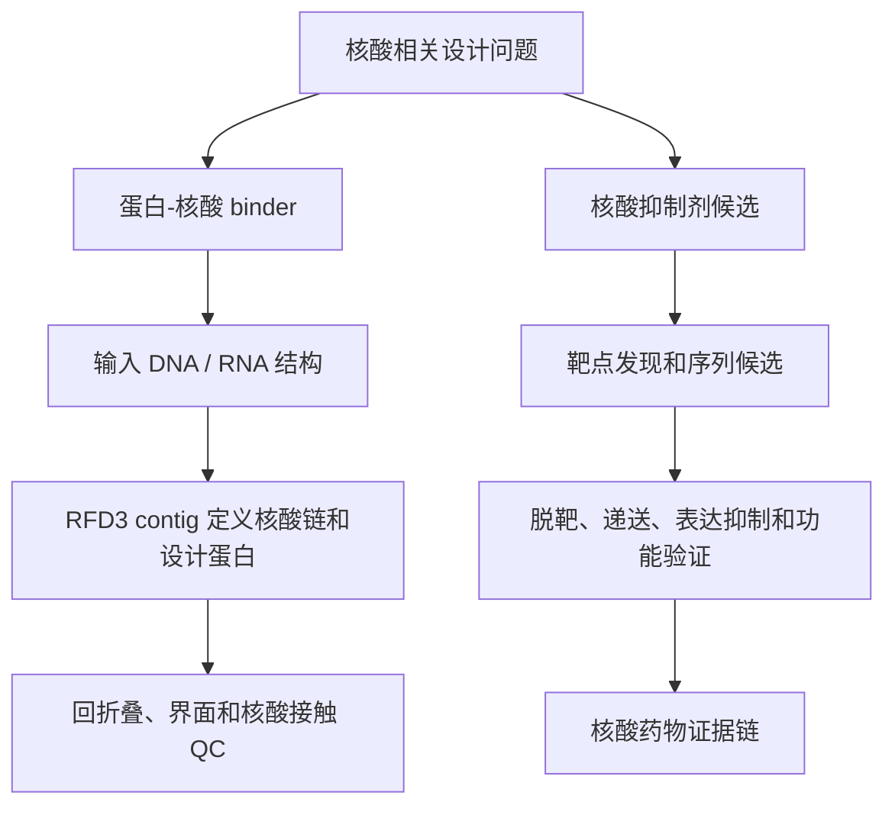

# 第 10 章 RFD3、ProteinMPNN 与多类型设计任务

## 本章导读

第 9 章已经建立了生成式蛋白设计的基础判断：先定义任务，再检查输入，再解释模型输出，最后决定还需要哪些验证。第 10 章把这条判断链放进具体任务中。读者会看到，同样使用 RFD3、ProteinMPNN、LigandMPNN 或 BindCraft，任务对象不同，输入约束、长度范围、筛选指标和证据边界都会改变。

本章讨论 binder、短肽、迷你蛋白、支架引导型结合蛋白、核酸相关设计和理论酶设计。这里的“设计”首先指计算流程中的候选生成和筛选，不等于已经获得功能蛋白、核酸药物或催化活性。RFD3 生成结构候选，ProteinMPNN 或 LigandMPNN 设计序列，回折叠和界面 QC 提供计算复核，实验验证仍是独立证据层。

本章把任务拆成五个问题。

| 问题 | 读者需要学会的判断 | 证据边界 |
|:---|:---|:---|
| 设计对象是什么 | 区分 protein binder、peptide binder、miniprotein、motif scaffold、nucleic-acid binder 和 enzyme scaffold | 任务名不是结果证明 |
| 输入约束是什么 | 检查 target、chain ID、hotspot、contig、motif、核酸链或活性位点几何 | 输入假设错误会传递到所有输出 |
| 模型输出了什么 | 区分 backbone、sequence、refolded model、interface score 和 candidate table | 计算输出不是实验结果 |
| 如何筛选 | 综合 pLDDT、PAE、iPAE、RMSD、界面面积、clash、接触和人工检查 | 阈值只写示例范围，视任务而定 |
| 失败后回到哪里 | 判断应回到结构准备、hotspot、contig、序列设计还是回折叠 | 不把失败结构继续包装成候选 |

## 10.1 RFD3 binder 设计

一个 binder 设计任务通常从很朴素的问题开始：已有一个 target 结构，也知道一个可能影响功能的表面区域，能否生成一个新蛋白去接近这一区域？把这个问题交给 RFD3 前，需要先把自然语言任务转成结构化输入。target 是被结合的对象，binder 是待设计的新链，hotspot 是希望 binder 接触的关键区域，contig 则规定哪些结构片段固定、哪些片段由模型生成。

RFD3 在 binder 任务中主要产生 backbone 或复合物结构候选。这个输出还没有氨基酸序列上的最终解释，也没有证明真实结合。后续通常要进入 ProteinMPNN / LigandMPNN 序列设计、回折叠验证、结构对齐、界面 QC 和实验设计。


RFD3 运行前的检查重点不是“命令能否复制”，而是任务是否写清。下面这张表可作为 binder 输入检查卡。

| 输入对象 | 应记录内容 | 常见风险 |
|:---|:---|:---|
| target 结构 | PDB / mmCIF 来源、链 ID、构象状态、保留组分 | 链名或残基编号错位 |
| hotspot | 残基编号、原子、来源证据、是否暴露 | 选到埋藏残基或无关构象 |
| contig | 固定链、链断裂符、设计链长度、可变区域 | 设计链远离目标界面 |
| checkpoint | Foundry / RFD3 checkpoint 文件路径 | checkpoint 缺失或版本不匹配 |
| 输出目录 | `out_dir`、任务 ID、批次和记录文件 | 覆盖旧结果或无法复现 |

按 2026-06-08 复核的 RosettaCommons Foundry / RFD3 官方文档，Foundry 可用 `pip install "rc-foundry[all]"` 安装全模型，也可用 `pip install rc-foundry[rfd3]` 只安装 RFD3 相关依赖。模型权重通过 `foundry install base-models --checkpoint-dir <path/to/ckpt/dir>` 获取，默认 checkpoint 搜索目录为 `~/.foundry/checkpoints`，也可以通过 `$FOUNDRY_CHECKPOINT_DIRS` 指定其他目录。

下面命令是正文中的可复现模板，不是 AI_MD 当前仓库已经运行的结果。`inputs` 指向 JSON / YAML 设计约束，`out_dir` 是输出目录，`ckpt_path` 是实际 checkpoint 文件，`n_batches * diffusion_batch_size` 决定生成设计数量。正式运行时，还要记录 Foundry 版本、GPU、CUDA / PyTorch 环境、checkpoint 文件名、seed、输入结构和输出路径。

```bash
rfd3 design \
  out_dir=outputs/ch10_ppi_demo/0 \
  inputs=../assets/chapter-10/code/chapter-10-rfd3-ppi-demo.yaml \
  ckpt_path=/path/to/checkpoints/rfd3_latest.ckpt \
  n_batches=2 \
  diffusion_batch_size=4 \
  inference_sampler.step_scale=3 \
  inference_sampler.gamma_0=0.2 \
  prevalidate_inputs=True \
  skip_existing=False
```

运行完成后，第一轮人工检查应很具体：binder 是否靠近 hotspot，是否和 target 产生严重 clash，是否出现松散长 loop，target 构象是否被错误移动，输出结构是否能和 metadata 对上。只要其中任一项不清楚，就先回到输入配置或结构准备，不要直接进入序列设计。

## 10.2 超短多肽和短肽 binder

短肽 binder 不能理解成“把普通 binder 缩短”。长度变短后，候选更依赖少数残基的构象和接触，界面面积通常更小，构象稳定性也更敏感。课程材料把 5-20 残基作为极短肽示例范围，把 20-50 残基作为短肽 binder 示例范围；这些数字适合课堂练习，不是所有靶标的通用标准。

| 任务类型 | 长度示例范围 | 输入重点 | 主要失败模式 | 下一步检查 |
|:---|:---|:---|:---|:---|
| 极短肽 | 5-20 aa | `length`、`is_non_loopy`、采样参数 | 无稳定构象、接触不足、构象漂移 | 回折叠和人工结构检查 |
| 短肽 binder | 20-50 aa | target、hotspot、`contig`、`select_hotspots` | 贴合姿态不稳定、界面太小、极性未配对 | 界面 QC、合成和降解风险评估 |
| 中等 PPI 抑制肽 | 视靶标而定 | 是否占据功能界面或调控构象 | 只贴表面不干扰功能 | 结合实验和功能实验 |

极短肽示例通常只训练读者理解输入形态。它可以生成骨架候选，但没有 target 或功能信息时，不能写成抑制剂候选。

```json
{
  "ultra_short_peptide_10": {
    "dialect": 2,
    "length": "10-10",
    "is_non_loopy": true
  }
}
```

短肽 binder 示例会加入 target 和 hotspot。`select_hotspots` 可以把设计集中到目标区域，但 hotspot 是否真能阻断 PPI、稳定构象或产生功能影响，需要后续结构和实验验证。

```json
{
  "short_binder_20": {
    "dialect": 2,
    "input": "target.pdb",
    "contig": "20-30",
    "select_hotspots": {
      "A15": "CG,CD",
      "A20": "CA,CB"
    },
    "is_non_loopy": true
  }
}
```

短肽筛选时不要只看它是否“贴上去”。较稳妥的顺序是：先看回折叠后肽链是否仍保持合理构象，再看它是否接触预设 hotspot，然后检查 clash、未满足极性残基、疏水暴露和界面空洞。若目标是合成肽，还要把降解、溶解性、聚集和后续修饰需求列为待验证项。

## 10.3 全新迷你蛋白设计

迷你蛋白设计介于短肽和较大 protein binder 之间。它不只是更小的 binder，而是在小体积中同时追求可折叠拓扑和靶标结合界面。设计者需要让有限残基同时承担疏水核心、二级结构、表面极性和界面接触，容错空间比普通 binder 更小。

| 设计对象 | 长度示例范围 | 输入约束 | 筛选侧重点 | 证据边界 |
|:---|:---|:---|:---|:---|
| 较大 protein binder | 约 100-200 aa | target + hotspot + 较长 contig | 界面接触、整体折叠、loop 合理性 | 计算候选，不等于结合 |
| 短肽 binder | 约 5-50 aa | hotspot、短链长度、构象约束 | 构象稳定、少数关键接触 | 不能只靠贴合姿态 |
| 迷你蛋白 binder | 约 30-80 aa | target + hotspot + 紧凑拓扑 | pLDDT、RMSD、iPAE、界面面积和疏水核心 | 阈值只作示例范围 |

课程材料中，较大 binder 的界面面积示例范围可超过 1000 Ų，迷你蛋白界面面积示例范围可落在约 500-800 Ų。迷你蛋白也常被要求更紧凑、更少 loop，并在 pLDDT、RMSD 和 iPAE 上采用更严格的示例范围。正文使用这些数字时，只把它们当课堂示例，不写成统一筛选标准。

C9 miniprotein 文献可作为本节的 benchmark 案例。`li_design_2026` 报道了面向补体 C9 的 miniprotein inhibitor 设计，并把深度学习 scaffold generation、ProteinMPNN 序列设计、结构预测、X-ray crystallography、生化结合和 hemolysis assay 串成一条验证链。这个案例可以帮助读者理解“计算设计如何走向实验验证”，但不能写成 AI_MD 已复现该流程，也不能外推为所有 C9 或补体相关疾病场景都能按同样标准成功。

DNP 阻断肽案例用于展示另一类证据边界。`chen_galectin-related_2025` 报道 LGALSL-vimentin 相互作用与糖尿病相关神经病理性疼痛模型有关，并使用 synthetic peptide PEP1 阻断该相互作用，在该研究模型中缓解机械痛敏。正文可以把它写成“靶点-互作-阻断肽”的疾病机制案例；在未复核全文方法和补充材料前，不把它写成 RFD3 或 miniprotein pipeline 的直接成功案例。

| 案例 | BibTeX key | 可写内容 | 不应写成 |
|:---|:---|:---|:---|
| C9 miniprotein inhibitor | `li_design_2026` | 文献案例中有计算设计、结构和功能验证链 | AI_MD 已复现或通用成功率 |
| DNP / LGALSL-vimentin / PEP1 | `chen_galectin-related_2025` | synthetic peptide 阻断互作并在研究模型中缓解机械痛敏 | 已确认由 RFD3 生成并完成本项目验证 |

迷你蛋白候选失败时，常见回退点有三个。若整体不折叠，回到长度和拓扑约束；若界面过小，回到 hotspot 和 contig；若序列设计破坏核心或界面，回到 ProteinMPNN 固定残基和温度参数。不要只增加生成数量来掩盖输入假设问题。

## 10.4 支架引导型结合蛋白设计

支架引导型设计的核心不是自由生成，而是让新蛋白承载指定 motif、表位几何、活性位点片段或关键界面。motif 是要保留的局部结构或功能几何，scaffold 是承载它的新骨架。RFD3 或 RFdiffusion 系列在这里承担“把约束放进新结构环境”的任务。

| 概念 | 含义 | 检查点 |
|:---|:---|:---|
| motif | 需要保留的残基、侧链、原子几何或结构片段 | 来源、编号和原子定义必须清楚 |
| scaffold | 承载 motif 的新骨架 | 是否可折叠，是否产生不合理拉伸 |
| contig map | 固定段和可变段的组合规则 | 链断裂和残基编号是否正确 |
| fixed residues | 不允许改变的功能或界面残基 | ProteinMPNN 阶段是否被保留 |
| motif RMSD | 设计后 motif 与参考几何的偏离 | 只能说明几何近似，不说明功能 |

这一类任务先问 motif 是否可信。motif 可能来自共晶结构、突变实验、已知活性位点、抗原表位或配体邻近残基。若 motif 来源只是推测，正文应写成“设计假设”；若来源有结构或实验依据，也只说明它可以作为设计约束，不说明新 scaffold 一定具备原功能。

生成后先看 motif 是否保住，再看整体折叠。很多设计在全局结构上看起来稳定，但 motif 侧链方向、原子距离或相对取向已经偏离原假设。对 binder 任务，这会改变界面几何；对酶任务，这会破坏活性位点假设。

| 判断顺序 | 关键问题 | 失败后回退 |
|:---|:---|:---|
| motif 来源 | motif 是否来自可靠结构或实验证据 | 补文献、换结构或改为待验证假设 |
| 编号一致 | 输入结构、contig 和固定残基是否一致 | 重做结构准备 |
| motif 保持 | motif RMSD 和侧链方向是否在示例范围内 | 调整固定约束或采样 |
| scaffold 折叠 | 新骨架是否紧凑、少 clash、可回折叠 | 回到长度、拓扑或序列设计 |
| 功能解释 | 当前证据能否支持结合或催化 | 降级为候选或待验证 |

motif RMSD 小只支持“设计结构保留了几何近似”。它不能证明真实结合、选择性、催化活性或细胞功能。正文写作时，应把 motif scaffold 作为结构约束任务，而不是把它直接写成成功的功能设计。

## 10.5 核酸抑制剂与核酸 binder 设计

核酸相关设计最容易混淆两类任务。第一类是设计蛋白去结合 DNA / RNA 结构，可以称为蛋白-核酸 binder 设计。第二类是设计 siRNA、ASO、decoy oligonucleotide 等核酸分子去抑制转录、RNA 或转录因子网络。本节标题同时保留“核酸抑制剂”和“核酸 binder”，目的是让读者先分清设计对象。



蛋白-核酸 binder 任务有相对明确的 RFD3 输入形式。contig 字符串可用大写字母表示核酸链，用 `/0` 表示链断裂，再接设计蛋白长度范围。`ori_token` 可用于指定扩散区域的起始方向。下面示例来自课程材料的教材化改写，只说明输入组织方式。

```json
{
  "design_0": {
    "input": "./1bna.pdb",
    "contig": "A1-10,/0,B15-24,/0,120-130",
    "length": "140-150",
    "ori_token": [24, 20, 10],
    "is_non_loopy": true
  }
}
```

这个示例表示固定 dsDNA 两条链的一部分，同时设计 120-130 残基的蛋白 binder。生成后要检查蛋白是否接触核酸目标区域，是否产生不合理 clash，正电和极性残基是否与核酸骨架或碱基边缘形成合理接触，以及回折叠后相对取向是否仍可信。

核酸抑制剂路线则是另一类问题。STAT3 可以作为证据边界案例来写：`li_inhibition_2006` 支撑 STAT3 ASO 在 HCC 模型中的早期实验研究，`lau_targeting_2019` 梳理 STAT3 nucleic acid therapeutics 的方法谱系，`proia_stat3_2020` 可作为 danvatirsen / STAT3 ASO 影响肿瘤免疫微环境的文献锚点。它们共同说明 STAT3 可以被核酸药物策略干预，但不支持“本课程已经用扩散模型生成并验证 STAT3 siRNA / ASO 候选”。

| 路线 | 输入 | 需要验证什么 | 本章可写边界 |
|:---|:---|:---|:---|
| 蛋白-核酸 binder | DNA / RNA 结构、contig、设计蛋白长度 | 结构接触、回折叠、界面 QC、结合实验 | RFD3 可作为结构候选生成入口 |
| ASO / siRNA | 靶 RNA / 基因、候选序列、化学修饰假设 | 表达抑制、脱靶、递送、稳定性、功能实验 | STAT3 文献支持核酸药物路线 |
| decoy oligonucleotide | 转录因子结合 motif、核酸结构 | 转录因子结合、竞争抑制、细胞功能 | 需独立核酸药物设计证据 |

课程材料中关于“扩散模型生成 STAT3 siRNA / ASO”的内容，应写成项目设想或待验证路线。肿瘤、炎症、纤维化和神经退行性疾病相关例子可以作为问题场景；缺少正式文献或本项目数据时，不写“低脱靶”“高活性”“适合递送”或“体内有效”。

## 10.6 理论酶与从头酶设计

酶设计比稳定结构设计更难，因为它不只要求蛋白可折叠，还要求底物、过渡态类似物、催化残基、金属或辅因子处在合理空间和电子环境中。一个看起来紧凑的 scaffold，如果不能维持反应所需几何，仍不能支持催化解释。

theozyme 是 theoretical enzyme 的简称，可理解为理想化活性位点模型。它通常包含底物或过渡态类似物、催化残基、关键氢键、酸碱基团、金属或辅因子，以及这些对象之间的距离和角度约束。theozyme 不是完整真实酶，也不包含表达、折叠、动力学和进化可塑性的全部信息。

| 步骤 | 设计问题 | 主要输出 | 证据边界 |
|:---|:---|:---|:---|
| 定义反应 | 反应物、产物和过渡态假设是什么 | 反应模型和关键原子 | 假设需要化学依据 |
| 构建 theozyme | 哪些残基或辅因子参与催化 | 活性位点几何约束 | 几何合理不等于有活性 |
| QM / DFT 团簇 | 活性位点局部电子环境是否合理 | 能量、构型和距离角度 | 团簇模型忽略完整蛋白环境 |
| scaffold 搜索 | 哪种骨架能承载活性位点 | 候选 scaffold | 需要回折叠和几何复核 |
| 序列设计 | 哪些序列能稳定该 scaffold | 候选序列 | 不能替代酶活实验 |
| 功能验证 | 是否催化目标反应 | 活性、选择性、动力学数据 | 需要实验测定 |

在 RFD3 / RFdiffusion 系列流程中，理论酶设计可以写成“活性位点几何约束驱动的 scaffold 设计”。随后用 ProteinMPNN 或 LigandMPNN 设计序列，再用回折叠、motif RMSD、底物方向、催化原子距离和 clash 检查候选。若涉及金属或辅因子，还要记录其坐标、配位状态和是否在序列设计中被保留。

本节最重要的边界是：活性位点几何合理不等于催化活性。QM 团簇可以支持反应假设和局部几何约束，RFD3 可以生成承载约束的结构候选，ProteinMPNN 可以给骨架配序列，但真实酶活、底物选择性、表达、稳定性和可进化性都需要实验验证。

## 10.7 ProteinMPNN、LigandMPNN 和 BindCraft

前面各类 RFD3 任务都会回到同一个问题：骨架生成后，怎样给骨架设计序列，并判断序列是否仍编码目标结构？ProteinMPNN、LigandMPNN 和 BindCraft 应放在这个闭环中理解，而不是当成彼此替代的工具清单。

| 工具 | 输入 | 输出 | 适合放在流程哪里 | 文献锚点 |
|:---|:---|:---|:---|:---|
| ProteinMPNN | 给定 protein backbone | 候选氨基酸序列 | RFD3 骨架生成后 | `dauparas_robust_2022` |
| LigandMPNN | backbone + 配体、金属、辅因子或非蛋白原子环境 | 考虑原子环境的序列 | ligand-aware 或 enzyme pocket 任务 | `dauparas_atomic_2025` |
| BindCraft | target 和 binder 设计流程输入 | one-shot binder 设计候选 | 功能 binder 设计流程参照 | `pacesa_bindcraft_2025` |

ProteinMPNN 的核心问题是“给定骨架，哪些序列更可能稳定它”。运行时应记录 `temperature`、`num_seq_per_target`、`fixed_positions`、`omit_AA / bias_AA`、seed、输入骨架和输出 FASTA。若 motif、活性位点或界面残基必须保留，`fixed_positions` 是否正确比生成序列数量更重要。

LigandMPNN 适合配体、金属、辅因子或非蛋白原子环境不能忽略的任务。它不意味着已经完成药物化学验证，只是让序列设计阶段能考虑这些原子环境。配体质子化、金属配位、辅因子保留规则和口袋邻近残基仍要单独记录。

BindCraft 可作为功能 binder one-shot 设计流程的文献锚点。`pacesa_bindcraft_2025` 是正式发表条目，`pacesa_bindcraft_2024` 可保留 preprint provenance。正文使用时，应把它写成方法体系和流程参照，不写成 AI_MD 已完成同类设计。

| 记录字段 | 为什么要记录 |
|:---|:---|
| `backbone_path` | 确认序列设计来源于哪一个骨架 |
| `fixed_positions` | 防止 motif、活性位点或界面残基被改掉 |
| `temperature` | 解释序列多样性和保守程度 |
| `num_seq_per_target` | 记录每个骨架生成多少序列 |
| `fixed_residue_ok` | 检查关键残基是否保留 |
| `refold_model_path` | 连接序列设计和回折叠验证 |
| `motif_rmsd` / `interface_ok` | 判断功能几何或界面是否保持 |
| `decision` | 给出保留、review 或淘汰理由 |

序列设计完成后，不能只看 ProteinMPNN score 或 FASTA 数量。下一步必须把候选序列回折叠，检查预测结构是否回到目标骨架，关键残基是否保留，界面是否仍然接触 target，以及低置信区域是否影响功能假设。

## 10.8 回折叠、界面 QC 与候选淘汰

回折叠和界面 QC 是本章的收束点。一个候选只有通过多层检查，才值得进入 docking、MD、Boltz2 亲和力预测或实验队列。这里的目标不是得到“完美分数”，而是让每个保留或淘汰决定都有可复查理由。

| 阶段 | 目的 | 输入 | 输出 | 关键检查 | 失败后回退 |
|:---|:---|:---|:---|:---|:---|
| 目标结构准备 | 得到可设计 target | PDB / mmCIF | 清理结构 | 链 ID、编号、缺失、保留组分 | 结构准备 |
| Hotspot 选择 | 指定设计区域 | target、文献、结构分析 | hotspot 列表 | 是否暴露、是否在合理界面 | 位点选择 |
| RFD3 骨架设计 | 生成结构候选 | target、contig、checkpoint | backbone PDB / CIF | 是否靠近 hotspot，是否 clash | contig 或参数 |
| 骨架初筛 | 删除明显失败结构 | RFD3 输出 | 初筛骨架 | 接触、二级结构、紧凑性 | 骨架生成 |
| MPNN 序列设计 | 给骨架配序列 | backbone | FASTA / PDB | 固定残基、序列多样性 | 序列设计 |
| 回折叠 | 验证序列能否编码结构 | target + sequence | 预测复合物 | pLDDT、PAE、iPAE | 序列或骨架 |
| 结构对齐 | 比较设计与预测 | 设计结构、预测结构 | RMSD / TM-score | 全局和界面是否一致 | 回折叠或骨架 |
| 界面 QC | 判断接触是否合理 | 预测复合物 | 界面指标表 | 接触、氢键、盐桥、疏水、clash | hotspot 或序列 |
| 综合筛选 | 形成短名单 | 全部指标和人工检查 | candidate table | 多指标一致性 | 对应失败阶段 |
| 实验候选输出 | 整理可交付对象 | top designs | FASTA、PDB、CSV | 标签、突变、编号 | 记录整理 |

pLDDT、PAE、iPAE、RMSD 和界面面积都只能作为初筛信号。下面的写法只给示例范围，不给统一阈值。真实项目要按靶标、长度、构象柔性、验证层级和实验资源调整。

| 指标 | 示例范围写法 | 可支持的判断 | 不能支持的判断 |
|:---|:---|:---|:---|
| pLDDT | “较高 pLDDT”或“迷你蛋白采用更严格示例范围” | 局部结构预测更可信 | 可表达或真实结合 |
| PAE / iPAE | “界面相对误差较低的示例范围” | 相对取向更可信 | 实测亲和力高 |
| RMSD | “接近设计骨架的示例范围” | 预测结构与设计结构一致性较好 | 功能实现 |
| 界面面积 | “普通 binder 与迷你蛋白采用不同示例范围” | 接触规模是否足够进入 review | 结合强度 |
| 接触和 clash | “接触合理、无严重 clash” | 界面几何可继续检查 | 特异性或体内效果 |

本章建议把候选结论分成 `pass`、`review` 和 `fail`。`pass` 表示计算层面没有明显硬伤，可以进入下一轮验证；`review` 表示存在低置信区、界面不足、motif 偏移或序列风险，需要人工复核；`fail` 表示结构断裂、严重 clash、motif 丢失、回折叠失败或界面完全偏离，应回退到前一步。

| 决策 | 典型条件 | 下一步 |
|:---|:---|:---|
| `pass` | 输入清楚，回折叠和界面 QC 在示例范围内，人工检查无明显冲突 | 进入更高成本计算或实验准备 |
| `review` | 某些指标可用，但存在局部不确定、界面偏小或序列风险 | 人工复核，必要时补一轮设计 |
| `fail` | 骨架、序列、回折叠或界面有结构性失败 | 回到对应阶段，不进入候选表 |

写候选表时，`discard_reason` 比排名更有用。失败原因能告诉读者下一次该改 target、hotspot、contig、采样参数、序列设计还是回折叠设置。没有失败记录的批量设计，很难变成可学习的工作流。

## 关键文献与引用边界

本章文献用于支撑方法背景、案例和证据边界，不用于声明 AI_MD 已经完成真实 RFD3 设计或实验验证。

| BibTeX key | 文献或案例 | 本章使用方式 | 边界 |
|:---|:---|:---|:---|
| `watson_novo_2023` | RFdiffusion 主文献 | 支撑生成式 protein backbone / binder 设计背景 | 不代表 RFD3 全部能力 |
| `butcher_novo_2025` | RFdiffusion3 / RFD3 方法锚点 | 支撑 RFD3 方法背景和记录字段 | 当前按 preprint / posted-content 边界处理 |
| `dauparas_robust_2022` | ProteinMPNN | 支撑骨架到序列设计 | 不证明设计序列有功能 |
| `dauparas_atomic_2025` | LigandMPNN | 支撑原子环境感知序列设计 | 配体或金属化学仍需复核 |
| `pacesa_bindcraft_2025` | BindCraft 正式发表版本 | 支撑 one-shot binder 设计流程参照 | 不写成 AI_MD 已完成同类流程 |
| `pacesa_bindcraft_2024` | BindCraft preprint | 保留历史 provenance | 正式正文优先用 2025 版本 |
| `li_design_2026` | C9 miniprotein inhibitor | 支撑 miniprotein 计算到实验验证案例 | 文献案例，不是本项目结果 |
| `chen_galectin-related_2025` | DNP / LGALSL-vimentin / PEP1 | 支撑疾病机制和 synthetic peptide 阻断案例 | AI 设计细节需全文方法复核 |
| `li_inhibition_2006` | STAT3 ASO in HCC | 支撑 STAT3 ASO 早期实验路线 | 不支撑扩散模型生成结果 |
| `lau_targeting_2019` | STAT3 nucleotide therapeutics | 支撑 ASO / siRNA / decoy 等方法谱系 | 是综述和路线锚点 |
| `proia_stat3_2020` | STAT3 ASO / danvatirsen | 支撑 STAT3 ASO 免疫微环境机制案例 | 不写成 HCC 特异结论 |

若后续生成完整参考文献表，应从 `references/references.bib` 和 Zotero 映射文件生成。正文不手写替代条目，也不把 Zotero item key 当作 BibTeX key。

## 练习入口

本章练习不是要求读者跑大规模 RFD3，而是准备一个可复核的小型设计包。建议从一个 protein binder 或短肽 hotspot 示例开始，完成输入、命令、输出和 QC 记录。

1. 选择一个 target 结构，记录来源、链 ID、构象状态、保留组分和低置信区。
2. 选择 2-5 个 hotspot 残基，说明来源证据和风险。
3. 写一个最小 RFD3 JSON / YAML 输入，明确 `contig`、长度示例范围和输出目录。
4. 使用本章命令模板填写真实 `ckpt_path`、`out_dir` 和运行环境；若不运行，标注“模板未运行”。
5. 生成或模拟一张 QC 表，至少包含 `design_id`、`motif_rmsd`、`refold_rmsd`、`interface_contacts`、`pae_interface`、`discard_reason` 和 `decision`。

练习记录应能交给另一个人复核。对方需要知道这个候选为什么保留、为什么淘汰，或者为什么停在 `review`。如果无法回答，应先补记录，不要进入下一章的自动化工作流。

## 使用边界与常见误读

第 10 章最容易被误读的是“生成”“预测”“评分”和“候选”四类词。它们都属于计算证据层，不能直接替代结合、抑制、催化、递送、动物模型或临床证据。

| 易误读对象 | 稳健表述 | 不应写成 |
|:---|:---|:---|
| RFD3 输出结构 | 在给定输入下生成了结构候选 | 已获得有效 binder |
| hotspot 接触 | 候选接近预设功能区域 | 证明竞争性抑制 |
| ProteinMPNN 序列 | 序列可能稳定给定骨架 | 序列具备功能 |
| 高 pLDDT | 局部结构预测更可信 | 蛋白可表达或高稳定 |
| 低 PAE / iPAE | 相对取向更可信 | 实测亲和力高 |
| 低 RMSD | 预测结构接近设计结构 | 功能已经实现 |
| 界面面积较大 | 接触规模可继续检查 | 真实结合强 |
| STAT3 核酸抑制剂设想 | 文献支持核酸药物路线，课程路线待验证 | 扩散模型已生成并验证 STAT3 候选 |
| DNP PEP1 案例 | synthetic peptide 阻断互作的文献案例 | 本章 RFD3 直接设计成功 |

药物化学和 AI 设计写作要把“材料显示什么、方法产生什么、允许怎样解释、还需要怎样验证”分开。只要缺少实验结合、功能、表达或活性数据，就应使用“候选”“提示”“进入下一轮验证”“仍需验证”。

## 下一步任务

完成本章后，读者应能把一个多类型设计任务拆成输入、生成、序列设计、回折叠、界面 QC 和候选决策。第 11 章会把这些记录字段转成脚本、批处理、Agent 检查和研究工作台；第 12 章再把任务类型放入具体研究路线和项目池。

进入第 11 章前，至少应准备四类材料：RFD3 输入文件或模板、运行命令和环境记录、ProteinMPNN / LigandMPNN 序列设计记录、候选 `pass / review / fail` 表。若某个案例仍缺少证据，应保留“待确认”而不是补写未验证结论。
