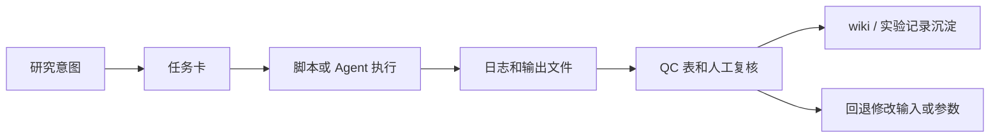
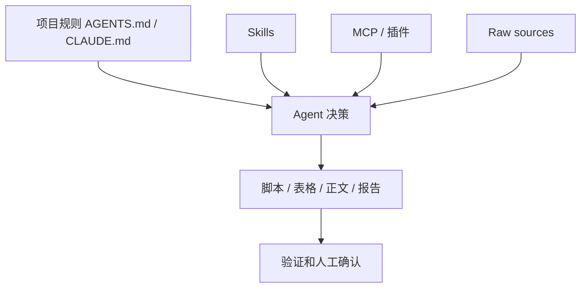
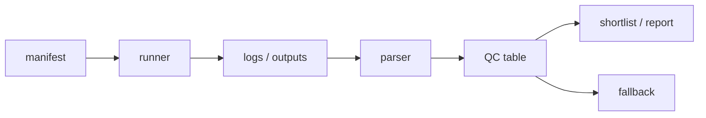
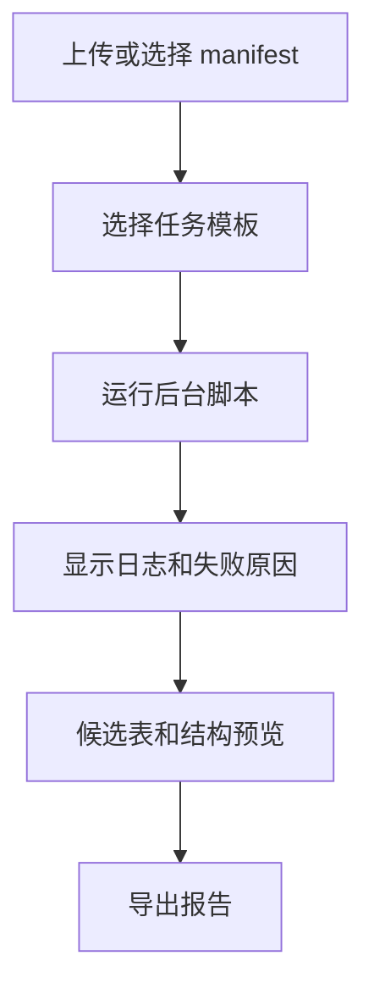
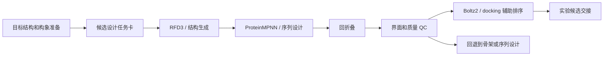

# 第 11 章 VibeCoding、Claude Code 与 AI Agent 工作流

## 本章导读

前面几章已经把 AI 辅助药物设计拆成了多个计算任务：结构准备、docking、MD、MM/PBSA、Boltz2 亲和力预测、RFD3 骨架生成、ProteinMPNN 序列设计和回折叠 QC。真正进入项目时，困难常常不在某一个命令，而在如何把这些步骤组织成可复跑的工作流。

第 11 章讨论 VibeCoding、Claude Code、Codex、MCP、插件和 Skills。这里的重点不是追逐某个工具版本，而是学习一种工作方式：把研究意图写成任务，把任务拆成输入、脚本、日志、表格、图和验证点，再让 AI Agent 帮助生成、检查和维护这些工作产物。

Agent 输出不是证据。一个脚本由 AI 生成，不说明计算结果可靠；一个表格由 Agent 汇总，也不说明候选分子、候选 binder 或设计序列已经有效。可靠的结论仍然来自可追踪文件、运行日志、版本记录、结构复核、统计检查、文献依据和实验验证。

本章先回答五个问题。

| 问题 | 本章要建立的判断 | 证据边界 |
|:---|:---|:---|
| 为什么需要 VibeCoding | 把“写代码”转成“定义任务、拆步骤、验收输出” | AI 不能替代研究判断 |
| 工具怎么选 | 区分网页、IDE 插件、CLI Agent、API 和稳定脚本 | 工具形态会变，选择原则更稳定 |
| Claude Code / Codex 如何进入项目 | 先读规则，再确认权限、上下文、文件边界和验证方式 | 聊天记录不是项目事实 |
| MCP、插件和 Skills 放在哪里 | MCP 连接外部系统，Skills 固化流程，项目规则限制边界 | 不把外部工具输出直接写成结论 |
| 如何形成研究流水线 | 用 manifest、runner、parser、QC 和报告管理批处理 | 预测分数、docking score 和 dry-run 不是实验结果 |



## 11.1 VibeCoding 入门与范式转换

VibeCoding 可以从一个熟悉场景理解。读者已经知道如何手工运行一次 docking，也知道 RFD3 或 ProteinMPNN 需要输入结构、参数和输出目录。但当候选数量从一个变成几十个，任务就变了：要处理路径、批次、环境、日志、失败样本、结果汇总和候选去留。

这时，编程语法仍然重要，但它不再是唯一核心。更关键的问题是：研究者能否把任务说清楚，能否告诉 Agent 什么可以改、什么不能改，能否判断输出是否符合研究目的。

| 层次 | 关注点 | 药物设计中的例子 | 常见失败 |
|:---|:---|:---|:---|
| 语法层 | Python、Bash、R、前端代码 | 写循环、读 CSV、调用命令 | 代码能跑但任务定义错 |
| 任务层 | 输入、工具、参数、输出 | 对哪些配体 docking，保存哪些 pose | 缺少路径、参数或失败处理 |
| 验收层 | 日志、QC、表格、报告 | 标记 `pass / review / fail` | 把 score 当成结论 |
| 沉淀层 | 记录和复用 | 写入实验记录、Skill 或脚本 | 聊天建议没有落地文件 |

VibeCoding 的价值在于让研究者从“记住所有命令”转向“设计可检查的工作流”。这并不降低专业门槛。相反，研究者需要更清楚地描述生物学对象、文件格式、计算假设和验证标准。

例如，一个模糊请求是：“帮我做虚拟筛选。”更好的任务描述是：“读取 `manifest.csv` 中的 50 个配体，对同一受体和同一 box 运行 Vina，保留每个配体的 log、top pose 和 score；失败配体标记为 `Failed`，最终生成排序表，并在报告中说明 score 只能用于候选排序。”后者才适合进入 Agent 或脚本流程。

本节的判断可以压缩成一句话：先定义任务，再写代码；先定义验收，再相信输出。

## 11.2 AI 编程工具类型

AI 编程工具有很多形态。网页聊天、桌面 App、IDE 插件、CLI Agent、API 和稳定脚本都能参与生物计算，但它们适合的任务不同。选择工具时，不要只看模型名，也要看它能否读写文件、运行命令、连接远程服务器、保留上下文和留下可复核记录。

| 工具形态 | 适合任务 | 不适合任务 | 验收方式 |
|:---|:---|:---|:---|
| 网页聊天 / 桌面 App | 讨论方案、解释概念、改写小段文本 | 批量运行、本地路径密集任务 | 保存结论到文件，再人工复核 |
| IDE 插件 | 修改单个项目中的代码、补测试、解释函数 | 大规模跨仓库批处理 | `git diff`、测试和 lint |
| CLI Agent | 搜索项目、写脚本、运行命令、整理结果 | 未定义边界的敏感操作 | 命令日志、输出文件、验证报告 |
| API | 接入自建平台或批量流程 | 需要人工判断很多的探索期任务 | 程序化输入输出和审计日志 |
| 稳定脚本 | 重复执行、超算队列、大规模虚筛 | 尚未定型的探索任务 | 单元测试、manifest 和运行记录 |

对本课程来说，Claude Code 和 Codex 代表的是 CLI / 项目 Agent 这一类工具。它们可以读取项目文件、理解目录规则、生成或修改脚本，并在用户授权下运行命令。它们最适合把“已经描述清楚的计算任务”变成可检查产物。

模型能力会变化，工具界面也会变化。正文不需要记录第三方账号、模型价格、市场链接或临时渠道。公开教材中更稳定的内容是选择原则：是否需要本地文件、是否需要执行命令、是否涉及隐私凭据、是否需要长期复用，以及是否能留下可验证输出。

## 11.3 Claude Code 安装、配置和基础模式

Claude Code / Codex 进入项目后，第一步不是马上写代码，而是理解项目规则。对 AI_MD 这样的教材和知识库项目，Agent 应先读 `AGENTS.md`、`CLAUDE.md`、`大纲.md` 和相关章节大纲，再决定能否写正文、写脚本或运行验证。

本章不把安装命令作为教学重点。官方文档在 2026-06-08 的口径显示，Claude Code 可通过官方安装方式进入本地终端，支持不同权限模式和 MCP 配置；OpenAI 文档把 Codex 定位为可在 IDE、CLI、网页、移动端和 CI/CD 中使用的 coding agent。正文只保留这些稳定定位，不写容易过期的 UI 细节和模型别名。

| 使用环节 | 应做什么 | 为什么 |
|:---|:---|:---|
| 进入项目 | 确认当前目录、项目规则和目标文件 | 防止写错位置 |
| 开始修改前 | 说明要修改哪些文件 | 让用户知道影响面 |
| 运行命令前 | 判断命令是否读写文件、是否会删除或覆盖 | 控制风险 |
| 修改后 | 看 diff、运行验证、列出待确认项 | 让输出可验收 |
| 长对话后 | 清理上下文或分阶段保存产物 | 避免旧信息影响判断 |

权限模式要服务任务风险。计划模式适合先读文件、分析结构和提出方案；默认模式适合需要逐步确认的编辑；自动接受编辑适合小范围、低风险、可由 `git diff` 复核的工作；跳过权限提示只适合隔离环境，不能用于含有真实数据、凭据或重要项目文件的场景。

远程服务器和 SSH 也要按同样原则处理。正文只能写通用安全规则：不要把 SSH key、API key、PAT、数据库连接串或个人服务器路径写入教材；不要让 Agent 复制私密配置；需要远程运行时，记录任务 ID、环境、命令、输入和输出目录，而不是记录凭据本身。

## 11.4 MCP、插件和 Skills

Agent 能力不只来自模型。可靠工作流通常由三部分组成：MCP 或插件连接外部系统，Skills 固化稳定流程，项目规则限制读写边界。三者解决的是不同问题。

MCP 是 Model Context Protocol 的缩写。按官方文档口径，它是连接 AI 应用与外部系统的开放标准。一个 MCP host 是 AI 应用本身，一个 MCP client 负责和某个 MCP server 维持连接，一个 MCP server 向 Agent 提供可发现的工具、资源或提示模板。

| 组件 | 作用 | 生物计算中的例子 | 风险控制 |
|:---|:---|:---|:---|
| MCP server | 提供外部工具、资源或 prompt | 文档检索、数据库查询、GitHub 操作 | 只连接可信 server |
| 插件 | 打包一组工具或技能 | Zotero、GitHub、浏览器、数据分析 | 明确何时调用 |
| Skill | 固化稳定流程 | `vina_batch_docking`、`update-vault` | 写清输入、输出和禁止事项 |
| 项目规则 | 规定本项目怎么工作 | `AGENTS.md`、`CLAUDE.md` | 限制原始资料和正文边界 |



MCP 配置要区分作用范围。local scope 适合个人项目和实验配置；project scope 适合团队共享，但不能提交真实密钥；user scope 适合个人跨项目复用。含凭据的配置应优先用用户级设置或环境变量，公开项目中只保留占位符和说明。

Skills 的价值在于把一次成功的工作流程固定下来。一个好的 Skill 不只是“请你帮我分析数据”这样的提示词，而应包含触发场景、输入要求、输出格式、脚本、模板、失败处理和安全边界。本章新增的 `../assets/chapter-11/code/vina_batch_docking_skill_prompt.md` 就是一个教学模板，它说明如何把批量 docking 任务写成可执行 Skill 要求。

MCP 和 Skills 都不能消除证据边界。它们能让 Agent 更容易访问工具和复用流程，但外部工具返回的内容仍要检查来源、权限、版本和适用范围。对药物设计任务来说，任何预测、模拟或排序结果都不能因为经过 Agent 编排而自动升级为实验结论。

## 11.5 面向生物计算的 Prompt Engineering

面向生物计算的 Prompt Engineering，不是追求漂亮句式，而是把科研任务写成可执行说明书。一个好的 prompt 应该让 Agent 知道要做什么、用什么输入、产出什么文件、如何处理失败，以及哪些解释不能越界。

下面的检查表适合放在每个生物计算 prompt 前。

| 项目 | 应写清楚的问题 | 示例 |
|:---|:---|:---|
| 任务目标 | 想解决什么计算问题 | 批量 docking、汇总 RFD3 QC |
| 输入 | 文件路径、格式、数量、来源 | `receptor.pdb`、多分子 `.sdf` |
| 工具 | 使用哪个软件或脚本 | Vina、Open Babel、Python |
| 参数 | box、阈值、环境、批次 | center、size、`exhaustiveness` |
| 输出 | 文件、表格、图、报告 | CSV、log、pose、Markdown |
| 失败处理 | 单个样本失败怎么办 | 标记 `Failed` 并继续 |
| 禁止事项 | 哪些行为不能做 | 不覆盖原始文件，不写入 token |
| 证据边界 | 输出能说明什么 | score 只用于排序，不是亲和力 |

`vina_batch_docking` 是一个合适的教学例子。课程材料要求它自动检查 Conda 环境、转换受体和配体、逐个运行 Vina、保存 log 和 pose，并汇总排序表。更新后的案例文件进一步加入了安全边界：不移动原始文件，不读取 SSH key、API key 或 token，不把 Vina score 写成 `Kd`、`Ki`、`IC50` 或真实结合自由能。

一个可教学的 prompt 可以这样组织：

```text
请创建一个批量 docking Skill。输入包括 receptor_file、ligand_input、center_coords、box_size 和 output_dir。脚本需要检查环境，保留每个配体的 log、pose 和 top score。单个配体失败时标记 Failed 并继续。最终输出 CSV 和 Markdown 报告。报告必须说明 docking score 只用于候选排序和构象复核，不能解释为实验亲和力。
```

这个 prompt 的关键不是“让 AI 写出很长代码”，而是把任务边界写清。Agent 可以帮助生成脚本，但受体准备、质子化状态、box 选择、金属离子处理、配体构象和结果解释仍需人工检查。

## 11.6 自动化流水线与批处理脚本开发

一次运行可以手工完成，批量任务必须结构化。批处理脚本的核心不是循环，而是 manifest、runner、parser、QC 和 report。manifest 记录每个样本是什么；runner 执行任务；parser 提取结果；QC 判断是否保留；report 让人能快速复核。



`../assets/chapter-11/code/batch_manifest_schema.csv` 展示了一个教学 manifest。它记录 `task_id`、`stage`、`candidate_id`、输入文件、工具、参数、输出目录、预期文件、示例指标、decision、fallback 和 notes。示例行不是本项目真实结果，而是告诉读者怎样组织批处理数据。

| 字段 | 用途 | 写作边界 |
|:---|:---|:---|
| `stage` | 区分 RFD3、ProteinMPNN、Boltz2 等阶段 | 不同阶段不能混用指标 |
| `parameters_json` | 保存关键参数 | 参数不是结果证明 |
| `expected_files` | 定义应出现的输出 | 缺文件时不能继续包装候选 |
| `plddt / ipae / rmsd` | 示例 QC 字段 | 阈值视任务而定 |
| `decision` | `pass / review / fail` | `pass` 也只是进入下一步 |
| `fallback` | 失败后回到哪里 | 防止盲目扩大批量 |

`../assets/chapter-11/code/rfd3_qc_runner.py` 是配套教学脚本。它不运行 RFD3、ProteinMPNN、Boltz2、Vina 或任何外部服务，只读取 manifest，检查预期输出文件是否存在，按透明示例阈值标记 warning，并输出 summary CSV 或 Markdown 报告。

可以这样运行脚本做教学演示：

```bash
python ../assets/chapter-11/code/rfd3_qc_runner.py \
  --manifest ../assets/chapter-11/code/batch_manifest_schema.csv \
  --summary-csv outputs/ch11_qc_summary.csv \
  --report-md outputs/ch11_qc_summary.md \
  --workspace-root .
```

如果示例输出文件不存在，脚本会把对应行标记为 `fail`。这不是错误，而是它在执行应有的 QC：没有结构文件、metadata 或预测输出，就不能把候选写进下一步。这个例子比“展示一个漂亮 top hit”更适合教学，因为它训练读者识别缺失输出和证据不足。

Agent 适合探索期：生成初版脚本、识别日志错误、补字段、写报告模板。稳定后，重复任务应尽量沉淀成可测试脚本。百万级虚筛、超算队列和长期批处理不应依赖 Agent 每次重新推理，而应依赖 manifest、队列系统、固定脚本和版本记录。

## 11.7 数据分析与大分子可视化工具定制

自动化不止生成结果表，还要把结果转成可判断的图和结构视图。同一批计算输出至少应有三类产物：数值表、质量图和代表结构。只有表格没有图，读者难以发现分布异常；只有结构截图没有表格，读者也无法判断候选在整个批次中的位置。

| 任务 | 输入表 | 推荐图 | 结构视图 | 验收字段 |
|:---|:---|:---|:---|:---|
| docking 排序 | `docking_results.csv` | score 分布、top N 条形图 | top pose 和相互作用 | score、pose、失败原因 |
| MD 分析 | XVG / CSV | RMSD、RMSF、Rg、SASA | 代表构象叠合 | 平衡段、聚类、异常帧 |
| RFD3 QC | manifest + metadata | decision 计数、指标散点 | target-binder 界面 | pLDDT、iPAE、RMSD、contacts |
| ProteinMPNN 后处理 | FASTA + 回折叠表 | 序列多样性、回折叠指标 | motif 保留情况 | fixed residue、motif RMSD |
| Boltz2 辅助排序 | ranking / JSON | confidence 和 predicted affinity 分布 | 复合物构象 | confidence、predicted affinity、边界说明 |

可视化脚本也要遵守证据边界。docking 的 top pose 只能支持构象假设；MD 的 RMSD 稳定不等于结合更强；Boltz2 predicted affinity 可用于候选排序或提示，但不能写成本项目实验亲和力。图表的标题和图注都要避免把预测写成验证。

PyMOL 和 ChimeraX 脚本适合和数据表配合使用。Agent 可以帮助生成选择链、标注 hotspot、显示氢键或导出图片的脚本；但每张结构图都要回到原始结构、链 ID、残基编号和任务假设。若链名或残基编号来自不同版本结构，图再漂亮也不能用于判断。

## 11.8 计算小平台开发

当同一类脚本反复使用，可以把它封装成轻量计算小平台。这里的小平台不是为了展示炫酷界面，而是让重复任务有固定入口、固定输出和固定检查点。对药物化学和生命科学学习者来说，最有价值的是少输错路径、少漏看日志、少混淆结果边界。

一个最小候选筛选工作台可以包含这些部分。

| 模块 | 功能 | 不应隐藏的内容 |
|:---|:---|:---|
| 输入区 | 选择 manifest、结果目录和任务类型 | 输入路径和文件格式 |
| 参数区 | 设置阈值、筛选阶段和输出目录 | 阈值来源和适用范围 |
| 运行区 | 调用已有脚本并显示状态 | 实际命令和日志 |
| 结果区 | 展示候选表、失败原因和 top 结构 | 原始文件链接 |
| 导出区 | 生成 CSV、Markdown 或图 | 证据边界和待确认项 |



平台后台应尽量调用已有脚本，而不是把关键逻辑藏在界面里。比如第 11 章可以把 `rfd3_qc_runner.py` 作为后台脚本，前端只负责选择 manifest、运行脚本和展示 summary。这样读者仍能在命令行复现同一结果。

安全边界同样重要。平台不应保存个人 SSH key、API key、token、PAT 或数据库连接串；不应默认上传原始 PDF、课件截图或私有结构文件；不应把远程服务器路径写进公开教材示例。公开正文只写通用安全原则，真实部署需要另建私有配置和权限审计。

## 11.9 AI 结构批量预测与序列设计流水线

本章最后回到药物设计主线。RFD3、ProteinMPNN、Boltz2、docking 和 MD 可以连接成一条结构与序列候选流水线，但它必须是可审查的流水线，而不是连续调用工具的黑箱。



每一步都要记录输入、工具版本、参数、输出文件、日志、decision 和 fallback。失败不是流程外的意外，而是工作流的一部分。hotspot 不合理时回到结构准备；回折叠失败时回到序列设计；界面 QC 失败时回到骨架生成或筛选标准；预测置信度不足时不能继续写成实验候选。

| 阶段 | 输入 | 输出 | QC 问题 | 回退位置 |
|:---|:---|:---|:---|:---|
| 目标准备 | PDB / mmCIF、构象、链 ID | 目标结构和 hotspot | 链和残基是否正确 | 结构准备 |
| 骨架生成 | target、contig、参数 | RFD3 结构候选 | 是否接触 hotspot，有无 clash | hotspot 或参数 |
| 序列设计 | backbone、固定残基 | FASTA 和序列批次 | 固定残基是否保留 | ProteinMPNN 参数 |
| 回折叠 | 序列和复合物输入 | 预测结构 | RMSD、pLDDT、iPAE 是否合理 | 序列设计或骨架生成 |
| 辅助排序 | 结构、pose、预测输出 | shortlist | score 是否被越界解释 | 人工复核 |
| 实验交接 | 候选表和报告 | 实验队列 | 是否有足够证据进入实验 | 补验证或降级 |

Agent 和 Code 在这条流水线中分工不同。Agent 适合帮助解释需求、生成模板、排查日志、整理报告和更新记录；稳定 Code 适合反复运行、队列调度、批量处理和大规模筛选。探索期选 Agent，量产期选 Code，这一原则比某个工具界面更重要。

本章的结论不是“AI Agent 让药物设计自动化完成”，而是：Agent 可以帮助研究者把复杂计算流程变成可读、可跑、可查的工作台。真正决定结论强度的，仍然是输入是否正确、记录是否完整、指标是否合适、边界是否清楚，以及后续实验是否能验证。

第 12 章将在这个基础上，把课程方法接入具体研究路线、文献案例、项目池和下一步实验。到那里，读者要做的不只是运行工具，而是判断哪些问题值得做，哪些证据足以推进，哪些候选应该停在待确认区。
