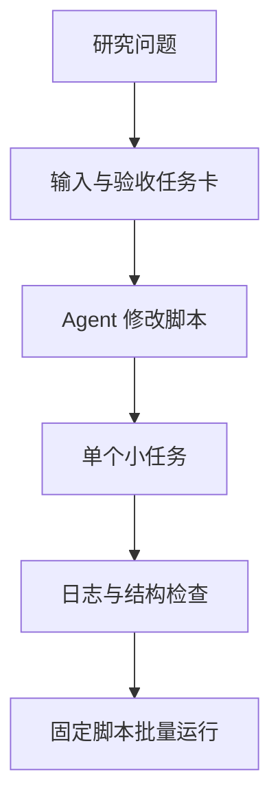
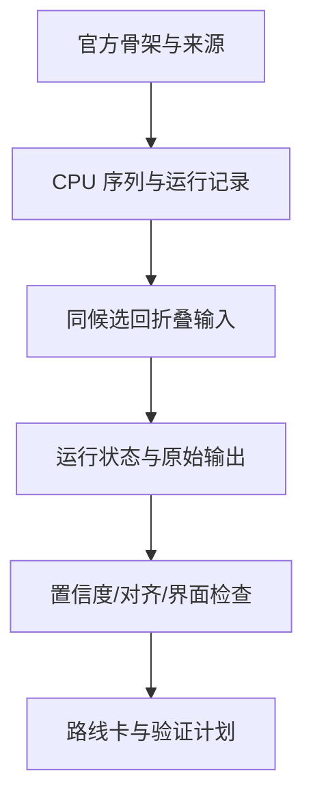

# 第 11 章 VibeCoding、Claude Code 与 AI Agent 工作流

## 本章导读

单个计算能完成后，新的困难通常来自重复工作：输入很多、路径易混、日志难查、候选表缺列。AI 编程工具可以帮助拆任务、改脚本和检查记录。本章用两个已存在的流程练习：第 4 章 3HTB 三分子 Vina 任务，第 10 章 PDL1 骨架与两条序列。

先运行一个已知小任务，再让 Agent 帮你整理批处理。基础练习可在 Windows 完成；即使没有 AI 编程账号，也能直接运行本章 Python 脚本。

| 交付 | 本章提供的入口 |
|---|---|
| 一个可复跑的任务说明 | [公开 Vina prompt](../assets/chapter-11/code/vina_batch_docking_skill_prompt.md) |
| 一张有来源与执行状态的 manifest | [PDL1 manifest](../assets/chapter-11/data/pdl1_manifest.csv) |
| 一份文件检查报告 | [QC 脚本](../assets/chapter-11/code/rfd3_qc_runner.py) |
| 一条故障记录 | [故意写错路径的练习行](../assets/chapter-11/code/batch_manifest_schema.csv) |

从[练习资源页](https://luvega.github.io/AI_MD/resources/)下载本章压缩包，解压到 `C:/coursework`。包内已经包含第 4 章和第 10 章的配套文件；保留章节目录，以便 manifest 找到它们。

## 11.1 VibeCoding 入门与范式转换

本章把 VibeCoding 用于描述一种交互写代码的方式：先用语言说明任务，让模型生成或修改代码，再通过执行和检查修正。学习者仍要认识输入、输出、变量、路径和错误信息，这些内容决定能否验收脚本。

把“帮我批量对接”改成可执行任务时，先写六项：受体、配体、网格、工具、输出目录、验收。然后只让 Agent 读文件并说明计划。确认它识别的是已有 3HTB 输入，再进入一个 JZ4 的运行。


```mermaid
flowchart TD
  A[研究问题] --> B[输入与验收任务卡]
  B --> C[Agent 修改脚本]
  C --> D[单个小任务]
  D --> E[日志与结构检查]
  E --> F[固定脚本批量运行]
```

练习时给自己保留一个预测：这条命令会新增哪几个文件，遇到哪个错误应先查看哪个 log？运行后逐项核对。这样每轮交互都留下可检查的变化。

## 11.2 AI 编程工具类型

选工具时先看操作对象。讨论方法可以用聊天界面，修改脚本可以用编辑器中的 Agent，跨文件搜索和运行命令可用项目式编程工具，固定批次最终可交给脚本。

| 工作 | 适合入口 | 验收对象 |
|---|---|---|
| 解释报错、讨论流程 | 网页或桌面聊天 | 解释是否对应实际报错 |
| 修改局部脚本 | IDE 中的编程助手 | 代码差异与一次小运行 |
| 读取目录、编辑和执行 | Claude Code、Codex 等项目 Agent | 文件、命令、日志和输出 |
| 重复同一协议 | Python 或队列脚本 | 每个输入的执行记录 |
| 接入自建程序 | API | 请求记录、返回格式和成本 |

本章不要求同时安装多种工具。先选一个能够读取练习目录的入口，完成单任务和 manifest 检查后，再考虑外部连接或平台开发。

## 11.3 Claude Code 安装、配置和基础模式

Claude Code 可在 Windows 原生环境使用，也可在需要 Linux 工具链时进入 WSL2。本章采用 PowerShell。按官方安装说明可通过 WinGet 安装，完成后重新打开终端并查看版本；已安装的同学直接检查版本即可。[Claude Code 官方安装说明](https://code.claude.com/docs/en/setup)

```powershell
winget install Anthropic.ClaudeCode
claude --version
Set-Location C:\coursework\AI_MD_practice\chapter-11\assets
claude
```

首次使用按工具提示完成登录和访问配置。进入会话后，先发一个只读任务：

> 读取本目录的 code 和 data 文件，说明 QC 脚本接受哪些参数、manifest 中有多少个阶段。先给出文件依据和执行计划。

工具的具体模式名称可能变化，操作时按当前界面选择“先规划”或“允许执行本次目录中的操作”。不必记住截图中的按钮位置。要检查的是 Agent 实际读取了哪些文件、准备运行哪个解释器、将输出写到哪里。

| 初次操作 | 自己核对 |
|---|---|
| 阅读任务目录 | 引用的文件确实存在 |
| 提出修改 | 能看见修改前后差异 |
| 执行小任务 | 命令、返回码和输出可复查 |
| 结束交互 | 执行记录可由终端重新运行 |

## 11.4 MCP、插件和 Skills

MCP 是 AI 应用连接外部数据和工具的协议。连接器提供具体读取或操作能力；插件组织一组能力；Skill 将可重复任务的说明、脚本和检查要求组织起来。项目规则文件记录本项目约定。[MCP 官方说明](https://modelcontextprotocol.io/docs/getting-started/intro)

| 对象 | 在本章任务中的作用 |
|---|---|
| 项目规则 | 规定输入位置、输出目录和记录方式 |
| Skill | 固定已跑通的任务步骤与验收 |
| MCP/连接器 | 连接结构数据库或其他外部服务 |
| 普通脚本 | 确定地执行同一输入协议 |

先使用本地脚本完成练习，再决定是否需要 Skill。一个适合保存为 Skill 的流程应至少包含输入参数、依赖、完整命令、输出结构、失败处理和验收；只写“自动筛选优秀候选”无法直接执行。

可以在练习目录写一份简短规则：输入文件保留；每次运行使用新输出目录；记录软件版本和参数；分数保持字段名与单位；遇到异常先查看日志。下一次让 Agent 读规则后，再开展同一流程。

## 11.5 面向生物计算的 Prompt Engineering

好的任务说明要让接手者知道已有条件和停止位置。下面先说明 3HTB 已有文件，再指定动作。更完整、可下载的说明见[公开任务 prompt](../assets/chapter-11/code/vina_batch_docking_skill_prompt.md)。

> 沿用第 3 章 3HTB 受体、网格和 JZ4/IPH/BNZ PDBQT。使用第 4 章 run_vina_case.py，先对 JZ4 做一次小运行，检查 log、pose 和晶体坐标系内的重原子 RMSD。通过后，用相同参数跑三分子批次。每次使用新输出目录，保存每个 log、pose、返回状态、分数和运行参数。遇到失败先报告日志位置，一次只改一个条件。

这段说明已经给出输入、稳定脚本、执行顺序和验收。让 Agent 补充计划时，核对它是否沿用已准备的受体，而不是另写一套未经检查的 PDBQT 转换方法。

| 容易缺失的字段 | 补全方法 |
|---|---|
| “使用 Vina” | 写清版本与可执行文件路径 |
| “批量对接” | 写清配体列表和每个输出状态 |
| “比较结果” | 写清同一受体、网格、化学状态、seed 与单位 |
| “自动修复” | 写清错误日志和一次改变一个条件 |
| “给出结论” | 指定结构检查和下一步验证读数 |

学生把实际目录填进任务说明后，先请 Agent 列出所需文件。缺文件时回到对应章节下载或准备，避免在运行过程中临时补换输入。

## 11.6 自动化流水线与批处理脚本开发

先完成 JZ4，再扩大为三个配体。沿用第 3 章准备输入和第 4 章 Python 环境，把 `$pythonExe` 改成课程工作目录中 `.venv-win` 的 Python，把 `$vinaExe` 改成你已下载的 Vina 可执行文件。以下命令从 `chapter-11/assets` 执行，示例环境位置沿用第 1 章的 `C:\coursework\ai-md`。

```powershell
$pythonExe = "C:\coursework\ai-md\.venv-win\Scripts\python.exe"
$vinaExe = "C:\coursework\ai-md\tools\vina_1.2.7_win.exe"
& $pythonExe -c "import sys, rdkit, meeko; print(sys.executable)"
& $pythonExe ../../chapter-04/assets/code/run_vina_case.py --vina $vinaExe --inputs ../../chapter-03/assets/data/3htb --out outputs/vina-jz4 --ligands JZ4 --cpu 2 --seed 20261002 --exhaustiveness 16
& $pythonExe ../../chapter-04/assets/code/run_vina_case.py --vina $vinaExe --inputs ../../chapter-03/assets/data/3htb --out outputs/vina-three --ligands JZ4 IPH BNZ --cpu 2 --seed 20261002 --exhaustiveness 16
```

已有结果供核对：[真实结果 TSV](../assets/chapter-04/results/3htb-cpu-seed20261002/docking_results.tsv)、[JZ4 RMSD](../assets/chapter-04/results/3htb-cpu-seed20261002/JZ4_redocking_rmsd.json)及[运行参数](../assets/chapter-04/results/3htb-cpu-seed20261002/run_parameters.json)。本次 Vina 1.2.7 CPU 运行的 JZ4 模式 1 score 为 −7.190 kcal/mol，晶体坐标系内、无拟合、考虑对称性的重原子 RMSD 为 0.4946 Å。三个分子都保留独立 log 和 pose。

| 批次检查 | 亲手核对 |
|---|---|
| 输入数与状态数 | 三个配体应有三行结果 |
| score 来源 | 打开每个 log，找到模式 1 |
| pose 文件 | 每个输出路径都能打开 |
| JZ4 参照 | 核对参照配体身份与坐标系 |
| 下一次运行 | 换新目录，保留本次记录 |

再读取 PDL1 的四行 manifest。下载[manifest](../assets/chapter-11/data/pdl1_manifest.csv)和[QC 脚本](../assets/chapter-11/code/rfd3_qc_runner.py)，用 `--workspace-root` 明确指定第 10 章文件位置。

```powershell
python code/rfd3_qc_runner.py --manifest data/pdl1_manifest.csv --workspace-root ../../chapter-10/assets --summary-csv outputs/pdl1_qc.csv --report-md outputs/pdl1_qc.md
```

结果应为骨架、序列与两个回折叠阶段均 `ready`。manifest 的回折叠行同时要求 CIF、confidence、PAE 与逐残基 pLDDT 文件，以及真实置信度、内部 RMSD 和靶标对齐后 RMSD。`ready` 记录所列文件与必需字段齐全；执行失败写 `failed`，尚未运行写 `pending`，声称完成却缺文件或必需数值写 `incomplete`。

现在运行[故意错写路径的练习行](../assets/chapter-11/code/batch_manifest_schema.csv)。先预测结果，再执行。

```powershell
python code/rfd3_qc_runner.py --manifest code/batch_manifest_schema.csv --workspace-root ../../chapter-10/assets --summary-csv outputs/fault_qc.csv
```

这行明确标为 `constructed_fault_exercise`，期待一个不存在的 CIF，输出应为 `incomplete`。把 `expected_files` 改成真正的文件名再试一次。随后复制 PDL1 manifest，将候选 1 的 `output_dir` 改成不存在的候选目录，保留 `completed`，观察为何仍判为 `incomplete`。恢复路径后，再清空该行的靶标对齐 RMSD，检查必需字段缺失怎样被发现。所有改错只发生在副本。

## 11.7 数据分析与大分子可视化工具定制

结果表与结构一起看，更容易发现不一致。三分子 Vina 表先核对原数值，再画按配体排列的 score 图；PDL1 表先统计执行状态，再读取第 10 章的两类 RMSD。两条回折叠都能通过文件 QC，但候选 1 按靶标对齐后的设计链偏差为 16.38 Å，候选 2 为 4.81 Å。让 Agent 显示同一视角的叠合图，再由学生提出候选复核理由。

| 材料 | 可做的小工具 | 人工核对 |
|---|---|---|
| Vina TSV | 整理分数、状态和 pose 链接 | 与三个 log 对照 |
| PDL1 manifest 与 RMSD 表 | 按阶段统计状态，绘制两类偏差 | 与同候选文件、分析记录和结构图对照 |
| ProteinMPNN FASTA | 统计长度和变化位置 | 设计链是否为 A |
| 结构文件 | 着色链、显示热点与接触 | 链名、编号、原子名 |

给 Agent 的可视化任务应写具体，例如“按 ligand_id 原顺序作图，纵轴写 Vina score (kcal/mol)，失败或缺测保持空值”。生成后先检查轴和单位，再选一个数值与原日志对照。

结构截图也从一个明确问题出发。显示 PDL1 B39 与 A 链邻近残基，旋转到能看清接触的位置，再记录软件选择语句。不要只交一张未标链的整体结构图。

## 11.8 计算小平台开发

脚本反复使用后，可以增加简单入口。先设计一个页面或本地表格，让用户选择 manifest、输出目录和运行按钮，显示日志与结果路径。后台继续调用已验证的脚本。

| 功能 | 第一版做到什么 |
|---|---|
| 输入 | 选择 manifest，显示字段和行数 |
| 参数 | 显示工作目录与输出目录 |
| 运行 | 调用 QC 脚本，保存实际命令 |
| 结果 | 展示状态、缺失文件和下一动作 |
| 导出 | 提供 CSV 和报告文件 |

基础作业只画出这个页面的布局，并用终端完成同样操作。进阶作业再实现本地页面，要求同一 manifest 在页面与终端得到一致结果。先保证结果可复查，再增加结构预览和远程队列。

## 11.9 AI 结构批量预测与序列设计流水线

在设计流程中，manifest 把一个骨架、两条序列与各自回折叠连接起来。候选 ID 一旦确定，后续文件、指标和人工判断都按这个 ID 保存。扩大批次前，先检查一个候选的整条链。


```mermaid
flowchart TD
  A[官方骨架与来源] --> B[CPU 序列与运行记录]
  B --> C[同候选回折叠输入]
  C --> D[运行状态与原始输出]
  D --> E[置信度/对齐/界面检查]
  E --> F[路线卡与验证计划]
```

本章作业包含一段已填目录的任务说明、一份真实 manifest、一份 QC 输出和一条故障记录。能从结果行返回原日志和结构，再到第 12 章安排下一步。

## 本章使用说明

Agent 可以修改代码和整理执行记录，验收仍以输入、实际命令、日志、结构与数值为依据。本章 `ready` 仅指列出的阶段文件和必需字段齐全；`pending` 保留未运行工作。Vina score、结构预测、MPNN score 与计算 QC 用于计算检查和候选安排，实验结合与功能另需验证。故障行是明确构造的排错练习，PDL1 骨架是官方输出、序列是本教材 CPU 实跑，两者来源分别记录。连接外部服务前应确认上传对象与成本；课程录播、课件和私人项目资料继续留在本地。

全部练习资产的来源、类型与 SHA256 见[来源表](../assets/chapter-11/provenance.tsv)。固定流程保存成 Skill 前，先完成本章单任务、批次和故障三项验收。
