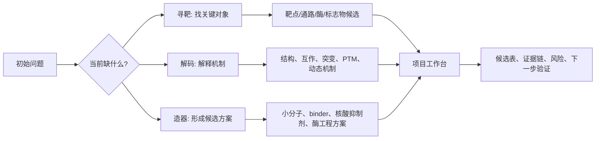
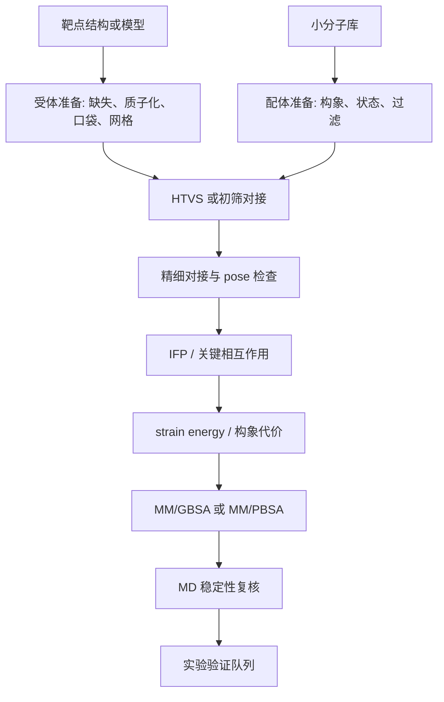
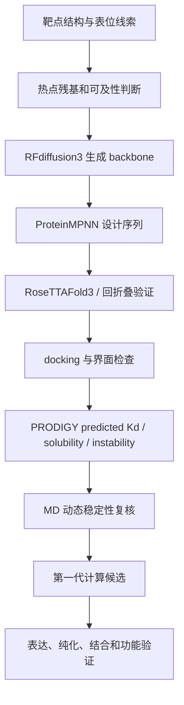

# 第 12 章 研究思路解析与项目工作台

前面的章节已经把常用工具拆开讲过：结构从哪里来，口袋如何判断，分子怎样对接，轨迹怎样分析，结合自由能和 AI 亲和力预测应怎样解释，生成式蛋白设计又如何进入候选筛选。本章换一个视角，不再从工具出发，而是从研究问题出发。

一个真实课题通常不会直接告诉你“应该跑哪个软件”。它可能只给出一个疾病、一条通路、一个突变、一个修饰位点、一个候选化合物，或者一个想设计的蛋白功能。研究工作台要做的第一件事，是把这些起点转成路线卡：当前材料显示什么，方法能产生什么，允许怎样解释，还缺少怎样的验证。

本章使用四类文献案例帮助读者理解路线设计。APE1 案例用于说明正向虚拟筛选如何形成计算候选；UXS1-metformin-plantainoside 案例用于说明计算筛选如何接到实验验证；IDO1 案例用于说明 scaffold-aware 机器学习、ensemble docking 和 MD 如何组成可复现筛选框架；BabA binder 案例用于说明生成式蛋白设计如何从表位约束走到候选排序。它们都只作为方法案例，不作为本教材项目的直接证据。

## 12.1 课程方法与研究课题的连接方式

学习者常见的困难不是不会运行某个命令，而是不知道课题应该从哪一步进入计算流程。一个疾病相关基因可以进入靶点发现，也可以进入突变机制分析；一个蛋白结构可以进入正向筛选，也可以进入 binder 设计；一个天然产物可以进入反向靶标搜索，也可以进入已知靶点的正向对接。路线选择取决于问题，而不是工具本身。

本章把研究问题分成三个层级。上游是“寻靶”，目标是找到关键对象；中游是“解码”，目标是解释结构、互作或调控机制；下游是“造器”，目标是形成药物、诊断、探针、蛋白材料、酶工程或合成生物学方案。三者之间可以连续推进，也可以停在某一层形成阶段性输出。

| 层级 | 核心问题 | 常见输入 | 可接方法 | 输出 |
|---|---|---|---|---|
| 寻靶 | 哪个对象值得研究 | 疾病数据、组学、通路、表型、化合物 | 多组学筛选、反向筛选、靶标酶发现、互作候选整理 | 候选靶点、通路、酶或标志物 |
| 解码 | 这个对象怎样发挥作用 | 结构、突变、PTM、PPI、代谢变化 | 建模、对接、MD、MM/PBSA、QM/MM、突变比较 | 机制假设和证据链 |
| 造器 | 如何形成可验证方案 | 靶点、表位、口袋、底物、候选分子 | 正向虚拟筛选、binder 设计、核酸抑制剂设计、酶工程 | 候选列表和验证队列 |

前 11 章可以放入这张表中。第 3 章帮助读者把对象转成可计算结构；第 4 章把结构转成对接和筛选；第 5-7 章判断候选复合物在动态和能量层面是否更值得保留；第 8 章处理 AI 亲和力预测和模型评估；第 9-10 章处理生成式蛋白设计；第 11 章让这些流程可以通过脚本、Agent 和小平台反复执行。

进入工作台时，建议先写一张项目路线卡。它不是结果摘要，而是决策记录。路线卡要同时记录输入、方法、输出、可写判断和验证需求，这样后续写课题申请、综述或实验记录时，才不会把计算候选包装成已证实结论。

| 字段 | 写法 |
|---|---|
| 问题场景 | 研究对象是什么，想回答什么问题 |
| 已有材料 | 文献、结构、组学、化合物库、序列或实验结果 |
| 当前层级 | 寻靶、解码或造器 |
| 计算路线 | 选择哪条方法链，为什么选择 |
| 输出文件 | 候选表、结构文件、轨迹、能量表、图表或报告 |
| 可写判断 | 表明、支持、提示、候选、待验证中的哪一级 |
| 下一步任务 | 实验验证、补充数据、重新建模或淘汰候选 |

这张卡片会贯穿本章。后面的每条路线都可以看作路线卡的一个实例：先明确问题，再选择方法，最后写清证据边界。

## 12.2 正向虚拟筛选项目路线

正向虚拟筛选适用于一种典型场景：读者已经有一个靶点，或者至少能获得一个可用于建模的靶点结构，下一步想从小分子库中找到候选配体。这里的关键词是“候选”。对接和能量评估可以帮助缩小范围，但不能替代真实结合和活性实验。

一条稳妥的正向虚拟筛选路线通常从受体准备开始。受体可以来自 PDB 晶体结构、冷冻电镜结构、同源建模或 AI 结构预测。进入对接前，需要检查缺失残基、异常原子、质子化状态、辅因子、金属离子、关键水分子和结合口袋。若口袋来自共晶配体，通常还要做 re-docking，确认对接参数能否复现参考 pose。

配体端要处理数据库和化学状态。ZINC、PubChem、DrugBank、TargetMol、Specs、ChemDiv 或文献活性分子都可以作为来源，但不同来源需要不同清洗策略。大型商业库通常要做 drug-likeness、PAINS、反应性基团和 ADMET 初筛；已上市药物或天然产物库则更适合保留多样性，再在后续步骤中分层判断。

APE1 文献案例展示了多层筛选的价值。该案例从 DrugBank、TargetMol、Specs 和 ChemDiv 等来源整理了 1,529,230 个小分子，流程中加入 re-docking、interaction fingerprint、strain energy、MM/GBSA 和 MD。它的教学意义不在于某个分数本身，而在于说明单一 docking score 容易高估候选，多个指标可以帮助发现 pose 稳定性、构象代价和动态行为之间的不一致。

UXS1-metformin-plantainoside 案例展示了另一种路线：先通过代谢组、细胞和动物模型提出 UXS1 相关机制，再对 UXS1 进行虚拟筛选，并用高内涵筛选、细胞实验、遗传 rescue 和动物实验继续验证。这个案例适合提醒读者，计算筛选可以提出候选，但真正把候选接到机制链条，需要独立实验层层收敛。

IDO1 案例则强调机器学习和结构筛选的结合。Tomarchio、Buccheri 和 Rescifina 的文献题名为 *A Reproducible Hierarchical Virtual Screening Framework Integrating Scaffold-Aware Machine Learning, Ensemble Docking, and Molecular Dynamics: Application to IDO1*，发表于 *Journal of Chemical Information and Modeling*。截至正文核对时，ACS 页面给出的引用仍为 ASAP 格式：J. Chem. Inf. Model. 2026, XXXX, XXX, XXX-XXX，尚未分配正式卷期页码；DOI 为 `10.1021/acs.jcim.6c00967`。

该案例使用 ChEMBL 数据、pChEMBL 阈值、scaffold split、nested cross-validation、applicability domain、GNINA ensemble docking 和 MD，适合说明可复现筛选框架怎样减少数据泄漏和受体构象偏差。

| 判断点 | 可以说明什么 | 不能说明什么 |
|---|---|---|
| docking score | 候选 pose 的相对排序线索 | 真实结合亲和力 |
| IFP | 是否保留关键相互作用模式 | 细胞内作用机制 |
| strain energy | pose 是否需要过高构象代价 | 分子是否一定不可用 |
| MM/GBSA 或 MM/PBSA | 轨迹或结构快照下的相对能量趋势 | 实验 Kd、Ki、IC50 |
| MD 稳定性 | 模拟条件下 pose 是否明显失稳 | 体内稳定性或疗效 |
| ML 预测 | 在训练分布和适用域内的活性可能性 | 适用域外新骨架的可靠结论 |

因此，正向虚拟筛选的最终输出不应写成“发现有效药物”，而应写成“形成候选验证队列”。更好的写法是：某些分子在当前模型、口袋定义、对接参数和复核指标下表现更一致，适合作为后续结合实验、酶活实验或细胞实验的优先对象。

## 12.3 蛋白互作虚拟筛选项目路线

蛋白互作虚拟筛选适用于通路或蛋白家族问题。读者可能已经有一个核心蛋白，想知道它在某条通路中可能与谁直接接触；也可能从单细胞通讯、差异表达或 PPI 数据库中得到一批候选互作对象，但这些线索还没有结构层面支持。

这里要先分清两类证据。数据库、共表达、细胞通讯和文献共现可以提供候选关系，但它们通常不能说明两个蛋白是否直接形成稳定界面。结构预测、蛋白-蛋白对接和 cofolding 可以提供界面假设，但也不能直接证明体内互作。工作台应把两类证据放在不同列，而不是合并成一个“互作成立”的结论。

一个可执行路线可以从 `target.fasta` 和候选库 fasta 开始。候选库可以是通路蛋白、差异表达蛋白、膜蛋白家族、细胞通讯配体-受体对或文献整理出的功能相关蛋白。随后对靶点和候选蛋白进行批量复合物预测，再用界面面积、界面残基、置信度、重复预测一致性和预测结合能做初步排序。

| 工作台字段 | 记录内容 |
|---|---|
| 候选蛋白 | 序列 ID、来源、功能域 |
| 候选来源 | 通路、数据库、组学、细胞通讯或文献 |
| 结构来源 | PDB、AlphaFold、Chai-1、Boltz 或对接模型 |
| 界面证据 | 接触残基、界面面积、氢键、盐桥、疏水接触 |
| 置信度 | 模型 confidence、PAE/iPAE、重复预测一致性 |
| 生物学支持 | 共表达、共定位、扰动实验或数据库记录 |
| 下一步验证 | Co-IP、pull-down、交联质谱、突变、功能 rescue |

筛选时要警惕两个问题。第一，预测工具可能偏好形成紧密界面，导致生物学上不相关的蛋白也出现可见接触。第二，通路中两个蛋白功能相关，不代表它们直接接触。只有当结构界面、生物学场景和实验可验证性同时合理时，候选才值得进入下一轮。

蛋白互作路线可以和突变分析相连。如果候选界面上出现临床错义突变、磷酸化位点或保守热点残基，就可以进入 12.7 的野生型-变体比较。这样，互作筛选不只是“找谁和谁接触”，还可以帮助判断“哪个界面变化值得验证”。

## 12.4 疾病靶点 binder 设计路线

Binder 设计适合下游“造器”问题：读者已经有一个靶点表面、功能表位或热点残基，希望设计一个小型蛋白、多肽或支架分子去覆盖、阻断或标记这个区域。相比小分子筛选，binder 设计更依赖目标表面定义。如果表位本身不可靠，后续生成再多候选也只是扩大不确定性。

路线的第一步是靶点准备。需要判断结构是否完整，表面是否暴露，目标区域是否与功能相关，是否有共晶复合物、抗体或纳米抗体界面作为参考。BabA 案例中，作者使用已解析 BabA-IgG-nanobody 复合物、MODELLER 重构、ConSurf、BepiPred、DiscoTope 和热点残基分析来定义候选表位。它适合作为“如何把表位变成设计约束”的案例材料。

RFdiffusion3 的任务是根据空间约束生成可能覆盖目标区域的 backbone。ProteinMPNN 的任务是为这些 backbone 设计序列。RoseTTAFold3 或同类结构预测用于回折叠，检查设计序列是否还能回到预期结构。之后的 docking、界面能量、PRODIGY predicted Kd、溶解性、instability index 和 MD 用于排序，不用于替代实验。

BabA 案例给出了一个完整的计算候选形成过程：围绕 4 组 hotspot 生成 200 个候选 binder backbone，筛选后保留 12 个骨架；每个骨架用 ProteinMPNN 设计 64 条序列，再经结构回测保留 12 个序列定义候选；其中部分候选进入 docking、PRODIGY 和 100 ns MD 评估。正文引用这个案例时，应写成“计算候选优先级形成流程”，不能写成 binder 已经具备实验结合或抗感染功能。

| 淘汰理由 | 说明 |
|---|---|
| 结构破裂或严重 clash | backbone 本身不适合继续设计 |
| 回折叠 RMSD 偏高 | 序列不能稳定支持目标骨架 |
| 目标表位未被覆盖 | 候选不符合设计目标 |
| predicted Kd 好但溶解性差 | 可能存在表达和纯化风险 |
| MD 中界面明显漂移 | 当前 pose 不适合作为优先候选 |
| 目标表位证据不足 | 应回到靶点准备阶段 |

Binder 路线的输出应称为“第一代计算候选”。下一步不是直接宣称功能，而是设计表达纯化、ELISA、biolayer interferometry、surface plasmon resonance、竞争实验、细胞模型或动物模型验证。若候选目标是跨株、跨亚型或跨组织识别，还要加入更多样本来源的表位保守性和交叉反应评估。

## 12.5 表观遗传与转录因子动态调控方向

表观遗传与转录因子方向通常从组学线索进入。读者可能看到某个基因甲基化水平变化、某个转录因子活性升高、某个磷酸化或乙酰化位点改变，或者某条调控通路在疾病组和对照组之间存在差异。第一步不是马上写机制，而是把线索拆成对象、位置、调控关系和可验证问题。

这类问题适合写成通用路线卡。路线卡不需要绑定具体用户项目，也不需要等待某一篇案例文献。它要回答的是：这个调控线索属于表达层、修饰层、染色质层、蛋白-DNA/RNA 结合层，还是蛋白互作层；它能否进入结构建模、对接、MD 或核酸抑制剂设计；当前证据支持到哪一级。

| 路线卡字段 | 判断问题 |
|---|---|
| 调控对象 | 是基因、转录因子、修饰酶、结合域还是靶序列 |
| 证据来源 | 甲基化、ChIP/CUT&Tag、RNA-seq、蛋白组、磷酸化组或文献 |
| 结构入口 | 是否有 DNA/RNA 结合域、蛋白结构或复合物模型 |
| 计算任务 | 蛋白-核酸对接、修饰位点建模、互作筛选或候选抑制剂设计 |
| 允许解释 | 候选调控、可能影响结合、提示机制假设 |
| 验证接口 | 报告基因、ChIP-qPCR、EMSA、突变、扰动或功能读数 |

如果问题是转录因子-DNA 结合，可以从结合域结构、motif、靶序列和突变位点进入蛋白-核酸对接。若问题是修饰位点，可以进入 12.7 的 PTM 机制分析，比较未修饰和修饰模型在电荷、构象和互作上的差异。若目标是核酸抑制剂或干预分子，则需要先确认靶序列、结合模式和细胞递送问题。

证据边界尤其重要。甲基化变化不自动等于基因被关闭，motif 富集不自动等于转录因子真实占位，磷酸化位点变化不自动等于通路被激活。正文应使用“提示”“支持”“构成候选机制假设”等表达，并明确还需要扰动实验和位点特异性验证。

## 12.6 单细胞、空间组学与定制化蛋白设计方向

单细胞和空间组学给出的不是最终机制，而是场景定位。单细胞帮助定位哪些细胞类型或细胞状态携带候选信号；空间组学帮助判断这些信号出现在组织的什么区域，以及哪些细胞可能发生邻近关系。把它们接到结构或蛋白设计时，必须先判断这些线索是候选对象、场景定位，还是已经有功能证据。

本节也按通用路线卡写作，不写入具体用户项目方向。正文示例可以使用抽象场景，例如“膜蛋白靶点”“病灶区域配体-受体对”“分泌因子候选”。这样能保留教学价值，又避免把私人项目池带入教材内容。

| 组学线索 | 可转接问题 | 可用计算路线 | 主要验证需求 |
|---|---|---|---|
| 某细胞群高表达膜蛋白 | 是否适合作为靶点表面 | 结构建模、表位筛选、binder 设计 | 组织特异性、膜定位、功能扰动 |
| ligand-receptor 推断 | 是否存在可验证互作 | 复合物预测、界面分析、MD | 共定位、结合实验、细胞通讯扰动 |
| 空间邻近区域 | 是否构成干预场景 | 靶点优先级、探针或递送设计 | 空间验证、组织切片、功能读数 |
| 分泌因子候选 | 是否可被阻断或标记 | binder、多肽或抗体样设计 | 分泌水平、结合实验、功能救援 |

单细胞结果进入设计前，还要检查候选靶点是否在正常组织中广泛表达。如果一个表面蛋白在病灶区域和正常组织都高表达，设计 binder 或探针时就要提前考虑选择性风险。空间邻近也不能直接写成细胞通讯成立，它只能提示某些细胞可能处在可互作距离内。

当路线进入定制化蛋白设计时，判断顺序应是：目标是否暴露，是否有结构或可建模结构，功能区域是否可定义，表位是否在不同样本中保守，设计产物需要阻断、标记、递送还是激活。不同目的会改变候选评价指标。例如阻断型 binder 更看重界面覆盖和竞争实验，标记型探针更看重特异性和背景信号，递送型设计还要考虑组织进入和稳定性。

## 12.7 临床突变与 PTM 修饰机制分析方向

临床突变和 PTM 修饰是“解码”层级中最常见的入口。一个错义突变可能改变蛋白折叠、活性位点、PPI 界面或配体口袋；一个磷酸化、甲基化、乙酰化或乳酰化位点可能改变电荷、构象、定位或互作。计算分析的任务，是把这些可能性变成可检查的机制假设。

错义突变路线从定位开始。先判断突变是否位于结构域、活性位点、PPI 界面、配体口袋或柔性区域。若突变位于界面，可以分别建立野生型和突变体模型，与互作蛋白或配体对接，再用 MD、RMSD、RMSF、关键距离、氢键和 MM/PBSA 或 MM/GBSA 比较界面变化。

| 步骤 | 野生型-变体比较要点 |
|---|---|
| 位点定位 | 结构域、界面、口袋、保守性、临床频率 |
| 模型构建 | 野生型和变体使用一致模板和参数 |
| 对接或复合物预测 | 比较 pose、界面残基和接触网络 |
| MD | 比较稳定性趋势、关键距离和局部柔性 |
| 能量分解 | 观察界面残基贡献变化 |
| 实验接口 | 突变构建、结合实验、功能读数、rescue |

PTM 路线也应采用成对比较。未修饰模型和修饰模型要在同一条件下构建，避免把参数差异误读为生物学差异。修饰位点若位于活性口袋、PPI 界面或核酸结合面，可以进一步检查电荷变化、空间冲突、氢键网络和结合模式。若位点远离已知功能区域，则应谨慎解释，避免把所有修饰变化都写成机制核心。

UXS1-metformin 文献案例可作为“多层证据链”的示例。该文献把代谢组、位点磷酸化、细胞敲除、rescue、虚拟筛选和体内外验证放在同一研究链条中。教材引用它时，应强调其案例意义：PTM 机制不是靠一个位点预测成立，而是需要检测、扰动、结构解释和功能结果彼此支持。

计算结果在这里只能回答“该突变或修饰是否可能改变结构或互作”。临床致病性仍需要人群遗传、患者表型、功能实验和背景机制共同支持。若只有能量变化或 RMSD 差异，正文应写成“提示该位点可能影响界面稳定性，仍需实验验证”。

## 12.8 酶设计与蛋白质工程方向

酶设计和蛋白质工程属于“造器”层级，但它常常需要从“解码”开始。读者可能想提高酶活、改变底物谱、解释催化混杂性，或从头设计一个理论酶。不同目标对应不同路线，不能把所有酶问题都写成同一个流程。

如果目标是解释已有酶的功能变化，优先从结构、活性位点、底物通道和保守残基进入。可以做底物对接、MD、关键距离、残基能量分解和必要的 QM/MM 或过渡态相关分析。若目标是改造酶活或稳定性，可以从虚拟突变扫描、序列保守性、结构稳定性和底物结合模式中挑选候选突变。

| 目标 | 适合路线 | 输出 | 验证 |
|---|---|---|---|
| 提高稳定性 | 保守性分析、结构能量、虚拟突变扫描 | 候选突变组合 | 表达量、热稳定性、活性保留 |
| 改变底物谱 | 底物对接、口袋分析、MD | 口袋突变和底物候选 | 酶活、Km、kcat、底物范围 |
| 解释催化机制 | QM/MM、反应坐标、关键距离 | 催化假设 | 同位素、突变、动力学实验 |
| 从头设计酶 | 几何约束、scaffold 生成、序列设计 | 第一代设计候选 | 表达、折叠、活性和迭代优化 |

机器学习可以用于酶工程，但前提是数据结构清楚。训练集应说明标签是什么，是活性、稳定性、底物转化率还是选择性；split 应避免相近突变或同源序列泄漏；适用域要明确，不能用少量同源酶数据推断所有酶家族。模型可以帮助排序突变或底物，但不能替代实验筛选。

生成式设计路线从约束开始。若要设计新酶，需要明确反应类型、底物姿态、催化残基几何、过渡态假设和 scaffold 条件。生成候选后，仍要经过序列设计、结构回测、底物对接、MD 或 QM/MM 复核。最终输出应称为“设计候选”，而不是“成功设计的酶”。

本节没有绑定具体案例，因此正文只写通用路线卡。后续如果加入酶设计文献，应放入 12.10 的案例表，或作为某个指标的解释材料，不改变本节的通用框架。

## 12.9 反向虚拟筛选与靶标酶发现方向

反向虚拟筛选适用于另一类问题：读者已经有小分子、天然产物、代谢物或表型结果，但不知道它主要作用于哪个蛋白或酶。与正向筛选不同，反向筛选的对象不是一个靶点对多个分子，而是一个分子对多个候选靶标。

路线起点可以是化合物结构，也可以是表型线索。候选靶标库可以来自疾病差异基因、代谢通路、酶库、PPI 网络、药物靶点数据库或结构可得蛋白集。之后可以进行反向 docking、药效团匹配、相似性检索、AI 靶点预测和通路证据交叉。结构和组学证据越能收敛，候选优先级越高。

| 候选靶标优先级字段 | 判断意义 |
|---|---|
| 靶标来源 | 数据库、通路、组学、文献或结构库 |
| 结构可信度 | 是否有实验结构或可靠模型 |
| 口袋合理性 | 是否有可解释结合位点 |
| 对接和能量结果 | 是否支持候选结合模式 |
| 组学支持 | 表达、空间定位、通路或疾病相关性 |
| 可实验验证性 | 是否能做结合、酶活、敲除或 rescue |
| 失败风险 | 假阳性、口袋错误、脱靶、不可获得样本 |

反向筛选的风险是候选很多，假阳性也很多。一个小分子通常可以在多个蛋白口袋中获得不错的 docking score，尤其当口袋偏疏水或分子较大时。因此，反向筛选不能靠单一对接排序收尾，必须加入疾病背景、表达场景、代谢通路、结构可信度和实验可达性。

靶标酶发现尤其需要验证接口。若候选是代谢酶，下一步可以设计酶活实验、底物或产物定量、竞争实验、敲除/过表达和 rescue。若候选来自表型筛选，还要判断表型是否能由该靶标解释。只有当结合、酶活和功能扰动共同支持时，才可以把候选靶标写成较强结论。

## 12.10 文献案例、项目池和下一步实验

本章最后回到工作台。项目工作台不是写作包装工具，而是证据管理工具。它的价值在于把不同路线的输入、方法、候选、风险和验证接口放在同一张表里，让读者知道下一步该补什么，而不是把所有计算结果都写成结论。

文献案例也要进入工作台，但不能替代本项目证据。APE1 案例提示多指标正向筛选怎样形成候选队列；UXS1 案例提示计算筛选怎样接到实验验证；IDO1 案例提示机器学习筛选需要 scaffold split、适用域和可复现代码；BabA 案例提示 binder 设计要把表位约束、回折叠、界面复核和实验验证放在同一条路线中。

| 案例 | 可借鉴点 | 边界 |
|---|---|---|
| APE1 正向虚拟筛选 | docking、IFP、strain energy、MM/GBSA、MD 的多层筛选 | 计算 shortlist 不等于活性化合物 |
| UXS1-metformin-plantainoside | 机制线索、虚拟筛选和实验验证的衔接 | 文献结论只属于该研究系统 |
| IDO1 ML+docking | scaffold-aware ML、applicability domain、ensemble docking、MD、公开 notebook | 模型性能不能泛化到其他靶点 |
| BabA binder | 表位约束、RFdiffusion3、ProteinMPNN、回折叠和候选淘汰 | 计算 binder 不是实验优化分子 |

教材示例项目池可以用统一字段记录。每个条目都应说明项目问题、当前证据、证据层级、计算路线、输出文件、可写判断、下一步实验和主要风险。若证据只有计算层面，就标注为“计算支持”或“待确认”；若已有直接实验，则说明实验类型、样本系统和限制。

| 字段 | 记录内容 |
|---|---|
| 项目问题 | 疾病、靶点、通路、酶、突变、修饰、化合物或设计目标 |
| 当前证据 | 文献、组学、结构、对接、MD、模型预测、实验结果 |
| 证据层级 | 直接实验、计算支持、数据库线索、待确认 |
| 计算路线 | 正向筛选、反向筛选、互作筛选、binder 设计、突变/PTM、酶工程 |
| 输出文件 | 候选表、结构文件、轨迹分析、能量分解、图表、报告 |
| 可写判断 | 表明、支持、提示、候选、待验证中的哪一级 |
| 下一步实验 | 结合实验、酶活、细胞功能、突变 rescue、动物模型、表达纯化 |
| 风险 | 数据不足、结构不可靠、模型越界、候选不可表达、验证成本高 |

同一条项目路线可以生成三种输出。课题申请强调科学问题和可行性；综述强调方法比较和证据边界；实验记录强调可复现和失败记录。三者共用证据链，但写法不同。

| 输出模板 | 主要用途 | 必写内容 | 不写内容 |
|---|---|---|---|
| 课题申请 | 把路线转成可评审研究计划 | 科学问题、研究假设、已有依据、技术路线、阶段目标、验证实验、风险替代方案 | 不把计算候选写成已证实机制，不承诺未验证疗效 |
| 综述 | 把路线转成方法学习和文献比较 | 方法谱系、代表案例、输入条件、关键指标、适用边界、失败原因、未来验证方向 | 不把文献案例结果写成本项目结果，不按期刊档次组织论证 |
| 实验记录 | 把路线转成可复现执行记录 | 输入文件、软件版本、参数、命令、输出、QC、失败记录、下一轮调整 | 不写成结论包装，不删除负面结果 |

这三种模板也决定了正文写作的证据强度。课题申请可以提出假设，但要给出验证方案；综述可以比较路线，但不能替文献之外的项目下结论；实验记录可以记录失败和偏差，因为这些信息会决定下一轮是否更换结构、缩小库、调整参数或淘汰候选。

本章的下一步任务，是把工作台中的路线转成可执行清单。每一条清单都应回答四个问题：输入是否可靠，方法是否适合，输出能解释到哪一级，验证怎样接上。只要这四个问题清楚，AI 辅助药物设计就不会停留在工具展示，而会成为一套能迭代、能复核、能继续实验推进的研究工作流。
