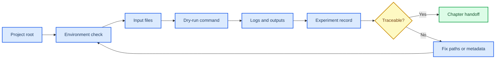
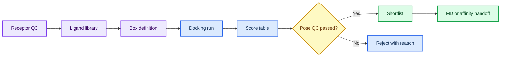
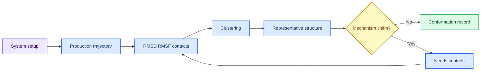
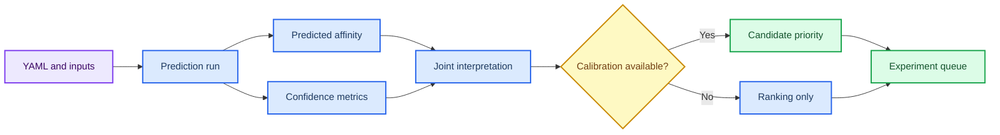
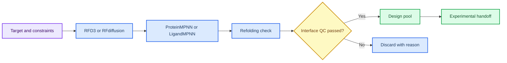
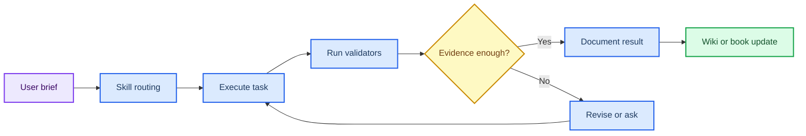
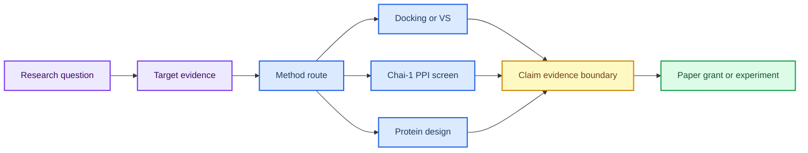

# Mermaid 图示与示意图设计

本页是 P30 图示升级的 source of truth。Mermaid 图用于表达章节结构、证据链和方法流程；Imagegen 图继续作为教学辅助位图；后续如需生成新的科学示意图，应先从本页的 Mermaid 和 prompt 出发。

## 使用边界

| 层级 | 用途 | 边界 |
|:---|:---|:---|
| Mermaid | 版本化保存知识结构、流程和证据关系。 | 作为图示 source of truth，可直接在 MkDocs 和 GitHub 中复核。 |
| Imagegen | 提供低文本、强结构的教学辅助图。 | 不承载精确术语、参数、结论或数据。 |
| scientific-schematics | 后续生成更精细的科学示意图。 | 需人工验收，不直接替代正文和引用。 |

## 章节图示索引

| 章节 | Mermaid 图 | scientific-schematics 目标 |
|:---|:---|:---|
| 第 1 章 | Linux 项目记录闭环 | 环境检查到实验记录工作流 |
| 第 2 章 | 结构证据复核链 | 结构来源、叠合和截图记录 |
| 第 3 章 | 对接筛选证据漏斗 | receptor-ligand-box-score-filter 漏斗 |
| 第 4 章 | MD 轨迹解释闭环 | 轨迹指标到代表构象选择 |
| 第 5 章 | 亲和力预测解释链 | Boltz2 输出、置信度、校准和交接 |
| 第 6 章 | 蛋白设计验证链 | RFD3/RFdiffusion、ProteinMPNN、回折叠和实验交接 |
| 第 7 章 | AI Agent 验证闭环 | brief、执行、验证、沉淀、复核 |
| 第 8 章 | 研究工作台路线图 | 寻靶、虚拟筛选、PPI、蛋白设计和输出 |

## 第 1 章 Mermaid

示意图 prompt：16:9 科学教育流程图，白底，展示项目根目录、环境检查、输入文件、dry-run、日志、实验记录和可追溯性判断。图中文字只使用英文短标签和编号，中文说明放在正文表格中。

## 第 2 章 Mermaid

示意图 prompt：结构复核科学示意图，展示实验结构、预测结构、链与配体检查、口袋复核、结构叠合、截图记录和使用边界。画面低文本，避免复制原始 PDB 或 PDF 图。

## 第 3 章 Mermaid

示意图 prompt：receptor-ligand-box-score-filter 漏斗图，强调 score 只是排序线索，pose QC 和排除理由必须记录。使用 7 个编号节点，避免出现 Kd、IC50 或实验活性等强结论词。

## 第 4 章 Mermaid

示意图 prompt：MD 轨迹分析闭环，展示体系准备、生产轨迹、RMSD/RMSF/接触、聚类、代表构象和机制 claim 复核。突出短时 MD 不能单独证明药效或机制。

## 第 5 章 Mermaid

示意图 prompt：Boltz2 亲和力解释流程图，展示输入 YAML、预测、predicted affinity、confidence、联合解释、校准和实验队列。明确预测值不能直接等同实验 Kd 或 IC50。

## 第 6 章 Mermaid

示意图 prompt：蛋白设计验证链，展示 target/constraints、RFD3/RFdiffusion backbone、ProteinMPNN/LigandMPNN sequence、refolding、interface QC、design pool 和 experimental handoff。所有候选都标为待验证，不写成 successful binder。

## 第 7 章 Mermaid

示意图 prompt：AI Agent 说明-执行-控制-验证-沉淀闭环，展示用户 brief、skill routing、执行、验证、证据充分性判断、文档沉淀和 wiki/book 更新。强调验证通过不等于科学判断完整。

## 第 8 章 Mermaid

示意图 prompt：研究工作台路线图，展示 research question、target evidence、method route、docking/VS、Chai-1 PPI screen、protein design、claim-evidence-boundary 和输出。明确文献案例、dry-run、真实运行结果必须分层。

## P30 生成策略

| 阶段 | 操作 | 验收 |
|:---|:---|:---|
| Mermaid source | 每章至少保留 1 个 Mermaid 图。 | MkDocs strict build 可渲染，图中有 `accTitle` 和 `accDescr`。 |
| AI 示意图 | 以本页 Mermaid 和 prompt 为基础生成。 | 图像低文本、无原始 PDF 图表复制、正文表格保留权威标签。 |
| 章节整合 | 章节页显示 Mermaid 图，资源页保存完整设计。 | 在线书籍校验通过，读者能从章节进入资源页。 |
| 后续替换 | 对不清晰的 Imagegen 图，先修改 Mermaid，再重新生成位图。 | `imagegen-manifest.tsv` 和 prompt 记录同步更新。 |
