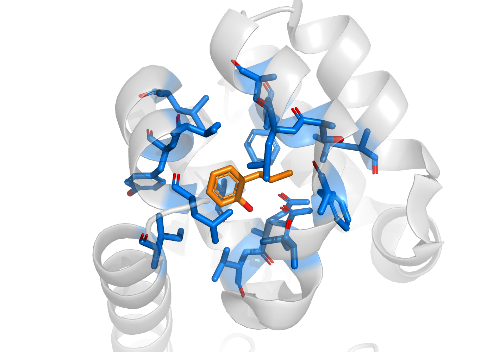

# 第 2 章 PyMOL、ChimeraX 与结构可视化

一个结构文件同时包含蛋白、配体、水和其他组分。对接准备前，先看清链、配体位置和附近残基。本章用 3HTB/JZ4 完成这一任务，保存可再次执行的命令、会话和图片。

贯穿案例来自 [RCSB 3HTB](https://www.rcsb.org/structure/3HTB)：T4 lysozyme L99A/M102Q 与 2-propylphenol 的晶体复合物，分辨率 1.81 Å。配体的 CCD 名称为 [JZ4](https://www.rcsb.org/ligand/JZ4)，分子式为 C9 H12 O。使用本书的 PDB 文件时，蛋白为链 A，JZ4 为链 A 的残基 167；mmCIF 页面另有 label 链标识，查看时应注明采用哪套编号。

| 本章任务 | 完成后得到什么 |
|---|---|
| 识别链与配体 | 一组明确选择命令 |
| 显示 5 Å 邻近残基 | 可复现的口袋视图 |
| 改成 3 Å 和 7 Å | 不同邻近范围的对照记录 |
| 保存与复核 | PSE 会话、PNG 图片和口袋 PDB |

先准备第 1 章的课程目录。`inputs/3htb.pdb` 已存在，`outputs` 用于保存本章结果。

在在线书“练习资源”页下载第 2 章 ZIP，解压到 `C:\coursework`。包内已带有所需公开结构，分别保存在 `AI_MD_practice/chapter-02/assets` 和 `AI_MD_practice/chapter-03/assets`。在 `C:\coursework\ai-md` 的 PowerShell 中把脚本与结构复制到工作区；已经逐文件保存到目标位置时跳过复制。

```powershell
Copy-Item ../AI_MD_practice/chapter-02/assets/code/3htb_pocket.pml scripts/
Copy-Item ../AI_MD_practice/chapter-03/assets/data/3htb/3htb.pdb inputs/
```


## 2.1 PyMOL 安装、激活与基础设置

本书基础路线采用无需付费许可的开源 PyMOL。软件源代码见 [Schrödinger 官方仓库](https://github.com/schrodinger/pymol-open-source)，Windows 构建可从 conda-forge 获取。本书已验证 PyMOL 3.1.0。已有 Conda 的学生直接建环境；尚未安装时，从 [Miniforge 官方项目](https://github.com/conda-forge/miniforge) 选择 Windows x86-64 安装器，按默认个人用户设置安装，再打开开始菜单中的 Miniforge Prompt。

在该提示窗口依次创建环境、进入环境并启动程序。这里使用单独的可视化环境，不向第 1 章的 `.venv-win` 安装 PyMOL。

```text
conda create -n pymol-class -c conda-forge pymol-open-source=3.1.0
conda activate pymol-class
pymol
```

按提示确认软件包后等待安装完成。下次打开同一个提示窗口，只需后两行。若使用 [PyMOL 商业发行版](https://pymol.org/)，按课程提供的正规许可方式激活；两种发行版的基本选择与保存命令相同。本章不需要额外插件。

启动后找到对象列表、结构显示区和命令输入区。先输入 `print(cmd.get_version()[0])` 查看版本，再将版本写入自己的环境记录。鼠标旋转、平移、缩放只改变视角，不修改原子坐标。

```pymol
print(cmd.get_version()[0])
bg_color white
```

不要一开始便修改大量全局配置。`.pymolrc` 或 `.pymolrc.py` 用于保存启动设置；本章把与图片有关的设置写在 PML 文件中，便于复现。

| 遇到的问题 | 先检查什么 |
|---|---|
| 软件无法启动 | 发行版、系统支持、许可提示及图形驱动信息 |
| 输入命令没有反应 | 光标是否位于 PyMOL 命令区；不是 PowerShell |
| 载入结构失败 | 文件路径、文件大小、文件是否下载成 HTML |
| 画面空白 | 对象是否启用；执行 `zoom all`；核对显示模式 |

本书已用 Windows PyMOL 3.1.0 实际执行 [3htb_pocket.pml](assets/code/3htb_pocket.pml)，生成会话、口袋坐标和图像。ChimeraX 命令已按官方文档核对，本书未提供该软件的实机结果，补充操作请按本机版本复核。

## 2.2 PyMOL 界面、选择、颜色和距离测量

先进入工作区，再载入文件，命名为 `model_3htb`。下面的 `cd` 在 PyMOL 命令区执行，将相对路径起点设为课程目录；也可用 File → Open 找到 `inputs/3htb.pdb`。

```pymol
cd C:/coursework/ai-md
load inputs/3htb.pdb, model_3htb
hide everything, all
select protein_a, model_3htb and polymer.protein and chain A and not alt B
select ligand_jz4, model_3htb and resn JZ4 and chain A and resi 167
show cartoon, protein_a
show sticks, ligand_jz4
color gray70, protein_a
color orange, ligand_jz4
color red, ligand_jz4 and elem O
zoom ligand_jz4, 8
```

`select` 建立一个原子选择。`chain A` 限制链，`resn JZ4` 限制残基名，`resi 167` 限制编号。原文件某些侧链有替代位置，`not alt B` 去除 B 位置，保留空白位置和 A 位置；第 3 章准备受体时沿用 A。`cartoon` 突出主链，`sticks` 显示原子和键。

现在把配体 5 Å 内任一蛋白原子所在的整个残基选出来。`within` 先找附近原子，`byres` 再扩展为整残基。

```pymol
select pocket_5, byres (protein_a within 5 of ligand_jz4)
show sticks, pocket_5
color marine, pocket_5
count_atoms pocket_5 and name CA
iterate pocket_5 and name CA, print(chain, resi, resn)
```

输出 α 碳数量可用于统计残基数，前提是每个残基有一个选定的 CA。随后查看这些残基是否围绕配体，是否因其他链或替代位置混入而变多。

测量 JZ4 氧原子与附近蛋白 N/O 原子的距离。先显示 3.5 Å 内候选接触，点击距离标签，查看参与的具体原子。

```pymol
distance polar_contacts, ligand_jz4 and elem O, pocket_5 and elem N+O, 3.5
set dash_color, black, polar_contacts
```

把原子名称、残基编号和距离记录在笔记中。这一步测量几何，氢键判断还要检查供体、受体、氢的位置和角度；具体指标不应被“附近”一词代替。

## 2.3 PyMOL 分组、叠合、渲染与批量作图

保存会话前调整到清楚可读的视角。会话保留对象、选择和显示设置；PDB 保存坐标；PNG 保存当前图像。三种文件用途不同。

```pymol
group case_3htb, model_3htb protein_a ligand_jz4 pocket_5 polar_contacts
orient pocket_5 or ligand_jz4
zoom pocket_5 or ligand_jz4, 4
save outputs/3htb_pocket.pse
save outputs/3htb_pocket_residues.pdb, pocket_5
png outputs/3htb_pocket.png, width=1400, height=1000, dpi=200, ray=1
```

查看保存目录，应有三个非空文件。重新打开 PSE，确认蛋白、配体和选择仍可见；打开 PNG，确认配体没有被遮挡、距离标签没有裁切。截图后继续调整，应另存版本，避免覆盖上一次视图。



本图由官方 3HTB 坐标在 PyMOL 3.1.0 中实际生成。JZ4 为橙色，5 Å 邻近残基为蓝色，氧原子为红色；蛋白选择排除了 alt B。可下载 [PSE 会话](assets/results/pymol-3htb/3htb_pocket.pse) 和 [口袋 PDB](assets/results/pymol-3htb/3htb_pocket_residues.pdb)，对照自己的选择。图中没有添加距离对象，距离测量请按 2.2 单独操作。

比较两个蛋白结构时，先选择对应链和相同范围。例如第 4 章已有同一受体坐标中的晶体配体和对接配体，查看二者时直接叠放，不再单独拟合配体。对两种蛋白构象比较，则可按对应 Cα 原子做叠合。

| 比较目的 | 选择对象 | 记录什么 |
|---|---|---|
| 比较同一蛋白的两种构象 | 对应链、对应残基的 Cα | 对齐范围、对齐方法、未覆盖区域 |
| 检查重对接结果 | 原晶体坐标中的晶体配体与 pose | 不对配体再次拟合；原子对应关系 |
| 比较同一 pose 的两种视图 | 同一坐标对象 | 只记录显示设置，不计算结构差异 |

`show cartoon` 添加显示，`show as cartoon` 改用该显示方式；如果选择过宽，可能改变配体显示。先在明确选择上操作，再批量运行脚本。

## 2.4 口袋、静电、疏水、动画和剖面图

邻近半径控制观察范围。先预测半径从 3 Å 变为 7 Å 后，残基数和画面复杂度会怎样变化，再实际修改命令。

```pymol
select pocket_3, byres (protein_a within 3 of ligand_jz4)
select pocket_7, byres (protein_a within 7 of ligand_jz4)
count_atoms pocket_3 and name CA
count_atoms pocket_5 and name CA
count_atoms pocket_7 and name CA
```

分别只显示一种范围并保存图片，把残基数填入表中。如果大半径的选择反而更小，检查对象、链和替代位置设置是否一致。

| 半径 | 选中残基数 | 你观察到的变化 |
|---|---|---|
| 3 Å | 自己填写 | 配体近邻；可能很少 |
| 5 Å | 自己填写 | 本章默认口袋视图 |
| 7 Å | 自己填写 | 外层残基和遮挡增加 |

自己完成后再核对 [坐标计算的半径对照](assets/results/pocket_radius_counts.tsv)。这个表按原始 PDB 的 auth 链 A、空白/A 替代位置和相同距离定义计算；可用 [pocket_neighborhood.py](assets/code/pocket_neighborhood.py) 独立生成。

表面有助于观察空间形状。下面仅显示蛋白表面，再调整透明度；先保存已有会话，便于返回 sticks 视图。

```pymol
show surface, protein_a
set transparency, 0.5, protein_a
```

按残基类型着色是显示设置。计算静电势则需要电荷、质子化、介电常数和盐条件等输入，常借助 APBS/pdb2pqr。若只执行颜色命令，图注写“残基类别着色”，不能标成“静电势图”。隧道分析、切片和动画适合回答空间通道或视角变化问题，选学时记录工具和参数。

## 2.5 PyMOL 常用命令、脚本与插件

PML 是一组依次执行的 PyMOL 命令。下载 [3htb_pocket.pml](assets/code/3htb_pocket.pml) 到 `scripts`，确认课程目录已有 `inputs/3htb.pdb` 和 `outputs`，在 PyMOL 中先进入该目录，再运行脚本。

```pymol
cd C:/coursework/ai-md
@scripts/3htb_pocket.pml
```

脚本会清空当前会话再载入案例，运行前保存需要保留的工作。完成后检查 PSE、口袋 PDB 和 PNG。打开脚本，将 `within 5` 改为 `within 7`，并修改输出文件名后再运行，这便完成一次真正的参数对照。

| 命令 | 对文件或结构的影响 |
|---|---|
| `load` / `fetch` | 从本地文件/在线条目建立对象 |
| `show` / `hide` | 改变显示，不删原子 |
| `select` | 建立选择，不自动保存文件 |
| `remove` | 从对象中删除选中的原子 |
| `delete` | 删除指定对象或选择 |
| `save` | 按选择和格式保存内容 |
| `png` | 导出图像 |

本章无需插件。需要静电、隧道或辅助选择功能时，再从对应工具官方来源安装一个插件，用本案例检查输入、输出和错误。一次同时安装多项插件，容易把环境问题和操作问题混在一起。

## 2.6 ChimeraX 安装与基础操作

从 [UCSF ChimeraX 官方下载页](https://www.rbvi.ucsf.edu/chimerax/download.html) 选择 Windows 版本，阅读许可条件，启动后通过 Help 查找版本与 User Guide。本节与 PyMOL 使用同一个文件，便于核对对象。

在 File → Open 载入 `inputs/3htb.pdb`，打开 Favorites → Command Line。第一个载入的模型通常编号为 `#1`，若已打开其他模型，先查看 Models 面板中的真实编号。

```chimerax
open C:/coursework/ai-md/inputs/3htb.pdb
cartoon #1
hide #1 atoms
show #1/A:167 atoms
color #1/A:167 orange
view #1/A:167
```

确认显示的残基名称为 JZ4。选中原子后用界面查看链、编号和名称；切换软件时不要默认 label 链和 auth 链一定采用同一个字符。命令和菜单说明见 [ChimeraX User Guide](https://www.rbvi.ucsf.edu/chimerax/docs/user/index.html)。

保存会话和图片分别使用 `.cxs` 与 `.png`。

```chimerax
save C:/coursework/ai-md/outputs/3htb_chimerax.cxs
save C:/coursework/ai-md/outputs/3htb_chimerax.png width 1400 height 1000
```

关闭后重新打开 CXS，确认对象恢复。ChimeraX 的模型编号、选区和语法与 PyMOL 不同，不能直接把 PML 粘贴进去运行。

## 2.7 ChimeraX 蛋白、核酸、光源和材质设置

同一坐标可以显示主链、原子、分子表面等层次。先保留 JZ4 sticks，再观察蛋白表面；用菜单隐藏表面便可回到主链。改背景和光源时，保持坐标对象不变。

```chimerax
surface #1/A
lighting soft
set bgColor white
```

给图写清楚蛋白、配体的颜色与显示方式。若使用表面切片，标明切片位置；渲染设置不应掩盖配体碰撞或缺失结构。

核酸显示作为补充练习，用公开 [1BNA](https://www.rcsb.org/structure/1BNA) 双链 DNA，单独打开，不替换本章贯穿案例。通过 Presets 或 nucleotides 命令观察主链和碱基，再旋转检查两条链。

| 对象 | 优先显示什么 | 核对内容 |
|---|---|---|
| 蛋白 | cartoon + 位点 sticks | 链、缺失区、侧链替代位置 |
| 核酸 | 主链与碱基 | 链、碱基、配对和断裂 |
| 小分子 | sticks | 元素、键和立体构型 |
| 表面 | 可适度透明 | 口袋开口、遮挡、切片位置 |

## 2.8 PLIP、LigPlus 等互作作图工具

互作作图工具根据输入坐标和规则整理接触。PLIP 可列出蛋白与配体的候选氢键、疏水接触等；LigPlot+/LigPlus 可把接触整理成二维图。查看输出时先核对结构 ID、配体、链和残基，再回到三维视图检查。

用 3HTB/JZ4 做基础结果阅读，填写下面的表。涉及在线上传时，使用公开结构文件，先确认服务条件；私人结构无需上传。

| 记录项 | 本案例填写方式 |
|---|---|
| 输入 | 公开 3HTB；注明是否预处理 |
| 配体 | JZ4，auth A167 |
| 规则 | 工具版本、距离/角度条件或默认值 |
| 接触 | 残基、原子、距离及类别 |
| 三维复核 | 是否与 PyMOL 中同一坐标和选择相符 |

若二维图遗漏某个残基，先看该工具的距离规则与化学识别；若多出接触，检查是否纳入另一链、替代位置或晶体邻近对象。保存原始结果表和自己的复核笔记，便于第 4 章查看对接 pose 时对照。

## 本章练习与交接

基础任务是保存一张可复现的 5 Å 口袋图，以及对应 PML、PSE 和口袋 PDB。对照任务是分别使用 3/5/7 Å，报告选择残基数和视图变化；不凭颜色或距离线给配体打“结合强弱”等级。

交给第 3 章的内容包括结构来源、蛋白链 A、JZ4 A167、替代位置 A、选择命令和图片。口袋 PDB 适合复查选择，完整受体准备仍从原始 3HTB 开始。

## 本章方法适用范围与结果解释

可视化用于检查坐标、选择、邻近区域和几何关系。颜色、表面、互作图和叠合依赖输入与规则，不能独立确定实验结合强度或作用机制。实验结构与 AlphaFold 等预测结构保留各自来源与置信信息；预测模型的 B-factor 字段可能承载 pLDDT，不能沿用实验 B 因子的解释。第 3 章将把观察结果转换成具体的组分与准备参数。

## 文献与软件来源

- Jumper, J., Evans, R., Pritzel, A., Green, T., Figurnov, M., Ronneberger, O. et al. Highly accurate protein structure prediction with AlphaFold. Nature (2021). https://doi.org/10.1038/s41586-021-03819-2

- Abramson, J., Adler, J., Dunger, J., Evans, R., Green, T., Pritzel, A. et al. Accurate structure prediction of biomolecular interactions with AlphaFold 3. Nature (2024). https://doi.org/10.1038/s41586-024-07487-w

- Akdel, M., Pires, D. E. V., Porta Pardo, E., Janes, J., Zalevsky, A. O., Meszaros, B. et al. A structural biology community assessment of AlphaFold2 applications. Nature Structural & Molecular Biology 29, 1056-1067 (2022). https://doi.org/10.1038/s41594-022-00849-w

- Pettersen, E. F., Goddard, T. D., Huang, C. C., Meng, E. C., Couch, G. S., Croll, T. I., Morris, J. H. & Ferrin, T. E. UCSF ChimeraX: Structure visualization for researchers, educators, and developers. Protein Science 30, 70-82 (2021). https://doi.org/10.1002/pro.3943

- Meng, E. C., Goddard, T. D., Pettersen, E. F., Couch, G. S., Pearson, Z. J., Morris, J. H. & Ferrin, T. E. UCSF ChimeraX: Tools for structure building and analysis. Protein Science 32, e4792 (2023). https://doi.org/10.1002/pro.4792
