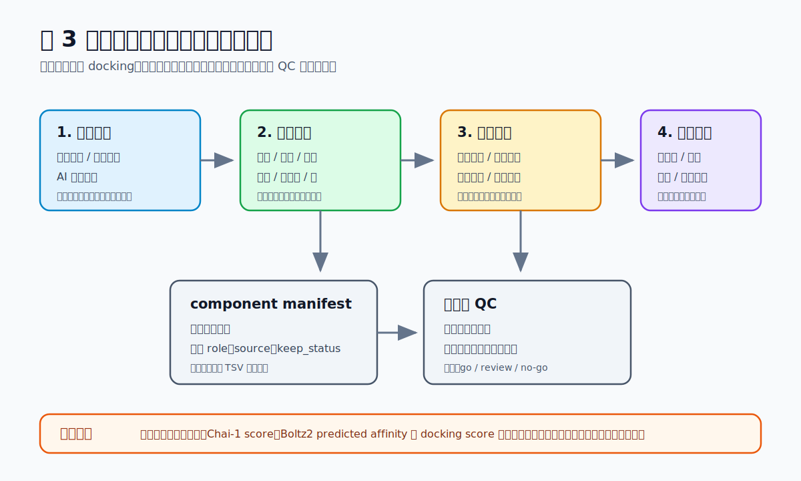
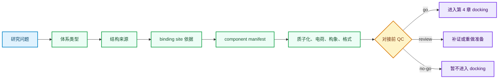

# 第 3 章 结构建模、结合位点与体系准备

## 本章导读

很多分子对接项目并不是从 docking 命令开始，而是从一个更基础的问题开始：当前结构能不能作为计算输入？如果受体结构来源不清楚、结合位点只是猜测、金属离子和辅因子被随手删除，后续即使得到漂亮的 score 表，也很难解释结果。

本章聚焦 docking 前准备。读者需要学会把一个蛋白名称、PDB 文件或 AI 预测结构，转成可复核的计算体系：结构来源明确，位点依据明确，组分取舍明确，准备步骤和风险也有记录。

第 4 章会继续讨论 docking 运行、打分排序和虚拟筛选。本章只负责把输入准备到可以交接的状态。换句话说，本章结束时的输出不是“命中分子”，而是一套 receptor、binding site、component manifest 和对接前 QC 记录。

## 学习目标

完成本章后，读者应能够：

- 区分实验结构、同源模型和 AI 预测结构在 docking 前的检查重点。
- 判断一个结合位点来自共晶配体、文献残基、预测口袋还是任务假设。
- 为蛋白、小分子、核酸、金属离子、辅因子和水分子建立 component manifest。
- 说明质子化、电荷、缺失残基、低置信区域和格式转换怎样影响后续 docking。
- 把结构准备结论写成 `go`、`review` 或 `no-go`，并说明下一步接到哪里。

这些目标服务一个核心能力：让另一个人可以复查你为什么选择这个结构、这个位点和这些组分。缺少这类记录时，后续 docking 结果只能作为临时练习输出。

## 使用材料与来源边界

本章依据全书大纲、第三章本章大纲、章节精读、方法笔记、文献笔记、实验模板、claims 矩阵和引用映射整理。原始素材用于确认课程主题和工具覆盖范围；正文不复制原始 PDF、课件截图、Office 文件或压缩包。

| 来源类型 | 使用方式 |
|:---|:---|
| `大纲.md` | 确认第三章标题、3.1-3.7 小节和第 4 章承接边界。 |
| `chapters/chapter-03/本章大纲.md` | 确认本章问题、读者任务、写作门控、练习模板和教学图方向。 |
| 第三章原始素材登记路径 | 用于确认结构建模、binding site、多组分体系和 docking 前准备主题；不直接复制图表。 |
| `01_课程章节索引/章节精读/第03章_AI多组分对接与虚拟筛选精读.md` | 提供 docking 三要素、体系准备、MSA、UniDock 和复核边界。 |
| `02_方法笔记/AI多组分对接与虚拟筛选.md` | 提供 receptor、ligand、box、score、top pose 和记录字段。 |
| `03_文献笔记/AlphaFold结构预测.md`、`Chai1方法与PPI筛选.md`、`Boltz2亲和力预测.md` | 提供结构预测和多组分预测的文献锚点与解释边界。 |
| `07_研究工作台/证据与claims矩阵.md` | 提供 docking score、Chai-1 aggregate score、Boltz2 predicted affinity 的证据边界。 |

文献案例只能作为方法借鉴、benchmark 或边界提示。dry-run、docking score、predicted affinity、Chai-1 aggregate score 和 Boltz2 输出不能写成本项目实验结论。



**图 3.1 结构进入对接前的质量门槛。** 本图概括结构来源、体系组分、结合位点、准备操作和对接前 QC 的关系。图中箭头表示记录依赖，不表示真实 docking 或实验验证已经完成。

## 本章判断路径

本章的逻辑可以写成一条短流程：先定义体系，再选择结构，再确定位点，再处理组分，最后给出是否进入 docking 的判断。



这个流程把“能不能跑”拆成可检查问题。`go` 只表示输入记录完整并适合进入下一章，不表示后续结果可靠；`review` 表示有关键假设仍需补证；`no-go` 表示当前结构或体系定义不足以支撑 docking。

## 3.1 从“一个蛋白”到“一个待计算体系”

读者最常见的起点是一个靶点名、一个 UniProt 编号、一条序列或一个 PDB 文件。它们还不是计算体系。计算体系至少要回答：哪条链是 receptor，哪些分子要保留，研究问题关注口袋还是界面，后续软件能不能处理这些组分。

| 体系类型 | 主要输入 | 准备重点 | 不能直接下的结论 |
|:---|:---|:---|:---|
| 蛋白-小分子 | 受体结构、小分子结构、口袋区域 | 配体状态、口袋依据、关键水/金属/辅因子 | 小分子已经具有活性 |
| 蛋白-蛋白 | 两个或多个蛋白结构 | 链定义、界面残基、构象状态 | 复合物真实存在 |
| 蛋白-核酸 | 蛋白、DNA/RNA、序列和链方向 | 核酸构象、电荷、结合沟槽、空间冲突 | 该序列具有确定调控作用 |
| 金属酶体系 | 蛋白、金属离子、配位残基、底物或配体 | 金属价态、配位几何、软件支持 | docking 已正确描述配位化学 |
| 多辅因子体系 | 蛋白、辅因子、底物、离子、水分子 | 逐项记录保留和删除理由 | 删除非蛋白成分不会影响口袋 |

体系定义最好从研究问题开始，而不是从工具开始。若问题是“某小分子是否可能进入已知口袋”，受体和配体准备是核心；若问题是“两个蛋白是否可能互作”，界面和构象才是核心；若问题涉及金属酶，随手删除金属离子会改变体系化学含义。

本节的输出是一张体系草表：结构来源、链 ID、配体、核酸、金属、辅因子、水分子、缺失区域和任务假设。它不是结论表，只是后续计算的输入边界。

## 3.2 实验结构、同源建模与 AI 结构预测

同一个靶点可能同时有晶体结构、冷冻电镜结构、同源模型和 AI 预测结构。选择结构时，不应只看“最新”或“分辨率最高”，还要看它是否匹配当前结合问题。

| 结构来源 | 应先检查 | 适合使用的场景 | 主要风险 |
|:---|:---|:---|:---|
| 晶体结构 | 分辨率、共晶配体、缺失残基、生物装配 | 已知口袋、小分子 docking、机制残基复核 | 构象受晶体条件影响 |
| 冷冻电镜结构 | 局部分辨率、柔性区、装配状态 | 大复合物、膜蛋白、多亚基体系 | 局部坐标质量不均一 |
| 同源模型 | 模板、序列一致性、建模范围、loop 区 | 无实验结构但有可靠模板 | 口袋和界面可能受模板偏差影响 |
| AI 预测结构 | pLDDT、PAE、低置信区、输入序列 | 缺少实验结构、需生成初始构象 | 低置信区和多构象状态不可忽略 |

实验结构并不天然可靠到可以直接 docking。共晶配体、突变、缺失 loop、融合标签、非生理装配和结晶条件都可能改变口袋状态。AI 结构预测也不是“更现代的 PDB”；它提供的是模型在输入条件下的构象假设。

使用 AlphaFold 或类似模型时，至少要记录输入序列、模型来源、置信度指标和低置信区域。若 binding site 落在低 pLDDT 或高 PAE 区域附近，本章应把它标记为 `review`，而不是直接进入 docking。

## 3.3 AlphaFold、OpenFold、Chai-1、Boltz 与开放结构模型

第三章素材覆盖多类结构预测和多组分建模工具。它们都能帮助准备结构，但输出含义不同。把所有工具都称为“AI 对接”会混淆任务边界。

| 工具或方法位置 | 能提供什么 | docking 前应记录什么 | 解释边界 |
|:---|:---|:---|:---|
| AlphaFold / OpenFold | 蛋白单体或部分复合物结构假设 | 序列、模型来源、pLDDT、PAE、低置信区 | 不能单独证明真实构象或结合位点 |
| AlphaFold 3 类复合物预测 | 生物分子相互作用结构预测入口 | 链定义、配体/核酸输入、局部置信度 | 仍需结合结构、动力学或实验验证 |
| Chai-1 | 多组分结构预测和复合物候选排序 | 输入分子、约束、模型版本、aggregate score | aggregate score 不能写成实验结合强度 |
| Boltz2 | 结构与亲和力相关预测 | 输入 YAML、链和配体状态、confidence、predicted affinity | predicted affinity 不是实测 Kd |

这些模型的共同价值是把结构假设变得更容易生成和比较。它们的共同风险是让读者过早把模型输出当成实验事实。正文中应使用“提示”“候选”“可用于后续检验”这类表述，而不是“证明结合”“确认复合物”。

如果模型输出要进入 docking，必须说明它在本章流程中扮演什么角色：是 receptor 初始结构，是复合物构象参考，是 binding site 假设，还是候选排序线索。角色不同，后续记录字段也不同。

## 3.4 结合位点来源：已知口袋、共晶配体与预测位点

binding site 是 docking 的搜索空间，不是天然存在于文件里的答案。一个口袋可以来自共晶配体、文献残基、活性位点、突变实验、保守位点或口袋预测工具；这些来源的证据强度不同。

| 位点来源 | 可支持什么 | 仍需记录什么 |
|:---|:---|:---|
| 共晶配体 | 参考口袋和 box 中心 | PDB、配体 ID、链、配体状态、是否同类配体 |
| 文献或功能残基 | 关键残基附近的候选区域 | 文献锚点、残基编号、物种和构象差异 |
| 同源结构口袋 | 缺少本靶点结构时的迁移假设 | 模板来源、序列一致性、口袋保守性 |
| 预测口袋 | 候选搜索区域 | 工具、参数、输入结构、口袋排名和冲突证据 |
| 盲对接区域 | 探索性搜索空间 | 搜索范围、计算成本、后续复核规则 |

ProteinPlus、FTSite、ChimeraX、UniSite、SwinSite、AF2BIND、CSM-Potential 等工具可以帮助定位候选口袋。它们的输出应写成“预测口袋”或“候选区域”，不能写成真实结合位点已经确定。

多个工具指向相近区域时，可以提高该区域的优先级，但仍不能替代实验或结构证据。若预测口袋与低置信 loop、缺失残基或未处理辅因子重叠，进入 docking 前应先标记为 `review`。

## 3.5 体系准备：质子化、电荷、构象与文件格式

体系准备会改变输入结构，也会改变后续 score 和 pose。很多失败结果并不是 docking 算法本身的问题，而是来自质子化、电荷、配体状态、金属处理或格式转换错误。

| 准备对象 | 必填记录 | 失败模式 |
|:---|:---|:---|
| 蛋白 | 加氢、质子化、缺失原子、侧链构象、链选择 | His 状态错误、缺失 loop 位于口袋、错误生物装配 |
| 小分子 | 3D 构象、互变异构、质子化、手性、电荷、键级 | SMILES 解析错误、手性丢失、非生理电荷 |
| 核酸 | 链方向、碱基配对、构象、离子环境 | 链编号混乱、构象不适合当前问题 |
| 金属离子 | 价态、配位残基、距离、角度、参数支持 | 金属被删除、配位几何被普通非键相互作用替代 |
| 水和辅因子 | 是否保留、残基编号、作用理由 | 删除桥联水或催化辅因子后仍按原机制解释 |

准备步骤的合格标准不是“软件能读入”，而是“处理假设可追溯”。例如，某个 His 残基在口袋中参与氢键网络，就不能只写“自动加氢”；应记录 pH 假设、工具、His 状态和是否需要人工复核。

文件格式转换也要记录。PDB、mmCIF、SDF、MOL2、PDBQT 等格式携带的信息不同。键级、电荷、原子名和金属连接关系在转换中可能丢失；一旦丢失，后续结果不应被强解释。

## 3.6 多组分体系：核酸、金属、辅因子和界面组分

多组分体系最怕“清理结构”变成“删除不认识的东西”。水分子、金属离子、辅因子、底物类似物、核酸片段和修饰残基都可能影响口袋形状或相互作用网络。

本章建议把每个组分放进 component manifest。manifest 不是行政表格，而是结构准备的证据边界。它让读者知道哪些组分参与了模型，哪些被删除，删除理由是什么。

| `keep_status` | 含义 | 适用情况 |
|:---|:---|:---|
| `keep` | 保留在准备体系中 | 金属、催化辅因子、参考配体、关键链或关键水 |
| `remove` | 从当前输入中删除 | 结晶缓冲剂、远离口袋的非相关分子 |
| `review` | 暂不确定，需人工复核 | 可能桥联水、低置信区、构象冲突组分 |
| `unsupported` | 当前工具无法可靠处理 | 特殊金属配位、复杂修饰、多组分约束缺失 |

可下载练习模板：[component_manifest_example.tsv](assets/component_manifest_example.tsv)。

模板中的每一行代表一个组分或区域。学生应替换示例路径和示例 ID，不要把模板中的 `PDB:EXAMPLE` 或 `LIG001` 当作真实运行输入。

```tsv
component_id	role	source_type	source_id	chain_id	residue_or_ligand_id	keep_status	preparation_action	qc_status
receptor_A	protein	experimental_structure	PDB:EXAMPLE	A		keep	add_hydrogens_check_missing_residues_set_pH_7_4	review
metal_ZN	zinc_ion	experimental_structure	PDB:EXAMPLE	A	ZN_901	keep	preserve_coordination_geometry	review
water_W512	water	experimental_structure	PDB:EXAMPLE	A	HOH_512	review	keep_if_bridging_ligand_and_receptor	review
query_ligand_LIG001	small_molecule	user_library	LIG001			keep	generate_3d_check_protonation_tautomer_charge	pending
```

这个模板不产生 docking 结果，只训练输入记录意识。真正运行前，还需要把示例行换成真实 receptor、ligand、cofactor、metal、water 和 low-confidence region。

## 3.7 对接前 QC 与进入下一章的交接

对接前 QC 的任务是判断当前输入能否进入第 4 章。它不评价候选是否有效，也不比较分数。一个合格 QC 记录应让读者知道：结构从哪里来，位点为什么这样定，哪些组分保留或删除，哪些假设仍未验证。

| QC 项 | `go` | `review` | `no-go` |
|:---|:---|:---|:---|
| 结构来源 | 来源、链和构象明确 | 低置信区或缺失区靠近口袋 | 结构来源不明或链定义错误 |
| binding site | 有共晶、文献或一致预测依据 | 只有单一预测工具支持 | 位点依据缺失 |
| component manifest | 组分取舍逐项记录 | 关键水/金属/辅因子待复核 | 关键组分被删除且无理由 |
| 准备操作 | 质子化、电荷、构象和格式有记录 | 自动处理但未人工检查 | 格式转换失败或化学状态错误 |
| 证据边界 | 明确写出下一步验证 | 部分假设需补证 | 把预测分数写成实验结论 |

`go` 后的下一步是第 4 章 docking 或虚拟筛选。`review` 后应补充结构证据、重做准备或重新定义位点。`no-go` 时不要勉强运行；勉强运行只会把输入问题带入 score 表。

### 对接前交接清单

| 交接对象 | 最低要求 |
|:---|:---|
| receptor 文件 | 来源、链 ID、构象、缺失区域、低置信区域、准备后路径 |
| ligand 或组分文件 | 来源、化学状态、3D 构象、格式转换、失败记录 |
| binding site | 位点来源、口袋中心、关键残基、预测工具和冲突证据 |
| component manifest | 每个组分的 role、source、keep_status、preparation_action 和 qc_status |
| QC 结论 | `go`、`review` 或 `no-go`，以及进入下一章前的待办事项 |

## 关键文献与引用边界

本章引用用于支撑方法背景和解释边界，不用于声明 AI_MD 已完成实验或筛选。

| BibTeX key | Zotero item key | 本章使用方式 |
|:---|:---|:---|
| `jumper_highly_2021` | `UYRXX2U2` | 支撑 AlphaFold2 结构预测背景。 |
| `abramson_accurate_2024` | `PE42AXJX` | 支撑生物分子相互作用结构预测背景。 |
| `chai_discovery_chai-1_2024` | `5286JS9F` | 支撑 Chai-1 多组分结构预测方法锚点；score 不写成实验亲和力。 |
| `passaro_boltz-2_2025` | `FF4V8LYV` | 支撑 Boltz2 结构和亲和力预测解释边界。 |
| `du_dockey_2023` | `UOUH33GQ` | 支撑 docking/虚拟筛选流程记录；本章只用于第 4 章交接。 |
| `agrawal_benchmarking_2019` | `T2O1ECSF` | 支撑蛋白-肽 docking 复核边界，提醒肽构象需单独检查。 |
| `crampon_machine-learning_2022` | `R2W3SF5S` | 支撑机器学习 docking/重打分的角色边界。 |
| `gu_benchmarking_2025` | `57K986LK` | 支撑 AI docking benchmark 视角和虚拟筛选解释限制。 |

若后续正文需要给出完整参考文献表，应从 `references/references.bib` 和 `references/zotero-map.tsv` 生成，不手写替代 Zotero/BibTeX 映射。

## 练习入口

本章练习不是运行完整筛选，而是准备一个可交接的 docking 输入包。

1. 选择一个 receptor 结构，写明结构来源、链 ID、缺失区域和低置信区域。
2. 标注一个 binding site，说明它来自共晶配体、文献残基、预测工具还是任务假设。
3. 下载并填写 `component_manifest_example.tsv`，至少记录 receptor、小分子、金属/辅因子或水分子中的三类对象。
4. 写出质子化、电荷、构象和格式转换假设。
5. 给出 `go`、`review` 或 `no-go` 判断，并说明是否可以进入第 4 章。

练习完成后，读者应能回答：如果下一章 docking 结果异常，应该回到哪一个输入假设检查。

## 使用边界与常见误读

本章最容易被过度解释的是 AI 预测结构、预测口袋和模型分数。它们都能帮助生成计算假设，但不能替代实验结构、结合实验、功能实验或严格的自由能验证。

| 易误读对象 | 稳健表述 | 不应写成 |
|:---|:---|:---|
| AlphaFold 或其他预测结构 | 提供可检查的构象假设 | 结构已被实验证明 |
| 预测 binding site | 给出候选搜索区域 | 真实结合位点已确定 |
| Chai-1 aggregate score | 模型内部排序或复核信号 | 复合物真实存在 |
| Boltz2 predicted affinity | 亲和力相关预测线索 | 实测 Kd 或 IC50 |
| docking 前 QC 通过 | 输入记录完整，可进入下一步 | 后续 docking 结果可靠 |

药物化学写作中，可以把“证明结合”“强结合”“发现命中物”先降级为“候选结构假设”“排序线索”“待验证对象”。只有当实验测定、结构验证、重复计算或多层证据补齐后，才考虑更强表述。

## 延伸阅读与下一步

本章的输出应交给第 4 章。交接时，至少带上 receptor 文件、ligand 或组分清单、binding site 依据、component manifest 和 QC 结论。

如果第 4 章得到 shortlist，后续可以进入第 5 章分子动力学模拟、第 7 章结合自由能计算或第 8 章 AI 亲和力预测。每一步都应继续保留证据边界：计算结果负责提出或筛选假设，不能单独替代实验验证。

对真实研究项目而言，本章最有价值的产物不是一张漂亮图，而是一组可复查文件。只要结构来源、组分取舍和位点假设能被别人复核，后续 docking、MD、亲和力预测和实验设计才有稳定的起点。
