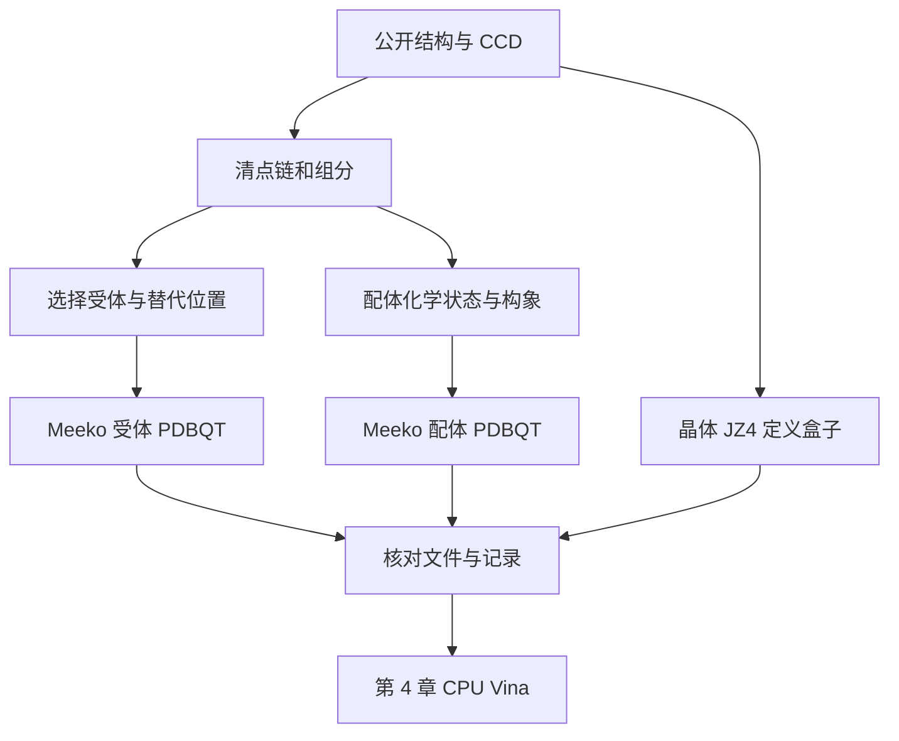

# 第 3 章 结构建模、结合位点与体系准备

第 2 章已看清 3HTB 中的蛋白、JZ4 和附近残基。本章从原始公开文件重新开始，准备一个受体和三个配体，交给第 4 章的 CPU Vina。核心问题是：哪些原子进入计算，采用什么化学状态，搜索哪一片区域。

先不要修改原文件。原始晶体坐标、晶体配体参考和转换后的对接输入分别保存，才能在结果异常时回到具体处理步骤。


```mermaid
flowchart TD
    A[公开结构与 CCD] --> B[清点链和组分]
    B --> C[选择受体与替代位置]
    B --> D[配体化学状态与构象]
    C --> E[Meeko 受体 PDBQT]
    D --> F[Meeko 配体 PDBQT]
    A --> G[晶体 JZ4 定义盒子]
    E --> H[核对文件与记录]
    F --> H
    G --> H
    H --> I[第 4 章 CPU Vina]
```

这条流程把结构来源、组分处理和运行输入对应起来。第 3 章完成准备，第 4 章才生成新的对接姿势。

## 3.1 对接建模的体系类型

受体是当前计算接受配体的分子对象，配体是当前需要生成结合姿势的对象。名称由任务决定；蛋白也可以作为另一个蛋白的配体。准备前先说明参与组分，再选择方法。

| 体系 | 准备重点 | 本书实践位置 |
|---|---|---|
| 蛋白–小分子 | 口袋、质子化、键级、手性、扭转 | 本章与第 4 章基础实跑 |
| 蛋白–蛋白/多肽 | 链、界面、柔性、约束 | 第 4 章方法选择，第 9–10 章设计 |
| 蛋白–核酸 | 核酸类型、链、配对、离子环境 | 第 4 章输入判断 |
| 金属/辅因子体系 | 配位、化学状态、软件支持和参数 | 本章组分取舍，第 5 章模拟准备 |

本案例是 3HTB 中蛋白链 A 与小分子 JZ4。SEQRES 记录序列长 164 个残基；REMARK 465 明确末端 LEU A164 缺失，实际坐标覆盖 A1–A163。本协议使用已有坐标，未补建末端 LEU。蛋白 `ATOM` 共 1364 行，其中一些残基包含 A/B 替代位置；其他组分记录如下。

| 组分 | auth 编号 | 原始记录 | 本协议处理 |
|---|---|---|---|
| 蛋白 | 已有坐标 A1–A163 | 1364 行 ATOM | 保留，替代位置选 A |
| JZ4 | A167 | 10 个重原子 | 从受体删除，单独保存晶体参考 |
| PO4 | A165、A166 | 10 行 HETATM | 此蛋白单组分受体协议移除 |
| BME | A168 | 4 行 HETATM | 此协议移除 |
| HOH | A169–A388 | 220 个水 | 此干燥受体协议移除 |

这份表定义本次计算体系。它不要求其他靶点也删除相同组分。下载 [本案例组分清单](assets/data/component_manifest_3htb.tsv)，对照第 2 章视图确认名称与编号。

## 3.2 同源建模与 AI 结构建模

同一个蛋白可能有多个实验结构和预测模型。选择时先看与当前问题是否匹配：构象、配体、突变、结构范围和局部质量都影响口袋。3HTB 带有 L99A/M102Q 突变，并含 JZ4 晶体参考，适合练习重对接；本章不把它替换成野生型 T4 lysozyme 模型。

实验结构的分辨率描述整体数据尺度，还需看位点局部验证、缺失原子、替代位置、占有率和构象。同源建模用相关蛋白的已知结构作模板，必须说明模板、序列对应关系与覆盖范围。

| 来源 | 先检查什么 | 记录什么 |
|---|---|---|
| 实验结构 | 构象、组分、位点局部质量、缺失、突变 | 条目、方法、分辨率、所选链与残基范围 |
| 同源模型 | 模板覆盖、序列对应、口袋和插入缺失区 | 模板 ID、序列、建模工具和版本 |
| AI 预测结构 | 输入序列、局部置信度、链间关系与几何 | 模型版本、输入、pLDDT/PAE 等输出 |

pLDDT 是部分模型的局部结构置信度指标，PAE 表示相对位置误差相关信息。先确认该模型实际输出这些字段，再按其定义读取。口袋侧链与柔性环区尤其需要检查，不能只看整条链的平均数。

本章基础任务直接使用实验 3HTB；模型比较作为阅读任务。找一个目标的实验结构与预测结构，在相同残基范围叠合，并写出两个口袋区域差异，不要求本机重新训练或运行大型模型。

## 3.3 AlphaFold、OpenFold、Chai-1、Boltz 等结构来源

这些工具解决的问题有交集，输出却不相同。选择前先写清楚输入是单条序列、多个蛋白、核酸还是小分子，并确认模型版本支持的对象。

| 工具或方法 | 本章关注的对象 | 需要保存的输入与输出 |
|---|---|---|
| AlphaFold2 / OpenFold | 蛋白结构模型 | 序列、MSA/模板设置、坐标与置信度 |
| AlphaFold 3 | 多类生物分子相互作用结构 | 各组分输入、约束、坐标与模型指标 |
| Chai-1 | 多组分复合物结构 | 序列/配体、约束、坐标和输出评分 |
| Boltz-2 | 复合物结构与亲和力相关预测 | YAML、组分状态、结构与不同任务字段 |

MSA 是多序列比对，保存相关序列在各位置的对应关系。工具使用现成 MSA、在线检索或本地检索时，应记录实际方式。MSA 的生成和结构推理是不同步骤，文件存在不意味着推理已完成。

如果使用现成预测结构进入对接，至少带上原始输入、模型版本、所选结构和低置信区域。第 8 章另讲 Boltz-2 的非共价输入与亲和力字段，本章不把不同模型的分数放入同一排名表。

## 3.4 结合位点预测工具

有共结晶配体时，可以先围绕其位置设置搜索区域。没有已知配体时，再结合文献残基、已知功能位点和口袋预测工具提出候选区域；各候选区域分别运行和记录，不在多个位置之间混用盒子。

本书用晶体 JZ4 的十个重原子坐标计算算术平均中心，盒子三个方向各 18 Å。中心与盒子尺寸保存在 [box.json](assets/data/3htb/box.json)。

| 参数 | 本案例值 | 定义 |
|---|---|---|
| center_x | 22.714 Å | 晶体配体重原子 x 坐标平均 |
| center_y | −25.263 Å | 晶体配体重原子 y 坐标平均 |
| center_z | −3.283 Å | 晶体配体重原子 z 坐标平均 |
| size_x / y / z | 18 / 18 / 18 Å | 搜索盒子各方向完整边长 |
| 参考 | JZ4 auth A167 | 晶体坐标，未移动到原点 |

盒子应覆盖目标口袋，并留出配体平移和转动空间。第 2 章的 5 Å 邻近残基选择用于观察口袋，18 Å 盒子用于运行搜索，两者定义不同。不要将可视化半径直接填成 Vina 的盒子边长。

选学口袋预测时，使用 ProteinPlus 等有来源的工具，保存输入结构、口袋残基和工具输出。比较预测口袋与本案例晶体 JZ4 区域的重叠情况；若不重叠，记录差异，不把它自动改成晶体口袋。

## 3.5 蛋白、配体、核酸和金属离子体系准备

先完成第 1 章的 `.venv-win` 和依赖安装。下载 [prepare_3htb.py](assets/code/prepare_3htb.py) 到课程目录的 `scripts`，在 PowerShell 中运行。脚本只读取官方公开数据，不读取本地课程素材。

如果使用全书下载器，脚本保存在 `downloads/chapter-03/assets/code`。先复制到工作区；逐文件下载并已放入 `scripts` 的学生跳过这一行。

```powershell
Copy-Item downloads/chapter-03/assets/code/prepare_3htb.py scripts/
```


```powershell
.\.venv-win\Scripts\python.exe scripts/prepare_3htb.py --out inputs/3htb
```

全书下载器已带有五个源文件时，也可在上述命令后加 `--source-dir downloads/chapter-03/assets/data/3htb`，使用本地公开输入重新准备。输出仍写入工作区 `inputs/3htb`，不改下载目录。

它下载 3HTB、晶体 JZ4 参考 SDF，以及 CCD 的 JZ4、IPH、BNZ 理想结构。随后调用 Meeko 准备受体，使用 RDKit 和 Meeko 准备配体。约定如下。

| 处理对象 | 本协议采用的处理 |
|---|---|
| 受体 | auth 链 A 的 ATOM；替代位置 A；已有 163 个残基；Meeko 默认残基模板、补氢和原子类型 |
| 非蛋白组分 | 受体中移除 JZ4、PO4、BME 和水；分别保存原始文件与取舍记录 |
| 配体 | CCD 中性状态；使用 SDF 的键和理想坐标；补氢后 Meeko 转 PDBQT |
| 电荷 | Meeko 默认 Gasteiger 电荷处理；记录实际版本和参数 |
| 未开展的处理 | pH 状态枚举、多个互变异构体/受体构象、水保留对照 |

蛋白的质子化影响侧链电荷，配体的质子化、互变异构和手性影响化学对象。本案例保持 CCD 中性状态，不把它称为“某 pH 下的最优状态”。真实分子若有可电离基团，应先确定研究条件，再为每种待比较状态单独命名和准备。

受体准备的实际命令写入 `preparation_commands.json`。下面展示对应 Meeko 入口，通常由脚本自动执行，不必再手工运行一次。

```powershell
.\.venv-win\Scripts\python.exe -m meeko.cli.mk_prepare_receptor --read_pdb inputs/3htb/3htb_receptor.pdb --default_altloc A -o inputs/3htb/3htb_receptor -p -v --box_center 22.714 -25.263 -3.283 --box_size 18 18 18
```

`--read_pdb` 使用 Meeko 的读取方式，`--default_altloc A` 指定替代位置。不要遇到未识别残基便添加跳过选项。先定位残基，判断它是不是位点或必需组分，再决定补齐、换参数或停止该体系。

| 运行后文件 | 怎样核对 |
|---|---|
| `3htb.pdb` | 原始文件保持完整 |
| `3htb_receptor.pdb` | 提取的链 A，仍保留原 ATOM 替代位置供 Meeko 选择 |
| `3htb_receptor.pdbqt` | 准备完成；本次 1626 个原子记录，含补入的极性氢 |
| `JZ4.pdbqt`、`IPH.pdbqt`、`BNZ.pdbqt` | 三项均非空；对应 10/7/6 个重原子 |
| `receptor_preparation.log` | 无最终失败；警告有具体说明 |
| `ligand_manifest.tsv` | 来源、文件、原子数、形式电荷和状态假设完整 |
| `download_sources.json` | 五个官方下载地址与文件哈希 |

读取日志和清单，确认程序没有因一个配体失败而只留下部分文件。

```powershell
Get-Content inputs/3htb/receptor_preparation.log
Get-Content inputs/3htb/ligand_manifest.tsv
Get-Content inputs/3htb/box.json
```

本案例真实准备过程中出现过三类问题，可据此练习排错。

| 信息 | 原因与处理 |
|---|---|
| 使用 `-i` 时提示需要 ProDy | Meeko 0.8.0 该读取路径依赖 ProDy；本脚本改用官方支持的 `--read_pdb` |
| 提示需要选择 alternate location | 原文件含替代位置；明确选 A，并在可视化中排除 B |
| SDF 标注 2D，但 z 坐标不为零 | RCSB 文件标签与坐标不一致；RDKit 按非零 z 识别为 3D，核对坐标后继续 |

最后一项是格式注释警告，不等于结构已平面化。若遇到化学键读取失败、未知原子类型或受体模板不匹配，则应先停下查看具体对象。

## 3.6 多组分复合物和辅因子处理

准备受体不是默认删除全部 HETATM。金属、辅因子、修饰残基和水可能位于计算关注区域，也可能属于与问题无关的晶体条件。判断顺序是查看结构位置、查证功能或文献，再确认所用方法能否正确表示。

| 对象 | 决定前要回答的问题 | 处理记录 |
|---|---|---|
| 金属离子 | 是否维持位点或直接配位？模型支持什么几何？ | 元素、价态假设、配位原子、参数方法 |
| 辅因子 | 是否形成口袋或参与反应？ | 名称、编号、化学状态、保留理由 |
| 水 | 是否有位点依据？是否比较保水协议？ | 原编号、取舍和对应方法 |
| 核酸 | 哪条链与蛋白共同构成体系？ | 序列、链、完整性、离子条件 |
| 修饰残基 | 是否影响位点或拓扑？ | 修饰类型、软件识别和参数来源 |

对 3HTB，本书固定采用蛋白单组分、干燥、刚性受体协议，并保存 PO4/BME/HOH 的原始信息。这个选择让学生先运行完整小流程。若研究目标转为分析水或缓冲组分，应新建一份保留协议，不能只把原子加回 PDBQT 而不重新准备。

下载 [组分清单示例](assets/component_manifest_example.tsv)，为另一公开结构填写三项：必须保留、暂移除、当前工具无法处理。每个决定给出具体依据，遇到无法参数化的位点金属时不继续套用本章小分子流程。

## 3.7 结构进入对接前的复核清单

准备完成后，将原始与处理后文件一并打开。核对链 A、配体参考和盒子是否处于同一坐标系；不要对受体单独移动或对齐后仍使用旧盒子。

本案例可以从清单看到处理前后的区别：原蛋白 1364 个 ATOM 记录，选择 altloc A 后 163 个残基、1300 个重原子位置，受体 PDBQT 为 1626 个原子记录。原子数增加来自补氢，替代位置减少来自 A/B 选择；不同文件的“原子数”必须说明统计对象。

| 对接前检查 | 本案例通过条件 |
|---|---|
| 来源 | 3HTB 和 CCD 下载地址、哈希齐全 |
| 体系 | 蛋白 auth A，替代位置 A，组分取舍明确 |
| 配体 | JZ4/IPH/BNZ 与化学名称一致；中性状态记录完整 |
| 坐标 | 受体、参考 JZ4、盒子保持原晶体坐标 |
| 输出 | 一份 receptor PDBQT、三份 ligand PDBQT、box.json 均存在 |
| 日志 | 准备完成，警告有解释，未静默跳过必需残基 |

网络不便时，可从课程资源逐项下载 [公开输入与准备记录](assets/data/3htb/download_sources.json) 所列文件，保持目录布局；也可用脚本的 `--source-dir` 指向已下载的五个源文件重新准备。基础任务建议亲自准备一次，再将文件哈希与配套资源对照。

对照练习是比较原始 PDB、提取受体 PDB 和 PDBQT，分别统计替代位置、非蛋白组分和原子记录。写出每个差异对应哪一步，不把“数量少了”直接解释为质量更好。

## 本章方法适用范围与结果解释

本章获得的是按指定协议准备的计算输入。实验结构、同源模型和 AI 预测结构的适用性取决于问题与局部质量；预测位点与模型评分用于提出候选。质子化、化学状态、替代位置和组分取舍都是本次输入条件，准备成功不会自动保证对接准确。第 4 章将用晶体 JZ4 做实际重对接，观察这个协议能否恢复参考位置，再扩展到小批量。

## 文献与来源

结构预测方法参见 AlphaFold2、AlphaFold 3、Chai-1 与 Boltz-2 原始研究；本书文献映射保留以下条目，完整信息见全书参考文献。Meeko 的命令与准备机制参见 [官方文档](https://meeko.readthedocs.io/en/develop/)，小分子文件要求见 [Vina 基础教程](https://autodock-vina.readthedocs.io/en/latest/docking_basic.html)。

- Jumper, J., Evans, R., Pritzel, A., Green, T., Figurnov, M., Ronneberger, O. et al. Highly accurate protein structure prediction with AlphaFold. Nature (2021). https://doi.org/10.1038/s41586-021-03819-2

- Abramson, J., Adler, J., Dunger, J., Evans, R., Green, T., Pritzel, A. et al. Accurate structure prediction of biomolecular interactions with AlphaFold 3. Nature (2024). https://doi.org/10.1038/s41586-024-07487-w

- Chai Discovery et al. Chai-1: Decoding the molecular interactions of life. bioRxiv (2024，预印本). https://doi.org/10.1101/2024.10.10.615955

- Passaro, S., Corso, G., Wohlwend, J. et al. Boltz-2: Towards Accurate and Efficient Binding Affinity Prediction. bioRxiv (2025，预印本). https://doi.org/10.1101/2025.06.14.659707

- Du, L., Geng, C., Zeng, Q., Huang, T., Tang, J., Chu, Y. et al. Dockey: a modern integrated tool for large-scale molecular docking and virtual screening. Briefings in Bioinformatics 24, bbad047 (2023). https://doi.org/10.1093/bib/bbad047

- Agrawal, P., Singh, H., Srivastava, H. K., Singh, S., Kishore, G. & Raghava, G. P. S. Benchmarking of different molecular docking methods for protein-peptide docking. BMC Bioinformatics 19, 426 (2019). https://doi.org/10.1186/s12859-018-2449-y

- Crampon, K., Giorkallos, A., Deldossi, M., Baud, S. & Steffenel, L. A. Machine-learning methods for ligand-protein molecular docking. Drug Discovery Today 27, 151-164 (2022). https://doi.org/10.1016/j.drudis.2021.09.007

- Gu, S., Shen, C., Zhang, X., Sun, H., Cai, H., Luo, H. et al. Benchmarking AI-powered docking methods from the perspective of virtual screening. Nature Machine Intelligence 7, 509-520 (2025). https://doi.org/10.1038/s42256-025-00993-0

<!-- citation-keys: jumper_highly_2021, abramson_accurate_2024, chai_discovery_chai-1_2024, passaro_boltz-2_2025, du_dockey_2023, agrawal_benchmarking_2019, crampon_machine-learning_2022, gu_benchmarking_2025 -->
