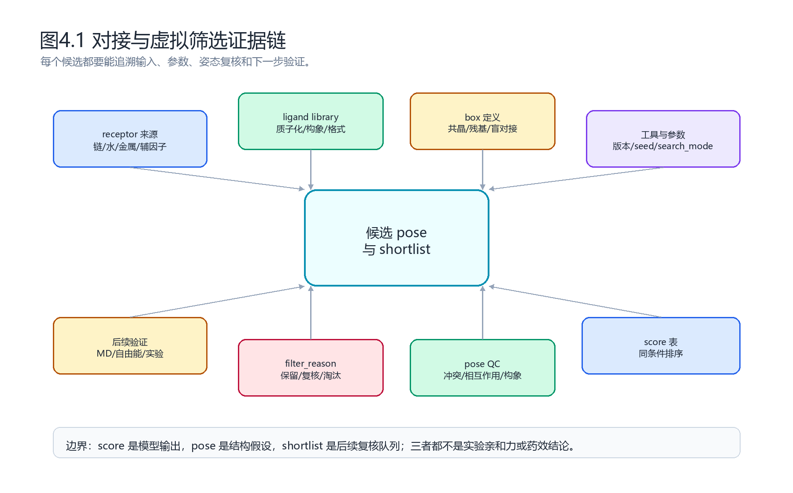
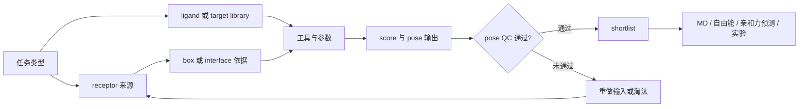
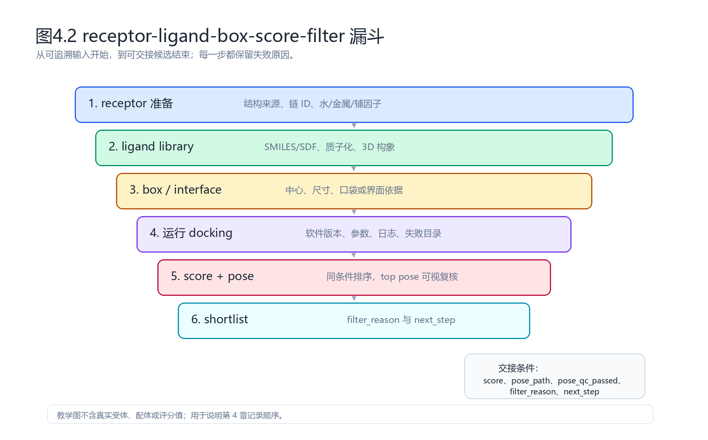
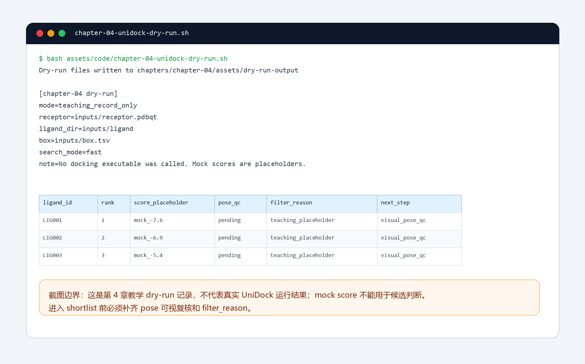

# 第 4 章 分子对接与虚拟筛选

## 本章导读

上一章把结构来源、结合位点和体系准备讲清之后，研究者会进入一个更具体的选择问题：哪些小分子、肽段、蛋白、核酸片段或靶点组合值得进入下一步复核？分子对接和虚拟筛选的任务，是在有限计算资源下生成可检查的候选姿态和排序线索。

本章不把对接写成“自动发现药物”。一个 docking score 只能说明模型在给定输入和参数下给出的排序；一个 top pose 只是结构假设；一个 shortlist 只是后续复核队列。读者需要学会保存 receptor、ligand、box、software、score、pose QC、filter_reason 和 next_step。

第 5 章会把本章 shortlist 交给分子动力学和构象稳定性复核。第 7 章再讨论亲和力预测、自由能或模型评分。因此，本章结束时应留下可追溯候选表，而不是只留下一个“分数最低”的分子名称。

## 材料使用说明

本章先读取根目录 `大纲.md`，再读取 `chapters/chapter-04/本章大纲.md`，随后读取第 4 章来源素材和整理笔记。正文只使用整理后的教材化内容，不复制原始 PDF、课件截图、Office 文件或压缩包。

| 来源类型 | 本章使用方式 |
|:---|:---|
| `06_原始学习素材/第三章AI多组分对接与正-反-互作虚拟筛选.md` | 提取 docking 概念、传统工具、AI 对接、正反向虚拟筛选和 UniDock 示例线索 |
| `06_原始学习素材/第三章补充MSA_unidock更新.md` | 提取 MSA、UniDock 输入、脚本和 batch 运行边界 |
| `06_原始学习素材/第03章_AI多组分对接与虚拟筛选/全文提取/.../全文.md` | 核对 OCR/全文提取中的工具名、页内主题和示例顺序 |
| `02_方法笔记/AI多组分对接与虚拟筛选.md` | 落实 receptor、ligand、box、score、pose QC 和 shortlist 记录规范 |
| `02_方法笔记/MSA与Uni-Dock补充.md` | 说明 UniDock 补充资料只作为复现注意事项 |
| `03_文献笔记/分子对接与虚拟筛选.md` | 界定文献案例只能作为方法锚点和边界提示 |
| `04_实验记录/模板_对接虚拟筛选记录.md` | 提供练习记录字段 |
| `07_研究工作台/证据与claims矩阵.md` | 统一 score、pose、shortlist 的 claim 边界 |

### 工具名口径

原始素材中同时出现 `SurDock`、`SurfDock` 和 `Surdock` 写法。本章采用 `SurfDock` 作为正式工具名，因为 Nature Methods 论文和项目仓库均使用 `SurfDock`。`SurDock` 在正文中只作为原始材料中的不统一写法说明。

`Transform-AF3` 本轮未检索到可确认的论文、官方仓库或文档主来源。正文不把它列为正式工具。涉及 AlphaFold 3 时，本章只把它作为全原子生物分子相互作用结构预测来源，不写成传统 docking 工具。

| 名称 | 本章处理 | 依据 |
|:---|:---|:---|
| SurfDock | 正式工具名 | SurfDock Nature Methods 论文和 GitHub 实现 |
| SurDock / Surdock | 原始素材中的不统一写法 | 仅用于术语统一说明 |
| Transform-AF3 | 暂不作为正式工具 | 未检索到可确认主来源 |
| AlphaFold 3 | 复合物结构预测工具 | 用于说明结构预测和 docking 的边界 |

## 学习目标

完成本章后，读者应能够：

- 区分传统 docking、AI docking、复合物结构预测和虚拟筛选。
- 为蛋白-小分子、蛋白-蛋白、蛋白-核酸和蛋白-金属体系建立输入记录。
- 建立 ligand library 或 target panel manifest，保留失败项和处理原因。
- 说明正向筛选、反向筛选和互作筛选的起点、输出和验证路径。
- 把 docking score、pose、rescore 和 shortlist 写成有边界的候选证据。

## 知识图谱入口



**图4.1 对接与虚拟筛选证据链。** 本图是第 4 章专属教学图，用来说明 receptor、ligand library、box、工具参数、score 表、pose QC、filter_reason 和后续验证之间的证据关系。图中不包含真实受体、配体或评分值。



这张 Mermaid 图强调“记录依赖”，不表示真实软件已经运行。读者可以用它检查自己的实验记录是否缺少输入、参数、pose 文件或失败原因。

## 核心概念拆解

分子对接把三维结合问题拆成三个计算对象：搜索空间、候选姿态和评分函数。搜索空间决定分子在哪里尝试结合；候选姿态决定配体或复合物怎样放置；评分函数把候选姿态转成可排序信号。

| 概念 | 读者要问的问题 | 记录字段 |
|:---|:---|:---|
| receptor | 结构从哪里来，链、水、金属和辅因子怎样处理 | `receptor_path`、`chain_id`、`cofactor_rule` |
| ligand | 分子状态是否合理，格式转换是否保留化学信息 | `ligand_id`、`source`、`protonation_state`、`prepared_path` |
| box | 搜索空间来自共晶配体、口袋残基还是盲对接 | `center_x/y/z`、`size_x/y/z`、`box_basis` |
| score | 是否在同一软件、同一受体、同一参数下排序 | `software_version`、`score`、`rank` |
| pose | 是否进入合理口袋，有无明显冲突 | `pose_path`、`pose_qc_passed`、`interaction_summary` |
| shortlist | 为什么进入下一步，为什么淘汰其他候选 | `filter_reason`、`next_step` |

对接流程中最常见的问题不是“软件不会跑”，而是运行后无法复查。缺少 manifest、box 依据、参数记录或 pose QC 时，筛选结果只能作为练习输出。

## 4.1 传统对接工具

传统工具通常把构象搜索和评分分开处理。Vina 常用于蛋白-小分子口袋对接；HDOCK、HADDOCK 和 LightDock 更常用于蛋白-蛋白、蛋白-肽或较大的复合物对接。工具选择应从任务对象出发，而不是从教程里最先出现的软件出发。

| 工具 | 典型对象 | 关键输入 | 主要输出 | 解释边界 |
|:---|:---|:---|:---|:---|
| AutoDock Vina | 蛋白-小分子 | receptor PDBQT、ligand PDBQT、box | pose、score、log | score 适合同条件排序，不能写成实验 Kd |
| HDOCK | 蛋白-蛋白、蛋白-核酸 | 两个结构，可选结合位点信息 | 复合物模型和排名 | 需要界面残基、链方向和构象复核 |
| HADDOCK | 蛋白-蛋白、蛋白-肽、多体复合物 | 结构和约束信息 | cluster、score、模型 | 约束来源和 cluster 解释要单独记录 |
| LightDock | 大分子柔性对接 | receptor、ligand、采样参数 | 多个候选模型 | 依赖采样、聚类和界面复核 |

Vina 分数常以 kcal/mol 形式输出，但它是加权评分，不是实验亲和力。HADDOCK 的 cluster size、RMSD、Z-score 和能量项也不能单独证明真实结合，只能帮助选择需要进一步检查的模型。

## 4.2 AI 对接工具与复合物结构预测

AI docking 把深度学习用于姿态生成、排序、置信度估计或复合物建模。DiffDock 代表扩散式姿态生成思路；SurfDock 将蛋白表面信息纳入扩散生成；部分全原子模型则更接近复合物结构预测，而不是传统 docking。

| 方法位置 | 代表工具或来源 | 能帮助什么 | 仍要记录什么 |
|:---|:---|:---|:---|
| 扩散式姿态生成 | DiffDock | 生成小分子候选姿态 | 输入结构、配体状态、采样次数、置信度 |
| 表面信息辅助生成 | SurfDock | 将蛋白表面特征纳入 ligand pose 生成 | 模型版本、口袋定义、pose 复核 |
| 复合物结构预测 | AlphaFold 3、RoseTTAFold All-Atom、Chai-1、Boltz 系列 | 同时建模蛋白、核酸、小分子或多组分体系 | 链定义、MSA、输入格式、局部置信度 |
| AI 重打分或筛选 | ML scoring、benchmark 工具 | 对候选 pose 或 library 做排序补充 | 训练适用域、数据泄漏风险、外推边界 |

AI 工具并不自动消除输入错误。配体质子化错误、口袋定义过宽、金属配位没有处理、链 ID 混乱或模板污染，都会让模型输出看起来精致但证据不足。

## 4.3 蛋白-小分子对接

蛋白-小分子对接最容易出错在 ligand 状态和 box。一个分子在不同 pH、互变异构、手性或电荷假设下可能产生不同 pose；一个 box 若没有覆盖真实口袋，分数再低也没有解释价值。

| 检查对象 | 必须记录 | 常见失败 |
|:---|:---|:---|
| receptor | 来源、链、缺失区域、水/金属/辅因子、质子化 | 口袋附近缺失残基未处理 |
| ligand | 数据库 ID、SMILES/SDF、质子化、手性、电荷、3D 构象 | 键级或电荷在格式转换中丢失 |
| box | center、size、依据、单位 | 只写“默认”，无法复查 |
| pose | 口袋位置、空间冲突、关键相互作用 | pose 穿出蛋白或构象扭曲 |

稳健写法是“该候选 pose 提供进入复核的结构线索”。在没有实验测定、自由能或充分动力学复核前，不写“该分子强结合靶点”。

## 4.4 蛋白-蛋白对接

蛋白-蛋白对接关注界面，而不是一个小分子口袋。输入通常包含两个蛋白结构、链方向、可能界面残基、构象状态和约束信息。HDOCK、HADDOCK、LightDock 或复合物预测模型都可以给出候选界面，但都需要结构复核。

| 复核点 | 允许解释 | 不允许直接推出 |
|:---|:---|:---|
| 界面残基接触 | 可能互作界面 | 真实 PPI 已确认 |
| 电荷和疏水互补 | 与互作假设一致 | 结合强度已知 |
| cluster 或排名 | 模型收敛线索 | 功能协同已经发生 |
| 约束满足程度 | 输入假设被模型采纳 | 约束来源本身正确 |

如果界面与已知功能位点、突变位点或保守表面没有关系，应标记为 `review`，而不是直接进入实验队列。

## 4.5 蛋白-核酸对接

蛋白-核酸体系要同时处理序列、方向、碱基构象、糖磷酸骨架和电荷环境。核酸不是“更长的配体”，它的柔性、电荷和构象约束会改变对接解释。

| 对象 | 记录重点 | 复核重点 |
|:---|:---|:---|
| DNA/RNA 序列 | 序列、链方向、修饰、结构来源 | 是否与研究问题匹配 |
| 蛋白结构 | DNA/RNA 结合域、缺失环区、质子化 | 是否保留关键正电荷区域 |
| 复合物 pose | 沟槽结合、盐桥、碱基接触 | 是否有严重空间冲突 |
| 后续验证 | 突变、EMSA、ChIP、结构实验 | docking 不能替代结合实验 |

正文只能写“该构象可作为蛋白-核酸相互作用假设”。若没有实验或高置信结构证据，不写成序列特异性结合已经成立。

## 4.6 蛋白-金属离子对接

金属离子体系不能只靠一般 docking score 判断。价态、配位数、配位残基、距离、角度、水分子和参数化方式都会影响结果。素材中提到金属蛋白相关 AI 对接工具时，本章只作为任务类型提示。

| 问题 | 为什么关键 | 正文边界 |
|:---|:---|:---|
| 金属价态 | 决定配位和电荷环境 | 未确认价态时标记 `review` |
| 配位几何 | 影响 pose 是否化学合理 | 只看 score 不够 |
| 水和辅因子 | 可能参与真实结合 | 删除/保留规则要写清 |
| 参数来源 | 不同力场或工具处理不同 | 需要后续模拟或实验复核 |

稳健表达是“该结果需要配位化学、参数化和后续计算复核”。不要把含金属体系的低分 pose 写成稳定结合已经证明。

## 4.7 小分子数据库建立

小分子库首先是一张 manifest，而不是一堆 SDF 或 PDBQT 文件。manifest 让读者知道每个分子从哪里来、以什么状态进入对接、哪些分子失败、失败原因是什么。

| 字段 | 记录内容 | 失败时处理 |
|:---|:---|:---|
| `ligand_id` | 库内唯一 ID | 不允许重复 |
| `source` | ZINC、ChEMBL、自建库、文献或用户输入 | 来源不明标记 `review` |
| `canonical_smiles` | 标准化结构 | 解析失败保留原始输入 |
| `protonation_state` | pH 假设、工具、电荷 | 不确定时不进入精筛 |
| `prepared_path` | SDF/MOL2/PDBQT 输出 | 转换失败写入 fail 表 |
| `qc_status` | pass/review/fail | 不静默删除失败分子 |

一个好的 library 准备流程应先小批量 dry-run。若 3 个分子都无法解释格式转换、质子化和输出路径，就不应直接扩大到百万级筛选。

## 4.8 正向虚拟筛选

正向虚拟筛选从一个靶点或一个口袋出发，在 ligand library 中找候选分子。它适合回答“哪些分子值得围绕这个靶点继续检查”，不适合直接回答“哪个分子已经有效”。



**图4.2 receptor-ligand-box-score-filter 漏斗。** 本图展示从 receptor、ligand library、box 到 score、pose QC 和 shortlist 的记录顺序。图中没有真实受体、配体或评分值。

| 阶段 | 输出 | 判断 |
|:---|:---|:---|
| 准备 receptor | receptor manifest | 来源和口袋是否可追溯 |
| 准备 ligand library | ligand manifest | 分子状态和失败项是否记录 |
| 定义 box | box 表 | 依据是否能解释 |
| 运行对接 | pose、score、log | 参数是否可复查 |
| 过滤候选 | shortlist | filter_reason 是否具体 |

正向筛选的候选可以进入 MD、MM/GBSA、FEP、Boltz2 或实验测定。进入下一步的理由不能只有“score 更低”，还要有 pose 合理性和化学可解释性。

## 4.9 反向虚拟筛选

反向虚拟筛选从一个分子、天然产物或候选结构出发，去查找可能靶点。它的输出是 target shortlist，而不是直接的作用机制。靶点库来源、蛋白结构质量和疾病相关性都要单独记录。

| 起点 | 输出 | 还需要补什么 |
|:---|:---|:---|
| 一个小分子 | 候选靶点列表 | 靶点表达、疾病关联、实验验证 |
| 一个天然产物 | 可能互作蛋白 | 结构确认、ADMET、靶点参与证据 |
| 一个蛋白面板 | 排名和 pose | panel 覆盖范围和失败靶点 |

反向筛选特别容易被写成“找到了靶点”。更稳妥的写法是“给出候选靶点列表，后续需要结合靶点可成药性、表达证据和实验验证”。

## 4.10 UniDock 与大规模批量筛选

UniDock 适合放在批量筛选主线中讲，因为原始素材提供了 receptor、ligand directory、box 参数、search mode、输出目录和分析脚本的线索。它不是唯一推荐工具；它的教学价值在于让读者理解大规模筛选需要怎样组织输入、日志、失败项和结果表。

原始补充材料中出现 MSA 数据库、E-value、UniDock-Pro 命令和 GPU 环境经验。正文只把这些内容作为课程环境背景，不写成通用性能 benchmark。

| 记录对象 | 示例字段 | 为什么要保存 |
|:---|:---|:---|
| 输入目录 | `receptor_path`、`ligand_dir`、`box.tsv` | 让别人知道筛选从哪里开始 |
| 运行参数 | `search_mode`、`center`、`size`、`batch_id` | 避免不同批次混在一起 |
| 日志 | `log_path`、失败目录 | 判断是否有静默失败 |
| 结果表 | `score`、`rank`、`pose_path` | 支持同条件排序 |
| 复核表 | `pose_qc_passed`、`filter_reason` | 决定是否进入 shortlist |

### 第 4 章 dry-run 资源

本章配套 dry-run 脚本位于 `chapters/chapter-04/assets/code/chapter-04-unidock-dry-run.sh`。它只生成教学用记录表，不调用 UniDock，也不产生真实 docking score。

```bash
bash chapters/chapter-04/assets/code/chapter-04-unidock-dry-run.sh
```

运行后会生成 `inputs/box.tsv`、`inputs/ligand_library_manifest.tsv`、`outputs/docking_manifest.tsv`、`outputs/top_pose_qc.tsv` 和 `logs/unidock-dry-run.log`。这些文件用于训练记录意识，不能写成真实筛选结果。



**图4.3 UniDock 类 dry-run 操作截图。** 截图展示第 4 章 dry-run 的命令、日志和 manifest 字段。`mock score` 只是占位符，进入 shortlist 前必须补齐 pose 可视复核和 filter_reason。

| 文件 | 用途 | 边界 |
|:---|:---|:---|
| `assets/code/chapter-04-unidock-dry-run.sh` | 生成教学 dry-run 表 | 不调用真实 docking 软件 |
| `assets/code/chapter-04-docking_manifest_example.tsv` | 展示结果表字段 | `mock` 分数不能用于候选判断 |
| `assets/asset_manifest.tsv` | 管理本章图、截图和代码资源 | 记录资源状态，不是实验记录 |

## 4.11 Score、pose 与 shortlist 边界

score、pose 和 shortlist 是三类证据。score 是模型输出；pose 是结构假设；shortlist 是人工定义的后续队列。把三者混写，会让读者误以为一个低分数已经证明结合。

| 对象 | 可以支持 | 不能支持 | 推荐写法 |
|:---|:---|:---|:---|
| docking score | 同一流程下的候选排序 | 实验亲和力、活性、机制 | “排序更靠前” |
| top pose | 可能结合构象和相互作用假设 | 真实结合模式已经确认 | “提供可能构象” |
| rescore | 对候选排序提供补充 | 自动纠正全部输入错误 | “作为补充排序信号” |
| shortlist | 下一步复核或实验队列 | 已发现命中物 | “进入后续验证” |
| AI confidence | 模型内部质量信号 | 跨模型绝对结论 | “在该模型下置信度较高” |

一个低 score 分子如果 pose 穿出口袋、配体构象扭曲、金属配位错误或关键相互作用无法解释，应被标记为 `fail` 或 `review`。相反，一个分数不是最低但 pose 合理、化学状态清楚、后续可验证的候选，可以进入复核队列。

## 方法流程

本章流程从任务定义开始，以候选交接结束。每一步都要写清输入、动作、输出和边界。

| 步骤 | 输入 | 动作 | 输出 | QC/边界 |
|:---:|:---|:---|:---|:---|
| 1 | 研究问题 | 定义正向、反向、互作或批量筛选任务 | 任务记录 | 不把工具选择先于问题定义 |
| 2 | receptor 或靶点库 | 处理链、水、金属、辅因子和质子化 | receptor manifest | 结构来源和口袋依据可追溯 |
| 3 | ligand 或蛋白库 | 生成结构、格式转换、状态检查 | library manifest | 失败样本保留原因 |
| 4 | 口袋或界面 | 定义 box、约束或参考配体 | box/constraint 表 | 依据不能只写“默认” |
| 5 | 工具和参数 | 运行 Vina、UniDock、HDOCK、DiffDock 或复合物预测 | pose、score、log | 软件版本和参数可复查 |
| 6 | 结构复核 | 检查冲突、相互作用、构象和金属/水处理 | top pose QC 表 | 不只按 score 排名 |
| 7 | 过滤与交接 | 合并 score、pose、化学规则和人工判断 | shortlist | 候选进入后续验证，不写成命中 |

### 工具选择判断路径

| 如果你的问题是 | 优先考虑 | 补充说明 |
|:---|:---|:---|
| 单靶点筛小分子库 | Vina、UniDock 或同类工具 | 先小批量 dry-run，再扩大库 |
| GPU 批量筛选 | UniDock 类批处理 | batch、失败目录和日志必须保留 |
| 蛋白-蛋白或蛋白-肽复合物 | HDOCK、HADDOCK、LightDock | 输出需要界面复核 |
| 小分子姿态生成 | DiffDock、SurfDock 等 AI docking | 记录模型版本、采样和置信度 |
| 多组分结构假设 | AlphaFold 3、RFAA、Chai-1、Boltz 系列 | 输入假设和局部置信度比总分更关键 |

## 实验/练习入口

本章练习目标不是找到“命中分子”，而是把一次筛选写成可以交接的记录。建议从 1 个 receptor 和 3 个 ligands 开始。

1. 写出 receptor 来源、链 ID、水/金属/辅因子处理和 box 依据。
2. 建立 ligand manifest，记录来源、结构、质子化、构象和格式转换状态。
3. 运行第 4 章 dry-run 脚本或等价的小批量流程。
4. 对 top pose 做人工复核，记录空间冲突、关键相互作用和构象合理性。
5. 把一个候选转写成保守 claim，并列出 MD、亲和力预测或实验验证需求。

练习完成后，检查记录是否包含 `ligand_id`、`score`、`pose_path`、`pose_qc_passed`、`filter_reason` 和 `next_step`。缺少这些字段时，shortlist 不应进入后续研究结论。

## 关键文献与命名锚点

本章文献用于支撑流程设计、benchmark 视角和工具命名，不代表 AI_MD 已完成本地筛选。

<!-- refs:start -->

- Du, L., Geng, C., Zeng, Q., Huang, T., Tang, J., Chu, Y. et al. Dockey: a modern integrated tool for large-scale molecular docking and virtual screening. Briefings in Bioinformatics 24, bbad047 (2023). https://doi.org/10.1093/bib/bbad047

  **本文内容简介：** 本文介绍大规模对接与虚拟筛选的集成流程和结果管理。

- Agrawal, P., Singh, H., Srivastava, H. K., Singh, S., Kishore, G. & Raghava, G. P. S. Benchmarking of different molecular docking methods for protein-peptide docking. BMC Bioinformatics 19, 426 (2019). https://doi.org/10.1186/s12859-018-2449-y

  **本文内容简介：** 本文比较蛋白-肽 docking 方法，提示肽构象需单独复核。

- Crampon, K., Giorkallos, A., Deldossi, M., Baud, S. & Steffenel, L. A. Machine-learning methods for ligand-protein molecular docking. Drug Discovery Today 27, 151-164 (2022). https://doi.org/10.1016/j.drudis.2021.09.007

  **本文内容简介：** 本文综述机器学习在 ligand-protein docking 中的作用和限制。

- Gu, S., Shen, C., Zhang, X., Sun, H., Cai, H., Luo, H. et al. Benchmarking AI-powered docking methods from the perspective of virtual screening. Nature Machine Intelligence 7, 509-520 (2025). https://doi.org/10.1038/s42256-025-00993-0

  **本文内容简介：** 本文从虚拟筛选角度评估 AI docking 方法的排序能力和局限。

- Cao, D., Chen, M., Zhang, R. et al. SurfDock is a surface-informed diffusion generative model for reliable and accurate protein-ligand complex prediction. Nature Methods 22, 310-322 (2025). https://doi.org/10.1038/s41592-024-02516-y

  **本文内容简介：** 本文是本章统一 `SurfDock` 工具名的主来源，也用于说明表面信息辅助扩散式 docking。

- Abramson, J., Adler, J., Dunger, J. et al. Accurate structure prediction of biomolecular interactions with AlphaFold 3. Nature 630, 493-500 (2024). https://doi.org/10.1038/s41586-024-07487-w

  **本文内容简介：** 本文用于说明 AlphaFold 3 是生物分子相互作用结构预测来源，不把它写成传统 docking 工具。

<!-- refs:end -->

## 使用边界与常见误读

本章最容易被过度解释的是 docking score、AI docking 排名和蛋白互作筛选结果。它们可以帮助生成假设，但不能单独证明结合、活性、协同效应、毒性或个体化治疗响应。

| 易误读对象 | 稳健表述 | 写作处理 |
|:---|:---|:---|
| “分数更低” | 在同一流程下排序更靠前 | 不写成结合更强或药效更好 |
| “top pose 合理” | 提供可能结合构象 | 仍需结构、动力学、自由能或实验复核 |
| “AI docking 更准” | 在特定 benchmark 中可能表现更好 | 说明适用域和输入条件 |
| “蛋白互作筛选命中” | 提示可能互作界面或候选靶点 | 需要共表达、共定位、突变或功能验证 |
| “反向筛选找到靶点” | 给出候选靶点列表 | 不能替代靶点参与疾病或药效的证据 |

对于药物化学写作，建议先把“hit”“强结合”“有效抑制”替换成“候选”“排序线索”“待复核构象”。只有实验测定、自由能计算、重复轨迹或功能数据补齐后，才考虑更强表述。

## 下一步任务

完成本章后，shortlist 应进入下一层证据，而不是直接进入结论。

| 下一章或模块 | 接收什么 | 复核什么 |
|:---|:---|:---|
| 第 5 章分子动力学 | top pose、结构文件、关键相互作用 | 构象稳定性和相互作用持续性 |
| 第 7 章亲和力/自由能 | 候选表、pose、输入 YAML 或参数 | predicted affinity、MM/GBSA 或模型输出边界 |
| 研究工作台 | 靶点、配体、证据层级、filter_reason | 文献案例、dry-run、本地运行和实验结果之间的区别 |

后续若要扩大筛选规模，优先补齐三类材料：library manifest、top pose 复核表、失败样本与重跑规则。它们比单独增加 score 表更重要，因为它们决定候选能否被复查和交接。
