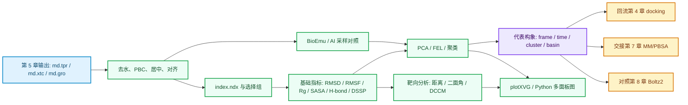

# 第 6 章 轨迹分析、构象解释与 AI 采样

## 本章导读

第 5 章结束后，读者手里通常会有 `md.tpr`、`md.xtc`、`md.gro`、`md.edr`、`md.log` 和若干平衡阶段文件。这些文件说明 production MD 已经产生输出，但不说明体系已经稳定，也不说明配体、界面或活性位点的行为可以直接写成机制结论。

本章的任务，是把轨迹整理成可分析输入，把 `.xvg`、代表构象、结构图和 BioEmu 样本写成有边界的证据。读者要能回答五个问题：输入轨迹是否可复查，选择组是否说清，图表来自哪条命令，代表构象为什么被选中，这些结果最多能支持什么判断。

本章的核心边界如下。

| 读者拿到什么 | 本章要做什么 | 本章不能推出什么 |
|:---|:---|:---|
| `md.xtc`、`md.tpr`、`md.gro` | 生成去水、PBC 处理、居中和对齐后的分析轨迹 | 不能因为轨迹存在就说明模拟质量合格 |
| RMSD/RMSF/Rg/SASA/H-bond/DSSP 曲线 | 判断整体漂移、局部柔性、紧凑性、暴露面积和相互作用线索 | 不能单独证明功能、药效或真实亲和力 |
| PCA/FEL/聚类结果 | 选择候选构象状态和代表帧 | 不能把二维低能谷写成完整自由能全貌 |
| BioEmu 样本 | 提供蛋白单体构象集合的 AI 采样线索 | 不能写成真实时间轨迹或动力学速率 |

## 学习目标

完成本章后，读者应能够：

- 保留原始轨迹，同时生成 `md_nowater.xtc`、`md_nowater.gro`、`md_fit.xtc` 和 `index.ndx`。
- 解释 RMSD、RMSF、Rg、SASA、氢键和二级结构各自回答的问题。
- 用 PCA、FEL 和聚类选择代表构象，并记录 frame、time、cluster 或 basin 来源。
- 用特定距离、氢键占据、二面角和 DCCM 回答预先定义的结构问题。
- 用 plotXVG 或 Python 将 `.xvg` 转成统一风格的多面板图，并保留原始数据和脚本参数。
- 区分随机帧、指定时间帧、聚类代表帧和 FEL 谷底附近帧。
- 把代表构象回流到第 4 章 ensemble docking、第 7 章 MM/PBSA 和第 8 章 Boltz2 对照。
- 说明 BioEmu 的论文、官方仓库、模型 checkpoint、最小运行示例和适用边界。

## 使用材料与来源边界

本章先读取根目录 `大纲.md`，再读取 `chapters/chapter-06/本章大纲.md`。随后使用第 04 章原始学习素材、全文提取、OCR 清洗摘要、提取质量报告、章节精读、方法卡、实验记录模板和 claims 矩阵。正文不复制原始 PDF、课件截图、Office 文件或压缩包。

| 材料 | 本章使用方式 | 边界 |
|:---|:---|:---|
| `大纲.md` | 确认第 6 章在全书中的位置 | 不把第 7/8 章亲和力解释提前写成结论 |
| `chapters/chapter-06/本章大纲.md` | 确认本章问题、小节结构和待补项 | 待确认项只写成练习入口 |
| 第 04 章全文提取与原始素材 | 提取 GROMACS 分析命令、plotXVG 命令和轨迹作图流程 | 不继承课件中的未验证强结论 |
| OCR 清洗摘要与提取报告 | 判断哪些页可用于检索，哪些页需人工复核 | 不复述低质量 OCR 中的版式或截图细节 |
| `MD_BioEmu_AI采样.md` | 提供 MD/BioEmu 参数、指标和代表构象记录规则 | 方法卡不是运行结果 |
| `模板_MD_BioEmu采样记录.md` | 提供输入、指标、代表构象和结论等级字段 | 模板字段不等于真实数据 |
| `证据与claims矩阵.md` | 统一短时 MD 和 AI 采样的 claim 边界 | 不用单条轨迹证明功能机制 |
| BioEmu Science 论文与官方 GitHub | 补齐正式论文、模型 checkpoint、最小 CLI 示例和工具边界 | 版本信息随官方仓库更新，需要复核日期 |

BioEmu 信息按本章写作时的核对结果记录：正式论文为 Lewis 等 2025 年 Science 论文，DOI [`10.1126/science.adv9817`](https://doi.org/10.1126/science.adv9817)；官方代码与文档为 Microsoft [`microsoft/bioemu`](https://github.com/microsoft/bioemu) 仓库。2026-06-08 核对时，GitHub latest release 为 `v1.3.1`，README 默认 checkpoint 为 `bioemu-v1.1`，并列出 `bioemu-v1.0` 与 `bioemu-v1.2` 的用途差异。

## 本章判断路径

下图把第 6 章拆成轨迹整理、基础指标、构象状态、靶向分析、图表、代表构象和后续交接。箭头表示分析依赖，不表示单条轨迹已经足以支持强结论。



**图 6.1 轨迹分析到后续章节的证据链。** 本图说明第 6 章不是“出几张曲线”，而是把轨迹、指标、代表构象和后续验证连起来。每个输出都要能回查输入文件、命令、选择组和解释边界。

## 6.1 去水、PBC 与轨迹整理

原始 `md.xtc` 是第 5 章 production MD 的主要轨迹输出。它可能包含大量水分子、离子和周期性边界跨盒现象。直接拿原始轨迹作图或出结构图，常会遇到体系跨盒、蛋白不居中、文件过大或选择对象混乱的问题。

轨迹整理不是删除证据，而是生成分析视角。原始 `md.xtc` 和 `md.tpr` 必须保留；去水、PBC、居中和对齐后的文件用于后续计算。正文和记录中应写清每一步选择了哪个组。

```bash
# 去除水和离子后保存分析轨迹。运行时按提示选择 non-water 或等价组。
gmx_mpi trjconv -f md.xtc -s md.tpr -o md_nowater.xtc
gmx_mpi trjconv -f md.gro -s md.tpr -o md_nowater.gro

# 处理 PBC 并居中。示例中第一组用于居中，第二组用于输出。
echo -e "Protein\nSystem" | gmx_mpi trjconv \
  -s md.tpr \
  -f md.xtc \
  -o md_noPBC.xtc \
  -pbc mol \
  -center

# 生成对齐后的分析轨迹。示例中 C-alpha 用于拟合和输出。
echo -e "C-alpha\nC-alpha" | gmx_mpi trjconv \
  -s md.tpr \
  -f md_noPBC.xtc \
  -o md_fit.xtc \
  -fit rot+trans
```

`index.ndx` 用来把研究问题翻译成 GROMACS 可识别的选择组。蛋白-配体体系可能需要 `Protein`、`C-alpha`、`Protein-H`、`LIG`、`Protein_LIG`、口袋残基和关键原子组；蛋白-蛋白体系可能需要 `chainA`、`chainB`、interface residues 和复合物组。

| 分组 | 常见用途 | 记录重点 |
|:---|:---|:---|
| `Protein-H` | 去掉氢原子的蛋白重原子分析 | 是否因快速氢振动影响指标 |
| `C-alpha` | RMSD、RMSF、PCA 和结构对齐 | 是否只代表主链构象 |
| `LIG` | 配体 RMSD、距离、氢键和接触 | 配体残基名是否与拓扑一致 |
| `pocket_residues` | 口袋开合、局部 RMSD、DCCM | 残基范围来自结构或教学设定 |
| `chainA` / `chainB` | 蛋白-蛋白界面和相对运动 | 链编号是否与输入结构一致 |

一个可复查的轨迹整理记录至少包含下列文件。

| 文件 | 用途 | 是否可删除 |
|:---|:---|:---|
| `md.xtc` | 原始 production 轨迹 | 不删除 |
| `md.tpr` | 轨迹解释所需拓扑和运行输入 | 不删除 |
| `md_nowater.xtc` | 去水/离子后的分析轨迹 | 可重建，但保留更方便 |
| `md_noPBC.xtc` | PBC 处理后的轨迹 | 可重建，需记录命令 |
| `md_fit.xtc` | 对齐后的指标和可视化输入 | 可重建，需记录拟合组 |
| `index.ndx` | 选择组定义 | 不应缺失 |

去水和对齐只改变后续分析输入，不会产生新的物理事实。若处理后轨迹显示配体稳定，仍需回查原始轨迹、选择组、帧范围和 PBC 处理方式，避免把整理步骤造成的显示差异写成结构结论。

## 6.2 RMSD、RMSF、Rg、SASA、氢键和二级结构

基础指标用于第一轮 QC。它们回答的是“这条轨迹在选定组和时间范围内表现如何”，不是“这个体系在生物学上已经被验证”。读者应先计算基础指标，再决定是否进入 PCA/FEL、聚类、DCCM 或自由能分析。

| 指标 | 回答的问题 | 常见输出 | 解释边界 |
|:---|:---|:---|:---|
| RMSD | 相对参考结构的整体偏移是否明显 | `rmsd.xvg` | 平台只能说明该轨迹和该选择组下趋于稳定 |
| RMSF | 每个残基或原子的波动幅度 | `rmsf.xvg` | 高峰提示柔性区域，不能单独证明功能位点 |
| Rg | 整体紧凑程度是否变化 | `rg.xvg` | 只能描述几何紧凑性 |
| SASA | 溶剂可及表面积是否变化 | `sasa.xvg` | 暴露变化需结合结构区域解释 |
| H-bond | 氢键数量、距离和角度统计 | `hbnum.xvg`、`hbdist.xvg`、`hbang.xvg` | 阈值和选择组决定结果 |
| DSSP | 二级结构随时间变化 | `sec_str.xvg` | 二级结构变化不是功能机制证明 |

基础命令可按下面方式组织。教学数据包确认后，命令中的 `md_fit.xtc`、`index.ndx` 和选择组应按实际文件改写。

```bash
# RMSD：选择拟合组和计算组，时间单位转为 ns。
gmx_mpi rms -s md.tpr -f md_fit.xtc -n index.ndx -o rmsd.xvg -tu ns

# RMSF：常按残基输出，适合先看 C-alpha 或 Protein-H。
gmx_mpi rmsf -s md.tpr -f md_fit.xtc -n index.ndx -o rmsf.xvg -res

# Rg：检查整体紧凑程度。
gmx_mpi gyrate -s md.tpr -f md_fit.xtc -n index.ndx -o rg.xvg -tu ns

# SASA：记录选择组和单位，必要时对口袋残基单独计算。
gmx_mpi sasa -s md.tpr -f md_fit.xtc -n index.ndx -o sasa.xvg -tu ns

# 氢键：示例为 protein 与 MOL，实际组名以 index.ndx 为准。
echo -e "protein\nMOL" | gmx_mpi hbond \
  -f md_fit.xtc \
  -s md.tpr \
  -n index.ndx \
  -num hbnum.xvg \
  -dist hbdist.xvg \
  -ang hbang.xvg \
  -tu ns

# 二级结构：需要本地 GROMACS/DSSP 环境可用。
gmx_mpi dssp -f md_fit.xtc -s md.tpr -n index.ndx -num sec_str.xvg
```

RMSD 常见写法应避开绝对化表述。可以写“蛋白 C-alpha RMSD 在 20 ns 后围绕某一范围波动”，也可以写“中后段出现明显跃迁，需要回看结构帧和重复轨迹”。不应写“RMSD 稳定证明蛋白功能稳定”。

RMSF 的解释要看位置。末端、loop 和无序区域出现较高 RMSF 很常见；活性位点、口袋边缘或界面附近的 RMSF 变化才更接近研究问题。即便如此，RMSF 也只能提示局部柔性变化，不能独自推出催化效率、热稳定性或底物选择性。

为了避免把曲线读成结论，建议先填写基础 QC 表。

| QC 字段 | 示例写法 | 作用 |
|:---|:---|:---|
| `trajectory` | `md_fit.xtc`，由 `md.xtc` 经 PBC/fit 处理得到 | 回查输入 |
| `selection` | `C-alpha`、`Protein-H`、`protein`/`MOL` | 回查指标对象 |
| `time_window` | `0-100 ns` 或 `20-100 ns` | 说明是否去除初始阶段 |
| `metric_file` | `rmsd.xvg`、`rmsf.xvg` | 保留原始数据 |
| `observation` | “出现平台”“loop 45-60 波动较高” | 只写观察 |
| `interpretation_level` | `pass`、`review`、`fail` | 避免过度判断 |

## 6.3 FEL、PCA、聚类和代表构象抽取

基础指标能告诉读者轨迹有没有明显异常，却不能直接说明体系有几个主要构象状态。PCA、FEL 和聚类用于把高维轨迹压缩成可讨论的状态集合，再从状态中选择代表构象。

PCA 通常先选择 C-alpha 或局部口袋原子，计算协方差矩阵和主成分，再把每一帧投影到 PC1/PC2。FEL 在选定集体变量上展示相对自由能形貌。聚类根据特征和距离度量把相似帧归为状态。

```bash
# PBC 处理和居中，供 PCA 使用。
echo -e "Protein\nSystem" | gmx_mpi trjconv \
  -s md.tpr \
  -f md.xtc \
  -o md_noPBC.xtc \
  -pbc mol \
  -center

# 协方差分析。示例选择 C-alpha。
echo -e "C-alpha\nC-alpha" | gmx_mpi covar \
  -s md.tpr \
  -f md_noPBC.xtc \
  -o eigenvalues.xvg \
  -v eigenvectors.trr \
  -xpma covapic.xpm

# PC1/PC2 投影。
echo -e "C-alpha\nC-alpha" | gmx_mpi anaeig \
  -s md.tpr \
  -f md_noPBC.xtc \
  -v eigenvectors.trr \
  -first 1 \
  -last 1 \
  -proj pc1.xvg

echo -e "C-alpha\nC-alpha" | gmx_mpi anaeig \
  -s md.tpr \
  -f md_noPBC.xtc \
  -v eigenvectors.trr \
  -first 2 \
  -last 2 \
  -proj pc2.xvg

# 合并 PC1/PC2 后计算自由能面。实际合并脚本需保证时间列对齐。
gmx_mpi sham \
  -tsham 300 \
  -nlevels 300 \
  -f pc12_shaminput.xvg \
  -ls pc12_gibbs.xpm \
  -g pc_12.log \
  -lsh pc12_enthalpy.xpm
```

二维 FEL 容易被误读。它只是在所选 PC1/PC2 或其他集体变量上的投影。采样长度不足、CV 选择不合适、初始构象单一或重复轨迹缺失，都会影响低能谷解释。

代表构象不能靠“随手导出一帧”完成。第 04 章素材已经提示，VMD 导出的随机帧不是能量谷底代表结构。本章应把代表构象分成三类：指定时间帧、聚类代表帧和 FEL 谷底附近帧。

| 代表构象类型 | 选择依据 | 适合用途 | 记录字段 |
|:---|:---|:---|:---|
| 指定时间帧 | 某个时间点或事件前后 | 展示时间序列中的状态 | `time_ns`、`frame`、`reason` |
| 聚类代表帧 | 簇中心或 medoid | ensemble docking、结构图 | `cluster_id`、`population`、`distance_to_center` |
| FEL 谷底附近帧 | PC1/PC2 低能区域附近 | MM/PBSA 候选窗口、构象对照 | `basin_id`、`PC1`、`PC2`、`distance_to_basin` |

代表构象输出表应同时服务第 4/7/8 章。

| representative_id | source | frame/time | feature | next_step |
|:---|:---|:---|:---|:---|
| `rep_cluster_01` | `md_fit.xtc` | `frame 8088` / `8.088 ns` | 主簇中心附近 | 第 4 章 ensemble docking |
| `rep_basin_A` | `pc12_shaminput.xvg` | 记录 PC1/PC2 和 basin 距离 | FEL 谷底附近 | 第 7 章 MM/PBSA |
| `rep_open_like` | 口袋距离/DCCM 辅助定义 | 记录距离阈值 | 口袋开合对照 | 第 8 章 Boltz2 结构/亲和力对照 |

## 6.4 DCCM、特定距离和二面角分析

全局曲线不能回答所有问题。若研究问题是“配体是否保持关键接触”“口袋是否开合”“两个 loop 是否协同运动”或“催化相关二面角是否切换状态”，就需要靶向分析。

靶向分析必须先写假设，再写选择对象。不要先跑很多指标，再挑一个看起来支持结论的图。一个合格练习至少包含问题、选择组、阈值、命令或脚本、输出、图表和解释边界。

| 分析 | 回答的问题 | 输入对象 | 输出 |
|:---|:---|:---|:---|
| 特定距离 | 两个原子、残基或中心是否保持接近 | `atomnr`、residue group、ligand atom | `distance.xvg` |
| 氢键占据 | protein-ligand 或 interface H-bond 是否持续 | donor/acceptor 组 | `hbnum.xvg`、occupancy summary |
| 二面角 | 局部构象是否切换 | 四个原子定义的二面角组 | `dihedral_time.xvg`、`dihedral_dist.xvg` |
| DCCM | 残基运动相关性如何 | C-alpha 或口袋残基坐标 | correlation matrix、heatmap |

第 04 章素材已经给出氢键和关键距离的 GROMACS 命令。这里把它们整理成可记录形式。

```bash
# protein 与配体 MOL 的氢键数量、距离和角度。
echo -e "protein\nMOL" | gmx_mpi hbond \
  -f md_fit.xtc \
  -s md.tpr \
  -n index.ndx \
  -num hbnum_protein_mol.xvg \
  -dist hbdist_protein_mol.xvg \
  -ang hbang_protein_mol.xvg \
  -tu ns

# 两个关键原子的距离。atomnr 需要从结构文件或 index 记录中确认。
gmx_mpi pairdist \
  -f md_fit.xtc \
  -s md.tpr \
  -ref "atomnr 5" \
  -sel "atomnr 10" \
  -o key_atom_distance.xvg
```

二面角练习可以用 GROMACS [`gmx angle`](https://manual.gromacs.org/current/onlinehelp/gmx-angle.html) 或教学 Python 脚本完成。`gmx angle` 支持 `dihedral` 类型，但需要预先在 `.ndx` 中定义四个原子组成的二面角组；具体原子来自研究问题，而不是随意选择。

```bash
# 示例：dihedral.ndx 中包含一个四原子二面角组。
# 命令需在教学数据包上用实际组名复核后定稿。
gmx_mpi angle \
  -f md_fit.xtc \
  -n dihedral.ndx \
  -type dihedral \
  -ov dihedral_time.xvg \
  -od dihedral_dist.xvg
```

DCCM 建议在本章作为 Python 练习展开，而不是写成 GROMACS 原生单命令。脚本读取 `md.tpr` 和 `md_fit.xtc`，选择 C-alpha 或口袋残基，计算残基位移相关系数矩阵，再输出热图和强相关残基对。

```bash
python chapters/chapter-06/assets/code/chapter-06-dccm-dihedral.py \
  --top md.tpr \
  --traj md_fit.xtc \
  --selection "protein and name CA" \
  --dccm-out dccm_ca.tsv \
  --dccm-fig dccm_ca.png \
  --dihedral "label=chi_like;atoms=45:N,45:CA,45:CB,45:CG" \
  --dihedral-out dihedral_chi_like.tsv \
  --dihedral-fig dihedral_chi_like.png
```

这条脚本命令是教材练习入口，后续需要实际数据包和代码文件落地后再运行验证。当前正文保留接口形式，是为了让读者知道 DCCM 和二面角应进入同一套 provenance 记录。

两个教学案例可以这样组织。

| 案例 | 假设 | 分析 | 合格解释 |
|:---|:---|:---|:---|
| 口袋开合相关性 | 口袋入口两侧残基存在协同运动 | 入口距离 + 口袋 C-alpha DCCM | 可写“在该轨迹中观察到相关运动线索” |
| 催化/配体相关二面角 | 某个侧链二面角影响配体接触 | 二面角时间序列 + H-bond/距离 | 可写“该二面角状态与接触变化同现” |

DCCM 只描述相关性，不给因果方向。二面角变化只描述局部几何状态，不等于反应坐标。若要讨论别构通路、催化机制或能垒，需要重复轨迹、突变对照、自由能方法或实验数据。

## 6.5 plotXVG 自动分析

GROMACS 的许多分析输出都是 `.xvg`。如果每次都用 Excel 或 Origin 手工处理，图表很容易失去脚本 provenance。本章使用 plotXVG 作为快速出图工具，同时要求保留 `.xvg`、命令、图像和图注字段。

plotXVG 的定位是“把已有数据画出来”，不是自动判断数据质量。若 `.xvg` 来自错误选择组或异常轨迹，自动图同样会把错误画得很整齐。

```bash
# 安装和帮助。
python -m pip install plotxvg
plotxvg -h

# 单图：RMSD。
plotxvg \
  -f rmsd.xvg \
  -ls solid \
  -title "Protein C-alpha RMSD" \
  -save rmsd.png \
  -noshow

# 多文件比较：protein 与 ligand RMSD。
plotxvg \
  -f rmsd_protein.xvg rmsd_ligand.xvg \
  -ls solid dashed \
  -dslegends protein ligand \
  -title "RMSD comparison" \
  -save rmsd_compare.png \
  -noshow

# 多面板汇总。
plotxvg \
  -f rmsd.xvg rmsf.xvg rg.xvg sasa.xvg \
  -ls solid solid solid solid \
  -panels 2x2 \
  -title "RMSD" "RMSF" "Rg" "SASA" \
  -save md_summary.png \
  -noshow
```

本书图表暂用一套统一视觉规则，待全书图表模板正式确认后再批量调整。

| 项目 | 本章暂定规则 | 记录方式 |
|:---|:---|:---|
| 字体 | `Microsoft YaHei` / `Noto Sans CJK SC` / `Arial` fallback | 写入脚本或图表参数 |
| 主色 | 蓝 `#2563eb`、绿 `#16a34a`、橙 `#d97706`、紫 `#7c3aed`、灰 `#475569` | 同一指标固定同一颜色 |
| 标题 | `指标 + 选择组` | 例如 `Protein C-alpha RMSD` |
| 面板 | `2x2` 或 `3x2`，A/B/C/D 标签 | 图注解释每个面板 |
| 图例 | 使用对象名，不用 `data1` | 与 `index.ndx` 组名对应 |
| 图注 | 输入 `.xvg`、选择组、时间范围、脚本路径 | 不只写“RMSD 曲线” |

若使用 plotXVG 画 PCA 散点或 Gibbs free energy 图，图注还要写明 PC1/PC2 的来源、轨迹处理方式和温度参数。自由能面图的颜色代表投影空间中的相对自由能，不等于所有构象维度的完整能量景观。

## 6.6 Python 绘图脚本

当读者需要重复轨迹、统一风格、统计摘要或多面板布局时，Python 比单条绘图命令更适合。脚本应读取 `.xvg`，过滤 `#` 和 `@` 注释行，保留单位信息，输出 `summary.tsv` 和图片。

Python 绘图不是为了替代 plotXVG，而是为了让同一套数据能进入更稳定的批处理流程。plotXVG 适合快速检查；Python 适合课程作业、报告图和重复轨迹汇总。

```bash
python chapters/chapter-06/assets/code/chapter-06-plot-xvg.py \
  --inputs rmsd.xvg rmsf.xvg rg.xvg sasa.xvg hbnum.xvg \
  --labels "RMSD" "RMSF" "Rg" "SASA" "H-bond" \
  --layout 3x2 \
  --style chapters/common/figure_style.toml \
  --summary md_metrics_summary.tsv \
  --out md_metrics_panel.png
```

当前仓库尚未提供 `chapters/common/figure_style.toml` 和第 6 章脚本文件。正文先固定接口和记录字段，后续补齐代码时应让 plotXVG 与 Python 使用同一套字体、色板、标题层级和图注模板。

| 脚本功能 | 为什么需要 | 输出 |
|:---|:---|:---|
| `.xvg` 解析 | 保留 GROMACS 注释和数据列 | 结构化 DataFrame |
| 时间窗口截取 | 去除前期平衡或聚焦事件区间 | `time_window` metadata |
| 重复轨迹合并 | 比较 run1/run2/run3 | 均值、标准差或置信区间 |
| 多面板绘图 | 保持全书视觉一致 | `md_metrics_panel.png` |
| 摘要表 | 支持正文判断 | `md_metrics_summary.tsv` |

图注建议使用固定句式：“输入为 `rmsd.xvg`，轨迹为 `md_fit.xtc`，选择组为 `C-alpha`，时间范围为 `20-100 ns`，脚本为 `chapter-06-plot-xvg.py`。”这样的句子比“RMSD 结果显示体系稳定”更可复查。

## 6.7 VMD、PyMOL、ChimeraX 轨迹作图

曲线和矩阵不能替代结构检查。读者需要用 VMD、PyMOL 或 ChimeraX 回看轨迹帧、配体位置、口袋状态、界面接触和代表构象。结构图应服务已经定义的分析问题，而不是只展示好看的角度。

VMD 更适合浏览轨迹和导出帧，PyMOL/ChimeraX 更适合出结构图、口袋图、界面图和图注明确的展示图。第 2 章已经讲过可视化基础，第 6 章只强调轨迹 provenance。

| 操作 | 记录字段 | 边界 |
|:---|:---|:---|
| 浏览轨迹 | `topology`、`trajectory`、`frame_range` | 人眼检查不能替代指标 |
| 导出随机帧 | `frame`、`time_ns`、导出路径 | 只能展示某一时刻 |
| 导出代表帧 | `cluster_id` 或 `basin_id` | 需要聚类/FEL 支撑 |
| PyMOL 作图 | selection、颜色、视角、脚本 | 图片不是额外验证 |
| ChimeraX 作图 | display style、surface、标签 | 颜色含义必须说明 |

推荐记录格式如下。

```text
structure_view:
  input_topology: md_nowater.gro
  input_trajectory: md_fit.xtc
  frame: 8088
  time_ns: 8.088
  representative_type: FEL_basin_near_center
  selection: protein and ligand MOL
  view_tool: PyMOL 3.x
  output: figures/rep_basin_A_pocket.png
  caption_boundary: structure display only; not an independent stability proof
```

若图中颜色只表示链或展示风格，图注要写清楚。若颜色代表 RMSF、B factor、pLDDT、电荷或聚类状态，也要说明映射方式。不要让读者把展示色误读为物理量。

## 6.8 BioEmu 与生成式 AI 采样

物理 MD 输出的是在给定力场、初始结构、溶剂、温压和时间步长下生成的轨迹。BioEmu 输出的是蛋白单体构象集合的生成式采样结果。两者都能帮助读者看构象多样性，但它们的证据含义不同。

正式论文将 BioEmu 描述为用于近似蛋白平衡构象分布的生成式深度学习系统。官方 GitHub README 说明，该工具当前核心采样对象是 protein monomer，输入为氨基酸序列，仓库提供 inference code 和 model weights。

本章使用的最小官方 CLI 示例为：

```bash
python -m bioemu.sample \
  --sequence GYDPETGTWG \
  --num_samples 10 \
  --output_dir ~/test-chignolin
```

若要指定模型 checkpoint，可在采样参数中加入 `--model_name`。官方 README 在本章核对时列出的 checkpoint 口径如下。

| checkpoint | 官方说明中的用途 | 本章写法 |
|:---|:---|:---|
| `bioemu-v1.0` | 预印本结果相关权重 | 仅作为历史/复现实验口径 |
| `bioemu-v1.1` | 发表版 Science 论文结果相关默认权重 | 本章默认示例 |
| `bioemu-v1.2` | 扩展 MD 和折叠自由能数据训练权重 | 作为扩展模型，需记录选择理由 |

BioEmu 练习记录至少包含下列字段。

| 字段 | 示例 | 用途 |
|:---|:---|:---|
| `sequence` | `GYDPETGTWG` | 输入可复查 |
| `model_name` | `bioemu-v1.1` | 记录 checkpoint |
| `num_samples` | `10` 或课程设定值 | 记录采样量 |
| `seed` | 固定或 `not_fixed` | 复现随机性 |
| `output_dir` | `~/test-chignolin` | 保存结构样本 |
| `filter_samples` | 默认过滤或关闭过滤 | 解释输出样本数 |
| `post_analysis` | RMSD、聚类、距离、口袋状态 | 与 MD 指标对齐 |

BioEmu 样本不带真实时间顺序，因此不能写“某构象在 30 ns 后出现”。可以写“BioEmu 样本中观察到若干候选构象状态，后续用 MD、实验结构或自由能方法复核”。若 BioEmu 和 MD 结果不一致，应回到输入序列、初始结构、采样覆盖、模型 checkpoint 和体系范围检查。

官方 README 还说明，当前代码只支持 monomer 结构采样，多聚体或复合物不能按本章最小示例直接外推。涉及蛋白-配体、蛋白-蛋白或多组分体系时，本章只把 BioEmu 放在构象候选生成和对照位置，不把它写成复合物动力学模拟。

## 6.9 轨迹结果的证据边界

第 6 章所有输出都要经过同一个证据表：材料显示什么，方法产生什么，允许怎样解释，还需要怎样验证。这个表可以直接放入实验记录或作业报告。

| 判断对象 | 材料显示什么 | 方法产生什么 | 允许怎样解释 | 还需要怎样验证 |
|:---|:---|:---|:---|:---|
| 轨迹整理 | 原始轨迹、处理命令、选择组 | 去水、PBC、居中或对齐后的分析轨迹 | 分析输入已整理 | 保留原始轨迹并检查命令 |
| 基础指标 | `.xvg`、选择组、时间范围 | RMSD/RMSF/Rg/SASA/H-bond/DSSP 曲线 | 稳定性、柔性和相互作用线索 | 重复轨迹、对照体系、结构检查 |
| 靶向几何 | 关键原子、残基、配体或界面对象 | 距离、二面角或氢键占据 | 接触或几何变化线索 | 阈值依据、重复轨迹、实验或自由能 |
| DCCM | 选择原子坐标和轨迹窗口 | 残基运动相关矩阵 | 相关运动线索 | 不能单独推出因果通路 |
| PCA/FEL/聚类 | 投影、低能区域和簇 | 候选构象状态 | 选择代表构象和后续分析输入 | CV 合理性、采样覆盖、重复轨迹 |
| 结构图 | 某一帧或代表构象 | 可视化和人工复核 | 展示已定义状态 | frame/time/selection provenance |
| BioEmu 样本 | 输入、checkpoint、样本数和输出结构 | 构象集合近似 | 候选构象和采样覆盖假设 | MD、实验结构、自由能或官方 benchmark |

本章最稳健的写法是“在该轨迹、该选择组和该时间窗口内观察到某种线索”。当读者想写更强结论时，要检查是否已有重复轨迹、对照体系、实验数据、自由能计算或文献支持。

## 本章练习

本章练习按三个层级组织。当前仓库尚未提供真实或教学数据包，所以下列命令先作为正文练习入口。数据文件确认后，应补入 `asset_manifest.tsv`、代码脚本和图表输出。

| 练习 | 输入 | 输出 | 目的 |
|:---|:---|:---|:---|
| 练习 6A：基础轨迹整理 | `md.tpr`、`md.xtc`、`md.gro` | `md_nowater.xtc`、`md_noPBC.xtc`、`md_fit.xtc`、`index.ndx` | 建立可复查分析输入 |
| 练习 6B：基础指标与 plotXVG | `md_fit.xtc`、`index.ndx` | `rmsd.xvg`、`rmsf.xvg`、`rg.xvg`、`sasa.xvg`、`md_summary.png` | 生成第一轮 QC |
| 练习 6C：DCCM 与二面角 | `md.tpr`、`md_fit.xtc`、关键残基定义 | DCCM 热图、二面角曲线、摘要表 | 回答口袋开合或局部构象问题 |
| 练习 6D：代表构象回流 | PCA/FEL/cluster 输出 | representative manifest | 连接第 4/7/8 章 |
| 练习 6E：BioEmu 最小采样 | 序列、checkpoint、样本数 | BioEmu samples、聚类摘要 | 区分 AI 样本和物理轨迹 |

教学数据 manifest 建议使用下面字段。

| 字段 | 说明 |
|:---|:---|
| `file_path` | 文件相对路径或本地只读路径 |
| `file_type` | `tpr`、`xtc`、`ndx`、`xvg`、`pdb` |
| `source` | 真实运行、教学模拟、文献复现或占位 |
| `can_upload_github` | `yes` / `no` / `review` |
| `used_in` | 练习编号和命令 |
| `generated_by` | 生成命令或脚本 |
| `notes` | 体积、许可证、敏感性和待确认事项 |

## 章节交接

第 6 章的交付物不是一句“模拟稳定”，而是一组可复查文件：处理后轨迹、`.xvg`、图表、代表构象 manifest、BioEmu 采样记录和证据边界表。

这些交付物会进入三条后续路径。

| 去向 | 使用什么 | 进入条件 |
|:---|:---|:---|
| 第 4 章 ensemble docking | 聚类代表构象或口袋状态构象 | 代表来源清楚，结构没有明显异常 |
| 第 7 章 MM/PBSA | 稳定时间窗口、代表构象或复合物轨迹 | 配体/界面未明显失效，选择组明确 |
| 第 8 章 Boltz2 对照 | MD/BioEmu 代表构象和结构状态 | 输入链、配体和构象假设可复查 |

如果基础指标已经显示体系异常，例如持续漂移、配体离开口袋、拓扑错误、PBC 处理失败或关键残基缺失，本章应把结果标为 `review` 或 `fail`，不要继续送入第 7/8 章做强解释。

## 待作者确认项

- 实际教学数据包路径：确认 `md.tpr`、`md.xtc`、`md_fit.xtc`、`index.ndx` 和 `.xvg` 文件哪些可进入 `chapters/chapter-06/assets/data/`，哪些只能保留在本地只读素材目录。
- 第 6 章代码脚本：补齐 `chapter-06-ana-plot.sh`、`chapter-06-plot-xvg.py` 和 `chapter-06-dccm-dihedral.py` 后，需要用真实或教学数据运行验证。
- 全书图表模板：当前正文给出暂定字体、色板和多面板规则；后续应由全书统一视觉规范正式确定。
- BioEmu 文献映射：Lewis 等 2025 年 Science 论文需要补入 Zotero 映射和 `references/references.bib`，或记录为待正式化条目。
