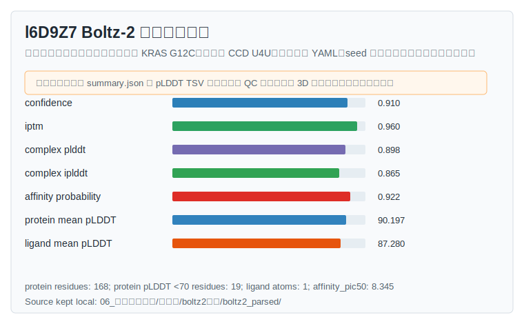
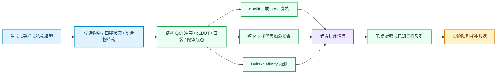

# 第 8 章 AI 亲和力预测与模型评估

## 本章导读

第 7 章结束后，读者已经知道 docking score、MM/PBSA、MM/GBSA、FEP 和实验 `Kd`、`IC50` 不是同一类量。进入 AI 亲和力模型后，新的问题不是“哪个模型名字更新”，而是“这个模型到底吃什么输入、输出什么字段、字段能在什么范围内比较、还差哪些验证”。

本章把 AI affinity 放回药物设计工作台中解释。AI 模型可以给出结合概率、亲和力读数、pose 分数、结构置信度或生成式构象样本；这些信号能帮助候选排序和复核优先级，但不能自动变成实验结合常数、活性或药效。本章主案例是 Boltz-2，因为本库已有方法卡、`l6D9Z7` 输出样例、解析摘要、记录模板和章节资产。

本章核心边界如下。

| 读者拿到什么 | 本章要做什么 | 本章不能推出什么 |
|:---|:---|:---|
| 模型名和论文 benchmark | 判断输入模态、训练标签、输出字段和适用域 | 不能把公开 benchmark 直接写成本项目可靠性 |
| Boltz-2 YAML、JSON、CIF 和 summary | 复核链、配体、MSA、约束、置信度和 affinity 字段 | 不能把单次预测写成实验 `Kd` 或 `IC50` |
| `confidence`、`pLDDT`、`ipTM` 等结构指标 | 判断结构和界面是否足以支持亲和力解释 | 不能因为结构置信度高就证明真实结合 |
| `affinity_probability_binary` 和 `affinity_pred_value` | 区分早期 binder 识别和同系列优化排序 | 不能和 docking score、MM/GBSA、FEP 混成同一尺度 |
| 正/负对照或已知活性系列 | 检查未校准模型信号方向是否合理 | 不能替代真实 assay 标定 |

## 学习目标

完成本章后，读者应能够：

- 区分 AI 亲和力预测、docking score、MM/GBSA、FEP、结构置信度和实验 `Kd`、`Ki`、`IC50`、`pIC50`。
- 按输入模态识别模型类型：序列/SMILES、分子图、口袋结构、docking pose、复合物 3D 结构、多链体系或生成式构象样本。
- 解释 `score_name`、`score_direction`、`comparable_scope` 和 `confidence_context` 为什么必须一起记录。
- 准备 Boltz-2 亲和力预测的最小 YAML，并检查 protein ID、ligand ID、SMILES/CCD、MSA、template、共价约束和 `properties.affinity.binder`。
- 读取 `confidence_scores`、`ptm_scores`、`iptm_scores`、`complex_plddt_scores`、`complex_iplddt_scores`、`affinity_probability_binary`、`affinity_pred_value` 和项目解析字段 `affinity_pic50`。
- 判断高亲和力读数是否被低质量输入、错误配体状态、低界面置信度、训练分布外推或缺少对照削弱。
- 把 AI affinity 写成候选排序、复核优先级或实验队列建议，不写成已验证结合常数、活性或机制。

## 使用材料与来源边界

本章先读取根目录 `大纲.md`，再读取 `chapters/chapter-08/本章大纲.md`。正文使用第 05 章原始学习素材的全文提取页、方法笔记、实验记录、研究工作台矩阵、章节资产和已核对网页。原始 PDF、课件截图、Office 文件、CIF、JSON 和大体积原始数据不复制到正文目录。

| 材料 | 本章使用方式 | 边界 |
|:---|:---|:---|
| `大纲.md` | 确认第 8 章位于第 7 章自由能计算之后、第 9 章生成式设计之前 | 不把第 9 章设计验证提前写成本章结论 |
| `chapters/chapter-08/本章大纲.md` | 确认问题、读者任务、来源材料、证据边界和待确认项 | 待确认项不扩写为事实 |
| 第 05 章 pages 4-5、11、16、64-66、68、71、76-77、86、88-89 | 提取自由能方法谱系、AI affinity 模型谱系、Boltz-2 输入输出和生成式采样边界 | page 64 OCR 只作召回线索，benchmark 回到正式论文 |
| `02_方法笔记/Boltz2亲和力预测.md` | 提供 Boltz-2 输入、输出、指标解释和记录规范 | 方法卡不是正式运行结果 |
| `04_实验记录/Boltz2结果_l6D9Z7.md` | 提供 `l6D9Z7` 字段解释示例 | 原始 YAML、seed、平台和 3D pocket 图仍缺 |
| `07_研究工作台/证据与claims矩阵.md` | 约束 docking、Boltz-2、Chai-1、AI affinity 和短 MD 的 claim 边界 | 不用模型输出证明机制、药效或临床意义 |
| `chapters/chapter-08/assets/` | 提供模型字段表、重建 YAML、运行记录模板、控制面板模板、分数解释说明和聚合 QC 图 | 章节资产只存代码和派生教学图，不复制原始数据 |
| 官方网页和论文 | 核对 Boltz-2 文档、CLI、当前 PyPI 版本、NVIDIA 页面、RCSB U4U/6T5U、四个模型 DOI | 网页信息需按写作或运行日期重新核对 |

截至 2026-06-08，本章核对的网页包括 Boltz 官方 [GitHub](https://github.com/jwohlwend/boltz)、[prediction 文档](https://github.com/jwohlwend/boltz/blob/main/docs/prediction.md)、PyPI [`boltz 2.2.1`](https://pypi.org/project/boltz/)、NVIDIA [`build.nvidia.com/mit/boltz2`](https://build.nvidia.com/mit/boltz2)、[Boltz-2 技术报告](https://jeremywohlwend.com/assets/boltz2.pdf)、RCSB [`U4U`](https://www.rcsb.org/ligand/U4U) 和 PDB [`6T5U`](https://www.rcsb.org/structure/6t5u)。若以后重跑 Boltz-2 或使用 NVIDIA 平台，运行当天应再次记录版本、平台条款和输出路径。

## 本章判断路径

下图把第 7 章的结构和能量信息接入 AI affinity，再输出实验队列。箭头表示决策依赖，不表示任一模型分数已经完成实验验证。


**图 8.1 AI 亲和力预测的证据链。** 本章先问任务，再选模型，再检查输入和输出。只有经过结构 QC、对照校准和适用域判断的模型信号，才适合进入候选队列。

## 8.1 AI 亲和力预测任务定义

AI affinity 模型不是单一工具类型。它可以用蛋白序列和 SMILES 预测亲和力，也可以用复合物 3D 结构重打分，还可以在结构预测模型中同时输出 confidence 和 affinity。读者首先要写清 prediction unit：一个蛋白-配体对、一个 docking pose、一个复合物结构、一个肽-蛋白界面，还是一批同系列候选。

亲和力预测记录至少包含四个层次：输入是什么，输出字段是什么，字段方向是什么，可比较范围是什么。缺少任一层，分数就容易被误读。

| 字段 | 问题 | 示例 |
|:---|:---|:---|
| `prediction_unit` | 预测对象是哪一个单位 | `KRAS_G12C_U4U_complex`、`candidate_001_pose_03` |
| `input_modality` | 模型看到的输入是什么 | protein sequence、SMILES、3D pocket、docking pose、YAML |
| `label_or_target` | 模型训练或拟合的目标是什么 | `Kd`、`Ki`、`IC50`、binder/decoy、pose quality |
| `score_name` | 输出字段原名是什么 | `affinity_pred_value`、`affinity_probability_binary`、`energy` |
| `score_direction` | 大小方向如何解释 | higher is binder-like、lower is stronger、more negative is favorable |
| `comparable_scope` | 哪些结果能放一起比较 | 同模型、同靶点、同批运行、同配体状态 |
| `confidence_context` | 分数要和什么质量信息一起看 | pLDDT、ipTM、pose QC、对照、assay 来源 |

课程 page 11 把 GNN、3D-CNN、Transformer 和预训练模型列为 AI affinity 代表路线；page 16 又把 DeepDTA、DeepAffinity、Pafnucy、KDeep、OnionNet、GraphDTA、MolTrans、DiffDock、RoseTTAFold All-Atom、AlphaFold3、Boltz-1 和 Boltz-2 放入历史谱系。正文使用这些材料建立任务分类，而不是直接比较不同模型的数值高低。

| 使用场景 | 优先看的问题 | 适合输出 |
|:---|:---|:---|
| 大规模初筛 | 能否从大量候选中找出 binder-like 分子 | 概率、分类分数、enrichment |
| 同系列重排序 | 小改变化合物之间谁更值得推进 | 连续亲和力读数、rank、pairwise 差异 |
| docking pose 重打分 | pose 是否支持后续结构解释 | pose score、interaction energy、contact quality |
| 蛋白-肽或 PPI 排序 | 肽链或界面是否合理 | 界面 score、PPI affinity、结构置信度 |
| 单个复合物解释 | 结构和亲和力信号是否互相支持 | confidence、ipTM、affinity、可视化 QC |
| 实验队列优先级 | 哪些候选推进、复核或补数据 | rank bucket、next step、claim boundary |

一个模型可以很快，但速度只说明它适合纳入工作流，不说明它对当前靶点、配体库或实验条件可靠。每次写入实验记录前，先填“AI 亲和力预测任务卡”。

| 任务卡字段 | 写法 |
|:---|:---|
| `task_goal` | 初筛、重排序、单复合物解释、对照校准或实验队列 |
| `target_context` | 靶点、物种、突变、结构来源、口袋或界面 |
| `ligand_context` | SMILES/CCD/SDF、质子化、互变异构、共价状态 |
| `model_context` | 模型名、版本、checkpoint、seed、平台 |
| `output_context` | 原始字段、方向、单位或无单位说明 |
| `validation_need` | 正/负对照、已知活性系列、docking、MD、MM/GBSA、FEP 或实验 |

## 8.2 PLANET、GAABind、Interformer、BALM 等模型

模型名清单容易制造错觉：好像所有 AI affinity 模型都在输出同一种“亲和力”。实际差异主要来自输入模态、训练标签和验证方式。PLANET、GAABind、Interformer 和 BALM 适合放在同一节，是因为它们分别代表结构图、多任务 pose-affinity、interaction-aware docking 和语言模型路线。

本章不把这些模型排成“谁最好”的榜单，而是把它们作为输入输出差异的教学样本。`chapters/chapter-08/assets/code/chapter-08-model-source-fields.tsv` 已记录 DOI、来源链接、输入字段、输出字段和 Zotero 待导入状态。

| 模型 | 论文锚点 | 输入字段 | 输出字段 | 本章用法 | 边界 |
|:---|:---|:---|:---|:---|:---|
| PLANET | `zhang_planet_2024`，DOI [`10.1021/acs.jcim.3c00253`](https://doi.org/10.1021/acs.jcim.3c00253) | 3D binding pocket graph；ligand 2D chemical structure | binding affinity；protein-ligand contact map；ligand distance matrix | 说明多目标训练如何同时学习 affinity 和几何约束 | benchmark 不外推到本项目候选 |
| GAABind | `tan_gaabind_2024`，DOI [`10.1093/bib/bbad462`](https://doi.org/10.1093/bib/bbad462) | known 3D binding pocket；ligand unbound conformation；atom/pair features | pocket-ligand distances；ligand distances；pose；affinity | 说明几何感知模型如何同时处理 pose 和 affinity | CASF 或病毒相关 benchmark 不是项目结果 |
| Interformer | `lai_interformer_2024`，DOI [`10.1038/s41467-024-54440-6`](https://doi.org/10.1038/s41467-024-54440-6) | protein binding site；ligand 3D/docking pose graph；atom/edge features | interaction-aware MDN energy；pose score；affinity value | 说明 docking-aware 模型如何把 pose 质量和 affinity 联动 | 只和兼容 pose 输入的任务比较 |
| BALM | `gorantla_learning_2024`，DOI [`10.1101/2024.11.01.621495`](https://doi.org/10.1101/2024.11.01.621495) | protein language-model input；ligand language-model input；BindingDB affinity labels | shared embedding/cosine objective for affinity | 说明序列和配体语言模型路线 | 预印本锚点，不能当本地筛选证据 |

这些模型也帮助读者理解“结构输入”和“亲和力标签”不是同一件事。PLANET 和 GAABind 更接近结构几何和口袋-配体关系，Interformer 依赖 docking 或 3D pose 语境，BALM 则用蛋白和配体语言模型表示学习 BindingDB 亲和力标签。输入越少，速度和覆盖面可能越好；输入越依赖结构，解释时就越需要 pose 和口袋 QC。

可以把本节模型放到更大的方法谱系中看。

| 方法谱系 | 代表模型或工具 | 常见输入 | 常见输出 | 典型风险 |
|:---|:---|:---|:---|:---|
| 序列/SMILES 模型 | DeepDTA、DeepAffinity、GraphDTA、MolTrans、BALM | protein sequence、SMILES、embedding | affinity、DTI score | 结构不可见，外推依赖训练数据 |
| 结构网格或接触模型 | Pafnucy、KDeep、OnionNet、PLANET | pocket/complex 3D、contact features | affinity、contact 或距离 | pose 错误会污染预测 |
| docking-aware 模型 | Interformer、GNINA、RTMScore | docking pose、binding site graph | pose score、energy、affinity | 不能跳过 top pose QC |
| 口袋-配体联合模型 | GAABind、TankBind | 3D pocket、unbound ligand | pose、distance、affinity | 口袋状态和配体构象敏感 |
| 结构基础模型 | AlphaFold3、Chai-1、Boltz-1、Boltz-2 | 多链序列、配体、MSA、模板、约束 | structure confidence、affinity 或 aggregate score | 结构 confidence 不等于实验亲和力 |
| 肽/PPI 模型 | PPI-Affinity、AlphaFold peptide ranking | peptide/protein structure or sequence | PPI/peptide affinity or ranking | 不能套用小分子规则 |

模型比较时，只比较同一任务层级。若一个模型输出 `pIC50`，另一个输出 docking energy，第三个输出 binder probability，正文应保留原字段名和方向，而不是把它们强行归一化到一列“score”。

## 8.3 Boltz-2 输入、输出与运行方式

Boltz-2 同时涉及复合物结构预测和亲和力预测。官方 GitHub 和 PyPI 文档都把运行入口写成 `boltz predict input_path --use_msa_server`，其中 `input_path` 可指向 YAML 文件或包含 YAML 的目录。prediction 文档说明 YAML 优先，FASTA 已不推荐用于完整功能；MSA 可由 `--use_msa_server` 自动生成，也可由用户提供。

Boltz-2 亲和力预测不是只上传一个配体。YAML 中必须明确 protein、ligand 和 affinity property 的对应关系。对于共价配体，还要写约束，而不是只靠图片说明。

下面是 `l6D9Z7` 教学重建 YAML 的核心结构。它来自本地 Boltz-2 输出、课程 page 68 截图、RCSB U4U/6T5U 复核和官方 prediction schema。它不是原始提交文件。

```yaml
version: 1
sequences:
  - protein:
      id: A
      sequence: MTEYKLVVVGACGVGKSALTIQLIQNHFVDEYDPTIEDSYRKQVVIDGETCLLDILDTAGQEEYSAMRDQYMRTGEGFLCVFAINNTKSFEDIHHYREQIKRVKDSEDVPMVLVGNKCDLPSRTVDTKQAQDLARSYGIPFIETSAKTRQGVDDAFYTLVREIRKHKE
  - ligand:
      id: LIG
      ccd: U4U
constraints:
  - bond:
      atom1: [A, 12, SG]
      atom2: [LIG, 1, C22]
properties:
  - affinity:
      binder: LIG
```

这个 YAML 暂按 KRAS G12C 与 CCD `U4U` 共价配体处理。RCSB `U4U` 页面显示该化学组分与 PDB 条目关联，PDB `6T5U` 标题为 KRasG12C ligand complex。课程 page 68 同时显示 protein chain A、ligand CCD `U4U`、`A:12:SG` 到 `LIG:1:C22` 的 bond 信息。由于原始提交 YAML 不在当前材料中，正文只能把它作为教学重建样例。

| YAML 字段 | 作用 | 常见错误 |
|:---|:---|:---|
| `version` | 指定输入 schema 版本 | 版本缺失时难以复核 |
| `protein.id` | 输出结构中的链 ID | 与 `constraints` 或 binder 引用不一致 |
| `protein.sequence` | 目标蛋白序列 | 序列截断、突变状态未说明 |
| `msa` | 自定义 MSA 或特殊空值 | 未提供 MSA 且未启用 MSA server |
| `templates` | 模板结构来源 | 模板可能引入数据泄漏 |
| `ligand.id` | 配体实体 ID | 与 `properties.affinity.binder` 不一致 |
| `smiles` / `ccd` | 配体表示 | 手性、质子化、电荷或共价状态不清 |
| `constraints.bond` | 共价键或跨组分约束 | 残基编号和原子名不匹配 |
| `properties.affinity.binder` | 要计算 affinity 的配体 | 指向不存在或错误 ligand |

正式运行记录不能只保留网页截图。至少要记录输入 YAML、模型包版本、checkpoint 或 default、seed、平台、命令、请求输出目录和实际输出目录。Boltz CLI 源码中 `--seed` 默认为 `None`，只有显式传入时才调用随机数 seeding；`--out_dir` 是保存结果的路径，当前源码还会按输入文件名创建 `boltz_results_<input_stem>` 子目录。因此记录中应同时写“命令中的 out_dir”和“最终结果目录”。

```bash
boltz predict chapters/chapter-08/assets/code/chapter-08-boltz2-l6D9Z7-reconstructed.yaml \
  --use_msa_server \
  --use_potentials \
  --seed 12345 \
  --out_dir runs/chapter-08/l6D9Z7-rerun-YYYYMMDD
```

| 运行字段 | `l6D9Z7` 现有样例 | 正式重跑应填 |
|:---|:---|:---|
| `input_yaml` | 缺原始 YAML；现有 JSON 在原始素材目录 | `chapter-08-boltz2-l6D9Z7-reconstructed.yaml` 或真实提交 YAML |
| `model_package` | 未记录 | 例如 `boltz==2.2.1`，按运行日核对 |
| `checkpoint` | web/default，未记录细节 | default Boltz-2 checkpoint 或显式路径 |
| `seed` | 未记录 | 例如 `12345`，或写明未固定 |
| `platform` | 可能为 Boltz2 online UI 或 hosted run | local GPU、NVIDIA NIM 或其他平台 |
| `command` | 未记录 | 完整 CLI 或 API payload |
| `output_dir` | `06_原始学习素材/第五章/boltz2在线/boltz2_parsed/` | `runs/chapter-08/...` 加最终 resolved 目录 |
| `raw_output_policy` | 原始数据仍在 `06_原始学习素材/` | 原始输出保留，不复制进正文资产 |

截至 2026-06-08，PyPI 显示 `boltz 2.2.1` 为最新 release；NVIDIA `build.nvidia.com/mit/boltz2` 页面显示 Boltz-2 为 MIT 下载型模型，可添加 Protein、DNA、RNA、Ligand、bond 或 pocket，并可选择一个 ligand 计算 binding affinity。若正文或作业要求实际使用该平台，应在运行当天重新记录页面状态和条款。

## 8.4 `predicted affinity` 与 `confidence` 解读

Boltz-2 输出中最容易被混写的是 confidence 和 affinity。`confidence_scores`、`ptm_scores`、`iptm_scores`、`complex_plddt_scores`、`complex_iplddt_scores` 更接近结构和界面质量信号；`affinity_probability_binary` 和 `affinity_pred_value` 才进入亲和力任务。两类字段可以互相限制解释，但不能互相替代。

官方说明把 `affinity_probability_binary` 用于 binder 与 decoy 的区分，适合 hit-discovery 阶段；取值 0 到 1，表示模型认为 ligand 是 binder 的概率。`affinity_pred_value` 用于不同 active binders 之间的小改变化合物比较，适合 hit-to-lead 或 lead optimization；官方 prediction 文档说明它按 `log10(IC50)` 表示，其中 `IC50` 以 `μM` 计，数值更低表示预测结合更强。

| 字段 | 读法 | 适合用途 | 不应写成 |
|:---|:---|:---|:---|
| `confidence_scores` | 整体预测置信度 | 第一层结构 QC | 实验真实性 |
| `ptm_scores` | 结构拓扑可信度 | 判断整体 fold 或复合物拓扑 | 亲和力大小 |
| `iptm_scores` | 界面可信度 | 判断界面解释是否有基础 | 结合常数 |
| `complex_plddt_scores` | 复合物局部置信度 | 检查局部结构质量 | 配体活性 |
| `complex_iplddt_scores` | 界面局部置信度 | 检查口袋或界面质量 | 实验验证 |
| `affinity_probability_binary` | binder-like 概率 | 早期初筛和对照方向检查 | 实验成功率 |
| `affinity_pred_value` | 连续 affinity 读数 | 同系列 active binders 重排序 | 可跨模型比较的自由能 |
| `affinity_pic50` | 本地解析出的派生/展示字段 | 教学字段解释 | 未核对公式时的实验 `pIC50` |

`l6D9Z7` 本地 summary 适合做字段解释。下面数值来自 `06_原始学习素材/第五章/boltz2在线/boltz2_parsed/summary.json` 和 `04_实验记录/Boltz2结果_l6D9Z7.md`。它们说明该样例字段完整，不说明它已经是正式可复现项目运行。

| 指标 | 数值 | 教学读法 | 当前边界 |
|:---|---:|:---|:---|
| `confidence_scores` | 0.909981 | 整体结构自洽性较高 | 不等于真实复合物 |
| `ptm_scores` | 0.922580 | 结构拓扑信号较高 | 仍需可视化检查 |
| `iptm_scores` | 0.959715 | 界面信号较高 | 不替代口袋复核 |
| `complex_plddt_scores` | 0.897548 | 复合物局部质量较高 | 低置信片段需单独看 |
| `complex_iplddt_scores` | 0.864698 | 界面局部质量较高 | 不能证明实验结合 |
| `affinity_LIG_affinity_probability_binary` | 0.921875 | binder-like 概率较高 | 不是实验成功率 |
| `affinity_LIG_affinity_pred_value` | -0.118164 | 连续 affinity 读数 | 只能在可比任务内解释 |
| `affinity_LIG_affinity_pic50` | 8.345176 | 本地解析字段，用于展示 | 需回到原始输出和公式复核 |
| protein mean pLDDT | 90.196774 | 蛋白平均 pLDDT 高 | 平均值掩盖局部低置信 |
| ligand mean pLDDT | 87.280000 | ligand 周边局部信号较好 | 不替代配体状态复核 |



**图 8.2 `l6D9Z7` Boltz-2 输出聚合 QC 图。** 该图由 `chapter-08-l6D9Z7-qc-figure.py` 从本地 summary 和 pLDDT 表生成，只用于展示字段和阈值检查。它不是 3D 口袋复核图，也不能替代 PyMOL、ChimeraX 或 Mol* 对 KRAS G12C、`U4U` 配体和共价键的人工检查。

读取 Boltz-2 结果时，建议采用三步法。

| 步骤 | 问题 | 处理 |
|:---|:---|:---|
| 1. 输入是否合格 | 链、配体、MSA、模板、共价键、binder 是否对齐 | 不合格则标记 `fail` 或重跑 |
| 2. 结构是否支持解释 | confidence、pLDDT、ipTM、口袋图是否一致 | 局部低置信则降级为 `review` |
| 3. affinity 是否可比较 | 字段方向、同批候选、对照和实验上下文是否明确 | 缺对照时只写未校准模型信号 |

## 8.5 结构预测、亲和力预测和实验值之间的边界

结构预测回答“模型给出的复合物构象是否自洽”。亲和力预测回答“模型在当前输入下给出的结合倾向或排序信号”。实验 `Kd`、`Ki`、`IC50`、`EC50` 回答“特定 assay 条件下测到了什么”。三者可以相互提示，但不能互相替代。

本章采用同一个 claim 梯度表写作。

| 判断对象 | 材料显示什么 | 方法产生什么 | 允许怎样解释 | 还需要怎样验证 |
|:---|:---|:---|:---|:---|
| Boltz-2 YAML | 链、配体、约束、MSA、template 和 affinity binder | 可复现输入假设 | 输入是否对齐、配体状态是否清楚 | 原始 YAML、版本、seed、平台和输出目录 |
| 结构 confidence | 整体、拓扑、界面和局部置信度 | 结构自洽性信号 | 是否足以支持口袋或界面讨论 | 3D 可视化、低 pLDDT 区域、对照结构 |
| affinity 字段 | 概率、连续读数或派生展示字段 | 模型亲和力信号 | 同批候选排序或复核优先级 | 正/负对照、已知系列、实验或更高阶计算 |
| 文献 benchmark | 指定数据集上的模型表现 | 方法背景和比较边界 | 为方法选择提供参考 | 当前靶点和配体库上的外部验证 |
| 实验数据 | assay 条件、单位、重复和误差 | 测量结果 | 支持结合、活性或构效关系 | 质量控制、重复、机制实验 |

正文中可以写的句子应保持证据边界。

| 原始想法 | 推荐写法 | 原因 |
|:---|:---|:---|
| “Boltz-2 预测该分子有强亲和力” | “在该 Boltz-2 输入下，`affinity_probability_binary` 和连续 affinity 读数均给出较强模型信号。” | 保留模型来源 |
| “该候选 IC50 为 8.35” | “本地解析字段 `affinity_pic50=8.345176`，其公式和原始字段需回到输出文件复核。” | 避免写成实验值 |
| “高 confidence 证明 pose 正确” | “较高 confidence 支持进入结构复核，但仍需检查口袋、配体状态和局部低置信区域。” | confidence 不是验证 |
| “模型 benchmark 说明本项目可靠” | “公开 benchmark 支持将 Boltz-2 纳入候选排序工作流，但当前体系仍需对照和校准。” | benchmark 不自动外推 |
| “进入实验验证的 hit” | “进入实验队列的候选或复核优先级较高的候选。” | 队列不是实验结果 |

不能写的内容也要明确。没有实验或正式文献证据时，不写“证明结合”“抑制靶点”“产生药效”“具有临床意义”。没有正/负对照时，不写“模型已经校准”。没有原始 YAML、seed、平台和输出目录时，不写“可复现运行”。

## 8.6 模型 benchmark、校准和误差来源

模型论文中的 benchmark 说明模型在某些数据集和 split 下表现如何，不说明读者当前靶点、配体库和 assay 条件一定可靠。第 05 章 page 64 的 OCR 图只能帮助召回 FEP+、OpenFE、CASP16 等关键词；正文若要讨论 benchmark，应回到 Boltz-2 正式技术报告中的图题、表格和文字说明。

Boltz-2 技术报告中，主文 Figure 6 汇总四类 affinity value test sets 的 Pearson correlation，正文还讨论 FEP+ OpenFE、4-target FEP subset、CASP16 affinity challenge、Recursion internal assays 和 MF-PCBA 等 benchmark。报告同时提醒：强公开 benchmark 表现不一定直接迁移到真实药物发现项目，某些内部 assay 表现有限。教材引用这些信息时，只把它写成模型背景和校准要求。

| benchmark 检查项 | 要看什么 | 为什么 |
|:---|:---|:---|
| dataset | FEP+、OpenFE、CASP16、MF-PCBA、内部 assay 或其他来源 | 数据来源决定可比任务 |
| label type | `Ki`、`Kd`、`IC50`、binary binder、decoy | 输出字段和误差解释不同 |
| split | random、scaffold、target、sequence cluster、time split | 防止过乐观评估 |
| pose source | crystal pose、docking pose、predicted pose、cofolding | pose 质量会影响 affinity |
| baseline | docking、FEP、ML baseline、sequence-only model | 比较对象决定结论范围 |
| metric | Pearson、Kendall tau、MAE、PMAE、AUROC、AP、EF | 回答排序、误差或 early retrieval |
| calibration | 是否有正/负对照或已知活性系列 | 决定能否用于本批候选排序 |
| leakage risk | 训练/测试蛋白或配体相似性 | 判断外推可信度 |
| failure mode | GPCR、共价配体、配体状态、PAINS、assay 噪声 | 决定哪些结果降级 |

未校准模型信号可以升级为同批候选排序依据，但要经过对照。一个最小控制面板应包含 known positive、known negative 或 decoy、已知活性系列成员和 test candidate。所有样本必须尽量共享靶点、assay 语境、配体状态定义、YAML 规则、seed 策略和运行参数。

| 对照类型 | 作用 | 合格条件 | 失败时怎么写 |
|:---|:---|:---|:---|
| known positive | 检查模型能否识别已知 binder | 与 target、assay 或化学系列可比 | 模型方向不可信，候选排序降级 |
| known negative / decoy | 检查模型是否把无关分子也打高 | decoy 不能过于无关，应能测试特异性 | 只能写未校准信号 |
| known activity series | 检查同系列 rank 是否大致一致 | 活性测量条件和配体状态可比 | 不做 lead optimization 排序 |
| test candidate | 排入候选队列 | 对照方向合理且结构 QC 通过 | 标记 `review` 或补实验 |

`chapters/chapter-08/assets/code/chapter-08-control-panel-template.tsv` 给出这些字段。它的目的不是制造漂亮表格，而是迫使读者写清 `activity_source`、`ligand_state`、`expected_model_direction` 和 `boundary_note`。

误差来源也要写入记录。AI affinity 的错误可能来自模型训练域、label 噪声、配体状态、输入结构、口袋构象、共价约束、MSA/template、数据泄漏、pose 错误或 assay 差异。若读者只报告分数，不报告这些来源，排序就没有复核路径。

## 8.7 生成式采样与亲和力解释

生成式采样能快速给出候选构象或口袋状态，但它和真实 MD 轨迹、Boltzmann 分布、实验亲和力之间仍有距离。课程 pages 86、88 把生成式采样分为数据驱动路线和物理/能量引导路线：前者学习已有样本分布，后者尝试接近热力学分布或受能量约束引导。

| 路线 | 输入或依赖 | 适合做什么 | 核心风险 |
|:---|:---|:---|:---|
| 数据驱动生成式采样 | MD 数据、实验结构、结构数据库、量子化学数据 | 快速生成多样构象、初始构象、口袋状态 | 学到数据偏差，漏掉未覆盖状态 |
| 物理/能量引导采样 | 势能函数、温度、物理约束、生成模型 | 更有物理原则的状态搜索 | 训练和校正复杂，可能生成高能构象 |
| BioEmu/AI 采样 | 序列、checkpoint、样本数、seed | 蛋白单体构象候选和状态覆盖 | 不是带真实时间尺度的轨迹 |
| Boltz-2 cofolding/affinity | 多组分 YAML、MSA、配体、约束 | 复合物结构和 affinity 信号 | 输入和适用域错误会污染解释 |

生成式采样和 AI affinity 的连接，应写成工作流，而不是写成直接结论。



**图 8.3 生成式采样到亲和力预测的连接方式。** 生成模型先提供候选构象或状态；结构 QC、docking、MD 和 Boltz-2 亲和力预测再提供排序信号。实验队列需要对照和验证，不由单个生成分数决定。

若 AI 采样、docking、MM/GBSA 和 Boltz-2 给出冲突信号，不要挑一个最高分写结论。先检查输入结构、配体状态、口袋定义、模型适用域和对照。冲突本身可以成为复核优先级，例如“Boltz-2 affinity 高但 docking pose 不合理”应进入结构复核，而不是直接推进。

## 8.8 从预测排序到实验队列

亲和力预测的价值不在单个数值，而在于能否把候选有依据地分成推进、复核、淘汰或补数据。实验队列不是已完成结果，它是下一步计划。`07_研究工作台/实验队列.md` 中的 `exp:boltz2-control-panel` 已把第一个任务定为：选择一个有已知活性对照的体系，跑正/负对照 Boltz-2 亲和力记录。

候选进入队列前，应至少有下列字段。

| 字段 | 说明 |
|:---|:---|
| `candidate_id` | 候选编号，连接配体、结构和输出 |
| `target_id` | 靶点、突变和物种 |
| `ligand_state` | 质子化、互变异构、手性、共价或非共价状态 |
| `input_yaml` | Boltz-2 或其他模型输入路径 |
| `model_name`、`model_version`、`seed` | 模型和随机性 provenance |
| `score_name`、`score_value`、`score_direction` | 保留原字段和方向 |
| `confidence_context` | 结构和界面 QC |
| `calibration_available` | 是否有对照或活性系列 |
| `comparable_scope` | 同批、同靶点、同系列或不可比较 |
| `rank_bucket` | high、medium、low、review、fail |
| `next_step` | docking 复核、MD、MM/GBSA、FEP、购买/合成、体外实验或暂缓 |

一个可写入实验队列的模板如下。

| candidate_id | 模型信号 | QC 状态 | 校准状态 | rank bucket | 下一步 | 边界 |
|:---|:---|:---|:---|:---|:---|:---|
| `positive_001` | 方向应强于 negative | structure pass，interface pass | known positive | reference | 与候选同批运行 | 用来检查模型方向 |
| `negative_001` | 方向应弱于 positive | structure pass/review | known negative | reference | 与 positive 对照 | decoy 需化学合理 |
| `candidate_001` | 待填原始字段 | pass/review/fail | calibrated 或 uncalibrated | high/medium/low/review | docking、MD、MM/GBSA 或 assay | 预测不是实验亲和力 |

从预测到队列的判断可以按下面规则执行。

| 条件 | 队列决策 |
|:---|:---|
| 输入错误、ligand ID 不对、共价约束不清 | `fail`，先修输入 |
| 结构整体高但口袋或配体附近低置信 | `review`，先做 3D 复核 |
| affinity 信号高但无对照 | `review`，补正/负对照或已知系列 |
| 对照方向合理，候选同批表现靠前 | `high` 或 `medium`，进入下一轮计算或实验 |
| docking、MM/GBSA、Boltz-2 方向冲突 | `review`，检查 pose、配体状态和适用域 |
| 多个方法同向但仍无实验 | 可提高复核优先级，不写成实验结论 |

本章推荐把输出写成“候选排序建议”或“复核优先级”。例如：“在同一 Boltz-2 版本、同一 seed 策略和同一输入规范下，候选 A 的模型信号优先级高于候选 B；由于缺少已知活性系列和实验测定，该排序仅作为下一轮 docking/MD/MM-GBSA 或体外测定的候选选择依据。”

## 本章练习

当前仓库已经有第 8 章资产目录和代码示例，可用于教学练习。原始 JSON、CIF 和 pLDDT 表仍保留在 `06_原始学习素材/`，不复制到章节资产目录。

| 练习 | 输入 | 输出 | 目的 |
|:---|:---|:---|:---|
| 练习 8A：模型谱系表 | `chapter-08-model-source-fields.tsv` | 模型输入输出差异表 | 区分模型任务和字段方向 |
| 练习 8B：Boltz-2 YAML 复核 | `chapter-08-boltz2-l6D9Z7-reconstructed.yaml` | YAML 字段检查表 | 检查链、配体、共价约束和 binder |
| 练习 8C：summary 字段解析 | `summary.json` 与 `chapter-08-boltz2-summary-fields.py` | 指标 TSV 或表格 | 区分 confidence 与 affinity |
| 练习 8D：对照面板设计 | `chapter-08-control-panel-template.tsv` | 正/负对照或活性系列表 | 判断未校准信号能否升级为排序 |
| 练习 8E：prediction-to-queue | `chapter-08-affinity-triage-template.tsv` | 候选队列表 | 把预测信号转成下一步任务 |

运行 summary 字段解析脚本时，不需要把原始数据移出素材目录。

```bash
python chapters/chapter-08/assets/code/chapter-08-boltz2-summary-fields.py \
  --summary 06_原始学习素材/第五章/boltz2在线/boltz2_parsed/summary.json
```

若要补正式 Boltz-2 重跑，先复制或新建真实 YAML，再按本章 8.3 的字段记录模型版本、seed、平台和输出目录。不要用旧网页截图替代 YAML、命令和原始输出。

## 章节交接

第 8 章的交付物不是“AI 模型说这个分子强”，而是一组可复查材料：任务卡、模型输入输出字段表、Boltz-2 YAML、运行 provenance、结构 QC、affinity 字段解释、benchmark 边界、对照面板和实验队列。

这些材料会流向三条后续路径。

| 去向 | 使用什么 | 进入条件 |
|:---|:---|:---|
| 第 4/7 章回查 | docking pose、MM/GBSA、FEP 或残基线索 | AI affinity 与物理/结构信号冲突时 |
| 第 9 章生成式设计 | 候选 binder、口袋状态或结构约束 | 只作为候选输入，不作为功能证明 |
| 实验工作台 | rank bucket、对照状态、下一步验证 | 对照和 QC 足以支持排序建议 |

本章待作者确认项包括：四个新增模型文献的 Zotero item key；`l6D9Z7` 原始提交 YAML、seed、平台和完整输出目录；`l6D9Z7` 的 3D 口袋复核图；一个正/负对照或已知活性系列；Boltz-2 网页、CLI、PyPI 和 NVIDIA 页面在真实运行当天的再次核对；以及 benchmark 图若进入正式教材图表时对应的正式论文图号和引用边界。
