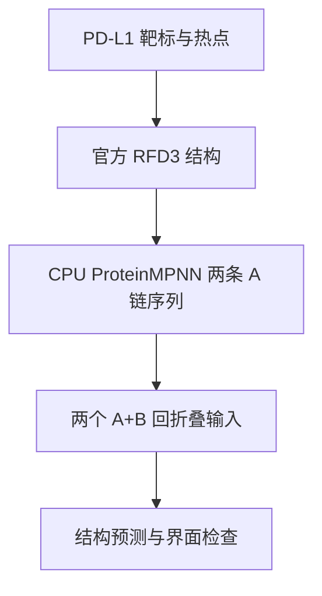
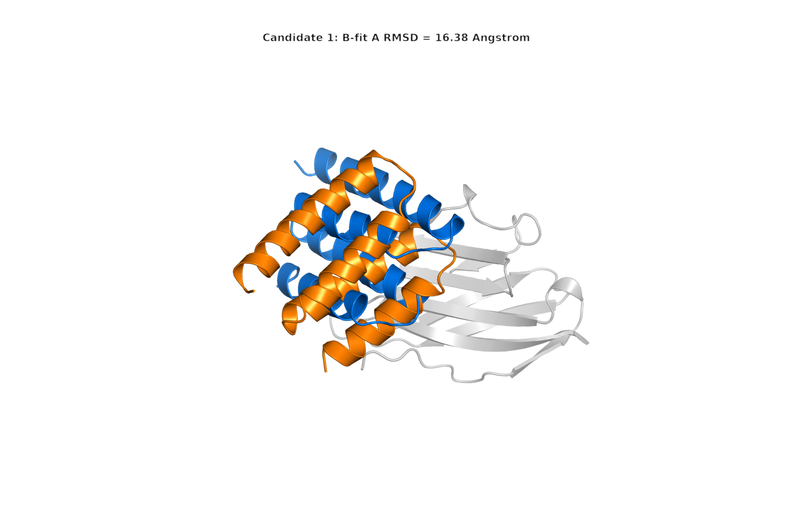
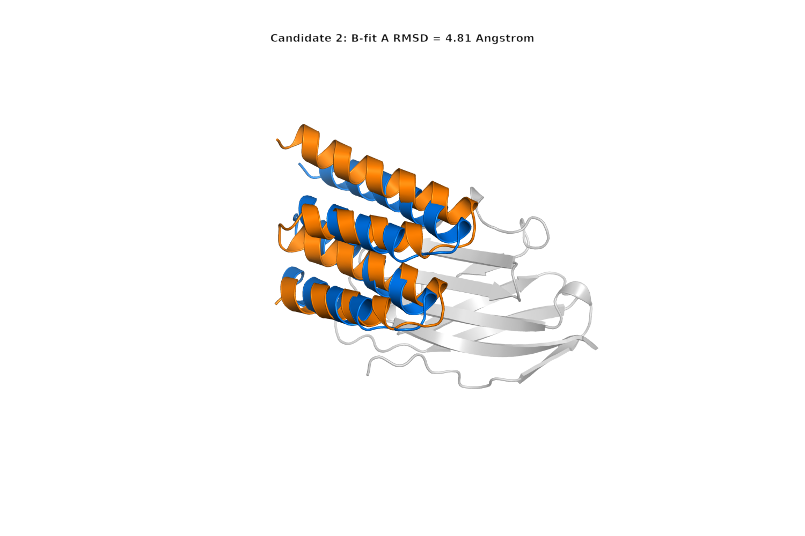

# 第 10 章 RFD3、ProteinMPNN 与多类型设计任务

## 本章导读

本章先完成一条能追溯到文件的 binder 练习：读取官方 PDL1 骨架，用 CPU 为设计链生成两条序列，再读取这两条序列的真实回折叠结果。基础作业可以直接分析已提供的 GPU 输出；具备环境的学生另做推理。随后比较短肽、迷你蛋白、motif 支架、核酸相关设计和酶设计。

基础练习采用 Foundry 官方 PDL1 教程的公开结构，来源固定到提交 `0932f1cb165ae7d413c11b1a7acc04ee31758817`。序列设计使用 ProteinMPNN 官方提交 `8907e6671bfbfc92303b5f79c4b5e6ce47cdef57`，已在 CPU 上运行两个样本。跟着下面的文件逐项操作，即可核对每一步。

| 阶段 | 本章已有材料 | 学生任务 |
|---|---|---|
| RFD3 骨架 | 官方 final CIF/PDB 和 metadata | 显示结构，核对 A/B 链 |
| 序列设计 | 两条真实 CPU FASTA 和运行记录 | 阅读结果，再用相同参数小规模运行 |
| 回折叠与结构比较 | 两个同候选的真实 Boltz 输出与队列 | 分别计算内部折叠偏差和界面位置偏差 |
| 候选复核 | 结构与字段检查路径 | 有 GPU 结果后再填指标和判断 |

## 10.1 RFD3 binder 设计

binder 是希望结合靶标的分子。这里设计一个蛋白链，使它靠近 PD-L1 表面。官方教程从 PDB 8AOM 的 PD-L1–VHH1 复合物开始，裁剪靶标后设置热点。公开 final model 中 A 链为 77 残基设计链，B 链为 114 残基靶标片段。[官方 PDL1 教程](https://github.com/RosettaCommons/foundry/blob/production/models/rfd3/docs/tutorials/binder_design_tutorial.md)

下载或通过练习下载器取得下面的文件。练习目录保留 `chapter-10/assets/code`、`data`、`refold` 布局。在 PowerShell 进入 `chapter-10/assets` 后执行本章命令。

| 文件 | 用途 |
|---|---|
| [裁剪靶标 PDB](assets/data/pdl1_cropped.pdb)和[设计 JSON](assets/data/pdl1.json) | 核对原输入、contig 和热点 |
| [官方 final CIF](assets/data/pdl1_test_0_model_0.cif)及[PDB 转换件](assets/data/pdl1_test_0_model_0.pdb) | 原子级输出和 CPU 序列设计输入 |
| [官方输出指标](assets/data/pdl1_test_0_model_0.json) | 阅读上游几何统计 |
| [靶标 FASTA](assets/data/pdl1_target.fasta) | 保持后续回折叠靶标一致 |

用结构软件把 A 链和 B 链显示成不同颜色，先隐藏 A 链，检查 B39 和 B52，再显示 A 链观察接触区域。截图同时标出链名和至少一个 hotspot。然后读配置中的 `contig`，解释为什么输出 A 链可以是 77 残基。



RFD3 输出包含初始残基身份与全原子坐标。MPNN 重新设计 A 链，B 链作为固定环境保留。候选名称从这个步骤开始固定，后续 YAML、结构、指标与人工检查都使用同一个名称。

## 10.2 超短多肽和短肽 binder

把设计链缩短后，能形成的接触数量和稳定结构也会改变。先决定肽链需要保留哪个接触或构象，再决定长度；对于合成肽，还要考虑端基、环化、化学修饰和实验读数。

| 比较项 | 短肽任务 | 本章 77 aa 设计链 |
|---|---|---|
| 构象安排 | 少量残基承担关键接触，可加入环化或已知 motif | 检查整体拓扑与疏水核心 |
| 输入条件 | 靶标、必要接触、长度、约束来源 | 靶标 B 链、热点和长度范围 |
| 结构检查 | 保留的接触、柔性、端基方向 | 折叠、界面和链间相对位置 |
| 后续制备 | 合成、纯度与修饰方案 | 表达、纯化与结构检查 |

练习先只修改 PDL1 配置副本，把设计长度范围改为 `20-30`，读取新的 contig，再把原始和修改后的输入并排记录。保留其余条件，写出你预测会改变的两项检查，例如接触残基数量与回折叠后构象。配置修改保存在新文件中，原输入继续作为参照。

## 10.3 全新迷你蛋白设计

迷你蛋白需要在较小体积中组织核心、二级结构和结合表面。同样 77 个残基可以形成不同拓扑；因此检查残基数之后，还应查看核心是否紧凑、loop 在哪里、哪些残基承担界面接触。

C9 miniprotein 文献 [`li_design_2026`](https://doi.org/10.1038/s41467-026-70667-x) 将 scaffold generation、ProteinMPNN、结构预测、X-ray crystallography、生化结合和 hemolysis assay 串成验证流程。读这篇案例时，按“计算筛选、结构测定、结合、功能”四列做笔记，分别填上对应实验。

DNP 案例 [`chen_galectin-related_2025`](https://doi.org/10.1073/pnas.2527641122) 研究 LGALSL–vimentin 相互作用，并用 synthetic peptide PEP1 进行阻断，在该研究模型中观察机械痛敏变化。它提供了另一条起点：先有互作机制与阻断肽，再问是否适合做进一步设计。

| 案例 | 课堂摘录任务 | 需要查找的原文位置 |
|---|---|---|
| C9 miniprotein | 连起计算、结构、结合与功能结果 | 方法、结构数据和功能实验 |
| LGALSL–vimentin / PEP1 | 画出互作对象、阻断肽和读数 | 肽来源、阻断实验和模型 |

这两例用于比较研究路径。完成表格后，回到自己的 PDL1 练习，圈出已经拥有的文件，再把未开展的测试列进路线卡。

## 10.4 支架引导型结合蛋白设计

motif 是希望保留的局部结构或几何，scaffold 是承载它的骨架。进行 motif scaffolding 时，先写清哪些原子固定，哪些侧链可重新设计，再定义其余长度和连接区域。

| 必须记录的对象 | 学生检查 |
|---|---|
| motif 来源 | 共晶结构、活性位点或其他明确来源 |
| 残基与原子 | 链名、编号、原子名是否在输入结构中存在 |
| 固定位置 | MPNN 前后逐项比对残基身份 |
| 几何保持 | 对齐 motif 原子，记录距离、角度和 RMSD |

可以用 PDL1 配置的热点作为编号练习，但 hotspot 与固定 motif 承担的任务不同：热点指定期望接触位置，固定 motif 指定需要保留的结构。下一次换成活性位点设计时，应重新列出固定原子和侧链，不直接照搬热点列表。

## 10.5 核酸抑制剂与核酸 binder 设计

先看设计对象。设计蛋白去结合 DNA/RNA，输入包括核酸结构和蛋白设计条件；设计 ASO、siRNA 或 decoy oligonucleotide，则从靶序列、作用方式、化学修饰和递送方案进入。两条路线的候选类型和检查项不同。

| 路线 | 第一个输入 | 首轮可执行任务 | 验证接口 |
|---|---|---|---|
| 蛋白–核酸 binder | DNA/RNA 结构及目标接触区域 | 核对核酸链、残基和蛋白设计空间 | 核酸结合、竞争与特异性 |
| ASO/siRNA | 靶 RNA 序列和转录本信息 | 标出目标区段、同源序列和修饰计划 | 表达抑制、脱靶与递送 |
| decoy oligonucleotide | 转录因子结合 motif | 确认 motif 和结合读数 | EMSA、竞争与报告基因 |

STAT3 的案例可按三种材料阅读：[`li_inhibition_2006`](https://doi.org/10.1158/1078-0432.CCR-06-0484) 为 HCC 模型中的 ASO 实验路线，[`lau_targeting_2019`](https://doi.org/10.3390/cancers11111681) 整理 nucleic acid therapeutics 方法谱系，[`proia_stat3_2020`](https://doi.org/10.1158/1078-0432.CCR-20-1066) 讨论 danvatirsen/STAT3 ASO 与免疫微环境。学生选择其中一篇，填写“设计对象、序列来源、干预方式、实验读数”，再决定它接哪条路线。

本节不要求安装另一个设计模型。提交一张输入卡，准确区分核酸分子和蛋白分子，即可完成基础任务。

## 10.6 理论酶与从头酶设计

theozyme 指理想化活性位点模型，通常由底物或过渡态类似物、催化残基、金属或辅因子及距离角度条件组成。给定这些几何之后，才有“寻找能承载它的 scaffold”的任务。

| 次序 | 写进输入卡的内容 | 对应检查 |
|---|---|---|
| 定义反应 | 反应物、产物、关键化学步骤 | 原子身份与反应假设 |
| 定义几何 | 催化原子、距离、角度、辅因子 | 约束是否完整 |
| 生成 scaffold | 固定 motif、长度和连接区域 | 局部几何与全局结构 |
| 设计序列 | 固定位置、原子环境与采样参数 | 活性位点是否保留 |
| 安排验证 | 表达、结构、酶活和动力学 | 对照、底物与读数 |

基础练习选一个已知酶活性位点，画出两个需要保留的原子距离，标上 Å 和原子名。若准备做序列设计，含配体或金属的环境还应核对 LigandMPNN 输入。先完成输入卡，再决定是否需要 QM/DFT 或 QM/MM 计算。

## 10.7 ProteinMPNN、LigandMPNN 和 BindCraft

ProteinMPNN 为给定蛋白骨架设计序列；LigandMPNN 将配体、金属等原子环境纳入条件；BindCraft 组织 binder 设计流程。先按输入选择方法，再记录固定位置与采样参数。

| 方法 | 本节关注的输入 | 文献锚点 |
|---|---|---|
| ProteinMPNN | 蛋白骨架、设计链和固定位置 | `dauparas_robust_2022`，Zotero key `V2WLND5M` |
| LigandMPNN | 骨架及配体、金属等原子环境 | `dauparas_atomic_2025` |
| BindCraft | 靶标与 binder 流程设置 | `pacesa_bindcraft_2025`；2024 预印本保留来源记录 |

现在运行本章 CPU 小例。下载[运行脚本](assets/code/run_proteinmpnn_cpu.py)，按第 1 章的环境方法建立独立环境，安装 NumPy 与 CPU PyTorch。该脚本下载固定提交的官方程序与权重到 `--work` 指定目录，然后只设计 A 链。[ProteinMPNN 官方实现](https://github.com/dauparas/ProteinMPNN)

```powershell
Set-Location C:\coursework\ai-md\downloads\chapter-10\assets
python -m venv .venv-mpnn
.\.venv-mpnn\Scripts\python.exe -m pip install numpy
.\.venv-mpnn\Scripts\python.exe -m pip install torch --index-url https://download.pytorch.org/whl/cpu
.\.venv-mpnn\Scripts\python.exe code/run_proteinmpnn_cpu.py --pdb data/pdl1_test_0_model_0.pdb --work outputs/mpnn-seed37 --chain A --count 2 --seed 37
```

运行前预测 FASTA 中设计序列应有多少残基。完成后打开 `outputs/mpnn-seed37/outputs/seqs/pdl1_test_0_model_0.fa`，确认原结构序列和两条 `sample=` 序列都对应 77 残基 A 链。官方程序日志写“length 191”时，统计的是整套 A+B 结构；核对 FASTA 的实际序列长度即可分清两者。

教材本次 CPU 实跑参数为 `v_48_020`、`temperature=0.1`、`seed=37`、两个样本，过程约 12.9 秒，其中官方序列生成日志约 5.5 秒。时间随电脑、依赖版本和文件缓存而变。读取[实际 FASTA](assets/data/pdl1_mpnn_seed37.fa)、[运行记录](assets/data/proteinmpnn_cpu_run.json)和[日志](assets/data/proteinmpnn_stdout.txt)，与自己的输出逐项核对。

这里的 sampling temperature 是序列采样参数。较低值让氨基酸选择更偏向模型给出的高概率，较高值允许更多变化。修改时保持骨架、设计链和样本数相同，再比较序列变化位置与 score。

| 候选 | A 链长度 | ProteinMPNN score | 下一阶段 |
|---|---:|---:|---|
| `pdl1_mpnn_1` | 77 | 1.0529 | 读取同候选回折叠 |
| `pdl1_mpnn_2` | 77 | 0.9849 | 读取同候选回折叠 |

ProteinMPNN score 是给定结构条件下的序列负对数概率相关评分，低值表示该模型更偏好该序列。比较这两条序列，找出至少三个变化位置，再查看这些位置是否位于核心或界面。先保留两条，等下一阶段补上结构检查。

若运行遇到 `No module named torch`，核对实际使用的解释器。若出现包含盘符的输出文件名错误，核对调用脚本是否使用正斜杠路径；本章 wrapper 已为官方脚本的路径解析做了这一步转换。修改后使用新的 `--work` 目录，保存第一次错误记录。

## 10.8 回折叠、界面 QC 与候选淘汰

回折叠接受候选序列，重新预测其结构。对 binder 任务，还要检查它与同一靶标的相对位置。下载[输入准备脚本](assets/code/prepare_refold.py)，用实际 CPU FASTA 和靶标 FASTA 生成两个 YAML。

```powershell
python code/prepare_refold.py --fasta data/pdl1_mpnn_seed37.fa --target data/pdl1_target.fasta --out outputs/refold-inputs
```

`pdl1_mpnn_1.yaml` 和 `pdl1_mpnn_2.yaml` 的 A 链分别来自两条实际序列，B 链均为同一个 114 残基靶标。本次 A、B 两链均显式采用 `msa: empty` 单序列条件，不调用 MSA 服务。将生成文件与[候选 1 输入](assets/refold/pdl1_mpnn_1.yaml)、[候选 2 输入](assets/refold/pdl1_mpnn_2.yaml)逐项比较。[Boltz 输入与预测说明](https://github.com/jwohlwend/boltz/blob/main/docs/prediction.md)

本次真实运行使用 Boltz 2.2.1、3070 8GB、seed=37、3 次 recycling、200 步采样、每条输入 1 个样本，日志报告 2/2 完成且失败数为 0。环境、输入和权重哈希见[运行记录](assets/results/boltz-refold/run_record.json)，原始过程见[日志](assets/results/boltz-refold/run.txt)。若已配置同类环境，可在新目录执行。

```bash
boltz predict outputs/refold-inputs --out_dir outputs/refold-run01 --seed 37 --recycling_steps 3 --sampling_steps 200 --diffusion_samples 1 --write_full_pae --no_kernels --num_workers 0
```

基础作业直接使用公开结果：[候选 1 CIF](assets/results/boltz-refold/predictions/pdl1_mpnn_1/pdl1_mpnn_1_model_0.cif)、[候选 1 confidence](assets/results/boltz-refold/predictions/pdl1_mpnn_1/confidence_pdl1_mpnn_1_model_0.json)、[候选 2 CIF](assets/results/boltz-refold/predictions/pdl1_mpnn_2/pdl1_mpnn_2_model_0.cif)与[候选 2 confidence](assets/results/boltz-refold/predictions/pdl1_mpnn_2/confidence_pdl1_mpnn_2_model_0.json)。[候选队列](assets/refold/candidate_queue.tsv)中两项 `refold_status` 为 `completed`。运行输入与 ProteinMPNN FASTA 的 A 链逐字符一致，B 链也与靶标 FASTA 和设计结构一致。

先预测一个问题：若设计链自身形状相似，按靶标对齐后是否也一定重合？下载[分析脚本](assets/code/analyze_refold.py)，在已有 `.venv-mpnn` 中补装 Gemmi，再运行。NumPy 已在上一节安装。

```powershell
.\.venv-mpnn\Scripts\python.exe -m pip install gemmi
.\.venv-mpnn\Scripts\python.exe code/analyze_refold.py --reference data/pdl1_test_0_model_0.pdb --fasta data/pdl1_mpnn_seed37.fa --target data/pdl1_target.fasta --config data/pdl1.json --predictions results/boltz-refold/predictions --out outputs/refold-analysis
```

脚本按链和残基顺序匹配每个残基的 N、CA、C、O。A 链有 308 个比较原子，B 链有 456 个；先分别求刚体拟合，再计算下表两种 A 链 RMSD。所有坐标和 RMSD 单位均为 Å。[完整数值表](assets/results/boltz-refold/analysis/refold_summary.tsv)与[分析记录](assets/results/boltz-refold/analysis/analysis_record.json)保留字段定义、输入哈希和原子匹配方式。

| 候选 | complex pLDDT，0–1 | A 自身拟合后 RMSD / Å | B 拟合后 A 的 RMSD / Å | 六个 hotspot 中存在几何接触的数量 |
|---|---:|---:|---:|---:|
| pdl1_mpnn_1 | 0.9087 | 1.72 | 16.38 | 6 |
| pdl1_mpnn_2 | 0.9261 | 1.40 | 4.81 | 6 |

“A 自身拟合”去掉设计链整体平移和转动，用来比较内部折叠；“B 拟合后 A 的 RMSD”固定靶标参照，保留设计链相对靶标的位置和取向差别。候选 1 的两个数相差很大，说明内部折叠较接近，界面布局却偏离设计。候选 2 的布局更接近，也还存在 4.81 Å 的对应原子偏差。先把候选 1 退回界面复核，将候选 2 列为优先检查对象，再写各自理由。

接触统计对每个 B 链 hotspot，检查配置指定原子到任意 A 链重原子的最小距离，4.5 Å 内计为一次。两条候选都覆盖六个 hotspot，这个计数仍未区分它们的整体取向。双向跨链 PAE 的全区块平均分别为 8.14、6.70 Å；它包含全部 77×114 配对，并非只计算接触界面的官方 iPAE。对应 iPTM 为 0.7068、0.7451。不要把 PAE 与距离误差字段 `complex_ipde` 混为同一项。

现在用结构图核对表中的差别。脚本已导出[候选 1 的 B 对齐 PDB](assets/results/boltz-refold/analysis/pdl1_mpnn_1_target_aligned.pdb)与[候选 2 的 B 对齐 PDB](assets/results/boltz-refold/analysis/pdl1_mpnn_2_target_aligned.pdb)。在 PyMOL 命令栏进入本章 assets 目录，执行[绘图脚本](assets/code/show_refold_overlay.pml)。它保留同一靶标视角、缩放和图像尺寸，不再对 A 链单独做 `align`。

```pymol
cd C:/coursework/ai-md/downloads/chapter-10/assets
@code/show_refold_overlay.pml
```

两图中灰色为设计结构的靶标 B，蓝色为设计 A，橙色为按 B 对齐后的预测 A。先沿同一段螺旋核对对应残基，观察整体取向，再查看热点接触；视觉上仍靠近靶标，不等于对应原子保持原设计布局。





| 回折叠检查 | 怎么检查 | 记录的结论 |
|---|---|---|
| 文件与候选身份 | YAML、FASTA、CIF、confidence JSON 对应 | 完整或缺失 |
| 置信度 | 阅读 `complex_plddt` 等原始字段和尺度 | 哪个区域需复核 |
| 设计结构保持 | 对齐 B 靶标链，检查 A 链位置；另比较 A 链内部折叠 | 内部折叠与界面位移分别记录 |
| 界面 | 观察热点接触、冲突、极性和疏水表面 | 保留、复核或退回的具体原因 |

Boltz 的小分子 affinity 属性要求 ligand 链，本章两条蛋白链 YAML 只请求结构预测。界面相对位置检查优先读取完整 PAE，明确链顺序和所取跨链区块。`complex_plddt` 等聚合字段按官方 0–1 尺度记录，避免与其他工具的 0–100 字段混用。

本章交付四项：A/B 链叠合图、两条实际序列、运行与分析记录、候选检查表。自己完成 GPU 推理的同学另外保存完整原输出。下一章将用 manifest 检查文件、执行状态和必需指标。

## 使用边界与下一步验证

本章的 RFD3 结构来自官方示例，CPU ProteinMPNN 与两个同候选 Boltz 回折叠均已实际运行。高置信度、热点几何接触和计算排序不能证明有效结合；折叠、可表达性、结合、选择性、催化及功能需要对应实验。文献案例按其原研究系统阅读：C9 的计算与实验链、PEP1 的互作阻断、STAT3 的核酸干预分别回答不同问题，不能补成本章已完成的结果。单序列条件、裁剪靶标与省略组分随候选一起保留在运行记录中。

文件来源和转换见[资产来源表](assets/provenance.tsv)，公开材料保留 [Foundry BSD 许可](assets/data/LICENSE-foundry.txt)和[ProteinMPNN MIT 许可](assets/data/LICENSE-proteinmpnn.txt)。文献锚点用于返回原文查方法与实验；复核后把自己的下一步写成第 12 章路线卡。
