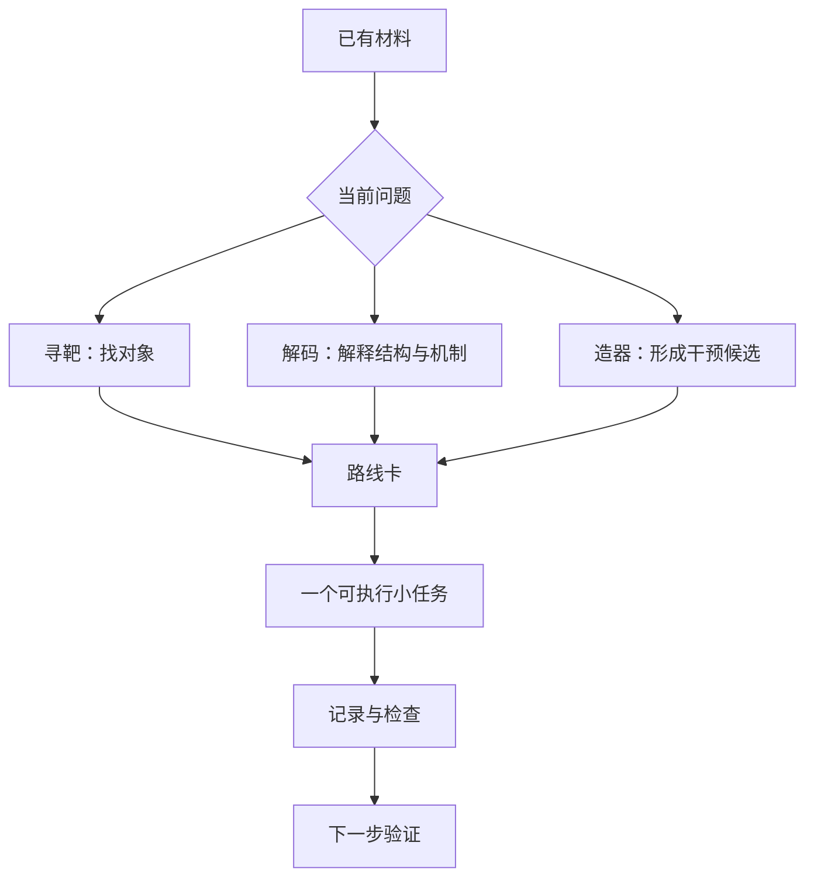
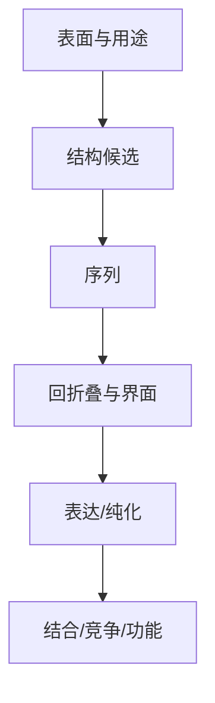

# 第 12 章 研究思路解析与项目工作台

本章把已经做过的操作接回研究问题。你可以从结构、化合物、突变、组学线索或设计目标进入，但第一轮任务要能在现有条件下完成。先写一个问题，再选一项小计算，留下文件与判断，最后安排验证。

本章提供[两张填好的路线卡](assets/data/route_cards.json)、[空白路线卡](assets/data/route_card_template.json)、[字段检查脚本](assets/code/check_route_card.py)、[三种交付模板](assets/data/delivery_templates.md)、[填写示例](assets/data/delivery_examples.md)和[评分表](assets/data/rubric.tsv)。案例 A 是第 3–4 章的 3HTB 三分子任务，案例 B 是第 9–11 章的 PDL1 两条序列流程。



## 12.1 课程方法与研究课题的连接方式

先把问题写成一句可以检查的话。比如“同一受体和网格下，JZ4 的已知 pose 能否复现？”或“固定 PDL1 B 链时，能否为 A 链生成两条序列并保持编号一致？”这两句话分别对应实际输入、操作与验收。

| 起点 | 第一轮问题 | 可接章节 |
|---|---|---|
| 已知靶点和晶体配体 | 准备与搜索是否能复现 pose | 第 2–4 章 |
| 已有复合物 pose | 在所选模拟条件下怎样运动 | 第 5–7 章 |
| 候选分子与数据标签 | 模型如何排序，测试划分是否合理 | 第 8 章 |
| 靶标表面与设计目标 | 如何生成、配序列并复核 | 第 9–10 章 |
| 多个重复任务 | 怎样保留每个输入的执行记录 | 第 11 章 |

路线卡先填已有证据，再填研究假设。证据栏写来源和观察，假设栏写准备检验的解释，操作栏写下一次执行。三栏分开后，能看清第一轮到底补哪一项信息。

| 字段 | 3HTB 已填案例 | PDL1 已填案例 |
|---|---|---|
| 问题 | JZ4 pose 复现与三分子输出完整性 | 固定靶标，生成两条可追溯序列 |
| 起点 | 3HTB 晶体配体与 CCD 数据 | 官方 RFD3 final model |
| 实际操作 | 准备结构，CPU Vina | 读骨架，CPU ProteinMPNN |
| 当前状态 | 三分子 CPU 批次完成 | 两条序列和同候选 GPU 回折叠完成 |
| 下一步 | 人工 pose 复核和协议审查 | 复核相对取向，安排独立预测与实验 |

进入 `chapter-12/assets`，先读取填好的卡。

```powershell
Set-Location C:\coursework\ai-md\downloads\chapter-12\assets
python code/check_route_card.py data/route_cards.json
```

两行都应显示字段齐全。随后打开空白卡，先填写 `task_id`、`question` 和 `starting_evidence`，保存副本后检查。终端会指出仍缺哪些字段；按提示继续填写直到完整。

## 12.2 正向虚拟筛选项目路线

正向筛选从一个靶标面对多个分子。基础路线先用已知晶体配体核对准备和搜索，再扩大配体数。本书的起点是 3HTB，参照为 JZ4，练习批次另外加入 IPH 和 BNZ。

| 第一轮步骤 | 现成操作 | 交付文件 |
|---|---|---|
| 输入准备 | 第 3 章公开 PDB/CCD 准备脚本 | 受体、配体、网格与来源 |
| 单个参照 | 第 4 章运行 JZ4 | log、pose 和 RMSD |
| 三分子批次 | 同受体、网格和参数 | 三行结果及三个 log |
| 人工复核 | 叠合晶体参照，观察三种 pose | 截图、相互作用与异常记录 |

已完成案例使用 Vina 1.2.7、CPU=2、seed=20261002、exhaustiveness=16。JZ4 模式 1 score 为 −7.190 kcal/mol，晶体坐标系内无拟合的对称性重原子 RMSD 为 0.4946 Å。把这两个字段分别放进“打分”和“pose 复现”列，再检查自己的输出。[第 4 章真实结果](../chapter-04/assets/results/3htb-cpu-seed20261002/docking_results.tsv)

扩大筛选前，先回答三个问题：受体准备是否适合当前口袋，配体化学状态如何确定，哪些 pose 值得复核。再按问题选择 interaction fingerprint、strain energy、MD 或结合能分析，资源记录也随之更新。

| 文献案例 | 阅读时寻找的流程 |
|---|---|
| [APE1 研究](https://doi.org/10.1038/s41598-026-51975-0) | 从 1,529,230 个小分子进入 re-docking、IFP、strain energy、MM/GBSA 和 MD 的筛选步骤 |
| [UXS1–metformin–plantainoside 研究](https://doi.org/10.1002/advs.202510542) | 代谢与机制线索、虚筛、高内涵、细胞、rescue 和动物模型怎样连接 |
| IDO1 | ChEMBL 标签、scaffold split、nested cross-validation、适用域、ensemble docking 与 MD |

IDO1 方法案例的 DOI 为 [10.1021/acs.jcim.6c00967](https://doi.org/10.1021/acs.jcim.6c00967)。阅读案例时各选一个“决定淘汰候选的步骤”，写明所需输入和判断字段，再考虑是否适合自己的三分子任务。

## 12.3 蛋白互作虚拟筛选项目路线

若起点是一个蛋白和若干候选互作对象，先整理候选来源。把共表达、通路关系、共定位或已有互作实验写进不同列，结构预测任务随后才有明确对象。

| 候选表字段 | 第一轮填写方法 |
|---|---|
| 对象 | 蛋白名、序列 ID、转录本与结构域 |
| 来源 | 数据库、文献、组学或实验 |
| 空间条件 | 细胞位置、组织和可及结构域 |
| 计算任务 | 选择 2 个候选做复合物结构检查 |
| 复核 | 界面位置、置信度与重复预测 |
| 验证 | pull-down、Co-IP、竞争、突变或功能读数 |

零基础练习先整理两对公开候选的输入卡，核对两条序列及链名。需要跑模型时，先运行一个小复合物并保留完整结果；再用相同协议比较第二个候选。路线卡应写出哪一个界面残基可用于后续突变检验。

## 12.4 疾病靶点 binder 设计路线

从设计目标进入时，先明确要阻断、标记还是递送，再选择靶标表面。本书已有的 PDL1 路线把官方骨架、实际序列和真实同候选回折叠连在同一记录中。

| 路线卡项 | PDL1 已填内容 |
|---|---|
| 结构起点 | 官方教程 final model，A=77 aa、B=114 aa |
| 本次计算 | CPU ProteinMPNN，固定 B、设计 A |
| 参数 | seed=37、temperature=0.1、两个样本 |
| 实际输出 | 两条 FASTA，score=1.0529 与 0.9849 |
| 回折叠 | Boltz 2.2.1，两链均为单序列，两个样本 completed |
| 几何比较 | A 自身拟合 RMSD 1.72/1.40 Å；按 B 对齐后 A RMSD 16.38/4.81 Å |
| 第一轮资源 | CPU 两条序列；GPU 任务另行安排 |

打开候选队列，核对两条输入与 FASTA。再读取[同候选分析表](../chapter-10/assets/results/boltz-refold/analysis/refold_summary.tsv)和叠合图：两条候选的内部折叠较接近，固定靶标参照后的偏差却不同。候选 1 先退回界面复核，候选 2 列入优先检查；路线卡写清各自计算理由，再列独立结构预测、表达和结合实验需要的输入、对照与读数。

[BabA 预印本](https://doi.org/10.64898/2026.05.24.727452)（`zhu_novo_2026`）展示了更大批次的计算安排：4 组 hotspot 生成 200 个骨架，初筛保留 12 个，每个骨架设计 64 条序列，经结构回测保留 12 个序列定义候选，部分再进入 docking、PRODIGY 与 100 ns MD。读者可借用它的阶段统计方式，为自己的两个候选记录“进入多少、淘汰多少、为什么”。



第一轮先完成骨架、序列和候选身份。实验计划再根据用途选择读数，例如阻断路线增加竞争实验，标记路线检查背景与交叉反应。

## 12.5 表观遗传与转录因子动态调控方向

如果起点是甲基化、转录因子活性或修饰位点变化，先定位对象和位置。填写基因/蛋白 ID、位点、实验类型、样本及变化方向，再提出一项可以被扰动检验的关系。

| 线索 | 第一轮操作 | 后续验证读数 |
|---|---|---|
| DNA motif | 核对 motif、靶序列与结合域 | EMSA、报告基因、ChIP/CUT&Tag |
| 磷酸化或乙酰化位点 | 定位结构与邻近界面 | 位点检测、成对突变、功能 |
| 转录活性差异 | 整理靶基因和条件 | 扰动后的表达与功能变化 |

学生先选一个公开位点或 motif，写出数据来源和编号。在结构中显示这个位置，记录它距已知功能区域的关系，再写一个能区分两种解释的实验。例如比较位点变体与野生型的结合读数，并保留表达量对照。

## 12.6 单细胞、空间组学与定制化蛋白设计方向

从组学候选进入设计时，先确认在哪些细胞和组织看到信号。路线卡列出样本、细胞类型、表达位置与候选用途，再判断是否有可用于建模的表面或结构域。

| 候选线索 | 要补的起点信息 | 可接的任务 |
|---|---|---|
| 膜蛋白表达 | 膜定位、正常组织分布、外露结构域 | 表面定义与 binder 输入卡 |
| ligand–receptor 候选 | 两种细胞的位置与组分 | 复合物输入与界面假设 |
| 分泌因子 | 分泌、局部浓度和作用细胞 | 结合或阻断候选路线 |
| 空间邻近 | 区域、细胞距离和重复样本 | 明确验证场景与读数 |

基础练习选一个公开候选，填写“对象、细胞、区域、用途、结构入口”五项。若准备设计阻断分子，再补上需覆盖的功能表面及竞争实验；若准备做探针，则补上正常组织对照和背景信号。

## 12.7 临床突变与 PTM 修饰机制分析方向

变体分析先采用成对比较。给野生型和变体相同的结构模板、准备协议和分析条件，记录唯一改变的残基或修饰。

| 第一轮任务 | 保存的材料 |
|---|---|
| 位点定位 | 序列编号、结构编号与对应关系 |
| 构建两种模型 | 野生型/变体结构和共同参数 |
| 检查局部环境 | 电荷、空间接触、氢键与邻近组分 |
| 安排比较 | 结合、稳定性或功能读数与对照 |

先做一次结构显示，圈出变体与最近功能区域。再写出需要的比较指标，避免只列出所有软件名。若后续安排 MD，两组模拟条件与分析区段也要一致。

UXS1–metformin 案例把位点磷酸化、代谢组、敲除、rescue、虚筛与体内外验证放在同一研究流程中。阅读时摘出一个“检测 → 扰动 → 功能”组合，再将自己的位点问题接到相应验证。

## 12.8 酶设计与蛋白质工程方向

酶工程先选一个明确目标：稳定性、底物谱或催化效率。目标决定第一轮任务与实验读数。

| 目标 | 第一轮计算 | 下一步读数 |
|---|---|---|
| 提高稳定性 | 保守性与局部结构检查 | 表达、热稳定性与活性保留 |
| 改变底物谱 | 两个底物的口袋接触比较 | 转化率、Km、kcat 与底物范围 |
| 解释催化 | 催化原子几何与反应假设 | 变体、动力学、同位素等 |
| 从头设计 | theozyme 输入卡与 scaffold 条件 | 表达、折叠、酶活及迭代 |

零基础作业只选择一个酶、两个底物和一个问题。先检查结构中的催化残基和辅因子，再写清拟比较的读数。需要机器学习时，额外写出标签、同源序列处理和测试划分；这些字段决定模型比较是否可复查。

## 12.9 反向虚拟筛选与靶标酶发现方向

反向筛选从一个分子面对多个靶标。候选靶标可由已知活性、通路、结构库或公开表型研究形成。先缩小到两个有结构、能解释作用场景且具备验证条件的对象。

| 候选记录 | 应填写内容 |
|---|---|
| 来源 | 结构、通路、文献或数据库 |
| 场景 | 组织、细胞位置和表型关系 |
| 口袋 | 参照配体、保留组分与准备方案 |
| 计算 | 每个靶标各自的验证与对接协议 |
| 验证 | 结合、酶活、扰动与 rescue |

两个不同靶标的 score 表旁边，各保留它们的口袋、参照和准备记录。先检查每个任务的 pose，再结合场景与实验可行性形成优先级。基础作业交两条候选靶标路线，不要求把库扩大到几百个。

## 12.10 文献案例、项目池和下一步实验

路线卡写好后，选择一种交付形式：研究计划、方法比较或执行记录。三种模板已提供[空白稿](assets/data/delivery_templates.md)与[填写示例](assets/data/delivery_examples.md)。研究计划明确问题、第一轮任务和对照；方法比较明确同一协议下的比较字段；执行记录保留输入、参数、实际输出与下次修改。

| 作业项 | 满分 | 可检查的交付 |
|---|---:|---|
| 问题和起点 | 4 | 可检验问题及可访问来源 |
| 输入和协议 | 4 | 身份、版本、参数和单位 |
| 实际执行 | 4 | 日志、输出与未运行状态 |
| 判断和排错 | 4 | 结构/数据检查及一条排错记录 |
| 下一步验证 | 4 | 对照、读数、资源与停止条件 |

总分 20，具体条件见[评分表](assets/data/rubric.tsv)。提交前用字段脚本检查一遍，再人工沿着“路线卡 → 输入 → 日志 → 输出 → 判断”走一遍。字段齐全后仍需检查内容是否与真实文件对应。

第一周先完成一张卡和一个 CPU 小任务；第二轮只改变一个明确条件。若下一步需要 GPU、实验材料或更多数据，写出要补的资源与验收，当前记录继续保留。这个安排让学习者可以从已有电脑和少量输入开始，逐步扩大工作。

## 本章使用说明

路线卡把观察、假设、计算任务和验证分开记录。组学、数据库关系、共定位与结构预测提供不同类型线索；单项计算分数不能证明直接互作、因果机制、临床致病性或疗效。文献案例的结果属于各自研究系统，本书实跑结果只对应所列输入和协议。3HTB 练习完成 CPU 对接与 pose 比较，PDL1 练习完成序列设计和两条同候选回折叠，尚未做表达、结合或功能实验。用于研究时还应补齐生物学场景、实验对照和验证读数；未完成项继续保留空值或明确状态。

文件来源与改写方式见[资产来源表](assets/provenance.tsv)。交作业时附自己的路线卡、实际文件清单和下一步验证计划，让接手者能从同一个起点继续工作。
